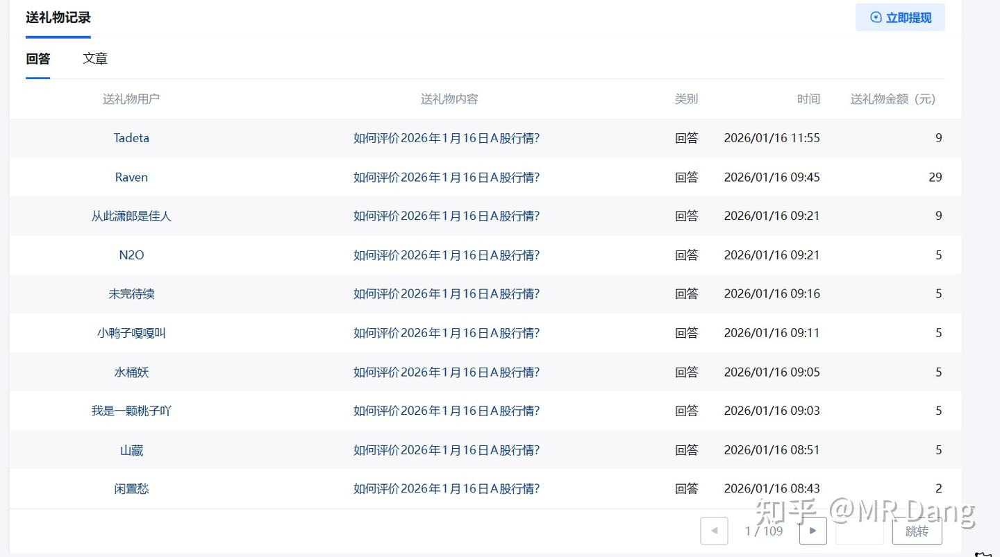

# 五万粉感言

---

**发布时间**: 2026-01-17 07:03  |  **原文链接**: https://zhuanlan.zhihu.com/p/1994691183117612190  |  **点赞数**: 2555 人赞同

**作者信息**: MR Dang独立投资人，不接广不卖课

---

## 正文内容

从四万粉到五万粉也太快了，给我整不会了，手忙脚乱的赶紧码字。

有粉丝说想听心路历程，这个可以有，但现在时机还不成熟，等以后十万粉或者出书或者更有仪式感的场合再给大家伙分享。

今天就说点实用主义的东西。

它属于非常容易理解，甚至说大家都懂的道理，但是就是到用的时候就忘记掉了。

它对我们的投资，我们的学习，我们的职业规划的大方向，都非常有指导意义。

这个东西，叫做嗯。。。蓄积效应。

没听过？

没听过就对了，这词虽然不是我造的，但是我在这里赋予它新的内涵和定义。

蓄积效应就是指，一件事物前期的发展对后期的结果有必然的正相关影响。

这是我给出的定义，我把所有符合这一现象的事物，都称作有蓄积效应。

那我们开始在各个方面用它了。

1.投资领域.

这个是最重要，最基础的应用领域。

A.我经常用商业模式来描述一家企业的好坏，之前有写过：

[[20251025-《地阶功法卷三》商业模式评估|商业模式评估]]

在之前的商业模式里，为了大家好理解，我用N求来对企业的商业模式进行划分。

这个属于结果，如果细究商业模式形成差距的原因，那么有一条划分标准是一定绕不开的：

企业的商业逻辑是否有蓄积效应。

具体点说，有蓄积效应的未必是好的商业模式。

但是没有蓄积效应的一定是不好的商业模式。

举个例子：

房企，看起来膀大腰圆，挥金如土。

但是你仔细一研究就发现了，房企挣不挣钱，完全看拿的那块地的条件。

地块好，拿地价低，楼面价便宜，哪怕是三线本地小房企也能赚大钱。

地块差，配套差，楼面价高，哪怕是一线品牌的大房企也回天乏术。

所以一家房企，哪怕前些年踩中风口拿了很多好的地块，但是一旦开始乱拿地，立马就走下坡路，甚至直接就暴了。

前面挣得再多，对未来的盈利都没帮助，每一块地都是从0开始。

体现在财务报表上就是净资产很虚，看起来一大堆，说没就没了。

这种就是典型的没有蓄积效应的商业模式，很差。

反过来，银行就是有蓄积效应的商业模式，挣了钱，通过杠杆可以产生复利。

前面挣得越多，未来就挣得越多，钱生钱，利滚利。

所以如果有人说买银行股不看净资产就是反常识的。

银行的净资产可不是瓶瓶罐罐，桌椅板凳，大部分要么是真金白银，要么是对外的债权，要么是有价值的抵押物，不看净资产看什么呢？

同理，投资的时候，有的净利润可以用PE估值，是因为有蓄积效应。

有的利润只能用PB估值，是因为没有蓄积效应。

这里其实还能展开，碍于篇幅所限，以后再说。

B.除了商业模式，还有就是投资和投机的区别也和蓄积效应有关。

大家想一想，追热点，打板这种投机行为有没有蓄积效应？

没有啊，你今天打了个涨停板，能保证下次还能打涨停板么？

它没有持续性啊，投机的本质和房企拍地没有区别，朝不保夕。

但是价值投资呢？

你今天买的股，分的红，还能用来复投。

今天挣得越多，买的股票越多，未来就分的越多，它是有明确预期的。

高股息的投资策略就是有蓄积效应的，你买入的每一手股票，每一次加仓都不会白费。

当然，也有个别善于投机的投资者，可以在投机的时候，搭建信息网络，建立人格化的识别度。

号召更多的韭菜跟风，最后利用资本市场的自我实现功能，再次加强自己的交易共识。

这样就算实现了投机的蓄积效应，完成了商业模式的跃迁。

通过文字描述，一定有几个名字萦绕在大家的脑海中了，以后想跟风炒作的时候希望大家能记起来这段话。

2.职业选择

把蓄积效应用在职业选择上，也会是一个很好的评价标准。

选择职业的时候，一定不能只看收入，福利，工作时长这些，还需要考虑是否有蓄积效应。

越好的职业，蓄积效应越强。

什么科级，副处这类明面上有蓄积效应的职业就不提了。

还有些职业有隐藏的蓄积效应，比如法务工作者，医务工作者之类，对职业经验都是有要求的。

因为他们的蓄积效应强，所以很难被后来者追上。

随着体力精力的下降，收入和社会地位反而上升。

当职业的蓄积效应强到一定程度后，甚至可以超越生命本身，达到代际间的优势延续，这种就算是相当顶级的职业了。

那么与此相对的，有那么一个职业，不但没有蓄积效应，而且新手比老手要吃香的多。

新手接第一单的时候有很高的新手溢价，随着年龄的增长，职业经验的增加，收入会不断下降。

不是走头无路，就不要选这个职业，高收入和低成本只是表象。

而更多的职业则是处于两者之间，也就是蓄积效应不明显，比如送外卖，送快递，网约车这种铁人三项。

新手和老手就差几个月的经验，熟悉之后很难再通过前期的经验获得超额回报。

作为没办法的临时过渡是可以的，但如果有选择，还是最好考虑下有积蓄效应的职业。

3.学业选择

只讨论国内应试教育体系下普通家庭普通孩子的学习路径。

在选择需要习得的技能时，普通家庭普通孩子最好选择有蓄积效应的技能，比如书法，英语，体育之类的，尽量避免一些奥数，编程之类的。

当然具体孩子还是要根据自身情况扬长避短，家长是孩子学习规划的第一责任人，一定要提升自己的认知水平，不要被一些卖课广告忽悠了。

鉴于每天新增2K+粉丝的速度过于离谱，很多粉丝应该都是新来的，咱们再对齐一次颗粒度。

（非荐股，仅解释各个标的外号，直接输入软件就出来对应标的）

铜王：ZJKY （已止盈）

钾王/锂王：YHGF

磷王：YTH

铝王：ZGHQ（港股）

锡王：XYGF

铝王平替：HCKG 改名后 HQKG

塑料王:BFNY

海金王:ZJKY(港股，招字开头）

低价铝：NSLY（已止盈）

金店：CBGF（已止盈）

药店：DSL

佛光普照：JHLY

量王：GDLZ（已止盈）

小车车：TLGF(北交所）

（量王，小车车再加一个ZHKJ组成了邪修三剑客）

小东：DXZQ

存储：BWCC（新增角色）

这些是有外号的，还有一些没有外号的.

比如银行一般特指HX银行，农药就指GGGF，BT指芭田。

以上大概就是常见出场角色，还有一些偶尔出场的客串角色，比如：

银王:XYYX

煤王:ZGSH

接下来每次例行的最重要的百万提示：（复制粘贴上次的，看过的直接PASS)

财富积累的过程就是小学的四则运算：加，减，乘，除。

加法就是打工，再高级的打工也是加法。

减法就是日常消费，再贵的日常消费也是减法。

乘法就是投资。

除法就是贬值。

1.加法一开始的积累速度远超乘法，0×任何数＝0，所以财富原始积累一定要趁早，你早早的积累财富，所有积累的财富都能享受到你后面给的乘法BUFF。

2.减法放在乘号之前的时候，要尽量的少，这样财富积累的过程才能更快。也就是人生的起步阶段可以适当的减少些不必要的消费。

3.乘法最重要的是要稳，不要让乘号后面那个数字小于1。你乘几都行，重要的是不能小于1，也就是控制回撤。

4.不要让你的所有资产后面都加上除法，比如你把所有资产买成车子，那你的所有资产每年都在做除法。

通过你的四则运算得到第一个100万的时候，你的资产每年乘法增加的财富就有可能会超过减法需要的生活成本。

你的财富就会自己滚起来，从而不需要加法的参与，把你初步的从温饱里解放出来。

一定要重视！！！

最后这段给大家报告一下我做自媒体的一些数据吧。

其实我也是第一次认真看后台数据，一些东西也不太懂。

不过我估计有人会好奇，因为我以前不当博主的时候好奇过别的博主的。

7天147万左右的阅读量，1万多赞，6500+评论。

感谢各位的小手一抖，赞个不停，一鞠躬。

喜闻乐见的投喂收入，没有加总的数据，不过平均就算一杯咖啡吧，合计大约191页，1910人次，大约一万元左右，折合1500股银行，爱了爱了。

感谢大家送来的投喂，提神咖啡让我核动力写个不停，二鞠躬。

这个应该是知乎奖励的写作收入，写作以来合计653.44元，大概每天5元。

这个是氪金的收入，税后大约9.5W。

付费咨询这个功能我很纠结，有时候开着会接到奇怪的要求，忙不过来，不得不主动关闭。

有时候关了会接到真实的需求，但是由于读者对这个功能的不熟悉，而找不到入口。

所以就时开时关，有时候关了忘了开，有时候开了忘了关。

以上收入合计大约 10.6W左右，折合大约1.6万股银行股。

按照去年10月开始认真写作计算，大约耗时4个月，写作20万字。

当然这个是我比较佛系，没有主动变现和商业化运作的前提下实现的，如果一般的以此谋生的博主，在我的写作数据上，应该可以把变现金额再×2。

以上都不是最重要的，我在知乎写作以来，最大的收获:

当然是屏幕前的你们啦，来自五湖四海的大家，因为最朴素的搞钱愿望汇集在了评论区。

一张张笑脸生动而鲜活，一句句评论真诚又暖心。

感谢大家的关注，三鞠躬。

到这里就结束了么？

还有没有其他要说的？

有的，兄弟，有的：

今当乙巳岁末，临屏疾书，谨陈感激之诚，愿与诸君同鉴。

昔日诸葛有言，庶竭驽钝，攘除奸凶。

某虽无诸葛之才，然承诸君不弃，

亦愿以钝笔为汉剑，共破市场迷障。

此缘之深，虽江湖万里不敢忘也。

又有诗云，知我者，谓我心忧，不知我者，谓我何求。

诸君非徒观者，实为某砥砺之师，金石之交。

今虽暂得关注之众，然某常怀履薄临渊之惧。

凡有所得，必速呈于诸君，

无分牛熊，始终如一。

守真之言，不夸收益以诱人。

拒妄之行，不隐风险以沽名。

但求仰不愧于天，俯不怍于人。

恰逢新春将至，愿与诸君再启新程。

市场虽艰，然某深信：众智所趋，山海可平！

待千帆过尽，回望灯火，仍是最初同舟之心！！

暂定下次感言为8万粉和10万粉，再次鞠躬。

一个喜欢保护韭菜的博主，希望大家少少踩坑，多多赚钱！

---

## 精选评论

> [!comment]- 点击展开评论

| 用户 | 时间 | 内容 |
| :--- | :--- | :--- |
| 奥特之父 |  | 广东股民都督 |
| &nbsp;&nbsp;&nbsp;&nbsp;MR Dang |  | 哈哈哈，好贴切 |
| 百万粉丝 |  | 还记得十月刷到您第一条文章时的惊喜，转眼已是5万粉的里程碑。这四个月像跟着一位宝藏导师边学边玩，每次更新都让我感叹'原来知识还能这样有趣'！真心感谢遇见，愿您继续用才华照亮更多人的成长路。感谢遇见 |
| &nbsp;&nbsp;&nbsp;&nbsp;MR Dang |  | 谢谢原始粉丝的陪伴 |
| 如来熊掌 |  | 其实很早就刷到过老师，当时并未关注，因为知乎讲投资的博主太多，讲的都头头是道，言之有理。但是从老师开始写地阶功法发现不对，这个博主是真的从幼儿园开始教，而且都是认识字就能看懂的道理和逻辑。等看到天阶第一卷时又发现不对，这不是手把手教，这是追着喂饭！毫不犹豫跟着下了重注，我搞投资不行，但是看人还是可以的。老师的出现完美解决了行业大佬、免费、教真东西这个不可能三角，祝老师今后股票长红，全家健康，继续带着我们小韭菜吃肉喝汤 |
| &nbsp;&nbsp;&nbsp;&nbsp;MR Dang |  | 谢谢认可，来自老粉的认可总是让人心头一暖 |
| 小菜希 |  | 小米和顺丰咋看呀 |
| 威猛的小老虎 |  | 感谢分享经验与见解，昨天看书读到一句话:如果聪慧与生俱来，慷慨和仁慈则是他们的选择。谢谢 |
| &nbsp;&nbsp;&nbsp;&nbsp;MR Dang |  | 谢谢支持 |
| 两个元 |  | 感谢分享经验与见解，昨天看书读到一句话:如果聪慧与生俱来，慷慨和仁慈则是他们的选择。谢谢。赞老师和这位。 |
| &nbsp;&nbsp;&nbsp;&nbsp;MR Dang |  | 谬赞了 |
| 鱼一梦 |  | 在知乎亿万资产大佬给我三鞠躬，喊我兄弟，在现实中百万小小佬对我都不屑一顾回敬恩师三鞠躬 |
| &nbsp;&nbsp;&nbsp;&nbsp;MR Dang |  | 谢谢bro |
| 慎独 |  | 我看到了大佬的粉丝分布图，内地就两个地方亮点，大部分粉丝集中在经济发达的沿海城市，感叹内陆和沿海城市差的除了实体经济，对财富的积累和认知差距也是不小。相对应的个人和家庭对待投资的理念也是天差地别，感谢大佬的投资指导，让我这种困顿于自我认知及周围环境局限的人有了走在正确道路的可能，感谢 |
| &nbsp;&nbsp;&nbsp;&nbsp;MR Dang |  | 谢谢关注 |
| 念你如初 |  | 自蒙师引，股海舟楫顿易。昔临渊履薄，今从容观涛。先生授我以柄，非止析K线之玄机，更传守拙之大道。三月观盘，方悟"不惑于涨跌者，乃能驭涨跌"；半载收益，始信"善战者无赫赫之功"。感念至此，惟作揖云：幸甚至哉，得遇明灯。我师点拨处，常现骊珠之光他日持守时，每见金石之策数字升沉皆成文章方寸涨跌俱含天地！ |
| bobArch |  | 用老师的回答做了一个知识库，生成了一张图片 |
| 陈阿呆 |  | 早，最近常常问自己，这些都是我可以免费学到的知识和视野吗 |
| &nbsp;&nbsp;&nbsp;&nbsp;MR Dang |  | 谢谢关注 |

---

*本文件由自动脚本从MR Dang知乎页面提取生成*

---

**作者**: MR Dang
**链接**: https://zhuanlan.zhihu.com/p/1994691183117612190
**来源**: 知乎

*著作权归作者所有。商业转载请联系作者获得授权，非商业转载请注明出处。*

---

## 相关阅读

**感言系列回顾：**
- [[20251227-四万粉感言|四万粉感言]] - 财富锚的选择：金、钱、人、物、股、债的六大锚定方式
- [[20251122-三万粉感言|三万粉感言]] - 关于房子、票子、孩子的人生三大决策
- [[20251108-2.5万粉感言|2.5万粉感言]] - 早期感言回顾
- [[20251028-两万粉感言|两万粉感言]] - 第一个100万的重要性

**地阶功法系列：**
- [[20251025-《地阶功法卷三》商业模式评估|《地阶功法卷三》商业模式评估]] - 用"求"字诀看透商业模式：三求、两求、一求、零求
- [[20251023-《地阶功法卷二》价值投资三大误区|《地阶功法卷二》价值投资三大误区]] - 迷信财报、盲目长期持有、低估值陷阱
- [[20251022-《地阶功法卷一》投资者必须斩杀的三个妄念|《地阶功法卷一》投资者必须斩杀的三个妄念]] - 损失厌恶、从众心理、锚定效应

**投资方法教育：**
- [[20251013-什么是投资思维？普通散户该如何培养？|什么是投资思维？普通散户该如何培养？]] - 投资眼光与避坑指南：老师、战法、天降
- [[20251111-明明长线比短线更容易赚钱，为什么散户更加执着于做短线？|明明长线比短线更容易赚钱，为什么散户更加执着于做短线？]] - 长线vs短线的心理学分析
- [[20251103-高学历的人炒股，痛苦的根源是什么？|高学历的人炒股，痛苦的根源是什么？]] - 知识与投资的悖论

**天阶功法系列：**
- [[20251024-《天阶功法卷一》BFNY价值投资分析|《天阶功法卷一》BFNY价值投资分析]] - 顶层设计→商业模式→财务分析印证的完整案例

**🔙 返回：**
- [[万粉感言]] - 万粉感言系列总览
