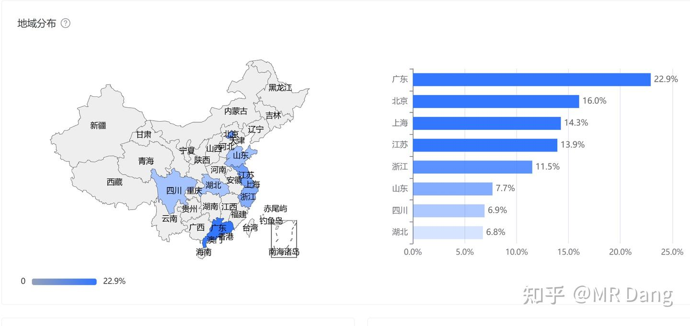
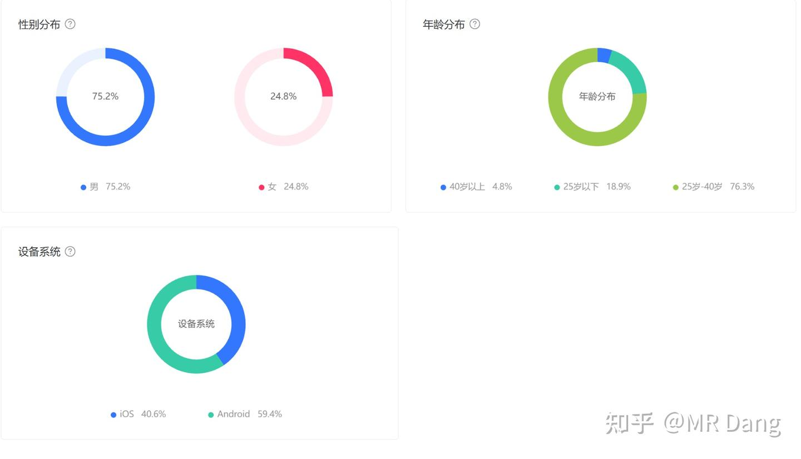

# 置顶十万粉感言

---

**发布时间**: 2026-02-01 07:16  |  **原文链接**: https://zhuanlan.zhihu.com/p/1999937427314335878  |  **点赞数**: 1117 人赞同

**作者信息**: MR Dang​独立投资人，不接广不卖课，无任何其他平台，无小号。

---

## 正文内容

9.2万粉发十万粉感言实在是有点惴惴不安，不会立下反向FLAG吧。

不过事到如今也只能硬着头皮写了，希望不要打脸来的太快。

全文分五部分，合计5500字。

第一部分：新读者必读

5万粉到10万粉之间的速度太快了，所以目前的粉丝结构上，有一小半都属于新读者。

为了照顾到新读者的感受，需要打打基础，我挑了一些往期适合新手投资者的内容：

不要追热点：[[20251016-投资新手避坑指南之追热点(万粉特别奉献)|追热点点这里]]

这个是新手容易犯的错误。

大跌怎么办：[[20251011-下周一股市就要大跌了，作为投资者该如何应对？|大跌点这里]]

这个比较应景吧，需要强调的是跌的时候一定一定不要随便加仓。

不要赌财报：[[20251029-新手投资者避坑指南之不要赌财报|赌财报点这里]]

怎么算股息率：[[20251031-新手投资者避坑指南之测算股息率|算股息率点这里]]

这个是基础功法。

分红和除权：[[20251118-新手投资者避坑指南之分红和除权|分红除权点这里]]

配合上面的股息率一起食用效果更佳。

超有用的交易细节：小细节点这里

真的超有用，新手必看。

仓位控制：[[20251020-投资新手避坑指南之仓位控制|仓位控制点这里]]

风险控制的基本功，新手必看。

修炼是要循序渐进的，所以这些基础需要打牢。

不然就是鸡同鸭讲，我讲城门楼子，你讲胯骨轴子。

现在外面还有很多我的二创文字，二创视频，包括各种整合资料等等。

我得声明一下，除了这个号，任何其他地方的观点都不是本人的观点。

目前没有任何其他平台和小号。

我所说的东西仅仅是我对行业，市场的看法，并不构成直接的投资建议。

现在基本功的颗粒度对齐了。

咱们说说新手投资者最大，最普遍的一个问题：极端化。

极端化体现在哪些方面呢？

1.仓位上：要么是打满，要么是一件清仓，要么是满仓满融，要么是全部空仓。

2.态度上：买进持有的标的是毫无缺点的股票，到了卖出去的时候就是浑身毛病。

3.情绪上：涨的时候情绪亢奋，看不到危机;   跌的时候情绪低落，看不到希望。

4.立场上：持有的时候是公司的代言人，听不得半点批评；没有仓位的时候就是福尔摩斯的放大镜，鸡蛋里挑骨头。

但实际上，投资不是非黑即白的二极管，而是无级调节的灰色领域。

仓位不是只有满仓空仓两个选项的判断题，而是调节音量的加减键。

所谓的好公司，只是你忍受了它的缺点，就像你包容了你爱的那个他/她。

如果做一个直观的比喻：

恰如你反复擦拭屁股，只是接受了纸巾上残留的颜色越发的清谈而已。

而那并不是完全的干净。

投资要做的事情和擦屁股是相似的：

反复衡量其中的风险和收益，然后配置与之相当的仓位。

就像思考要用掉几张纸一样，要视情况随机应变，不可拘泥于定式。

这就是投资的基本原理。

第二部分：热门问题Q＆A

Q1:博主博主，你为什么要免费分享这些东西？有什么企图？

因为想帮助到一些刚接触股市，但是被一些不好的价值观灌输，最后巨额亏损的人。

我分享的知识不是什么独门秘笈，也不是什么暴富捷径，只是一些我觉得投资中正确的事。

很多人不笨，不懒，只是因为不得要领而损失惨重，他们需要一件基础武器去对抗这个市场。

虽然我给的这些方法论也不是什么神兵利器，但是总好过手无寸铁，毫无方向。

新手投资者值得更好的东西。

而且我没有那种零和博弈的思想，不会觉得别人多赚钱了，就把我的钱赚走了。

反而觉得如果有更多人可以掌握我的方法，就会加快价值发现的速度。

以前我一年可能也就价值发现一只标的。

而现在大家的认知提升了，可能价值发现的效率就会增加，加速这一进程。

吾道不孤也。

当然硬要说现实原因的话，其实也是有利可图的，比如付费咨询的收入，也算是知识变现，还有各位的打赏等等，所以也不是完全意义上的免费。

Q2：博主博主，你投资经验有多久了，可以简单的聊一聊么？

这个其实我之前回答过，我是比较罕见的股二代，咱们国家资本市场开放的晚，像我这样的股二代属于稀缺物种。

如果从第一次被问起：“这些股票里你要买哪个？”开始计算，我的投资经验有27年了。

那次我选了人生中第一只股票，12块的云南白药，从cctv2财经频道下面循环播放的一众代码里。

因为只有那几个字比较简单，我看的懂。

如果从第一次看财报，第一次有逻辑的购买股票并且让家人代持开始计算，我的投资经验有26年了。

也就是仅仅过了一年后我就认识了非常多的字，真正的开始投身资本市场，我的童年读物除了《西游记》白话本之类的，更多的是一摞摞的《证券时报》《中国证券报》。

大概有几百斤吧。

那个时候家里地方小，报纸摞在地上比我个子都高的多，得踮起脚尖才能够得着最上面。

所以很多A股的历史事件我是可以和很老很老的股民无障碍交流并且如数家珍的。

比如1996年的12道金牌，1999年的519行情，03年的德隆系三驾马车，05年的股权分置改革，07年的6124历史大顶，08年的四万亿，10年的两融，13年的光大乌龙指，15年的杠杆牛，16年的熔断等等。

碍于年龄，96年前面的股市只能是道听途说，但是以上这些可以说是历历在目。

Q3:博主可以分享下心路历程么？

首先，我要明白的告诉大家我不是股神，因为我见过真的股神，连续33年，平均复合年化收益率20%+，巅峰的时候接近30%。

这个还是扣除重大生活开支比如买房后的收益率，真实收益率只会更高。

而我的底色是个小亏货。

我自认聪明，自认勤奋，自认情绪管理还可以，但是总不得要领。

从小就毫无方向，一直在试图理解这个抽象的市场。

像什么庄家，控盘，看名字买股，不是什么新发明，自古有之。

我一直困惑于投资的不确定性，无论是赚钱还是赔钱，都稀里糊涂的，感觉是一叶扁舟。

而我这个人特别执着于逻辑。

非常想找到资本市场的运行规律，找到那个让我可以安心赚钱，放心持股的逻辑。

我花了十几年，确认了一件事情。

就是这个资本市场，有两套运行规律：

一套是咱们这边特色的，信息差模式。

一套是所有资本市场都有的，价值投资模式。

两套是同时运行的，所以咱们的资本市场就是这两套模式的叠加量子态。

大部人想参透其中的规律时候，就会被另外一套运行规律影响。

比如按照价值投资计算的业绩，明明是利好，股票应该涨。

但是因为有人提前知道了，他会趁这个机会跑路，最后股票反而下跌。

比如按照价值投资计算的估值，一些企业明明没有多大的投资价值。

只是因为名字取得好，反而吸引了很多人投机，推高股价。

这就导致很多理想主义者道心破碎，三观被市场驯化，最后成为随波逐流的大多数。

当我明白这个道理后，我就开启了过滤模式。

不去看那些烂人烂事烂股，他们玩他们的，我玩我的，互不打扰。

但是很多新手投资者会被拙劣的演技吸引过去，所以我不得不反复的劝诫，提示风险。

只专注于自己看得懂的逻辑，看得懂的生意，看得懂的标的。

我经常挂在嘴边的一句话就是看不懂的不参与。

不管是什么股，你看不懂为什么要去参与呢？套住了跑不跑呢？

当你大彻大悟之后，就会发现天地顿宽，虽然还是会失手，虽然还是会看错。

但是只要胜率＞50%，做的足够分散，持续的去兑现这个大于50%的胜率，随着时间的延长，最后的收益会无限趋近于那个胜率。

极限终会收敛，认知终将变现。

在这个模式下，怕的是一棵树上吊死，怕的是一个跟头摔倒再也爬起不来，怕的是走眼一次错付终身。

所以我一直强调分散，仓位管理，分散了才有机会兑现，集中了就只能双手合十跪地祈祷。

Q4：博主你最怕听到的问题是什么?

A:有很多问题其实都挺让人头疼的，但只有一类问题让我束手无策:

为什么XXX涨了？是不是XXXX?

为什么XXX跌了？是不是XXXX?

涨了只能表示买的资金比卖股票的多。

跌了只能表示卖股票的比买股票的资金多。

至于为什么多？那些买股票的人想法不可能一致，一万个人有一万个想法。

所以股票短时间的涨跌大多数时候是没有规律的，没有那么多为什么。

即使问出了那个为什么，也无法为你的下一次决策提供有意义的参考。

由于我之前提到的资本市场的量子叠加状态，你用结果去反推原因，往往是失效的。

用股价去反推基本面，或者用股价走势去强化自己对基本面的认知，都是大忌。

涨的多≠基本面好，跌的多≠基本面差。

Q5:CPA好难啊，如果投资的话，要不要考这个证，需不需要学？怎么学？

CPA目前的难度是持续上升的，普通人可能3到4年才能拿下专业阶段，5年左右拿到证。

所以只是为了投资，这个证是没必要考的。

但是可以去学习其中的方法，特别是《财管》和《战略》两科，对普通人理解商业模式有很大的助益。

想考证，就去刷题，没有捷径，只能刷机考题。

不会了带着问题去找答案，刷真题，反复的刷，五遍起，形成肌肉记忆。

想学习，那就没必要，听网课就行了，压力会小很多。

Q6:还有哪些需要看的书籍去搭建投资的基础？

A:除了CPA的全部书籍，还有一些其他推荐过的书籍，以前的荐书环节都有介绍，可以去翻翻。

嗯，另外就是整合我之前写的内容，以及增补一部分内容，我打算写本新书。

目前进度飞快，有国内顶级的团队资源支持，我也会接下来多打磨打磨作品，争取对得起售价。

在思路上，往工具书的方向上靠，希望大家用的顺手。

尽量做到让读者读起来心情愉悦，让没有任何基础的小白也能看得懂，少摔跤，少踩坑，爱不释手。

恭喜你，读到这里已经读完一段植入式广告。

Q7: XXX认为你的XXX观点是错误的，你怎么看？要不要激情对线？

我的回答里有一部分有观点错误，有一部分有事实错误。

我也只是普通人，有错误太正常不过了，人只要在犯错——改正中不断进步，就会持续提高胜率。

我的观点是，只要争取胜率＞50%，然后兑现这个胜率，就能取得不错的收益。

而作为博主，我也从不提及其他博主，特别是有分歧的情况下。

这个老粉应该知道，除了那些毫无底线收割韭菜的柚子，我没喷过任何人。

争论毫无意义，资本市场的分歧只能在资本市场解决。

无法通过资本市场得到的东西通过争论也无法获得，除非你的目的在资本市场之外。

我对自己的要求比较低，只要对的多，错的少，分散持仓，就能不断滚雪球。

专注于自己的净值，偶尔来这里吐个槽，大家爱看是我的荣幸，不想去掺和让人闹心的事情。

Q8：有没有什么操作方面的建议给新手？

正如前文所言，操作不是只有满仓/空仓两个选项。

大部分人对资本市场都是没有把握的。

在不确定的情况下，买标的就像你去品尝一道新的菜品一样，肯定是小口的品尝，确认没问题后再大口朵颐。

所以买的时候慢一点，先买一些，涨了就不要追了，跌了再视情况往目标仓位加。

卖的时候也是的，不要一下就一股不留了，可以留一点做个念想。

这么做的好处是什么？就是不容易心态失衡。

比如你看好一只股票，但是没有买。

它一涨，你一急，然后一追，套住咯。

所以你先买一点，它涨了你就安慰自己已经赚钱了，就不要太贪心了。

卖股票也是，你一卖，它一涨，你一后悔，再追进去，心态又爆炸了。

如果不追进去，看着它一路涨，也很痛苦。

所以你留一点，它涨了你可以安慰自己好歹还有仓位，心态摆正了，就不容易犯错。

跌了就更好了，告诉自己幸好跑了一部分，不然就又要亏钱了。

你按照这个方法操作，任何股票你都可以找到调节自己心态的理由，就会游刃有余，冷静客观，不容易犯致命的错误。

第三部分：每次例行的最重要的百万提示：（复制粘贴上次的，看过的直接PASS)

财富积累的过程就是小学的四则运算：加，减，乘，除。

加法就是打工，再高级的打工也是加法。

减法就是日常消费，再贵的日常消费也是减法。

乘法就是投资。

除法就是贬值。

1.加法一开始的积累速度远超乘法，0×任何数＝0，所以财富原始积累一定要趁早，你早早的积累财富，所有积累的财富都能享受到你后面给的乘法BUFF。

2.减法放在乘号之前的时候，要尽量的少，这样财富积累的过程才能更快。也就是人生的起步阶段可以适当的减少些不必要的消费。

3.乘法最重要的是要稳，不要让乘号后面那个数字小于1。你乘几都行，重要的是不能小于1，也就是控制回撤。

4.不要让你的所有资产后面都加上除法，比如你把所有资产买成车子，那你的所有资产每年都在做除法。

通过你的四则运算得到第一个100万的时候，你的资产每年乘法增加的财富就有可能会超过减法需要的生活成本。

你的财富就会自己滚起来，从而不需要加法的参与，把你初步的从温饱里解放出来。

一定要重视！！！

第四部分：看看新来的大家都从哪里来的

我发现一个挺有意思的事，男女读者大概是3：1，但是评论区几乎是1：1，看来男性读者还是比较怕麻烦的，哈哈，其实我也是，几乎很少在其他地方评论。

不过也有些男读者经常留言把第一次给了我，什么从来不打赏的，结果忍不住把宝贵的第一次给我了。

我谢谢您嘞，下次把话说清楚就好。

第五部份：十万粉陈情书

草芥微躯，本无经纬之才。

蓬门陋质，岂敢妄议涨跌。

自去岁开笔墨于知乎，至今日竟得十万知己。

诚惶诚恐，夜半掠起，未尝不汗湿重衣。

今市场云谲波诡，诸君犹不离不弃，某必沥心剖血，敢不尽言？

某观天时有异：

银山金穴，顷刻成瓦砾之冢，

玉楼朱阁，瞬息为荆棘之地。

每念及此，未尝不中夜推案，仰星观斗。

此非市场之跌宕，实为人心之沸扬，

非美联储一家之祸水，乃杠杆之爆仓也。

某本秦地布衣，耕读于关中。

初涉市道，亦曾效追风逐电之事。

夜对电脑，满屏皆绿，

方悟“敬畏”二字重若千钧。

晨理旧策，乃知“谨慎”一词贵如圭臬。

自开设此栏，战战兢兢，如履薄冰。

每言一策必三验其理。

非不欲与诸君共骋千里，

实恐骐骥失蹄，伤我知己。

然诸君厚爱，甚于春阳。

或留言于深夜，示我未察之机。

或驳论于堂前，醒我混沌之思。

此等深情，无以为报。

今既蒙十万之信，当效郭隗筑台之诚，更戒叶公好龙之伪。

愿诸君且收万丈豪情，暂敛九天鹏翼：

一守仓位于股息，勿使全军没于泥淖；

二分资金于多股，莫效孤注掷于危崖；

三去杠杆如去疴，须知借羽飞行终坠渊；

四留余地似留薪，风雪夜归方有暧粥。

某非圣贤，安能尽识天机？

所持者，惟“不敢”二字而已：

不敢劝人梭哈，恐误儿女膏火之资；

不敢诱人单吊，惧损父老药石之费；

不敢妄言牛熊，畏负君子托付之重。

今当远离躁妄，共守清明，望诸君：

观K线如观潮，可近赏而不可溺；

待盈亏如待客，可尽礼而不可痴；

视涨跌如视雨，可备伞而不可怨。

临表涕零，不知所言。

惟愿山河无恙时，与诸君再煮新茶：

细说那年惊涛里，

大家如何同舟共济，稳渡迷津！！！

某再拜。

一个喜欢保护韭菜的博主，希望大家少少踩坑，多多赚钱！！！

下次感言二十万粉吧，感觉应该能顶一段时间了。

(还有一些偏宏观的研究，结论放在明天的早报，等下就去码字。）

---

> [!comment]- 点击展开评论
> | 用户 | 时间 | 内容 |
> | :--- | :--- | :--- |
> | 马克笔 | 2 小时前 | 偶然认识，惊叹于才华，拜服于人品 |
> | &nbsp;&nbsp;&nbsp;&nbsp;MR Dang | 2 小时前 | 谢谢关注 |
> | 马克笔 | 1 小时前 | 我已经关注您一个礼拜了，从地阶功法一开始恶补，做了一本学习笔记。越补越好奇您这么努力教我们这些菜鸟的动力是什么，直到看到您在某文章下面写的一首诗，上着班，都差点热泪盈眶。哈哈 |
> | VICCCCCC | 2 小时前 | 我之前问过 DeepSeek 一个问题，大概就是做金融投资基本是一件绝对利己而不创造社会价值的事情。而人都有实现自我价值的需求，那做投资一旦实现财富自由就会陷入空虚，那做金融投资的人该怎么解决这个问题。我觉得 Dang 大佬现在做的事情应该就是在解决这个问题吧 |
> | &nbsp;&nbsp;&nbsp;&nbsp;MR Dang | 2 小时前 | 抬举了 |
> | 小小木舟 | 2 小时前 | 为什么dang佬按照股息率去算的股如果价位合适，后面都会大涨？我是否能理解成市场上有那么一群人，可能不是本人，类似金融托管，都是和dang佬相同的买股逻辑，而且那一群人手中的财富可不是一星半点，嫌弃银行定期的低利息，在资本市场内又不可能去承受高风险，所以在选择标的上按照股息去算，哪怕后续股价不涨，派息也将高于银行派息。 |
> | &nbsp;&nbsp;&nbsp;&nbsp;MR Dang | 1 小时前 | 这就是安全边际，恭喜你经验值➕1 |
> | StrawberryCrisis | 2 小时前 | 佬早感觉不亲身经历一波账户全绿的体验，就很难真的领会"谨慎"和"敬畏"的意味。本以为自己买的不是ai科技不算什么妖股热门，却没有发现所处板块早已成了当下热点，说白了还是贪心，自警自警。 |
> | &nbsp;&nbsp;&nbsp;&nbsp;MR Dang | 2 小时前 | 慢慢来，只要能改正，学费就没白教 |
> | StrawberryCrisis | 52 分钟前 | 真正的价投：关注了dang老师 |
> | Allen Choi | 2 小时前 | 你的分享让大家看到了中国未来的金融产业一定会蓬勃发展，人才是发展的最终要素，楼主才学和人品都皆有之🌹🌹🌹👍👍👍 |
> | Allen Choi | 2 小时前 | 到时楼主出书，一定亲戚朋友都送一本😊 |
> | &nbsp;&nbsp;&nbsp;&nbsp;MR Dang | 2 小时前 | 谢谢，受之有愧 |
> | 鬼大 | 2 小时前 | 等买书。到时候dang大给点签名版 |
> | &nbsp;&nbsp;&nbsp;&nbsp;MR Dang | 2 小时前 | 谢谢支持 |
> | 时光 | 2 小时前 | 太细致越来越觉得有！居某某之高那种境界了。 |
> | 一灯 | 2 小时前 | 签名能不能有 |
> | 李白 | 2 小时前 | 巅峰见证虚伪的拥护，黄昏见证虔诚的信徒 |
> | 哈基米南北路多 | 1 小时前 | 这么说我在dang老师身上完成了第一次成功的价值投资。发现和dang老师实力比起来，其粉丝数远远被低估。所以果断在几千粉开始关注，现在成功兑现价值 |

---

*本文件由自动脚本从MR Dang知乎页面提取生成*

---

**作者**: MR Dang
**链接**: https://zhuanlan.zhihu.com/p/1999937427314335878
**来源**: 知乎

*著作权归作者所有。商业转载请联系作者获得授权，非商业转载请注明出处。*

---

## 相关阅读

**📚 新手必读系列：**
- [[20251016-投资新手避坑指南之追热点(万粉特别奉献)|追热点避坑]] - 新手最容易犯的错误
- [[20251011-下周一股市就要大跌了，作为投资者该如何应对？|大跌应对]] - 跌的时候不要随便加仓
- [[20251029-新手投资者避坑指南之不要赌财报|不要赌财报]] - 财报博弈的风险
- [[20251031-新手投资者避坑指南之测算股息率|测算股息率]] - 基础功法
- [[20251118-新手投资者避坑指南之分红和除权|分红和除权]] - 配合股息率一起食用
- [[20251020-投资新手避坑指南之仓位控制|仓位控制]] - 风险控制的基本功

**⚔️ 天阶功法系列：**
- [[20251024-《天阶功法卷一》BFNY价值投资分析|天阶功法卷一]] - 塑料王价值投资分析
- [[20251026-《天阶功法卷二》BFNY估值方法|天阶功法卷二]] - 塑料王估值方法
- [[20251030-《天阶功法卷三》NSLY投资价值浅析|天阶功法卷三]] - 低价铝投资价值分析
- [[20251106-《天阶功法卷六》银行股投资原理详解|天阶功法卷六]] - 银行股投资系统方法论
- [[20251125-《天阶功法卷七》中国黄金第一家——C公司投资价值分析|天阶功法卷七]] - 黄金龙头公司深度分析

**🎉 万粉感言系列：**
- [[20260117-五万粉感言|五万粉感言]] - Dang老师感言与股票别名对照表

**🔙 返回：**
- [[20260111-周末荐游|周末荐游]] - 股票别名对照表
