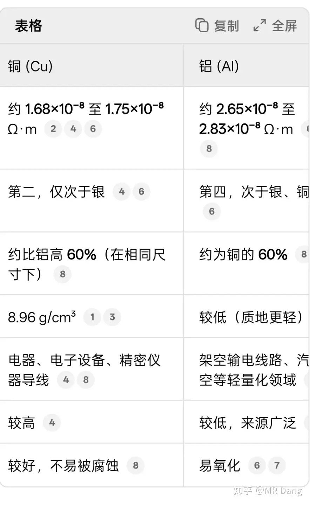

# 如何看待高盛称「铜是新石油」的观点？

---

**发布时间**: 2025-09-29 21:22  |  **原文链接**: https://www.zhihu.com/question/1955936009704403389/answer/1956106689578246710  |  **点赞数**: 3779 人赞同

**作者信息**: MR Dang​独立投资人，全网无其他平台，无小号无私域，不接广不卖课

---

## 正文内容

高盛可能保守了。

铜何止是新石油，铜很可能是工业新黄金。

ai的世界没有尽头，但是物理的世界有尽头。

不去测算每年开采2500万吨还是3000万吨铜，用总量思维来看。

目前人类已经开采的铜大约7亿吨，其中2.5亿吨左右在循环使用。

而已经探明的铜储量不到10亿吨。

简单粗暴一点测算，全球所有铜能支撑的电力网络，算上技术进步和存量的结构优化，最多最多在目前的基础上不超过5倍。这已经是把所有铜用在刀刃上，而且特高压输电全面普及的情况下最乐观的估计。

而这个过程需要三四十年的开采，以目前每年2500万多吨的产量，如果没有发现大型铜矿，剩余的铜矿品味越来越低，三十年已经算很乐观的估计了。

问题来了，未来三四十年铜基的输电能力最多只能增加不到5倍，还是缓慢增加的，以目前ai，算力，工业对电力的需求，这是远远不够的。

用电，发电，输电，这三个电循环里面，最可能制约人类科技进步的就是输电了，铜以后就是最重要的战略性物资。如果说黄金是最重要的金融金属，铜就是最重要的工业金属。至于白银，虽然目前价格很猛，但是金融属性不如黄金，工业属性由于储量比铜少三个数量级(百万吨vs十亿吨)，尽管物理性能优异的多，但是上升不到战略地位。

至于应用更为广泛的铝，产能更高，每年产量7000万吨以上。但是铝的问题一是电解铝过程中本身要消耗电，二是发热和安全性以及过高的电阻，通常在远离用电终端的使用环境中以特高压输电的形式使用。

而新增的用电需求，对安全性和发热有更高的要求，导致铜和铝这两种金属中，铜会成为木桶的短板，而不是铝。

————分割线——————

补充一点，有些投资者可能对铜和铝的导电性能不了解

无论如何比较，不考虑价格，铜都全方位力压铝，除了架空输电线路。

那么除了东大这种有形的大手，任何一个市场经济的国家里，但凡有一根铜线，都会连在ai，算力这种高产出的需求终端上，而不是连在红脖子的农场里。铜和铝在一定程度上是替代品没错，但在某些应用场景里，铜是唯一选择，你都投几千亿上万亿梭哈算力了，还用铝线不合适吧？红脖子家里卫生间都铜线，算力中心用铝线？市场经济一定会自发调节，调节到红脖子心甘情愿用铝线节省出铜给算力。

至于价格？10亿吨铜全部按照现在的价格每吨一万多刀算下来，全世界所有的铜储量价值只有10万亿美元。

什么概念呢？两个英伟达多一点，黄金总价值（20到30万亿）的二分之一到三分之一之间。

从重要性来说，这三个当中，肯定至少有一个是高估的或者至少有一个是低估的。

还有说循环利用和新开采的。

循环利用成本并不低，而且新增的需求就在那里，不代表以前的需求就没了，目前铜的循环利用比例也不低了，边际成本和边际增量循环利用率提高并不容易。

至于新开采？省省吧。

前几天的freeoort铜矿坍塌是因为什么呢？铜供应链最大的隐患是最主要的铜矿都在超期服役，安全设施设计寿命三十年的矿洞，四五十年了还在挖。浅层开采完了，越挖越深，越深压力越大，安全维护成本越高。所以铜供应链现在是两难选择，不增加安全维护成本，出事是早晚的。增加安全成本，可不是一点点资本开支就能解决的问题。

不是只有印尼这个铜矿的安全设施在超期服役，几乎世界头部的铜矿都有这个问题。

因为比起高昂的安全维护成本，赔给人命的那几个钱不值一提。

那为什么不另起炉灶新开采呢？是因为不想挣钱么？铜矿从发现到投产普遍需要15到20年左右，时间跨度太大，黄花菜都凉了。

所以铜的供应有两个特点，一是供应缺乏弹性，二是具有很长很长的滞后性。

导致铜价有两个对应的特点，需求为主导的价格弹性，以及预期主导的价格弹性。

现在铜的价格完全没反应出严峻的供求关系。

当然了，又有人说接盘什么的。

不了解的事情不要参与，这一点放在哪里都合适。铜价的起起落落，就当看热闹也不错，但是如果脑子一热去做空了，最好做点心理准备。

————分割线————

不带私货，不推荐标的，提示下风险。

期货是零和甚至负和博弈，沪铜保证金一手也四五万了，不是资深期货交易者，慎入！！！！！慎入！！！如果是伦敦铜的话，你都玩伦铜了，应该不需要外人的建议了。

a股的话，有露天开采铜矿的强于深层铜矿的，铜矿有增产预期的强于没增产预期的，国内的优于国外的，不容易被卡脖子。紫金矿业虽好，价格。。。emm，容易接盘哈，没有追高经验的慎入！！！！有色整个板块涨幅不小了，不了解就不参与，慎入！！！

特别是今天，预期打的很高，开盘就高开，容易挂旗杆哈。

铜预期是好，但不是一蹴而就的，一定有反复，可以蹲一个好的买点。

——再次更新———

很多人不清楚市场对价格的调节机制。

你以为的：市场上某样资源的缺口是10%，价格上涨10%以后供需平衡。

实际上的：价格一直涨，涨到10%的人用不起，自己变成用替代品以后才停止。

你以为的粮食短缺：粮食缺口10%，价格上涨10%，所有人吃个九成饱，供需平衡。

实际上的：粮食缺口10%，价格一直涨，涨到10%的人饿死供需平衡。

历史上发生过的：粮食缺口10%，20%的人屯80%的粮，剩下90%的人饿死财富减少到买不起剩下20%的粮的时候供需平衡。

资源也是一个道理，如果预期缺口10%，投机资金就会套利，会囤积，会炒作，价格上涨10%根本不会停。

以后铜的地位会一直缓慢上涨，涨到几十年后出下一户晨风划分人的时候不再是苹果人安卓人，用铜人和铝人代替。涨到装修的时候一想到要用十卷八卷铜线就让人肉疼的地步。

除非常温超导之类的材料学科有突破性的进展，并且在成本方面有相对优势，否则铜就是地球上兼顾性能和成本的最优解。

---

## 精选评论

> [!comment]- 点击展开评论
>
>
> | 用户 | 时间 | 内容 |
> | :--- | :--- | :--- |
> | Liang |  | 有道理，从铜的总量这个角度考虑问题很好但是再多想一想，好像又有点问题比如，多年前世界就担忧几十年内石油用尽，但随着新油田的发现和页岩油开采技术提高，预估的石油用尽时间还是那么些年铜会不会也这样而且，铜的循环利用率比石油高太多了 |
> | 李长缨 |  | 股票投资炒的就是预期，韭菜割的是股民的焦虑 |
> | Jiangksj |  | 人类总是瞎操心！世纪虫既没爆发，2002也没毁灭，石油越挖越多，粮食越来越丰富（中国）。铜只够三十年开采？2030年左右，中国核聚变预计点亮人类社会第一盏灯。未来，难道不是无线传输能源吗？ |
> | 隔壁的大表哥 |  | 铜要出货了，最近涨了不少。 |
> | 欢乐的耗子 |  | 明白人 |
> | 积跬步以致千里 |  | 可以满仓做空铜了 |
> | 未确定 |  | 呼也这规律 |
> | 黄帝 |  | 人类再再再再再一次，又又又又又，赶上资源危机了吗，上次还是二三十年前，石油只够用八十年。笑 |
> | 师爷孙 |  | 八十年是后来了，开始是四十年 |
> | 老K解毒 |  | 石油危机的时候说的是四十年。1970+40，也就是2010年就用光了。开始天天喊环保。结果2025年了，还能用七十年。 |
> | slide58209 |  | 都是一些炒作 |
> | UrbanOracle |  | 有点儿危言耸听了，输电确实用铜线最好，但是用铝一样可以达到相似的效果，材料原因增加的输电损耗可以通过加粗导线，增加电压来减少，其实影响不大 |
> | 孟德尔的豌豆 |  | 同样的体积铜更好，但同样的价格，同样的重量都是铝更好 |
> | 小戴哥Diason |  | 高压特高压架空输电线一般是钢芯铝绞线 |
> | Nami |  | 铜真要能这么炒，赞比亚经济不会是今天这个德行，早有人投资新坦赞铁路了 |
> | 欢乐的耗子 |  | 成本太高 |
> | ZOAX |  | 白银产量是万吨级，铜是千万吨级 |
> | 疾如风 |  | 铝的代替已经成为大趋势了，电缆无铜偷之无用 |
> | 天狼星人 |  | 铝也值钱 |
> | 夜雨绵绵 |  | 那是光缆无铜，偷盗无用！里面都是玻璃纤维 |

---

*本文件由自动脚本从MR Dang知乎页面提取生成*

---

**作者**: MR Dang
**链接**: https://www.zhihu.com/question/1955936009704403389/answer/1956106689578246710
**来源**: 知乎

*著作权归作者所有。商业转载请联系作者获得授权，非商业转载请注明出处。*

---

## 相关阅读

**📊 个股分析系列：**
- [[20250929-如何看待寒武纪股票的未来前景？|如何看待寒武纪股票的未来前景？]] - 科技股高估值的投资陷阱
- [[20251015-媒体报道，万科原总裁、CEO 祝九胜已被采取刑事强制措施，具体是怎么回事？|媒体报道，万科原总裁、CEO 祝九胜已被采取刑事强制措施]] - 地产行业的投资陷阱

**⚔️ 天阶功法系列：**
- [[20251024-《天阶功法卷一》BFNY价值投资分析|天阶功法卷一]] - 宝丰能源价值投资分析
- [[20251102-《天阶功法卷四》磷化工投资价值分析|天阶功法卷四]] - 磷化工投资价值分析

**🔮 邪修系列：**
- [[20251110-《邪修大法卷三》|邪修大法卷三]] - 军工电子元件投机价值分析
- [[20251114-《玄阶功法卷二》谨慎吃饼——YTKG投机价值分析|玄阶功法卷二]] - 钾肥投机价值分析

**💡 投资方法教育：**
- [[20251016-投资新手避坑指南之追热点(万粉特别奉献)|投资新手避坑指南之追热点]] - 追热点的风险
- [[20251026-如何对企业进行估值？|如何对企业进行估值？]] - 估值方法详解

**🔙 返回系列总览：**
- [文章目录](/articles) - MR Dang 全部文章目录