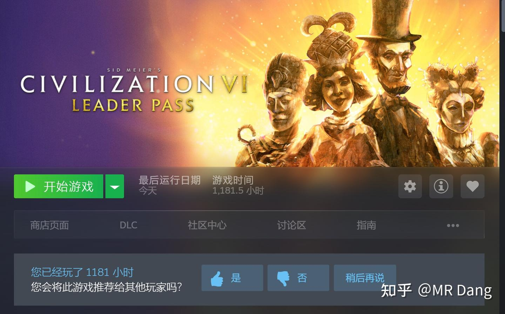

# 周末荐游

---

**发布时间**: 2026-01-11 07:31  |  **原文链接**: https://zhuanlan.zhihu.com/p/1993356898796320194  |  **点赞数**: 905 人赞同

**作者信息**: MR Dang​独立投资人，不接广不卖课

---

## 正文内容

最近新关注的粉丝有点多，很多人看的一头雾水的，这个王，那个王，搞不清楚。

我也怕大家会错意了，所以咱们先对齐一下颗粒度。

铜王：ZJKY （大部分已止盈）

钾王/锂王：YHGF

磷王：YTH

铝王：ZGHQ（港股）

锡王：XYGF

铝王平替：HCKG 改名后 HQKG

塑料王:BFNY

海金王:ZJKY(港股，招字开头）

低价铝：NSLY（已止盈）

金店：CBGF（金店和铜王各取一个字组成紫菜组合）

药店：DSL

佛光普照：JHLY（金店，药店和佛光普照共同构成消费三傻）

量王：GDLZ

小车车：TLGF(量王，小车车再加一个ZHKJ组成了邪修三剑客）

小东：DXZQ

这些是有外号的，还有一些没有外号的.

比如银行一般特指HX银行，农药就指GGGF，BT指芭田。

以上大概就是常见出场角色，还有一些偶尔出场的客串角色，比如：

银王:XYYX

煤王:ZGSH

之前几个星期都在荐书。

考虑到上次推荐的大部头实在是厚，估计大部人应该没看完，所以今天推荐个游戏。

我的读者里学生挺多的，还有很多的医务工作者和教育工作者以及公务员。

大家平时的学习工作固然重要，不过有空了还是可以放松放松，玩玩游戏的，只要不沉迷就OK，劳逸结合嘛，不必有负罪感。

我是一个老玩家了，各种终端都玩过，大大小小上千款游戏是有的，其中最喜欢的游戏之一就是今天推荐的《文明6》。

口说无凭，我是真的玩了一千多个小时的：

这个游戏比较杀时间，适合有节假日的时候玩，经常游戏一开就是一两天。

它对投资思维的养成有几个益处:

1.复利思维。

《文明6》是一个策略类游戏，除非玩PVP，否则是不需要考虑时间限制的。

在游戏中有一个基础设定是改良地块。

有点类似投资里的天使投资一样。

在游戏初期，它看起来没有那么重要，可能找个工人随便锤一下就能建成了。

它的收益也不是很高，可能只是简单的增加一点金钱或者文化之类的收益。

但是随着游戏进度的增加，那点收益就会越滚越大，最后甚至可以直接左右游戏的胜负。

这恰好和价值投资的逻辑完全一致：

寻找那些能够持续创造价值的生产资料，陪伴成长，让时间成为你的朋友。

2.均衡配置。

游戏中的资源除了金钱，粮食，人口之外，还有文化，科技，信仰这些现实世界难以量化的东西。

如果想获得游戏胜利，除了极少数的玩法，大多的时候都要均衡配置各项资源。

这没有统一的答案，完全取决你当时的战略和所处的环境。

当你手握有限的资源，你必须做出取舍：

是把资源做成军事单位劫掠更多资源？

还是把资源投入科技研发获取领先优势？

投资同样如此，需要你在风险与收益，集中与分散，不同的行业，不同的生产资料之间做出取舍，最后搭配成最适合自己的答案。

3.风险意识和安全边际

随着游戏难度的提升，你对手文明的进攻欲望会变得更强。

这个时候你的决策会更加困难：

是把有限的资源用来防守已经占领的城市，还是去探索更多的资源？

如果孤注一掷去获取更高的收益，则非常容易被邻居发现羸弱的城防，从而被背刺败北。

但是如果一位的龟缩在自己的一亩三分地，则随着游戏的进度，会因为Ai有更高的资源加成而落后。

在高难度的游戏下，每一项看似漫不经心的选择都会决定最后的结果。

所以你必须为你的选择负责，去衡量其中的风险。

你的布局应该有足够的安全边际来防止邻居的背刺。

除了对投资思维的益处，这个游戏的内容也可以增加玩家，特别是小朋友的知识储备。

比如其中的奇观设定，算是给小朋友的第一堂有趣的地理课。

又比如其中的科技树设定，不单可以帮助小朋友建立对科技发展的基本概念，也可以加强大人对行业，产业，技术发展之间联系的认知。

最为有趣的是其中有个叫做尤里卡的设定。

据说尤里卡这个词源自阿基米德发现浮力时发出的欢呼。

最后被用来代指关键的科学技术突破。

而在游戏中，几乎每项科学技术进步都有相应的尤里卡。

当玩家触发了前置条件时，科技进步需要的时间就会大大缩短。

这恰如真实世界的科技进步一样——科技通常不是匀速发展的，而是螺旋上升的。

随着你深入游戏，对游戏越发熟稔，你会越发的理解财富和资源的关系：

当你手握蓝图，却只因缺少一单位铁，精美的武器也只能停留在羊皮纸上，而敌人的铁骑已踏破你的边境；

当你点燃科学的火炬，却只因缺少一撮硝石，先进的理念也无法化作守护城邦的枪炮，只能目睹铅弹击穿你古典的方阵；

当你梦想着征服天空，却只因缺少一桶石油，所有关于财富与远方的构想都沦为泡影，只能看着钢铁洪流碾过你挚爱的土地。

这时你才痛彻地领悟：真正的财富，并非账面上闪烁的金币，也非博物馆里陈列的奇观，更非所谓的先进科技，而是那些能立即转化为现实力量的、具体的资源。

它让领先的科技，从"可能"变为"威力"

让宏伟的蓝图，从"构想"变为"现实"

让文明的野心，从"愿景"变为"疆域"。

资源，是理想与现实的转换器，是所有文明的基石，更是投资的精义所在。

这，便是《文明6》在方寸棋盘间，传授的关于财富本质的、沉默而震耳欲聋的一课：

文明的终极竞争力，唯资源与利用尔。

货币？信用？条约？

不过废纸几张。

不对劲，怎么写的像高考作文一样，老毛病犯了，哈哈。

就这个意思，反正挺好玩的游戏，常玩常新，目前价格不贵，随便玩几百个小时都不会腻。

和孩子一起玩还能一起学习有趣的知识，推荐给带娃的读者们，不可错过的精品游戏。

一个喜欢保护韭菜的博主，希望大家少少踩坑，多多赚钱！

---

## 精选评论

> [!comment]- 点击展开评论

| 用户 | 时间 | 内容 |
| :--- | :--- | :--- |
| 苡安 |  | 铜王:ZJKY(大部分已止盈)紫金矿业钾王/锂王:YHGF盐湖股份磷王:YTH 云天化铝王:ZGHQ(港股) 中国宏桥锡王:XYGF 锡业股份铝王平替:HCKG 改名后 HQKG 宏桥控股塑料王:BFNY 宝丰能源海金王:ZJKY(港股,招字开头) 紫金矿业低价铝:NSLY(已止盈) 南山铝业金店:CBGF(金店和铜王各取一个字组 成紫菜组合) 菜百股份药店:DSL 大参林佛光普照:JHLY(金店,药店和佛光普 照共同构成消费三傻)九华旅游量王:GDLZ 国盾量子小车车:TLGF(量王,小车车再加一个 ZHKJ振华科技组成了邪修三剑客) 同力股份（北交所）小东:DXZQ 东信证券银行HX,华夏银行农药就指 GGGF国光股份BT指芭田股份银王:XyyX 兴业银锡煤王:ZGSH中国神华MR Dang |
| 广东顺德分Dang |  | 看标题，我以为你推荐鳌太线 |
| &nbsp;&nbsp;&nbsp;&nbsp;MR Dang |  | 哈哈哈，什么深仇大恨 |
| 刘Jerry |  | 还好是文明六，鳌太线可太恐怖了 |
| malloc |  | 这也能碰到神秘园观众哈哈 |
| Muster |  | ，感谢大佬推荐的财富密码。我就说的吧，玩游戏可以赚钱，我老婆就是不相信！就是有一点很小的请求，游戏的配置 能否按照以下要求写下，我可以发给老婆看。配件 型号 核心参数 参考价(元)CPU AMD Ryzen 9 8950X3D Zen5/16核32线程/5.7GHz/192MB L3缓存/游戏+生产力双巅峰主板 ROG CROSSHAIR X870E GLACIAL X870E旗舰/24+2+2供电/7个M.2/双USB4/水冷头显卡 NVIDIA RTX 5090Ti 48GB Blackwell GB201/24GB GDDR7/1.2TB/s带宽/8K光追满帧内存 芝奇皇家戟DDR5 8000 64GB(32GB×2) CL36/EXPO/OC潜力/ROG联名散热存储 三星990 PRO 4TB PCIe 5.0 SSD 读13000MB/s/写10000MB/s/发烧级耐久存储 希捷Exos X20 20TB SAS 3.0（仓库盘） 7200转/256MB缓存/企业级稳定散热 EK-Quantum Magnitude X870E+360 D5 全覆水冷头+360冷排+D5泵/静音强冷电源 ROG Thor 1600W Platinum II 1600W/80Plus白金牌/全模组/ATX 3.1/10年保机箱 联力包豪斯O11D EVO XL 全景侧透/顶级散热/ARGB拉满其他 定制水冷管+ROG全家桶配件 定制硬管/ARGB风扇/线材/显卡支架合计 — — 约150000再次感谢大佬对韭菜们的细心栽培 |
| &nbsp;&nbsp;&nbsp;&nbsp;MR Dang |  | 哈哈哈哈，下次写到文章里，都是为了孩子，我懂 |
| 路在脚下 |  | 党老师心善 |
| 陈阿呆 |  | 先为力胜，股市里的所有经济腾飞叙事都离不开资源 |
| 她名不能为空 |  | 联系现实，川宝抢了委内瑞拉石油，格陵兰矿产，这有利美国啊。 |
| 闻晓月 |  | 温润   真的党老师，这个词用你身上太合适了 |
| 想吃烤串 |  | 这不明示了吗 还是得买资源股 |
| 明天会更好 |  | dang佬，我现在对有股息支撑的资源类和能源安全类股票真是越看越喜欢啊 |
| 麋鹿迷了路 |  | 最近喜欢上宝丰。 |
| 老司机 |  | 文明6我也是老玩家了，上大学的时候经常玩，那个时候为了学英语还把游戏语言改成英文 |

---

*本文件由自动脚本从MR Dang知乎页面提取生成*

---

**作者**: MR Dang
**链接**: https://zhuanlan.zhihu.com/p/1993356898796320194
**来源**: 知乎

*著作权归作者所有。商业转载请联系作者获得授权，非商业转载请注明出处。*

---

## 相关阅读

**💬 周末闲聊系列：**
- [[20251129-周末再次闲聊|周末再次闲聊]] - 银行罚款与追热点风险
- [[20251221-周末荐书（12月21日）|周末荐书（12月21日）]] - 推荐经济学入门读物

**🔮 邪修系列：**
- [[20251030-《邪修大法卷二》寒王之上，应有新王——GDLZ投机价值分析|邪修大法卷二]] - 量王投机价值分析
- [[20251029-《邪修大法》时来天地皆同力——T公司投机价值分析|邪修大法卷一]] - 小车车投机价值分析

**⚔️ 天阶功法系列：**
- [[20251024-《天阶功法卷一》BFNY价值投资分析|天阶功法卷一]] - 塑料王价值投资分析
- [[20251104-《天阶功法卷五》DSL投资价值分析|天阶功法卷五]] - 药店投资价值分析

**🔙 返回系列总览：**
- [[MR Dang/dang_articles/README.md|文章目录]] - MR Dang 全部文章目录
