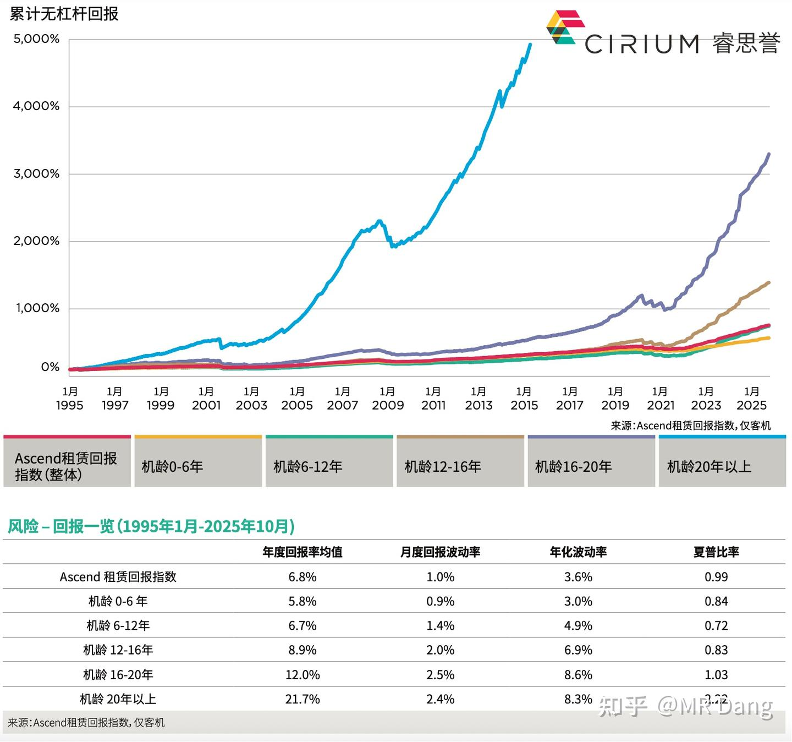
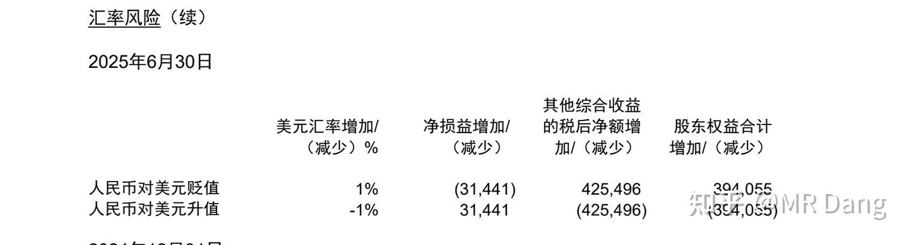
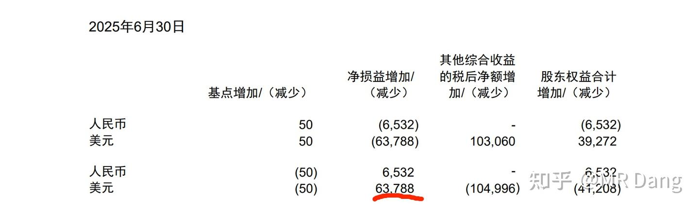

# 周末闲聊&自我封印一天（1月24日）

---

**发布时间**: 2026-01-24 07:01  |  **原文链接**: https://zhuanlan.zhihu.com/p/1998048152574505489  |  **点赞数**: 1215 人赞同

**作者信息**: MR Dang​独立投资人，不接广不卖课

---

## 正文内容

粉丝涨的有点太快了，一个星期前还五万粉感言，刚才一看粉丝数差点懵了，脑子宕机，算不过来账。

这属于正常现象么？

感觉不对吧，知乎涨粉不是很难的么。

热度溢出有点吓人，我去外面的股票论坛上都能看到讨论的。

木秀于林风必摧之，说这话虽然可能有点给自己脸上贴金。

但我也不想当什么x小x，大家理性看待，只是一个有点分享欲的中年油腻男，不是什么股神，更没点石成金的能力。

有鉴于此，明天停更一天，压压热度，然后周一正常早报。

新粉比较多，可能还不知道我是什么风格，所以给大家再次澄清，如果是奔着抄作业或者投机的想法的，或者抢跑的。

那可能要失望了，我短线投机水平很差，经常赔钱，跟着我只有吃不完的苦，挨不完的打。

我是做价值投资的，这里不会有什么热门股，我一向不去人多的地方。

置顶的帖子里有颗粒度对齐的说明，看不懂外号可以去翻翻。

老粉也有好奇我作息的，我大概说一下我当博主的一天吧。

5点左右起床，收集信息，边处理信息边写，那个时候可能外面还没休市，所以偶尔会看下盘，美股或者商品。

这会儿看到银铂锡全部大幅刷新历史新高，银破100了，心疼空头三秒钟。

六点半左右能写完，早报字数2200±200，如果有特别重要的消息，会有加长版，大概是3500±200，如果是有一些逻辑分析的，大概是5000±200，比如今天这一篇。

码字效率这块儿还有点自信。

然后就开始检查修改，检查错别字，核对数据，特别是合规方面的检查，有没有情绪渲染。

检查完七点左右，然后看两分钟的擦边短视频，愉悦一下身心，差不多了就点发布。

发布完就把两个小崽子从床上拉起来，盯着他们洗漱吃儿童早餐，然后这个时候应该审核完了，就开始评论区接客。

送孩子去上学的路上会让他们背诵学习过的内容，一边听他们背书，一边回复消息。

大概八点左右到麦麦吃我们的穷鬼套餐，来上一杯咖啡提提神。

这个时候以前大概是200赞+200评，现在热度高了就是400赞+400评。

然后回家，做交易日前的准备，评论区一般到九点就不回复了，如果是大规模的交易，八点半就得去准备了。

这个时候以前一般是300赞+300评，现在可能就是500赞+500评。

交易时间不怎么看盘面，主要是看商品方面的异动，宏观数据，行业数据，政策导向。还有个股的基本面研究，调研纪要什么的。

交易时间结束，十一点半就开始吃午饭，然后思考下氪金单子怎么处理，能不能接，吃完饭趁着下午一点开盘前看一眼评论区的几百条没看的评论（虽然不会回复，不过基本会看），然后给氪金用户合计一下怎么布局。

下午一点回卧室，安静的睡个午觉，盘中有时候醒来会看一眼行情，然后继续补觉。

收盘三点的时候就睡醒了，看下行情，盘点一下当天的战果（比如昨天又创新高了），考虑下第二天的仓位是否需要调整。

然后就是去溜达溜达，运动一下，买点水果喝点酸奶什么的，下午吃的比较少，因为我之前是大基数，有脂肪肝，好不容易减下来康复了，还是要注意的。

五点左右神兽归笼，检查他们的课业，询问课堂表现，然后盯着他们写作业，我自己就拿本最新的cpa书在那里看。

是的，我的爱好是看每年的cpa书籍，虽然我已经考过了，但是cpa这东西，每年都在变化。

我对这些变化可能没有业内的培训老师熟，但是也算略知一二，常看常新，要保证自己掌握的是最新的会计准则，最新的审计表述，最近的法律条款。

所以我的cpa书籍特别多，有上百本，还都是全新的。

我平时不爱说专业名词，但还是懂一些的，业务能力这块儿不算太差。

看着他们写完作业，再布置点课外任务，差不多就八九点了，再把评论区和留言看一遍，然后就开始坐在屏幕前翻各家公司的公告，查阅资料，评估影响，分类整理。

九点半左右躺在床上补个番，看上两眼商品资讯和新闻，把第二天早晨需要写的东西在脑子里过一遍，睡觉的时候潜意识就会分析处理信息，然后第二天早晨起来脑子就特别灵光，聪明的智商就占领高地了。

新的一天又开始了。

都看到这里了，好像不说点股市相关的事情说不过了，虽然我一般周末不说这些。

今天反正是周末，就当唠嗑，不是荐股，我就说下我的思路。

首先，目前的情况我们不要疯牛，要的是慢牛，是健康牛，也没说要熊，所以可能在可见的中短期来说，应该不会有太大的波动。

那么为了减少波动率，就会有一双有形的大手去调整情绪，为了达到这个目标，它是不在意一些损耗的。

它手指缝里流出来的东西，可以挑一挑，捡点好的便宜的。

比如有色，很多人被扔下车了，但是铜王基本上涨的不算多，特别是从我止盈以来。

我一次止盈的时候，铜王股价比磷王贵很多，好几块钱，我记得很清楚，但是现在磷王比铜王还贵。

我二次止盈的时候，铜王接近40，现在基本上回调不少了，这还是在有色整体大行情的时候。

铜王还是那个铜王，被大哥都青睐的有的色标的，有色股里最优秀的一家，只是因为短期的流动性问题，出现了一些回调，但价值终将回归。

那这个时候持有它，潜在的风险相对其他股来说就没那么大，潜在的收益也会相对多一些，是个还算不错的选择。

当然我这里的不错，是横向比较，相对于其他有色标的，毕竟整个行业都在水涨船高。

再次重申不是荐股，而且我现在作为一个公众博主，自觉遵守相关规定，给你们说一个标的的时候，相当于就损失了未来几天反向交易的权利，所以，我每次说都是有代价的。

除了有色，还可以看看银行，以前银行股在我这里是债券是空仓，现在银行股因为有形的大手变成了一份有股息打底的看空期权。

很神奇的一件事，因为有形的大手大甩卖，所以走势和指数相反，那也就意味着，如果指数下跌，因为托底机制存在，银行股可能上涨，这就相当于一份看空期权。

而如果指数上涨，因为流动性打压和除权的存在，则会诞生股息率更高的银行股。

比如我拿的那个，已经分了一毛，去年年报再分三毛，除权后再跌一跌，股价就只剩六块不到了，意味着预期股息率接近7%。

而如果再来这么一年，股息率就到8%了， crazy简直，感觉像当年看到了负油价一样让人震惊。

不要因为现在这种情况天天出现就习以为常认为世界本该如此，这可是7%啊，bro。

很多人觉得这轮牛走完，像我这样做周期的投资者会从哪里来又回到哪里去，很难全身而退。

但是我说实在的，我投资a股这么多年，几经沉浮，没打过这么富裕的仗。

4000多点上面，还能让你买到预期股息率接近7%的银行股，同时还能挑到像铝王，磷王这样有高股息的顺周期标的。

绝无仅有。

老股民可以回忆回忆，有哪一波牛市是在权重全趴在地上的时候到这个位置的？

然后还有上次周末闲聊的老登金融股。

这个股我也不会出任何功法，也不会出现在任何早报里，就像海金王一样，风险很大很大很大，只分享一次我的逻辑，下次出现就是止盈。

惊鸿一瞥，再见就是各自两宽。

这玩意儿起个外号吧，因为他是搞飞机租赁的，就叫他机王吧。

为什么不出功法之类的呢，一是因为我懒，二是怕出事，三是好难写。

它很难去量化的分析，基本都是💩上雕花。

因为机王的资产和负债端都太大了，而且又是汇率，又是融资成本的，稍微变动1%，最后的增速能差出去10%都不止。

投它就是讲究一个模糊的正确，从商业模式来说，业务很简单，就是花钱买飞机，然后把飞机租给航空公司，赚差价。

这个行业之所以能存在，就是因为飞机的特点是——交付慢，价格贵。

想象一下现在你是一家航空公司，你想开发几条新的航线。

你的客户都非常渴望从全世界各地飞来我们大西安吃肉夹馍。

你知道你只要开通这些肉夹馍专线就一定能赚的盆满钵满。

但是你手里既没钱，也没飞机。

这个时候，你就需要一家公司。

它给你准备了现成的空客A320，加满了油，你只需要付出1万美元/天的价格就能租到它。

这个业务在我们的财务书籍里叫干租。

但是你不但没飞机，你连机组都没有，甚至维修工都没有。

没关系，你只需要加亿点点钱，就能得到整套的机组和维修人员。

这个业务在我们的财务书籍里叫湿租。

你说不必这么麻烦，我是堂堂的航空公司，我就算贷款，我也要买新飞机。

你扛着一麻袋刀乐，兴冲冲的跑到西大，哐当一声丢在地上，冲着波音说："给我来一架飞机！"

波音不紧不慢的说：嗯，好的，你的订单我确认了。

但是前面还有6666架飞机没有交付，稍微等一下吧，我们去年足足交付了600架呢。

所以这个行业是必须的，它能精准的解决航空公司的痛点。

而且聪明的你已经发现了，这个行业有两个非常重要的指标决定了它的盈利能力。

第一个指标是有息负债成本和有息负债规模。

第二个指标是航空公司的订单交付速度，交付的越慢，业务需求越多，飞机越紧俏，哪怕二手飞机也能卖个高价。

机王这个公司呢，有两个主要的子公司，都在境外，所以是一家身在国内的国际化公司。

一个子公司搞飞机的租赁，是主要业务。

一个子公司搞集装箱的租赁，是次要业务。

最近几年这个搞集装箱的公司盈利情况不好，公司一狠心就把它卖了。

但是这个公司当年是花了大价钱买的，这次卖的价格不理想，所以就计提损失了，导致2025年的利润很难看，直接亏损了。

如果不是这笔亏损，2025年是可以盈利的，大概30亿。

这个租赁飞机的公司，它自己其实也没多少本金，所以发行的是美元债。

赚的其实就是个租金和美元债利息的差价。

很好理解的生意。

具体的财务数据我也不贴了，理解商业模式是最重要的。

它现在处于一个超级康波里面：

1.它借的的是美元债，所以人民币升值对降低债务规模（以人民币计价）来说是利好，此一胜也。

2.它的需求受经济周期影响，经济越景气，飞机需求越高，此二胜也。

根据租赁回报指数来说的话，明显处在一个大周期的上升阶段，飞机产能短缺长期存在。

3.它的成本受到美元债规模影响，它这次卖了子公司，就能换到很多钱去还款。负债规模大幅度减少，此三胜也。

4.它去年卖子公司，导致的亏损是一次性的，今年业绩基数低，叠加以上三胜，就会显得增速特别爆炸，此四胜也。

5.本身估值就够低，如果业绩爆炸还能提升估值，此五胜也。

一般我们说戴维斯双击，但是它目前的处境就是属于业绩爆发前夜，马上就会迎来戴维斯五连击，到时候戴维斯手忙脚乱的，估计都击不过来。

博主博主，你的情绪输出固然很到位，但是咱们有没有定量一点的分析啊？

有的，兄弟，有的。

首先是汇率影响：

人民币每升值1%，净损益增加3144万，如果假设2026升值5%，则净利增加1.57亿。

其次是降息影响：

美元降息50个基点增加利润6378万。

2026年按照100个基点计算那就增利1.27亿。

这1.27+1.57=2.84亿，属于躺着不动就能白挣的钱。

另外出售子公司可以获得大约110亿以上的现金用来偿还2024年利率11.25%的私募贷款以及发行利率8.75%的优先票据。

当然这些借款是有浮动利率条款的，算平均6%吧，也能节省不少钱。

如果理想状态，大概躺着不动增加10亿净利润，打个五折也有5亿，算上去年的30亿，今年也许有35亿净利润，对应现在8pe估值。

这还没算租金上涨带来的增加。

作为对比，港股有一个类似的标的，目前估值是9pe和1.1pb。

其实到这一步已经可以了，但是我想讲的再深入点，就是风险。

最大的风险就是前面听的热血澎湃的，但其实是财务幻觉。

比如人民币升值，固然可以增加利润（减少美元债债务），但同时会减少净资产(飞机是以美元计价的）。

相当于用净资产变成了净利润。

神奇吧？

但是你可以赌市场上大部分投资者不懂财务，不知道机王的净利润为什么会突然爆发。

就像我不说你也没发现这是个陷阱。

然后你就用一个看起来比较便宜，实则不便宜的价格把机王卖给其他投资者。

所以它是本质上是一个互相预判走位，互掏口袋的游戏。

它本身又是个老登行业，就要求你的安全边际足够高，也就是说你必须买的很便宜才能有更大的胜算。

一定一定不要抢跑，我不是推荐你去买，而是如果你真的感兴趣，可以去蹲一下，万一有捡便宜的机会了，可以持有一点点去搏一个信息差，不是所有人都清楚自己在交易什么的。

看不懂就不要参与，一分钱都别买，买了只会让自己难受，老登的持股体验一向不好。

只说这一次，逻辑放这里了，还有另外一个风险是大股东，我个人比较反感，口碑不好，碍于身份，不展开了。

不过也不是没好处，因为大股东缺钱，所以就需要公司分红，到时候股息率这块儿可能有惊喜，不过大概率等不到那会儿就止盈了。

还有很多人问的地四卷去哪里了，那一卷主要讲投资标的间的联系的，后来不知什么原因被和谐了，与之类似的还有《我不是股神》这一篇。

我唯一主动删除的是提醒套利那一篇，其他所有文章没有任何主动删除的，错了不丢人，没什么遮遮掩掩的。

地四这篇遗憾以后可能会以另外一种形式补全，但是原文找不到了，所以我只能再写一篇保留主要脉络，但是细节更丰富的plus版。

一个喜欢保护韭菜的博主，希望大家少少踩坑，多多赚钱！！！

---

## 精选评论

> [!comment]- 点击展开评论
>
>
> | 用户 | 时间 | 内容 |
> | :--- | :--- | :--- |
> | 毛毛 | 6 小时前 | 大佬早，我们不抄作业，只是分享逻辑。恳请各位粉丝朋友们，外面其他帖子不要评论了，降低热度，保护好我们的大佬 |
> | &nbsp;&nbsp;&nbsp;&nbsp;MR Dang | 6 小时前 | 谢谢 |
> | 韩太阳 | 6 小时前 | 粉丝增速也要控制在慢牛不要疯牛周末愉快，天天好心情 |
> | &nbsp;&nbsp;&nbsp;&nbsp;MR Dang | 6 小时前 | 说得对 |
> | 寻仙问道 | 6 小时前 | 这充分说明了真正为粉丝着想的人,大家是能看出来的。正是因为使用知乎的用户平均素质高，对于大佬这种优质"博主"更不愿意放过。我也关注不少关于投资方面的号主，说真的，哪怕是他们当初推荐的一些好股票，说的有道理，但基本上也没把自己购买的背后的逻辑讲的像大佬这么清楚。所以跟着他们买，要么不信、错过，要么清仓，事后懊悔。大佬是我见到唯一一个说的非常清楚的人。我也跟着大佬买了锡业股份，赚了20%,目前只后悔一开始没重仓。 |
> | &nbsp;&nbsp;&nbsp;&nbsp;MR Dang | 6 小时前 | 注意风险，该止盈就止盈 |
> | knbnbnb | 6 小时前 | 大佬涨粉，我有种家里的宝藏，被人翻出来一样的感觉 |
> | 真花不一样 | 6 小时前 | 我和大佬有个共同点，看擦边短视频 |
> | &nbsp;&nbsp;&nbsp;&nbsp;MR Dang | 6 小时前 | 哈哈哈 |
> | 讨厌醋大蒜 | 5 小时前 | 大佬是不是应该备份一个小号，或者重启一下公众号，或者微博，财经账号失踪概率大，到时候一点线索都没有 |
> | 尼古拉斯 | 6 小时前 | 就是这公司，你可能赚的不是成长的钱，而是赚的是比你更傻的人的钱，我就不参与了，我觉得我就是那个最傻的 |
> | 打更人 | 5 小时前 | 我也就不参与了，你不参与就不知道赚谁的钱了 |
> | 何云 | 5 小时前 | 我觉得我也是。 |
> | 小路 | 4 小时前 | 嘿嘿，我参与了，但是我只买了1手，我真是个大聪明 |
> | 接近透明的蔚蓝 | 2 小时前 | 炒名字炒概念可以迅速赚得盆满钵满，比如XX幸福XX发展XX有色 |
> | 张春辉 | 5 小时前 | 朋友们，一定不要追高啊！老老实实跟着大佬做价值投资吧！我听朋友的追高买了利欧，自作聪明以为卡异动成功可以再吃三个连板。结果。。利欧自己主动申请停盘，之后就是"百亿补贴"的空单，连夜挂跌停都跑不掉。结结实实吃了两个跌停，亏了20个点才出来的。这也算给我上了一课了，真的不能追热点，这和赌博没有两样。 |
> | &nbsp;&nbsp;&nbsp;&nbsp;MR Dang | 5 小时前 | 注意风险 |

---

*本文件由自动脚本从MR Dang知乎页面提取生成*

---

**作者**: MR Dang
**链接**: https://zhuanlan.zhihu.com/p/1998048152574505489
**来源**: 知乎

*著作权归作者所有。商业转载请联系作者获得授权，非商业转载请注明出处。*

---

## 相关阅读

**💬 周末闲聊系列：**
- [[20251129-周末再次闲聊|周末再次闲聊]] - 银行罚款与追热点风险
- [[20251024-《天阶功法卷一》BFNY价值投资分析|天阶功法卷一]] - 宝丰能源价值投资分析

**⚔️ 天阶功法系列：**
- [[20260104-周末荐书(1月4日)—《证券分析》|周末荐书(1月4日)—《证券分析》]] - 价值投资经典著作
- [[20251106-《天阶功法卷六》银行股投资原理详解|天阶功法卷六]] - 银行股投资原理详解

**🔙 返回系列总览：**
- [文章目录](/articles) - MR Dang 全部文章目录