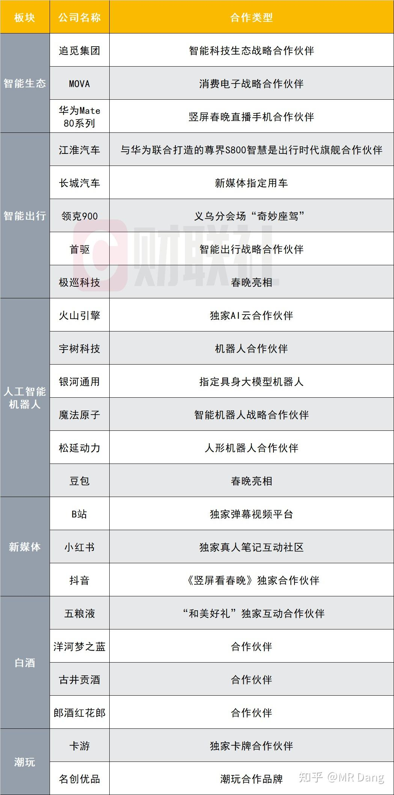
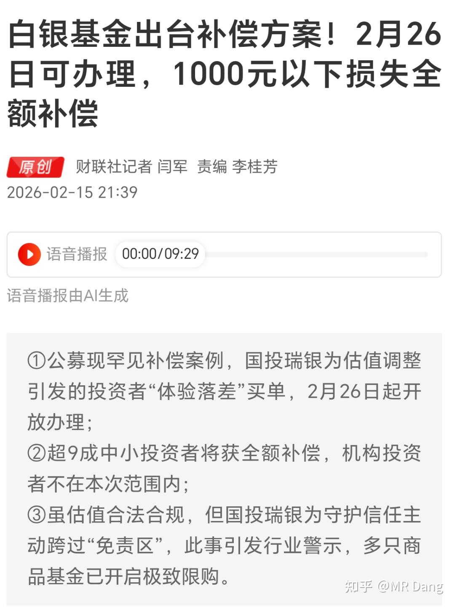

# 拜年啦

---

**发布时间**: 2026-02-17 07:35  |  **原文链接**: https://zhuanlan.zhihu.com/p/2006971949126009735  |  **点赞数**: 348 人赞同

**作者信息**: MR Dang​​独立投资人，不接广不卖课，无任何其他平台，无小号。

---

## 正文内容

新年好，诸位，给大家拜年啦。

昨天的春晚都看了么？

看了的可以分享下看法，没看的我大概说下：

图里是总结的各个品牌的登场情况。

我个人的感觉，就存在感来说，机器人毫无疑问是最强的，然后是追觅，豆包，五粮液。

纯纯主观，没有任何数字依据。

机器人的话，宇树相较去年进步巨大，和其他品牌也拉开了身位。

特别是中间有一段醉拳假装倒下的编舞，把好多股民吓出一身冷汗。

机器人对就业的冲击开始显现了，首当其冲的就是舞蹈演员，往年鼎盛的时候，一台春晚的演职人员2000+，其中大多数是舞蹈演员。

今年我目测也就是1000+左右，人看起来比往年少多了，以至于有人吐槽，往年的春晚最多也就是没年味，今年的春晚没人味。

至于春晚整体表现，语言类节目相当拉胯，由于各种植入广告的塞入，本就尴尬的剧情就更尴尬了。

一般来说，评价一台春晚怎么样，有一个尺子，就是戏曲节目给人的观感如何。

每年春晚都会有戏曲的串烧，而且由于大多数人连票友都算不上，是听不出好坏来的。

所以对大多数人来说，可以默认这个节目的水平是稳定发挥的，作为参照系是比较科学的。

今年我个人的观感就是，对戏曲节目的整体映像相当不错，《盗御马》的唱腔响起来的时候，一下就感觉味道正了。

往年对我来说，戏曲节目是中场上厕所的休整时间，今年居然看的津津有味，足以说明今年春晚的水平了。

然后是经典篇目《初见照相馆》终于在今年迎来了属于它的对手——《奶奶的最爱》，叙事拖沓，剧情生硬，表演节奏有很大的问题。蔡琴n年前给郭达当机器人的小品能把今年自己演的这个秒成渣。

前几天沸沸扬扬的白银lof方案出炉了，比较意外，1000元以内全赔。

但是这个赔付是有条件的，必须是那一天赎回的才行，而且赔付的是净值调整规则变化带来的额外损失，本身白银价格下跌带来的损失是不赔的。

挺良心的方案了，可以堵住90％以上散户的嘴，先把光脚的安抚住。至于损失更大的大户和机构，都是穿鞋的体面人，有另外的方案，应该不再会有很大的舆论压力了。

昨晚薅了不少豆包的羊毛，全家手机齐上阵，平均一个手机薅了7块钱，刚才也提现了，没任何套路，直接打到卡里，一共薅了几十块，美滋滋。

横向对比千问和元宝，这波豆包的力度大多了，昨晚接千问的红包雨，点了半天抢了一分钱直接给我整破防了，哈哈。

今天下午打算拉着全家老少去看电影，每年春节的保留项目。

要是以往的话，一般都是《熊出没》《哪吒》这样的动画片，但是今年《熊出没》的副标题是《年年有熊》。

虽然我是坚定的唯物主义者，不过作为股民，看见这个副标题还真的挺劝退的。大年第一天看个"年年有熊"，实在不是什么好兆头，不知道出品方是不是打算抛弃股民这个群体了，起这么个名字。

所以看情况，可能《飞驰人生》或者《镖人》是首选，然后再去看张艺谋的大作。

春节档这几个不出意外我都会去看一圈，这是因为我持有的头寸里，有一家公司有院线业务，虽然后来公司把院线业务出售了，但是我这个支持自家院线的习惯保留了下来。

《飞驰人生》就不说了，有沈腾在，下限有保证的，感觉不会亏票。

《镖人》的话，我之前看过动画版，剧情方面相当可以，镜头张力也很在线，电影版不知道会如何演绎，想来不会太差吧。

一个喜欢保护韭菜的博主，希望大家在新的一年里，少少踩坑，多多赚钱！！！

> [!comment]- 点击展开评论
> | 用户 | 时间 | 内容 |
> | :--- | :--- | :--- |
> | Raven | 1 小时前 | 新年快乐！昨晚断断续续的印象，机器人的手越来越灵巧了！ |
> | Raven | 1 小时前 | 是的 |
> | &nbsp;&nbsp;&nbsp;&nbsp;MR Dang | 1 小时前 | 银河那个么 |
> | 夏天 | 25 分钟前 | 老师新年好呀☕☕宇树武术比去年扔手帕进步好多了，但全场我最喜欢的是海来阿木的歌《海底》，希望我手里也有还在底部的吧 |
> | Wrangler | 56 分钟前 | 大佬，是蔡明扮演的机器人，蔡琴是唱 渡口 的 |
> | &nbsp;&nbsp;&nbsp;&nbsp;MR Dang | 55 分钟前 | 哈哈，嘴瓢了 |
> | 长虹 | 1 小时前 | 佬新年快乐，看到年年有熊真蚌埠住了 |
> | 败絮丶 | 46 分钟前 | 新年快乐，年年有牛 |
> | 赵小木 | 28 分钟前 | dang老师新年快乐 |
> | 杏林 | 11 分钟前 | 新年快乐 |
> | 六月娇阳 | 17 分钟前 | 送出一个礼物～ |
> | 哈基米南北路多 | 18 分钟前 | dang老师新年快乐，马年大吉 |
> | 钱清欢 | 42 分钟前 | 老师，新年好 |

---

*本文件由自动脚本从MR Dang知乎页面提取生成*

---

**作者**: MR Dang
**链接**: https://zhuanlan.zhihu.com/p/2006971949126009735
**来源**: 知乎

*著作权归作者所有。商业转载请联系作者获得授权，非商业转载请注明出处。*

---

## 相关阅读

**🎊 春节系列：**
- [[20260216-丙午除夕致股海诸君贺岁|除夕贺岁]] - 丙午除夕致股海诸君的贺岁辞
- [[20260215-春节特辑2(年二十八）|春节特辑2]] - 年前最后一天的投资闲聊
- [[20260214-春节特辑（年二十七）|春节特辑]] - 春节前的市场展望
- [[20260218-非专业影评|非专业影评]] - 飞驰人生3与春节档电影评价

**🎉 万粉感言系列：**
- [[20260201-十万粉感言|十万粉感言]] - 量子态叠加理论与高股息方法论
- [[20260117-五万粉感言|五万粉感言]] - 投资心路历程分享

**🤖 科技与投资：**
- [[20260101-2025官子&2026布局|2026布局]] - 新年投资展望与科技赛道分析

**📚 新手必读系列：**
- [[20251016-投资新手避坑指南之追热点(万粉特别奉献)|追热点避坑]] - 新手最容易犯的错误
- [[20251118-《韭菜保护合集卷八》仓位控制|仓位控制]] - 如何科学管理仓位
- [[20251103-《韭菜保护合集卷七》如何测算股息率|测算股息率]] - 股息率计算方法详解
