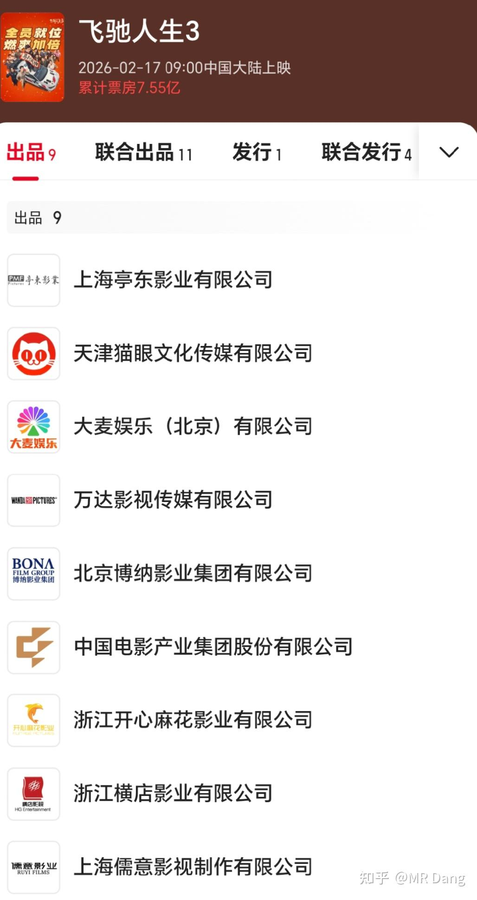
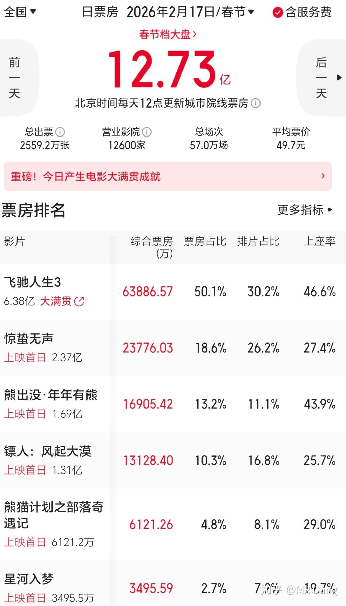
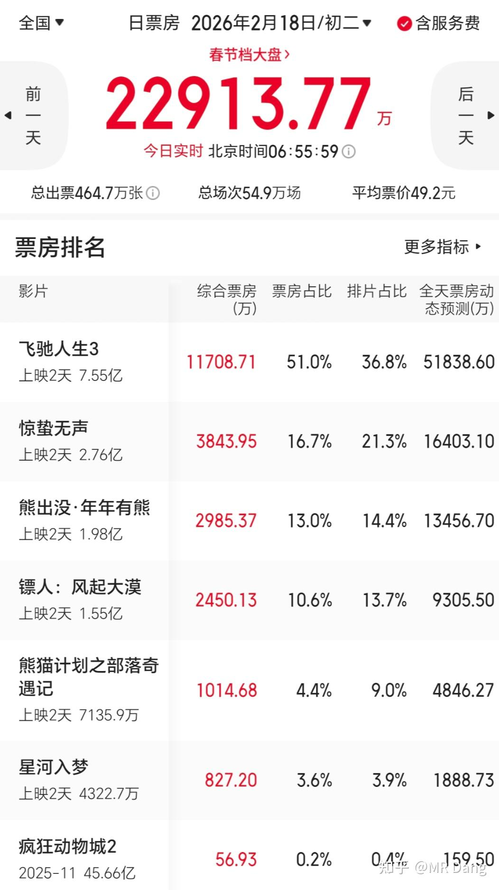
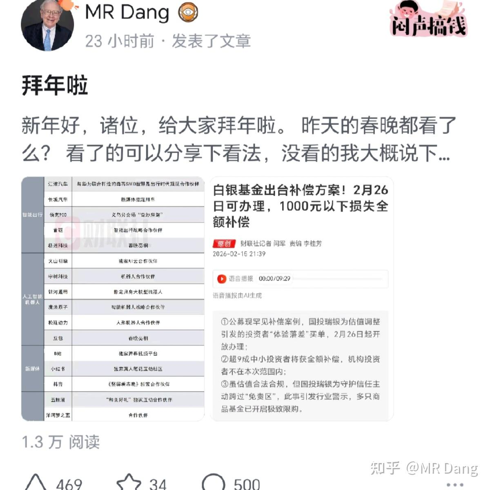

# 非专业影评

---

**发布时间**: 2026-02-18 07:26  |  **原文链接**: https://zhuanlan.zhihu.com/p/2007127852538171489  |  **点赞数**: 431 人赞同

**作者信息**: MR Dang​​独立投资人，不接广不卖课，无任何其他平台，无小号。

---

## 正文内容

刚从影院出来时还有点回味无穷的感觉。

直接说结论，《飞驰人生3》值回票价。

叙事结构上，非常紧凑，毫无尿点的那种。

这不是硬夸，我从四十分钟开始就一直憋尿了，一直想找个合适的时间去厕所，硬是没找到机会。

如果仔细分析，前两部的叙事结构上，属于低开高走，重点讲的是准备，努力，付出，中间穿插很多喜剧元素。

第三部，走了一个高开→低走→高走的结构。

而第一部时长98分钟，第二部121分钟，第三部125分钟，总时长增加的不多，这就意味着第三部冲突反转的密度会更高，戏剧的张力和矛盾冲突会更多，最后达成的效果就是毫无尿点。

更为可喜的是，在时间分配上，有关备赛的艰难和过程一笔带过，和前两部有明显的区别，把重点放在了对比赛过程的演绎上，因此是一部更纯粹的赛车题材电影。

而在拍摄镜头上，特效用的不明显，实景拍摄比例高，所以整体观感相当不错，可以抓住观众的眼球。

以上无剧透，以下包含部分剧透，谨慎食用：

第三部的精神内核上，是更深入的，夹带的私货也更多。

比如对外行指导内行的吐槽。

比如资本投入和公平竞技的平衡。

比如竞技体育输赢到底在场外还是场内的探讨。

作为一部喜剧片，这些较为沉重的话题会明显降低观众对它的风评。

如果只是想去找纯粹的乐趣，就想放声笑一笑的，那我觉得这方面可能要失望。

整部影片最突出的主旨是在讲和解，面对传统技术与新时代科技时的和解，面对现实与理想的和解。

七年时间，三部作品，这一系列陪着张驰，也陪着无数观众，走过了一段关于热爱与成长的旅程。

《飞驰人生3》作为终章，没有辜负这份期待，它在除了搞笑以外是全方位超越前作的。

当然也包括配乐，当几个男人低沉的哼唱起《光辉岁月》时，一段峥嵘的奋斗史就扑面而来。

影片的最后，张驰望着无尽的赛道，画外音响起："人生不是百米冲刺，而是一场漫长的拉力赛，重要的不是终点，而是飞驰的过程"。

这是韩寒给张驰的结局，也是《飞驰人生》系列，给所有心怀热爱的观众，最珍贵的答案。

巴音布鲁克没有海，但我们的人生里，永远有可以飞驰的赛道。

最后是个人打分，考虑到时长原因，以及喜剧元素的缺失，以及旁边众多小孩昏昏欲睡的表现，我个人主观给到7.9分。

作为对比，《药神》我个人评分8.8，《夏洛特》8.1，《疯狂动物城2》7，所以这个7.9是我个人觉得很不错的成绩，二刷会犹豫，一刷不后悔。

作为投资者，用投资的视角打开《飞驰人生3》，这是一部代表了国内商业电影工业化最新高度的作品。

主演保留了前作的所有主要演员保证下限+新时代流量小生提高话题度，主控+联合出品的方式，保证了排片和宣发，各方面的利益都有保障。

上映前普遍预期三四十亿票房，但是上映后按照最新进展可能冲击四五十亿的水平。

另外多说一句吕子乔这几年资源是真不错，作为40+已婚男演员，今年居然有两部电影都有出镜，真的很厉害了。

第一天《飞驰人生3》用30％排片就拿下了50％票房，以后的拍片就可能会有所倾斜，预期票房存在继续上修的可能。

但是，我还要说一句但是，目前所有的东西已经很有可能在资本市场price in了，我个人的话，电影票yes，股票no。

《熊》，我没去看，原因昨天说过了。

但是两个小崽子想看，所以让老人带着去看了。

出了影院以后，老二表示很吓人，很震撼，看不太懂。他一年级，属于同龄人中比较聪明的，可以在有字幕的情况下看懂厕纸后宫番的水平。

老大能复述部分情节和大概主旨，表示能看懂一点，但是细节记不清了。他三年级，属于同龄人中普通水平，不笨，但是也不机灵。

老人表示电影画面很ok，视听水平看不出来是国产的，接近《疯狂动物城2》的水平，剧情还行。

最后老二给了6分，老大给了7分，老人给了8分。

我感觉已经不是低龄向的了，可能10岁以上更适合，10岁以下慎重。仅供参考吧。

《熊》第一天以11％排片拿下了13％票房，发挥稳定。

每年《熊》都是名作之壁，超过《熊》就算票房不错，达不到就算不太理想。

今年按照这个标准，《镖人》可能有点扑街，国师也不是很稳。

另外《熊》以后如果再提高理解难度，可能会适得其反。

三年前看《伴我熊芯》的时候，两个孩子反响都不错，现在两个都长了三岁，居然看不太懂了。

有一个趋势是，可能《熊》的定位有些高，低幼向出现了市场空白，今天《动物城》出现了0.4％的排片，拿下了0.2％的票房。

今天打算去看国师的作品，虽然听说不怎么样，但是也得去亲自确定一下。

昨天的内容没有被删除，我看了下从我的视角显示一切正常，但是就是不显示，很神奇，可能还是哪里说的不合适吧。

一个喜欢保护韭菜的博主，希望大家少少踩坑，多多赚钱！！！

> [!comment]- 点击展开评论
> | 用户 | 时间 | 内容 |
> | :--- | :--- | :--- |
> | MR.保护伞 | 3 小时前 | 赶紧看，不然又是知识的荒原 |
> | MR.保护伞 | 3 小时前 | 吕子乔比好男人的裤裆管理做得好，运气会变好 |
> | &nbsp;&nbsp;&nbsp;&nbsp;MR Dang | 3 小时前 | 哈哈 |
> | 壑纳千岩籁 | 3 小时前 | 早上好啊，D佬，我记得看过知乎一个分析，吕子乔占据一个内娱的生态位：长着英俊面孔的草包花瓶窝囊废 |
> | 考米强 | 2 小时前 | 这生态位属实是没想到啊 |
> | MR.保护伞 | 2 小时前 | 兄弟们！我要出发去老丈人家了！赐给我力量吧！ |
> | 终日乾乾 | 3 小时前 | 大d哥酒量怎么样？白的一斤起步吧？ |
> | &nbsp;&nbsp;&nbsp;&nbsp;MR Dang | 2 小时前 | 酒精过敏 |
> | YOLO | 3 小时前 | 早上好 |
> | 向前看2号机 | 3 小时前 | 建议D大看镖人，武打戏还是超越合格线的，老谋子的就别看了，不然知乎上又要多一篇大V的吐槽了 |
> | 化石的岁月 | 2 小时前 | 还是期待大V吐槽环节呢 |
> | 中华民族 | 1 小时前 | 干嘛不直接给钱补给他？房子还给人家了没有？ |
> | 思睡昏昏 | 3 小时前 | 昨天有发啊，看不到，可惜了 |
> | 知有 | 3 小时前 | 早上好老师 |

---

*本文件由自动脚本从MR Dang知乎页面提取生成*

---

**作者**: MR Dang
**链接**: https://zhuanlan.zhihu.com/p/2007127852538171489
**来源**: 知乎

*著作权归作者所有。商业转载请联系作者获得授权，非商业转载请注明出处。*

---

## 相关阅读

**🎊 春节系列：**
- [[20260217-拜年啦|拜年啦]] - 春晚观后感与白银LOF赔付方案解读
- [[20260216-丙午除夕致股海诸君贺岁|除夕贺岁]] - 丙午除夕致股海诸君的贺岁辞
- [[20260215-春节特辑2(年二十八）|春节特辑2]] - 年前最后一天的投资闲聊
- [[20260214-春节特辑（年二十七）|春节特辑]] - 春节前的市场展望

**🎬 影视投资视角：**
- [[20251130-《疯狂动物城2影评》&指数调整|疯狂动物城2影评]] - 动画电影与指数调整分析

**🎉 万粉感言系列：**
- [[20260201-十万粉感言|十万粉感言]] - 量子态叠加理论与高股息方法论
- [[20260117-五万粉感言|五万粉感言]] - 投资心路历程分享

**📚 投资方法论：**
- [[20251011-下周一股市就要大跌了，作为投资者该如何应对？|大跌应对]] - 面对大跌的正确心态
- [[20251118-《韭菜保护合集卷八》仓位控制|仓位控制]] - 如何科学管理仓位
- [[20251103-《韭菜保护合集卷七》如何测算股息率|测算股息率]] - 股息率计算方法详解

**⚔️ 天阶功法系列：**
- [[20251030-《天阶功法卷三》NSLY投资价值浅析|天阶功法卷三]] - 低价铝投资价值分析
- [[20251110-《天阶功法卷六》银行股投资原理详解|天阶功法卷六]] - 银行股投资逻辑
