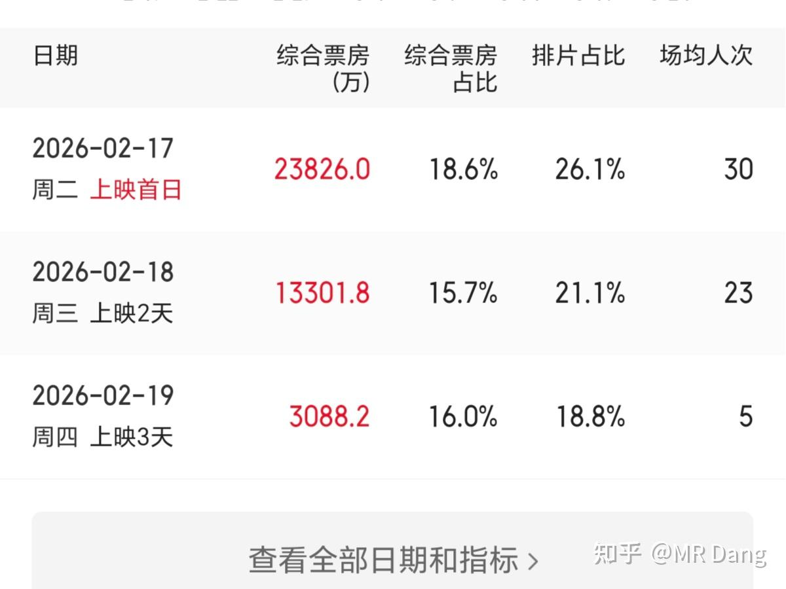

# 非专业影评2

---

**发布时间**: 2026-02-19 08:04  |  **原文链接**: https://zhuanlan.zhihu.com/p/2007463646985491218  |  **点赞数**: 189 人赞同

**作者信息**: MR Dang​​独立投资人，不接广不卖课，无任何其他平台，无小号。

---

## 正文内容

昨天去看了国师的新作。

我个人对张导是有点滤镜在里面的，小时候没怎么去过电影院，所以想看电影，都是在路边店买vcd去看。

记得当时斥巨资28买了一盒不知道是不是正版的《英雄》碟片，用家里的步步高dvd播放机来来回回看了那么十来遍。

有一些镜头也是反复观摩学习（看过英雄的应该能猜出是哪些镜头），非常喜欢国师的色彩美学。

这部新作的话，怎么说呢，很拧巴。

如果以一部烂片的预期去看它，会有惊喜。

如果冲着国师的水准去看它，会有点失望。

如果用主旋律的要求去衡量它，它更商业化。

如果用商业片的要求去衡量它，它又没那么迎合观众。

它的叙事结构不紧不慢，没有太大的惊喜。

虽然有反转，但是不会让人因此提高对它的评价。

我个人主观评分给到6.5左右，考虑春节场景下的节日适配性，可能分数会降低到6分左右。

除非春节期间打算看三部以上，否则不推荐作为全家老少一起合家欢的首选。

我也不知道片方定档春节档是在想啥，是觉得在春节期间没人能拒绝一部安全主题的宣传片？

这明显定档国庆更适合啊。

回到电影本身，先给演员点个赞，演技全在线，特别是四字弟弟，一点也不让人出戏，没有拖后腿。

当然我最喜欢的还是大幂幂，就是下线有点早了，看到后面有点没尽兴的感觉。

就这个豪华的阵容和及格线以上水准的演技，我作为普通观众挑不出什么太大的毛病。

我个人觉得问题最大的还是剧本。

我能理解电影里发生的情节几乎都是现实生活里发生过的真实案例，因为有相关部门的指导，所以这方面绝对没问题。

但是恰恰因为这样，所以这更像一场命题作文，给了各种真实案例，又要在一百多分钟的篇幅里塞进去。把这些不同背景下的案例窜起来，需要非常深厚的编剧功底。

而且不知道是不是国师的个人喜好，都2026了暗杀还在用弩箭，我是真的有点没绷住。

《英雄》里好歹是铺天盖地的弩箭雨，怎么到现在反而档次降低了。

另外就是正派力量太强了，反派根本毫无胜算，各种无人机俯瞰让人有一种一切尽在掌握的上帝视角，没有紧迫感，带动不了观众的情绪。

还有孕期出轨这种狗血剧情其实可以不用硬往上靠的，把这部分描写如果换成对反派实力的刻画，渗透手段的细节展示，会更有冲突感。

回到画面上，这部电影也没突出国师最爱的色彩美学，倒是各种怼脸特写+颗粒感底噪，带来老式ccd卡片机的质感，有点90年代港片的味道，有些镜头会让人觉得在致敬无间道的经典场面。

电影到这就差不多了，不过电影背后的资本故事也值得看一看。

国师是国内导演的top1，从各种大型活动来看，同行承不承认无所谓，这可以算是官方认证的。

作为大导演，除了艺术追求，平台和资源整合能力也是独一档的。

所以只要有意愿，像这种水平的片子，对国师来说一年一部是毫无压力的，每次都能集齐流量+演技+主旋律+排片+宣发+资本加持，只要剧本稍微给点力，票房都不会太差。

这部片子的制作成本据说有5.6亿，按照38％总票房分账比例，票房要达到15亿左右才能回本。

以目前的势头，可能总票房也就十亿左右，所以这一部大概率是要亏的。

这种有教育意义的片子，哪怕票房差了，也不会有人去质疑国师的水平，因为除了国师，换其他任何一个导演来，命题作文的前提下，票房只会更差。

从排片和票房占比来看，目前16％算是它本来的位置，第一天26％的排片属于溢价，所以国师的溢价就是自带10％的排片buff，牌面拉满了。

今天去看《镖人》，为了省电影票，特意提前买的早场。

我看过动画版，没看过原著。我给动画版很高的评价，8分往上那种，所以会用这个标准去衡量电影版。

一个喜欢保护韭菜的博主，希望大家少少踩坑，多多赚钱！！！

> [!comment]- 点击展开评论
> | 用户 | 时间 | 内容 |
> | :--- | :--- | :--- |
> | 伊之助 | 1 小时前 | 早上好，年前是贺岁诗人，过年是影评人，年后是价值投资人。 |
> | &nbsp;&nbsp;&nbsp;&nbsp;MR Dang | 1 小时前 | 哈哈哈，斜杠青年 |
> | 终日乾乾 | 2 小时前 | 大幂幂，人如其名 |
> | MR.保护伞 | 1 小时前 | 秒懂，讨厌 |
> | 施文 | 1 小时前 | 等一下，我老公呢？ |
> | 牛教授 | 1 小时前 | 看看MBA的同学都太单纯了。竟然没有那张图，那我来发吧。 |
> | 在知乎当民科 | 27 分钟前 | 你小子 |
> | 终日乾乾 | 25 分钟前 | 竟然有库存 |
> | 花好月圆人长久 | 19 分钟前 | 这是我能看到的吗 |
> | 花好月圆人长久 | 18 分钟前 | 教授，我有个朋友想多看一些，有图要多发 |
> | 鼠鼠无地自容 | 1 小时前 | 连看电影都在保护韭菜的党老师 |
> | Charon'D | 9 分钟前 | D哥早，看电影都要提醒韭菜不要被割 |
> | 在知乎当民科 | 29 分钟前 | 大D老师真好，看电影都要提醒韭菜们不要踩坑 |
> | zascy | 1 小时前 | 老师早上好 |
> | xjhxjh | 46 分钟前 | 早上好，先赞后看 |
> | 饮水思源 | 1 小时前 | 大佬 ，早啊 ～大年初一那篇想留着慢慢看的，没想到看不到了，学习要趁早啊 |
> | 乐乐公子 | 54 分钟前 | 老师要不要发公众号呀，初一那篇还没有细细看 |
>
>
>---

*本文件由自动脚本从MR Dang知乎页面提取生成*

---

**作者**: MR Dang
**链接**: https://zhuanlan.zhihu.com/p/2007463646985491218
**来源**: 知乎

*著作权归作者所有。商业转载请联系作者获得授权，非商业转载请注明出处。*

---

## 相关阅读

**🎬 影评系列：**
- [[20260220-非专业影评3|非专业影评3]] - 《镖人》电影版深度解析与春节档票房分析
- [[20260218-非专业影评|非专业影评]] - 春节档电影市场分析与《熊出没》票房解读
- [[20251130-《疯狂动物城2影评》&指数调整|疯狂动物城2影评]] - 动画电影与指数调整分析

**🎊 春节系列：**
- [[20260221-迎财神|迎财神]] - 初五迎财神的传统文化与投资环境思考
- [[20260217-拜年啦|拜年啦]] - 春晚观后感与白银LOF赔付方案解读
- [[20260216-丙午除夕致股海诸君贺岁|除夕贺岁]] - 丙午除夕致股海诸君的贺岁辞
- [[20260215-春节特辑2(年二十八）|春节特辑2]] - 年前最后一天的投资闲聊
- [[20260214-春节特辑（年二十七）|春节特辑]] - 春节前的市场展望

**💰 投资视角看电影：**
- [[20251118-《韭菜保护合集卷八》仓位控制|仓位控制]] - 如何科学管理仓位避免踩坑
- [[20251103-《韭菜保护合集卷七》如何测算股息率|测算股息率]] - 股息率计算方法详解

**🎉 万粉感言系列：**
- [[20260201-十万粉感言|十万粉感言]] - 量子态叠加理论与高股息方法论
- [[20260117-五万粉感言|五万粉感言]] - 投资心路历程分享

**📚 投资方法论：**
- [[20251022-《地阶功法卷一》投资者必须斩杀的三个妄念|地阶功法卷一]] - 投资者必须斩杀的三个妄念
- [[20251023-《地阶功法卷二》价值投资三大误区|地阶功法卷二]] - 价值投资三大误区详解
- [[20251011-下周一股市就要大跌了，作为投资者该如何应对？|大跌应对]] - 面对大跌的正确心态
