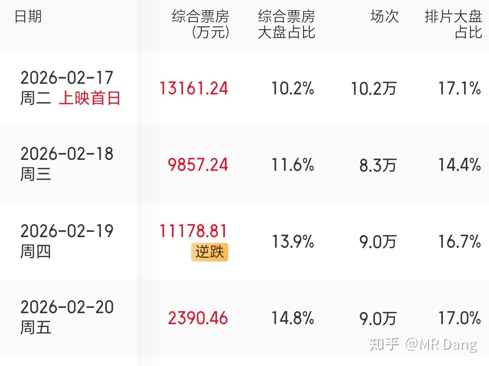
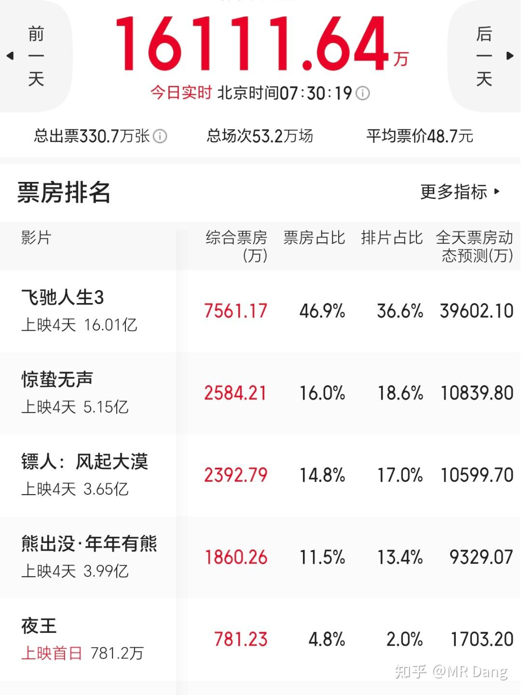

# 非专业影评3

---

**发布时间**: 2026-02-20 07:43  |  **原文链接**: https://zhuanlan.zhihu.com/p/2007862493217829046  |  **点赞数**: 205 人赞同

**作者信息**: MR Dang​​独立投资人，不接广不卖课，无任何其他平台，无小号。

---

## 正文内容

《镖人》看完了，因为要写影评，所以看的时候特别认真，并且和看过的动画版做了详细对比。

简单的说，我给动画版8.5分左右，电影版大概就是7分。

假设没有动画版的先入为主，那我可以给到7.5分。

这差的0.5分是剧情重构带来的内核缺失。

总体来说，电影版最大的优点有两个：

1.打戏观感是很不错的，爽。

它的结构很简单，一来给个场景，简单介绍下出场人物，然后哐哐哐开始干仗，一阵拳拳到肉的打戏以后，既分高下也决生死，可能角色你还没认全，就已经没了，换下个场景。

然后下个场景再把上面那套流程重复一遍。

然后再重复，一直重复。

所以你可以想象，整部影片塞满了各种打戏，如果你爱看这种类型的，那就不要考虑了，无脑入，爽就完事了，不整那虚头巴脑的。

2，画面营造很有氛围感，很沉浸。

当雅丹地貌+沙尘暴+骑兵的组合出现在大屏幕上的时候，一下就把人带入到那个乱世的西域了，很有说服力的镜头和配色，很赞。

优点说完了，说缺点，分为硬件类和软件类。

硬件类：

1.配音不好。

当然现场收音值得鼓励，包括演员的台词功底也是不错的。

但是，像老莫这种重要的具有鲜明地方特色的角色，如果把握不住，哪怕用动画版的配音都可以，但是片方用了影帝的真声。

影帝在港星里算是普通话还可以的，不过还是能听出来港普的味道。

所以当一个古代西域部落的首领操着一口流利的港普在推进剧情的时候，这个人物的形象是立不住的，很跳戏，很违和。

哪怕是影帝级的演技也挽救不了。

2，镜头方面有失焦的情况存在。

这是一个比较严重的问题了，我看目前好像网上这方面的反馈声音不大。

但是起码我看的那场，个别武打镜头，因为动作幅度比较大，景深变化明显，追焦员可能反应不过来，所以中间有几帧的失焦画面，会造成观影更加容易疲劳，体验变差。

这个问题其实比较好解决，就是光圈开小一些，景深做的深一些，就不会发生了。

可能是摄影组不想放弃高端镜头大光圈的优势，想给出更优质的画质，所以把难题丢给追焦员了，目前来看，难度还是有些大了，完成度不高。

不是我吹毛求疵，我之前遇到相似的难题：因为自己想动手拍点小视频，买了专门的轨道车，搭了场景，然后往那个轨道车上一坐，一开机，就发现根本不是一两个人能搞定的事，追焦都追不上，一运镜就会虚。

如果妥协画质，开小光圈，就会和普通视频拍摄没区别，质感全无。

软件类：

以下有剧透，请谨慎食用。

1，剧情方面，《镖人》的电影版和动画版第一季剧情长度一致，都是一直叙事到长安前的剧情。

但是人物刻画方面有重大差异。

动画版的主线任务是护镖，支线任务是复仇，刀马是主角。

其他包括阿育娅在内的角色都是配角。

它是一部群像剧，阿育娅是一个线索人物，把支线任务和主线任务串起来了。

而知世郎是最重要的配角，他是被护送的镖，神秘，戏份多，吊人胃口。

电影版的护镖和复仇都是主线任务，甚至为了突出那种复仇的爽感，护镖的优先度都降低到复仇之后了。

而在戏份的分配上，阿育娅被无限拔高到了女主的位置，甚至还和刀马有了一些暧昧在里面，这个我不知道原著的情况，起码在动画版里是看不出来的。

知世郎戏份遭到削弱，变成了一个工具人角色。

这么处理也不是不行，但是刀马的复仇动机就变味了，从一个挣扎的亦正亦邪的江湖儿女路见不平拔刀相助的故事，变成了替暧昧对象复仇，并且顺手解决了暧昧对象的前未婚夫的故事。

刀马这个角色的层次感和复杂度就下来了。

2，内核方面，历史的厚重感缺失，这是改编最大的地方。

动画版因为时间长，大概三百多分钟，它做的很细，做出来的效果就是很有历史厚重感。

历史厚重感怎么来的呢？

对比出来的，江湖——朝堂——历史。

江湖的打打杀杀，恩怨情仇，在朝堂看来就是小孩过家家。

什么五大家族，在裴侍郎眼里不过土鸡瓦狗耳，弹指可灭。

所以朝堂对江湖，是碾压之势。

而这么强的朝堂，在朝代更替，天下大势前面，也挡不住历史发展的车轮滚滚。这么一对比，历史的厚重感就一下上来了。

而电影版，因为缺少了对代表着朝堂的裴侍郎的刻画，所以朝堂对江湖的压迫感完全没有烘托出来，那历史的厚重感就更没办法还原了。

这是没办法的妥协，因为要在一百多分钟内塞下这么多的内容，总要有重点，想要打戏爽，那就先干了再说。

至于文戏，内核，可以舍弃，只要能交代清楚为什么要干，谁是正派谁是反派就行了。

所以没看过原著的路人观众可能观感会不错，因为剧情不是过于降智，打戏精彩，都是一线的演员，演技也有保障。

原著党可能会在还原度上有意见，所以给出的评价会更苛刻一些。

至于电影之外的一些东西，不在我的讨论范围，我个人看电影就只是电影，太宏大的话题也参与不了。

这部电影可能12岁以内的小朋友不太适合，我去的时候一个爸爸带了三个小朋友来看，目测大概十岁左右，看到滚落的头颅画面，小朋友嘴硬的表示不好看，一点也不吓人，然后就拉着爸爸退场了。

情况就是这么个情况，我个人如果有得选，我会去看动画版，除了物理上的打击感没电影版这么强，其他我觉得都是更好的。

它的受众就是拳拳到肉的打戏爱好者，所以这样的受众群体决定了这部电影虽然口碑一路好转，但是票房可能也就那样了。

制作成本据说有5.5亿，加上换角的1.5亿，高达7亿。

所以回本需要20亿以上的票房了。

至于这个制作成本的水分，按照演员的咖位，以及拍摄周期，和最后呈现出来的镜头质感，即使有宣发的水分，也不会太大。

目前的预期票房可能和国师半斤八两，十亿多出头，15亿到不了，所以赔是赔定了，就看赔多少了。

电影市场就是这么残酷，赢者通吃，其他陪跑。

从这一方面看，狗熊还是厉害，国内拍到第12部续集还能有这样票房的，仅此一例。

第二名应该是唐探系列，不过也才到第四部。

今天两广地区上了一部《夜王》，粤语喜剧片。港片贺岁片一般很纯粹，就是爆爆粗口，搞搞笑，发发财，讨个好彩头。

能完成以上四点，哪怕没上价值，剧情稀烂，也会有固定受众。这部电影我一看海报就知道稳了。

制作成本可能在大几百万到一千多万左右，按照目前的票房趋势，可能是春节档里少数能赚钱的几部电影之一。

这部电影运气不错，今年春节档没有特别传统的爆米花贺岁片，这个生态位没人和他竞争，上映的时间也选的巧，避开了其他大片的锋芒。

可惜除了两广没排片，现在数据很不错，2％的排片贡献了4.8％的票房。

一个喜欢保护韭菜的博主，希望大家少少踩坑，多多赚钱！！！

> [!comment]- 点击展开评论
> | 用户 | 时间 | 内容 |
> | :--- | :--- | :--- |
> | 归去来兮 | 3 小时前 | 涉市数载，懵然未觉；今岁始决，潜心究理。幸蒙Dang师启蒙，得窥门径。自忖已离草灰之列，渐入散修之境，然正统筑基，犹若云外青山，未可即至。所悟心法四相，以契大道：无我相：勿以己好恶断企业之优劣。尝有深厌之司，众人持之而获利，是知私情蔽明，不可凭也。无人相：人皆嗜即得之利，能守迟效者，非经磨砺，即由习成。故当养静待之志，以制躁动之性。无众生相：不逐喧哗之势，不附群趋之潮。买于寂寂无人问津之地，卖于熙熙攘攘争逐之时，方得先机。无寿者相：勿恃旧识为圭臬，莫以陈迹作准绳。新知日出，异论纷呈，唯虚怀若谷，乃可纳百川而通变。”若见诸相非相，即见如来。”  离四相，则慧光自现；破执念，则果满功圆。 |
> | CHEN prag | 2 小时前 | 程序员：show me the code管你投资还是投机：show me the account |
> | 归去来兮 | 2 小时前 | show个🥚，我现在散修都算不上，秀出来让人笑掉大牙咋办 |
> | 曹家小豆丁 | 1 小时前 | 可以了 你这都成佛了啊 |
> | 如意 | 2 小时前 | 俺也分享下春节追的剧： 海市蜃楼，有点庆余年和三体结合感，推理伏笔总体也还不错 |
> | &nbsp;&nbsp;&nbsp;&nbsp;MR Dang | 1 小时前 | 好，有空看看 |
> | 如意 | 1 小时前 | 爱奇艺上线，一次性上线24全集。无明星加持，看的很上脑，彩蛋整的意犹未尽 |
> | 拓跋逸轩 | 1 小时前 | 导演主演们  很不错的。十几年前  毛骗 三部。很喜欢很贴合那个时代 |
> | 资本主义必将消亡 | 3 小时前 | 早上好呀dang老师，居然是在首页刷到的，啪的一下就点进来了看起来今年春节档电影不太行呀，大家观影热情下降了好多，忍不住想那些拿着电影股票过年的股民应该会有点焦虑吧 |
> | &nbsp;&nbsp;&nbsp;&nbsp;MR Dang | 3 小时前 | 已经可以计提损失了 |
> | Mitsui | 43 分钟前 | 今天的奶茶继续由恒科的股东买单 |
> | 张春辉 | 6 分钟前 | 老祖太厉害了，投资博主中最会写影评的，影评博主中最会投资的 |
> | 梭状回 | 1 小时前 | 早上好等春节结束票价降低了再去看 |
> | LUODONG | 2 小时前 | D哥早，剧情改得不好就有点难受了，缺点比优点多的样子，不过还是想去看看 |
> | &nbsp;&nbsp;&nbsp;&nbsp;MR Dang | 2 小时前 | 可以试试，还行 |
> | spore | 3 小时前 | 早上好，你这几点睡啊，这么早起，每天还要码字😅 |
> | 大鹏四哥 | 2 小时前 | D佬每天五点起床 估计他要操作卖美股 ，才要那么早起床 |
>
>
>---

*本文件由自动脚本从MR Dang知乎页面提取生成*

---

**作者**: MR Dang
**链接**: https://zhuanlan.zhihu.com/p/2007862493217829046
**来源**: 知乎

*著作权归作者所有。商业转载请联系作者获得授权，非商业转载请注明出处。*

---

## 相关阅读

**🎬 影评系列：**
- [[20260218-非专业影评|非专业影评]] - 春节档电影市场分析与《熊出没》票房解读
- [[20260219-非专业影评2|非专业影评2]] - 国师新作观影体验与主旋律商业片的拧巴
- [[20251130-《疯狂动物城2影评》&指数调整|疯狂动物城2影评]] - 动画电影与指数调整分析

**🎊 春节系列：**
- [[20260217-拜年啦|拜年啦]] - 春晚观后感与白银LOF赔付方案解读
- [[20260216-丙午除夕致股海诸君贺岁|除夕贺岁]] - 丙午除夕致股海诸君的贺岁辞
- [[20260215-春节特辑2(年二十八）|春节特辑2]] - 年前最后一天的投资闲聊
- [[20260214-春节特辑（年二十七）|春节特辑]] - 春节前的市场展望

**💰 投资视角看电影：**
- [[20251118-《韭菜保护合集卷八》仓位控制|仓位控制]] - 如何科学管理仓位避免踩坑
- [[20251103-《韭菜保护合集卷七》如何测算股息率|测算股息率]] - 股息率计算方法详解

**🎉 万粉感言系列：**
- [[20260201-十万粉感言|十万粉感言]] - 量子态叠加理论与高股息方法论
- [[20260117-五万粉感言|五万粉感言]] - 投资心路历程分享

**📚 投资方法论：**
- [[20251022-《地阶功法卷一》投资者必须斩杀的三个妄念|地阶功法卷一]] - 投资者必须斩杀的三个妄念
- [[20251023-《地阶功法卷二》价值投资三大误区|地阶功法卷二]] - 价值投资三大误区详解
- [[20251011-下周一股市就要大跌了，作为投资者该如何应对？|大跌应对]] - 面对大跌的正确心态
