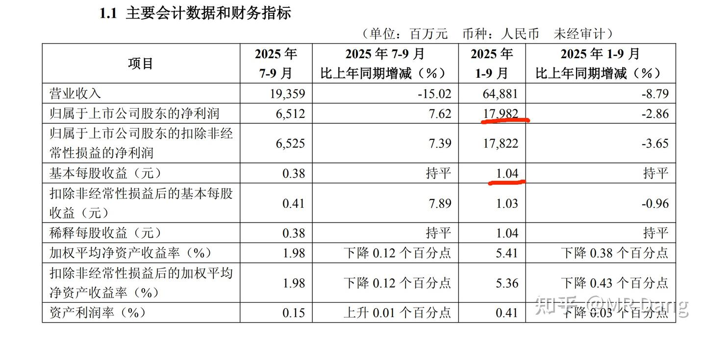
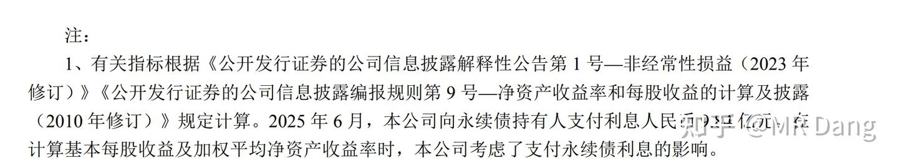
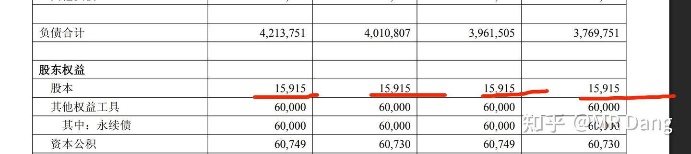
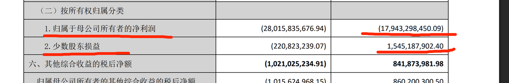

# 《地阶功法卷六》每股收益知多少

---

**发布时间**: 2025-11-24 07:25  |  **原文链接**: https://zhuanlan.zhihu.com/p/1975847416059164347  |  **点赞数**: 592 人赞同

**作者信息**: MR Dang​独立投资人，不接广不卖课

---

## 正文内容

今天谈一个非常重要，非常基础，做投资必须学会的概念，也就是每股收益的计算。

在任何财经类的考试中，每股收益都是必学必考的内容。

我的读者里有很多基础非常过硬的投资者，CPA也不在少数，粗略看了下应该有上千了。

但是也有很多小白，或者新手投资者。

同时我自己对每股收益也有一些不太成熟的看法。

所以今天的文章就深入浅出的说一下每股收益的计算逻辑。

基础概念：

1.归母净利润

净利润咱们经常说，这个好理解。

你开了个超市，年收入100万，扣去进货房租水电人工折旧的成本80万，最后把税一交，净落了15万，这15万就是净利润。

那么归母什么意思呢？

这个母，就是母公司的意思。

你可以理解成”我“

也就是归属于”我“的净利润。

在上面这个例子里，你的超市一开始的时候不是自己一个人开的，你二舅还入了10%的股份，大舅也入了10%的股份。

你其实只有80%的股份，所以最后那个15万，只能拿走15*0.8=12万，剩下的三万要分给大舅和二舅。

这个12万就是所谓的归母净利润。

2.流通在外：

流通在外什么意思呢？

假设你的超市上市了，上市前100股，你有80股，大舅二舅一共20股。

IPO又发了60股给韭菜。

现在一共160股，你有80股，持股比例50%。

上市以后，股价跌跌不休。

你们一合计，这不行啊，开个股东大会。

发了个公告，说公司要回购股票了，一共回购10股。

这10股先放在公司账上，以后用来奖励店长和收银员。

这个时候，流通在外的股票就只有160-10=150股了。

所谓的内外，指的是在不在上市公司账本上。

在公司账上的叫库存股，一般是限制性股份什么的。

不在公司账上，可以在资本市场交易的，叫流通在外。

流通在外的概念不等于流通股本。

(这里比较绕，要多看看)

比如你的80股由于减持规定，上市以后不能立即交易，不是流通股。

但是属于流通在外的范畴，因为它是在大股东账上，而不是在上市公司账上。

判断是否流通在外的黄金标准就是股票持有人是否是上市公司本身。

3.普通股

普通股就是普通投资者拿的股票，咱们讨论的大部分股票都是普通股。

与普通股相对应的概念叫优先股，一般是银行或者一些大型的企业发行的类似于债券的一类东西。

优先股一般不在A股交易，优先股的股东对一般的经营事务没有什么参与权，但是优先股股东可以收取优先股股息。

所谓的优先，意思就是超市破产了，货架和别的盆盆罐罐卖了5万块，这5万块要先赔给债权人，然后是优先股股东，剩下的才能轮到其他普通投资者去瓜分。

4.加权平均股数

按照时间加权计算一年之间平均的股数。

什么意思呢？

比如你年初的时候总股本是100股，7月份的时候IPO了，总股本变成160股了。

那么这一年的加权平均股数就是（100*6+160*6)/12=130股

（6个月100股，6个月160股）

如果是10月才IPO，那加权平均股数=（100*9+160*3)/12=115股

（9个月100股，3个月160股）

基础概念学完了，咱们来学每股收益。

每股收益一般就是投资者俗称的业绩。

这个业绩大约等于净利润/总股本

你平时用这个来做决策，问题不大。

但是有些投资者用这个测算以后，发现和财报上的不一样。

那我们就需要更精确的计算。

每股收益分两种，一种叫基本每股收益，一种叫摊薄每股收益。

投资者一般看重的是前者，后者是考虑可转债或者其他潜在的股本后的每股收益。

所以这篇文章只讲基本每股收益，摊搏每股收益有兴趣的可以自学哈，原理大差不差的。

基本每股收益=（归母净利润-优先股股息-永续债利息)/流通在外普通股加权平均股数

和上面那个简陋的公式对比，会发现差距主要在以下几点

1.分母上，有一个流通在外的修饰词，如果一家公司有回购或者其他库存股，会导致流通在外的股数变少，也就是分母变小，从而使得真实的基本每股收益比粗略计算的更大。

2.分母上，还有一个加权平均的的修饰词，如果一家公司在一年中发生债转股，增发，或者其他股本变动，则会导致加权平均股数＜期末总股本。

很多人都是用净利润/期末总股本，从而使得真实的基本每股收益比粗略计算的更大。

3.分子上，要减去永续债或者优先股的影响，从而使得真实的基本每股收益比粗略计算的更小。

说了这么多了，可能还是云里雾里的，咱们实战一下吧：

HXYH三季报如图，总股本是159.1亿股。

如果按照一般的粗略计算，则每股收益=179.82/159.1=1.13元/股

实际上的基本每股收益是1.04元，比粗略计算的要小。

根据我们上文的推理，则考虑是优先股或者永续债影响。

第一步：

分子的处理，先找到半年报：

半年报中表示永续债利息9.84亿，那推算三季报的永续债利息大约为9.84/2*3=14.76亿

则基本每股收益的分子为179.82-14.76=165.06

第二步：

分母的处理：

看了下股本，期间没有变动。

同时没有库存股等特殊事件，因此，就以159.15进行计算就行了。

则基本每股收益=165.06/159.15=1.04元/每股

看到这里，恭喜你解锁了CPA考试里最难科目财务成本管理的必考内容。

看的有点晕晕乎乎的？

没关系，不重要，只要会看每股收益就行了，公司都给你算好了。

但是以我多年闯荡各种论坛的经验，每次在财报季都会有资深的投资者跳出来指责上市公司计算的每股收益有错误。

因为每股收益是一个原理看起来简单，但是实际算准并不容易的数据。

我们并不需要学会具体的计算过程，但是要可以反推出每股收益和粗略计算之间差距的原因。

以上内容属于基础内容，下面开始拓展一下：

1.归母净利润和少数股东损益。

这是个很有趣的点，就像我们开超市，占股80%，大舅10%，二舅10%，最后应该一荣俱荣，一损俱损。

但是有的公司，特别是房企之类的非常缺钱的企业，你去观察的它的财务报表，会发现少数股东的利润特别稳。

超市赚钱的时候，大舅和二舅也赚钱很好理解。

但是超市明明都要破产了，大舅和二舅还在赚钱，是不是有点匪夷所思？

比如某龙头的报表，上市公司赔了这么多，少数股东还在挣钱。

（热知识，括号里的数字代表负数）

为什么呢？

一般这种情况就可以考虑明股实债了。

也可以叫做表外负债。

就是看起来是大舅二舅给你签了了个入股协议，结果仔细一瞅，后面还有个抽屉条款，你要按照约定的价格回购大舅二舅的股份。

看起来是股，实际上是债。

2.永续债和优先股的划分

这部分内容也是CPA里很重要的一个章节，在会计科目里应该是第十三章里讲金融资产的划分时会提到，一般的课程里光这部分内容就有三十个课时以上。

很多人死记硬背会计分录，即使过了也没搞清楚底层逻辑是什么。

其实说到底，就一个判断金标准，能不能无条件不还钱。

你不要管那个金融工具叫什么，永续债也好，优先股也好，可转债也好，名字不重要，叫什么都行。

重要的是你作为上市公司，在拿了钱的同时，以后可不可以不还钱。

可以不还钱的就是股，必须还钱的就是债。

如果要还一部分钱，那需要还钱的部分就是债，不需要还钱的部分就是股，这种叫复合金融工具。

就这么简单，一点都不复杂。

3.回购的影响

公司回购一般有两种，给员工的股权激励和直接注销股本。

一般人的认知里，股权激励不影响总股本，对每股收益没有影响。

注销股本减少股本，可以提高每股收益。

可是通过上文的计算公式可以得知，即使是用作股权激励，只要当期作为库存股列报在资产负债表，也会提高每股收益，因为库存股就不属于流通在外了。

但是这种影响是暂时的，当授予员工后，库存股重新流通在外时，这种影响就会消失。

同时股权激励会在当期就扣除费用，降低分子，总的对每股收益的影响需要另行计算。

最后留一个思考题吧，hxyh2024年归母净利润增加了4%，但是每股收益增加了9%，二者并不同步。

这是什么原因造成的呢？

很多人问的比较多的btgf，90万吨开采批下来了，按照这个时间，如果没有提前开采的话，可能今年完成任务有点悬。

但总归是好事，现在这个价格距离我第一次推荐的价格比较近了，锚定股息率的话就还不错。

如果这周有合适的价格我也会考虑重新上车的，目前确实空仓仓位有点大。

不建议模仿，鄙人不善择时。

如果涨的多了我不会追。

还有没有什么要叮嘱的？

有的，兄弟，有的。

别忘了申购今天的摩尔线程。

一个喜欢保护韭菜的博主，希望大家少少踩坑，多多赚钱！

---

## 精选评论

| 用户 | 时间 | 内容 |
| :--- | :--- | :--- |
| 陈阿呆 |  | 已严肃学习，思考题：可能是hxyh的流通在外股数减少了，但三季度股本不变，永续债股息推算严丝合缝，那么合理推断是剩下的一个参数，优先股股息减少乃至清零了，等会消息验证下。 |
| &nbsp;&nbsp;&nbsp;&nbsp;MR Dang |  | 看出来学的很认真了 |
| 陈阿呆 |  | 没有搜到公开信息，不过我应该是猜对了吧，再请教下老师，观察到银行股的优先股股息的减少对投资有什么帮助吗？ |
| &nbsp;&nbsp;&nbsp;&nbsp;MR Dang |  | 可以猜测分红力度 |
| WWWeeds |  | 分母上流通在外股本没有变化。分子上，虽然 24 年有永续债赎回利率减少的情况，但是年支付永续债利息两年均为 19.4e，猜测是 24 年永续债利率少总量多的原因。23 年支付了 9.3e 的优先股股息，3 月将优先股全部赎回，24 年没有优先股股息这一项，因此基本每股收益高很多。276 - 19.4  / 159 = 1.62263 - 19.4 - 9.3 / 159 = 1.48AI 看这种带数字的 pdf 文档纯没用，19e 和 194e 也数不对的，估计是 token 切坏了。 |
| 洗洗睡吧123 |  | 班长 |
| 将计就计叫姐姐 |  | 大佬早，很久没有在知乎看到氛围这么好的评论区了，保护dang大人人有责 |
| &nbsp;&nbsp;&nbsp;&nbsp;MR Dang |  | 都是我请来的托 |
| 淡淡 |  | 真的是尽心帮大家，感谢 |
| 石头的成长印记 |  | 答题，请dang大批改：主要是永续债利息减少的原因。华夏银行2024至今没有回购，流通股本无变化。华夏银行在2024年赎回了高利率的永续债，同时发行了同等规模但利率更低的新永续债，利率从4.85%降至2.46%，利息支出因此大幅减少。 |
| 想养一只猫 |  | 关于打新这件事儿，我想分享一下，由于不善择时的我们，经常忘记申购，所以使用了同花顺，这个app里面有个自动申购功能不错，每次点击可以自动打新一个月，除了今年，前面的几年基本上每年都能中个一签半债的，相对来说比较省心。 |
| 明天会更好 |  | 以前一年还能中几个债，这两年是一个也中不了了，不知道咋回事儿 |
| 小熊熊 |  | 我两三年才中一签 |
| 想养一只猫 |  | 兄弟们分享喜悦来了，刚刚又中了一个中铀 |
| &nbsp;&nbsp;&nbsp;&nbsp;MR Dang |  | 可以 |
| 想养一只猫 |  | 祝兄弟们都能中摩尔 |
| 沐心 |  | 懂了，冲摩尔和守低位BT |

---

*本文件由自动脚本从MR Dang知乎页面提取生成*

---

**作者**: MR Dang
**链接**: https://zhuanlan.zhihu.com/p/1975847416059164347
**来源**: 知乎

*著作权归作者所有。商业转载请联系作者获得授权，非商业转载请注明出处。*