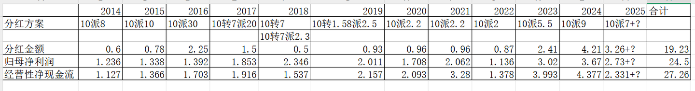

# 《地阶功法卷七》分红的可持续性与净利润的关系

---

**发布时间**: 2025-12-07 07:28  |  **原文链接**: https://zhuanlan.zhihu.com/p/1977004715888902186  |  **点赞数**: 433 人赞同

**作者信息**: MR Dang​独立投资人，不接广不卖课

---

## 正文内容

一个比较基础的议题。

本来不想展开讲的，因为实在没有什么高深的内容，属于比较基础的吃息佬的自我修养。

但是架不住问的人多，可能这方面还是不太直观，没那么好理解。

先说理论基础，这部分内容也在CPA的财务管理和会计里有所提及。

1.净利润是基于权责发生制的会计概念，这个名字很长的权责发生制不是很直观，你就理解成这个净利润是计算出来的就行了，和你理解的净利润是两回事，完全不一样。

2.而分红，用的是现金，也就是真金白银，是和现金流挂钩的，叫收付实现制。

这个名字也不短的收付实现制，就很直观，你就理解成只看钱，其他一概不管。

这两者之间可以换算，换算的时候要干这么一件事：

收付实现制下的经营性净现金流=扣非净利润+非现金费用（比如折旧，摊销，资产减值损失）-非经营损益（投资收益，财务费用）+经营性资产变动（存货/应收账款影响）+经营性负债变动（应付账款/预收款项影响）

停停停！

眼睛都看花了，什么乱七八糟的，有没有例子简单的说明一下？

有的，兄弟，有的。

开超市，你投了100万加盟了我的自有品牌大D超市。

其中50万是给我的加盟费，10万是你的房租水电，40万是首批进货费。

我允许你卖5年，超过时间以后再商量后续合作。

第一年，你一共卖了100万，所有产品成本一共花了50万，还有30万的人工和水电和税费，最后剩下的是40万的货物，和一开始一样，不多不少。

你的会计净利润是多少呢？

100-50-30=20（万元）

对么？不对

你加盟我的时候还有50万的加盟费，只能用5年，这叫无形资产。

简单点，就按照10万/年摊销，你每年还要摊销10万元的无形资产。

所以会计净利润=20-10=10（万元）

假设你的所有交易都是现金往来，没有应收应付。

那么你的现金多了多少呢？

100-50-30=20（万元）

你手里现金多了20万块钱。

现在你要把这20万元分红给自己，有毛病么？

没毛病，挣的钱不分红才是有问题。

第二年，你又卖了100万的货物，30万的人工水电税费不变，产品成本50万（含10万上年的存货），最后剩下了30万的货物。

净利润是多少呢？

100-50-30-10=10

还是10万元。

但是你手里的现金多了多少？

100-30-50+10=30（万元）

净利润那里要减10，是因为有10万的无形资产摊销。

但是手里的现金为什么要加10呢？

因为有你的存货从40万变成30万了，相当于把10万的货变成现金了，所以加10。

你手里又多了30万的现金，尽管你净利润只有10万，你给自己分红30万奖励一下有什么毛病么?

一点毛病都没有。

第三年，挣10万，分20万，能持续么？当然能啊。

第四年，挣10万，分20万，能持续么？当然能啊。

第五年，挣10万，分30万，能持续么？当然能啊。

没有公司可以保证永不落幕，在有限的年限里能稳定分红已经超越95%的公司了。

一共5年，你总共就投了100万，光分红就分回来120万，最后还剩了20万存货和一个超市。

现在有个人路过朝着你的大D超市瞥了一眼，嘟囔着：”分红比净利润还多，持续不了"

你但凡理他一秒钟，都是对时间的浪费。

回到G公司，历年分红金额合计19.23亿，历年经营净现金流量27.26亿，历年归母净利润24.5亿。

事实就是经营现金流＞归母净利润＞分红金额，但是三者比较接近。

这也是我为什么说G公司是一个纯粹的生产资料，一个脱离了低级趣味的生产资料。

能挣钱，挣真钱，挣了分。

而且G公司的商业模式本质上和白酒这种消费是类似的，不依赖于资本的投入。

主要瓶颈不在生产端，而是销售端。

所以挣的钱用来扩大生产并不能有效提高业绩，要按照需求确定产能。

既然这样，分红就是最好的选择，也是对股东来说喜闻乐见的事情。

G公司的风险点不在于分红多，把分红能当成原罪控诉上市公司的纯属欲加之罪。

分红的可持续性疑虑也不在于账面的那一亩三分地。

把时间跨度拉长到3年，3年前的三季报账面资金8.8亿，负债总额6.3亿。

经过这三年的“不可持续的”分红以后。

最新三季报的账面资金10.25亿，负债总额3.3亿。

---

## 精选评论

| 用户 | 时间 | 内容 |
| :--- | :--- | :--- |
| 崔大哥 |  | 说实话，每天dang总更新的内容都不舍得看，生怕读着读着就完了，得一字一句细细地看，一点不夸张，真就类似于品尝那种限量的美食一样，小心翼翼，细嚼慢咽，回味无穷。 |
| &nbsp;&nbsp;&nbsp;&nbsp;MR Dang |  | 感谢关注 |
| 南柯一梦 |  | 党总能不能讲一下三字B车企的报表，感觉那个更像HD |
| PowerPuff |  | 你有这种感觉，那真的是白关注dang总了 |
| Temu |  | 多提一句，G公司有股东离婚，在寻求出售股份。前面出了公告没减持，大概是价格低于16元不满意。所以拿着吃利息没问题，股票上涨后就会有减持，希望不大。 |
| cfnll |  | 换其它博主可能都懒得解释，Dang老师是真爱粉 |
| 夜里思考人生 |  | 一句话：现在买到你就偷着乐吧 |
| 灰马 |  | 大佬每天都准时投喂金融食粮，太感动了 |
| snow |  | 宠粉的党大 |
| 木向阳 |  | 前十名。大佬早上好 |
| 清如许 |  | 从低价铝到yt，犹豫一秒跟车都拍断腿 |
| 可乐终身 |  | Yt 是啥 |
| 清如许 |  | 云图控股 |

---

*本文件由自动脚本从MR Dang知乎页面提取生成*

---

**作者**: MR Dang
**链接**: https://zhuanlan.zhihu.com/p/1977004715888902186
**来源**: 知乎

*著作权归作者所有。商业转载请联系作者获得授权，非商业转载请注明出处。*
