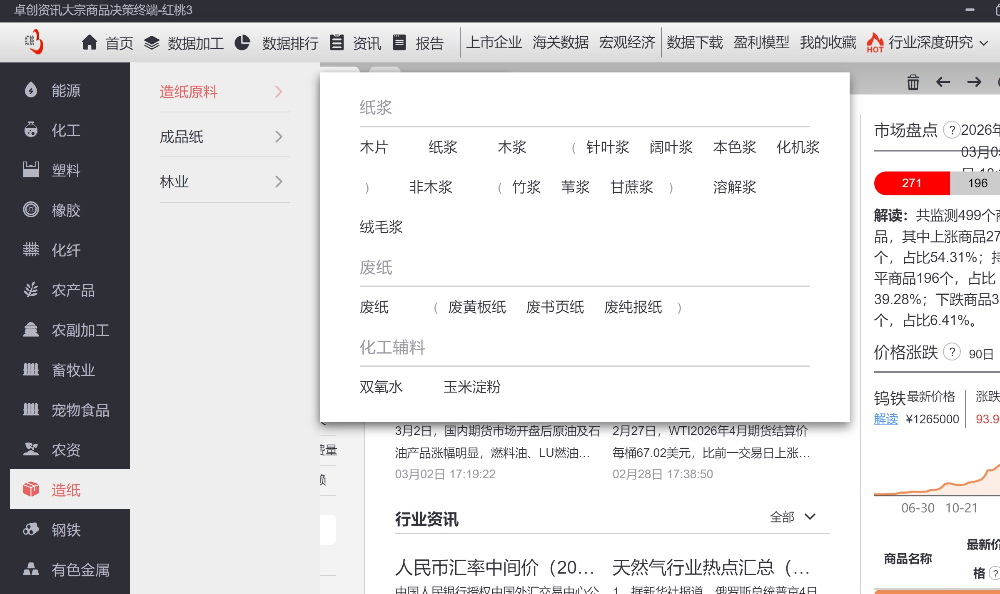
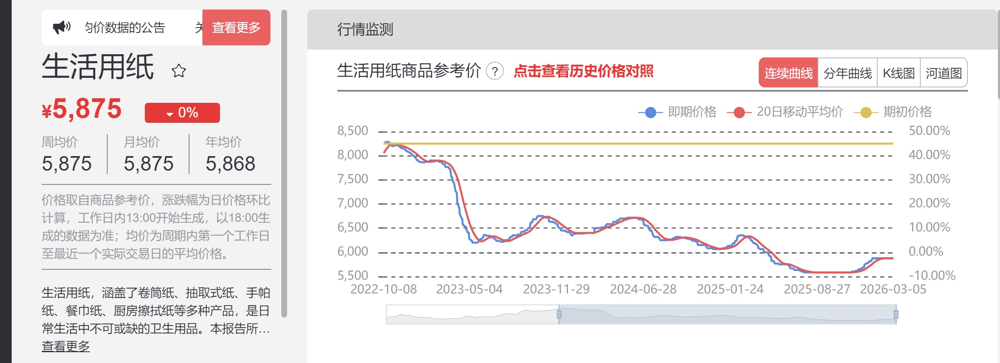
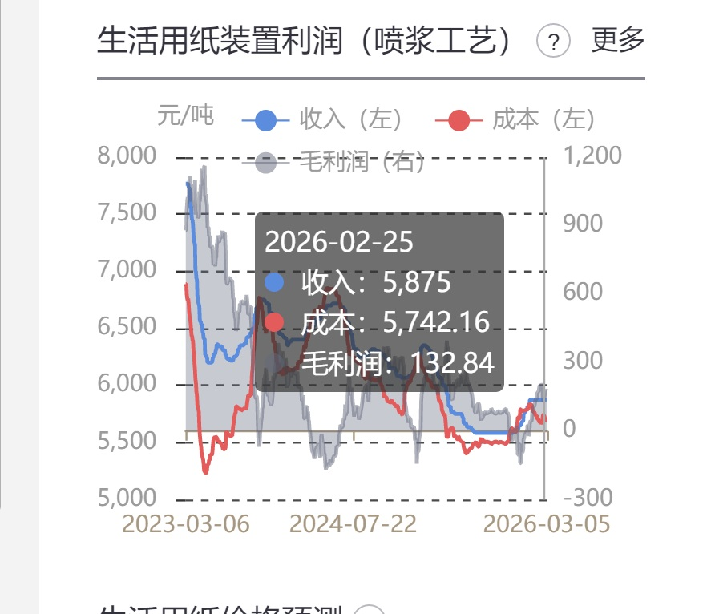
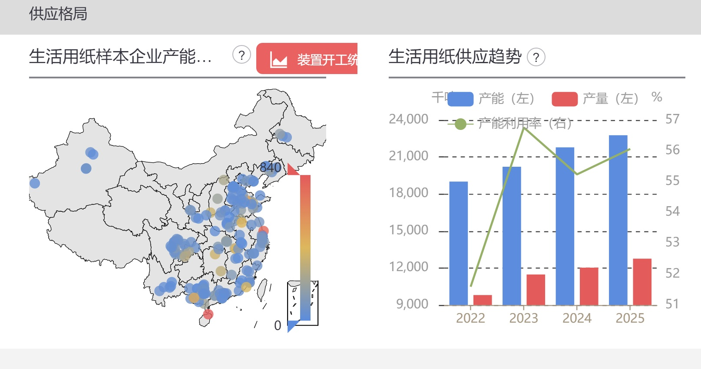
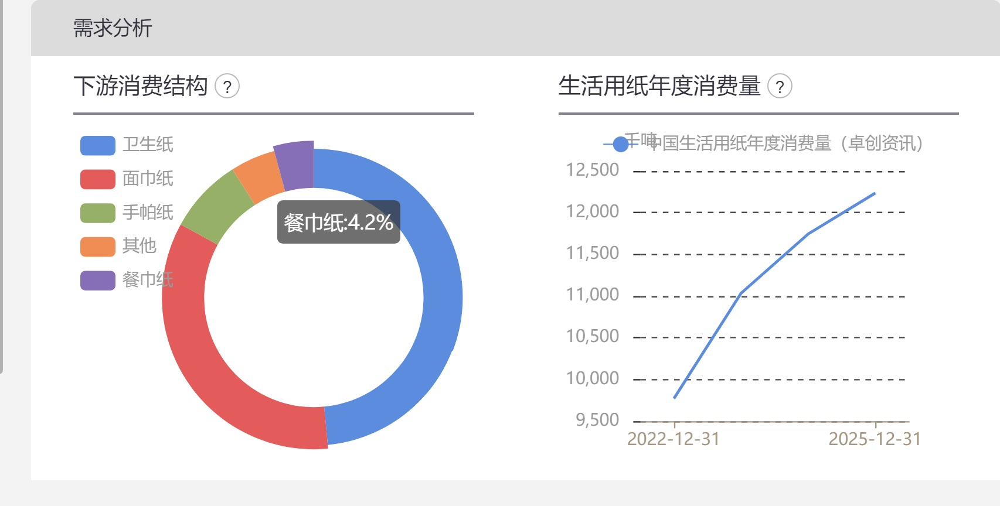
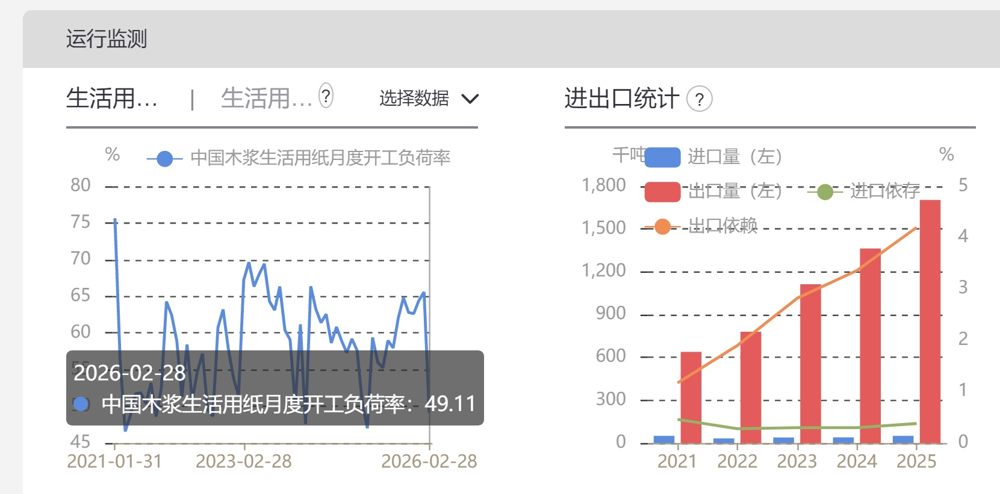
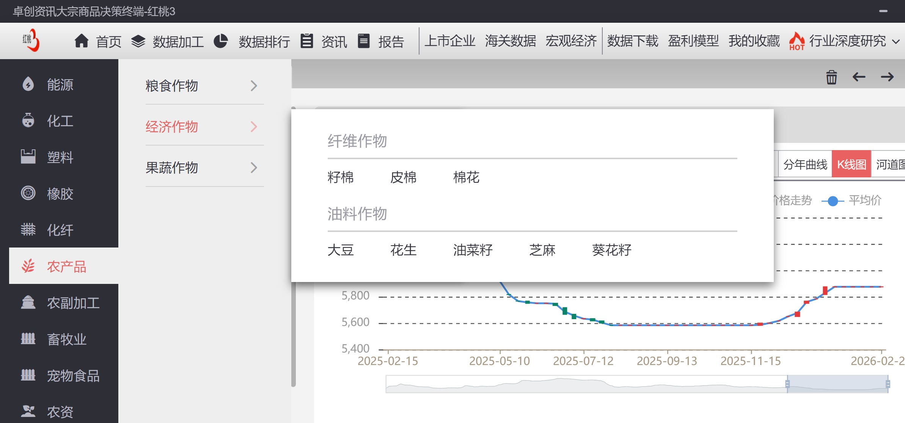
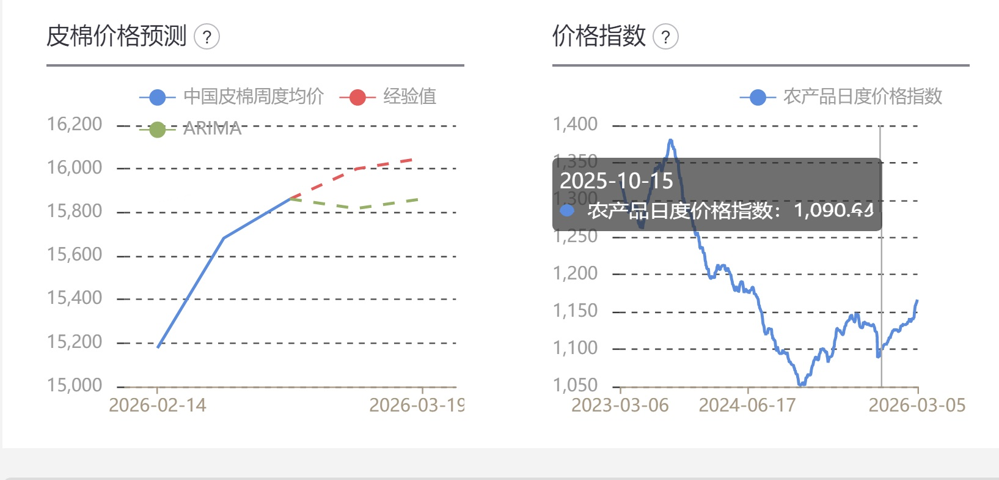
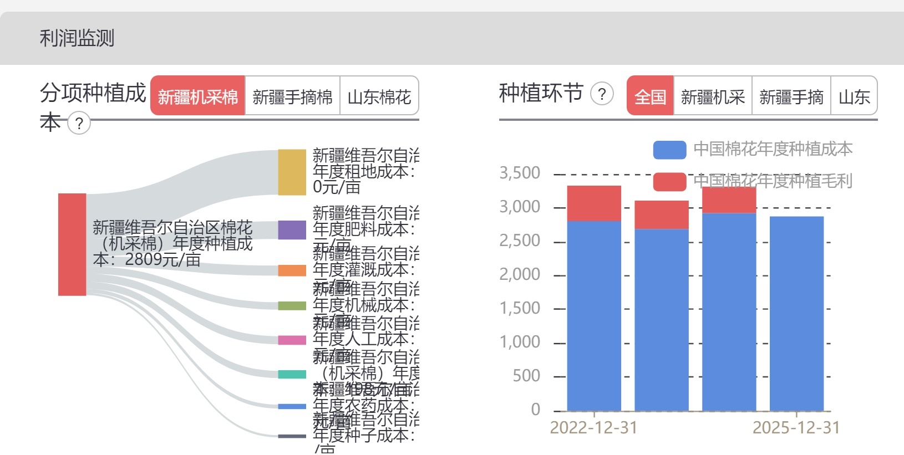
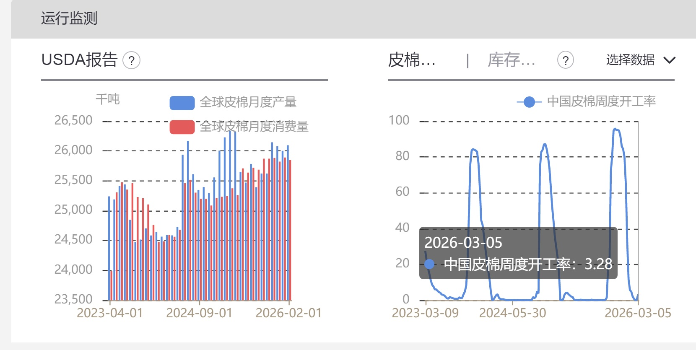

# 《地阶功法卷八》大宗分析秘要

---

**发布时间**: 2026-03-06 13:28  |  **原文链接**: https://www.red-ring.cn/post/27593-1927014  |  **点赞数**: 1303 人点赞

**作者信息**: MR Dang | 小红圈付费社群作者

---

## 正文内容

差不多了，基本上进来找代码的应该走的七七八八了。

剩下的应该都是热爱学习的同学了。

问的人最多的问题，博主博主，你每天分析大宗，用的什么办法。

这算压箱底的东西了，今天毫无保留的教给大家。

---

### 大宗分析，有两个大前提

**一是信源的准确性和及时性。**

类比于打游戏，电子竞技，你的延迟必须低，刷新率要高。

工欲善其事必先利其器，很朴素的道理不是。

**二是供需分析的逻辑性和严密性。**

还是类比于打游戏，你得对英雄的技能机制有深刻的了解。

差生文具多，光有信源也不行，最终还是要落实到决策上。

---

### 1.信源

差的信源不如没有信源，他会干扰你的判断。

**免费信源**：

### 1.*金十数据*：速度快，人气高，入门级行情，有部分品种的实时数据。

但是文字类信息有假新源，综合评价一般推荐，方便，但是不够靠谱，给个NPC。

### 2.*统计局*：速度慢，但是权威，全面，需要一定的检索能力。

**综合评价非常推荐，夯爆了！**

### 3.*FAO（联合国粮农组织）*：农业和食品领域的权威机构，但是速度也慢。

综合评价细分领域推荐，顶级！

### 4.*路边社/彭博*：全球顶级，突发新闻，但是不够综合，数据少，适合事件驱动的投机。

综合评价可以看，但是不能全信，不适合投资决策，给个NPC。

### 5.*LME（伦交所*）：金属定价权拥有者

综合评价LME在细分领域本身是权威的，但是用作投资决策，不够综合，顶级！

6*.ICE（洲交所）+CME（芝交）+USDA（美国农业部）*：同上，分别是不同领域的权威，顶级！

7*.EIA(美能署）+IEA（国际能署）*：能源领域的权威，缺点更新速度不快，顶级！

### 8.*郑商所+上交所*：各自领域的国内权威，给个NPC吧。

### 9.*海关总署*：进出口权威数据，无可替代，顶级！

还有一些之前已经提过的WBMS什么的 ，不重复了。

### 10.*东财评论区*：拉完了

11*.雪球评论区*：拉完了

### 12.*同花顺评论区*：拉完了

### 13.*知乎评论区*：能好一点，给个NPC（个人滤镜）

总之就是评论区一律不能当做新源。

**收费信源：**

1*.彭博终端*：顶级，全球，地图+天气影响，顶到不能再顶。

缺点：最贵，20万一年，单台电脑，不讲价，而且国内适配性一般。

综合评价：顶级！！！

2.*金十数据*：金十数据也有收费版，4688还是多少来着，感觉有点鸡肋，比上不足，比下也强不了多少。

综合评价：NPC

### 3.*生意社*：便宜，1800就有全品类，此外一般。

综合评价：NPC

### 4.*华尔街见闻*：实时新闻，没啥用，还要几百上千，影响决策。

综合评价：拉完了

5*.文华财经*：轻奢定价，8000一年，搞期货的爱用。

综合评价：顶级！

### 6.*各种交易所的付费数据*：一般般，用处不大，针对性不强还不全面，更新速度比较快。

综合评价：NPC

### 7.*隆众咨询*：能化类扛把子，除了不全面，没啥短板。

综合评价：顶级！！

8*.LSEG*：LME的合伙伙伴，欧洲市占率高，贵，几十万，有点水土不服。

综合评价：NPC

### 9.*WIND*:这个不用介绍了吧，做交易的都认识，国内无短板。

缺点：颗粒度不够细

综合评价：顶级！！！

10*.上海钢联：*黑色系龙头，10万左右。

缺点：单一品类，性价比不高。

综合评价：NPC

### 11.*卓创资讯红桃3*：18万每年，也是绑一台电脑。

夯爆了！！！颗粒度细，数据全面，适配国内！！！

唯一的缺点就是贵。

---

### 2.分析：

信源多了，未必是好事，所以需要挑挑拣拣，现在就以这个18万每年的卓创，给大家举例：

比如纸吧：

### 先点进去系统看看目录

系统里分原料和成品，每个东西点进去都有各自的供需关系和价格走势等。

### 比如以常见的生活用纸为例

### 点进去里面就有价格走势等，再往下翻有造纸装置喷浆工艺的利润分析

目前看有抬头趋势，但是能否保持需要观察。

### 然后找供应结构

### 找需求

### 也可以查看一些实时的数据

这些都是客观的数据，至于后续会怎么样，就需要自己用逻辑去推导。

推导过程就是简单的供需分析，以后我会出地阶九写进去。

---

### 再换个棉花

### 一样的过程

### 除了基本的价格那些，棉花这里会有一个价格预测

红色的虚线代表经验预测，绿色的是AI预测。

**不能以这个为投资依据，只是一些业内人士的看法。**

### 再下面会有一些利润预测和成本分析

### 然后短期可以看库存和供需关系

这些数据大概一天折下来需要500大洋，所以咯。。。看一次回一半血，哈哈。

个人投资者用这个的不多见，毕竟很多人一年都挣不了18W，花这么多钱就为了看个数据，不太值当。

---

额。。。写好了就发吧，放到明天怪麻烦的。

早看早享受。。。。所以。。。。。周末不承诺更新，但是也不排除，哈哈。

---

一个喜欢保护韭菜的博主，希望大家都少少踩坑，多多赚钱！！！

> [!comment]- 点击展开评论
>
> | 用户 | 时间 | 内容 |
> | :--- | :--- | :--- |
> | L | 03/06 13:29 | 🤩 |
> | 江道勇 | 03/06 13:29 | 下午好，老师！ |
> | Maple | 03/06 13:29 | 好好学习，天天向上 |
> | dummy | 03/06 13:29 | 吹水层😋 聊天吹水来这里，让出位置给D大🥸回复圈友⭕️ |
> | &nbsp;&nbsp;&nbsp;&nbsp;A7 |  | 请教下各位大佬，战争短期不见缓和结束，通胀和延缓降息（甚至加息缩表）的预期已经压的有色喘不过气来了，今年还有行情么ヾ(T(エ)Tヽ)。 个人大仓位在招行和华能国际，这两穿越牛熊无所谓。 但我分配的风险投资全压锡王和中铝了，今天两双双下跌到我成本线后了，难受呐 |
> | &nbsp;&nbsp;&nbsp;&nbsp;心之所向 |  | 锡王不是早就让出掉了吗？40以上有风险不要参与锡王了 |
> | &nbsp;&nbsp;&nbsp;&nbsp;何云 |  | 夜盘铝大大大涨，下周一你可以吃肉了。 |
> | &nbsp;&nbsp;&nbsp;&nbsp; |  | 难受代表2点：1.仓位重了，2.对买的票信仰不够 |
> | &nbsp;&nbsp;&nbsp;&nbsp;大汉棋圣刘启 |  | 这个图的意思是棉花库存空了？ |
> | &nbsp;&nbsp;&nbsp;&nbsp;景杨 |  | 看的不仔细，那不是开工量么，后边是库存但是没展示 |
> | &nbsp;&nbsp;&nbsp;&nbsp;MR TARIC |  | 地阶来了，天阶还会远吗，我承认我还是更爱抄代码 |
> | &nbsp;&nbsp;&nbsp;&nbsp;青山 |  | 坚定信仰，好东西短期波动是正常的，我的铜王也从挣5个点变成亏5个点，还是放着不动，长期看美元降息周期不变，小金属上涨逻辑也没改变 |
> | &nbsp;&nbsp;&nbsp;&nbsp;larry |  | 我记着说锡是长期主线来着😱 |
> | &nbsp;&nbsp;&nbsp;&nbsp;心之所向 |  | 大佬说他个人长期拿，就算回撤他也一点影响没有，个人情况自己考虑 |
> | 阿木阿木吉 | 03/06 13:29 | 感谢分享，慢慢学习 |
> | 飞行师 | 03/06 13:29 | 谢谢🙏，这个太棒了 |
> | 路远 | 03/06 13:29 | 干货！ |
> | sigma | 03/06 13:29 | 看盘看一半刷一下就进来了 |
> | 谈判的时候没带我 | 03/06 13:29 | 逆子铝今天这个价位性价比如何，佬 |
> | &nbsp;&nbsp;&nbsp;&nbsp;初逢谷雨 |  | 长期 |
> | &nbsp;&nbsp;&nbsp;&nbsp;SF |  | 逆子铝是宏桥吗？ |
> | &nbsp;&nbsp;&nbsp;&nbsp;我报路长嗟日暮 |  | 之前大佬的帖子有说 |
> | &nbsp;&nbsp;&nbsp;&nbsp;Iris |  | 肯定好啊 |
> | &nbsp;&nbsp;&nbsp;&nbsp;Hcx🍳 |  | 30 以下买就完事 |
> | &nbsp;&nbsp;&nbsp;&nbsp;圆小异 |  | 对 |
> | &nbsp;&nbsp;&nbsp;&nbsp;chen prag |  | 只要伊朗卫队铁了心这个月干下来，逆子成孝子！！！ |
> | &nbsp;&nbsp;&nbsp;&nbsp;MR Chen |  | 我进了点 |
> | &nbsp;&nbsp;&nbsp;&nbsp;nicola |  | 今天的股价在我的成本线上来回横跳，收益一会红一会绿的 |
> | &nbsp;&nbsp;&nbsp;&nbsp;两只小恐龙 |  | 又想加了，手痒 |
> | &nbsp;&nbsp;&nbsp;&nbsp;V |  | 俺也是 |

---

*本文件从 MR Dang 小红圈页面转载*

**作者**: MR Dang  
**链接**: https://www.red-ring.cn/post/27593-1927014  
**来源**: 小红圈

*著作权归作者所有。商业转载请联系作者获得授权，非商业转载请注明出处。*

---

## 相关阅读

- [[20251207-《地阶功法卷七》分红的可持续性与净利润的关系|上一篇：《地阶功法卷七》分红的可持续性与净利润的关系]]
- [[20260404-如何分步骤快速看懂上市公司年报？|下一篇：如何分步骤快速看懂上市公司年报？]]
