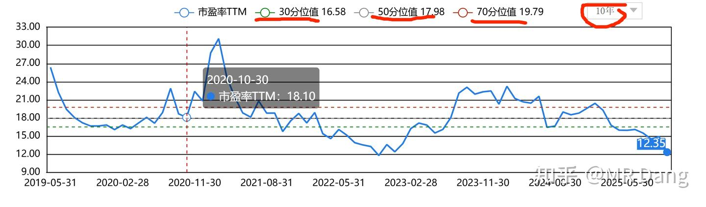

# 《天阶功法卷二》BFNY估值方法

---

**发布时间**: 2025-10-26 11:04  |  **原文链接**: https://zhuanlan.zhihu.com/p/1965702280192954374  |  **点赞数**: 208 人赞同

**作者信息**: MR Dang​独立投资人，全网无其他平台，无小号无私域，不接广不卖课

---

## 正文内容

前置功法：

[[20251023-《地阶功法卷二》价值投资三大误区|地阶功法卷二]]

[[20251022-《地阶功法卷一》投资者必须斩杀的三个妄念|地阶功法卷一]]

[[20251015-什么是煤化工？有哪些好的a股投资机会？为什么？|煤化工]]

[[20251024-《天阶功法卷一》BFNY价值投资分析|天阶功法卷一]]

[[20251025-《地阶功法卷三》商业模式评估|地阶功法卷三]]

说起估值这个词，永远是资本市场争论不休的话题。

因为价格，并不是评估出来的，而是交易出来的，是真金白银堆出来的。

很多人把价格等同于价值，就会产生估值无用论，认为有钱就能把股价推上去，那么估值还有什么意义呢？

有些投资者还会借此讥讽价值投资者，比如XX股票以前只有10多块，基本面也很差，最后一顿炒作涨到了100多，甚至上千块，你的估值怎么解释这种现象呢？

对此，我有一个简单的例子，可以告诉你价格，价值和估值之前的关系。

你可以把这三者的联系看成是人遛狗

价值为人。

价格为狗。'

估值为绳。

什么意思呢，价值是有迹可循的，是可以评估的，就像人走路一样，大概的方向是可以看清楚的。

价格的变动是没有规律的，就像一个围着这个人的狗，有可能看到一坨美味的东西，就兴奋的冲出去了，也有可能看到一条美丽的异性，就赖着不走了。

估值遛狗的绳子，随着狗的跑动，时长时短。

价值投资者，主要研究的是人，研究人的走向，人的位置，人的所思所考。

价格投机者，主要研究的是地上那一坨，或者路边的那条异性，吸引狗过来，把握狗的走向。

普通投资者，大多数散户，研究的是狗，把狗走过的路线画成图，听狗的叫声，研究狗的毛色，希望能猜到狗的想法，预测狗的走向。

至于哪个办法更有效，笔者不发表意见，但是很明显研究人的想法是最简单的一种办法。

估值作为一根绳子，虽然根据狗离开主人的距离时长时短，但是随着时间的拉长，总是有一定的长度作为物理限制的，这个就是估值研究的目的所在。

目前主流的估值方法，有PE，PB，PEG，DCF以及PD

PE最常见，在股票上行周期，可激发出戴维斯双击的弹性，适用很多行业，但是比较难以把握，特别是每股收益变化比较大的企业。

PB的主流认知是适用周期性行业的估值，但是由于净资产本身的变化不如每股收益变化剧烈，因此PB估值门槛更低，估值相对简单。

PEG适合稳定的成长型企业，一般用于年复合增速20%-50%的企业比较准（个人经验），一般不作为单独的估值手段，用来辅助进行估值。

DCF学术上的说法，你先要搞个现金流测算模型出来，算出来公司给你带来的现金流，然后开始贴现算估值。

实际上，根本不可行，贴现率3%和1%算出来的估值就是天壤之别，另外测算公司的现金流也纯属臆想。

一般是机构用来展示自己的专业，忽悠不懂行的，在研报里注水的好帮手，实用性=0.

但是DCF也有可取之处，如果你简单的用股息率代替现金流，那你会发现，股息率算出来的估值比DCF可准确多了，而且简单的令人发指。

以上四个可能大家都了解了，但是PD是什么估值法呢？

PD就是Price/Dream，简称市梦率，为梦想窒息，适用于高科技企业估值，梦想越大，估值越高。优点是因为舍弃了基本的财务数据，不受基本面影响，无论是营收，利润，净资产都无法影响估值，不在三界内，不入五行中，有梦想就有估值，梦想越大估值越高。

对于普通投资者来说，不可拘泥于任何一种估值技术，要综合估值，多方位考量。

PE为主，搏取上限，

PB为辅，保障下限，

股息为先，进退自如，

增速为次，稳定发展。

在企业的不同阶段，资本市场的不同阶段，随机应变，不可墨守陈规，抓着一个估值方法不放。

现以BFNY为例，举例说明：

1.BFNY的派息比例较大，每年积存的净资产相对较少。同时制约收益的影响因素是产能，产能已经满负荷运作。此时即使投入大量的净资产，也并不会明显提高收益率。

也就是净资产和收益之间没有明显的强相关性和线性关系。

（更专业的术语应该是营运资本，这里为了降低理解难度，不进行这方面的探讨）

那么即使把它归类为周期行业，使用PB估值法也不合适，而应当使用PE估值。

与之相反的，如果是银行股，银行的净资产可以补充核心一级资本充足率，且没有产能制约，投入的净资产可以马上带来收益，对银行意义重大，因此PB应当视为核心估值指标之一。

PE估值法下：纵比自己

比如打开东财网站，找到估值分析，找到PE（TTM)这个估值曲线，时间拉到10年。

可以看到30分位值是16.58，50分位值是17.98，70分位值是19.79.

什么意思呢？就是过去10年的时间里，只有30%的时间估值位于16.58PE以下，50%时间内在17.98，另外30%的时间在19.79以上。

换句话说，你16.58PE以下买入，胜率极大。19.79PE以上卖出，胜率也很大。

你保险点，打个提前量，就定个15PE为你跑路的位置。

目前预期每股收益你也保险点，定在1.6左右，那么一个比较合理的位置就是24元/股。

假设你运气很差，买了以后10年里，前30%的时间内都没涨到30%分位值，这30%时间过了才涨到这个位置，那么最差的结果就是现在买进去，3年后股价24

PE估值法下：横比同行

选取可比对象很重要，这个每家公司都需要具体分析，但是普通投资者你自己没办法找到具体标的的时候，你去问AI就好了，比问人和找研报都靠谱。

比如我问元宝"煤化工行业的平均市盈率是多少"

我的AI回答我的是16.38倍，你保险点，打个9折，也差不多是15倍左右。

综合以上，在PE估值法下BFNY的合理估值在15PE以上，按照目前的业绩，大约在24元/股左右。

3辅之以股息保障下限，目前的预期分红在0.8元左右，按照5%的股息测算，股票的下限区间就是16元左右，跌的越多，股息率越高。

这是今年的，明年的业绩在1.8左右，预期分红0.9元，下限就会提高到18元。

当然这不是说股价就不会跌破16或者18，而是说如果跌破后，会有很多的专吃股息的资金买入，直到把它买的没有高股息为止。

4.不算今年，未来的平均预期增速在10%到20%之间，那么对应的估值应该是10PE到20PE之间，和前文的15PE也可相互印证。

以上就主要使用了PE估值，辅之以PEG和DCF（股息率替代），对目前BFNY的价值评估。

值得一提的是，由于以上测算的基础为盈利情况，因此需要对未来业绩有较高的预测水准才有效。

诸位道友，

估值时当有经天纬地之气魄，

纵看前后十数年，横看同业百余家。

纵横交错，方可跳出估值之陷阱，得窥价值之真相。

买入之时以股息保下限，以增速谋发展。

切不可拘泥于教条，只赌一时之涨跌。

投资之道，道深且艰。

应删繁就简，以势压人。

如此，必能裨补阙漏，有所广益。

一个喜欢保护韭菜的博主，希望大家少踩坑，多赚钱。

以上不构成对BFNY的股价承诺，不是投资建议！！！

股市有风险，投资有风险！！！

---

## 精选评论

> [!comment]- 点击展开评论
>
>
> | 用户 | 时间 | 内容 |
> | :--- | :--- | :--- |
> | 在齐太史简 |  | 懂了，还有三分之一的利润空间。补仓！ |
> | &nbsp;&nbsp;&nbsp;&nbsp;MR Dang |  | 套住了不许骂人哈 |
> | 在齐太史简 |  | 只要跑的时候干脆利落快，就套不住。 |
> | 山人 |  | 梭哈 |
> | 鹦鹉和猫 |  | 博主要小心点，有的人即使不买，也可能追着骂。事后各种翻你帖子，试图打你的脸。你可千万别被骂走了。这么好的博主，我们要保护他，千万别被人骂了。有个叫盛京剑客的大佬，就是被一群人骂得退出知乎。 |
> | &nbsp;&nbsp;&nbsp;&nbsp;MR Dang |  | 感谢提醒，只是怕举的例子不够具体，很多人get不到方法，以后尽量不说的这么具体了 |
> | 知了也睡了 |  | 那种人都是嫉妒楼主的，先不说投资，楼主的文风都值得学习，钱在自己手里，与楼主有什么关系，我要攒钱氪金，学那个邪修，哈哈哈哈哈哈 |
> | 麦芽糖 |  | 这个是真干货，干到不行那种 |
> | Yuzhou Xing |  | 哈哈哈，请大佬单开一个市梦率专题 |
> | &nbsp;&nbsp;&nbsp;&nbsp;MR Dang |  | 我的梦想不够伟大，叙事也不行，搞不了搞不了 |
> | Bennett |  | 上海电力是不是很有市梦率 |
> | 肥头大侠 |  | 恩师，周末都不休息啊你真的我哭死 |
> | 林秋水 |  | 感谢 |
> | 月下人醉 |  | 有魅力的男人，存款明天上，跌了买吃股息 |
> | 皮皮虾我们撤 |  | 老师怕是在淘县都是顶级存在吧，莫不是传说中的游资巨鲸 |
> | 皮皮虾我们撤 |  | 地阶天阶功法在我看来堪比股票大作手回忆录了 |
> | 赵小默 |  | 赞一个 |

---

*本文件由自动脚本从MR Dang知乎页面提取生成*

---

**作者**: MR Dang
**链接**: https://zhuanlan.zhihu.com/p/1965702280192954374
**来源**: 知乎

*著作权归作者所有。商业转载请联系作者获得授权，非商业转载请注明出处。*

---

## 相关阅读

**📖 天阶功法系列：**
- [[20251024-《天阶功法卷一》BFNY价值投资分析|天阶功法卷一]] - BFNY价值投资分析
- [[20251030-《天阶功法卷三》NSLY投资价值浅析|天阶功法卷三]] - 铝行业投资分析
- [[20251102-《天阶功法卷四》磷化工投资价值分析|天阶功法卷四]] - 磷化工行业分析
- [[20251104-《天阶功法卷五》DSL投资价值分析|天阶功法卷五]] - 药品零售行业分析
- [[20251106-《天阶功法卷六》银行股投资原理详解|天阶功法卷六]] - 银行股投资方法
- [[20251125-《天阶功法卷七》中国黄金第一家——C公司投资价值分析|天阶功法卷七]] - 黄金流通企业分析

**📚 地阶功法（心法基础）：**
- [[20251022-《地阶功法卷一》投资者必须斩杀的三个妄念|地阶功法卷一]] - 投资心态建设
- [[20251023-《地阶功法卷二》价值投资三大误区|地阶功法卷二]] - 价值投资误区
- [[20251025-《地阶功法卷三》商业模式评估|地阶功法卷三]] - 商业模式分析

**🔙 前置知识：**
- [[20251015-什么是煤化工？有哪些好的a股投资机会？为什么？|煤化工]] - 煤化工行业基础