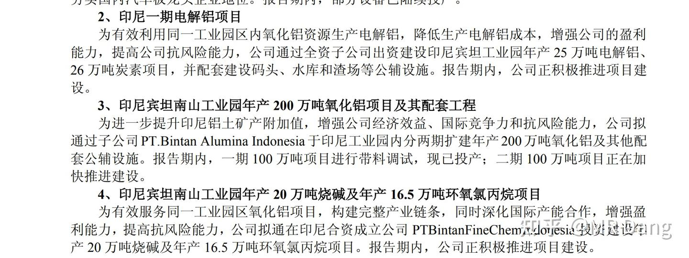
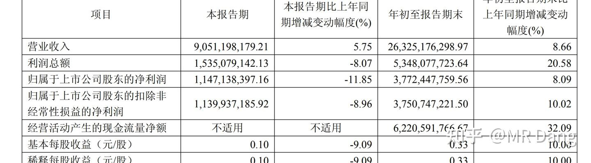
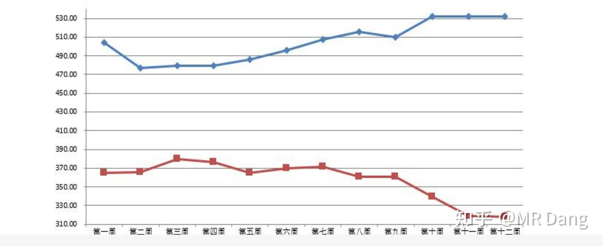

# 《天阶功法卷三》NSLY投资价值浅析

---

**发布时间**: 2025-10-30 07:20  |  **原文链接**: https://zhuanlan.zhihu.com/p/1966533647558476513  |  **点赞数**: 348 人赞同

**作者信息**: MR Dang​独立投资人，全网无其他平台，无小号无私域，不接广不卖课

---

## 正文内容

前置功法：

[[20251024-《天阶功法卷一》BFNY价值投资分析|天阶功法卷一]]

先回顾一下我们分析BFNY时候的思路：

顶层设计→商业模式→财务分析

我们今天再如法炮制一遍，在铝这个行业给他梳理一遍。

一.顶层设计

铝行业的特点是什么？

一言以蔽之，一低，两高。

低门槛，高能耗，高污染。

能耗和污染有多高？我给大家列两组数据感受一下：

一吨铝电耗在13300度左右，是一吨铜冶炼的15倍，是一吨水泥的150倍。

电解铝碳排放占有色整个行业的70%左右，是有色行业的碳排放第一大户。

所以铝和铜的逻辑完全不同，铜的瓶颈是矿，要盯着矿去找企业。

铝的瓶颈是什么？

是电，所以要盯着电去找企业。

了解了铝的行业特点，我们再看祖国母亲的烦恼是什么？

低门槛——无序竞争，疯狂内卷——应对：提高门槛，提高附加值

高能耗——单位能耗高，电解产量高——应对：限制电解铝产量，产能置换

高污染——火电碳排放高——应对：推行绿电（主要是水电）置换火电

限制产能——只是应对痛点的手段，而不是研究铝业的第一性原理。

但是现在很多的投资逻辑方向，是追着这个限制产能的这个点穷追猛打，这个方向你不要去挖掘投资标的了，像YLGF这种涨的都没什么性价比了，你能买到的都在天上飞。

限制产能只是一种手段，我们需要做的是找出能帮助祖国母亲解决两高一低烦恼的办法。

比如——为什么不用国外的电，排放国外的碳，生产我们的铝？

你一旦跳出限制产能的这个逻辑陷阱，一切就豁然开朗了。

联系我们的"安全"投资主线，整个顶层设计就形成了：

安全→能源安全→电解铝两高一低→异国用电/异国排放→相关标的

它是谁？无所谓，能帮助祖国母亲少排放碳，少用电，多产铝就行。

需要的就是一把趁手的工具，谁能干好这个活，谁就可以得到母亲的奖励。

这就是投资铝的第一性原理。

铝从某一种意义上来说，就是固体的电，金属的煤。

空口无凭，感兴趣的可以查看相关文件：

《铝产业高质量发展实施方案（2025-2027年）》GX部

鼓励企业与资源国（如几内亚，印度尼西亚，澳大利亚）开展合作

新置换产能电耗不高于13000千万时/吨

《有色金属行业稳健工作方案（2025-2026年）》FGW等八部门。

支持企业稳步推进"境外有色金属项目建设"（如电解铝，氧化铝项目）

这类文件啊，诸位道友要会看，一串大概念，后面跟着具有特指的小概念的时候，就一定要仔细揣摩，上面不会有一句废话，都是反复核对后才发出的。

一个小概念指向的是几内亚，印度尼西亚，澳大利亚。

另一个小概念指向的是电解铝，氧化铝。

你把这两个一综合，跟坐标轴一样，直接查资料，就能出答案了：

印尼在建电解铝中国企业：

NSLY(200万吨氧化铝+25万吨电解铝）

华青铝业（100万吨电解铝）

东方希望（600万吨氧化铝+240万吨电解铝）

魏桥创业集团（合资，100万吨电解铝）

信发＆青山集团（100万吨电解铝）

几内亚：

中电投国际（计划1200万吨铝土矿+400万吨氧化铝，未实施）

特变电工（计划400万吨氧化铝+100万吨电解铝，未实施）

澳大利亚：

综合以上，按照国际化布局思路寻找的投资标的仅剩两家上市公司:NSLY和位于港股的ZGHQ

二.商业模式

铝行业从头到脚：

铝土矿→氧化铝→电解铝→原铝→各种铝产品（比如铝型材，铝板带，铝箔）→下游厂商

其中因为产能限制的存在，电解铝这部是限制整个行业的瓶颈，所以就商业模式而言，电解铝是2求（比如魏桥被要求接入国家电网）的商业模式，而其他环节是1求，甚至0求的商业模式。

（至于什么是0求，1求，2求，补课链接→[[20251025-《地阶功法卷三》商业模式评估|地阶功法卷三]]）

从总量思维来看，在铝土矿→下游厂商的过程中，整个利润总量可以看作是一定的，如果电解铝的商业模式高于其他环节，利润就会往电解铝环节集中。

那么投资的时候，只有两种选择，要么你投只有电解铝的，要么你投全产业链的。

你如果投没有电解铝步骤的标的，就会容易被电解铝这个环节侵蚀利润。

那么在产能限制这个框架下，你能找的就是ZGLY，SHGF，YLGF，TSLY这四家，被众多投资者可以说是翻烂了，研究透了，那这样的地方你会有认知差和信息差么，会有超额收益么？

而一旦你结合顶层设计，跳出产能限制这个框架，去找国际化布局的标的，就增加了

ZGHQ和NSLY这两家。

我们再联系新闻，

比如：

印尼政府发行离岸人民币债券

又比如：

印尼购买J10战斗机

这些都是最近一个月内的新闻，你如果把这些放在一起看，串成一个圈，你就会隐隐看出其中潜藏的机会。

3.财务＆估值分析：

如果把ZGHQ和NSLY放在一块对比，那么很明显是ZGHQ毫无悬念的胜利。

所有铝企里面，ZGHQ也是不可撼动的霸主。

ZGHQ什么都好，就是贵了点，涨的多了点。

你如果说我不介意，我就要最好的，那其他铝的股票你都不要看了，你就买ZGHQ，它就是最好的，没有之一，没有任何修饰词，全球第一。

而我选择NSLY，够便宜，就这么简单。

不考虑印尼那边增速的情况下，依托全产业链的优势，NSLY可以很稳定的做到每年0.4元以上的业绩。

你不用去学习NSLY的产品航空板有什么特点，汽车板有什么优势，各个产品的销量情况怎么样，因为公司是理性的，一个业务的附加值降低后，他会自己对接合适的应用场景，选取附加值高的项目（比如现在的汽车板）。

国内业务的基本盘非常稳，你要相信公司干了多少年的专业性肯定比我们这些门外汉强，你就盯着最后出来的那个产品的售价就行了。

按照50%派息率，每年也能分0.2元左右，以我当时4元左右的股价计算，股息率稳定在5%是毫无疑问的。

那如果我花这个钱买入，我得到了什么，一个价值最少4元的国内业务的股票，以及一份免费的看涨印尼项目的期权。（期权思维可太重要了）

这份期权包含什么？200万吨氧化铝+25万吨电解铝

（这些东西你要在港股买，一股42港币，接近1.8PB，而A股仅需1PB)

需要注意的是200万吨氧化铝如果按照1.93转换比测算，应该对应的是100多吨的电解铝。

目前25吨的电解铝产能规划远小于这个数字，猜测很可能是配套的电力跟不上。

所以我预期以后周围配套跟上了，最终产能达到100多吨，这很合理吧。NSLY它又不受电解铝指标制约，扩产起来比国内的公司容易多了。

三季报比较一般，但是是预期中的，甚至扣非同比只-9%

要知道印尼的氧化铝，平均售价可是足足降低了29%

卷后语：

我反复重复的一句话，这是巴菲特经常念叨的，模糊的正确远胜精准的错误。

具体到NSLY这里来，模糊的正确是什么：

1.国内业务基本盘模糊的稳定

2.大股东资金紧张（因为其他项目资本开支大），急需用钱，股息率模糊的提高。

（之前写到这里的时候还没看见特别分红的公告，刚才一看分红了，两毛五稳稳到手）

3.铝整个行业模糊的向好

4.印尼项目模糊的增长

5.祖国母亲模糊的支持，未来想象空间模糊的大

但是它的估值是确定的便宜，在有色今年涨上天的时候，它甚至趴着没动！

风险提示：

1.印尼相关业务具有不确定性

2.上个交易日才涨停，三季报并不出色，短期内可能会有震荡，现在买入有追高的风险！！！

谨慎！！！！

3.注意风险！！！！仓位控制！！！！

4.投资不是按计算器！！不要在会计科目里游泳！！不能盲人摸象！！

一个喜欢保护韭菜的博主，希望大家多赚钱，少踩坑。

---

## 精选评论

> [!comment]- 点击展开评论
>
>
> | 用户 | 时间 | 内容 |
> | :--- | :--- | :--- |
> | 楚材 |  | 一直觉得刷知乎有点浪费时间，但居然看到了这个答案，这是我免费能看到的东西吗？您是真想教我们啊，谢谢老师 |
> | &nbsp;&nbsp;&nbsp;&nbsp;MR Dang |  | 那必须的 |
> | 天天天蓝 |  | 给代码简单，但是不懂背后的逻辑是拿不住的，谢谢老师 |
> | 信仰之力 |  | 答主是纯价值分析，但是昨天的涨停其实和价值关系没那么大，主要是铝板块轮动+分红的内幕消息，在大炒一波之后，我觉得nsly短期的价值应该透支了，现在不太适合入，分红以后入更好 |
> | 布衣良辰 |  | dang大佬分析的最大作用是指明了股价未来发展的方向，给小白们吃了一颗定心丸，至于具体怎么操作就看个人了。能够让大家在操作过程中心神安定，在股价调整时少生焦虑，也有极大的情绪价值。 |
> | 鹦鹉和猫 |  | 人家大佬月初就分析了，铝缺口是要等风来，昨天就是风来了。低价铝是价值投资+等风来，自己做成菜端上来给持有它的人吃。风不来，就吃价值投资。 |
> | 子健 |  | dang哥，居然刷到你了，真的好久不见了，你还记得我吗？我们从小就不认识，小时候我在我家玩，你在你家玩玩笑开回来，哈哈，关注dang哥有段时间了，宝藏博主也被大家发现了，学了很多，码字辛苦了。 |
> | 嗨我是桢子酱 |  | 来了，老师，来了 |
> | 呀儿呦 |  | 早上看到这篇文章直接冲进去了，感觉拿到明年也没问题，也查了下好多机构都说NSLY的PE10，比行业18低，预计可以到5.98。感谢老板让我吃肉，长期跟随Dang老是，最喜欢这种逻辑紧密层层推理的过程，赞！ |
> | 超神羽毛 |  | 嘿嘿，我就是这么找到神火股份的。尤其是"是电，所以要盯着电去找企业"，和我的思路一模一样 |
> | 超神羽毛 |  | 我今年9.30找到的神火股份，假期结束就进去了 |
> | Bboy小宇 |  | 早上好，老师 |
> | 子非鱼 |  | dang老师一大早就发文了，对水火中的散户是真爱 |
> | 谁伴停下的脚步 |  | 模糊的正确远胜精准的错误。.所以不必纠结4元一下买，多个一毛钱也行 |

---

*本文件由自动脚本从MR Dang知乎页面提取生成*

---

**作者**: MR Dang
**链接**: https://zhuanlan.zhihu.com/p/1966533647558476513
**来源**: 知乎

*著作权归作者所有。商业转载请联系作者获得授权，非商业转载请注明出处。*

---

## 相关阅读

**📖 天阶功法系列：**
- [[20251024-《天阶功法卷一》BFNY价值投资分析|天阶功法卷一]] - BFNY价值投资分析
- [[20251026-《天阶功法卷二》BFNY估值方法|天阶功法卷二]] - BFNY估值方法详解
- [[20251102-《天阶功法卷四》磷化工投资价值分析|天阶功法卷四]] - 磷化工行业分析
- [[20251104-《天阶功法卷五》DSL投资价值分析|天阶功法卷五]] - 药品零售行业分析
- [[20251106-《天阶功法卷六》银行股投资原理详解|天阶功法卷六]] - 银行股投资方法
- [[20251125-《天阶功法卷七》中国黄金第一家——C公司投资价值分析|天阶功法卷七]] - 黄金流通企业分析

**📚 地阶功法（心法基础）：**
- [[20251022-《地阶功法卷一》投资者必须斩杀的三个妄念|地阶功法卷一]] - 投资心态建设
- [[20251023-《地阶功法卷二》价值投资三大误区|地阶功法卷二]] - 价值投资误区
- [[20251025-《地阶功法卷三》商业模式评估|地阶功法卷三]] - 商业模式分析
