# 《天阶功法卷五》DSL投资价值分析

---

**发布时间**: 2025-11-04 07:44  |  **原文链接**: https://zhuanlan.zhihu.com/p/1968247344404333250  |  **点赞数**: 320 人赞同

**作者信息**: MR Dang​独立投资人，全网无其他平台，无小号无私域，不接广不卖课

---

## 正文内容

前置功法：

[[20251102-《天阶功法卷四》磷化工投资价值分析|天阶功法卷四]]

之前提到过一嘴，下面的评论区质疑的声音还是比较多的。

包括我自己，其实对这个行业还是有点负面评价的。

正是因为这样子，我觉得这个行业的龙头的预期差很大很大，里面的投资机会可能是五年罕见甚至十年罕见的机会。

老三样：

顶层设计→商业模式→相关标的，快速过一遍。

一.顶层设计

DSL所在的行业属于药品流通环节中的零售环节。

药品这个东西，属于民生的重要保障，那么祖国母亲的第一要求是什么？

安全。

在安全的基础上，第二要求是什么？

便宜。

嵌入我们的"安全"投资主线:

安全→药品安全→相关标的

祖国母亲没有别的要求，你们随便卷，谁能提供又安全又便宜的药，就会奖励谁。

但是安全这个词，是没有量化指标的，所以要出台一系列的文件强化监管：

《中华人民共和国药品管理法》（2019年修订）​

先从法律上立法确定了药品上市许可持有人制度、药品全程追溯制度等，强化药品全生命周期管理。

​《药品经营和使用质量监督管理办法》​

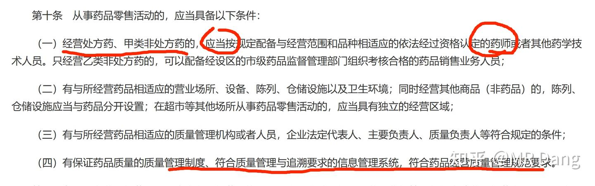

管理办法规定了必须配备相应的人员和追朔系统。

《关于规范药品零售企业配备使用执业药师的通知》

二.商业模式

出发点自然是极好的，但是安全和便宜，有点熊和鱼掌不可兼得的意思在里面。

安全是需要成本的。

一般的药品零售企业，药品的采购成本只占30%-40%。

而人力成本要占到30%，配备的药师是一大笔开支。

租金20%属于刚性的，管理费用20%。

按照要求的合规成本并到管理费用和人力成本里，大大提高了企业的综合成本。

同时集采造成很多药品价格下调，又进一步压缩了企业的利润空间。

这也是很多人的第一印象，它就是药品零售企业这几年的缩影：

一方面，整个实体药店的销售额在放缓。

另一方面，整个行业在加速内卷，关店数量超过了开店数量。

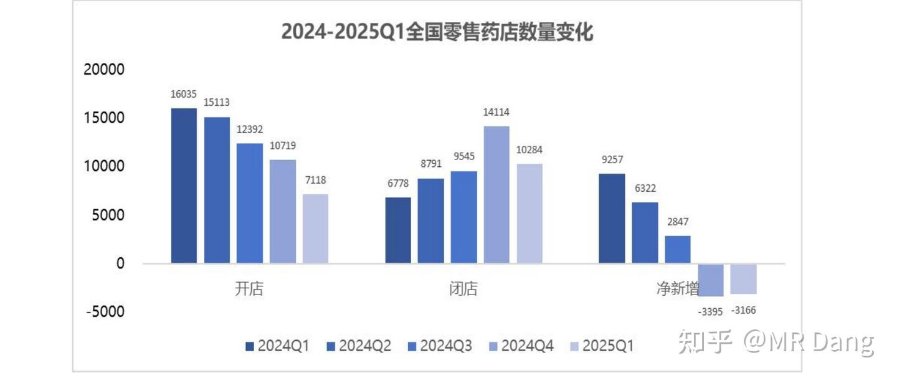

从商业模式来看，药品零售行业普通情况是属于1求的商业模式。

种种迹象显示这个行业正在走向下坡路。

那么其中还有投资机会么？

有的，兄弟，有的。

首先需要明确的是，实体药品零售是一个必选消费场景，其规模随着人口老龄化的加剧还是会缓慢增加的，这一点和房地产的内卷有着本质的不同。

网购对药品零售的冲击要比其他零售行业小的多：除了有明确预期的慢性病，很多其他急症很少有人耐心的去网上下单，等几天后的配送。

至于闪购之类的，只是配送方式不同，大多数本质还是从药房拿的。

药品数以万计的SKU和保质期决定了本地建仓的性价比并不高。

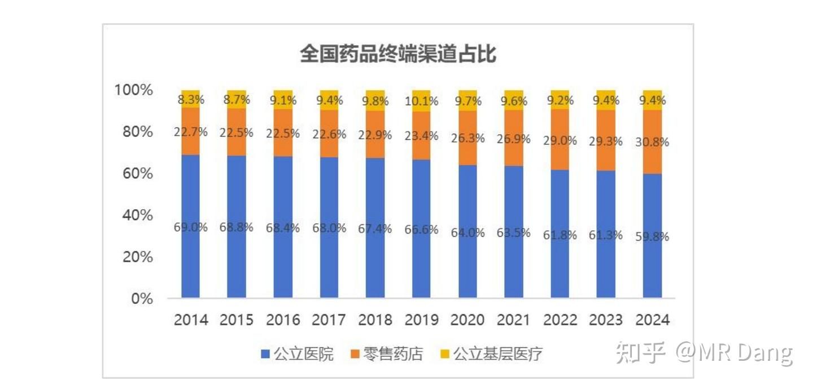

其次，药品店的总数量在减小，行业正在出清是站得住脚的。

有没有发现什么问题？

蛋糕越来越大了，虽然速度不快，但是在可预见的未来，蛋糕确实是要变大了。

分蛋糕的店越来越少了。

意味着每家店，分到的蛋糕会越来越多。

那么我说，假如啊，我是说假如啊。

有一个公司，它的店面如果稳定增加，那么它的前途会怎么样呢？

聪明的你发现了，投资药品零售店的第一性原理就是数店面。

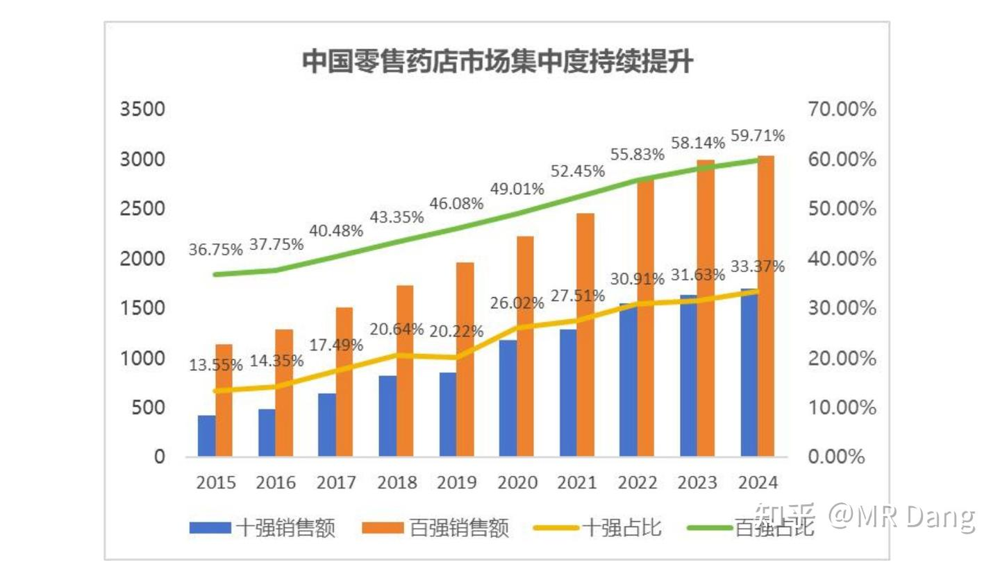

营收，利润，都扔一边。

药品零售行业有非常严重的规模效应，店面数量一旦超过一定数量（比如1万家），就会从1求商业模式提升到2求，面对上游厂商有非常强的议价权。

因为药品本身是同质化相当严重的商品，大多数消费者的认知停留在进口/国产。

过评的国产药和没过评的国产药在普通消费者里的区别也只是包装盒和价格。

一旦议价权增强，毛利就会增加，那么吸引的加盟店数量就会增加，进一步提高规模效应形成完美闭环。

规模效应→议价权→盈利能力提升→吸引加盟商→规模效应进一步增加

财报上的数字可以调整，但是加盟者的真金白银不会说谎，你只要盯着加盟店的数量变化看就行了。

它是对一个企业盈利能力，管理能力，经营能力的综合体现。

三.相关标的

由于我们寻找的是具有规模效应的品牌，因此从全国超过1万家的连锁品牌中进行选择：

1.DSL

2.LBX

3.YFYF

4.JZT

5.GJJK（未上市）

对其中的上市主体进行分析，由于JZT的主业比较庞杂，且扣非表现不佳，先剔除。

剩下的三家为了方便称呼，我称之为药房三傻。

1.从加盟店数量的增速来看，结论很明显：

DSL＞YFYF＞LBX

即使LBX在三傻里差一点，但是加盟店的数量一直在增加，也就是说药房行业的马太效应再次被证实了，就算是次一点的龙头，整体的市占率都在缓慢增加。

三傻从加盟商获得的收益：

DSL:毛利率9.39%，7029家加盟店前三季季度贡献了3亿的毛利，合每年5.7万/家

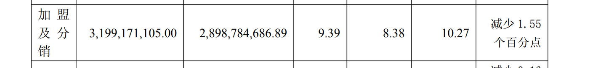

YFYF:毛利率10.88%，4097家加盟店前三季度贡献了1.6亿毛利，合每年5.2万/家

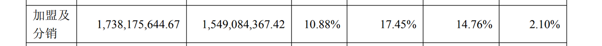

LBX：毛利率12.61%，5751家加盟店前三季度贡献了3.5亿毛利，合每年8.1万/家。

DSL和YFYF相比，在每家薅了更多毛利的同时，增加的店面还更多。

LBX虽然比上面两家在每家加盟店薅到了更多的羊毛，但是近些年的增速有些不如人意。

其实也很好理解，加盟商也是为了赚钱去的，投资一家DSL之类的药店，想要医保资格，得80平以上，投入60万以上，吃相太难看自然会劝退加盟商（LBX说的就是你）

我一再强调，加盟店的数量是结果，而不是原因，它是加盟者用真金白银对企业的商业模式做出来的检验。

就像雪王一样，是雪王的商业模式吸引了无数的加盟者，从而进一步加强了规模效应，形成了现在的局面。

DSL现在就有这样的苗头，在今年这种行业寒冬，三个季度逆势增加800家左右的加盟店，已经从红海里杀出来了，行业拐点不知何时到来，但是企业的拐点已经确定。

2.从闭店率来看：

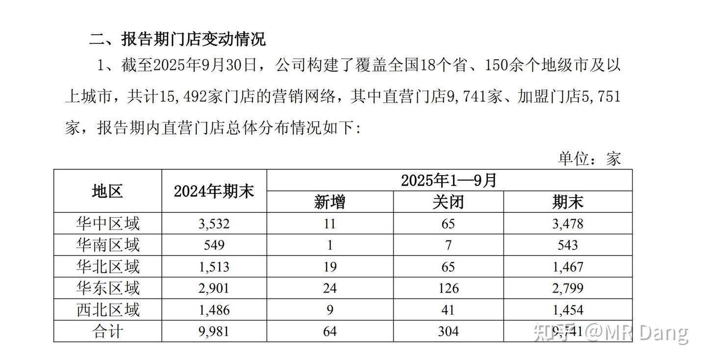

LBX的2025年前三季度净闭店率=304/9981=3.05%

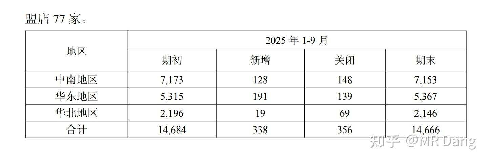

YFYF的前三季度净闭店率=356/14684=2.4%

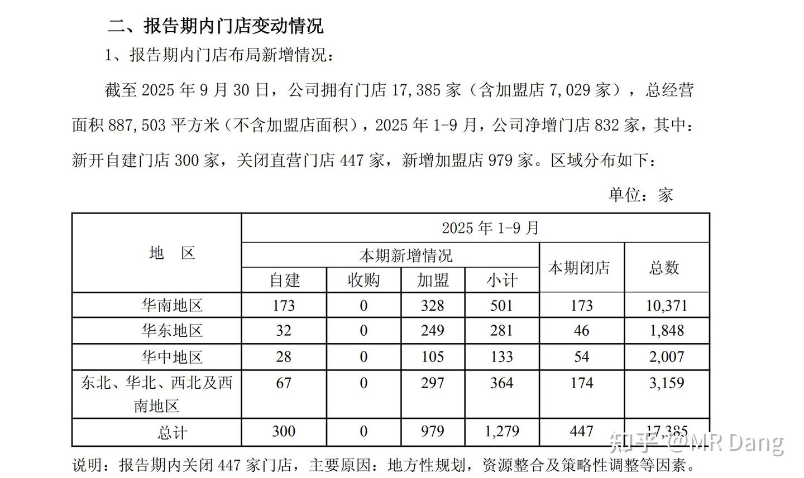

DSL的前三季度净闭店率=447/（17385-832）=2.7%

YFYF好于DSL好于LBX

3.医保店比例：

LBX:92.78%，DTP176家，统筹资质5471家。

DSL：97.95%，DTP278家，统筹资质2982家。

YFYF:95.37%，DTP318家，统筹资质4600家。

DSL＝YFYF＞LBX

其中DTP基本都是些创新药，处方药，在一二线城市比较多，代表了未来对公立医院处方药的承接能力。

统筹资质则恰好相反，代表了对农村地区医保的接纳能力，数量越多表示市场越下沉。

4.客户粘性：客户粘性没有直接的量化指标，但是以我朴素的认识，愿意办卡的地方肯定是回头客多的地方，而恰好，办卡这个数据是很好查的——资产负债表合同负债

DSL：1.2亿会员，活跃6382万，上半年新增780万，会员合同负债2.6亿。

YFYF：1.1亿会员，合同负债总额1.7亿（含货物）。

LBX：1.04亿会员，活跃2214万，上半年新增454万，会员合同负债+积分计划0.77亿。

客户粘性方面DSL＞YFYF＞LBX

以上，从加盟商角度，从客户角度来说，DSL都是更好的选择，它是一个市场选择的结果，而不是原因。

至于原因是什么，有可能是压榨员工自掏钱包冲业绩，有可能是割加盟商韭菜，有可能是把便宜药物换个包装，包装成自营品牌卖高价，也有可能是更适应市场的管理方式，原因可能很有多，而我们并不需要回答这个问题。

我们再来看自营店：

和加盟店的突飞猛进不同，自营店是另一种画风，DSL减少的数量最少，YFYF减少的最多。

但是总体上，药房三傻处于同一水平线。

除了数量，还要衡量质量：

根据每平方米的坪效来说，DSL在绝对值上遥遥领先。

从边际变化来看，DSL和YFYF已经从四年的下跌通道中止跌，今年的坪效开始缓慢增加，拐点迹象明显。

LBX有点L形筑底的意思，拐点还没到。

综合数量和质量两方面，在直营店上，DSL≥YFYF＞LBX

结合加盟和直营两方面，我最终的选择是DSL。

当然YFYF也不错,LBX似乎差了点。

DSL财务简单的过一遍：

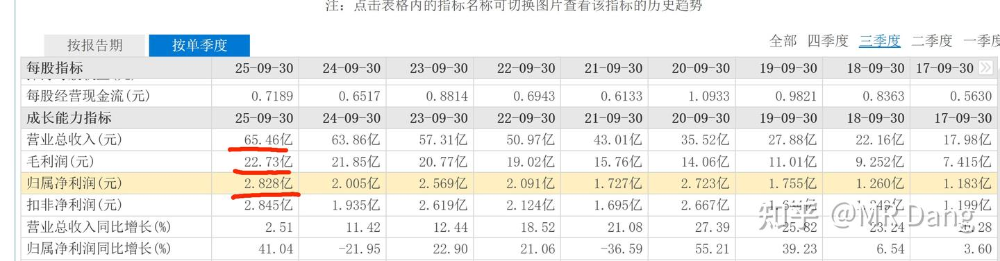

从财务看，你甚至看不出这是一个在疯狂内卷的龙头企业，史上最强的三季报，营收，毛利，净利都是上市以来最好的一年。

于此同时，它的估值是：

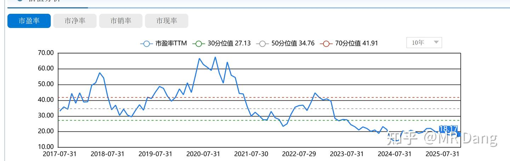

目前处于6分位

是的你没看错，史上最强的三季报匹配的估值是6分位，低于历史上94%的时间。

一家药品零售的龙一，在A股难得的牛市里，同时自己的财报也是历史最佳的时候，估值几乎在最低点躺着，有点诡异不是么。

股息率：按照DSL一年两次分红的传统，目前每股的分红是0.68，对应的股息率是3.5%左右，明年的预期股息率是4.5%。

还是那句话，模糊的正确远胜精确的错误，以DSL目前的低估程度，我个人相对看好的。

但是，很多熟悉这个行当的行业内的人士，可能有完全不同的看法。

这其实在哪个行业都有，因为距离产生美，离得近了雀斑就多了。

同时，很多行业内的人，看待问题的时候，是打工人的角度。

但是你做投资，你需要的是股东视角。

如果一个行业，公司把业绩，指标，营收都压在员工身上，你身处牛马岗位，自然对它的评价不会高。

而你站在股东视角的时候，这一现象就叫商业模式处于强势地位，对员工话语权强。

说人话：行业门槛低，你不干有的是人干，节省人力成本。

为什么很多银行员工不买银行股？因为见得多，干的累。

我在银行工作的时候就在想，一个公司可以把员工剥削压榨到这种程度，女的要陪唱，男的要陪喝，老的要陪笑，小的要陪吃。这家公司一定是赚大钱的。

打不过就加入呗，不想被压榨就买银行股呗，很简单的道理不是么。

你去DSL加盟店上班，可能一个月3000，完不成业绩还要被扣钱。

你加盟DSL，需要60万，只能勉强开一个80平的药店，还要每年给DSL孝敬。

但是现在DSL市值只有200亿，有1万多家直营店和7000多家加盟店。

你买200万的股票对应的就是1家直营店的全部利润和0.7家加盟店的利润分成。

而且还在以每年新增0.1家加盟店的速度扩张。

你只花了200万，这些店里5到6个人创造的利润基本都能进你口袋里。

有些话说出来不道德，但是事实上他们都是你的生产资料。

风险提示：

1.尽管DSL的估值很低，但是如果基于股息率的投资，目前的股息率吸引力不足。

2.股票的走势不会因为谁的买入就产生变化，DSL的低估是市场选择的结果，这种情况可能持续很长的时间，现在买入很可能会长时间坐冷板凳，看别人吃香的喝辣的，心态容易崩。

3.药品行业受政策影响大，长期看的话，受制于医保费用的限制，药品行业很难有爆发性的增长，适合长期持有平滑周期，不适合短线投机。

一个喜欢保护韭菜的博主，希望大家少踩坑，多赚钱。

---

## 精选评论

> [!comment]- 点击展开评论
>
>
> | 用户 | 时间 | 内容 |
> | :--- | :--- | :--- |
> | 唐小命儿 |  | "The st­o­ck ma­r­k­et is a de­v­i­ce for tr­a­n­s­f­e­r­r­i­ng mo­n­ey fr­om the im­p­a­t­i­e­nt to the pa­t­i­e­nt."（股市是将钱从没耐心的人转移到有耐心的人手中的工具。--巴菲特） |
> | &nbsp;&nbsp;&nbsp;&nbsp;MR Dang |  | 直接给我升华了 |
> | Bboy小宇 |  | 那我继续格局了 |
> | 谁是我们的朋友 |  | 话没有说全。 |
> | 啦啦啦啦 |  | 还有很重要的一点，地域性，DSL是华南地区龙头，目前中国人口还在增长的地区。北方相关药企在基本盘方面就不占优势。 |
> | 易凌顷 |  | 有道理 |
> | 想吃烤串 |  | 我发现老总大约一周会更新3篇，大约一个月会有十多只股，那么我每次更新后定投，设置总仓位为15%，这个组合策略如何 |
> | &nbsp;&nbsp;&nbsp;&nbsp;MR Dang |  | 你来我这进货呢 |
> | 黑猫杰克 |  | Dang ETF |
> | 清如许 |  | 管不住手，三瓜两枣都开成超市了，被大佬翻牌子票都想买。 |
> | 瑞锐 |  | 这份分析终于能看懂些了，之前煤化工，磷化工没接触过看得云里雾里的，根据开店数和加盟数看结果，这种市场选出来的才是趋势 |
> | &nbsp;&nbsp;&nbsp;&nbsp;MR Dang |  | 适合普通人的思路。如果在奶茶行业就能选出雪王，也是不错的，其他行业就是瑞幸，名创，途虎，绝味 |
> | 君一笑 |  | 大佬后续讲讲st的绝味呗 |
> | 瑞锐 |  | 有道理，我咋个没想到根据这种去发散下，感谢，Dang总提点 |
> | 哈皮 |  | 同意，这期看的最清楚 |
> | 哈基米南北路多 |  | 这个有点看不懂，还是买bt了 |
> | &nbsp;&nbsp;&nbsp;&nbsp;MR Dang |  | 能看懂什么买什么，看不懂的不要参与 |
> | 月下人醉 |  | bt，磷化工的？ |
> | 啊嘞 |  | ➕1 |

---

*本文件由自动脚本从MR Dang知乎页面提取生成*

---

**作者**: MR Dang
**链接**: https://zhuanlan.zhihu.com/p/1968247344404333250
**来源**: 知乎

*著作权归作者所有。商业转载请联系作者获得授权，非商业转载请注明出处。*

---

## 相关阅读

**📖 天阶功法系列：**
- [[20251024-《天阶功法卷一》BFNY价值投资分析|天阶功法卷一]] - BFNY价值投资分析
- [[20251026-《天阶功法卷二》BFNY估值方法|天阶功法卷二]] - BFNY估值方法详解
- [[20251030-《天阶功法卷三》NSLY投资价值浅析|天阶功法卷三]] - 铝行业投资分析
- [[20251102-《天阶功法卷四》磷化工投资价值分析|天阶功法卷四]] - 磷化工行业分析
- [[20251106-《天阶功法卷六》银行股投资原理详解|天阶功法卷六]] - 银行股投资方法
- [[20251125-《天阶功法卷七》中国黄金第一家——C公司投资价值分析|天阶功法卷七]] - 黄金流通企业分析

**📚 地阶功法（心法基础）：**
- [[20251022-《地阶功法卷一》投资者必须斩杀的三个妄念|地阶功法卷一]] - 投资心态建设
- [[20251023-《地阶功法卷二》价值投资三大误区|地阶功法卷二]] - 价值投资误区
- [[20251025-《地阶功法卷三》商业模式评估|地阶功法卷三]] - 商业模式分析
