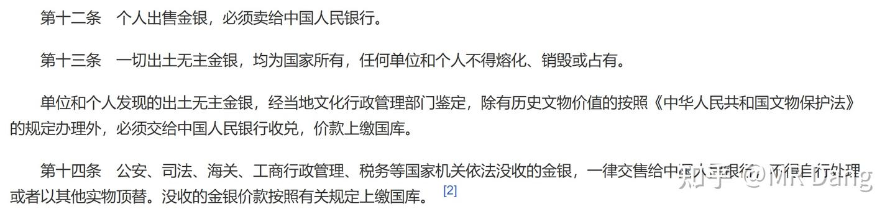
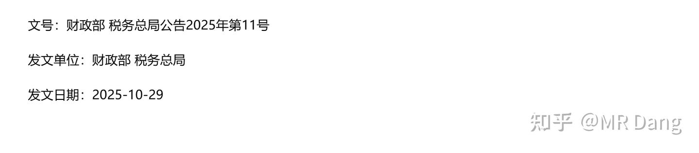
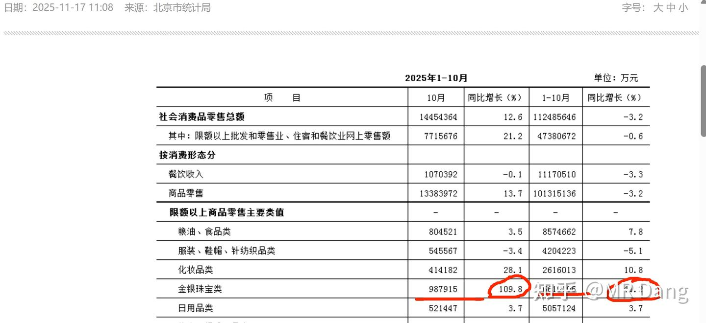
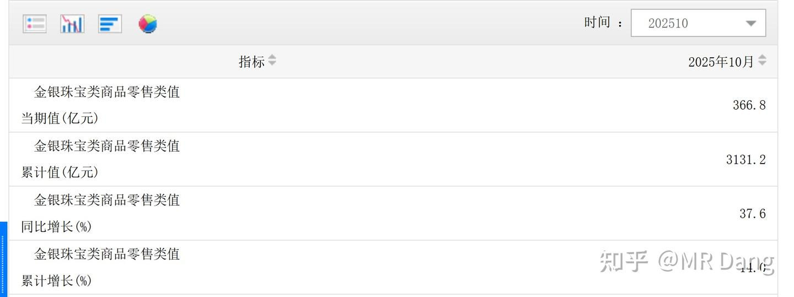
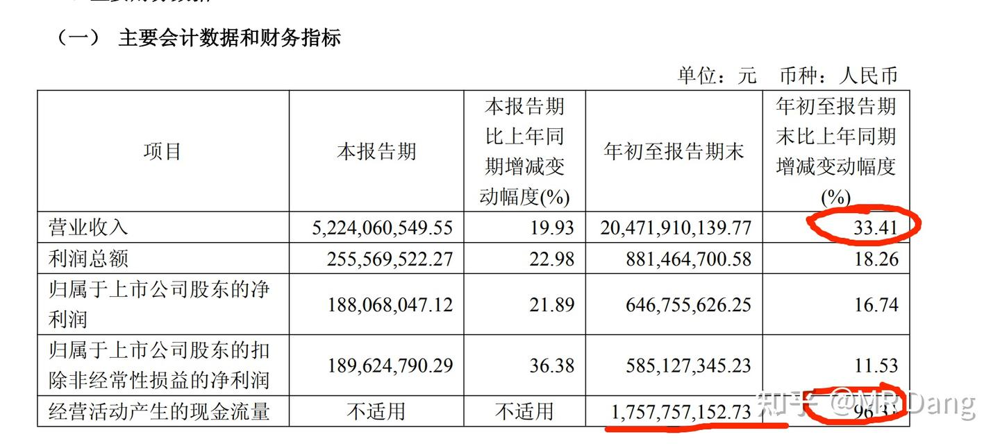
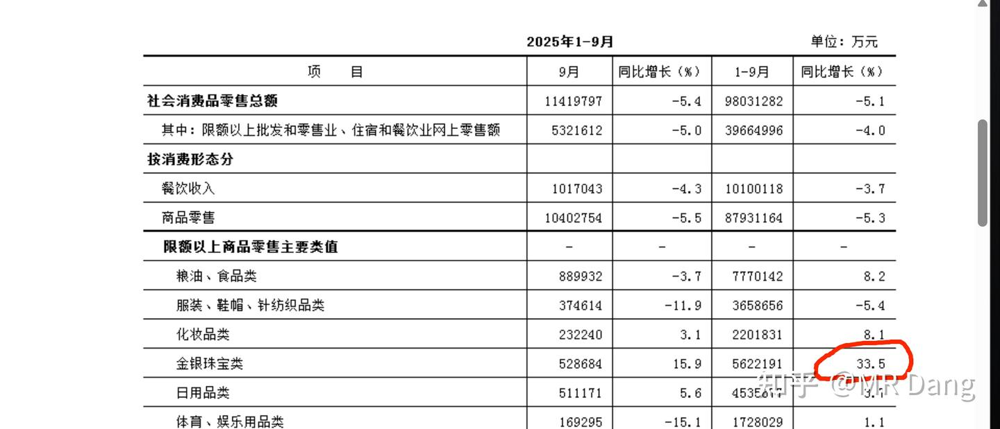
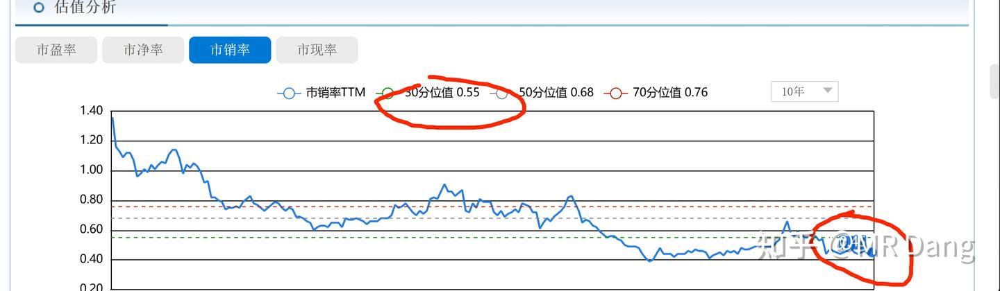
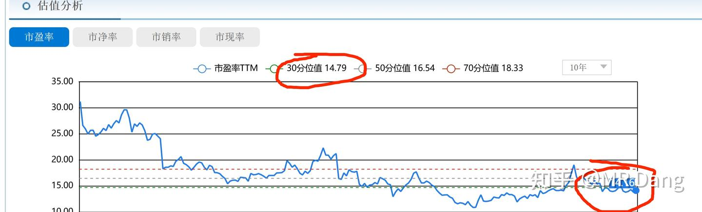

# 《天阶功法卷七》中国黄金第一家——C公司投资价值分析

---

**发布时间**: 2025-11-25 07:28  |  **原文链接**: https://zhuanlan.zhihu.com/p/1976247269868212247  |  **点赞数**: 397 人赞同

**作者信息**: MR Dang​独立投资人，不接广不卖课

---

## 正文内容

天阶功法的特点都是自上而下，不追求尽善尽美，但是追求方向上的确定性。

我在止盈多个标的后，加了银行，拿出一点点做了投机，比如光刻胶什么的，建仓了一点旅游股，还空了一些仓位，目前的打算是btgf再加一点，并且配置一点c公司。

配置c公司的目的是对冲有色仓位的风险。

什么风险呢？

有色贵金属价格短期下跌的风险。

大家都知道我配置了一部分有色仓位，尽管在止盈某矿业后，已经不是很重了，但是依然是有的。

我对我持有的标的很有信心，无论怎么看，它都是国内有色企业里最好的公司，没有之一。

但是就算这样优秀的企业，也无法避免行业风险，如果有色贵金属价格短期下跌，也会引起市值的缩水。

而于此同时，如果不想减仓，那就只能找到一个标的，这个标的要满足一系列的条件：

1，股息率要够高，5%以上。

2，可以从有色贵金属下跌中明显受益。

3，从黄金税收新政中受益。

4，有一定的增长。

5，有一定的安全边际。

6，在行业中处于卷王地位。

只有满足这么苛刻的条件，才可以对冲我持有的有色仓位。

那真的存在这样的企业么？

有的，兄弟，有的。

这就是今天这篇文章的主角——C公司。

老三样：顶层设计→商业模式→相关标的，快速过一遍。

一，顶层设计

黄金是最重要的国际资产。

没有之一，没有任何修饰词。

没有任何人可以拒绝黄金。

它承载了人类几千个春秋对财富的追求，是人类的财富共识。

即使放在宇宙的尺度中，由于其苛刻的形成条件，黄金依然是稀有品。

因此，东大对黄金具有严格的管理。

多严格呢？

任何开采出来的黄金，都必须售卖给国家：

《中华人民共和国金银管理条例》第九条规定："从事金银生产的厂矿企业、农村社队、部队和个人所采炼的金银，必须全部交售给中国人民银行，不得自行销售、交换和留用。"

除此之外还有：

需要注意的是，《金银管理条例》属于行政法规，因此违反承担的是行政违法的法律责任。

同时因为这个法规的计划色彩太重了，和实际社会严重脱节，所以据传正在修订，目前的执行力度也是不足的。

除此之外，近期还有一件事情，可以说重塑了黄金流通企业的竞争格局：

《11号文》在经历过近一个月的发酵后，目前的金饰价格已经突破1200，接近1300大关。

可以看出来，我们的顶层设计是什么？

藏金于国

为什么要藏金？为什么要限制黄金饰品的消费?

黄金饰品相对大金砖来说，更加分散。

不利于统一管理，不利于集中力量办大事。

不展开说了，大家理解意思就行。

黄金印不出来，黄金对金融系统具有非凡的重要性 。

因此黄金可以带来相当的安全感。

嵌入我们的安全主线:

安全→金融安全→黄金安全→税收新政→相关标的

二，商业模式

可以看出来，对于黄金流通企业来说，其上游是相当强势的，黄金流通企业毫无议价权。

对下游客户，除非你的价格有巨大的优势。

否则黄金这种标准化的产品，企业有什么议价空间呢？

从商业模式来说，黄金流通企业是标准的1求行业，没有任何值得称道的地方。

黄金流通企业的盈利模式一般是在成本价上+一个固定的利润空间。

客户对价格又极为敏感，因此这个利润空间也比较有限。

决定企业盈利情况的关键是差异化和成交量。

差异化这条路的代表企业是lp黄金，在港股上市。

而学过基本的经济原理的都知道：

除了股票和房子这类资产，

普通商品的成交量和价格是呈负相关的。

因此黄金价格上涨+税收新政，会明显抑制金饰的需求，影响成交量。

从而影响黄金流通企业的盈利水平，整个行业都是承压的。

但是，人对黄金的喜爱是不会改变的。

如果饰品需求被压抑，那么一部分需求就会被转移到投资需求。

我们要找的就是这么一个标的：

它同时拥有金饰业务和投资金业务。

它的价格比较有竞争力。

它的背景要有说服力，信誉要有保障。

它的商业生态位就是满足人投资黄金的基本需求：

货真价实

三,相关标的

C公司号称中国黄金第一家。

当然不是随随便便说的，这可是商务部授予的称号，代表了C公司光辉的历史。

中国商务部老字号数字博物馆

同时，C公司目前拥有国内零售规模TOP1的单个门店，代表了C公司势头正盛的现在。

凭什么呢？

地理优势+先发优势

根据BJ市统计局的数据，单10月份金银珠宝的消费金额为98.8亿，接近100亿，同比增加109.8%！

前10个月一共消费金额为661亿，同比增加41.2%！

大家可能对这个数字没有概念：

全国10月份一共卖了366.8亿，增速37.6%。

也就是说10月份一个月，J爷买了全国27%的金银珠宝。

前10个月的累计数据，J爷们买了全国的21%

无论是绝对值，增速，BJ都是毫无疑问的问鼎全国。

BJ市就是全国黄金零售的高地，谁占领了BJ市场，谁就有了天大的优势。

而一旦说到BJ的黄金市场，就一定绕不开C公司，真正的无冕之王，J爷心里的第一选择。

说C公司是全国黄金零售企业里的卷王，也是当之无愧的。

财务数据：

大概过一遍，前三季度营业收入205亿，大约占全国市场份额：

205/（3131.2-366.8）=7.4%

大约相当于三个周大S，或者周大S+中国黄金。

2021年上市以来，五年里年营收规模从百亿级别做到现在的预期两百大几十亿，增速迅猛。

营收同比增速33.4%，略低于BJ市的33.5%（前三季度）

两者数据高度拟合。

当然C公司的业务遍布全国，不能简单的将二者划等号。

经营现金流爆炸性的增长了96%，达到了17亿。

非常接近归母净利润的19亿，说明利润的含金量十足。

负债方面，c公司几乎没有有息负债，44亿负债的主要组成部分是交易性金融负债，占了34亿。

所谓的交易性金融负债是c公司为了生产而进行的黄金租赁业务，目的是为了规避黄金价格波动带来的风险。

因此，这个指标可以用来预测c公司未来一段时间内的经营情况，这么高的交易性金融负债显示c公司备货积极，高看四季度业绩一眼。

预期股息率：

C公司近年来保持了78%左右的派息率。

按照个人预测EPS从2025到2027大约分别在1.1，1.25，1.4

(这里比券商预测的乐观)

对应的分红为每股：0.86，0.97，1.09

以现在的股价14.78计算，则预期股息率分别为：

5.8%，6.5%，7.3%。

当然，一般这种预测，后两年的都不太准，要根据情况实时纠正。

但是2025年的预期股息率还是可以到5.5%以上的。

估值情况：

市销率0.45，对应的10年30分位值为0.55，处于30分位值以下。

市盈率TTM14.16，对应的30分位值为14.79，处于30分位值以下。

其实按照我2025年每股收益1.1的盈利预测（远高于券商预测），目前真实市盈率在13.4左右。

这类企业的报表没必要扣太细，看个大概就行了，真的想了解，去c公司四楼转一圈比财报上那些数字来的有说服力多了。

综上，从所有方面来说，C公司并无大的硬伤，作为生产资料来说，估值和预期股息率都相当不错。

所以就将其列为天阶功法了。

但是也不是说就没风险了，风险体现在：

1.整个行业处于周期底部，C公司的金饰业务也会受到影响，金饰业务毛利率更高，股票的估值也会受到打压。

2.黄金价格剧烈波动引起的盈利水平波动。

3.分红政策的延续性和稳定性。

4.s收政策的影响。

5.虽然目前c公司有100多家门店，并且按照关小店开大店的思路经营，但是依然非常依赖单店对营业收入的贡献，增长方面的叙事有限。

6.差异化做的不够好，溢价能力不足。

7.由于营收结构问题，投资金毛利率更低，导致净利润增速不及营收增速。

免责声明：仅分享个人投资逻辑，非荐股。

不推荐任何人以任何价位买入。

股市涨跌实在寻常，看不懂的东西不要参与，套住了就很尴尬，割肉也不对，拿着也心慌。

不打算持有十年的东西，就一秒也别持有。

虽然有点夸张的成分在里面，但是道理是正确的。

我配置c公司是因为有zjky的仓位，两家公司同时配置对冲金价价格变动风险，赚的是优秀企业的经营溢价。

如果你只配置其中一家，受黄金价格波动影响就会比较大。

想网购投资金条的可以考虑cb金条，以今天为例。

工行如意金947，京东领丰金957，阿里资产cb金条944。

当然还是线下最好，基础金价931.9+十来块的加价就可以入手，更划算。

一个喜欢保护韭菜的博主，希望大家少少踩坑，多多赚钱！

---

## 精选评论

> [!comment]- 点击展开评论
>
>
> | 用户 | 时间 | 内容 |
> | :--- | :--- | :--- |
> | fsgyc |  | 我严重怀疑是评论区的家人们买上去的 |
> | &nbsp;&nbsp;&nbsp;&nbsp;MR Dang |  | 你的眼睛狭长，可我不长那样 |
> | 未央 |  | 没有仓位买了，一开始进股市说只拿5万，玩着玩，2个月后，已经放了50万进去了 |
> | &nbsp;&nbsp;&nbsp;&nbsp;MR Dang |  | 这么多了 |
> | 大脸猫 |  | Dang佬  这个紫菜组合 配对买才可以么 |
> | &nbsp;&nbsp;&nbsp;&nbsp;MR Dang |  | 紫菜组合，我觉得原理上是不错的 |
> | 亦蓑烟雨任平生 |  | 老祖的审美果然有独到之处，这个股从来没听说过😂是不是看好金价上涨就选紫金，看好下跌就选菜百，资金充裕就两手一起抓 |
> | &nbsp;&nbsp;&nbsp;&nbsp;MR Dang |  | 也可以 |
> | 夏天 |  | 你们都好聪明 |
> | 拉不拉猪 |  | 那么问题来了，这两个一起上涨说明啥 |
> | 凯洛沦 |  | 说明大盘要上4000了 |
> | 夜里思考人生 |  | 好家伙大A还有这种黄金股啊，老师又带我开眼了 |
> | &nbsp;&nbsp;&nbsp;&nbsp;MR Dang |  | 地域性的，一般人不知道 |
> | 和玉 |  | 看了一下，成都没有门店 |
> | saintluffy |  | 看完文章，心里咯噔一声，一搜，果然大涨 |
> | 三观正师姐 |  | 我的dsl还在那 |
> | &nbsp;&nbsp;&nbsp;&nbsp;MR Dang |  | 慢慢来呗，等着分红 |
> | kangjie |  | 这个不是五年期吗？ |

---

*本文件由自动脚本从MR Dang知乎页面提取生成*

---

**作者**: MR Dang
**链接**: https://zhuanlan.zhihu.com/p/1976247269868212247
**来源**: 知乎

*著作权归作者所有。商业转载请联系作者获得授权，非商业转载请注明出处。*

---

## 相关阅读

**📖 天阶功法系列：**
- [[20251024-《天阶功法卷一》BFNY价值投资分析|天阶功法卷一]] - BFNY价值投资分析
- [[20251026-《天阶功法卷二》BFNY估值方法|天阶功法卷二]] - BFNY估值方法详解
- [[20251030-《天阶功法卷三》NSLY投资价值浅析|天阶功法卷三]] - 铝行业投资分析
- [[20251102-《天阶功法卷四》磷化工投资价值分析|天阶功法卷四]] - 磷化工行业分析
- [[20251104-《天阶功法卷五》DSL投资价值分析|天阶功法卷五]] - 药品零售行业分析
- [[20251106-《天阶功法卷六》银行股投资原理详解|天阶功法卷六]] - 银行股投资方法

**📚 地阶功法（心法基础）：**
- [[20251022-《地阶功法卷一》投资者必须斩杀的三个妄念|地阶功法卷一]] - 投资心态建设
- [[20251023-《地阶功法卷二》价值投资三大误区|地阶功法卷二]] - 价值投资误区
- [[20251025-《地阶功法卷三》商业模式评估|地阶功法卷三]] - 商业模式分析

**💡 投资组合策略：**
- [[20251106-《天阶功法卷六》银行股投资原理详解|天阶功法卷六]] - "紫菜组合"对冲策略：紫金矿业（有色上游）+ 菜百股份（黄金零售）
