# 2026年3月24日财经早餐

---

**发布时间**: 2026-03-24 06:59  |  **原文链接**: https://www.red-ring.cn/post/27593-1949812  |  **点赞数**: 426 人点赞

**作者信息**: MR Dang | 小红圈付费社群作者

---

## 正文内容

今天的头条只能是赢学大战：

首先是懂王赢学：5天内或达成协议。

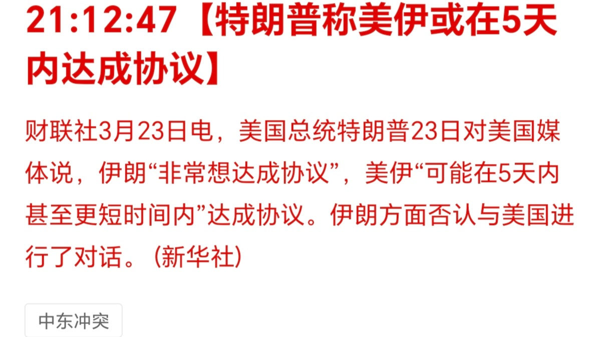

大赢特赢，赢麻了。

然后是伊朗赢学：伊朗称懂王因惧怕反击撤销最后通牒。

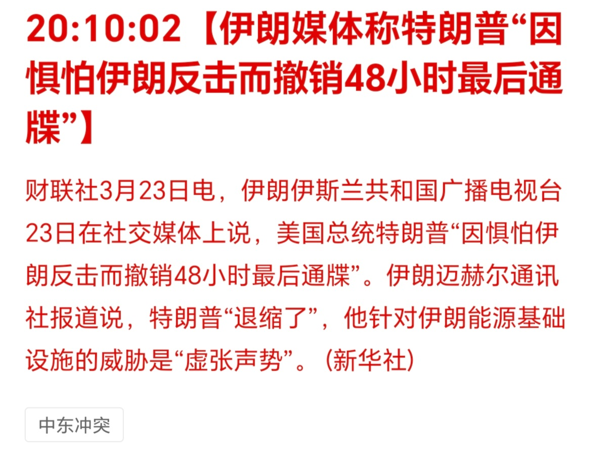

也是大赢特赢，赢疯了。

魔法对轰，赢学大战。

这场纷争只要能结束，我就承认他们都是winner。

再打下去投资者就快变loser。

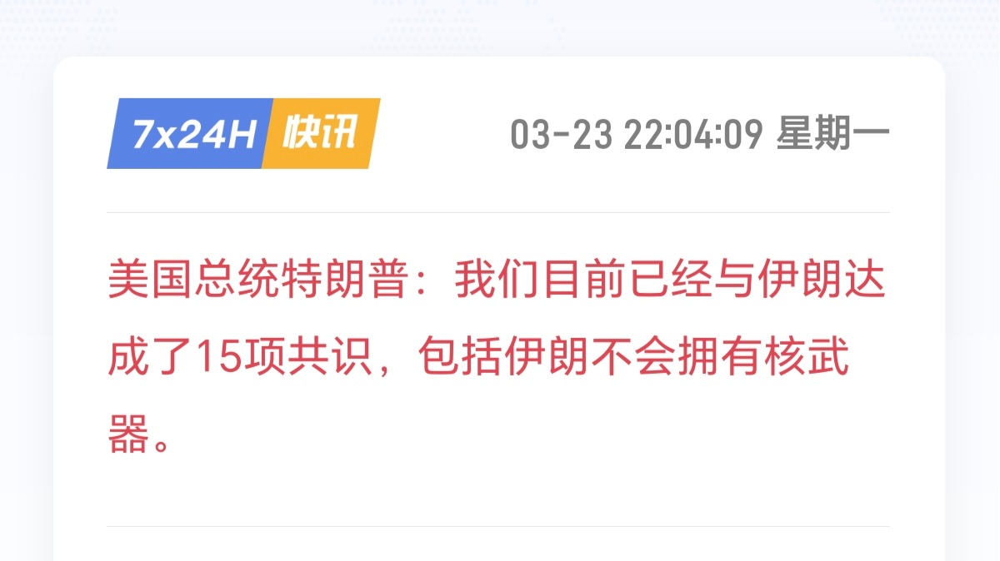

后续是懂王称又达成了15项共识，这算是连赢15局？

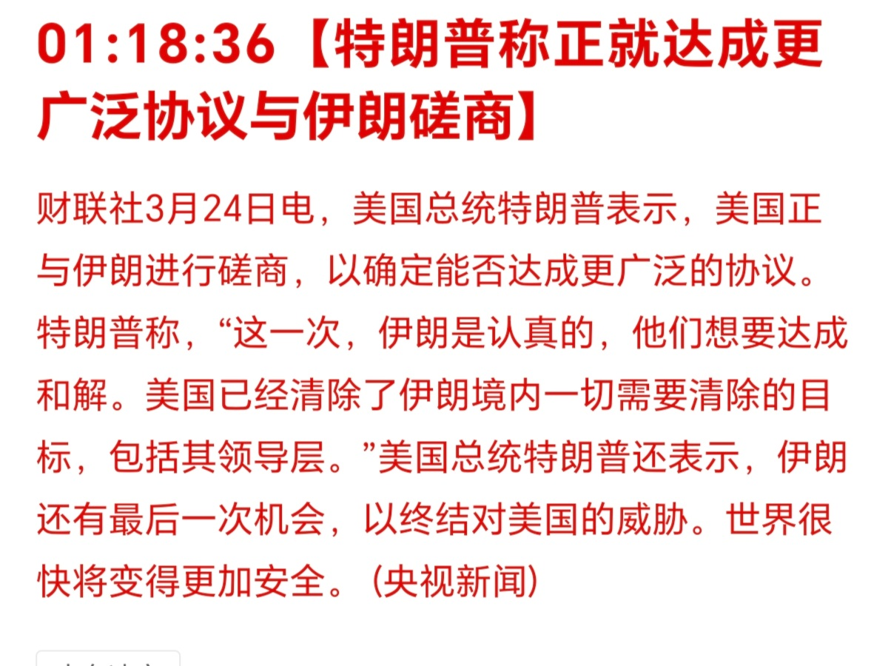

懂王又称与伊朗进行更广泛的协议。

### 有意思的是伊朗对懂王的话都进行了否认

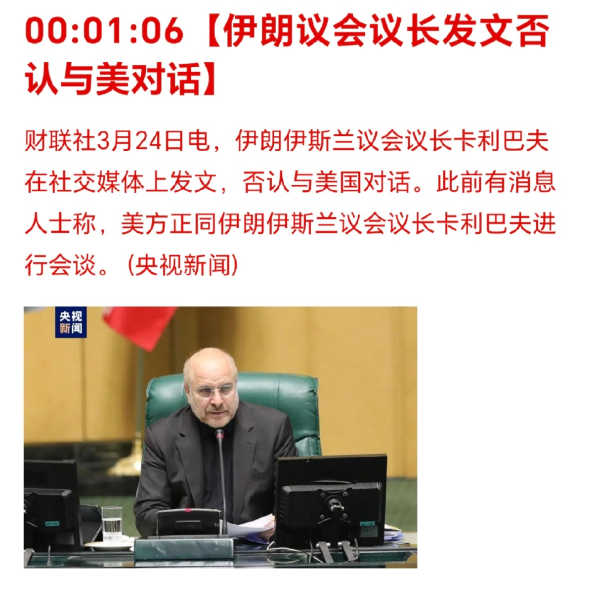

可以理解，毕竟刚经历战火，而且新上来的人根基不稳，这个时候如果不展示强硬，恐怕会面对内部的怒火。

就各种大宗商品的价格走势和资本市场的态势，大家还是更关注懂王的表态。

话说就原油期货这振幅和成交量，但凡懂王提前做空，恐怕这次的军费就有了。

---

### 想进步的米兰：2026年降四次息

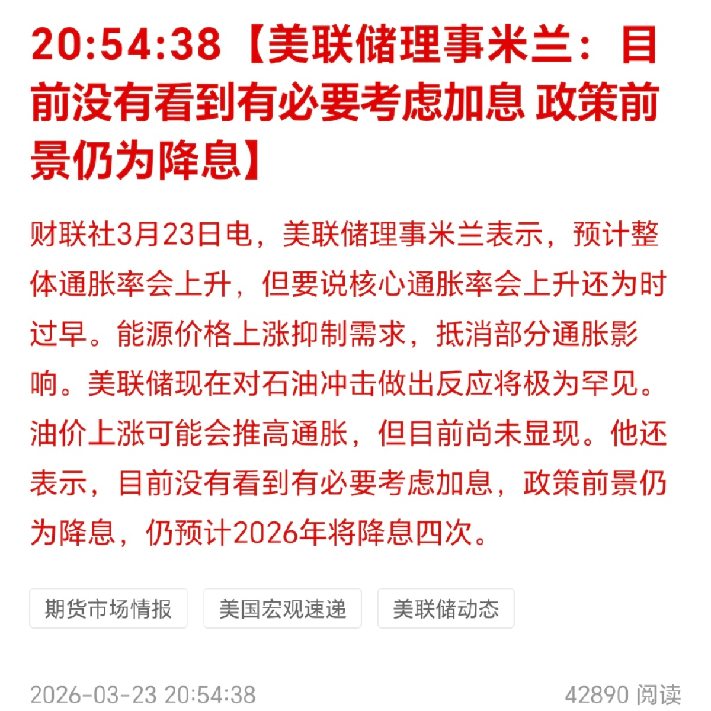

他真的太想进步了，这可能也是沃什都快板上钉钉了还没有被正式任命的原因之一吧。

我好奇米兰说降四次的时候不知道他自己笑了没有。

---

### 高盛认为西大衰退概率30%

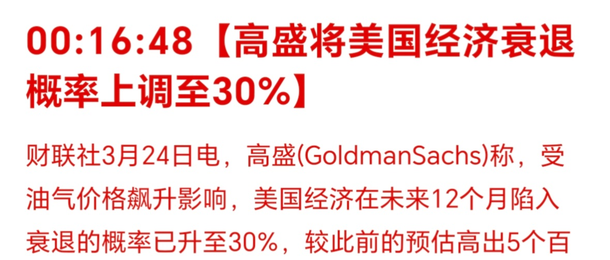

这些顶级投行的话看看就行了，之前预测金价6500美元的也是这批人。

---

### 汽油涨价

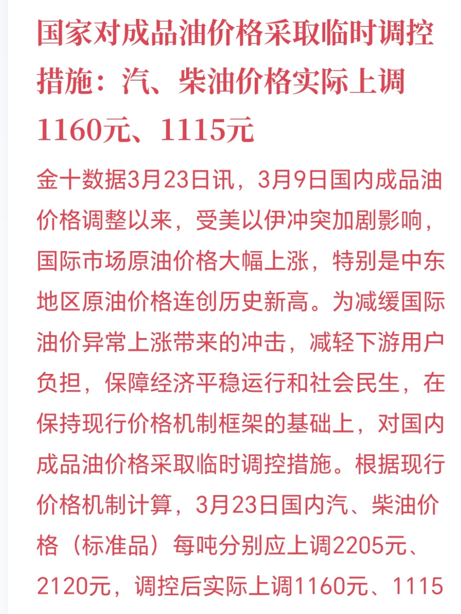

本来应该涨价2000多的，实际只涨价了一半左右，这是为了降低油价上涨对经济的影响，用心良苦，感谢制度优势。

话说我前两天就看见准备调价了，当时还特意抽了个空把8成满的油箱加满了，花了75块。

加油小妹本来屁颠屁颠的去抱一大箱抽纸去了，一听见75块，翻了个白眼，放下抽纸，递过来一张洗车卡翩然离去。

---

### 某头部铜企回购

### 6.4亿回购了2100万股。

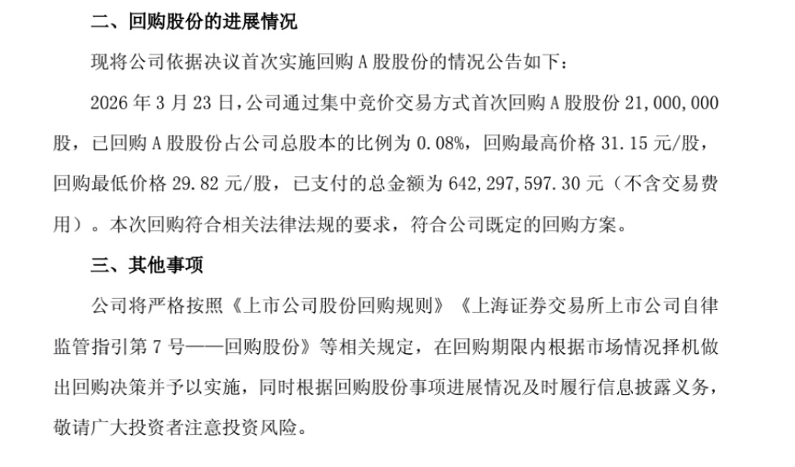

效率这块儿，管理这块儿，不得不服。

都说百万散户扎堆，但这又何尝不是口碑带来的共识呢？

某头部铝企回购：

8亿回购2589万股

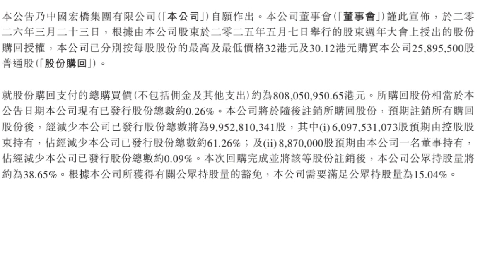

回购+注销，良心大大的有。

不同的行业，同样的动作 。

在我看来，差企业的坏毛病千奇百怪，而优秀企业的管理，大有英雄所见略同的感觉。

---

### 老马又画新饼

这饼是真的大，老马是真能画。

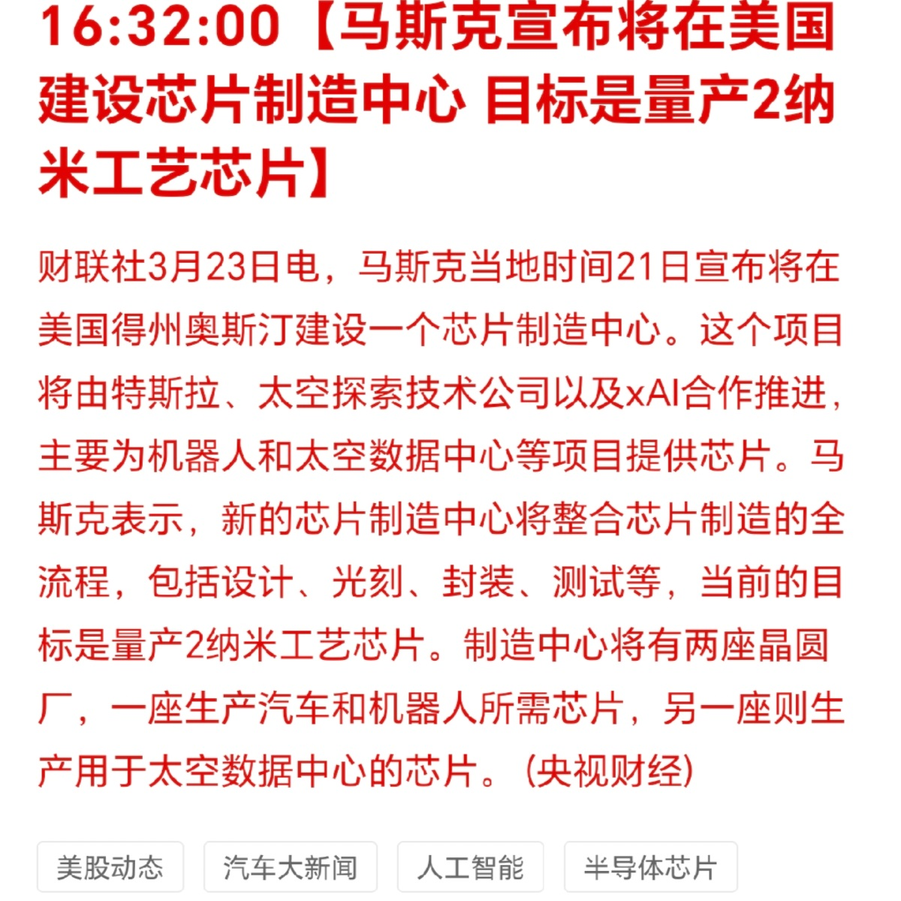

老马这人吧，能干是真能干，能吹也是真能吹。

我对能否落地持有一点点的怀疑。

---

### 大宗商品

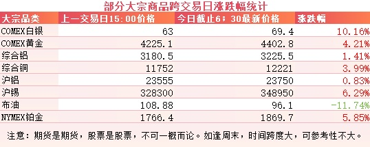

有色系因为受到和谈预期的影响集体反弹。

我自己囤金的进度也在加快，坏消息是没买到4100的金条，好消息是囤到了4200和4300的金条。

### 外围市场

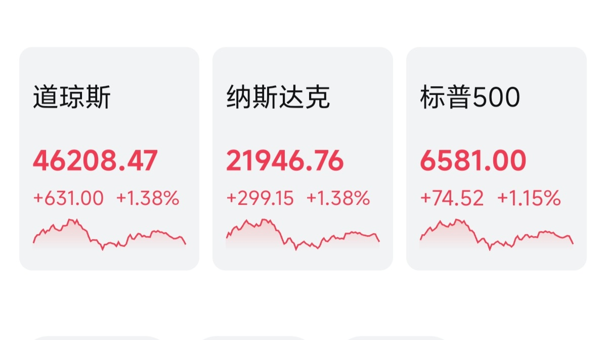

暖风频吹，市场复苏。

---

昨天又是被暴打的一天，三个多点，很疼了，银行三个多，消费四个多，电网两个多，资源三个多。

只能安慰自己好歹勉强跑赢指数了，之前创新高的时候老喊着不踏实，现在是相当踏实了。

很多投资者会问，是不是xx逻辑又变了？

这种时候没人谈逻辑，都是情绪。

既然是情绪，那肯定有被错杀的，所以对于捡漏王来说，这种时候的资本市场是有机会的。

但是有机会归有机会，哪些是陷阱，哪些是馅饼，就需要好好分清楚。

想起来之前蹲的好多东西都没蹲到，一飞冲天不见影子了，这才多久，又快蹲到啦。

今天目前截止现在来看，消息面还是比较乐观的。

大A但凡今天争点气，也要让投资者吃点甜头吧，天天挨打也不是个事啊。

至于昨天清仓的投资者，只能看开点啦，懂王这种性格的人，很难预料到他在什么时间点说什么话，干什么事。

也许过个几天又有什么反转也说不来的，不能以常理度之。

对于大多数坚守到现在的投资者来说，这是大家应得的，但是也不要被利好冲昏头脑，仓位控制和风险管理还是要走在前头，防患于未然才能行稳致远。

---

圈里好多人问的，某铜企收购内蒙古某黄金企业怎么看？

只花了不到200亿，拿了这么一家上市公司的控制权，估值也不是很贵，大体上一看就是划得来的。

如果一直有这种收购的机会，企业的利润足够一年拿下最少三家这样的企业，过几年之后会是什么样的光景？

至于风险的话，就是整合风险，虽然这家企业在内蒙，但是矿大多数在国外，分布的也比较广，虽然企业有丰富的整合经验，但是也不排除出现特殊事件的可能。

不到30%的股权拿下了控制权，还没掏太多的溢价，这不只是一种智慧，更是能力的展示。

毕竟去年某西部的铜企拍下茶亭都花了80多亿，两相对比，能力强弱一看便知。

只是现在这个时间点情绪不好，所以两家公司的资本市场表现都不佳。

但是换一种思路来看，这好像也是另一种形式的抄底不是么？

---

### 某飞机租赁的公司，铁公鸡要拔毛了

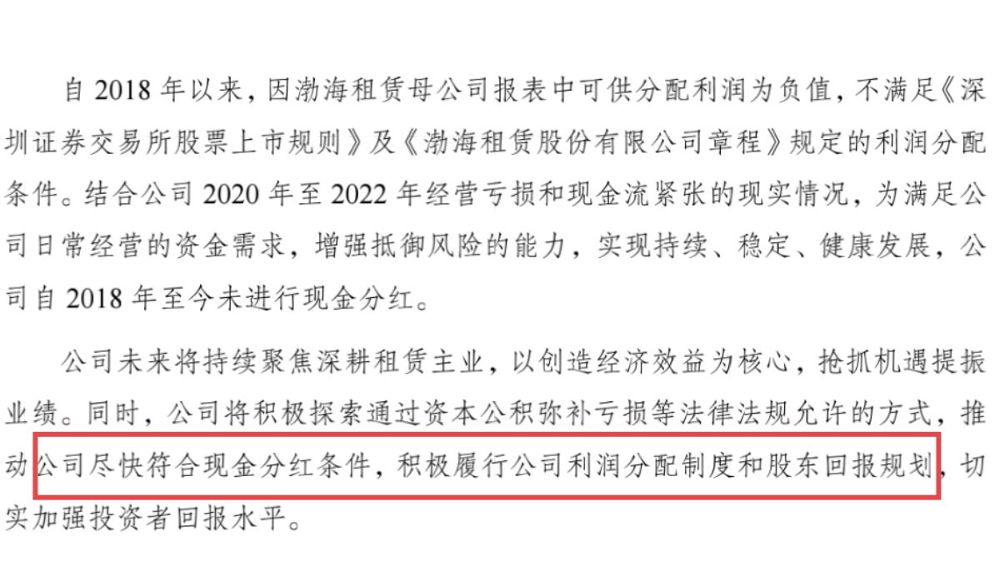

另外这家公司还准备回购自家股票，不过是为了出售，而不是注销，所以利好程度一般般，很一般那种。

---

### 某化肥企业龙头发布年报和分红预案

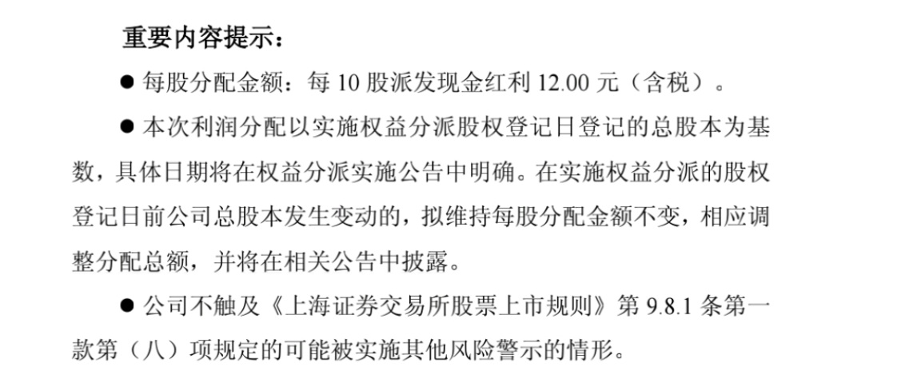

市场主流观点是业绩比较一般，算不上好，分红还算稳定。

---

### 一点心里话

昨天收盘后其实自己的账户倒没啥，赔就赔了，账户里的数字每天不是涨就是跌，根本就没什么所谓，对于价值投资来说，一个数字而已，取出来的才是钱。

但是让我在众目睽睽下写宏观，写石油，写衰退，和大家分享一些这类的看法，其中面对的压力不足为外人道也。

毕竟这种百年未有之变局，大家都是摸着石头过河，谁也说不上比谁高明。

万一资本市场有点风吹草动，理性客观的投资者虽然是多数，但是也不乏一些幸灾乐祸，落井下石的人节选部分内容大做文章。

所以我才说，这种事情只能干一次，干不了第二次。

还好，还好，发文后不到几小时态势就有了缓和的倾向，也算是冥冥之中自有定数吧。

资本市场的魅力也正在于此：

难以琢磨，无法预测。

评论区不要问要不要加，要不要减这类话题了，我回答不了，有些人是真的会钓鱼执法的！

---

一个喜欢保护韭菜的博主，希望大家少少踩坑，多多赚钱！！！

（以上仅为时事搬运，不够成投资建议，投资有风险，盈亏需自负！）

> [!comment]- 点击展开评论
>
> | 用户 | 时间 | 内容 |
> | :--- | :--- | :--- |
> | 硅谷 | 今天 07:00 | 来了dang师！第一！ |
> | 阿白 | 今天 07:01 | dang大，上周不看好美伊局势，加上A股进场时间比较晚，银行股近期位置也不低，仓位管理失衡，近期赎回了两笔理财的钱在PX和氟化工的撤退上忧虑不决，最后还是上周四整体清仓了。近期想布局回银行仓位，这周逐渐买入回事好时机吗？ |
> | &nbsp;&nbsp;&nbsp;&nbsp;MR Dang |  | 择时很难 |
> | &nbsp;&nbsp;&nbsp;&nbsp;阿阿阿阿烫🔥 |  | 银行要拿的久，年为单位。如果是有色类标的，周四清仓意味着你大概少跌了10%，今天可未必能涨10%，如果卖飞了也不要回头看，底仓观望即可，目前局势这么混乱，也许明天又是一个大跌，a股和川普一样短期都是不逻辑的 |
> | &nbsp;&nbsp;&nbsp;&nbsp;阿白 |  | 确实 |
> | &nbsp;&nbsp;&nbsp;&nbsp;浅浅 |  | 昨天跌后准备躺平了 |
> | &nbsp;&nbsp;&nbsp;&nbsp;妖怪叮当 |  | 是我的话，先买半仓。后面半仓等再次回调… |
> | 淡、 | 今天 07:02 | 早上好☀️ |
> | ㅤ | 今天 07:03 | dang大，想问一下怎么看天青石碳酸锶价格走势和企业股价走势的背离 |
> | &nbsp;&nbsp;&nbsp;&nbsp;就叫这个名字吧 |  | 同问 |
> | 长乐🍎 | 今天 07:03 | 追了一天消息，好像又没什么有用的。 各个王虽然跌了20%听Mr Dang 的，一个也没割。希望今天能回点本，昨天已浮亏19个本金😭 |
> | &nbsp;&nbsp;&nbsp;&nbsp;MR Dang |  | 是你自己坚守住了 |
> | &nbsp;&nbsp;&nbsp;&nbsp;抠搜老登 |  | 这种时候当存了定期就好了，我上周五梭哈的，现在浮亏25个点以上。算了一下预期分红，大概和存定期差不多。无所谓啦 |
> | 碓冰拓海 | 今天 07:03 | 快来看啦，我们胜利了 |
> | 仙凡 | 今天 07:03 | 按第三条问一下，牛走了吗？真的会有gjd说的慢牛长牛吗？还是又像以前一样。 为什么投行说的话不能信？ |
> | Daysforward | 今天 07:04 | 来啦来啦，赶了个早今天。 |
> | (￣～￣) | 今天 07:04 | 给抄底的方向啊 |
> |  | 今天 07:04 | dang大买金条都在哪里买啊 |
> | &nbsp;&nbsp;&nbsp;&nbsp;MR Dang |  | 水贝便宜 |
> | &nbsp;&nbsp;&nbsp;&nbsp;秦燚 |  | 水贝线上能买吗？什么台子？ |
> | &nbsp;&nbsp;&nbsp;&nbsp;茯苓饮 |  | 银行是不是最靠谱？ |
> | &nbsp;&nbsp;&nbsp;&nbsp;哈 |  | 水贝需要现场去吗 |
> | &nbsp;&nbsp;&nbsp;&nbsp;川 |  | 建议来现场，买首饰可以对比一下工费和工艺，当然要是买金条可能银行也差不多（来自一个在水贝买五金的人的建议） |
> | &nbsp;&nbsp;&nbsp;&nbsp;哄哄 |  | 同问，水贝有没有线上平台 希望大家不吝赐教 |
> | &nbsp;&nbsp;&nbsp;&nbsp;单线程生物 |  | 水贝会 |
> | &nbsp;&nbsp;&nbsp;&nbsp;诸事顺遂 |  | 水贝不是暴雷了？ |
> | &nbsp;&nbsp;&nbsp;&nbsp;沙雕 |  | 虽说那只是水贝的一家公司。只能说线上确实有风险 |
> | &nbsp;&nbsp;&nbsp;&nbsp;哄哄 |  | 这个能买吗 好像能看进金价 |
> | &nbsp;&nbsp;&nbsp;&nbsp;单线程生物 |  | 想买金饰可以来深圳旅游一下，我都是去水贝线下买的😁 |
> | 小江学士 | 今天 07:04 | 守得花开见月明！嘿嘿🤤🤤🤤 |

---

*本文件从 MR Dang 小红圈页面转载*

**作者**: MR Dang  
**链接**: https://www.red-ring.cn/post/27593-1949812  
**来源**: 小红圈

*著作权归作者所有。商业转载请联系作者获得授权，非商业转载请注明出处。*

---

## 相关阅读

- [[20251028-央行将研究实施支持个人修复信用的政策措施，此举对我国社会信用体系建设有何意义？|上一篇：央行将研究实施支持个人修复信用的政策措施，此举对我国社会信用体系建设有何意义？]]
