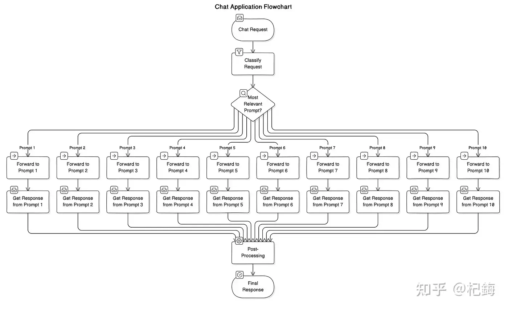
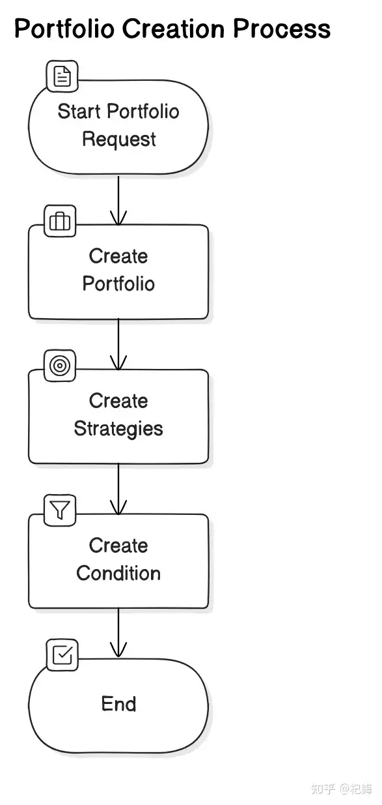
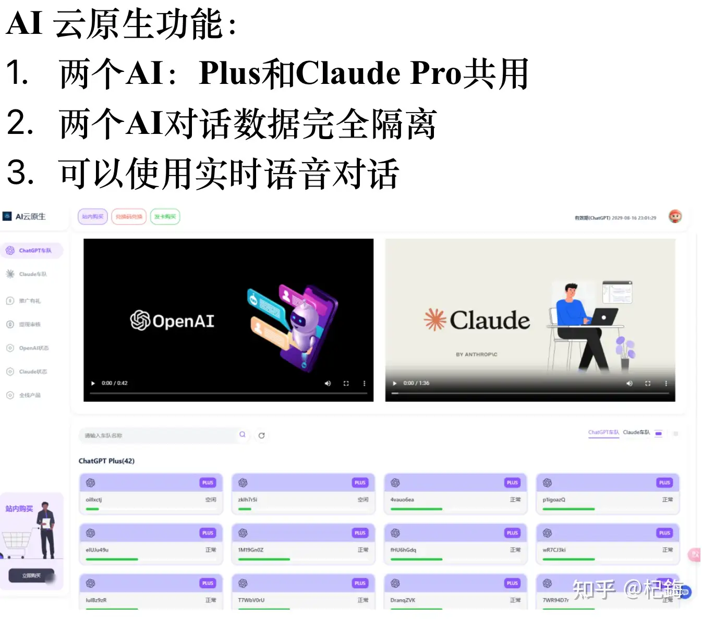
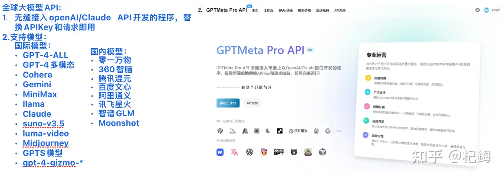
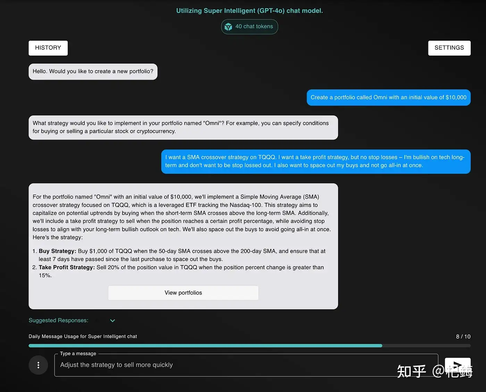
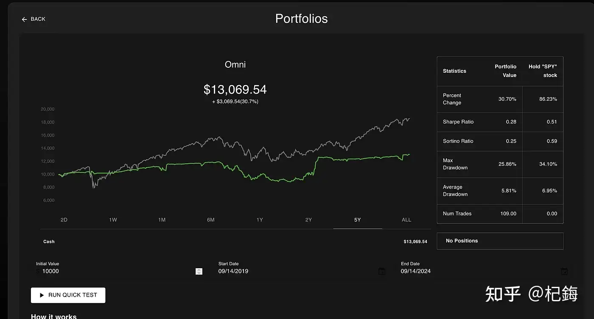
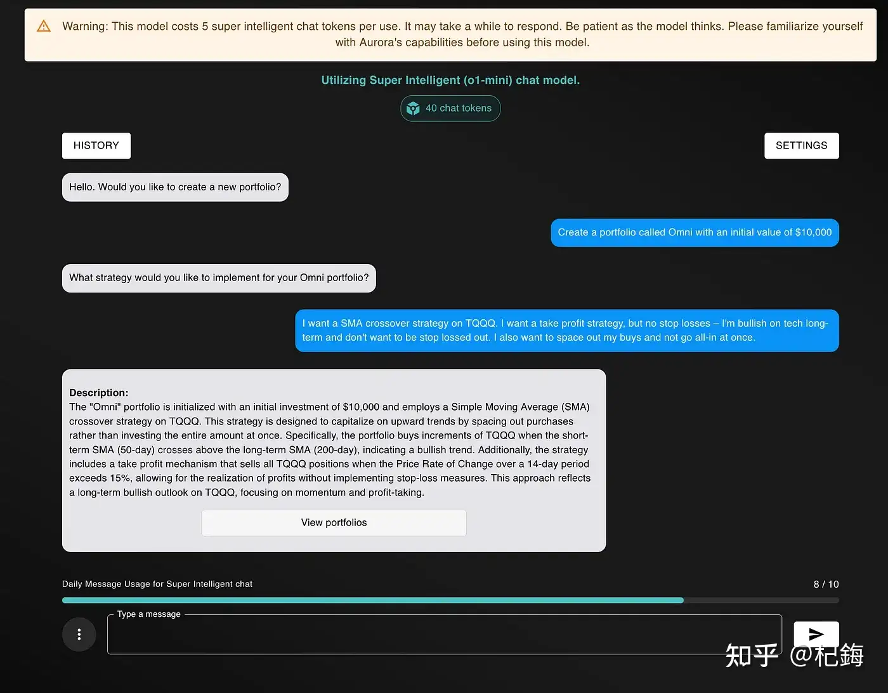
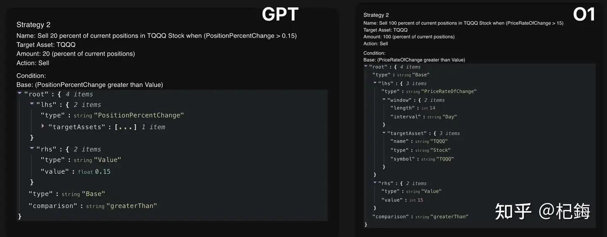
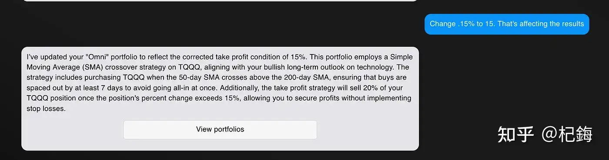
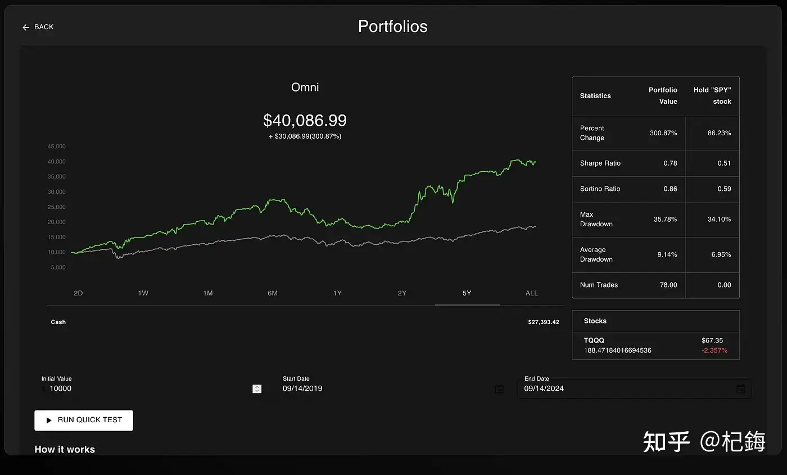

# 为什么用AI通过技术性炒股没有盛行？

---

**发布时间**: 2025-01-31 07:52  |  **原文链接**: https://www.zhihu.com/question/7175362912/answer/61125846026  |  **点赞数**: 1886 人赞同

**作者信息**: 杞鋂​软件开发行业 经营者

---

## 正文内容

能用来炒股的AI只有O1、gpt4o、claude、gemini、llama。

所以国内用不了，用得了，也只能偷偷摸摸用。

那不是行内人，又不是搞AI的，怎么可能知道？

之前，朋友搞了个GPT炒股的测试。

后面deepseek r1发布了，算力能达到gpt4o水平，便可以用deepseek来替代。

用O1模型来炒股，真的比人要靠谱，O1能根据你设定的规则来控制卖买。

跟GPT相比，GPT比较不亏钱。

目前O1支持图片分析，因此，基本上用好了GPT和O1，真的能把「经纪人」丢掉了。

先看看是怎用O1模型来创建算法交易策略的。

朋友构建了算法交易平台NexusTrade，使其能够与任何大型语言模型配合使用。

虽然后端允许它与 Gemini、Llama 等开源模型和其他 LLM 配合使用，但前端目前仅支持 OpenAI 和 Anthropic 模型。

其工作方式是一个多步骤的过程：

当模型解读出用户想要创建交易策略的时候，就会创建一个“提示链”！

首先，我们创建投资组合，包括其名称、初始值和策略描述。

然后，根据策略描述，我们创建策略流程。其中包括策略名称、操作（“买入”或“卖出”）、我们想要购买的资产、金额（例如，购买力的 10% 或 100 股）以及我们想要执行操作的时间描述。

最后，对条件重复此过程，并将描述转换为可以通过 NexusTrade 的回溯测试和实时交易功能解释的条件，这个过程使我们能够使用 AI 创建投资组合。

国内由于地域不太方便，我当时用的API中转，我就用的这三个API ，非常丝滑：

A. AI云原生：

https://aicloud.mygptmeta.com/

B.渗透智能-ShirtAI:

https://www.myshirtai.com/

C.GPTMeta API：全球大模型API

https://api.mygptmeta.com/

在 OpenAI 推出O1模型之前，GPT会很注重Prompt工程的步骤以及你想要实现的方向。

但是O1的出现，Prompt的写法只会更简洁，讲重点即可！

用使用完全相同的Prompt来创建两个投资组合。

第一个投资组合将由 GPT-4 创建。第二个投资组合将由 GPT-o1-mini 创建。

为了创建投资组合，提到了以下内容：

这是我第一次尝试用 GPT-4 创建的投资方案：

百分比回报率比持有 SPY 差很多，风险调整后的回报率也差很多，而且它进行了大量交易（这在现实生活中会产生税收影响，进一步降低您的实际实现利润）。

相比之下，这是用O1模型创建的投资组合。

创建这个投资组合的过程实际上完全相同。

这两个请求之间的唯一区别是我使用了更强大的O1模型。

但结果却非常很好！

结果就是：

典型的是降风险增利！

很多小伙伴都想尝试用AI辅助炒股，关键在于：

1.没有AI使用权限

2.不知道怎么写Prompt

这里推荐一个教程，是知乎知学堂官方推出的「AI数据训练课」，专门针对AI入门者而设的。

不仅有AI工具限免权限，还有各种AI做数据分析的实操演示，从0到1教你玩各种数据分析AI，还是很靠谱的。建议对着视频边学边练，小白也可以轻松上手，入口就在下面:

点击上面卡片，添加工作人员，领取ai工具、教程和Prompt资源。

文中的Prompt都是经过多次测试可用的，想要大数据专用的Prompt，得到助教老师那里领取，千万別忘了！

其实有一个关键的细节：在为该策略生成卖出条件时，如果头寸上涨哪怕一点点，达到 0.15%，GPT-4 就会卖出，相比之下，如果股票 14 天平均价格上涨 15% 或更多，则由O1模型创建的投资组合将会出售。

想要GPT达到O1的效果，可以小调一下：

微调后的投资方案也取得了好的回报。

OpenAI 的两种语言模型都可以创建高利润的算法交易策略，o1 模型无需任何人工干预即可做到这一点，而 GPT-4 模型则需要专家的帮助。

顺便可以看一下，怎么用GPT来分析企业的股票数据：

为什么不专门用训练过大量股票数据的大模型预测股票？

用开源ai搭建炒股助理

你用 GPT-4o 干了些什么非常厉害的事情？

用DeepSeek做战略分析：

Deepseek能为我做什么？

有兴趣可以看看其它AI知识：AI大千宇宙

AI写小说精华教程可以直达专栏→→：0基础AI写作：12招让小白秒变作家

---

## 精选评论

| 用户 | 时间 | 内容 |
| :--- | :--- | :--- |
| sxfreesky |  | 回测买地球,实测上天台 |
| 时间的过客 |  | 美国曾经在A股实验了A\|自动炒股，结果改进几次还是亏掉裤衩，老实放弃了 |
| 杞鋂 |  | 只能说有人欢喜有人愁 |
| 想飞的蜗牛 |  | 以前在量化群待过，那时候用的接口都是非法的tradex，群里说的多的是回测范冰冰，实盘凤姐 |
| 杞鋂 |  | 没加钱吧。。 |
| 胖三斤 |  | 模型再牛逼，回测再好，只要你买入，就会被割。为什么？因为你的资金真进去了，庄家机构各种就会针对你这几万块收割你。这就是模拟炒股和实盘的区别。 |
| 杞鋂 |  | 这是100%输出和99%输出的区別，类似于我下面这篇回答，別人都是99%让AI输出JSON格式，但是用DFA能让AI100%输出JSON。。。如何让大语言模型输出JSON格式？ |
| zapper研究 |  | 有可能，不过还是要看大盘面色，都是概率说了算 |
| sakura z |  | 就买在主力建仓的位置，如果他要砸盘几千万为了让股价跌几个点让我亏几百块，那我无话可说 |
| 吴金盛 |  | Talk is cheap, show me the benefit |
| 123 |  | 人家卖课的，不要影响人家生意 |
| xingye |  | 肯定没有benefit啊，有的话还来这卖课 |
| 布欧么么哒 |  | 就这个策略，两个月亏光。 |
| 杞鋂 |  | gpt起码没人那么焦焦。只有少挣点。。很难亏 |
| 星空下的梵高 |  | 很难亏这三个字一出来就知道是什么成分了 |
| morikoji |  | 问题是gpt是人应用的，人焦虑了就要改策略 |
| loremaster |  | 用语言模型炒股，这心得有多大 |
| 杞鋂 |  | 先模拟再慢慢投钱，用大模型的好处是，有预设结果，人能选择。。 人工炒股最可怕的是突发情况，而自己不知道怎办。 |
| 勇敢的奔跑吧 |  | 在A股会亏得连裤衩都不剩 |
| lalala啦啦啦啦 |  | 不是，量化那套东西本质上你也能说是ai，但是大模型这种算数字苦手，你真敢让他炒股啊 |

---

*本文件由自动脚本从MR Dang知乎页面提取生成*

---

**作者**: MR Dang
**链接**: https://www.zhihu.com/question/7175362912/answer/61125846026
**来源**: 知乎

*著作权归作者所有。商业转载请联系作者获得授权，非商业转载请注明出处。*
