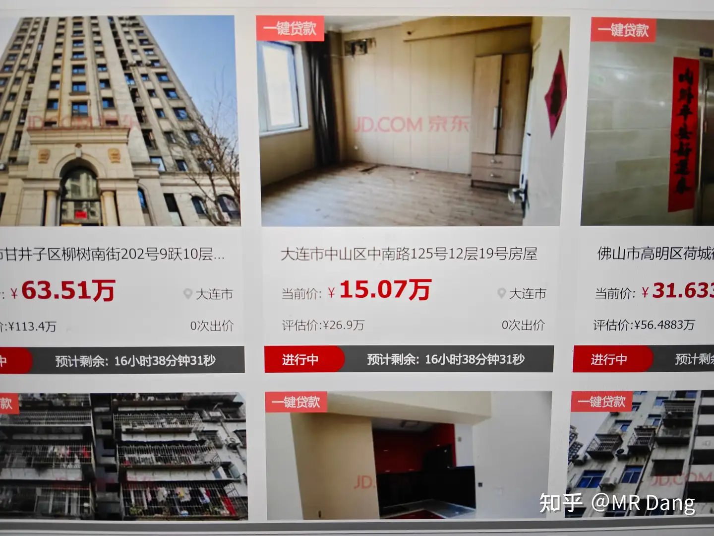

# 低价「银行直供房」数量激增，有房产价格低于市价 25%，对楼市有哪些影响？购买银行直供房要注意什么？

---

**发布时间**: 2025-11-10 17:32  |  **原文链接**: https://www.zhihu.com/question/1971179548931481823/answer/1971269042275850191  |  **点赞数**: 234 人赞同

**作者信息**: MR Dang​独立投资人，全网无其他平台，无小号无私域，不接广不卖课

---

## 正文内容

### 问题切入点

好问题，很多人的切入点在对楼市，对房价的影响上。

我分成两部分叙事吧，实在是被删怕了。

### 从房价角度分析

首先，就房价来说。

可以类比成股价。

#### 极限引力挑战

你看股灾的时候，为什么参与极限引力挑战的人就多了？

因为短时间内，跌的太快了，来不及换手，伤害都被一个投资者承受了。

而一个人的抗性是比较低的，受到的又是真实伤害，受不了就回泉水了。

股价从100跌到30，中间不带喘气的，是个人都受不了。

#### 慢熊市的优势

但是慢熊市的话，虽然对人的折磨是极致的，痛苦的。

不过因为跌的够慢，时间够长，所以换手是充分的。

股价同样是从100跌到30。

a接盘100到90的部分，失败了，去铁人三项了，一个月一万。

b接盘90到70的部分，失败了，去铁人三项了，一个月9000。

c接盘70到50的部分，失败了，去铁人三项了，一个月8000。

d接盘50到30的部分，失败了，去铁人三项了，一个月7000。

abcd共同承担了100跌到30的伤害，而且他们有四份铁人三项的工作去还钱，所以不至于冲动去重开。

### 房价换手率的重要性

房价也是一个道理，如果房子带杠杆，在一个人手里一直从头拿到尾，那么也是会出问题的。

最好的办法，就是把这些房子匀一匀，加大换手率，把伤害分摊下去，那就不会出大问题。

你如果能get到这个设计的巧妙，你就知道我为什么说：

**房子除了刚到不能再刚的刚需，一套都不要留。**

**和哪里的房子没关系，是房子就往外丢。**

### 安全感需要付出代价

当然你说什么安全感，归属感。

那没办法了，安全感是需要付出代价的。

房价的波动就是需要你承担的费用，如果提前想通了，觉得可以接受，那也可以。

除此之外，什么置换的，改善需求的，你租房能花几个钱，打开app输入你的预算，海量的房源等着你。

你置换，改善，这个行为就是换手率的分子，相当于主动去承担房价下落的伤害。

你参与房子的换手过程，就一定会赔钱，赔多赔少的问题。

**下落的飞刀不要接，房子和股市都一样。**

### 从银行角度分析

其次，从银行角度来叙事。

我不知道有没有人注意到处置平台的界面。

#### 一键贷款的玄机

每处房产的左上角都有"一键贷款"四个醒目的大字。

有些银行啊，净利润连年增加，经营性现金流却是负的。

现金少了，净利润多了。

银行手里的资产都是什么，好难猜啊。

其实事实上，这些资产的评估价和真实市场价值差了最少有20%。

以银行成千上万亿的资产规模，稍微计提一下，那就是惊天动地的大事。

但是，如果房子挂出去，换个手，哪怕再把贷款放出去，只要每个月几千的利息有人还。

甚至都不用几千，还个几百块。

这笔上百万的资产就很"健康"，起码看起来是这样的。

### 结语

一个喜欢保护韭菜的博主，希望大家少少踩坑，多多赚钱。

---

## 精选评论

> [!comment]- 点击展开评论

| 用户 | 时间 | 内容 |
| :--- | :--- | :--- |
| Pauling | 4 小时前 | 所以正常派息且维持现金流不减少，是投资银行股的关键？ |
| &nbsp;&nbsp;&nbsp;&nbsp;MR Dang | 4 小时前 | 恭喜你发现了盲点 |
| &nbsp;&nbsp;&nbsp;&nbsp;MR Dang | 4 小时前 | 债务成本低，数量大，对银行来说比揽储方便 |
| IamBaymax | 4 小时前 | 提高换手降低房价下落的伤害，同时还能促进银行现金流的流通，是这样吗当佬 |
| &nbsp;&nbsp;&nbsp;&nbsp;MR Dang | 4 小时前 | 用更多的生产资料去化债 |
| &nbsp;&nbsp;&nbsp;&nbsp;MR Dang | 2 小时前 | 赶紧卖，换成银行股，比你们以后工资高，可以把你们的时间省出来用来学习或者干其他有意义的事情 |
| 灰马 | 3 小时前 | 建议大佬以后少评楼市，微信公众号一个每篇10万+阅读量的大V就因转发断供数据并点评楼市还没到底，被禁言14天。你若被禁言，股市我就成了无头苍蝇怎么办？ |
| &nbsp;&nbsp;&nbsp;&nbsp;MR Dang | 3 小时前 | 未经证实的关键数据不要转发，危害公共安全的事情不要评论，但是讨论个人生活选择应该还安全吧。。 |
| 鸵鸟啊鸵鸟 | 2 小时前 | 是不是猫笔刀？ |
| 火火 | 3 小时前 | 这个是哪个呀 还挺好奇的 |
| 广东顺德分Dang | 2 小时前 | 大屁股，猫 |
| 在齐太史简 | 3 小时前 | 此文只应天上有，人间能有几回读。 |
| 木向阳 | 4 小时前 | 先截屏，再观看，避免丢失。 |
| &nbsp;&nbsp;&nbsp;&nbsp;MR Dang | 4 小时前 | 乌鸦嘴 |
| 知乎用户44412 | 5 小时前 | 请问这推荐的啥？房地产？哪个？ |
| live葱葱 | 3 小时前 | 有的兄弟有的，快去卖不是好位置的非自住房 |
| 知乎用户44412 | 1 小时前 | 新人，是真看不懂，连续看两篇没懂，包括上篇科技感谢党大的包容，感谢大家帮忙科普，好好学习！小白的我能逗大家一笑，也值得 |
| bobArch | 3 小时前 | 笑死了，怎么有不看文章就要抄作业的 |

---

*本文件由自动脚本从MR Dang知乎页面提取生成*

---

**作者**: MR Dang
**链接**: https://www.zhihu.com/question/1971179548931481823/answer/1971269042275850191
**来源**: 知乎

*著作权归作者所有。商业转载请联系作者获得授权，非商业转载请注明出处。*

---

## 相关阅读

**🏠 房产楼市：**
- [[20251008-买优质房源还是买优质公司股票？]] - 买房还是买股票
- [[20251018-如果有四十万存款你打算先买车子还是先买房子？]] - 车房选择问题
- [[20251021-9月各线城市房价环比下降，同比降幅总体持续收窄，如何看待这一趋势？]] - 房价趋势分析

**🏦 银行股专题：**
- [[20251114-《天阶功法卷六》银行股投资原理详解]] - 银行股投资原理
- [[20251022-《天阶功法卷五》DSL投资价值分析]] - DSL银行股分析

**📚 投资方法教育：**
- [[20251013-什么是投资思维？普通散户该如何培养？]] - 投资思维培养
- [[20251016-投资新手避坑指南之追热点(万粉特别奉献)]] - 追热点风险

**💡 风险控制：**
- [[20251020-投资新手避坑指南之仓位控制]] - 仓位管理的重要性
- [[20251103-高学历的人炒股，痛苦的根源是什么？]] - 高学历投资者的痛点

**🔙 返回：**
- [[房产楼市]] - 房产楼市全部内容
