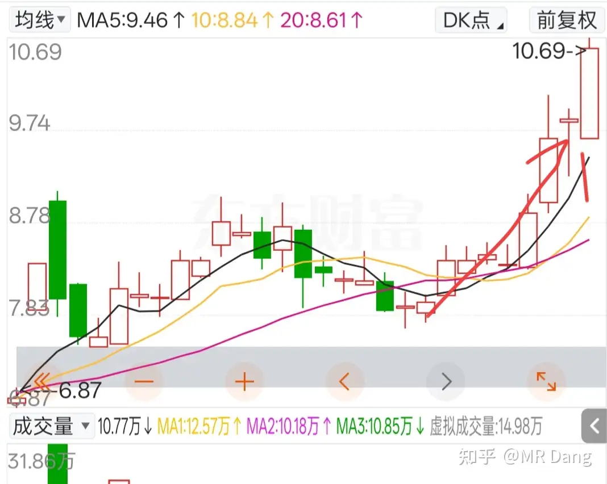

# 什么是投资思维？普通散户该如何培养？

---

**发布时间**: 2025-10-13 12:02  |  **原文链接**: https://www.zhihu.com/question/1960754256098358392/answer/1961039136019429140  |  **点赞数**: 243 人赞同

**作者信息**: MR Dang独立投资人，全网无其他平台，无小号无私域，不接广不卖课

---

## 正文内容

谢邀，人在大a，刚把水上的银行挪了点去补水下的煤化工，好像没啥正事了，打卡下班，顺带过来吹吹牛。

投资思维这个命题太宏大了，看到这四个字我脑海里自动浮现出一整套的方法论，世界观和投资观，价值投资和价格投机，但是这些对普通投资者来说，特别是新手，都是纸上谈兵，我讲了你也听进去了，但是基本上是无法心领神会的。投资是理论和实践结合的艺术，我说的再好，你没有实践经验，没有切肤之痛，就是无法get到。

所以我歪个楼，对普通散户来说，投资思维先放一边，你得先有投资眼光。

就像在现实世界一样，眼光是在资本市场里避免踩坑的最最重要的倚仗。

以下关键词，请普通散户自动拉入黑名单，加入到你投资的慧眼里。看见直接跑，麻溜的跑，千万别回头，多看一眼都会爆炸：

1，"老师"

这里不是职业歧视，这里说的老师，是指你在各种平台各种场合，宣称可以带你挣钱的老师。

请牢记，自古以来，挣快钱的方法都是秘而不宣的机密。假设他真的是一个收益率奇高的投资者，会有数不清的钱自动找上门，根本不需要去宣传。如果他真的挣钱如麻，分分钟七八位数上下，他为什么要收取你那廉价的四五位数的资金，把赖以谋生的秘诀倾囊相授？精确的告诉你代码，精确的告诉你买点卖点，只为了赚三瓜两枣？

你说不对，老师说了，挣了他只分盈利的一小半，大半都归我。我不赚钱老师不也收不到钱么？

那你有没有问亏了怎么分账呢？你的便宜老师要承担多少？他真的会认账么？

你自己的钱为什么要分给别人呢？

我的私信收到了很多投资者希望我带着去挣钱，承蒙大家厚爱，但是我全部婉拒了。

试想一下，我带着你一起买进去了，然后有一天我觉得不对劲，我要逃跑了。我是给你说呢？还是不给你说呢？我给你说，你跑到我前头，我卖不了好价，损失也不是几万几十万的学费可以弥补的。我不给你说，那不就想当于你花钱接了我的盘？你不成了纯纯大冤种？

这还是我真心实意想帮你的情况下，如果还有人居心叵测想拉你去接杀猪盘呢？

说了这么多，希望普通投资者明白，投资是孤独的，我可以，也乐意分享一点我的方法。但是在投资者这条路上，

大道独行，各走一边。

千万不要相信所谓的老师，亲父子尚且带不动，何况什么路人老师。

2"战法"

这个字眼是我看到就想笑的字眼，前面五花八门的搭配，可以搭配出上万种战法。每种战法他都可以找到几百上千个案例说明他的战法是如何的有用。

普通投资者看到以后被唬的一愣一愣的。

比如我现在就可以声称，我发现了一种"九浅一深"战法，9个交易日小幅度上涨过后，就有一个大幅度的长阳。

再配一个图，有图有真相，今天还正涨着呢。

这个课程也不贵，9999，独家九浅一深战法送给有缘人。

类似的手段层出不穷。

事实上，所谓的战法不过是一种策略。但是现在的量化你知道有多卷么？厉害的量化策略成千上万种指标，除了9浅1深，人家的指标里还有8浅1深，6浅5深，任何一种有一点点超额收益的策略都会被编进去，直到把超额收益策略抹平为止，根本就不是散户可以参与的。

神仙打架，路人远离。

看见战法二字，速逃。

3，"天降"

天上既不会掉林妹妹，更不会掉好股票。

前两天走在路上，突然接到一个电话，因为在开车，没细看，就接了。

是一个口音严重的南方女子，报了一串神秘代码后，神秘兮兮的说第二天有行情。

这种剧情我看多了，一般都是广撒网，然后碰运气，捞大鱼。

他们推荐的股票都是首板，然后群发，首板的股票大家都知道，第二天涨停的概率还是比较大的。

骗我自然骗不到，但是如果你带入新手的视角，走在路上打来一个神秘电话，告诉你神秘代码，你一看第二天真的涨停了，甚至第三天都涨停了，你是不是会觉得碰见了股神？只要你打电话回去，他们有的是办法骗你。

想投资，先避坑，练出投资眼光，再养投资思维。今天先说三个坑，本来我以为这是投资常识的，没打算单独拎出来说，但是股民基数太大了，总有人因为各种侥幸心理去上这种当。

投资这件事，愿赌服输，亏了只能自认技不如人，运不在我。但是被这些盘外招骗到，实在不应该啊，兄弟。

——————分割线——————

能不能讲点投资的干货啊，我点进来不是看反诈宣传的。

有的，兄弟，有的。

投资最重要的是投资思维是初中数学思维。

你得搞明白，涨停和跌停是不对等的。

虽然都是10%，但是跌停的破坏力是涨停弥补不了的。

比如100块的股票涨停完再跌停，或者跌停完再涨停，最终都是99，而不是回到100。

你说太尴尬了，别讲了，这不就是最简单的平方差公式么：（1+10%）（1-10%）=1-10%²

哎呦，不错，确实难不倒你。

那么咱们再来，一个股票20块钱，你买了1000股，如果他最高可以涨到25块，最低回撤到15块，上涨下跌概率相等，且在上涨和下跌时股价最终分布符合参数相同的正态分布，不考虑时间成本，你投资这只股票的期望收益是多少？

0，你脱口而出，股数不变，都是1000股，这次不是10%的比例涨跌，而是绝对值对称，都是5块，上涨和下跌对称，根据对称性直接秒了。

excellent，你真是初中数学小王子。

那么，你连续投资于这种期望收益0的投资，最后的投资期望是多少呢？

0，你又脱口而出。

真的吗？想想刚才的平方差公式，你还确定么？

你恍然大悟，原来一直连续投资风险中性，期望收益为0的标的，收益会诡异的减少。即使不考虑时间成本，不考虑摩擦成本，依然是亏损。

我把这个叫平方差魔咒。

他是你投资路上第一显而易见的结论，是拥有初中数学知识就可以发现的问题症结所在，但是很多投资者即使投资了几十年，可能在暮年之时也无法悟道。

他就是解答你投资思维的第一把钥匙。

想要破开平方差魔咒，只有三剂良药。

第一剂就是投资于长期数学期望＞0且＞通胀率的标的，曰价值投资。

第二条就是减少波动，这是反人性的，来股市的谁不想一夜暴富，但是当你认清(1+波动)(1-波动)=1-波动的平方，这个魔咒的真面目后，你会远离他。

第三条就是仓位控制，这更是反人性的，平方差魔咒产生的原因就是一直满仓，如果你低位满仓，高位减仓，就可以避免掉平方差魔咒，但，这真的很难。

毕竟有一种心理，叫侥幸。

---

## 精选评论

> [!comment]- 点击展开评论
>
>
> | 用户 | 时间 | 内容 |
> | :--- | :--- | :--- |
> | 天高气爽风飞扬 |  | 没有"有的，兄弟，有的"这句，我不看 |
> | &nbsp;&nbsp;&nbsp;&nbsp;MR Dang |  | 在写了，在写了 |
> | 富贵有钱花 |  | 良心投资人 |
> | &nbsp;&nbsp;&nbsp;&nbsp;MR Dang |  | 有眼光 |
> | 泽越止 |  | 九浅一深笑死我了 |
> | &nbsp;&nbsp;&nbsp;&nbsp;MR Dang |  | 你的关注点比较奇怪 |
> | 阿豆豆阿豆 |  | 你让我想起一个B站up说的，很多人期望老师给一个神秘六字代码，然后你就发家走上人生巅峰，这就是妄想，就算你爹也不会这么带你 |
> | &nbsp;&nbsp;&nbsp;&nbsp;MR Dang |  | 这是真话，求人不如求己 |
> | 丧心病狂 |  | 儿子不带爹可能，爹还是会带儿子的 |
> | 感恩遇到的好人 |  | 发现你是个正能量的好博主 |
> | cken |  | 确实，不亏钱，在市场就赢了95%的人了。每年赚10%，有的人嫌太慢，一个站不住的的逻辑就敢搞100倍pe的票。5年赚50%的人应该比1年赚50%的吊。 |
> | 丧心病狂 |  | 五年不亏钱已经极其弔了 |
> | 白泽子 |  | 博主说的很实在，给大家敲响警钟 |
> | 懂你 |  | 这是我看到的最说实话的投资人 |
> | 哈喽树先森 |  | 为什么种子真的涨了啊？凭啥啊 |
> | &nbsp;&nbsp;&nbsp;&nbsp;MR Dang |  | 应激反应而已，别当一回事 |
> | 153tyu |  | 久经考验的历史经验，别奇怪 |
> | 王嘟嘟 |  | get了。懒+拖延，能大a不败 |

---

*本文件由自动脚本从MR Dang知乎页面提取生成*

---

**作者**: MR Dang
**链接**: https://www.zhihu.com/question/1960754256098358392/answer/1961039136019429140
**来源**: 知乎

*著作权归作者所有。商业转载请联系作者获得授权，非商业转载请注明出处。*

## 相关阅读

**📘 投资方法教育：**
- [[20251020-交易策略只是第一步，重要的是仓位管理？如何科学设置仓位？]] - 仓位控制的实操指南
- [[20251026-如何对企业进行估值？]] - 估值方法详解
- [[20251031-你是怎么计算股息率的？ 关注股息率的哪些点？]] - 股息率计算方法

**📘 风险控制与心态：**
- [[20251103-高学历的人炒股，痛苦的根源是什么？]] - 投资心理分析
- [[20251111-明明长线比短线更容易赚钱，为什么散户更加执着于做短线？]] - 长短线投资分析

**📘 行业研究：**
- [[20251106-怎么投资银行股，并获取银行股股息收入？]] - 银行股投资指南

**📚 基础功法：**
- [[20251022-《地阶功法卷一》投资者必须斩杀的三个妄念]] - 投资思维基础
- [[20251023-《地阶功法卷二》价值投资三大误区]] - 价值投资进阶

**🔙 返回：**
- [[投资方法教育]] - 投资方法教育全部内容
