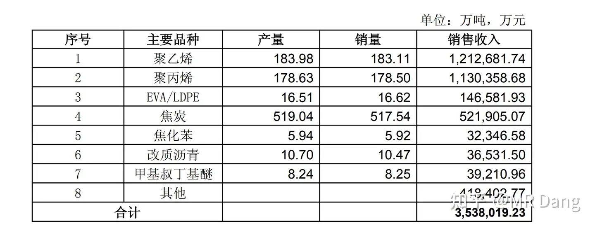
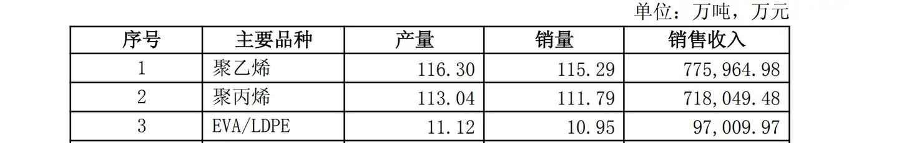
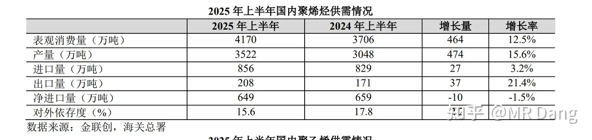
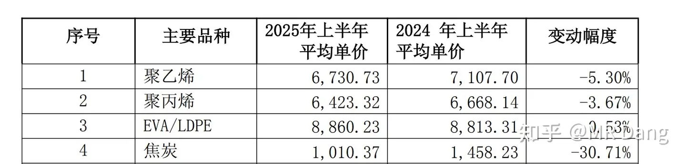
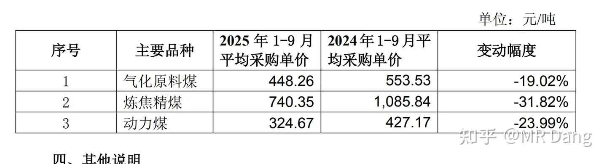
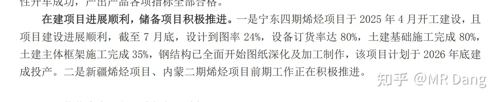
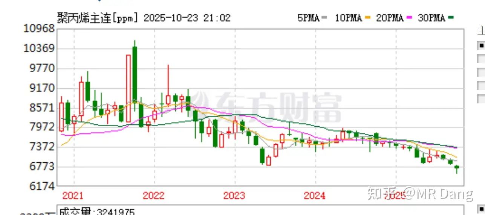

# 怎么全面的分析一支股票？

---

**发布时间**: 2025-10-24 08:37  |  **原文链接**: https://www.zhihu.com/question/279163389/answer/1964973757945873920  |  **点赞数**: 486 人赞同

**作者信息**: MR Dang独立投资人，全网无其他平台，无小号无私域，不接广不卖课

---

## 正文内容

前置功法：

地阶功法卷二

地阶功法卷一

书接上回煤化工：

[[20251024-《天阶功法卷一》BFNY价值投资分析|煤化工]]

此三卷，前两卷为心法，后一卷为引子，务必参透，方可领悟此天阶功法。

有人问，博主，你怎么这么狂，随便写点破玩意儿，就敢叫《天阶功法》。

兄弟，互联网时代，流量为王，体谅下博主哈，博主是要恰流量这口饭的嘛，看在完全免费，允许转载的份上，以后别提这茬了哈。

——————————————————分割线—————————————————

价值投资，逻辑为先，财报未动，思路先行。

我在投资BFNY之前，是从来不知道有这么一家公司的，那么是什么契机发现了他呢？

两个字，安全。

安全这两个字，字字千金，它是你投资A股5到10年的一个主线。

它频繁出现在各种文件中，各种会议里，前面加上各种修饰词。

比如，粮食安全，金融安全，科技安全，资源安全，能源安全，信息安全。

每个安全下面都有阶段性的主线。

那么在能源安全这个分支下面，我们要分析哪里不安全，就会知道什么是能源安全。

我国能源的现状是什么？

一言以蔽之，富煤，少油，少气。

不安全的地方在哪里？

进口天然气受阻，进口原油受阻，天然气价格波动，原油价格波动。

怎么样才能安全？

两条路，要么发展新能源替代，要么用煤替代。

毕竟煤炭这东西，我们有的是。

新能源的话，就是一系列的投资主题，风，光，核，电，储能，输送，这里比较热闹，低估的品种不好挖掘。

但是煤炭替代这块儿，就三条线路，煤制油，煤制烯烃，煤制乙二醇和PX。

煤制油这个赛道拥挤，还有像兖矿这样的企业，没有很大的机会，放弃。

煤制乙二醇和PX这个行业容量太小，放弃。

煤制烯烃呢？好像还可以研究研究，容量大，而且附加值高，利润丰厚。

我们就有了第一个认知:

安全→能源安全→富煤少油→煤炭替代石油→煤制烯烃

而一旦到了这一步，就没有的选择了，只有BFNY一家企业。

为什么呢？像中国神华，中煤能源，也有煤制烯烃业务，但是只占总营收的15%不到。

只有BFNY，业务占比70%以上。

我们就有了第二个认知，

BFNY≈煤制烯烃

从这一点上来说，BFNY对国内的能源安全有着举足轻重的意义。

那么官方对这行业是什么态度呢？我们开始搜索文件：

《关于加强煤化工项目建设管理促进产业健康发展的通知》

FGW的文件，2006年，明确这行准入门槛60万吨。

《煤制烯烃行业规范条件》

2020年10月，GXB的文件，明确这行准入的综合能耗≤3.5，先进值≤2.5

《关于推动现代煤化工产业健康发展的通知》

2023年7月六部门发布，新建产能需要省级批准。

《重点领域节能降碳升级实施指南》

FGW,2022年，把煤制烯烃纳入高耗能企业，2025年，能效标杆水平以上达到50%。

基准水平以下清0。

把这些文件串起来，可以看到，我们就是需要一个趁手的，能耗低的，产能高的这么一家公司。

它是谁，无所谓，只要能帮祖国母亲把煤炭高效的转换成烯烃就行，谁能干好这个活，谁就会得到支持。

——————————————分割线————————————————

以上这些叫什么？这叫顶层设计，你理解了这些，你才能理解商业模式。

那么BFNY商业模式是什么呢？

刚才我们说了，顶层设计，是让他用煤炭去置换石油。

所以我们只需要关注四个数据就行，

用什么价格的煤炭，

按照多少的比例，

置换出多少数量

多少价格的石油。

而不是盯着那些报表在那里盲人摸象。

这四个关键数据分别是：煤价，转换比，转换量，油价。

没了，这就是投资BFNY的第一性原理。

其它所有的财务数据，都是为这四个数据服务的。

BFNY你看成一个生产资料，输入端是煤炭，按照一定比例，输出的是石油（节省就相当于创造）。

它还是祖国母亲认证的，效率最高的机器之一。

这种商业模式你要说最好的，它还够不到。

但是在有上下游的企业中，它一定是最好的那一档。

————————————分割线——————————————————————

顶层设计→商业模式→财务分析印证

前两步都完了，我们开始正儿八经的分析。

BFNY的业务主要产品结构可以看经营简报：

除了焦炭占比比较大以外，最主要的产品就是聚乙烯和聚丙烯

而焦炭是个同质化严重的行业，我们抓住主要矛盾，舍弃次要矛盾，直接无视焦炭这块。

就盯着聚乙烯和聚丙烯，BFNY这个股票你就算吃透了。

对比一下半年经营简报

聚乙烯三季度产能67.7万吨，因为第三季度是新产能爬坡后第一满产季度，合理推测BFNY的全年产能在270万吨级别。

聚丙烯三季度产能65万吨，合理推测BFNY的全年产能也在270万吨级别。

根据上半年的国内产量3522万吨，推测全年产能在7100万吨的话。

宝能270+270的产能，占全国全能的7.6%。

但是请注意，这个是全国煤制烯烃+油制烯烃+乙烷制烯烃的总产能。

按照2000万吨的煤制烯烃总产能测算，则宝能的产能占比达到27%。

产能了解到这就行了，不必继续深究了。

我们再看售价：

上半年均价6730和6423

前9个月均价6622和6332

测算一下，

第三季度的平均售价是6368和6181

（感兴趣的可以自行计算小学数学题）

同理，原料端这块儿：

主要是三种煤，但是鉴于动力煤的数据更易获取，我们就先盯着动力煤看，上半年均价320

前三季度均价324

没有给出购买量，我们就按照烯烃的比例进行测算。

得到第三季度的均价大约是331

同理，气化原料煤采购单价452

（有关两种煤的区别没必要了解，不过你真的很好奇的话，简单的说就是气化煤是原料，无法自给，需要外购，因为对品质要求高。动力煤部分自给，部分外购，因为只是用来提供蒸汽的）

以上就分析完毕了：

BFNY目前是一个生产资料，什么样的生产资料：

年产能：540万吨（公司口径520万）

在烯烃售价分别是6368/6181

动力煤煤价331元

气化原料煤价格452的情况下

每季度每股收益0.44

合每年每股收益1.76

你不用思考它是怎么做到的，那是公司需要关心的事情，也不用研究其他无关的指标。

你就盯着产能，煤价，烯烃售价以及原油价格（烯烃价格的先行指标）。

目前的烯烃吨耗煤大约按照5吨计算（动力煤+气化煤）

煤价提高10%，则每吨烯烃成本大约提高200，减去税负影响（15%左右），可近似认为影响净利润170元/吨

烯烃售价提高3%即可保持现有吨盈利水平。

也就是煤提价10%的影响可用烯烃提价3%对冲。

其他什么你都不用管，这叫大道至简，重剑无锋，不要在会计科目里游泳！！！

———————————————————分割线——————————————

以上说的是已经发生的事情，那么以后的预期如何呢？

宁东四期明年投产，50万吨。

新疆项目：3*65的聚丙烯+聚乙烯，也就是390万吨。

产能方面还能在目前的基础上再增加80%。

而现在的烯烃价格是什么水平：

月K线来看，是5年来的最低点。

一个公司，在主要产品价格跌到5年最低点的时候，利润创了新高。

而且还能再增加80%的远期产能。

————————————分割线————————————————————

好的说完了，但是作为投资者，不能只想着吃肉，一定要想着怎么挨打，要有被害妄想症。

BFNY的风险点在哪里：

1.主要产品价格下滑风险：小

（原因，原油价格支撑，且产品价格已处于历史低位）

2.主要原材料价格上升风险：小

（根据山东煤炭工业协会10月21日的讲话，社会煤炭库存总量在2.87亿吨，整体处于宽松，尽管最近煤炭股涨的不少，但是并不代表煤炭会大幅涨价，同时宝丰所在的内蒙地区库存较高，可能在2200万—2300万吨左右）

即使提价10%，烯烃涨价3%即可对冲

3.ZZ风险：中

这个可能是制约BFNY估值的最重要因素，具体的可以去搜，BFNY的实控人以前是有头衔的，结果今年开会的时候没头衔了，造成资本市场动荡。

——————————————分割线————————————————

以上就是BFNY的价值分析，不需要一堆会计科目，不需要花里胡哨的财务技巧，但是需要你能从一堆数据中，找出你想要的那个，找出最重要的那个，找出具有第一性原理的那个。

投资说难就难，说简单也简单，无非是行或者不行。

就像看人一样，有经验的投资者，看股票就是一眼看胖瘦。

当然如果还不放心，担心利润有水分：

那还可以补充一个非常重要的指标

经营现金流和扣非净利润的比较：

一表胜千言，活生生的印钞机

————————————手动分割线————————————

以上非荐股，今天bfny大概率会有个高开，仅以价值论，这个位置自然是值的，但是短期走势难以捉摸，高开低走也是常态，诸位务必谨慎，不可一时冲动，悔之晚矣。

还有就是氪金通道实在不堪重负，另外我打算打磨打磨作品，输出更有质量的东西，精力实在不济。

所以。。。。氪金通道可能在这几天涨价到1888*2

预约过的氪金玩家不受影响

一个喜欢保护韭菜的博主，希望大家少踩坑，多赚钱！

---

## 精选评论

> [!comment]- 点击展开评论
>
>
> | 用户 | 时间 | 内容 |
> | :--- | :--- | :--- |
> | 唯依 |  | 这么一看好像有点明白为什么有人会对着新闻联播找投资机会了 |
> | &nbsp;&nbsp;&nbsp;&nbsp;MR Dang |  | 看五年规划更实际 |
> | 山人 |  | 大佬牛逼，免费的天阶功法是我们能看的吗 |
> | &nbsp;&nbsp;&nbsp;&nbsp;MR Dang |  | 必须的 |
> | felipe dupont |  | 大佬牛，地阶都是大道至简了，而且已经从顶层设计看投资机会，不知道天阶能讲什么，很期待。另外前两天看准实际入了常常念叨的几个股，bf，yh和ns，喝了点汤。等择机就出手，不管最后是挣是亏，送个小礼物俩表心意，因为确实从字里行间受益匪浅。 |
> | &nbsp;&nbsp;&nbsp;&nbsp;MR Dang |  | 这个是天阶的，不过谢谢你的礼物 |
> | 在下头很铁 |  | 有的兄弟有的 |
> | &nbsp;&nbsp;&nbsp;&nbsp;MR Dang |  | 今天真没了 |
> | 如风 |  | 有的，兄弟，必须得有！ |
> | 馬颿 |  | 好家伙，大佬你这样分析，你这不是保护韭菜，你这是在给俺们喂饭啊 |
> | 策钟铭文 |  | 煤化工绝对是未来五年内最大的增长点，看碳排放数据，中国碳排放增加最快的就是煤化工行业，几乎和交通行业整体减排规模相互抵消。未来还会进一步增长（可见carbon brief网站） |
> | 繁华 |  | 考虑碳排放收税的话，成本可能会增加100元吧？ |
> | 梦想 |  | dang总，每天一读，从韭菜学到地阶和天阶 |
> | 鸵鸟啊鸵鸟 |  | 大佬真是勤奋啊！先赞后看，保存后慢慢学习~ |
> | &nbsp;&nbsp;&nbsp;&nbsp;MR Dang |  | 嘿嘿 |
> | 大米粥 |  | 这篇分析没有考虑到国际烯烃价格为什么会是五年内最低点。烷制烯烃成本大幅低于煤制烯烃，在烷制烯烃产量持续放大的情况下，烯烃价格大概率会持续走低，这将导致这篇分析的基础逻辑存在严重问题。BFNY风险很高。 |
> | &nbsp;&nbsp;&nbsp;&nbsp;MR Dang |  | 烷制烯烃成本比煤制低？低多少呢请问，具体成本是多少呢？要不去看看？烷制烯烃成本在5500了，煤值烯烃先进工艺不到4000，你是说得哪家公司呢，我去学习学习 |
> | SeaNuyuil |  | 10.20号选出了宝丰但是没进当时还疑惑为啥被砸的这么惨 |
> | &nbsp;&nbsp;&nbsp;&nbsp;MR Dang |  | 资本市场本就没道理 |

---

*本文件由自动脚本从MR Dang知乎页面提取生成*

---

**作者**: MR Dang
**链接**: https://www.zhihu.com/question/279163389/answer/1964973757945873920
**来源**: 知乎

*著作权归作者所有。商业转载请联系作者获得授权，非商业转载请注明出处。*

---

## 相关阅读

**其他投资方法教育：**
- [[20251026-如何对企业进行估值？|如何对企业进行估值？]] - PE/PB/PEG/DCF/PD估值法详解
- [[20251023-价值投资的误区有些什么？|价值投资的误区有些什么？]] - 迷信财报、盲目长期持有、低估值陷阱
- [[20251013-什么是投资思维？普通散户该如何培养？|什么是投资思维？普通散户该如何培养？]] - 投资眼光与避坑指南

**地阶功法系列：**
- [[20251022-《地阶功法卷一》投资者必须斩杀的三个妄念|《地阶功法卷一》投资者必须斩杀的三个妄念]] - 损失厌恶、从众心理、锚定效应
- [[20251023-《地阶功法卷二》价值投资三大误区|《地阶功法卷二》价值投资三大误区]] - 迷信财报、盲目长期持有、低估值陷阱

**个股分析：**
- [[20251024-《天阶功法卷一》BFNY价值投资分析|《天阶功法卷一》BFNY价值投资分析]] - 煤化工行业分析案例（本文详细版）

**🔙 返回：**
- [[投资方法教育]] - 投资方法教育系列总览