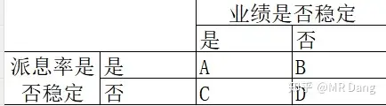
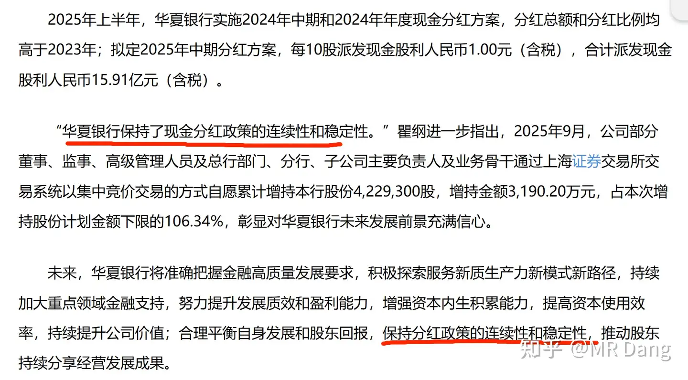
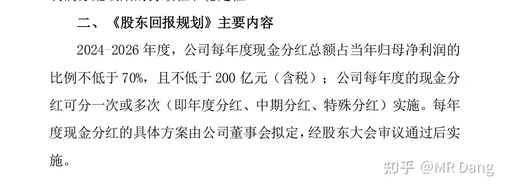

# 你是怎么计算股息率的？ 关注股息率的哪些点？

---

**发布时间**: 2025-10-31 07:48  |  **原文链接**: https://www.zhihu.com/question/661876133/answer/1967498106942755743  |  **点赞数**: 391 人赞同

**作者信息**: MR Dang独立投资人，全网无其他平台，无小号无私域，不接广不卖课

---

## 正文内容

本文较为新手向，但是鉴于经常碰到此类问题，就手把手的教大家如何测算股息率。

全网独家秘笈，再也找不到第二家。

第一步：分类讨论

先纠正大家一个观点啊，我们要算的是预期股息率，而不是什么过去的股息率。

过去的股息率有什么用啊？已经分出去的钱和你有什么关系么？

凡是让你看去年分了多少，然后➗股价的，统统拉黑，纯纯误人子弟哈。

在测算预期股息率的时候，先把公司分类一下：

这里有个词叫派息率，什么意思呢?公司挣了100块，分给股东30块，就是30%派息率。

和股息率不是一个概念，股息率是你花了100块买股票，每年公司给你5块分红，5%股息率。

我建议大家搞价值投资的时候，最好买A类企业，如果便宜，也可以买B类和C类，但是尽量不要买D类企业。

A类企业代表：银行，公用事业（水电，气，部分油），电信，铁路（大秦铁路），茅台等。

B类企业代表：海运，除茅台外白酒消费，煤，有色，化工等。

C类企业代表：火电，部分油，水务，燃气，纺织，家电，高铁等。

D类企业代表：投资新手不要碰，怕你把握不住。

这些划分不是绝对的，是实时变化的。

通常A类的平均股息率会低一些，因为确定性强。

B和C类的平均股息率会高一些，因为确定性不够，要用股息率作为补偿。

如果你发现一个A类企业，股息率还高，请不要犹豫，先买了再说。

第二步：测算基准

A类：算出最近两年的平均派息率并测算业绩。

以ZSYH为例:2023年33.92%，2024年33.99%。平均大约33.95%

业绩你预测不了就按照前三季度来，同比基本没变，那你预测去年的5.66没大的毛病，今年银行整体差一些，你再留个余量，按照5.6算就行了。

5.6*0.3395=1.9

1.9/41.2=4.61%

B类：

以ZYHK为例：2023年49.74%，2024年49.4%，平均大约49.6%。

业绩你自己不要算了，普通投资者总不能天天盯着SCFI和油价算业绩，前三季度1.74，ZYHK一般第四季度业绩都一般，随便猜一个数字，按照0.3算就行，全年2.04

2.04*0.496=1.01

1.01/14.88=6.8%

（所以经常有新来的投资者问说ZYHK10%的股息率能不能买，其实根本达不到的哈）

C类：

以HDGJ为例：2023年33.93%，2024年39.21%，平均大约36.57%

业绩一致性预期是0.6

0.6*0.3657=0.22

0.22/5.53=4%

第三步：行业基准纠正

如果你把前两步轻松的完成了，此时你已经是一个合格的会计了，恭喜你算出了预期基准股息率。

但是距离价值投资者还差一步，就是第三步的行业基准纠正，这是精髓所在。

怎么纠正呢？

你有没有发现第二部的计算原理基本上是一致的，那分类的意义是什么呢？

就是为了分类去纠正算出来的基准。

A类：

A类企业为什么分红稳定？

因为它盈利能力稳，处于成熟期，又有健全的制度。

每年就是赚钱，然后开会，然后分红，惯性很强。

所以一般不需要纠正，除非有外力。

比如考核目标，比如管理层表态。

你需要去揣摩管理层公开的文字表达。

比如我重点跟踪的HXYH:

大家体会一下什么叫提高分红水平，什么叫保持连续性和稳定性？

2022年每股0.383，2023年每股0.384，2024年每股0.405，2025年应该分多少呢？

你算出来如果低于0.4，它会合理么？

所以这种情况就需要纠正。

B类：

B类企业派息率稳定，但是为什么业绩不稳定？

说明公司治理非常现代化，利润的现金流很充足，但是所在的行业周期性太强。

这类企业有个特点，他会有周期焦虑。

什么意思呢，就是如果业绩不好的时候分50%，突然有一年大周期来了，他的派息率大概率是低于50%的，公司会倾向于屯一些现金，到周期底部的时候释放分红，平滑周期波动。

你在上面测算的基础上，就要根据周期情况进行合理的基准纠正，周期顶部的时候下调一点派息率，周期底部反而可以上调一点预期。

当然这只是一种经验，具体标的还要具体分析。

C类：

C类企业业绩稳定，为什么分红不稳定？这类企业一般会根据需要有大额资本开支，比如要建设新的产能，或者提前囤积原料，或者并购，或者投资。

你如果在公告里看见它又要收购XX，又要在XX哪里巨额投资，那你就要下调派息比例了。

相反，如果它天降横财，出售了XX业务，或者把持有XX股票处理了，那大概率就要分红了，可以适当上调派息比例。

第四步：大股东需求纠正

第三步完了之后，还需要考虑大股东的诉求。因为大股东的诉求重要性更高，所以放在第四步，去纠正第三步的结果。

如果大股东急需用钱，但是又没有减持股票，很可能通过加大派息率来达到目的。

比如这次NSLY就是如此。

有些股东不是大股东，但是属于重要的财务投资者，在投资的时候和大股东或者公司都是有约定的，也要提高派息率的预期。

第五步：公告纠正

这步的确定性是最高的，很多公司为了安抚投资者，推出了很多提振派息的公告，所以放在最后一步进行纠正。

比如酒企WLY:

每年派息率不低于70%且不低于200亿。

若业绩低于7.36，则每股派息≥5.15

若业绩高于7.36，则每股派息≥业绩*0.7

5.15/118=4.4%

WLY最低股息率4.4%

另外多说一句，WLY的商业模式和行业前景在酒企里还是可以的，帐上的现金很多，现在三季度业绩不佳，但是可以蹲一个困境反转的机会，价格合适还是值得入手的，价值投资就是在保证价值的情况下人弃我取。

一个喜欢保护韭菜的博主，希望大家少踩坑，多赚钱。

---

## 精选评论

> [!comment]- 点击展开评论

| 用户 | 时间 | 内容 |
| :--- | :--- | :--- |
| 心态要好 |  | 早起床第一件事先扒dang老师帖子 |
| Razor |  | 看成了扒dang老师裤子 |
| 陈小刀 |  | 大佬，只要符合业绩稳定➕派息稳定，就是a类嘛？ |
| &nbsp;&nbsp;&nbsp;&nbsp;MR Dang |  | 涨多了，股息率就下来了，就继续换股息率高的，永远保持自己手里的标的是高股息率的 |
| &nbsp;&nbsp;&nbsp;&nbsp;MR Dang |  | 挣多少分多少，挺大方的，就怕挣不来，而且现在不到3%，有点低了 |
| 如来熊掌 |  | 大佬是教真东西啊 |
| 二旬小堡包 |  | 大佬我爱你每天等你更新 |
| 达也 |  | 懂了，今天尾盘已经下单招商银行 |
| 唐小命儿 |  | 非常佩服，把错综复杂的事情抽丝剥茧直达一个清晰明确的本质 |
| 木向阳 |  | 又增加了几个自选，多谢Dang总。 |
| &nbsp;&nbsp;&nbsp;&nbsp;MR Dang |  | 我在举例子呢，你搁这淘宝呢 |
| 啊吧啊吧888 |  | 大佬早您对小白来说真是圣人级别的 |
| &nbsp;&nbsp;&nbsp;&nbsp;MR Dang |  | 我也没说自己厉害啊，你怎么看出来的 |
| Jelly52020 |  | 感谢大佬分享。 同时想请教一下，思维列控这种派息率100%，盈利也很稳定的公司，是不是就可以归于A类了呢？ 派息率100%意思是公司所有盈利全部分红了吗？ |
| saintluffy |  | 大师，ghny这种股息过10%的，合理吗 |
| &nbsp;&nbsp;&nbsp;&nbsp;MR Dang |  | 那是去年的，今年煤炭这么差，4%都够呛 |
| saintluffy |  | 谢谢赐教 |

---

*本文件由自动脚本从MR Dang知乎页面提取生成*

---

**作者**: MR Dang
**链接**: https://www.zhihu.com/question/661876133/answer/1967498106942755743
**来源**: 知乎

*著作权归作者所有。商业转载请联系作者获得授权，非商业转载请注明出处。*

## 相关阅读

**📘 投资方法教育：**
- [[20251020-交易策略只是第一步，重要的是仓位管理？如何科学设置仓位？]] - 仓位控制的实操指南
- [[20251026-如何对企业进行估值？]] - 估值方法详解
- [[20251106-怎么投资银行股，并获取银行股股息收入？]] - 银行股投资指南

**📘 基础功法：**
- [[20251022-《地阶功法卷一》投资者必须斩杀的三个妄念]] - 投资思维基础
- [[20251023-《地阶功法卷二》价值投资三大误区]] - 价值投资进阶

**📘 风险控制与心态：**
- [[20251013-什么是投资思维？普通散户该如何培养？]] - 投资思维与平方差魔咒
- [[20251103-高学历的人炒股，痛苦的根源是什么？]] - 投资心理分析

**🔙 返回：**
- [[投资方法教育]] - 投资方法教育全部内容
