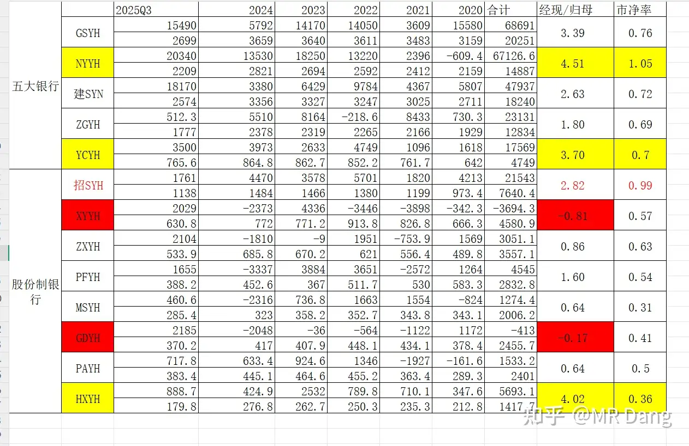
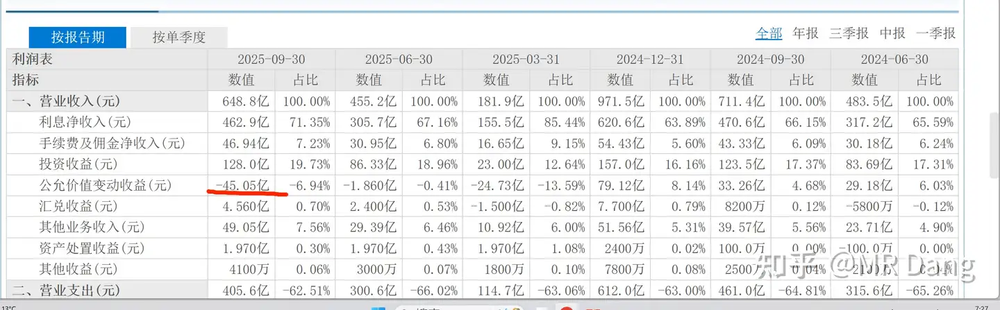
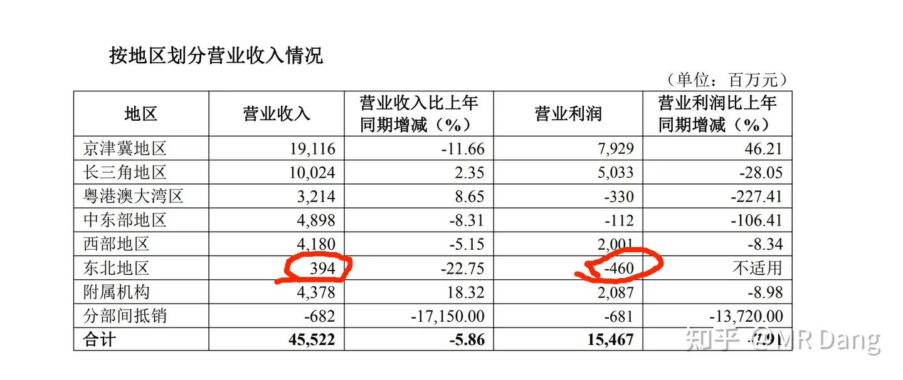

# 怎么投资银行股，并获取银行股股息收入？

---

**发布时间**: 2025-11-06 08:02  |  **原文链接**: https://www.zhihu.com/question/38172396/answer/1969675934178193822  |  **点赞数**: 441 人赞同

**作者信息**: MR Dang独立投资人，全网无其他平台，无小号无私域，不接广不卖课

---

## 正文内容

前置功法：

《商业银行学》

《货币金融学》

《货币商人》

《朱镕基讲话实录》

银行股是我投资时间最久，赚的最多的行业。

之前在知乎上全是安利银行股，因为这玩意儿是真的稳，真的赚啊。

其他平台的大V我也都看过，不外乎这几种流派：

1.增速派：

增速派的派义主旨是唯增速论，就是你别管贵不贵，你就说增速高不高，高那就买。

他们会构建一个经典场景，比如A银行5倍PE，5%增速，同时另一个B银行，15倍PE，15%增速。

增速派的理论是：

假设第一年，这个估值是市场选择的，合理的。

那么第二年，这个估值也应当是合理的。

同时，这一年时间过去，A银行又增长了5%，B银行又增长了15%，那么在估值不变的情况下，B银行就取得了10%的超额收益。

明年，如果再这么过一年，B银行又取得了10%的超额收益。

同时第三年这个时候有新的投资者想继续买银行股，摆在他面前的依然是5倍PE的A银行，和15倍PE的B银行。（这个时候第一年买B银行的已经取得了20%的超额收益了）

也就是说，尽管5PE和15PE有很大的估值差距，但是也应当选那个15PE的高增速银行，而不是 5PE的低估值银行。

这就是唯增速派的核心教义。

唯增速派的代表是NBYH，很长一段时间以来，由于NBYH的高增速神话，诞生了很多该理论的拥趸，实际上NBYH确实也是一家优秀的银行。

直到NBYH增速变缓，这些长期投资NBYH的投资者都取得了巨大的成功。

即使时至今日，该流派也是投资银行的主流教派之一。

但是该投资方法的缺陷在于，在经济上行期，房地产上行周期，高增速的可持续性强，确定性强。

而现在的经济周期和之前有了明显的区别，预测增速变的困难了。

当然这不影响个别投资者的成功预测。

但是一旦预测增速变得困难，共识的形成就变得脆弱，会发生另一种现象——即使某家银行短时期内保持了高增速，但是却没有相应的估值，如果买入时估值过高，依然无法获得收益。

从而不能仅以增速论英雄，还要综合估值进行选择。

2.零售派：

零售派投资者非常强调零售对于银行的意义，所谓零售就是面向个人和小微企业的业务，包括私行业务。

这部分业务由于市场广阔，盈利能力强，不良率低，抗风险能力强，而成为争相争抢的香饽饽（其实就是抢生产资料，说腻了这块儿，不展开了）

零售派的核心思想，就是你别看增速高不高，就看零售业务怎么样，增速高有什么用？过去的增速高就等于未来的增速高么？只有零售才是银行的未来，谁零售做的好，谁就是THE KING OF BANK。

非息收入是零售派关注的重点指标，非常强调非息收入的重要性。

零售派是对增速派的补充和发展，自认为找到了增速的第一性原理。

零售派的代表银行就是高净值服务这块儿做的最好的ZSYH，也曾风光无限，这几年吃了一段时间的土后声浪小了下来。

3.规模派

在年龄比较大的投资者里比较盛行。

规模派又分为大派和小派。

大派就是大就是好，好就是大，谁大买谁，最稳。

小派就是小的增速高，潜力大，谁小买谁，搏弹性。

不予评价哈，怕得罪人。

4.财报派

目前来说，算是价投里的共识，其专业水平和系统化的方法吊打以上三个派别的.

NPL Ratio,PCR,ROE,CIR，各种数据框框一顿整理。

因为不存在完美的银行，拨备和利润是跷跷板，拨备多了，利润就少了。

所以这类价投通常有自己的话术理论：

空仓的时候怎么办，就说这叫盈利能力下滑严重；

满仓满融的时候怎么办，就说这叫隐藏利润，平滑周期。

银行股好不好，不取决于银行，而取决于发表观点的人的仓位。

当然，不只是因为数据具有不同的解读方向。

更重要的是，我话说白了，你别说市值几万亿的大行了。

给我个20个人的小网点，让我当行长，让我干三年，我能把这个小网点的真实经营情况搞懂都算我是金融天才。

银行是什么？

银行是你小学做的数学题里的一边放水一边又漏水的疯狂的蓄水池。

还房贷的人都不知道自己哪天就坚持不下去就还不了月供了，你一个看报表的还预测上了。

存银行的人也不知道哪天自己就要急用钱取钱了，你一个看报表的还给储户安排上了。

银行的财报真不真，大家心理要有杆秤啊。

就那个不良率来说，2025的金监局新规，逾期90天以上贷款统统算不良。

有些银行，不良贷款偏离度也就那么60%多一点，有的不良贷款偏离度140%。

这些财报派的，也不知道到底是不懂什么叫不良贷款偏离度，还是他自己懂但是欺负散户不懂，框框一顿不良率对比，还显得专业的不行。

由于不良贷款偏离度的差异，1%的不良率和1%的不良率的真实不良比例能差出去200%，有什么好对比的呢？

不良率本身就是有差异的，在不良率的基础上出来的不良贷款迁徙率又怎么能作为决策依据？

一笔贷款，逾期了，连不良都没进去，你给我谈什么迁徙？

有人要问了，那银行的资产负债如此不透明，要怎么投资才好呢？

我的投资方法给大家简单的说一下，我这个好学，不需要你去一个个不知道真假的财报里吭哧吭哧翻那些数据。

我的核心理论就是，银行都是长的差不多的盲盒，你买银行股就是开盲盒。

那么要提升开盲盒的几率，就不要去盯着财报数据看，而是盯着盲盒里偶尔漏出的可以看见的东西去开盲盒，暂且叫做盲盒可视化理论。

银行是所有行业里同质化最严重的行业。

最差的银行和最好的银行，商业模式一摸一样，就是赚差价。

最多就是一个服务好一点，一个服务差一点，但绝对不是那种2求商业模式对1求商业模式的降维打击。

再好的银行也是1求的商业模式，一边求着储户存钱，另一边求着客户还钱，儿子中的孝子，孙子中的王八。

既然不是商业模式的降维打击，那就可以坐在一起对比估值。

盲盒解释完了，再来解释可视化。

所谓可视化，就是你能看到的部分，对你开盲盒的胜率至关重要。

把不好的绝对开不出SSR的剔除掉，剩下的开出金色传说的概率就蹭蹭的涨。

哪些是普通人可以看明白的部分呢？

我觉得主要是以下几点：

1.股息

银行股，股息一定一定要放在最重要的位置。股息是实实在在拿到手里的，银行赚了多少钱，你说不好，那是分给你多少钱，这个是能看得到的，做不了假。

普通人买银行股就是为了高股息，你要是买增长，银行顶破天也就15%的增速，10%增速也是人上人，5%增速都相当不错。

外面比这个高的我能找到上千家公司，为什么要买银行股？

股息不是唯一的选择标准，高股息的未必都能买，但是低股息的一定要排除。

银行股股息低，就像水杯漏水，足球漏气，电视没声音，手机没信号，买了也是糟心。

2.地域

投资银行股，特别是城商行，区域性银行。

一定要看地域。

人口流出的地方，房价就会跌，房价跌了银行就会坏账，那你就不要碰。

而有些地方，就是经济活力强，比如江苏，有JSYH，有NJYH，有JYYH，闭着眼睛买它都不会出大问题。

财报是滞后的，是混沌的，可以看，但是不要全信。

明明银行大本营，资源枯竭，人口流出，房价腰斩，但是财报上光鲜亮丽，不良率和拨备也好看的不行，这个可信度大家自己想有几成。

房价跌的最多的地方，直接排除。

3.经营性现金流/归母净利润

这个指标我愿称之为和市净率配合使用的最佳指标。

其原理就是，银行股的净资产来自于经营成果，而经营成果的最直观的体现就是经营性净现金流，和市净率搭配使用，效果奇佳：

五大行里，NYYH的经现流最好，也是所有大行里的TOP1。

应该有最高的市净率，ZGYH的经现流最差，应该估值最低，目前都是符合的。

如果说想买五大行里低估的，那现在YCYH性价比最高，经现流比GSYH好，估值比GSYH低，可以考虑。

股份行里，ZSYH不太适用这个指标，原因是ZSYH的非息收入占比大，毛利高，盈利能力太强。

XYYH和GDYH直接排除，2020年后的经现流是负的，你不要去追问原因，有这么多银行可以买，非要买这种经现流有问题的，纯粹是想不开。

HXYH这个指标在图中的股份制银行里是最好的，且估值还很低，值搏率极高。

当然这个图只是介绍下简单的方法和原理，具体操作的时候，你可以把利息收入和非息收入分开，这样ZSYH的价值就会体现，同时年限可以做的再长一些，最好累计起来可以覆盖净资产。

比如我图中的GSYH利润加起来是两万多亿，目前的GSYH的净资产有接近4万亿，相当于追朔了50%左右的净资产积累时相对应的经营现金流。

一般的银行大概从2015年追朔就差不多了。

同时可以看出经营性现金流随着经营策略的变化很剧烈，所以看一两年的没啥用，必须要长时间观察，抵消中间的调整空间，看大方向。

这么做的目的就是保证你买入的时候，那个财报上的净资产有配套的相对应的现金流，保证你买的放心，拿的安心。

相关标的：

通过初筛后，我个人选择HXYH，优势是什么？

便宜，股息率高，且净资产有现金流作为支撑，有保障，确定性高。

有多便宜呢？

以PB而论，目前的估值水平是0.36，30分位值是0.38。

目前的估值是20分位值，低于历史上80%的时间。

这就叫一眼知胖瘦，就像古玩界看古玩一样，大开门。

同时，预期股息率还高，接近6%，是目前A股银行股里最高的。

除此之外，还有什么理由呢？

预期差

1.净息差率先企稳。2025年银行整体的净息差是处于下行通道的，目前三季报后，净息差逆势企稳的银行并不多，也就JYYH，HXYH，MSYH，RFYH等四五家而已。

HXYH中报时的净息差净利差：

三季报时的净息差净利差：

所谓春江水暖鸭先知，净息差净利差企稳对银行来说是一个非常重要的信号。

2.今年债券业务拖累导致基数低。

HXYH今年的数据不会好看，因为今年的债券类的非息收入做的不好。

但是这种情况不会一直持续，如果明年这部分业务做的好一点，也不需要进步，只要不亏就是增长。

3.个别地区业务出清，轻装上阵。

HXYH在个别地区的业务一团糟，但是目前持续出清，营收基本上占比很小了，以后彻底切割后，轻装上阵，不良方面的压力就会小得多。

所以。。。。区域性银行，一定要看地方，人口流出的地区，千万不能买。

总结一下吧，我买银行股的投资逻辑就是四个字"瞻前顾后"。

瞻前：就是追朔银行股积累净资产时配套的经营性现金流以及目前对净资产的估值，找到低估的标的。

顾后：就是银行业务的边际改善信号和预期差，以及最重要的，股息率。

我上次发现如此低估的银行是2017年时候的南京银行，这是第二次发现如此完美的投资机会。

如果以0.5PB为合理估值：假设5年后到达这个估值且5年0增长。

现在每股净资产19.4，每年按照1.6元测算，0.4元股息，则净资产增加1.2元。

5年后净资产=19.4+1.2*5=25.4元

相应的估值=25.4*0.5=12.7元

年均复合收益率=13%

每年股息率=5.7%

综合下来年化接近19%

这还没算超预期的增长或者短时间内的价值发现，属于那种躺着躺着就赢了的机会。

风险提示：

1.买YH股要做好坐牢的心理准备，对散户来说最大的难关是和心魔作斗争。

2.若增长乏力，或行业竞争加剧，有衰退的风险。

3.控制仓位，若对单一银行无把握，可以购买银行ETF作为替代，但是不要买我标红的那些银行。

---

## 精选评论

> [!comment]- 点击展开评论
>
>
> | 用户 | 时间 | 内容 |
> | :--- | :--- | :--- |
> | 淮南 |  | 跟着大佬买，跌了也高兴，能加仓，涨了也高兴，能挣钱，放着不管还能吃股息 |
> | &nbsp;&nbsp;&nbsp;&nbsp;MR Dang |  | 还是你会想问题 |
> | forward |  | 大佬 btgf被你奶涨停了 |
> | 雷叔叔 |  | 跟着大佬已经几个涨停了，NSLY,BTGF, |
> | 一念 |  | 大神，前些天讲了磷化工，今天直接涨幅第一。这种天机说透露给我们就透露了，大爱啊 |
> | 嫟名用户 |  | 昨天芭田出完了，没买回来 |
> | 雷叔叔 |  | 更早该说了铝业，可惜前几天涨停后走了，今天又涨停了， |
> | Bboy小宇 |  | 大佬，我现在严重怀疑你为了涨粉自己拉的你推荐的票。 |
> | 寄居蟹 |  | 是的，老师是主力，跟着老师吃肉。 |
> | 化石的岁月 |  | 还真是，瞬间感觉银行股也有涨停的可能了。 |
> | 愚蠢的M |  | 老师是主力，懂？ |
> | 鹦鹉和猫 |  | 你就是我爸爸！持有南山，芭田，云天化，今天都涨停了！大神！收下我的膝盖！ |
> | &nbsp;&nbsp;&nbsp;&nbsp;MR Dang |  | 你还挺会挑 |
> | 星辰 |  | 出了吗？还是继续持有 |
> | 轻度失语 |  | 今天把一部分银行理财赎回了，入手了HX YH，老师文章数据翔实，逻辑清晰，饭煮好了喂到嘴边，我咋能不吃 |
> | 轻度失语 |  | 老师，今天HX我又加了一成仓，挂单6.92成交，打算买够80万，扔着不管了 |
> | &nbsp;&nbsp;&nbsp;&nbsp;MR Dang |  | 一年四万多到手，安逸了 |
> | crush |  | 赚够钱就找大佬氪金! |

---

*本文件由自动脚本从MR Dang知乎页面提取生成*

---

**作者**: MR Dang
**链接**: https://www.zhihu.com/question/38172396/answer/1969675934178193822
**来源**: 知乎

*著作权归作者所有。商业转载请联系作者获得授权，非商业转载请注明出处。*

## 相关阅读

**📘 投资方法教育：**
- [[20251026-如何对企业进行估值？]] - 估值方法详解
- [[20251031-你是怎么计算股息率的？ 关注股息率的哪些点？]] - 股息率计算方法
- [[20251020-交易策略只是第一步，重要的是仓位管理？如何科学设置仓位？]] - 仓位控制的实操指南

**📘 投资心态与观念：**
- [[20251013-什么是投资思维？普通散户该如何培养？]] - 投资思维与平方差魔咒
- [[20251103-高学历的人炒股，痛苦的根源是什么？]] - 投资心理分析

**📘 基础功法：**
- [[20251022-《地阶功法卷一》投资者必须斩杀的三个妄念]] - 投资思维基础
- [[20251023-《地阶功法卷二》价值投资三大误区]] - 价值投资进阶

**📘 其他相关文章：**
- [[20251118-请通俗易懂的解释下前复权，不复权和后复权有什么区别？]] - 复权知识详解

**🔙 返回：**
- [[投资方法教育]] - 投资方法教育全部内容