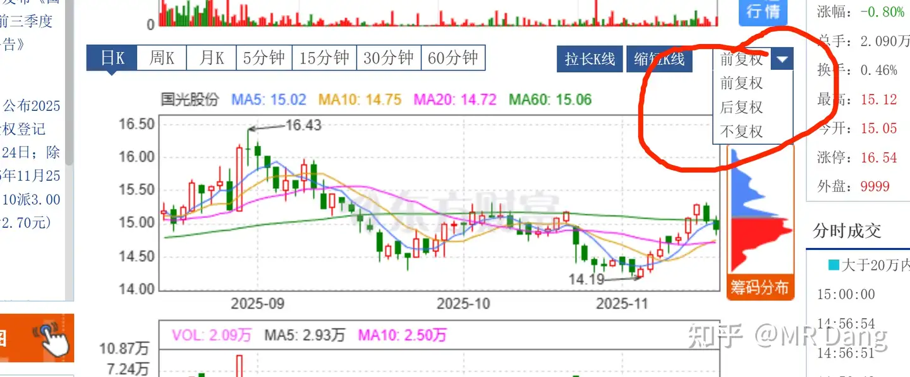
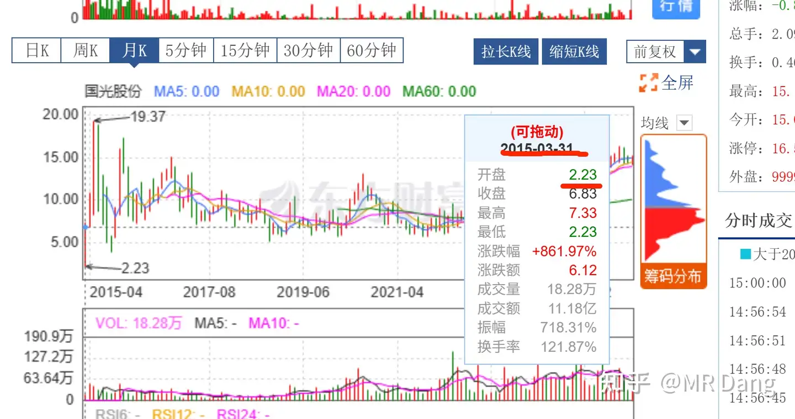
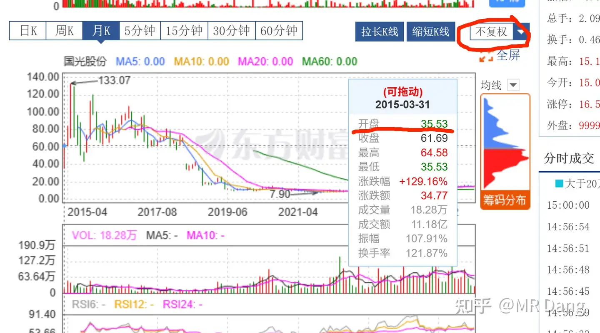

# 请通俗易懂的解释下前复权，不复权和后复权有什么区别？

---

**发布时间**: 2025-11-18 07:28  |  **原文链接**: https://www.zhihu.com/question/31004373/answer/1974016096085483788  |  **点赞数**: 394 人赞同

**作者信息**: MR Dang​独立投资人，不接广不卖课

---

## 正文内容

正好看到GGGF的分红公告了，10派3，11月24日登记，11月25日派息。

拿了没几天就碰到派息了，想想还有些小激动呢。

借着这个话题，谈一个新手投资者特别容易踩的坑：

分红要除权，分红前后的账户市值不变，那么分红的意义是什么？

这个问题，你如果想不明白

这个弯，你如果拐不过来。

那么此生就止步价值投资的门外了，筑基无望，再无证得大道的可能性。

因为一旦你相信分红无用论，甚至会产生出另一个更加疯狂的想法：

既然分红要除权，甚至持股时间短还要扣税，那我为什么不在分红前赶紧把股票卖掉？

这就是经典的散户逃权思维。

如果不是亲耳所听，亲眼所见，作为一个吃息佬，我是完全GET不到这些点的。

当然我不是抨击这些观念，谁都有经历过萌新的时候。

但是这些观点会动摇你对价值投资这件事的信仰，我可以试着说服你。

首先我可以给你举例子。

当你怀疑分红是否真的有用的时候，你可以找一个极端的例子去印证。

也就是假设一个股，股价只有两三块，然后分红一块钱，甚至还扣你两毛的税，会发生什么？

会不会分红没用呢？扣税影不影响最后的收益率呢？

你说会有这样的股么？

有的，兄弟，有的。

在港股市场有个01114，大家可以去看历年的分红政策和股价走势。

只要你买的够早，几年就把成本全部分回来还有的赚，股票都是白送的。

当然我只买过一点点，所以也没赚什么大钱。

事实摆在这里，除非股价允许变成负数，否则分红就是有百利而无一害。

目前所有的银行股，你只要拿的时间够长。最后的成本都会变成负数，早晚而已。

而你之所以觉得分红鸡肋，主要是几个原因：

1.本金太少了，股息率就算高到6%，也会觉得获得感低。

2.买的股票股息率太低了，只有1%或者2%这样子，获得感低。

3.操作太频繁了，持股周期短，分红扣税感到痛苦。

只要你降低操作频率，想办法增加本金，长期持有高股息率的标的，比如银行股，就可以提高分红的绝对值。

当你分红的绝对值够高的时候，就会有获得感，从而增加对价值投资的信心，比如这样子：

其次我可以给你讲道理。

除权是因为股票分红以后内在价值降低了，所以要用价格进行标记提醒投资者。

你可以理解成，公司创造价值的过程就是每天一点一滴的往杯子里倒水。

分红就是在经过了一年的努力后，让投资者饮用杯子里的水。

除权就是投资者喝了水以后，做个标记，告诉所有人，杯子里的水少了。

这种事情于情于理都是应该的，不然对后面的投资者不公平，你不能偷偷喝水啊。

但是事实上投资者是很健忘的，买入的时候不会把之前的分红纳入决策过程。

比如一个不冷的知识是其实dsl才分过红，但是现在交易的投资者会把这次两个星期前的分红纳入决策范围内么？

投资者应该考虑的是：

1.公司往杯子里倒水的速度如何？（创造利润的能力）

2.公司允许你多久喝一次水？一次喝多少水？（分红的力度）

你是价值投资者，你的诉求是酣畅淋漓的喝水。

你如果纠结于：

哎呀，你看，喝水以后，这个水杯的价格都便宜了，我卖不出好价了。

那就属于一叶障目了。

一旦钻到这个牛角尖里，就像陷入到芝诺悖论里一样，再也出不来了。

回到一开始的问题：

1.分红的意义是什么？

分红的意义就是可以稳定的有水喝。

2.那我为什么不在分红前赶紧把股票卖掉？

因为我要的是喝水，而不是卖水杯。

有关除权：

一般什么情况下除权呢？

分红和送股。

怎么除权呢？

A.分红就是直接减。

比如15块的股，10派3，相当于一股是0.3，那就15-0.3=14.7，分红后价格直接变成14.7元

B.送股就是直接除。

比如15块的股，10送10，相当于1股变两股，除权后就是15/2=7.5元

C.稍微难一点的是分红+送股。

比如10送10派3,那就先减后除。

15块的股，先减去0.3，股价14.7，再除2

14.7/2=7.35

当然你也不用学这些东西，一般各种软件会给出计算结果，你只需要会看复权图就行了。

那什么是复权呢？

就是把上面例子里的股票从7.35还原到15块的过程。

复权图又分为前复权，和后复权。

前复权的意思是，以现在的股价为基准，对之前的走势进行复权。

比如对GGGF进行前复权，则上市时的开盘价为2.23

而实际上，不复权的时候，这个价格是：35.53

所以不复权的话，容易得出GGGF上市几年，股价不涨反跌的错误结论。

那么，可不可以理解成GGGF从上市到现在，就是股价从2.23涨到了现在的15块呢？

涨了接近6倍？？

不可以！！！

这是一个易错点。

不可以！！！！

要看实际的收益情况，一定要看后复权！！！！

所谓后复权，就是以上市的价格为基准价，然后进行复权的过程。

按照后复权，GGGF上市的开盘价35到现在的105左右，大概涨了200%左右。

这个是比较真实的收益情况。

看不懂？

没关系，记住一点，要看真实收益情况，看后复权！

不过实际上，如果股息复投的话，实际的收益情况会远远大于后复权的收益，这又是另一个话题了。

ok，理解了这些。

我最后再说一次我的止盈逻辑。

我的每一次止盈，都是为了更高的股息率。

也就是说，我的初心一直是为了喝水。

永远在寻找当前情况下预期股息率最高的配置。

我买的东西短时期内涨了30%一定会导致股息率明显下降。

这个时候再切换到股息率高的东西，预期股息就会进一步增加，把雪球滚起来。

我不会去预测止盈标的是否见顶，事实上我也预测不了。

但是我会保证我到手的现金回报一定是当前市场情况下的最优解之一。

因为我是一个爱喝水的投资者。

一个喜欢保护韭菜的博主，希望大家少少踩坑，多多赚钱。

---

## 精选评论

| 用户 | 时间 | 内容 |
| :--- | :--- | :--- |
| 落霞与长天一色 |  | DANG佬，是不是可以理解为金蛋和鹅的故事，分红就是等鹅下一个一个下金蛋，鹅下完蛋后重量会减轻，类似股价下降。而止盈就是鹅短期内重量长得高，但是下的蛋质量不高了，卖鹅比等下蛋更贵 |
| &nbsp;&nbsp;&nbsp;&nbsp;MR Dang |  | 筑基了 |
| 在齐太史简 |  | 记住了！七点半！ |
| &nbsp;&nbsp;&nbsp;&nbsp;MR Dang |  | 这么机智 |
| 李二麻子 |  | 今天终于有点熟悉大A的感觉来了， |
| 晨风 |  | 党老师，早上好！我浆糊脑子看不懂，就知道听党的话，跟党走！ |
| &nbsp;&nbsp;&nbsp;&nbsp;MR Dang |  | 还是要自己搞明白的 |
| 晨风 |  | 好的，老师，晚上回去慢慢看，好好学，尽量搞懂。 |
| 肥仔 |  | 平时点个奶茶都嫌贵，但是股票连跌内心却没有什么波澜 |
| 晨风 |  | 生活里缝缝补补，股市里挥金如土。 |
| 叶梅梢雪 |  | 真相了。知音。 |
| 北海 |  | Dang大，我目前是这么配置的，可以给个建议吗。hxyh 50%，gg 20%  ，bf 20% ，zhkj 10% |
| &nbsp;&nbsp;&nbsp;&nbsp;MR Dang |  | zh多了，在另外两个也多了，都减5%买一个别的 |
| 矿泉胡桃 |  | 老师，像bfny这种，波动上涨的过程中你会做波段不？后悔没有高位减低位加，这种心态怎么破 |
| &nbsp;&nbsp;&nbsp;&nbsp;MR Dang |  | 不低了啊，预期有5%的 |
| &nbsp;&nbsp;&nbsp;&nbsp;MR Dang |  | 被毒打次数多了就不为所动了 |
| 江東東 |  | dang哥，zhkj还拿着吗 |
| &nbsp;&nbsp;&nbsp;&nbsp;MR Dang |  | 我是要拿着等四季报的 |
| 长风万里 |  | 老师早，通过您懂得文章，搞懂了什么是前复权和后复权 |

---

*本文件由自动脚本从MR Dang知乎页面提取生成*

---

**作者**: MR Dang
**链接**: https://www.zhihu.com/question/31004373/answer/1974016096085483788
**来源**: 知乎

*著作权归作者所有。商业转载请联系作者获得授权，非商业转载请注明出处。*