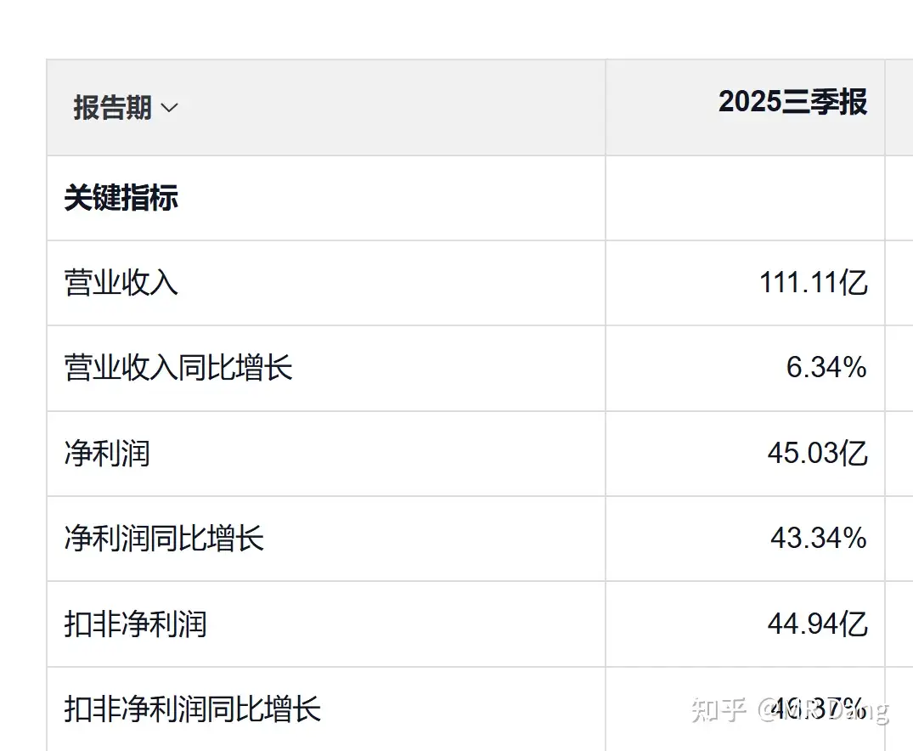
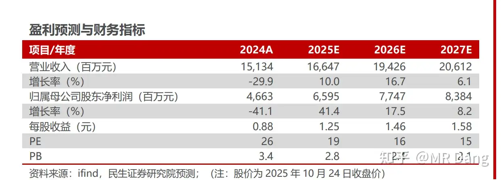
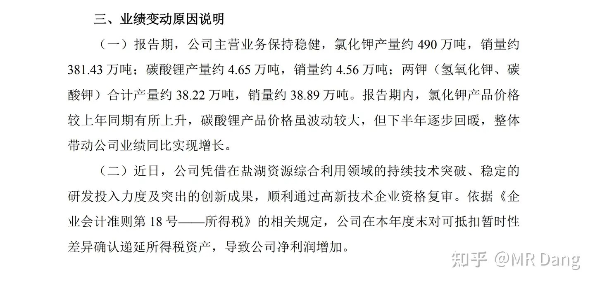
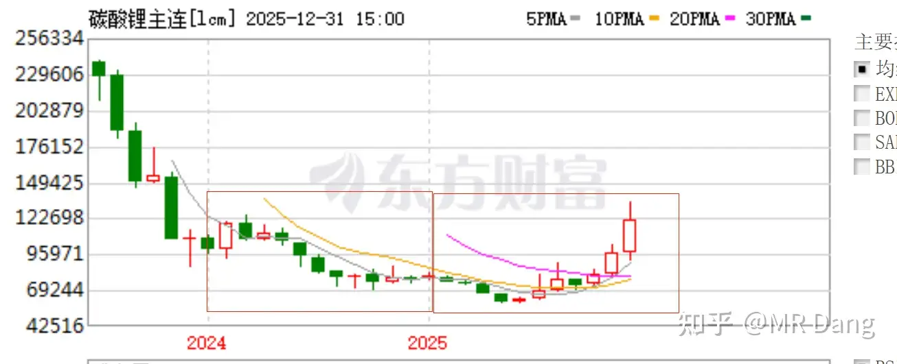

# 如何看待盐湖股份2025年业绩预报？以此为例，我们该如何分析上市公司公告？

---

**发布时间**: 2026-01-02 07:32  |  **原文链接**: https://www.zhihu.com/question/1990103101387057023/answer/1990324476529881405  |  **点赞数**: 999 人赞同

**作者信息**: MR Dang​独立投资人，不接广不卖课

---

## 正文内容

新年首答送给你了。

分析公告是一个很有技术含量的活，同样是看公告，有的投资者看到的是纤毫毕现，有的投资者看的是稀里糊涂。

这其中的区别有如云泥之差，落实到行动上更是南辕北辙。

总的来说，分析上市公司的公告，分为三大步：

第一步，发生了什么？

第二步，可能的原因是什么？

第三步，后续的影响以及市场的解读。

以某湖股份的公告为例：

第一步，发生了什么：

发了一份业绩预告，最重要的几个数字：

归母净利润增长77%——90%左右，82.9亿-88.9亿之间。

扣非净利润增长87%——100%左右，82.3亿-88.3亿之间。

基本每股收益1.56-1.69之间。

以上数字是客观事实。

但是你现在不知道这些数字的含金量如何，所以需要去找一把尺子衡量它。

哪里去找这把尺子呢？

我给出两个常见的适合新手的尺子：

纵向尺子：和公司前三季度纵向对比

前三季度一共盈利45亿。

那么根据朴实无华的小学数学，倒推出第四季度一个季度的净利润是37.9-43.9亿之间，中位数40.9亿。

对比一下，前三季度45，第四季度40.9，很直观的就得到了一个重要信息：第四季度盈利能力似乎很强。

这里为什么要加个似乎？

因为很多企业存在结算节奏的问题，净利润在四个季度不是均匀分布的，很可能99%的净利润都由第四季度贡献，常见的就是地产行业。

所以我们还需要另一把尺子。

横向尺子：和各家研报的业绩预期横向对比

研报的挑选尽量要时间距离近一点。

现在的时间点是三季报以后，四季报之前，所以研报就要挑三季报以后出的，更能代表市场的一致性预期。

比如：

MS的研报给了66亿的预期。

GX的研报给了67亿的预期。

可见市场的一致性预期应该在65亿-70亿这个区间内，由于这个时候已经发布了三季报，因此第四季度的一致性预期是20-25亿。

结合以上两把尺子，可以给出一个基本的结论：

这份业绩预报是远超预期的，第四季度比预期多了接近20亿左右的利润，几乎是市场预期的两倍。

第二步，可能的原因是什么？

相比起第一步的简单，到了第二步，难度直线上升。

需要我们仔细分析公告中的每一句话。

“报告期，公司主营业务保持稳健，氯化钾产量约 490 万吨，销量约381.43 万吨；碳酸锂产量约 4.65 万吨，销量约 4.56 万吨；两钾（氢氧化钾、碳酸钾）合计产量约 38.22 万吨，销量约 38.89 万吨。报告期内，氯化钾产品价较上年同期有所上升，碳酸锂产品价格虽波动较大，但下半年逐步回暖，整体带动公司业绩同比实现增长”

这段话透漏了什么？

前面一句是对公司业务数量的描述。

后面一句是对公司产品价格的描述。

在前一句中，一个重要的信息是氯化钾产量490万吨，销量381万吨。

意思就是生产的产品还有超过五分之一的产品没有销售。

生产是需要成本的，销售才有利润。

潜台词是，今年的业绩还没充分释放，明年还能继续增长。

所以排除这个原因，也就是业绩超预期不是由于公司业务量的增长引起的。

在后一句中，前半句对氯化钾的价格描述是“有所上升”，这个表述从语气来说是比较保守的。

事实上，根据我对氯化钾价格追踪的结果，25年下半年特别是四季度的价格虽然较24年同期有所提升，但是整体还是比较平稳的，对业绩有一定的利好加持，但可能不是主因。

“碳酸锂产品价格虽波动较大，但下半年逐步回暖”

这个句式用了个虽然但是的结构，做过阅读理解的同学应该都知道这种句式一般是为了突出的后面的“但是”

所以碳酸锂价格的下半年逐步回暖就是造成业绩超预期的主要原因。。。。。

了么？

我们冷静分析一下的话：

以碳酸锂的月K，即使2025年四季度走势强劲，相比2024年的均价，2025年高不了多少。

对第四季业绩即使有提振，但是全年4.5万吨的销量已经把提升业绩的上线锁定了，不可能会造成超预期的近20亿的影响。

随便算一下，4.5万吨，前三季度3.1万吨，第四季度销量1.4万吨。

就算均价提升能达到5万/吨（实际上可能也就两三万左右），按照85%优惠税率，也不过影响6亿左右净利润，距离20亿还有很长一段距离。

所以第一段话里面似乎没有揭示业绩超预期的主要原因。

我们继续往下看：

（二）近日，公司凭借在盐湖资源综合利用领域的持续技术突破、稳定的研发投入力度及突出的创新成果，顺利通过高新技术企业资格复审。依据《企业会计准则第 18 号——所得税》的相关规定，公司在本年度末对可抵扣暂时性差异确认递延所得税资产，导致公司净利润增加。

这段话什么意思？

前面说的是原因——公司通过了高新技术企业资格复审。

后面说的是影响——

时间：本年度末

会计处理：对可抵扣暂时性差异确认递延所得税资产

结果：净利润增加

这里牵扯到一个会计知识点。考CPA的时候所得税这里是重点章节，专业阶段必考内容，后面的主观题有5到10分这么一个分值。

如果单独考大题的话，还挺难的，和其他知识点结合起来考，就比较容易。

有两个会计术语:可抵扣暂时性差异和递延所得税资产。

简单的说，可抵扣暂时性差异，就是实际交的税，超过了需要交的税，中间有差距。

递延所得税资产，就是说会计要严谨，这中间的提前多交的差距，不能直接确认为资产，只有通过某些关键节点后，才可以认为你提前交的税成为了资产，这个资产就叫做递延所得税资产。

这个关键节点就是通过高新技术企业资格复审。

有人问了，为什么会提前交税呢？

其实准确的说，不是提前交税，而是以前按照规定，比如25%税率在纳。

后面通过高新认定后，只需要交15%，但是已经提前按照25%收了，那多交的钱是不会退给你的，但是允许你以后赚了钱少交这部分钱。

嗯。。。。你可以理解为购物卡多充值了，充值余额不能退，但是可以下次消费。

当然，有点绕，绕不清楚也无所谓。

你只需要知道这部分钱不是凭空产生的，而是通过减少所得税费用来影响当期利润表，从而提高净利润的就行了。

这很可能就是业绩超预期的主要原因，氯化钾和碳酸锂价格的上涨是次要原因。

考虑到这里的金额，很可能今年的财务报表里出现所得税费用为负数的情况。

第三步，后续的影响以及市场的解读

后续的影响：有点类似上次GGGF的黑天鹅事件，需要考虑的是一次性影响，还是持续影响。

已经增加的利润属于一次性的影响，这个应该是确定的。

如果按照过去三年的所得税费用算数平均值12亿进行计算，大概每年增加利润接近5亿，也是不小的一笔钱了。

市场的解读:市场的话，对这类公告的解读能力是有限的。

情绪上会更加乐观，特别是涉及所得税部分，需要一定的理解能力，不是所有资金都有这个能力的。

何况对企业未来的节税也是实打实的，氯化钾的销量释放，价格方面的预期都是有的。

以我的看法，可能目前这超预期的20亿里，15亿适用PB估值，5亿适用PE估值。

随便说个数，按照4PB，20PE估算，则对市值的影响大约在60+100=160亿左右。

但是考虑到情绪的影响，可能最后的价值中枢上移的幅度会超过这个影响。

以上只是大概的一个思路，总之看公告是一个非常重要的投资能力。

不单自己要看懂隐藏的真相，还要猜测别人能不能看懂，市场会怎么反应，利用其中的信息差去做出投资决策。

一个喜欢保护韭菜的博主，希望大家少少踩坑，多多赚钱！

---

## 精选评论

| 用户 | 时间 | 内容 |
| :--- | :--- | :--- |
| POWERFUI |  | Dang老师早外行看这个分析觉得好难啊，果然专业投资不是那么好干 |
| &nbsp;&nbsp;&nbsp;&nbsp;MR Dang |  | 公告里猫腻多，一个字一个字扣 |
| 歌知行 |  | 大佬这个是不是跟国光股份的公告恰好反了，这个是认证成了高新技术产业免税，而国光是要追缴税额国光公告一出就往下砸了一波，那这个应该也会往上抬起一波 |
| &nbsp;&nbsp;&nbsp;&nbsp;MR Dang |  | 差不多 |
| Iris |  | 老师假期也持续更新啊 感谢 |
| 唐小命儿 |  | 稀里糊涂进入股市，咋这么幸运遇上这么好的贵人！！ |
| 云海 |  | 这解读好深入，逻辑思维能力👍🏻，财务的专业水平👍🏻我就大概看了看比同期增长这么多压根没多想我这路还远着呢！啥都得动脑子 |
| 用杯子喝水 |  | 党老师真是宝藏，比专门讲cpa的老师讲的更通俗易懂，牛牛牛 |
| &nbsp;&nbsp;&nbsp;&nbsp;MR Dang |  | 以后没钱了可以去做这方面的培训挣个零花钱 |
| 勇敢者先享受世界 |  | 大佬又开玩笑了，你要是没钱了估计是股市废了 |
| 亦蓑烟雨任平生 |  | 元旦假期每天笔耕不缀，大佬成为大佬是有原因的，比你优秀的人比你还努力 |
| 神哥 |  | 这个股我7月19块入手了，后来8月涨破20卖了，看好的股票太多，但都没有耐心，赚不到大钱 |
| 停下来种地 |  | 假期也不休息，成功不是偶然 |
| 资本主义必将消亡 |  | 您这个专业性太强了，尤其是最后面还要预判很多资金能不能看得懂，看不懂的话会有什么影响。我觉得是最难的部分。被知识污染以后还能去预判到不懂的人是什么想法什么心态。 |
| 想养一只猫 |  | 被知识污染可还行 |

---

*本文件由自动脚本从MR Dang知乎页面提取生成*

---

**作者**: MR Dang
**链接**: https://www.zhihu.com/question/1990103101387057023/answer/1990324476529881405
**来源**: 知乎

*著作权归作者所有。商业转载请联系作者获得授权，非商业转载请注明出处。*