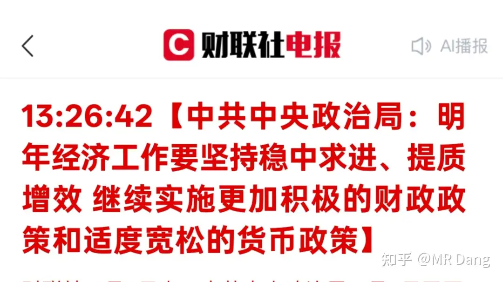

# 如何看待2025年12月9日A股行情？

---

**发布时间**: 2025-12-09 07:16  |  **原文链接**: https://www.zhihu.com/question/1981137709352386777/answer/1981623081970710339  |  **点赞数**: 617 人赞同

**作者信息**: MR Dang​独立投资人，不接广不卖课

---

## 正文内容

有件大事：

具体内容可以自行去看原文，任何转述都可能造成信息的缺失。

值得注意的是"更加积极有为"的表述。

不过我一般研究文件的时候，会关注提了什么，也会关注哪个平时会提的重要领域没有提。

有的时候没有提也是一种信息。

恩，对，还是你们想的那个。

还有一个词叫重点领域风险化解，可以找找相关表述。

昨天提到的祥源系，我的读者里居然有人中招了，我就感觉到很不可思议。

也不知道是我的读者规模太大了，还是投资太不谨慎了，每次暴雷的时候都是军书十二卷，卷卷有爷名。

对于各种理财产品，保险产品，金融产品，大家一定要搞清楚底层资产是什么。

所谓底层资产，就是钱最终的流向。

理财产品可以自身产生现金么？

不能。

不单不能产生现金，而且中间商要收过路费，管理人员要工资，还有额外的税负成本。

理财产品的底层资产要么就是债券类产品，要么就是权益类产品。

债券类产品里风险大的有ct债和企业债。

企业债里面就有房企债。

权益类产品就是股票，可能就有银行股煤炭股之类的。

如果你没搞清楚这些弯弯绕绕，最后自以为买了一堆高大上的产品，实际上买了一堆拼好债就麻烦了。

一定要问清楚底层资产，想好了再投。

或者看收益率，现在这个时间点，预期4%以上收益率的，潜在风险都不会低。

看收益率的时候，要算清楚真实收益率。

很多保险产品，它分缴款期，和受益期。

例如开始的10年里，让你只交钱，不拿钱。

从第11年开始，就可以获得年化4%的收益。

那实际上，你的真实年化收益率可能2%都没有，因为前10年你的收益是0。

自己算不明白的话，让ai帮你算。

你只要记住，所有先交钱，后获得收益，中间差距一年以上的东西，都达不到宣称的年化收益率就对了。

海关公布了最新的进出口数据：

环比数据都挺炸的，特别是进口数据，进口了很多铁和油，不单数量多，而且价格便宜，简单的说就是好又多。

出口也不差，西大掉到第三贸易伙伴了，依然有这么强的数据，还是有点出乎意料。

国际市场，没啥大的波动，我关注的公司有几件小事：

1，巴菲特的得力助手Todd离开了伯克希尔，去了摩根大通。

这哥们属于典型的华尔街精英，水平是有的，但是不如Ted。年化收益率在8%到12%之间，经常跑不过标普500。

喜欢炒作自己和巴菲特的关系，更偏向于一名顶尖销售的定位，而不是投资者，我个人对他观感一般。

2，英伟达可以给东大卖h200了，不是阉割版的h20，是h200。

这。。。国产英伟达才上市没几天，就来添堵，达子不懂事啊。

昨天的市场比我想的好，没有拿高开低走的烂剧本，成交量也比较大。

我还想着一众杂毛股里有高开太多的就扔了，没找到机会，可能有类似抢跑想法的太多了，都在预判走位。

铝王买了一点做个标记。但是我不建议你们买，因为现在股价高，而且是港股，波动大。不说股票，就单单汇率贬值的，过个一年半载的很多人都受不了。

而且我铝已经有30%的盈利了，现在买铝王不只是因为铝王基本面好，也是因为它同期涨幅比低价铝小。

以股息率来说，它是比不过低价铝的，安全垫没那么厚。

锡王我在老位置又加了点，也是同理，目前位置不低，套一二十个点都是有可能的，还没股息率支撑。

我自己不介意，因为仓位不重而且长期看好，供需端都太好了。

但是很多人会低估这中间的风险，不要抄作业哈，你看图就知道有多危险了。

这两个都属于战略配置，因为我有色仓位里就差这两种金属，铜占比太大了。

最近药店跌了一些，有问要不要补仓的，我还是老建议，补仓并不是后悔药，是为了更高的股息率，要拉开距离，控制仓位，不要赌气。

今天沐曦股份出中签结果，以我读者的数量，可能也有一两个幸运儿，大家多看两眼，别忘了缴款。

中签的来评论区让大家吸吸欧气。

明天会出一些重磅经济数据，我还是觉得cpi会超预期，铜铝化农的传导路径只差最后一步了，拭目以待。

一个喜欢保护韭菜的博主，希望大家少少踩坑，多多赚钱！

(今天发早点，因为有敏感事情，怕过不了审，退回还能有时间修改)

---

> [!comment]- 点击展开评论
>
>
> | 用户 | 时间 | 内容 |
> | :--- | :--- | :--- |
> | Koperic |  | 沐曦中了一签，开心 |
> | &nbsp;&nbsp;&nbsp;&nbsp;MR Dang |  | 我就说肯定有 |
> | Allen |  | 早，从没中过新股的报道 |
> | 今天接着学习 |  | 大家可以试试ai，我每次都用大佬文章结合k线图，让ai给我一份建议 |
> | 夏天 |  | 学到了 |
> | 瀛天 |  | 大佬请问你用的是哪个软件啊 |
> | 今天接着学习 |  | 都可以吧，我用的豆包，偶尔给点盘中餐喂一喂，优化一下 |
> | melody |  | 早上好，我觉得浙金上当是非常不应该的，因为只要去了解一下那个产品的底层，就会发现非常不靠谱。都有股市的投资经验了，不应该啊。难道买股票之前会不去了解公司吗？一样的道理啊。不过也不能怪他们，因为据我了解，在网上看到的信息，这东西可以在市民卡 APP 里面买到的，并且以前是有国资的，只是国资跑路的时候没有通知，可能太相信这些国资了吧。 |
> | &nbsp;&nbsp;&nbsp;&nbsp;MR Dang |  | 是的，迷惑性还是挺强的 |
> | hfjs |  | 党哥又提到了那个东西最近在卖才知道真的很不好出手 |
> | 梁州第七 |  | 以前dang老师讲过，然后我看了硫酸、磷酸这些化肥工业上游的价格，果断在农业和农化工守株待兔，希望能收到正反馈，已经蹲了好久了捏 |
> | 慎独 |  | 铜铝化农，拿好即可。剩下的只是等待与忍耐了，等着开花结果 |
> | 慎独 |  | 我觉得你要是就想吃个股息，不如买银行。卫星我不了解 |
> | 探索 |  | 卫星化学可以吗？ |
> | 遂心 |  | 铜铝化农没传导到最后一步，反而又走回铜铝了，而且化还有点弱 |
> | 不如吃茶去 |  | 化工都被吸血了，机构待在cpo锁定排名，别的都跟着抱团恶心死了 |
> | 栖梧 |  | 之前看摩尔这么香，把全家人账户能开科创成长层的全开了，结果前脚开完我爹就中了一签沐曦他运气怎么能这么好 |
> | &nbsp;&nbsp;&nbsp;&nbsp;MR Dang |  | 羡慕不来 |
> | 差不多先生 |  | 佬的文章就是我每天的早餐 |

---

*本文件由自动脚本从MR Dang知乎页面提取生成*

---

**作者**: MR Dang
**链接**: https://www.zhihu.com/question/1981137709352386777/answer/1981623081970710339
**来源**: 知乎

*著作权归作者所有。商业转载请联系作者获得授权，非商业转载请注明出处。*

---

## 相关阅读

**📈 每日行情评价：**
- [[20251210-如何看待2025年12月10日A股行情？]] - 市场分化与站队行情
- [[20251205-怎么看待2025年12月5日A股市场行情_]] - 流动性与指数预测

**📚 投资方法教育：**
- [[20251013-什么是投资思维？普通散户该如何培养？]] - 投资思维培养
- [[20251024-怎么全面的分析一支股票？]] - 股票分析方法

**📘 地阶功法：**
- [[20251022-《地阶功法卷一》投资者必须斩杀的三个妄念]] - 投资者心态建设
- [[20251023-《地阶功法卷二》价值投资三大误区]] - 价值投资核心理念

**🔙 返回：**
- [[每日行情评价]] - 每日行情评价全部内容