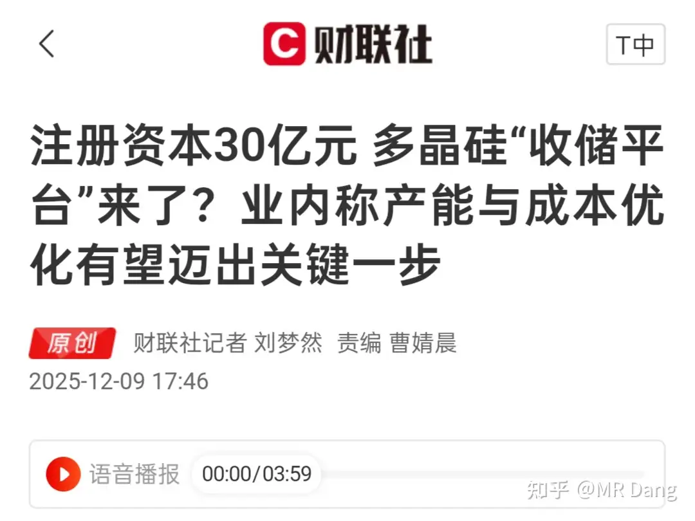

# 如何看待2025年12月10日A股行情？

---

**发布时间**: 2025-12-10 07:21  |  **原文链接**: https://www.zhihu.com/question/1981492209804154174/answer/1981986970931569224  |  **点赞数**: 534 人赞同

**作者信息**: MR Dang​独立投资人，不接广不卖课

---

## 正文内容

先说一下目前的市场情况。

目前的情况是个什么情况呢？

简单的说就是各玩各的，互不打扰。

有抱团在科技大票里，一心一意搞ai算力，通过h200的叙事，希望大机构或者什么别的基金之类进来接盘的。

有抱团在各种冷门小股里，通过柚子的号召力，夸张的涨幅以及玄学的叙事，吸引赌性大的散户或者普通投资者进去搏一把的。

还有就是上一轮抱团在高粱果汁里还没出来，天天被吸血，天天在亏钱，还天天被嘲讽的苦闷投资者。

也有传言说是基金经理考核新规，让那些抱团在高粱果汁里的感到了危机，赶紧换个地方抱团，先不要考虑能不能出来，把业绩搞正了再说。

一个冷知识是超过6成的基金经理没跑过指数。

这三波人，几乎都是各玩各的，互相之间是无法理解的。

这种行情，就是典型的站队行情，也不分什么个股之间的区别了，相信谁就去谁那里站队，相信哪个故事就去哪里投票。

有的人很喜欢这种市场氛围，因为这种氛围把投资简化了，变成了胆量的游戏，几千个选项最后简化成了几个选项。

更多的人是感到迷茫的，去参与，又担心高位接盘，不参与，持股体验又不好，看着别人眼红。

隔夜商品方面，白银暴涨，首次站上60美元，逼空继续，再创历史新高。

但是大家会发现，有色股现在表现不如商品，所谓白银是白银，白银股是白银股。

说明部分资金认为这种逼空行情是阶段性的，银价的高企是不可持续的。

资本市场对有色股的定价就会更加谨慎，按计算器的时候这部分涨幅就不会算进去。

我配置的锡王和铝王，刚进去就套了六七个点，铝我不会再加了，锡我等前期的跳空缺口补了再加重仓，补不了就当没这回事。

补仓这个事情一定要拉开距离，不能上头，不能赌气，控制仓位，这里是投资者最容易犯错的地方。

网红博主蓝战非在南非被绑架的事情热传。他是我很喜欢的一个旅游博主，人老实，活也多，去的地方也很有意思。

对这件事情我一开始也是有点，emm，怎么说呢，就是总觉得哪里对不上。

比如绑匪的筹谋和收益好像不太成正比，在对蓝战非做了详尽的背调后，要求的数字似乎有些少了。

后面我又想了想，可能是因为他不是混币圈的，以及咱们的外汇管制。

参考以往的案例，假设他是币圈的人，可能这次被发现的时候已经凉了，而且少不了吃很多苦头。

然后接着这个由头，a股又来了波绑架概念股。

我觉得不算玄幻，生肖炒股都能流行起来，绑架怎么就不行了？

a股这个生态就这样，总有人想着赌一把暴富，你让这些人买银行股，哪怕是涨幅最大的银行股也看不上眼的。

他们需要一个更加短平快的场子，下注，押注，摇骰子，分钱。

至于这个场子叫什么无所谓，生肖也好，玄学也好，绑架也好，只要玩的开心就好。

海光信息终止对中科曙光的重组，之前的方案是0.55股海光=1股中科曙光，那按照股价来的话：

海光接近220，曙光100，就有人买曙光套利，然后等重组完了套利走人。

现在告诉市场并购黄了，海光是海光，曙光是曙光，这部分套利资金可能就会撤退。

套利也不是每次都成功的，套利失败一次对这些资金来说不亚于滑铁卢，没有个一年半载很难恢复元气。

原华融总经理被执行死刑。

11个亿。

AMC机构的财报不透明，本身就是处理坏账的，中间的权力寻租空间太大了。

按照职务含权量公式计算，AMC机构同等职位的含权量远大于银行券商保险这些。

华融最后改名成中信金融资产，近一两年在港股的表现要比同为四大AMC的信达好多了。

光伏反内卷的收储平台疑似成立，这瓜不保熟，但是熟的几率大。

对行业肯定是利好。

但是现在成本端蹭蹭蹭的涨，银价涨这么多，反内卷到底有多大作用是需要打个问号的。

生猪价格有日线级别见底趋势：

只是日线级别的，还需要观察，生猪企业日子依然不好过。

今天没有动的想法，观察为主。

九点半公布cpi的数据，我之前有过挺激进的预测，因为去年同期基数不太高。

一个喜欢保护韭菜的博主，希望大家少少踩坑，多多赚钱！

---

> [!comment]- 点击展开评论
>
>
> | 用户 | 时间 | 内容 |
> | :--- | :--- | :--- |
> | knbnbnb |  | 前阵子，老师买啥涨啥，我谨慎观望没跟，这一波我跟了，结果把老师也套进去了，真对不住了，我的问题。 |
> | 映月 |  | 看到老师也被套了进去，焦虑情绪缓解不少，就好比被绑架的人看到周围好多被绑来的小伙伴，至少不那么害怕了 |
> | &nbsp;&nbsp;&nbsp;&nbsp;MR Dang |  | 我经常被套 |
> | 千寻 |  | 补仓这个事情一定要拉开距离，不能上头，不能赌气，控制仓位 |
> | phoebus |  | 道理都懂，实际操作 |
> | 花城小菠菜 |  | 早上我还点赞了，加仓了又跌了才发现上头了 |
> | 千寻 |  | 全篇我最看得懂的就是这个，想动手的时候就来看看，管住手 |
> | 夏天 |  | 老师老师，我平生第一次申购新股就中签了，叫纳百川，500股一签，昨晚激动得半天才睡着，这个可以吧？ |
> | &nbsp;&nbsp;&nbsp;&nbsp;MR Dang |  | 可以啊，哈哈哈，替你开心，两三万应该有 |
> | Knx |  | 翻了一下评论区，发现很多同学在焦虑bf等红利股最近走势不好，其实这几个点的跌幅才哪到哪，这么考虑的同学真的要反思一下自己的风险偏好了。除此之外，还要反思自己投资股票的初衷，是否真正的理解了一家公司的逻辑而能据此做好长期持有的波动准备。而不是听了一个代码就冲进去，然后焦虑、抱怨、提问先生的道心可千万别受影响啊 |
> | &nbsp;&nbsp;&nbsp;&nbsp;MR Dang |  | 正常现象，新手投资者心态容易着急，解释解释就好了 |
> | hxsx |  | 很多同学都只会瞎抄老师你作业，至于老师写的那么多功法全然不顾，跌一点就心态崩了。 |
> | 策钟铭文 |  | 最近几年，流动性增加了太多太多，钞票毛了，但金属的期货的价格还是原来的价格，变相是降价了，这种低价显然不可持续，增加的流动性迟早要反应到通胀上，金属上涨应该是迟早但缓慢的事情。现在的资金还没有形成共识 |
> | lish |  | 缅A就是这样啦，价值投资的持股体验肯定不会好，在那么多刀子的收割下，勉勉强强捞点残渣吃 |
> | Luiz |  | 多看少动，控制仓位，谨慎加仓，长期持有，不求暴富，争取每年给自己赚点养老钱 |
> | 胖头君 |  | 小红书小道消息说蓝战非吐出了 1700 个 |

---

*本文件由自动脚本从MR Dang知乎页面提取生成*

---

**作者**: MR Dang
**链接**: https://www.zhihu.com/question/1981492209804154174/answer/1981986970931569224
**来源**: 知乎

*著作权归作者所有。商业转载请联系作者获得授权，非商业转载请注明出处。*

---

## 相关阅读

**📈 每日行情评价：**
- [[20251211-如何看待2025年12月11日A股行情？]] - CPI数据与逼空行情
- [[20251209-如何看待2025年12月9日A股行情？]] - 重要会议解读

**📚 投资方法教育：**
- [[20251013-什么是投资思维？普通散户该如何培养？]] - 投资思维培养
- [[20251024-怎么全面的分析一支股票？]] - 股票分析方法

**📘 地阶功法：**
- [[20251022-《地阶功法卷一》投资者必须斩杀的三个妄念]] - 投资者心态建设
- [[20251023-《地阶功法卷二》价值投资三大误区]] - 价值投资核心理念

**🔙 返回：**
- [[每日行情评价]] - 每日行情评价全部内容
