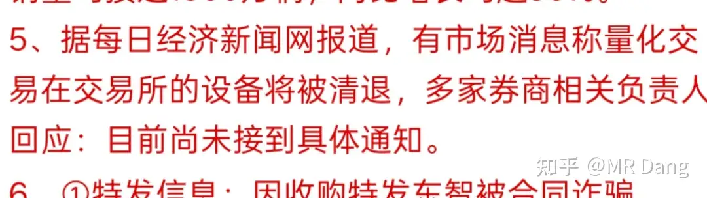

# 如何看待2025年12月12日A股市场行情？

---

**发布时间**: 2025-12-12 07:18  |  **原文链接**: https://www.zhihu.com/question/1982143069383041618/answer/1982710909513271288  |  **点赞数**: 487 人赞同

**作者信息**: MR Dang​独立投资人，不接广不卖课

---

## 正文内容

今天双12，希望资本市场不要打折太狠了。

昨天基本重仓的都是绿的，邪修都是红的，挨了一顿打，闻了一口肉味。

资产配置就是要把风险分散在不同的行业里，持有标的关联性要降到比较低的区间。

所以每次市场波动的时候我都会观察各个标的之间的相关性，如果两个标的相关性太高，则会考虑只保留其中一个，或者两者加起来仓位视做一个标的。

今天最重要的新闻是开了一个重要的会议，又增加了很多的表述，碍于篇幅限制，请大家看原文。

大家比较关心的那个行业，也有一些很积极的定调，我也在认真学习。

我研究这些课题的时候，一般非常关注一个第一性原理，去预测落地后的效果怎么样。

这个原理就是"钱"。

任何有关价格的事情，最终都要落在钱的问题上。

如果"谁出钱"，"出多少钱"，"什么时候掏钱"这三大问题没有确定的答案，那么对最后的结果我都会持谨慎的态度。

不要觉得这是很简单的问题，这三个问题非常重要，而且当你的阅历提升以后，你就会发现关注这三个问题是非常简单有效的。

把这个原理如果应用在生活中，就会得到推理一"谁掏钱谁说了算"，我经常用这个去解决生活琐事中的矛盾。

掏钱的人应当根据出资的比例享有相应的话语权，其他不掏钱的人如果发表了超过其话语权的意见，就会引起不必要的矛盾。

特别是买f，买车的决策中，和其他亲属的矛盾多来自于此。

对外关系中，会得到推理二"花钱的人不负责提供情绪价值"。

我的读者里有很多高学历的人士，由于从小接受良好的教育，待人接物过于客气。

在学校里自然没问题，但是到了社会容易吃亏，或者让自己内耗。

如果已经花了钱，成了甲方，就没必要客客气气，因为自己受到的教育而隐瞒自己真实的想法。

喜欢就是喜欢，讨厌就是讨厌，不高兴就写到脸上。

这是你应得的，直接提出诉求。

特别是在装修，购物的时候。

好像扯远了，以上只是针对学生党的建议，不是说教哈。

说回会议，除了对重要行业的定调，还有"反内卷""适度宽松"这样的表述。

降准降息在路上了。

受此影响，债市一度大涨，长债翘头，前几天挨打的债民今天能吃顿好的。

不过我的关注点比较奇怪，我还关注到了对"加紧清理拖欠企业账款"的相关表述。

这个可能一般人没啥想法，但是了解企业经营的，应该知道对G端的业务都是欠款大户。

有那么一两个行业，总有那么一两家公司，几乎绑定了欠款，应收账款极其多。

昨天盘中有一条信息是关于"九天"无人机的，我看了下飞机的数据，感觉从大小，载重，通用程度来说，有一定的想象空间。

对标的产品是西大的MQ9死神，航程和载重几乎三倍于竞品，我核对了ai给出的数据，几乎没有错漏。

然后博主就火急火燎的找了个关联度最大的hg公司潜伏进去了，开开心心的。。。。。。就被套了两个点。

投机嘛，就这样，我不喜欢去人多的地方，也不愿意掏高价，有机会赚一点就跑，没机会就认栽。

对我来说这点股票的亏盈没什么实际意义，涨停跌停也几乎没影响。

主要就是打发时间，然后去印证自己对市场的判断。

白银再创历史新高，暴涨四五个点，来到了64美元左右。

锡也创近期新高，暴涨13000/吨，来到了33万/吨上方。

当然，商品是商品，股票是股票，不耽误我锡王继续挨打。

最近股票和商品走势有点脱节。

但是长期来看这两者价差终究会回归，要么就是股票补涨，要么就是商品补跌。

锡我依然保持看多的观点，基本的供求关系太好了，长期价格中枢看高到40万/吨上方。

我的审美就是小众的金属，网上可能吹金的，吹银的，吹铜的博主有很多，像我一样吹锡的就没那么多了。

差异化路线，哈哈。

黄金重返4300美元，但是我的zj还没回到高位，按照我4500美元的清仓止盈计划，到时候还没破前高就尴尬了。

铜创历史新高。

有色股今天应该能支愣起来吧，氛围都到这一步了。

泰国和柬埔寨冲突升级，可能利好两个国家出口商品相关的板块以及jg贸易，情绪上会有所影响。

但是实质上很难说，冲突烈度和时间未知。

目前天然橡胶的现货价格是14833，比昨天涨了50，还没什么大的反应。

期货价格15150，处在相对底部区间（月线视角），也没什么大的波动，甚至还跌了一点，可以继续观察观察。

冲突已经导致最少十几号人丧生了，两边都不好对内交代，看起来一时半会儿可能结束不了。

有关量化的一则传闻：

不保真。

Ai领头羊甲骨文出了财报，不及预期，股价暴跌。

主要是云业务收入不及预期，烧钱速度反而远超预期，自由现金流负100亿，吓傻了投资者。

在问答环节，针对ai业务的几个核心问题，比如未来的烧钱速度，ai业务何时盈利，ai业务的测算模型，大客户的潜在风险等，管理层全部秦王绕柱没有正面回答。

投资者想按个计算器都不知道怎么按。

至于我的话，也只能买点有色股侧面支持ai发展。

管你这的那的，我也学不了那么许多，反正只要用电子设备就要用锡，就要用铜。

个股方面，我持有的hxyh要在12.26开临时股东会，一般开了会就快发钱了。

要是快的话大概在一月中上旬就派息了，一股一毛的中期分红。

对我来说也是不小的一笔钱了，还没想好分的红加什么，因为现在好几只票的股息率都不错，比如dsl，gggf，bfny和btgf。

或者直接加银行也不错。

到时候根据股价和业绩快报再说吧。

持有的dsl高管发表了最新对行业的表态，不知道药店这行当算不算反内卷的一部分。

一个喜欢保护韭菜的博主，希望大家少少踩坑，多多赚钱！

（今天提前发吧，不知道审核要多久，随缘去）

---

> [!comment]- 点击展开评论
>
> | 用户 | 时间 | 内容 |
> | :--- | :--- | :--- |
> | 村妞在乌村 |  | 家里我带娃养娃所以娃的事我说了算，其它人插手搞砸了我腰板也直着怼的 |
> | k591998667 |  | 最近油价巴拉巴拉往下跌，塑料也巴拉巴拉地降价，我的宝丰啊 |
> | &nbsp;&nbsp;&nbsp;&nbsp;MR Dang |  | 看新疆项目啥时候批复吧，那个才是增长点 |
> | k591998667 |  | 谢谢老师解惑 |
> | 牧田不来 |  | DANG佬，我想请问，作为一个价值投资者，为什么你一般的标的都是30%盈利就清仓，根据我对价值投资者的了解，很多人不是会考察好公司行业的基本面后，投资长达三到十年，追求股票五倍，甚至十倍盈利的吗 |
> | 村妞在乌村 |  | 他有说明过的。如果短期暴涨了30%就出，后面跌回来还会再买的。如果没有暴涨就一直拿着 |
> | &nbsp;&nbsp;&nbsp;&nbsp;MR Dang |  | 刻板印象 |
> | 盾毒嘲讽融合怪 |  | 跑不赢大盘，每天都是大盘小绿我大绿，大盘中红我小绿，大盘大红我小红 |
> | 草禾里珍珠 |  | 这种时候就是黎明前了，坚持😣 |
> | 盾毒嘲讽融合怪 |  | 只能坚持了，我已经全仓银行+红利了，感觉红利快到反转的时候了，软件卸载了，免得手贱 |
> | 北国神风 |  | 大跌还是要补仓的 |
> | 麋鹿迷了路 |  | gggf这个真是越看越喜欢。 |
> | 宁静致远 |  | 是国光股份还是钢管股份？ |
> | 唯依 |  | 老师早，真羡慕。本金小的时候完全没法下闲棋。还是得尽早完成原始积累 |
> | 海润 |  | 我只有5万本金，哈哈哈， |
> | 小康 |  | 加紧清理拖欠企业账款这个，我知道的是海南某医院今年要节衣缩食，少发年终奖，把现金流用掉，给供应商结账 |
> | 郑缓 |  | 医院给供货商的结款基本都是十到十三个月，而且大批烂账根本不结，希望这次能真的整治一下 |

---

*本文件由自动脚本从MR Dang知乎页面提取生成*

---

**作者**: MR Dang
**链接**: https://www.zhihu.com/question/1982143069383041618/answer/1982710909513271288
**来源**: 知乎

*著作权归作者所有。商业转载请联系作者获得授权，非商业转载请注明出处。*

---

## 相关阅读

**📈 每日行情评价：**
- [[20251215-如何看待2025年12月15日A股行情？]] - 周末消息面解读
- [[20251211-如何看待2025年12月11日A股行情？]] - CPI与PPI数据解读

**📚 投资方法教育：**
- [[20251013-什么是投资思维？普通散户该如何培养？]] - 投资思维培养
- [[20251026-如何对企业进行估值？]] - 估值方法详解

**📘 地阶功法：**
- [[20251022-《地阶功法卷一》投资者必须斩杀的三个妄念]] - 投资者心态建设
- [[20251025-《地阶功法卷三》商业模式评估]] - 商业模式评估方法

**🔙 返回：**
- [[每日行情评价]] - 每日行情评价全部内容