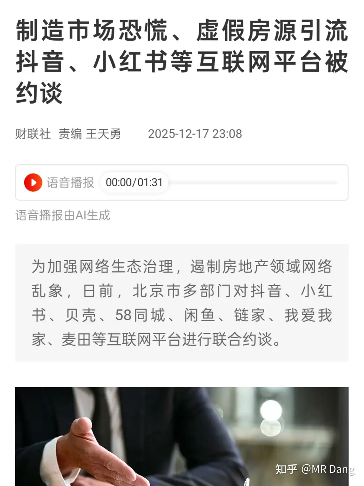
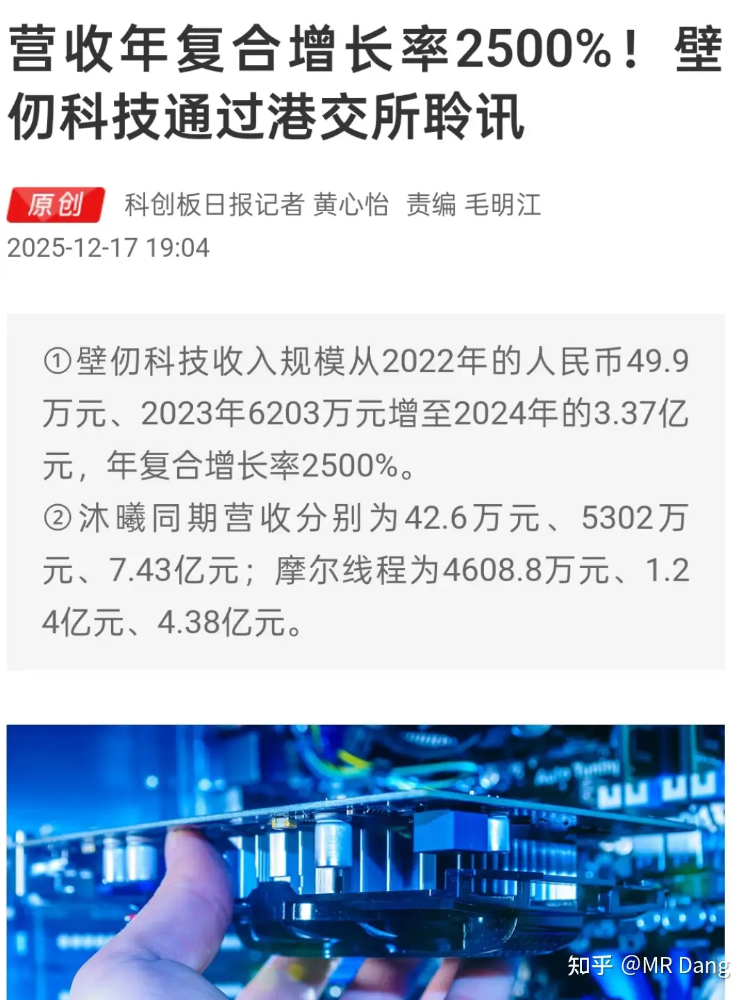

# 怎么看待2025年12月18日A股行情？

---

**发布时间**: 2025-12-18 07:23  |  **原文链接**: https://www.zhihu.com/question/1984392868241102366/answer/1984886479915358160  |  **点赞数**: 435 人赞同

**作者信息**: MR Dang​独立投资人，不接广不卖课

---

## 正文内容

今天最重磅的消息是几大头部券商的合并方案  ：

根据这个方案和收盘价的话，东兴溢价率＞中金＞信达，肯定有人根据这个比例去套利，卖出性价比高的，买入性价比低的。

事实上，外部投资者做空套利比较麻烦，但是建议本身就持有这三个股票的可以随时算账去调仓。

要说利好程度的话，明显给东兴的方案最好。

不过还是要泼一盆冷水，一来券商板块多渣男，二有国泰海通的前车之鉴，合并后到底能有多大利好犹未可知。

如果涨幅巨大，及时落袋为安也不失为明智之举。

昨天的资本市场在上午还比较冷清，下午突然就有了一些起色。

有传言说是日本加息暂缓，我觉得不是很现实。

到是A500etf突然放量，不像是自然形成，所以大家也有所猜测。

结合3800附近的反复横跳，我个人觉得可能类似以前那样的托而不举，呵护资本市场的态度还是比较明确的。

还有部分知道券商复牌消息的资金抢跑。

昨天铂期货涨停，创新高：

这方面的标的不再简单重复了，就两家回收企业，情绪上可以提振股价，反应到业绩上还需要观察。

国际锡期货价和国内锡价双双创新高：

25的锡王没有好好珍惜，下次蹲到不知道是啥时候了，唉，希望铜王表现能好点。

还有新读者不知道锡王和铜王是哪家公司，它们分别对应xygf和zjky。

说到锡，昨天有读者对我文中的数据产生了质疑，特别是那组欧美人均锡量5kg和东大人均0.5kg的数据。

其实我也疑惑过，因为这组数据是我引用的，但是作者的名头比较大，也没仔细想。

引用自这篇文章

现在仔细一算的话，西大一年也就是用40万吨不到的锡，3.5亿不到的人口，掐指随便一算，大概对应人均一千克多点。

欧美发达国家一共也就是八亿左右的人口，欧洲再怎么能用锡，也不可能把人均提高到这么高。

数据确实不对，感谢指正，鞠躬道歉。

白银又创新高了，期货涨了5个点，如图：

白银股那两家表现一般般，比不上白银，原因还是资本认为高价不可持续，逼空结束会恢复正常价格。

多家平台被约谈。

r企业，成功赖账500多亿：

简单的说就是500多亿的债务转成股票了，给了两种转股价，75%是6.8，25%是3.85。

按照目前的股价计算，相当于有四分之三的债务要回了20%，25%的债务要回了35%，总体要回了大概四分之一这样子。

比目前的债券价格高的多，所以就谈成了。

但是有锁定期安排，到时候在二级市场能卖多少还是有变数的，我个人不看好二级市场的承接力。

利好利空很难讲，相当于是用以后的发展空间换来现在的喘一大口气。

最终还是股东承担了所有。

这票当年也是雪球神票，8848的预测言犹在耳，没想到几年而已，就成了这副光景，令人唏嘘。

w企业的方案有进展，不知道债权人会怎么投。

一般来说，按照常理，对这种兑付出现问题的事情，以前各种经验教训表明，越早要钱给的方案越好，拖到后面基本没好果子吃。

希望w企业可以打破这一认知。

昨天沐曦超越摩尔，晋升a股2025最牛新股。

没有中签的读者不必懊恼，量大管饱，港股的打新也来了：

港股那边打新不是必赚的，所以很多人打新都很谨慎。

但是璧仞这个估计认购倍数能冲到5000倍都说不定，应该会被疯抢。

继a股投资者喜迎新股上市后，港股投资者终于也喜迎新股上市了。

与此同时，受到信用可能违约的影响，甲骨文股价又崩了：

带领一众西大的科技股回调。

科技还得看东大啊，全球估值最高的市场，让外国投资者开开眼，什么叫二级市场的承接力。

今天总体来说，盘前情绪还是可以的，毕竟有券商的利好在里面。

但是资本市场经常不能以常理度之，跌的好好的突然就反弹了，涨的好好的说回调就回调。

多看少动，管住手，按照计划来，不要被消息影响了心智。

一个喜欢保护韭菜的博主，希望大家少少踩坑，多多赚钱！

---

> [!comment]- 点击展开评论
>
> | 用户 | 时间 | 内容 |
> | :--- | :--- | :--- |
> | 败絮丶 |  | 券商合并，有色狂奔，房企赖账，科技牛逼，美国药丸 |
> | 孙林 |  | 我也学习了一下烯烃的逻辑中国每年7000-8000万吨需求。其中1400万吨进口。烯烃价格连降四年了。目前6000多元每吨。全行业基本都在亏损，一吨亏1000元多到几百元不等。其中做焦炭的宝丰半路出家，利用中科院大连物化所几十年才憋出来的技术（因中国多煤少油立项，几代人接力研究，很令人唏嘘的故事），宝丰贷款300多亿，新建煤制烯烃产能，目前每吨可以盈利2000多元。宝丰目前烯烃总产能520万吨，一年是100多亿的利润。下面开始讲故事：新建煤制烯烃因为成本优势目前就是印钞机，但同时高耗能，高耗水，投资巨大。国家在用碳排放和水资源限制新项目建设。审批原则基本是先到先得。目前宝丰520万吨产能已经是全行业规模最大，宝丰在新疆还有400万吨产能待批。竞争对手？石油路线不行，成本太高。煤化工路线，似乎没有对手啊！大连物化所的技术最早是神华跑通的，大概几十万吨产能，但神华等国企目前每吨利润几百块，和宝丰民营企业每吨2000-3000的利润没法比。另外宝丰新疆项目未来如果能批复，除了产能再增加80%，还能实现多年未实现疆煤外运。过去新疆的煤因为运输成本，东部地区宁可用海运的煤。现在可以把疆煤的变成塑料，价值提升几十倍，外运到东部。另外还有新疆的电力外运同理。（前面说了高耗能）另外也可以实现一定的原油替代宝丰现在520万产能，未来400万吨待批产能，具备巨大成本优势。未来预计可以达到每年200多亿盈利。（宝丰每年稳定分红，还银行贷款，盈利可信）国内8000万吨需求，全球几亿吨需求。可以说一片蓝海。这一切是烯烃价格低谷的情况下实现的。如果烯烃价格走出低谷，那么上面的盈利还有望翻倍…. |
> | Iris |  | 老师云天化现在的价格可以入吗？ 股息率也挺高的 |
> | &nbsp;&nbsp;&nbsp;&nbsp;MR Dang |  | 可以 |
> | 夏天 |  | 你今天进了吗？我也想进云天化，明天早上看情况进 |
> | Iris |  | AI让我28块进 |
> | 夏天 |  | 能蹲到28嘛? |
> | 马云飞 |  | 昨天看到锡数据有问题能提醒一下老师也是不错的哈，哈哈 |
> | 乌获 |  | 12月18日 行情笔记1️⃣中金、信达、东兴三大券商合并中金	信达	东兴合并股价	36.91	19.15	16.14目前股价	34.89	17.79	13.13溢价率	1.058	1.076	1.299目前是合并预案，也就是说可能成也可能不成。那么成的话，东兴的差价（溢价率）最高，如果不成的话，这个差价也代表了市场最不看好东兴，就是预案给到了16.14的价格，但市场买卖双方最终给到的价格是13.13，那么如果预案不成，东兴价格可能会跌的更多。是否可以这样理解呢？单看溢价率数据 三家分别是东兴＞信达＞中金但是为什么信达实际溢价率最低（性价比最低）呢？因为信达和东兴二者承担的合并失败的风险相同，但是合并成功的收益东兴高于信达；对于押注合并成功的资金。肯定会选择性价比更高的东兴，信达就会面临较弱的买盘支撑；原本持有信达的股东也会想把信达换成东兴，这样如果合并成功可以换更多中金的股票，导致信达存在较多潜在卖盘，降低信达的吸引力。中金公司与信达和东兴角色不同。 选择中金是选择成为存续主体公司的股东，分享合并后的长期成长，其溢价方案是给予现有股东的"保护"，是风险对冲，而不是博取短期换股套利的机会。更高的36.91元换股价。表示抬高了中金新股的价格，减少为收购而需要发行的新股数量，减轻了中金股东股权稀释的程度。另外，设定较高的中金换股价👉计算出的换股比例更有利👉为完成合并需要发行的新股数量减少👉合并后总股本（分母）的增长被有效抑制👉在合并进来的净资产（分子）一定的情况下，最终计算出的每股净资产和每股收益的下降幅度，会小于按市价换股情形下的下降幅度。所以三家实际的溢价率应该是东兴＞中金＞信达国泰海通的前车之鉴："国泰海通"指"国泰君安吸收合并海通证券"后更名为"国泰海通证券"。二者合并后面临巨大挑战。这一点有些类似国电和地电的合并，管理层、职工、企业文化、固定资产、资产、业务、财务、归属感、职业习惯等各个方面的融合&震荡，可以持续好几年。1.人员&文化原海通高级从业人员离职、后台员工转前台2.业务重叠&业绩虚胖营业部网络&业务存在重合，如何梳理整合是个难题。合并后首份季报的利润增长来自一次性收益的"负商誉"，而非持续盈利能力的提升3.管理复杂&内控风险合并后管理链条更长、内部业务频频违规4.子公司&牌照整合两家都有很多子公司&存在"参股一家控股一家"的牌照问题（涉及股权处理）国泰海通的合并有"风险处置"色彩，因为海通证券合并前就因境外业务巨亏、业绩严重下滑和内部问题而压力重重。但此次三家合并案即使成功估计也要好好磨合一阵。如果能借鉴国泰海通把许多问题做在前面，可能会乐观些。2️⃣白银期货涨停我持仓的（小小仓位）白银期货lof因为二级市场溢价高 限购➕停牌了 |
> | &nbsp;&nbsp;&nbsp;&nbsp;MR Dang |  | 认真 |
> | 乌获 |  | 谢谢老师 请老师喝咖啡☕️ |
> | 慎独 |  | 多看少动，管住手另外跌5％就算大跌吗，我看这跌完也比咱们的科创板靠谱，美国人还是太保守了 |
> | &nbsp;&nbsp;&nbsp;&nbsp;MR Dang |  | 三个月前股价是340 |
> | 慎独 |  | 再跌一跌是不是可以抄底了 |
> | knbnbnb |  | 老师好像不碰科技 貌似 |
> | 在齐太史简 |  | 今天红红火火恍恍惚惚 |

---

*本文件由自动脚本从MR Dang知乎页面提取生成*

---

**作者**: MR Dang
**链接**: https://www.zhihu.com/question/1984392868241102366/answer/1984886479915358160
**来源**: 知乎

*著作权归作者所有。商业转载请联系作者获得授权，非商业转载请注明出处。*

---

## 相关阅读

**📈 每日行情评价：**
- [[20251219-怎么看待2025年12月19日A股行情？]] - 券商合并与市场观察
- [[51217-怎么看待2025年12月17日A股行情？]] - 市场分析与投资策略

**📚 投资方法教育：**
- [[20251013-什么是投资思维？普通散户该如何培养？]] - 投资思维培养
- [[20251026-如何对企业进行估值？]] - 估值方法详解

**📘 地阶功法：**
- [[20251022-《地阶功法卷一》投资者必须斩杀的三个妄念]] - 投资者心态建设
- [[20251025-《地阶功法卷三》商业模式评估]] - 商业模式评估方法

**📗 天阶功法：**
- [[20251024-《天阶功法卷一》BFNY价值投资分析]] - 个股分析实战案例
- [[20251125-《天阶功法卷七》中国黄金第一家——C公司投资价值分析]] - 个股分析案例

**🔙 返回：**
- [[每日行情评价]] - 每日行情评价全部内容
