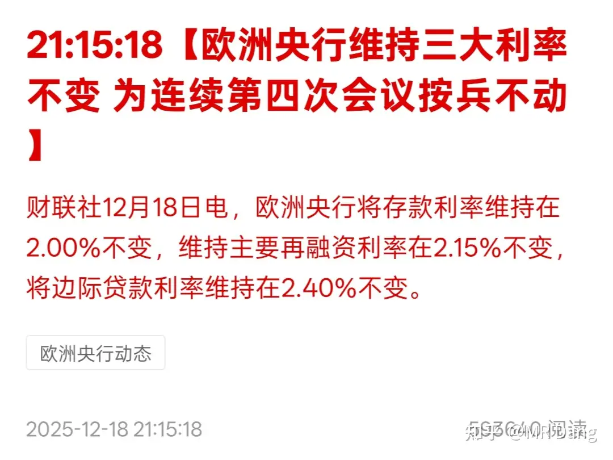
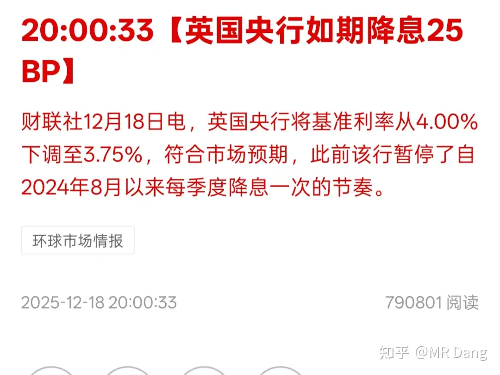
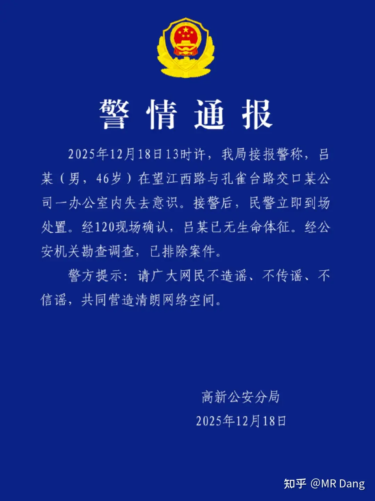
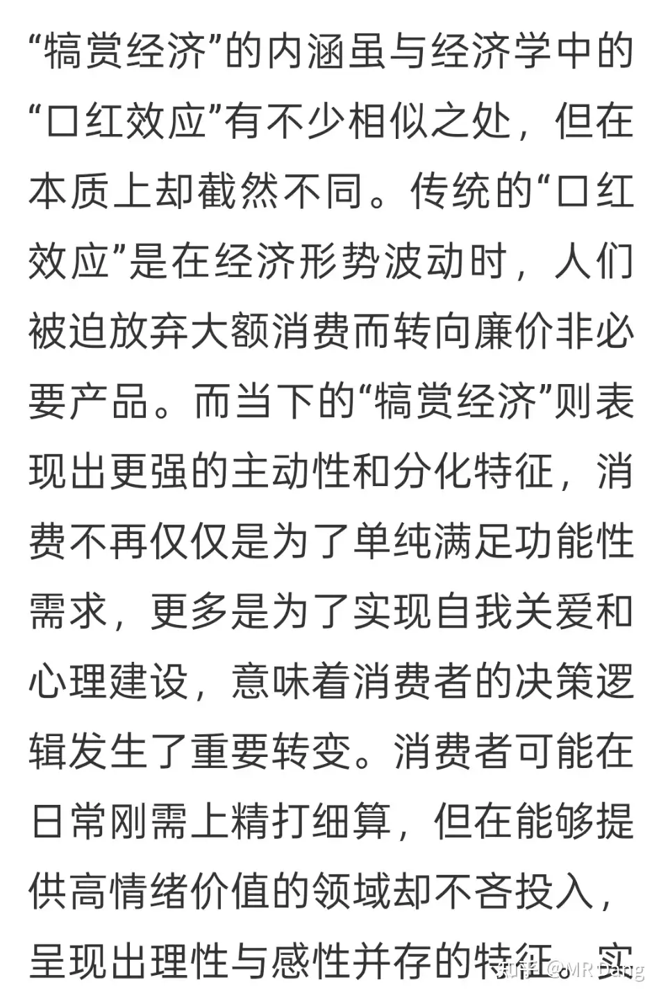

# 怎么看待2025年12月19日A股行情？

---

**发布时间**: 2025-12-19 07:18  |  **原文链接**: https://www.zhihu.com/question/1984755586789814734/answer/1985247542083073451  |  **点赞数**: 531 人赞同

**作者信息**: MR Dang​独立投资人，不接广不卖课

---

## 正文内容

昨天基本上三家券商的涨幅按照预测的来了，这个账很好算，我能算过来，市场也能算过来。

但是券商果然还是渣男，如果是看了消息闷头往里冲的，体验一定不好。

这就是我经常说的，做短线的，想赌一把的，一定要找正规的场子。

你可以去交易非人为的突发事件。

比如突然的气候变化，国家间的地缘扰动，大宗商品的价格变化，科学技术的历史性突破，公共安全引发的连锁反应等等。

也不是说这些事件就一定不受人的影响。

但是这些事情即使受个别人的影响，那些可以影响历史进程的人也不屑于去和你做对手盘。

普通的散户压根就不在人家的菜单上。

而人为的，有内幕消息的事件，就不要参与。

比如重组，比如回购，比如突然的公司层面的利好，比如大额订单，比如中标项目，比如合作协议。

这些事件，你能预判，那你就提前埋伏。

预判不了，就不要参与了。

看见消息后再往里冲，多半没好果子吃。

普通投资者看见的时候都是十八手消息了，冲进去纯纯就是白给。

举个例子，你觉得你技术高超，跑的很快，堪比博尔特。

和别人在同一起跑线，比赛百米冲刺还有获胜的可能。

但是你跑的再快，你能比的过我起跑线就是终点线？

我坐着轮椅都是0秒撞线。

你赌术再高，高的过千术？

我为什么喜欢参与大宗商品的东西，像金银铜锡这些，比的就是眼力，比的就是对大势的分析。

全球有能力对这些价格造成动荡的人，也就一手之数，哪个都不屑于来收割我。

在这种相对公平的市场里，输就输了，赔就赔了，技不如人我心服口服。

可是如果窝窝囊囊的输给出老千的，就算赔的不多也是一肚子闷气，最好的解决办法就是不参与，让他们镰刀互割。

西大cpi数据超预期，预期3.1，实际2.7。

cpi低了表示通货膨胀压下来了，那就有了降息空间，利好资本市场。

受此消息影响，外围资本市场表现都不错。

欧洲央行按兵不动，符合预期：

英国央行降息25个基点，符合预期：

相关影响，在本周一的时候已经说过，如图：

大宗商品方面，锡盘中再创新高，一度摸到34万/吨上方：

金银铜均不同程度回调，铝微涨。

难受啊，我的换股计划要搁浅了，两只股票距离越来越近，我很少有后悔的事，这件事有点让我懊恼。

我持仓的邪修量王，发了一个离奇的公告：

然后还有个帽子叔叔的公告：

对股价会有影响，但是不属于创始人/核心技术人员/实控人，所以一般这种情况影响不会特别大。

属于国企的看门人。

今年5月份才上任的，可惜了。

如果能蹲到一个400以内的位置，恰好我还把铜王止盈的话，会认真考虑是否加一点点的。

昨天的行情对我持仓的风格比较友好，表现都还行。

虽然对我来说意义不大，我个人现在除了铜王和锡王，对其他持仓的股价关注度不高。

因为只有这两个股有操作计划，涨跌会影响决策，其他股票基本都是持股不动等吃息的，短期的涨跌更多的提供的是情绪价值和谈资。

行业板块上，最近医药商业的热度比较高，和我持仓相关的就是dsl。

这个板块妖股横行，主要是股票名字取得好，玄学炒作，但是目前还没到基本面的发掘上。

等什么时候炒基本面了，我会认真考虑止盈计划的。

学习了一个新词：犒赏经济

感觉有点类似情绪消费，或者口红效应，这篇文章也做出了区分：

前几天我还在说口红效应，看样子以后得改口犒赏经济了。

按文中的表述，口红效应是被动的，经济不好时候的喝奶茶，被动的情绪价值消费。

而像我们这样蒸蒸日上的经济环境里，我们是主动的喝奶茶，主动的情绪价值消费，所以不能叫口红效应，要叫犒赏经济。

高啊，太高明了，如此精准的划分，又学到了。

上班累了，奖励自己一杯奶茶，犒赏经济。

学习累了，奖励自己一个盲盒，犒赏经济。

投资累了，奖励自己一张演唱会门票，犒赏经济。

相关标的太多了，整理不过来。

如图所示，应该看得懂啥意思吧，不保真，据传1.4了。

降息周期里，抱紧红利/资源股。

如果又是资源，同时还是红利，那简直完美。

这样的股满打满算也没几个。

一个喜欢保护韭菜的博主，希望大家少少踩坑，多多赚钱！

---

> [!comment]- 点击展开评论
>
> | 用户 | 时间 | 内容 |
> | :--- | :--- | :--- |
> | 唯依 |  | 老师早。昨天在上班路上救了个人，地铁上有位女士突然失去意识昏迷了。急救知识没白学。还有就是老师和评论区的各位要保重身体呀，身体是革命的本钱 |
> | &nbsp;&nbsp;&nbsp;&nbsp;MR Dang |  | 为你点赞 |
> | 资本主义必将消亡 |  | 开始期待四万粉的内容了三万粉都把吃饭的家伙事亮出来了，四万粉还不得上天呐 |
> | 愚人杰AI生活 |  | 一早上刷了七八次知乎，就等大佬更新那 |
> | 晨风 |  | me too |
> | 星星之火 |  | 老大  邪修zhkj昨天为什么涨，我都没看明白... |
> | 化石的岁月 |  | bt 我有一点，yth看起来股息更高一点。我再去温习一遍这三个公司的对比。 |
> | kangjie |  | 队友在搞"情绪产品"，我还没什么反应，D佬多说两次了，被动关注了。重点:红利又资源的大腿课代表再发一下，看看是不是抱对了。 |
> | 念玉 |  | 宝丰，芭田，就记住这俩 |
> | 哈基米南北路多 |  | 宝丰又有矿，分红也高 |
> | 亦蓑烟雨任平生 |  | 全球有能力对这些价格造成动荡的人，也就一手之数，哪个都不屑于来收割我。-----特朗普：嘿嘿，我要来画K线了 |
> | k591998667 |  | 昨天做了个小决定，每天股票赚了钱就拿一点点出来给家里的两个小股东来点分红做，让他们也一起开心 |
> | 中华绘图铅笔 |  | 我也是，每到月底有盈利就分红，就是没分几次 |
> | k591998667 |  | 我按天分，一次可能就一两块，每天家里小孩盼望你挣钱回家分红，是一种想想就幸福的感觉 |
> | 心态要好 |  | 醒来第一件事情关掉闹钟+打开dang大文章，不是因为再不起床赶不上上班，而是开盘前得吸收dang大的信息 |

---

*本文件由自动脚本从MR Dang知乎页面提取生成*

---

**作者**: MR Dang
**链接**: https://www.zhihu.com/question/1984755586789814734/answer/1985247542083073451
**来源**: 知乎

*著作权归作者所有。商业转载请联系作者获得授权，非商业转载请注明出处。*

---

## 相关阅读

**📈 每日行情评价：**
- [[20251222-如何看待2025年12月22日A股市场行情？]] - 周末行情回顾
- [[20251218-怎么看待2025年12月18日A股行情？]] - 市场观察与分析

**📚 投资方法教育：**
- [[20251013-什么是投资思维？普通散户该如何培养？]] - 投资思维培养
- [[20251011-下周一股市就要大跌了，作为投资者该如何应对？]] - 风险控制与投资心态

**📘 地阶功法：**
- [[20251022-《地阶功法卷一》投资者必须斩杀的三个妄念]] - 投资者心态建设
- [[20251023-《地阶功法卷二》价值投资三大误区]] - 价值投资核心理念

**📊 万粉感言：**
- [[20251122-三万粉感言]] - 投资心得总结
- [[20251227-四万粉感言]] - 投资经验分享

**🔙 返回：**
- [[每日行情评价]] - 每日行情评价全部内容
