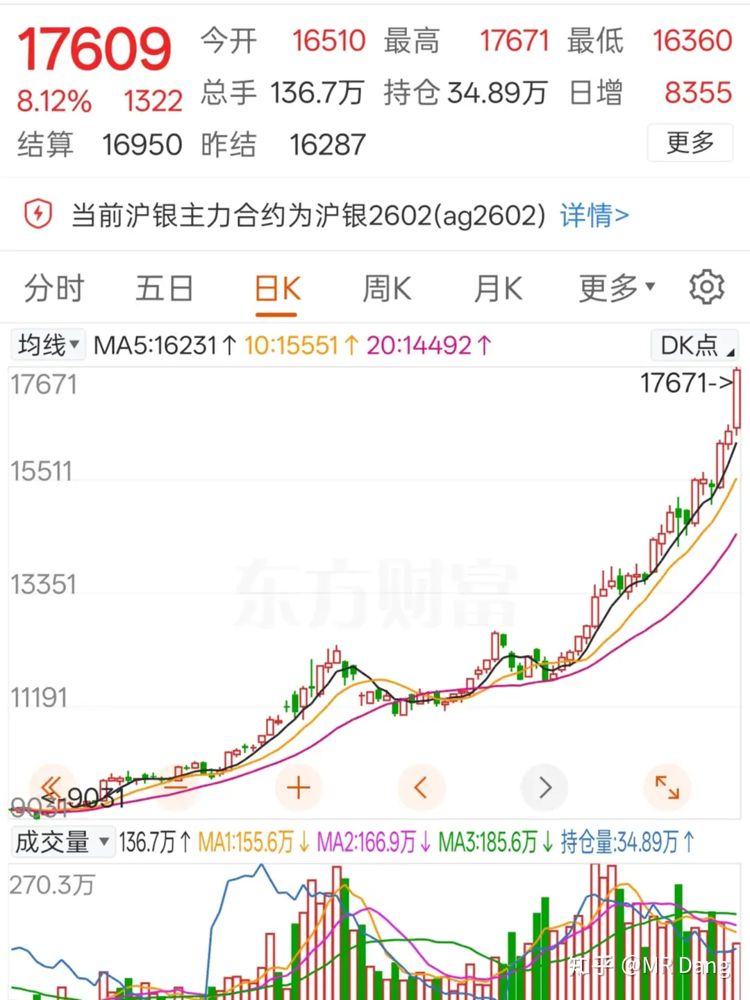

# 如何评价2025年12月25日A股行情？

---

**发布时间**: 2025-12-25 07:08  |  **原文链接**: https://www.zhihu.com/question/1986935773858137516/answer/1987419423313764695  |  **点赞数**: 556 人赞同

**作者信息**: MR Dang​独立投资人，不接广不卖课

---

## 正文内容

外面都在过年，今天长话短说：

头条肯定是北京的楼市新z，大概就是"减1年限制，加一套额度，加大杠杆比例"

具体解读大家可以慢慢看原文细则，当然也有简化版本：

有人嘲笑现在还需要限购纯粹是多此一举。

至于我的态度，我相信普通人不可能三角。

也就是有好处，普通人，不排队这三个命题最多同时满足两个。

但是资本市场炒作不管你这的那的，先炒了再说。

a股和这消息相关的地产股我能想到两个。

第一个地产股是四个字的，上一次炒的很夸张，两块多炒到八块多，最后一地鸡毛，现在是五块多。

今天大概率是涨的，不过问题出在今天冲进去当天是跑不掉的，明天能不能全身而退就两说了。

从投机的值搏率来讲，这个消息（人为）+这个行业（地产），都不是我喜欢的东西，我不会参与，尽管我觉得胜率＞50%，它在我眼里依然是邪修。

第二个标的是三个字的，商业地产+住宅开发，其实静态的看它的估值还算可以，虽然也在亏损，但是底子挺厚，熬过去了的话凭借手上的商业地产也不是没有翻身的可能。

这两非要我二选一的话，我会选后者，但是市场表现大概率是前者更好，这也就是所谓的弹性。

当然也有更好的选择，就是都不参与。

最近商业航天比较火，外面老马要ipo，里面咱们的蓝箭听说ipo辅导完成，以科创板的效率，我估摸着明年上半年甚至一季度就能上了。

整个行业，除了老马的公司，咱们国内的这些目前还是概念居多，情绪发酵为主。

包括我持有的jg股，套了好些天了，买进去就在亏，最近也因为蹭到概念开始有一点浮盈了。

目前资本市场这些公司我觉得估值还是高，我不会参与。

不过我对蓝箭还是高看一眼，毕竟龙头。如果ipo以后上市估值没有特别离谱（比如千亿内），那我可能咬咬牙也会拿点小钱在上市第一天买一点玩搏傻的游戏。

沪银昨天暴涨8个点：

我不懂技术哈，单纯的看斜率，目前有加速上涨的趋势，可能提示有点透支了未来的收益空间。

这个价位让我做空我不敢，但是你让我买我也不愿意。

有个新股，我们省的旅游，发行价80，有点高，读者里有几个中了签的，问题集中在要不要缴款，怎么卖，预期收益多少？

我先提前声明，鄙人不善择时哈，以下纯闲聊，自己的钱自己把握。

1，这股怎么样？要不要缴款？

我个人觉得还不错，业务主要是长恨歌+华山索道，相当于九华旅游+宋城演艺的plus升级版本。

缴款的话我个人建议缴款，赚多赚少的问题，赔钱概率小。

2，怎么卖？

建议集合竞价就往外丢，大概九点24报价报出去，报个低价，一定要卖出去。

我对任何新股都是这一个建议，只赚打新的钱，不赚交易的钱。

3，预期收益多少？

不好说，让我闭着眼睛猜的话，可能开盘价200左右，一签大概能赚五六万吧。

这只是随口一说，不要当真。

可千万不要开盘一看不到200块，然后想着某大v说了要到200，我再等一等，最后错失良机。

低价铝在海南成立了一个子公司。

也不是完全的蹭概念，怎么说也实打实的掏了500万。

低价铝的股东回馈做的不错，让人暖暖的很贴心。

磷王拿了个采矿许可证：

emm，我没内幕哈，这次纯属巧合，买进去就发利好了。

不过这个矿之前有预期的，只是刚好碰到今天出公告了。

磷王的储量太惊人了，这矿就是品位低了点，其他各项数据都不错的。

磷王不是一般的稳，战略意义太重大了，拿着它感觉非常踏实。

还是那句话，鄙人不善择时，请勿模仿，大家也不要带节奏哈，有不明真相的群众真的会信的。

优必选收购了一个A股：

如果优必选借壳来a上市的话，估值比现在还要高得多，目前是四五百亿了，a股起码能给到千亿。

所以嘛，也不要争什么跨年妖了，这个基本预订跨年妖的位置了，大概率kuku的涨，涨的让人头晕眼花。

但是散户一般买不到，昨天已经有提前知道消息的埋伏进去了。

等能买进去的时候就不知道是福是祸了。

优必选这公司是我在机器人最看好的公司之一，它走的是工业路线，是生产资料属性最强的机器人公司之一。

看到这里想去碰碰运气的，现在挂个涨停单抽抽奖也还行，能抢到的几率不大，情况不对也能撤单。

不过我读者基数也不小了，万一有个欧皇一发神抽逆天改命，也说不好的。

但是这事你仔细琢磨的话，比如优必选它不是来借壳的，就是单纯的喜欢收购。

又或者其中另有什么波折，被叫停。

隐藏的风险其实不小的，也不是说闭着眼睛就能涨十倍八倍的，中间还得博弈。

这对其他题材股算是降温，宫里来了个当红的新人，长的乖巧可人，会说话，圣眷正隆。

其他那些过气的老人就会被打入冷宫，失去恩宠。

过气的妖股不如狗，拿着相关标的的注意风险。

有色整体冲高回落。

钯金现货下跌：

钯的期货昨天是涨停的，按常理今天会补跌。

铂也是同理：

广期所发了个公告:

估计广期所头都大了，刚上两个新品种，波动就大的吓人。

白银lof的套利现在进入博傻阶段了，我看到好多博主开始吹捧不要套利了，来钱太慢了，要去打板，把它当妖股的炒。

我个人非常反对这种说法，同时提醒大家一定分清主次，套利是薅羊毛，风险可控，收益还不错。

参与打板纯粹是投机，风险比套利高几个数量级，是被薅羊毛的对象，是击鼓传花，千万不要参与。

不是谨慎参与，是不要参与。

把基金公司惹毛了，随便打个补丁修复一下系统bug，这些博傻的会被一网打尽。

管住手，控制欲望，套利就行。

今天是等锡王的第二天，锡价目前是33万，许愿个25开头的锡王，我愿意不嫌弃的带她回家。

一个喜欢保护韭菜的博主，希望大家少少踩坑，多多赚钱！

---

> [!comment]- 点击展开评论
>
> | 用户 | 时间 | 内容 |
> | :--- | :--- | :--- |
> | 黑猫杰克 |  | 锡王、铜王、铝王、磷王，买不完，根本买不完 |
> | miokali |  | 早上第一件事，打开关注看大佬更新 |
> | 黄誉翔 |  | 都是一路人 |
> | 唐小刀 |  | 可惜持仓没有磷王只有川子，川子你加油呀，川子 |
> | &nbsp;&nbsp;&nbsp;&nbsp;MR Dang |  | 川恒也很厉害了 |
> | 乌获 |  | 之前自选了H股ybx 但一直不敢下手 今天打算进去尝尝咸淡 |
> | &nbsp;&nbsp;&nbsp;&nbsp;MR Dang |  | 啊？今天不休市了么？ |
> | 哈登登登登登登 |  | 中了旅游股，听老师的话竞价就卖 |
> | 随缘 |  | 送出一个礼物～ |
> | &nbsp;&nbsp;&nbsp;&nbsp;MR Dang |  | 谢谢咖啡 |
> | 梁州第七 |  | 上次投机的云图我还留着，看看后面有没有好的出货点，后面横盘的时候把成本拉低了。主要这股控盘痕迹太明显了，dang老师当时跑的对 |
> | &nbsp;&nbsp;&nbsp;&nbsp;MR Dang |  | 投机的东西我拿不住 |
> | violet666 |  | 我9号进去5%仓位，大涨那天跑了一半，还有一半放着看看。 |
> | Raven |  | 锡王明天不知能否到25 |
> | 云海 |  | 我在等 |
> | 木向阳 |  | 期货涨了，是不是今天要27了 |
> | Raven |  | 是的，要看涨了。 |
> | 小M会守约 |  | 一犹豫没有买yth，锡王的建仓成本价倒是还保持在25，有点盈利 |

---

*本文件由自动脚本从MR Dang知乎页面提取生成*

---

**作者**: MR Dang
**链接**: https://www.zhihu.com/question/1986935773858137516/answer/1987419423313764695
**来源**: 知乎

*著作权归作者所有。商业转载请联系作者获得授权，非商业转载请注明出处。*

---

## 相关阅读

**📈 每日行情评价：**
- [[20251226-如何评价2025年12月26日A股行情？]] - 本周最后一个交易日
- [[20251224-如何评价2025年12月24日A股行情？]] - 平安夜前后行情分析

**📚 投资方法教育：**
- [[20251013-什么是投资思维？普通散户该如何培养？]] - 投资思维培养
- [[20251011-下周一股市就要大跌了，作为投资者该如何应对？]] - 风险控制与投机心态

**📘 地阶功法：**
- [[20251022-《地阶功法卷一》投资者必须斩杀的三个妄念]] - 投资者心态建设
- [[20251023-《地阶功法卷二》价值投资三大误区]] - 价值投资核心理念

**🏠 房产楼市：**
- [[20251008-买优质房源还是买优质公司股票？]] - 房产与股票的选择
- [[20251018-如果有四十万存款你打算先买车子还是先买房子 ？]] - 资产配置思考

**🔙 返回：**
- [[每日行情评价]] - 每日行情评价全部内容
