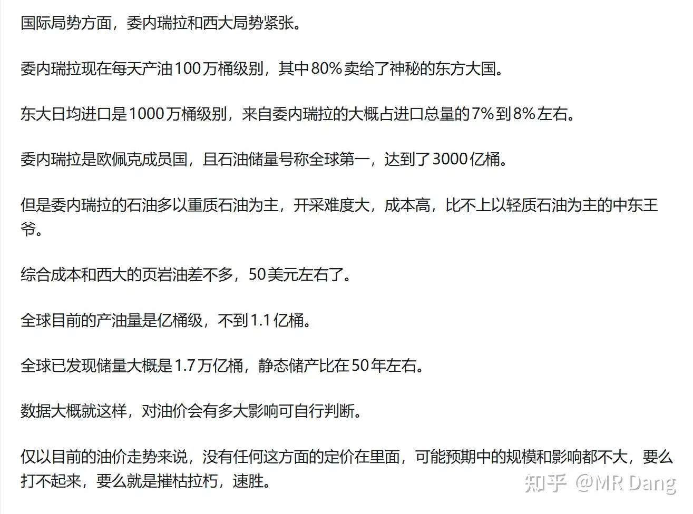
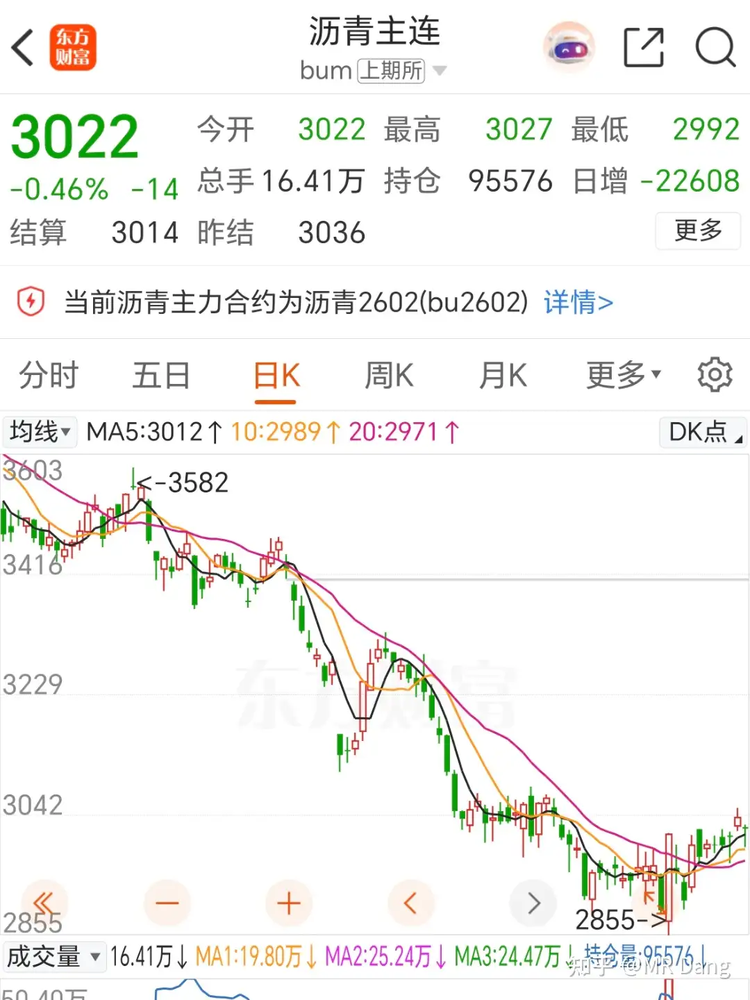

# 对2026年1月5日A股市场行情，大家有什么预测和看法？

---

**发布时间**: 2026-01-05 07:16  |  **原文链接**: https://www.zhihu.com/question/1989730870597284272/answer/1991407725251405809  |  **点赞数**: 684 人赞同

**作者信息**: MR Dang​独立投资人，不接广不卖课

---

## 正文内容

今天是2026年第一个A股交易日。

盘前发生了很多事情，似乎预示着今年的资本市场会有跌宕起伏，波谲云诡的表现。

最重要的事情是委内瑞拉被西大速通，马杜罗夫妇被西大探囊取物般的请走，利好相关赞助商。。。。耐克？

开玩笑的。

咱们这里是财经频道，不JZ，所以只是不带立场的阐述事实，然后考虑相关影响。

之前在2025年12月1日详细分析过委内瑞拉的石油情况，链接在：

[[20251201-如何看待2025年12月1日A股市场行情_|12月1日回答]]

其中对相关影响的分析如图：

当时的看法是两个选项，打不起来OR摧枯拉朽速胜，现在后者已经实现。

同时还有波斯国内的抗议事件，愈演愈烈，不带立场，大家搜相关报道就行了。

这两个国家共同的特点是东大的石油方面的合作伙伴，那么这会直接影响东大进口石油的安全感。

有的投资者可能想到中X石X这样的标的，觉得油价涨了是利好。

但是我要提醒大家一下，很多石化企业在委内瑞拉都有直接投资，现在西大说要接管委内瑞拉的石油，那对这些企业会有什么影响，是值得思考的一件事情。

除了这些石油的企业，还有一些车企，在委内瑞拉和其他南美洲国家是有建厂的，投资者应考虑相关风险。

至于是哪些企业，就不点名了，小白可以自行问AI，多问几个，资深一点的投资者脑海中已经有几个名字了。

至于相关债务的话，大头是几个政策性银行，都是不能上市的，比如大名鼎鼎的GK行，血条厚，问题不大。

至于对石油的影响，我个人认为参考俄乌的烈度和体量，影响在短期内可能是利好原油价格，但是长期随着委内瑞拉天量的储量被开发，有可能是利空。

大宗商品里影响比较大的可以看看沥青，因为委内瑞拉产的马瑞油出沥青率非常高，达到60%以上，而普通原油只有20%不到，大概15%左右。

目前马瑞油出口受阻，国内厂家面临没有原料的困境，如果用其他原料，成本会大幅度上升，所以沥青有可能短期内出现逼空行情。

对西大来说相关的股票受益标的就是一些石油企业，比如巴菲特重仓的OXY。

还得是股神啊，我虽然到不了他的境界，但是我会抄作业。

之前有氪金用户要配置海外资产的时候我也重点推荐了oxy，因为我自认不比巴菲特更了解美股，所以无脑抄作业就行了，股神的绝唱会是凡品么？

对东大来说相关的股票受益标的就是能源安全方面的。

安全是个主观感受，没有客观标准。

感到自身处于不安的境地是常态化的。

但是想证明自己某一方面安全是很难的，需要很多全面的证据。

我从很久之前就劝大家要做安全方面的主线，能源安全，资源安全，国土安全，金融安全等等，因为我们缺乏安全感。

不要做那些受制于人的行业，只要有风吹草动就跌的稀里哗啦，你的投资必须经受得住外部的拷打，而不能是精美的瓷器，一碰就碎。

百度宣布分拆昆仑芯：

这个之前的早报提过，没想到这么快。

受此影响，在百度带领下港股和中概股在咱们放假的时候都偷偷涨了一些。

不过这些发生在委内瑞拉出事前。

很多投资者感觉被背刺了，大A一放假，全球就猛猛的涨，大家都摩拳擦掌，跃跃欲试。刚好要轮到了大A表演的时候，就出黑天鹅了。

放假期间国际大宗商品价格比较平稳，白银涨了两个多点，铂金涨的多一些，涨了五个多点。

有小道消息称东大拒绝了来自外部交割仓的白银订单约5000万盎司，可能会对白银期货市场价格造成一定的扰动。

还有镍也有印尼限产的消息传出，价格波动也会增加。

白酒方面，茅子在i茅台上放1499的飞天茅台，之前每人每天12瓶限额，现在降低到6瓶。

有些想薅羊毛的，我看了下，目前各地的回收价也就在1499附近，没什么大的羊毛可以薅。

如果囤茅子的话，现在这个情况也有可能砸手里，不是很建议。

茅子这波操作直接让白酒二哥白酒三弟压力拉满，股价走势比较差。

资本市场对白酒的争论是比较大的，比如年轻人不喝酒，这种现象也是存在的。

但是年轻人老了以后喝不喝白酒目前尚无定论。

以我的观察，白酒在商务宴请这块还是有一定市场的，其中茅子和wly最大的作用就是减少沟通成本，直接向客人展示宴请定位。

它们的价格透明，共识强。

在酒企销售额日益下降的现在，营销费用也大幅减少，想打破头部企业长期建立的品牌壁垒是非常困难的，因此我个人觉得头部两三家的酒企还是会有韧性的，没有股价走势那么悲观。

某湖股份发布了业绩预报，很好很强大，相关分析已经回答过，在这里不再赘述，感兴趣的可以看之前的回答。

但是资本市场的反应也难以预测，收益和风险需要自己把握。

如果是为了长期持有去参与，这个价位目前看起来还行。如果只是单纯的因为业绩预报，去投机炒作这个消息的话，还是掂量掂量，这也算是人为的消息。

某有色企业项目延期，受到厄瓜多尔情况扰动影响。

这家企业我之前在盘铜矿的时候盘过，资源禀赋一般，估值也不低，没铜王稳。

再结合委内瑞拉的事情，海外的矿到底该打几折需要好好考量考量了。

昨天小作文称某龙头机器人上市绿色通道被叫停，公司紧急回应：

gwy印发《固体废物综合治理行动计划》

无尾矿利用处置的项目不再批准，必须一体化项目。

治理=需要钱=成本提升=涨价

利好已经有磷矿的企业。

蓝箭ipo进度加速：

相关持股企业：

敲黑板，想炒商业航天的，炒这些企业的一定要在蓝箭正式上市前跑路。

想想之前的摩尔，想想之前的沐曦，正主来了，就没有概念股什么事了，拿在手里随时爆炸。

本周有很多大事，比如1月9的cpi数据发布，1月6的ces，第一个上市大模型智谱在港股亮相。

但是最精彩的无疑是马杜罗的后续进展，起诉审判情况。

很多人担心对大A造成很大的不良影响，我个人觉得不必那么悲观，委内瑞拉经济体量还是太小了，不要自己吓自己，稳住心态。

如果过于焦虑，说明当时选股的时候没有考虑到配置组合的抗风险能力，也没有布局收益于外部环境冲突加剧的标的，应该尽早优化组合。

一个喜欢保护韭菜的博主，希望大家少少踩坑，多多赚钱！

---

> [!comment]- 点击展开评论
> | 用户 | 时间 | 内容 |
> | :--- | :--- | :--- |
> | 奶片 |  | 哥早，之前看到巴菲特入股oxy的新闻，那时候以为他是看好化工行业提前布局，现在看应该也成立么 |
> | &nbsp;&nbsp;&nbsp;&nbsp;MR Dang |  | 我不知道他的想法，但是很明显这波赚麻了，直接到委内瑞拉摘桃子去了 |
> | 败絮丶 |  | 大家都在盼着开盘（包括我），这是好兆头吗。我现在的想法是跌了我好加仓，涨了我好赚钱。 |
> | immensekaren |  | 这就是应对自如啊 |
> | 墨魂 |  | 你的财富标的是股票多少 |
> | Iris |  | 石油涨价更利好宝丰了 |
> | &nbsp;&nbsp;&nbsp;&nbsp;MR Dang |  | 能源安全 |
> | 顾屿 |  | 有的，兄弟，有的看不到这句感觉就少了点啥 |
> | kuki |  | 你怎么每天那么早起床写文章，是不是昨天写好的  ，你又不带娃，又不做早餐。哈哈哈哈哈笑死 。 这该死的好习惯。 |
> | &nbsp;&nbsp;&nbsp;&nbsp;MR Dang |  | 基本上是当天新鲜出炉的，因为很多内容事情都是半夜才发生的，一般五点起床就开始写 |
> | 阿波 |  | 这个属于利空落地是利好，毕竟老美直接速通，没有任何悬念了，我猜大A直接高开 |
> | 想养一只猫 |  | 恭喜你，回答正确，回到4000点了 |
> | 1234567 |  | 我也猜贵金属高开，可惜卖飞了 |
> | Temu |  | 有投行说宇树本来没有申请绿色通道，辟谣是。然后加了一句，机器人并不是国家当前着急要支持的东西真一想也不是没道理…… |
> | &nbsp;&nbsp;&nbsp;&nbsp;MR Dang |  | 怕电车重演，主要是机器人不能立马产生实际效益，总不能把舞蹈演员都干趴下吧 |
> | 生无可恋 |  | 先赞后看再听终整理，油价要被控制了 |
> | teng110cn |  | 中石化还能再冲一冲吗？ |

---

*本文件由自动脚本从MR Dang知乎页面提取生成*

---

**作者**: MR Dang
**链接**: https://www.zhihu.com/question/1989730870597284272/answer/1991407725251405809
**来源**: 知乎

*著作权归作者所有。商业转载请联系作者获得授权，非商业转载请注明出处。*

---

## 相关阅读

**📅 每日行情评价（相邻日期）：**
- [[20251231-如何看待A股2025年12月31日 市场行情？]] - 2025年最后一个交易日回顾
- [[20260106-如何评价2026年1月6日A股行情？]] - 1月6日行情分析

**📚 相关主题：**
- [[20251201-如何看待2025年12月1日A股市场行情_|委内瑞拉石油局势分析]] - 委内瑞拉与西大局势的详细分析
- [[20251009-如何看待2025年10月9日a股有色板块暴动？是否还有低估值的投资机会？]] - 有色金属板块机会分析
- [[20251008-黄金涨的这么疯狂，是代表了纸币飞速贬值还是已经商品化了？]] - 贵金属投资逻辑

**💡 投资方法教育：**
- [[20251024-怎么全面的分析一支股票？]] - 股票分析框架
- [[20251026-如何对企业进行估值？]] - 企业估值方法
- [[20251111-明明长线比短线更容易赚钱，为什么散户更加执着于做短线？]] - 长短线投资策略

**📖 系列文章：**
- [[天阶功法]] - 个股深度分析系列
- [[韭菜保护合集]] - 投资避坑指南
