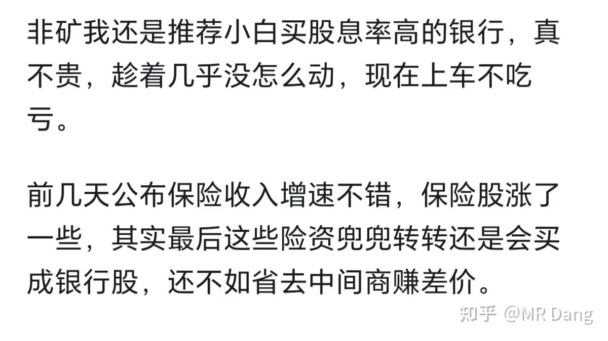
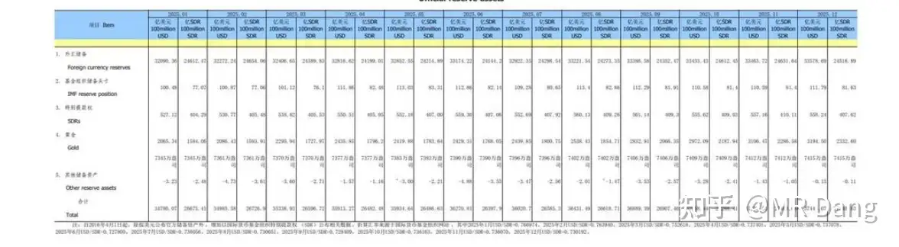

# 如何评价2026年1月8日A股行情？

---

**发布时间**: 2026-01-08 07:11  |  **原文链接**: https://www.zhihu.com/question/1992022909028430120/answer/1992493568435184206  |  **点赞数**: 1043 人赞同

**作者信息**: MR Dang​独立投资人，不接广不卖课

---

## 正文内容

看了一圈昨天的评论区，大家对券商还是有点兴趣的。

那我就随口一说，你也随耳一听。

我不喜欢券商，这个行业论想象力不如科技有色之类的，论股息率也比不过银行什么的。

而且券商板块是典型的指数涨它未必涨，指数跌它一定跌，持股体验及其差，是著名的渣男板块。

拿着券商的投资者，十个里面有九个是口吐芬芳的，另外一个人已经骂的没力气了。

但是，券商有一个好处，凡是那种普天同庆的大牛市来临，券商必定榜上有名。

就是你买了券商，一定不会错过超级全面大牛市，而且大概率跑赢指数。

现在很多读者的心态是，追吧，怕追高，不追吧，看别人吃肉心里直痒痒，就怕一个大牛市来了把自己扔下车了。

像我说的铝王锡王磷王某湖这些，看图形没几个人敢下手的。

那么有没有哪个券商，能让我买了，哪怕亏，我心里是有数的，但是万一碰到超级大牛市了，也同样可以赚个盆满钵满？

有的，兄弟，有的。

这个券商就是DX。

先解释一下什么叫下有保底：

根据公司发布的公告，小东和小达分别都有现金选择权，小东是13.13元，小达是17.79元。

现金选择权就是公司出钱买你的股票，你可以拒绝也可以接受。

现在股价小东是14.08元，相当于最多亏0.95每股，差不多6个多点，不到7个点。

小达是17.92元，相当于最多亏一个点不到。

从安全性上，小达更安全。

那为什么我觉得小东更好呢？

因为目前给出的方案

1小东=0.4373大金，

大金股价现在是36，则1小东隐含价值=36*0.4343=15.6348

比现在股价大概有十个点溢价。

1小达隐含价值=0.5188大金=36*0.5188=18.6768

比现在股价大概有四个点溢价。

所以如果现在买入小东，有三种情况：

1.大盘血崩，股灾来了，大金跌的稀里哗啦，跌到32.4下面，不管跌多少，还选择现金选择权，最多亏损7%。

2.大金没动，最后换股的时候股价保持在目前的36块左右，则赚10%，中途小东若相对涨幅超过10%，则赚相对涨幅，两者取孰高。

3.超级牛市来临，则你持有的小东最低收益为10%+大金相对于36元以上的涨幅或者小东本身的涨幅，两者取孰高。

你也可以理解成现在的小东相当于一份有折价但没利息的可以转换成大金的可转债。

玩可转债的应该知道溢价的可转债满天飞，折价的可转债是稀罕物。

最大的成本就是持有的时间成本，这个我也说不来，参考之前的案例大概是半年左右，中间会停牌两三个月。

大概就是这么个风险收益情况，当然也存在极低极低的概率合并到一半给黄了，那样的话小东还是小东，小达还是小达，根据估值来的话，也是小东更便宜，20pe也不贵。

综上所述，我个人觉得小东更佳，如果你连7%的风险都忍不了，那小达也可以考虑，1%的风险真的很小了。

再次重申，我不喜欢券商，这属于给风险厌恶者一个补票的机会，以防超级大牛市踏空。

什么？看不上券商？想投机？但是还胆子小，不想赔太多，想提前潜伏一下？

难办啊，bro，风险和收益是成正比的，不过你点个赞的话，也不是没办法。

我不爱投机，也不善于投机，所以我只是分享一下我的看法。

就现在这个时间点，马上快过年的的了，趁着这轮牛市很多消费板块还趴在地上，可以买一点了，等春节前放假一两天，或者收假的第一两天就可以出掉给那些后知后觉追热点的，大概率是不错的。

至于买什么，我不荐股哈，纯唠嗑。

一般我觉得过年的旅游，演艺，或者春节档电影，只要便宜，都是不算太坏的选择。

根据自己认知来，拿不定主意买etf也可以。

比如我的认知，春节档我就先问ai，有哪几部电影，电影都叫啥名，主演都谁，出品方都有谁，持股比例都多少，让ai预测票房。

然后找相关公司，看看估值，看看历史春节表现，盘算一下买点卖点，提前做个计划，最后买一点点，不为发财，就为赚个电影票，体验下年味。

现在不布局电影，等年二十八了想起来追了，黄花菜都凉咯，纯纯大冤种。

要是连哪个电影能爆都看不出来，那可以买一点儿童动漫全家欢的那种，两只大狗熊，每年闷声发大财，就是在新三板，一般人买不了，有二百万资金要求。

再次重申以上非荐股，只是分享一下思路，投机也要讲方法的，不能光凭勇气。

东大又出组合拳，一巴掌接一巴掌往对面脸上招呼。

昨天没参与投机，错失光刻胶20厘米，要说遗憾么，还真没有，因为谨慎已经帮我躲过了很多次坑。

这种事情就是要积累经验，只要核心的判断分析能力在，每年会有很多次这样的机会。

很多人心态稳不住的原因就是：

错过→后悔→追→套住→过错→更加后悔→挫败感→类似机会→犹豫→错过→再次循环

至于这个二氯硅烷利好哪家企业，最简单的判断方法就是谁状告的就利好谁，无利不起早嘛，就和本格推理里面找嫌疑人一样。

央妈预告11000亿逆回购，刚好和到期的一样，相当于净投放0，符合预期。

平安举牌农行h，先买它3000多亿银行股以示敬意。

前天其实我说过，险资最后会买成银行股，这是明牌：

根据最新的保险资金数量测算，可能今年险资最低要新买8000亿到一万亿的股票。

险资它是要给客户分红的，总不能坐吃山空吧，也不可能拿这钱去买热点吧，没多少选择，买银行就是最稳的。

普通人买保险其实就是买个承诺，相信保险公司的信誉，保险公司买银行股也是相信银行股会稳定分红，但是普通人直接买银行股反而担心银行不稳定分红。

很神奇的一件事，保险公司赚的就是这个信息不对称的钱。

外汇管理局发布最新储备，央妈又增持三万盎司黄金。

上个月也是三万盎司，连续14个月增持了。

散户可以学着点，定投的正确姿势。

目前的态度就是买还是要买的，但是价格高，就买少一点意思意思。

昨晚几乎所有主要大宗商品都在回调，回调幅度大部分在一两个点，包括金银铜铝这些。

锡跌的少，0.2%微绿。

今天有回调压力。

但是资本市场也说不来，金银这些东西喘两口气再继续暴揍空头的几率也不小。

这个位置也不建议随便加仓了，挺高的点位。

记得之前说一个股票的时候，我说这股票的走势不像自然走出来的，人为痕迹很明显。

当时有投资者问怎么看出来的？

我说就像大草原上的双开门电冰箱一样，看一眼就知道不是大自然的鬼斧神工。

现在的大盘就有点草原冰箱的意思，被拿捏的恰到好处。

拿不住就止盈，盈利放在任何时候都是光荣的，哪怕你卖了以后涨了十倍百倍。

点位不低，一定一定注意风险，就现在某些东西的估值，一旦套进去，要想出来可能是下一轮生肖马年了，可以拿去当传家宝的。

一个喜欢保护韭菜的博主，希望大家少少踩坑，多多赚钱！！！

---

> [!comment]- 点击展开评论
> | 用户 | 时间 | 内容 |
> | :--- | :--- | :--- |
> | 阑干 |  | 老师早，我帮大家收集了资料：公司 代码 收盘价(元) 涨跌幅 总市值(亿) 核心关联影片光线传媒 300251 16.76 -1.06% 491.67 《镖人：风起大漠》中国电影 600977 15.80 +0.96% 294.99 《惊蛰无声》《欢迎来龙餐馆》万达电影 002739 11.36 -0.44% 239.90 《镖人：风起大漠》《神探之痕迹》横店影视 603103 17.72 +3.02% 112.38 《飞驰人生3》《熊出没》博纳影业 001330 7.70 +1.45% 105.84 《飞驰人生3》《镖人：风起大漠》猫眼娱乐http://1896.HK10.28（港元） -1.25% 128.5 《飞驰人生3》《欢迎来龙餐馆》阿里影业http://1060.HK0.89（港元） 0.00% 218.7 《惊蛰无声》《少林女足》等按每部影片整理主控/联合出品上市公司与节前-节后股价弹性测算，用数据快速对标。影片×上市公司×弹性速览（2026春节档）• 注：弹性为区间估算，基于当前热度、历史档期规律与分账模型，非实际承诺；主控>主投>联合出品>发行，弹性依次递减。1. 《飞驰人生3》（35-40亿）◦ 主控/主投：亭东影业；关联上市公司：博纳影业(001330)（持股亭东9.3972%）、阿里影业(http://1060.HK)（持股亭东8.9758%）、猫眼娱乐(http://1896.HK)（主控发行）、中国电影(600977)、横店影视(603103)◦ 弹性：节前+10-15%，节后±5%（超预期40亿+可至+10%；不及30亿或-8%）；博纳/猫眼弹性最大2. 《惊蛰无声》（30-35亿）◦ 主控/主投：阿里影业(http://1060.HK)、中国电影(600977)（联合出品+发行）◦ 弹性：节前+8-12%，节后±4%（超35亿+可至+8%；低于25亿或-6%）；阿里影业弹性略大3. 《转念花开》（25-30亿）◦ 主控/主投：大碗娱乐；关联上市公司：光线传媒(300251)、阿里影业(http://1060.HK)◦ 弹性：节前+6-10%，节后±3%（超30亿+可至+6%；低于20亿或-5%）；光线传媒弹性更大4. 《少林女足》（20-25亿）◦ 主控/主投：星辉海外；关联上市公司：阿里影业(http://1060.HK)、腾讯影业（未上市）◦ 弹性：节前+5-8%，节后±2%（超25亿+可至+4%；低于18亿或-4%）；阿里影业弹性有限5. 《镖人：风起大漠》（28-33亿）◦ 主控/主投：光线传媒(300251)、博纳影业(001330)、万达电影(002739)◦ 弹性：节前+9-14%，节后±4%（超33亿+可至+8%；低于25亿或-7%）；光线传媒弹性最大6. 《欢迎来龙餐馆》（18-22亿）◦ 主控/主投：坏猴子影业；关联上市公司：猫眼娱乐(http://1896.HK)、中国电影(600977)◦ 弹性：节前+4-7%，节后±2%（超22亿+可至+3%；低于15亿或-3%）；猫眼弹性略大7. 《神探之痕迹》（15-20亿）◦ 主控/主投：万达电影(002739)、阅文集团（未上市）◦ 弹性：节前+3-6%，节后±1%（超20亿+可至+3%；低于12亿或-2%）；万达弹性有限8. 《熊出没·年年有熊》（12-15亿）◦ 主控/主投：华强方特（未上市）、横店影视(603103)◦ 弹性：节前+2-4%，节后±1%（亲子刚需，波动小）关键规律与风险• 主控/主投是票房弹性核心，联合出品分账占比低，股价影响有限。• 档期前：强预期驱动提前上涨，主控+爆款标的弹性最大（如光线、博纳）。• 档期后：多"利好出尽、冲高回落"，仅超预期爆款能持续支撑股价。• 风险：非主控标的、票房不及预期、宣发拉胯，均会压缩弹性甚至转负。 |
> | 朱大头 |  | 太好了，又要到饭了，兄弟们！ |
> | 乌获 |  | 1月8日A股行情1.券商揭晓结果为dxzqa.保底逻辑：现金选择权现金选择权价格13.13就是如果你反对合并案 公司可以按这个价格买你的股票相对于dxzq前日收盘价14.08 这个保底价最多亏0.95元/股若股市大跌 zjgs股价下跌至32.4以下，不管跌多少还是选择行权，最多亏7%这个32.4应该是dxzq当前市价对应的zjgs股价盈亏平衡点（14.08\0.4373=32.19），意思就是如果zjgs的股价低于它，换股价值就低于14.08这个买入成本。＊行使现金选择权有四个条件·在dxzq审议本次合并的股东大会上，必须对相关议案投出"有效反对票"·从上述股东大会的股权登记日起，一直到现金选择权实施日，必须继续持有投反对票的股份·在后续公司公告的申报期内，按规定程序成功申报行权·拟行使权利的股份不能存在质押、冻结等权利限制情形个人感觉dx最后应该用不上行权，但券商毕竟渣男体质，有个行权资格还是好的！然后这个13.13得行权价有调整机制，就是在市场和个股双重大跌的时候触发，调整价格以触发后的最新收盘价为准，可能高于也可能低于当前的13.13元，这是极小概率事件，目前牛市可以忽略。b.盈利弹性·盈利逻辑：zjgs合并股价36.91dxzq合并股价16.14则1dxzq=0.4373zjgszjgs当前价格36元，则dxzq隐含价值36*0.4373 = 15.743元dxzq当前市场价14.08元 较隐含价值低15.743-14.08 = 1.663 存在约1.663/14.08 = 0.118的折价·若zjgs股价不变 维持在36元左右则换股后dxzq每股15.743元 收益率10%左右中途若dxzq上涨超过10% 则取更高·若zjgs股价上涨，则换股价值随之提升持有dxzq的收益为至少10%➕zjgs相对于36元的涨幅中途若dxzq自身涨幅更快更大 则可在合并前卖出直接获取此收益证券市场真的非常有意思啊！感觉是很多聪明人在这里发明了许多有趣的游戏！这么多玩儿法！2.热点投机老师之前有篇文章《投资新手避坑指南之追热点（万粉特别贡献》里面有根据时间点追&逃的干货要善用AI3.大宗回调啦！昨晚睡前看到在跌我都有点激动的睡不着觉！希望这几天有机会建仓➕补仓又是学到新东西的一天哦学习笔记为个人理解&信息整理 如有错漏恳请指出感恩老师的贴心分享 |
> | 广东顺德分Dang |  | 控制风险是当前首要任务，盈利永远是正确的选择 |
> | 悠然 |  | 每天把你当新闻早报了，上班第一件事就是看你的帖子.. |
> | 蛋宝 |  | 挣钱比上班重要 |
> | 三哥数签签 |  | 昨天看你说了一嘴，在评论区对dx点了个头，马上就去把dx在12月18日公告下载回来完整的读了一遍，中午收盘之前，就把原来持仓的证券etf全部平替为了dx。今天早上看你的评论，和我的分析结果一模一样，非常骄傲，开始摸到你打鱼的技术了。 |
> | &nbsp;&nbsp;&nbsp;&nbsp;MR Dang |  | 厉害 |
> | 富贵有钱花 |  | Dx是啥呀 |
> | 三哥数签签 |  | dxzq |
> | 富贵有钱花 |  | 这个吗？ |
> | 如来熊掌 |  | 现在我都是把评论都看完再说话了，不然指不定就会错意了，感觉昨天市场就有分歧了，今天什么走势很不好说。 |
> | Iris |  | 今天再入点华夏银行 |

---

*本文件由自动脚本从MR Dang知乎页面提取生成*

---

**作者**: MR Dang
**链接**: https://www.zhihu.com/question/1992022909028430120/answer/1992493568435184206
**来源**: 知乎

*著作权归作者所有。商业转载请联系作者获得授权，非商业转载请注明出处。*

---

## 相关阅读

**📅 每日行情评价（相邻日期）：**
- [[20260107-如何看待2026年1月7日A股行情？]] - 1月7日行情回顾
- [[20260109-如何看待2026年1月9日A股行情？]] - 1月9日行情分析

**📚 相关主题：**
- [[20251106-怎么投资银行股，并获取银行股股息收入？]] - 银行股投资方法
- [[20251008-黄金涨的这么疯狂，是代表了纸币飞速贬值还是已经商品化了？]] - 黄金投资逻辑
- [[20251011-下周一股市就要大跌了，作为投资者该如何应对？]] - 市场下跌应对策略

**💡 投资方法教育：**
- [[20251020-交易策略只是第一步，重要的是仓位管理？如何科学设置仓位？]] - 仓位管理的重要性
- [[20251016-投资新手避坑指南之追热点(万粉特别奉献)]] - 追热点避坑指南
- [[20251111-明明长线比短线更容易赚钱，为什么散户更加执着于做短线？]] - 长短线投资策略

**📖 系列文章：**
- [[韭菜保护合集]] - 投资避坑指南
- [[投资方法教育]] - 投资方法系列
