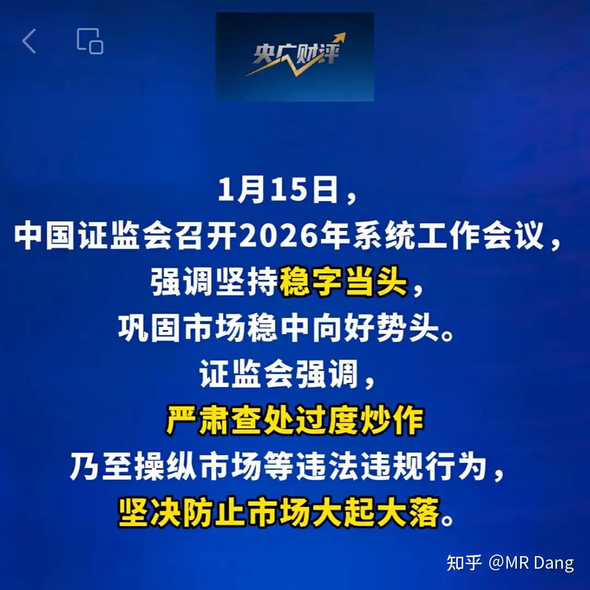
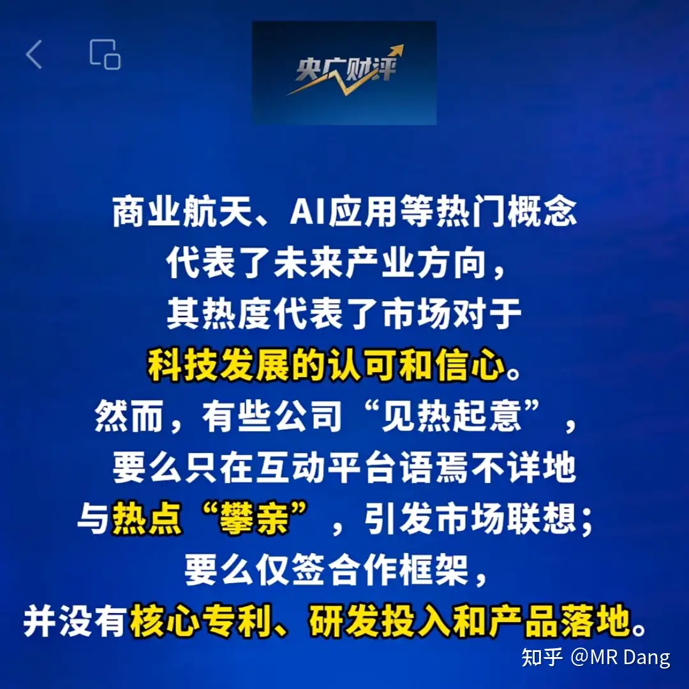
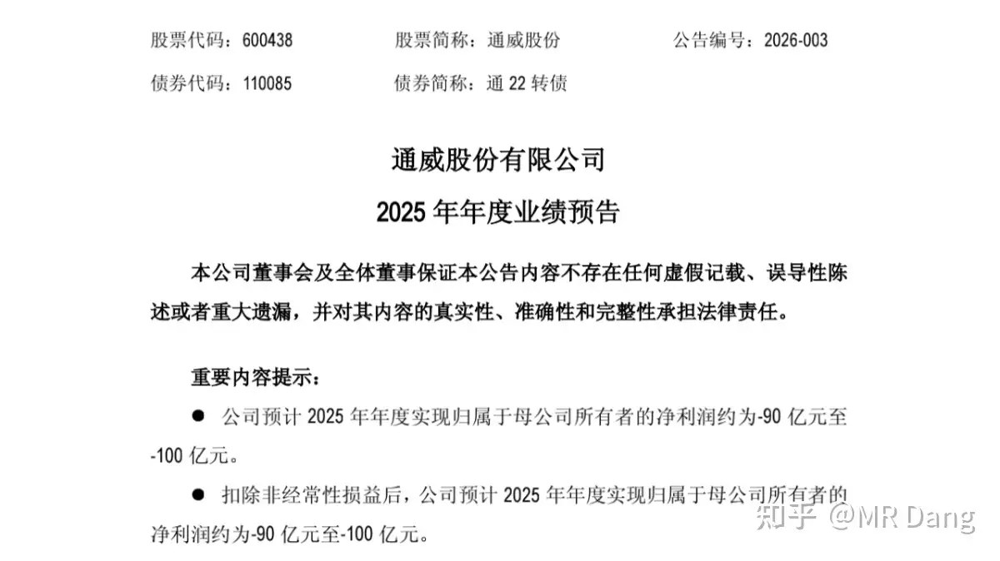
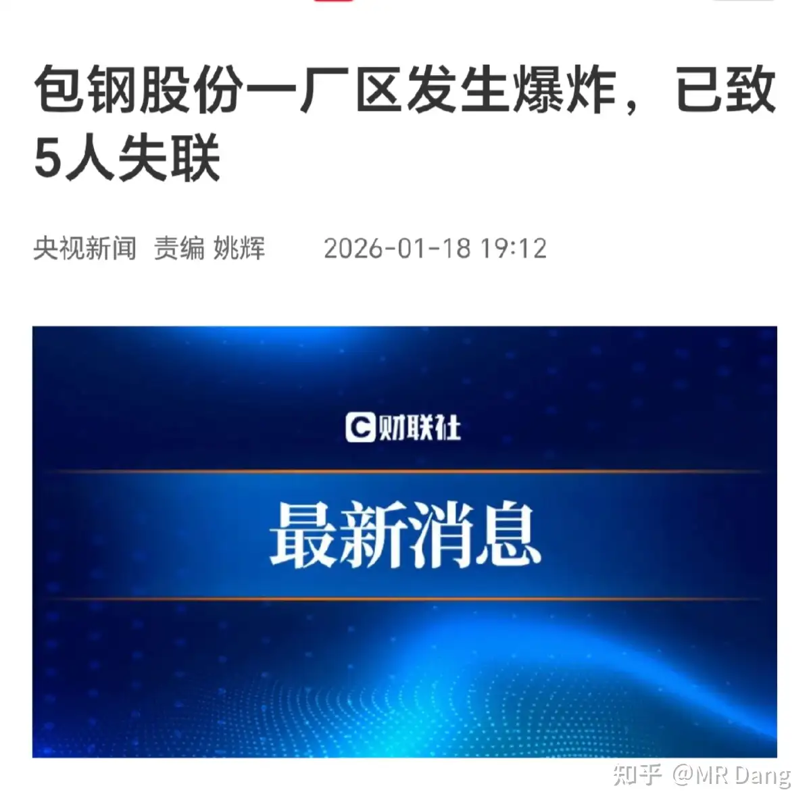
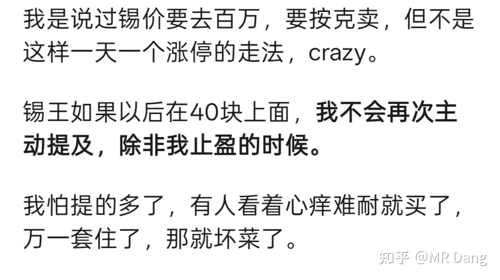

# 对2026年1月19日A股市场行情，大家有什么预测和看法？

---

**发布时间**: 2026-01-19 07:04  |  **原文链接**: https://www.zhihu.com/question/1995416759285610119/answer/1996478085814588412  |  **点赞数**: 1248 人赞同

**作者信息**: MR Dang​独立投资人，不接广不卖课

---

## 正文内容

新的一周又开始了，先来看一下官方最近的表态：

这个是央广网转达的zjh态度。

很多大v心领神会，开团秒跟，就冲着跳的最高的其他大v开撕了。

我对这些事情没兴趣，自己不踩坑就行了，但是央广网后面的财经评论必须看，我截图给你们：

我个人的理解就是：商业航天行业✓，蹭概念×；价值投资✓，价格投机×；龙头✓，后排杂毛×。

我一直以来也是这个态度，不过我的看法更加保守，我觉得目前市面上的标的都不够纯，所以一直在等没上市的蓝箭航天。

像这种热门概念我不爱讨论，因为我不参与，讨论就是浪费精力。

但是怎么说呢，看到后台有些留言，有点绷不住。

有的投资者已经吃了三个跌停，而在此之前甚至还没吃上肉，看到长三乙和谷神星二号的新闻，觉都睡不好。

更加难绷的是，本来为了分散风险，还特意买了多个股票，结果几只股全部跌停。

事已至此，我也没什么好的办法，因为相关标的我是一个都不了解，所以只有两个建议给到有类似情况的宇航员：

避免踩坑的重要性，这是我之前写过为什么要避免类似情况的原因，希望可以认真看下，防患于未然。

但是事情已经发生，那就早早去挂跌停单，争取排到前面，可以快点跑掉，把这学费交了以后就不要再踩坑了，一定要改正自己的交易习惯啊。

（周末又去海底捞了，上次的看台服务员变身宇航员，亏了大概四万，眼泪差点掉下来，上班也恍恍惚惚，说不知道原来股市这么凶险）

光伏产业哼哈二将：

还是那句话，内卷的行业不要碰，不要去赌那个唯一的拐点，不值，这两家直接抬走就行了。

其他发布业绩的公司如上图，没有我太关注的标的。

机器人产业：

今年春晚的多个分会场都有机器人，机器人顶替人类的第一份工作可能就是舞蹈演员了。（笑）

去年春节后机器人板块表现可以，今年想如法炮制的话，得注意时机，别被算计咯。

一家公司因为吹牛被立案：

吹的牛太大了，以至于圆不过来，我很怀疑管理层是不是对千亿没什么概念，非常草台的感觉。

宁王这波操作也比较败好感，会让人有诛心的想法。

突发事故：

这种事情，不想多说，我没一手消息，以官方发布为准。

我只是觉得这标的，以我庞大的读者基数，持有的也不算少，看到这里，赶紧去挂跌停单，不想卖了还能在九点20之前撤单，给自己留一个逃生通道，切记切记，当个事去办。

你要让我分析利空程度，那我个人觉得一个跌停不一定兜得住，倒不是说赔偿什么的，怕的是停工整改检修，这时间很难说的。

唉，给遇难的同胞献上一束赛博鲜花，人已经走了，只希望他们的家人能获得妥善安置。

商品市场：

锡价大幅回落

这个不意外， 前几天我说过锡的价格在短期内有点超买：

现在只是回落到了超买之前的价格。

即使按照我预测的，六七年内锡价可以从30 多万涨到百万之巨，那算下来平均年复合涨幅也只有18%到20%左右，像之前那样的疯涨是很难持续的。

所以锡王股价上40的时候，我不但提示大家需要止盈：

而且劝告大家不要买，甚至40以上不提它了，就怕有人套住。

我不是预言家，我也不知道它一定会怎么样，否则我自己就做差价了。

但是那个位置如果衡量风险和收益的话，它的性价比明显不如之前高。

那现在股价又到了40之下，我又可以提一提了。

看锡价猜股价的话，今天肯定是承压的。

想抄底的，布局的，一定要想好套住了自己有没有信仰，能不能抗住，它和银行不一样，股息率低，意味着对你的操作要求更高，容错度更低。

目前这个价格，如果实在想买的，也一定要控制好仓位，最多5%，不能再多了，毕竟是下落的飞刀，不好接，一般情况我是不会接的。

而且要做好买了以后股价又回调到30下面的心理准备，接受不了的话就不要买，股价这事情没有什么不可能，做投资最怕不留后路，一厢情愿。

当然再次重申鄙人不善择时，以上不构成买卖建议，仅仅是风险提示。

其他有色金属也均有不同程度的下跌，不过我得提醒一下大家，看期货价格决定有色股的买卖是大忌，容易赚小钱亏大钱。

塑料王后续：

想了想还是舍不得卖，打算买一点布王对冲原油价格波动的影响。

大概的逻辑可以讲下，以后有机会了也可以展开。

塑料王作为生产资料，它的特点是用煤省油，相当于是一个煤炭→原油的大型生产资料，所以盈利靠的是油煤差价。

煤这边的价格是有预期的，长期宽松。

所以不确定性就是油价，油价越贵越受益。

而布王作为生产资料，它的特点是用的是"油"，产出的是"布"（poy），中间有个重要产物叫pta，这个先不用管。

那原油既然是制造原材料，油价越便宜越受益。

一个是煤→油，一个是油→布，两个组合起来就成了煤→布，直接把原油的影响排除了。

煤这边，长期宽松。

布这边，还记得那个中间的产物pta么。

这个pta目前反内卷进行时，总量严格控制，被约谈后集体控制产能，减少10%，2026全年没有新增产能。

也就是制造布的原材料被卡死了，所以布的供应量也被卡死了，有点像当年的铝。

这个组合最后就成了一个用煤制造布的神奇生产资料，而且生产的产品预期不错，下有保底，原料煤的价格中短期内没有大幅涨价的忧虑。

至于谁是布王？

这个我也不知道，我也是无意间问ai，哪家公司是poy全球第一才知道的。

以上非荐股，布王现在价格也挺高的，特别是如果按照估值来说的话，处于历史高位。

但是选布王也不是乱选的，布王目前442亿市值，我测算了一下，以目前的反内卷力度，去年今年明年的业绩大概分别是20，30，40亿。

去年已经过去，可能过几天还会有业绩预报，因为2024是12亿利润，去年如果是20亿，增速超过50%了。

今年如果达到30亿的话，增速又能超过50%了。

按照今年30亿利润估值，就只有15pe不到，对应连续两年50%以上增速，很不错了。

布王+塑料王这个组合名字我也琢磨好了，就叫BT组合，希望能延续紫菜组合的辉煌成就。

当然这个组合还有缺点，就是煤虽然长期宽松，但也不是百分百确定的，万一煤涨价了，还是会影响到组合的表现。

那你有这方面的担忧的话，就再加一个煤王，就成了一个空手变布的组合，最纯粹的生产机器。

我个人不建议哈，有可能会拉低收益率。

这就是投资组合的魅力，通过不同模块的组合，创造出现实世界里不存在的公司。

布王这行其实还有个布老二也不错，比布王只差一点，但是布老二的新增产能在埃及，我觉得周围容易出事，不安全，就放弃了，只考虑布王。

再次重申，不是荐股，目前位置高，我在蹲合适的入场时间，不要想着大v提了，股价就会涨，我抢跑去赚个差价什么的。

一定是价值投资，买的是远期成长，买的是组合对冲，不是互掏口袋的游戏。

最近存储涨的不错，快到止盈线了，有点舍不得，因为确实是超级周期，直觉告诉我能赚不少，翻倍也不是不可能。

存储的逻辑就是ai行业以存代算会催生大量新增需求，美光目前动作频频，还有海力士认为到2028下半年之前都会紧缺，这样算下来超级景气周期还有28个月左右。

考虑到海力士有利益相关，给他的话打个五折可信度，那就是14个月，起码到明年年初了。

但还是那句话，原则就是原则，不能随便搞特殊，如果给我合适的机会我还是会止盈大部分的，最多最多留百十手纯利在里面意思一下，已经是对它格外优待了。

本周前瞻：

1，今天公布全年gdp，这个应该没大的悬念，但是发布会可以盯着看一下，说不定会有什么有用的信息。

2，明天公布1月lpr

3，后天欧洲央行议息结果发布，最近因为岛的问题和西大有点新闻，不知道会不会影响到货币政策。

4，周五日央行公布利率决议，目前0.75%了，再加就不合适了吧。

上周各类宽基etf明显有大量资金净流出，事后统计大概有接近两千亿，再结合各种媒体的宣传代表了什么不言而喻，对应的上证指数是4200不到。

上上次这么明显的信号是去年12月17日etf有神秘资金大幅流入，对应的上证指数大概3800多一些。

千万不能只看表象就简单的理解成神秘资金是在4000点±200点高抛低吸做差价割韭菜，这个只能说是。。emm，维护资本市场长期健康发展，我们要的是长牛，健康牛，不是疯牛，更不是熊。

一个喜欢保护韭菜的博主，希望大家少少踩坑，多多赚钱！！！

---

> [!comment]- 点击展开精选评论
>
> | 用户 | 时间 | 内容 |
> | :--- | :--- | :--- |
> | 奥特之父 |  | 桐昆我去年一月布局，今天止盈。老板认识，嘉兴人。 |
> | 阑干 |  | 老师早上好塑料王宁夏宝丰能源集团股份有限公司，A股简称宝丰能源，股票代码600989.SH，是一家高端煤基新材料全产业链上市公司，主营煤制烯烃等现代煤化工产品。布王桐昆股份（601233） 是当前全球POY（涤纶预取向丝）产能与产量的第一大公司，其POY产能和产量长期位居全球首位，2023年POY产量占公司涤纶丝总产量的76.2%，全球市场份额约15%。其旗下涤纶长丝年生产加工能力达1050万吨，POY作为核心产品，广泛应用于下游加弹、织造等领域。今日学到了高阶投资组合，煤变布，果然跟着大师能够迅速升维视野 |
> | 瑞锐 |  | 老是提慢牛，每次都联想到之前和我说她是个慢热的妹子，感觉她只想把我当ATM |
> | &nbsp;&nbsp;&nbsp;&nbsp;MR Dang |  | 哈哈哈哈，好联想 |
> | 乌获 |  | 今日部分学习笔记【看期货决定有色股的买卖是大忌 容易赚小钱亏大钱】a.首先期货投资和股票投资交易的标的物不同期货：标准化商品合约-价格直接由该商品的即时供需关系（核心）、库存、宏观预期等决定。股票：交易的是一家上市公司的所有权-股价反映的是这家公司未来所有现金流的折现价值，也就是未来这个公司值多少钱。这个价值取决于其盈利能力、成长性、管理层、行业地位等因素（比如成本控制能力、是否自有矿山、产量&amp;产能、财务结构、技术能力等等）。有个例子就是大宗商品价格下跌，但是上游龙头反而在竞争中有优势，在低谷期依然坚韧，反而因为竞争导致行业出清，提高行业集中度，下跌周期过去后上游龙头更加一飞冲天（未来现金流的折现值高）。b.同样的大宗商品价格 对该行业的公司影响不同原材料（商品）价格上涨，对下游加工企业是成本，会侵蚀利润；但对上游采矿企业则是收入。c.有利好出现时，期货价格可能瞬间暴涨，当商品期货价格已经涨起来，你去买股票，很可能股票已经随涨一波了，这时买入，正好是"预期兑现"的阶段，后续上涨不一定能继续，可一旦商品价格回调，股票跌幅可能更大！就算能赚钱，也是高难度、高风险的短线交易，一般还是赚小亏大、赚少赔多！因为商品涨，股价可能不涨甚至下跌。比如虽然铜价上涨，但某家铜业公司自身矿井发生事故停产，或者财务成本飙升，导致其盈利前景恶化。另外商品价格在高位时，市场对相关上市公司的盈利预期也达到顶峰，估值处于高位。一旦商品价格出现下跌或者只是停止上涨，高估值的股票就可能出现"杀估值"，跌幅远大于商品期货的跌幅。因为相对于交易商品的期货，股票交易的是被过度乐观预期的"未来"（股票主要是交易预期，而且充满想象力。这种预期和想象力其实很不牢靠。）同时，过度关注期货价格，也忽略了股票的"个股风险"，比如公司治理问题、政策风险、项目不能如期落地等等。这些风险是期货所没有的。d.期货自带高杠杆，波动剧烈，这实际是放大了趋势。如果带着"趋势很强"的错觉去交易股票，容易忽略股票市场更为复杂的定价机制和相对期货较慢的节奏。【如何利用期货价格选择优秀的股票】a.将期货价格作为重要的行业景气度指标：长期来看，商品价格上涨有利于整个行业，是筛选赛道的好工具。但具体买哪个公司，需要深入研究其基本面。b.分析价格传导机制：思考"当前的商品价格上涨，对产业链上、中、下游哪类公司最有利？利润能增厚多少？例如锂价上涨对锂矿商是直接利好，但对电池制造商是成本压力（除非其成本能顺利传导至更下游，否则压缩其利润空间）。c.关注公司的"套期保值"策略：很多矿业公司会做套保，以锁定未来售价，平滑利润。这会导致其业绩与当期商品价格不完全同步。不了解其套保头寸，单纯看期货价格会严重误判。"套保"就是约定一个未来的售价，这样起码不会亏钱，但同时如果未来商品价格大涨，也和你没关系。铝王就是个典型例子，这会损害股东的利益。d.分清"贝塔行情"和"阿尔法行情"·贝塔：衡量的是投资组合（或个股）相对于整个市场（或基准指数）的波动性or敏感性。是一种系统性、普遍性的行情。高贝塔个股就是高波动（相对于大盘涨跌1%时，其倾向于涨跌超过1%）。低贝塔个股就是波动小于市场，更平稳。贝塔行情：就是由市场整体或行业板块的普遍性力量驱动的行情，在这种行情中，几乎所有相关股票都同向运动（整个行业因商品牛市普涨时可以买行业ETF）。那么在期货市场出现一轮强劲的商品牛市时，它会拉动整个有色金属行业景气度上升，形成行业贝塔行情。这是，行业里大多数公司股票都会上涨，无论它们自身经营是好是怀。跟随期货价格买股票，本质就是想抓住这个"行业贝塔"。这种收益是被动的。·阿尔法：衡量的是相对于贝塔收益的超额收益。它是独立于市场波动，由投资人或公司自身能力创造的收益。阿尔法行情：就是某个特定股票或基金，因为它自身的独特优势，走出了超越大盘、超越同行的独立行情。对公司来说，就是卓越的管理层、颠覆性的技术、强大的品牌、极强的成本控制能力（这在资源行业至关重要）。这种公司即使在行业低迷（负贝塔）时，也能通过抢占市场份额、维持较高利润率而保持相对强势；在行业普涨时，它涨得更多。这种收益是主动的。被动的贝塔行情会结束，而公司的成长性和盈利能力可以通过主动的努力来保持。同样是有色企业，A公司拥有全球最低成本的矿山、技术先进、且管理层聪明务实。B公司矿山品位低、成本高、管理混乱、财务不健康。在"商品涨价"这个贝塔到来时，A公司因为其自身的阿尔法属性，股价涨幅会远超行业平均，而B公司则是勉强跟涨，甚至因为自身问题不涨反跌。当商品价格回调时，A公司抗跌，而B公司可能暴跌！要在行业景气中，通过深入研究找到那些成本优势最强、管理最优、成长性最好的个股，它们能获得超越行业的涨幅。同时，也一定是在上行周期中找强势股，优中选优。而不是在下行周期中找不知何时才来的修复拐点。个人理解 如有错漏 恳请指出 |
> | &nbsp;&nbsp;&nbsp;&nbsp;MR Dang |  | 学习了，真棒 |
> | 乌获 |  | 哇哇哇 谢谢老师夸奖 |
> | lucky |  | 热泪盈眶刚才刷了半小时都没看到，感觉失恋了一样 |
> | &nbsp;&nbsp;&nbsp;&nbsp;MR Dang |  | 看到你留言了，没来得及回 |
> | 见相非相 |  | 哈哈哈，一样的感觉 |
> | lucky |  | 看到帖子立刻特别开心哈哈哈，早上没看到真的是坐立不安。估计是审核太久了。我这边看到帖子就已经显示1h前发出的了 |
> | lucky |  | 是吧是吧，真的是瞬间开始胡思乱想，整个就是失恋了一样 |
> | 出世的忍者 |  | 昨天没更新，比老婆不回消息都难受 |
> | 斜日寒林 |  | 来了Dang大这里说的"布"是涤纶长丝，poy是主要品种，龙头是桐昆股份，国内市占率超28%，在埃及建厂的行业第二是新凤鸣，市占率超12%。宝丰能源加桐昆股份首字母合起来就是BT，再加上之前提到的煤王中国神华就是虚拟全产业链的公司 |
> | 广东顺德分Dang |  | 看期货价格决定有色股的买卖是大忌，容易赚小钱亏大钱。    这是大佬实战出来的 |
> | 南辰 |  | byd老师都说了买股票要一手雨天一手晴天，怎么还有人同时买雨伞雨衣雨鞋 |

---

*本文件由自动脚本从MR Dang知乎页面提取生成*

---

**作者**: MR Dang
**链接**: https://www.zhihu.com/question/1995416759285610119/answer/1996478085814588412
**来源**: 知乎

*著作权归作者所有。商业转载请联系作者获得授权，非商业转载请注明出处。*

---

## 相关阅读

**📅 每日行情评价：**
- [[20260120-如何评价2026年1月20日A股行情？]] - 宏观数据解读与有色强势
- [[20260121-如何评价2026年1月21日A股行情？]] - 夺岛奇兵与商品市场
- [[20260122-如何评价2026年1月22日A股行情？]] - 铝王移仓操作实录
- [[20260116-如何评价2026年1月16日A股行情？]] - 市场调整观察

**🏭 行业板块分析：**
- [[20251102-《天阶功法卷四》磷化工投资价值分析]] - 磷化工深度解析
- [[20251104-《天阶功法卷五》DSL投资价值分析]] - 药店行业分析

**💡 投资方法教育：**
- [[20251023-价值投资的误区有些什么？]] - 避免价值投资陷阱
- [[20251011-下周一股市就要大跌了，作为投资者该如何应对？]] - 市场下跌应对策略

**📊 宏观与资产配置：**
- [[20251028-央行将研究实施支持个人修复信用的政策措施，此举对我国社会信用体系建设有何意义？]] - 央行政策影响
- [[20251013-2025 年诺贝尔经济学奖授予创新驱动型经济增长，技术进步如何帮助经济成长？]] - 技术进步与经济

**⚠️ 风险警示：**
- [[20251016-投资新手避坑指南之追热点(万粉特别奉献)]] - 热点炒作风险警示
- [[20250929-如何看待寒武纪股票的未来前景？]] - 个股风险案例分析

**🔙 返回：**
- [[每日行情评价]] - 全部行情评价文章
- [[MR Dang 知乎文章总览]] - 返回主目录
