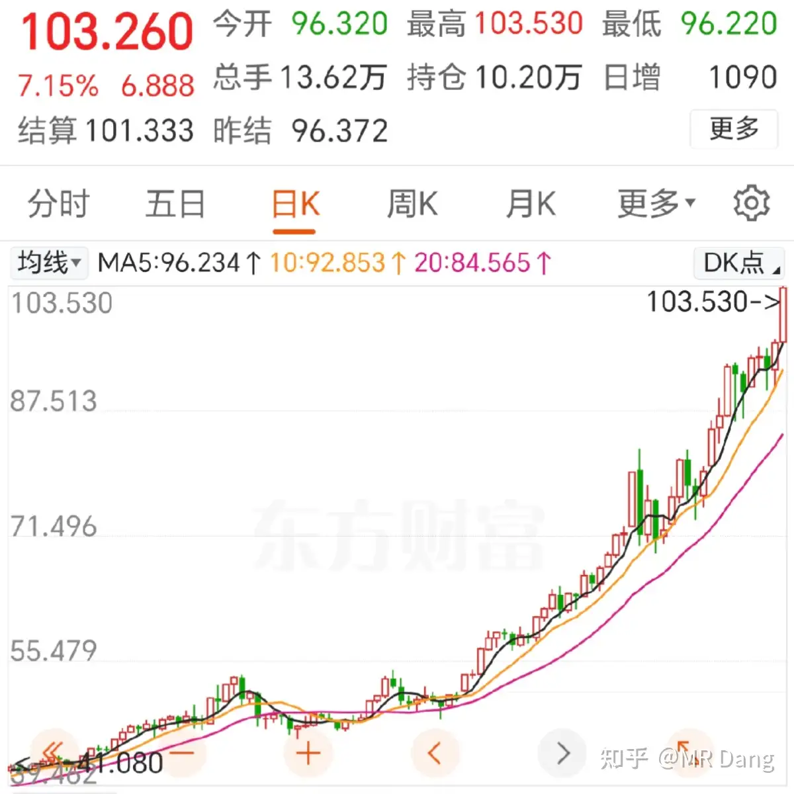
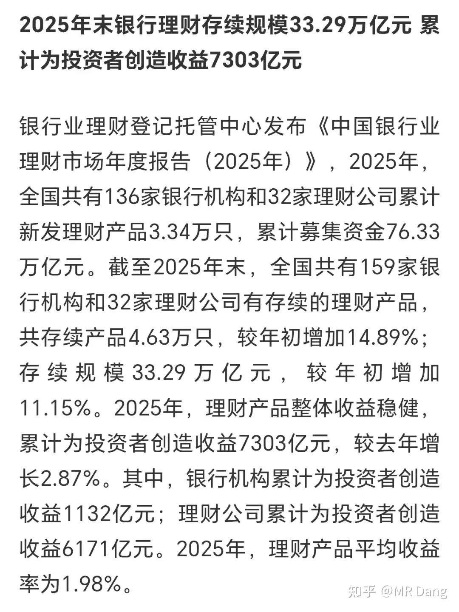
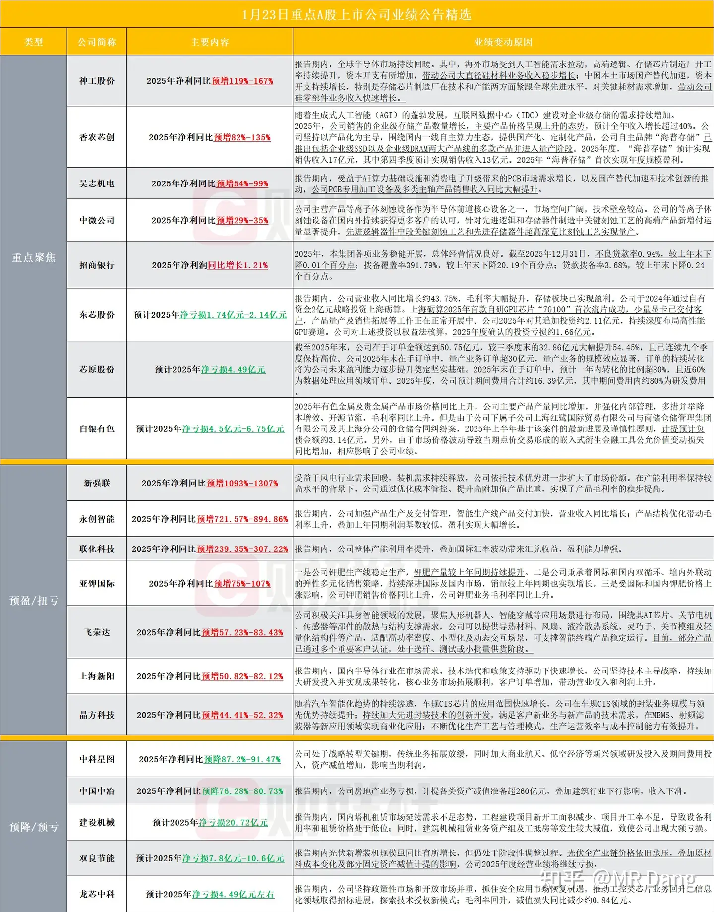
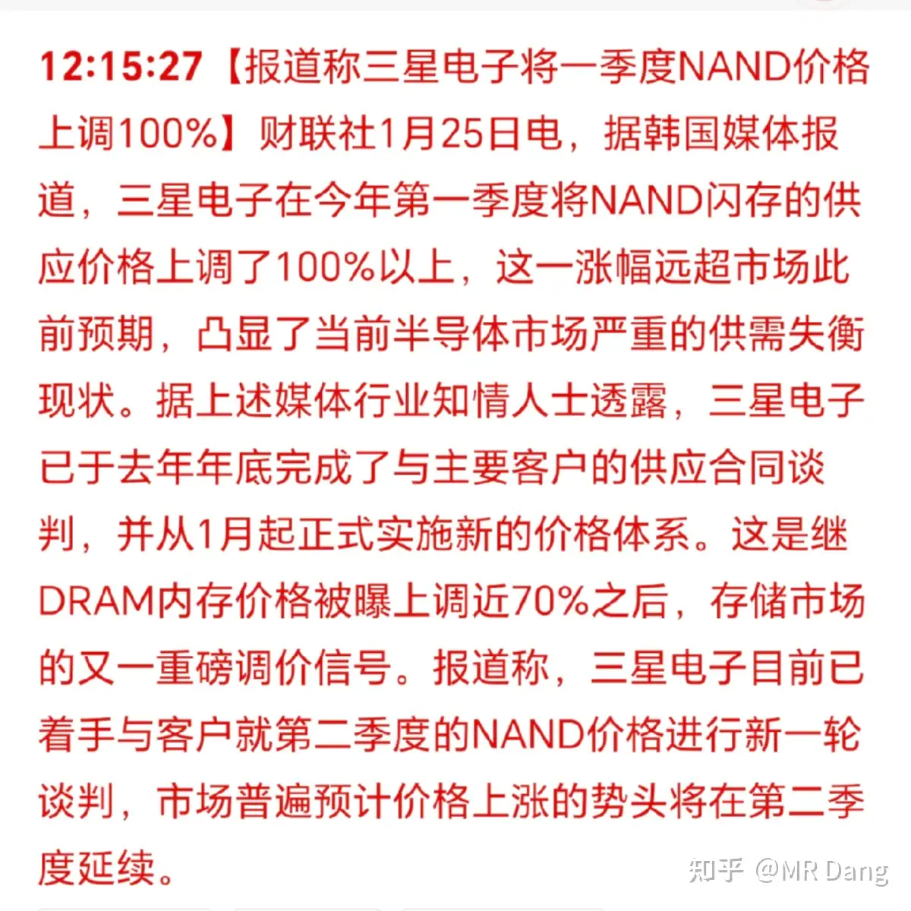
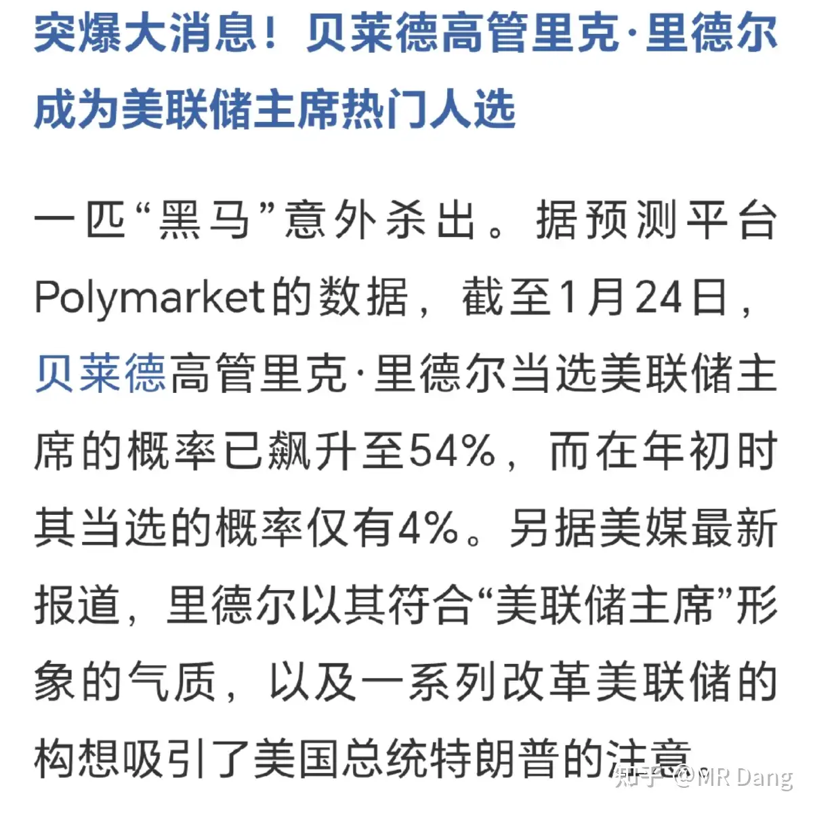
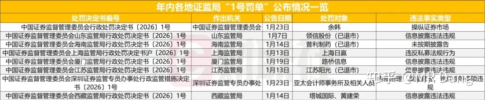

# 如何看待2026年1月26日A股行情？

---

**发布时间**: 2026-01-26 07:05  |  **原文链接**: https://www.zhihu.com/question/1996701644986024611/answer/1999014945770210829  |  **点赞数**: 1689 人赞同

**作者信息**: MR Dang​独立投资人，不接广不卖课

---

## 正文内容

从上个周末到今天，又发生了不少事情，咱们抽丝剥茧捋一捋。

头条给到大宗商品：

白银站上100，涨了7个点，创历史新高：

铂也是长阳后创历史新高：

物以锡为贵，锡创历史新高：

黄金逼近5000大关，创历史新高。

铜和铝，包括原油等都有所表现。

碳酸锂这块儿，有市场研究称宜春地区锂矿复产不及预期，受到尾矿处理要求影响，有可能推迟到2026下半年，进而加剧碳酸锂短期供应紧张态势，这种短缺可能是结构性的。

期货品种增加：

其中镍的期货+期权应该是关注度比较高的，除此之外px，pta都是很重要的品种，20号胶是做轮胎的重要材料，是天胶产业链的重要一环。

波斯被针对是贵金属起飞导火索之一，西大带着飞机的船已经在靠近波斯：

海贼王展示了自己上一轮的战利品：

白酒界发生了一件属于老登投资者的洛水之誓事件：

事件的起因是蓝色的酒企发布了一份拉胯的业绩预报：

根据预报来的话，四季度不但没盈利，还亏损了。

这个虽然挺炸裂，但是很多投资者应该隐隐约约的都有点不妙的感觉，没有那么坑。

比这个公告更让投资者揪心的是这个：

分红不低于净利润的百分之一百。

有人说这不好事么？所有利润都分了还不好？有二十多亿呢。

但是如果你看之前的方案：

不低于70 %且不低于70亿，而且不是一年，而是2025年和2026年都这样。

如果明年还是这业绩，相当于分红直接砍了100亿左右，投资者能不炸锅么？

很多投资者都是按这个来按计算器的，计算器按完了，真金白银投进去了，一轮牛市都在挨打，想起来还有分红吃也就忍了。

现在到了吃分红的时候，突然告诉人家没了，大部分不给了，哪个投资者受得了这个？

当代版的洛水之誓，黑纸白字写的东西说改就改，起了一个很坏的头，会严重拉低其他上市公司的道德底线。

今天还得接受毒打，唉，这才叫价值毁灭。

这件事给我的警示就是，选吃息股的时候，除了看公司是否有分红能力，还要看是否有分红动力，以及分红压力，另外公司管理层的职业道德也需要考虑。

被普遍认为最优秀的银行发布了业绩预报：

说实在的，业绩还行的，虽然拨备下降了，但是我一向不看这个。

拨备是要和坏账核销力度放在一起看的。

有的坏账已经计提充分了，当期核销对净利润影响不大。

有的坏账没充分计提，当期核销就对净利润影响大。

有的银行按照规矩来，那就一步一步拨备，然后最后核销，比如这家银行。

有的银行路子野，它不一步一步来，也不搞什么多余的拨备，有坏账就直接核销，就会减少净利润，比如"烂"银行。

但是你看到的那个净利润，已经是核销坏账后的减少过的净利润了，所以虽然拨备低，但依然是客观的，也就是你买的时候没掏冤枉钱。

这段话看的迷糊没关系，丢给ai就行，让它判断。

目前来看这家"好"银行的预期股息率到5％了，如果能保持33％以上派息的话，就还行，但是也有些隐忧。

银行业理财数据出炉：

平均收益率1.98％

简单粗暴的投资渠道，必然对应的就是简单粗暴的收益率，对收益率有追求的投资者还是思考下投理财的性价比如。

其他公司业绩预报：

上周五收盘后：

有一个做钾肥的公司，和某湖比起来的话，特别是参考估值，我觉得这业绩不太行，低于预期，对我来说，钾这块儿只有某湖一个选项了。

砺算这股属于大热，不看业绩，各种小作文满天飞，流片信息也很多，全部是各种预判走位，gpu和存储都有，属于消息层面的博弈，没信息优势的谨慎参与。

周末：

榜一略超预期，它属于固态电池的铲子股，预期不错的，有海外扩张叙事，就是估值贵了些。

榜5略超预期，它是做mcu的，也就是单片机，随着32位单片机渗透率的提升，和车规级营收的提升，预期还是可以的，属于还不错的赛道。

存储涨价：NAND上调100%，之前这一比例为70％。

今年的电子消费品方向需要注意了，存储涨价会把涨价压力传导到中下游厂商，而中下游厂商很多时候没能力全部把这些压力反馈到终端，因为需求不振。

所以主营业务集中在千元智能机，入门笔电，甚至十万级主打智驾的车型，比如搭载8155平台电车的企业，成本会大幅度上涨。

很多人搞不懂，明明是一个产业链，为什么上中下游差距这么大，有的吃肉，有的吃💩。

其实这很好理解，你不干，有的是人干。

哪个环节符合这8个字的描述，哪个环节就不要去参与，因为有的是人干，想要保住饭碗，赔钱也得干。

分析任何大宗商品都适用这个办法。

我过一段时间就会提示一次电车的风险，是因为这个行业目前的估值还没完全反应悲观的预期：理涨价，银涨价，存储涨价，销量下滑，售价下移，补贴减少，要买的东西都在涨，要卖的东西都在跌。

某黄金股复牌：重组➕业绩预报，估值不贵，有机会，可能手慢了排不进去，昨天发了贴，但也不是百分百就没风险，自行斟酌。

本身业绩就可以，又重组一个"千吨级"的金矿（远期画饼储量），属于利好+利好。

千吨级金矿，全世界也不超过30个，国内也就是去年才在辽宁发现了第一个，1400多吨的大东沟金矿。

这个金矿就算远期画饼千吨有点不靠谱，但是实实在在的300吨是有的，计算器一按，直接头皮发麻了。

我个人觉得潜在的收益＞风险。

这种事情不一定轮得到，但你不挂单就永远没机会。

我能教大家的就是合理利用规则，任何有可能的套利机会，先挂单；任何有可能的黑天鹅，先挂单。

手先动起来，腿先跑起来，执行力这块儿要拉满，搞钱的态度要端正。

主流媒体报道了美联储掌门人的消息：

这个之前提过了，最近概率又提高了一些，也许两三个星期内就会有定论。

本周吃瓜：个人投资者被罚10亿

怎么说呢，按照处罚决定书来说，给个人投资者的警示就是多账户对倒，长期影响股价就构成违法。

如果按照这个标准，市面上的一批柚子，特别是那种打板，频繁挂单撤单，名字耳熟能详的那些，其实都挺危险的。

资金量稍微大一点的，还是做分散持仓，降低交易频率，不要使用他人账户，特别是所谓的拖拉机账户，现在穿透监管力度挺强的，不要以身犯险，不要挣交易的钱。

另外可以看下各地一号罚单的判罚尺度：

本周前瞻：

1，月末公布一月的PMI，这个指数50％为枯荣线，下面是枯，上面是荣，去年12月是连续八个月在50％以下后首次站上50％，相当于枯荣转换，所以市场对化工之类的预期也有所转变，这个数据还是有参考意义的。

2，美联储公布利率决议，95％可能性不变。

市场对这方面其实没有啥预期，但是目前市场希望听到鸽派的声音，也就是在宣布不降的同时把未来降息路铺好。

3，西大一系列科技股发布业绩，包括苹果，微软，特斯拉，闪迪等。

4，商业航天有一系列会议。

其实这个行业这一年内都会有这种类似的利好不断涌现，只不过市场不好的时候大家就选择性失明，市场好的时候就感觉天天是利好。

5，周五西大公布ppi，这个主要是看通胀压力的。

6，另外本周是业绩预报截止日，有业绩较好预期的个股如果本周没有发布业绩预报，则会容易引起资本市场动荡。

反之，有业绩预期较差的个股如果没有发布业绩预报，则容易引起资本市场的追捧。

一个喜欢保护韭菜的博主，希望大家少少踩坑，多多赚钱！！！

---

## 精选评论

> [!comment]- 点击展开评论
>
> | 用户 | 时间 | 内容 |
> | :--- | :--- | :--- |
> | 豆豆 | 5 小时前 | 感谢乡党大佬，感觉大佬是那种码字收到正向回复就会疯狂分泌多巴胺的体质，不然如此巨佬不会这么自律+宠粉，且行且珍惜。 |
> | &nbsp;&nbsp;&nbsp;&nbsp;MR Dang | 5 小时前 | 是人来疯的意思么 |
> | 豆豆 | 4 小时前 | 大佬属于锦衣夜行，刚见点光，再次支持 |
> | 超人M | 4 小时前 | 哈哈哈哈 |
> | 不吃香菜的大喜 | 3 小时前 | 哈哈哈哈人来疯！估计外地朋友听不懂 |
> | 余幼时即嗜学 | 4 小时前 | 希望大家理性发言，多看，少评论，珍惜大佬，现在老师的热度太大了，很容易导致关小黑屋，遇到一个好老师不容易，大家一定要好好珍惜大佬，这样才能长长久久的！ |
> | 迷城 | 5 小时前 | Dang老师早上好，HNHJ原本就有底仓，停牌的时候研究了一下补涨+重组利好可能至少会有5-10个板，有套利的机会Dang老师总是第一时间提醒，难怪涨粉这么快，真诚永远都是必杀技 |
> | &nbsp;&nbsp;&nbsp;&nbsp;MR Dang | 5 小时前 | 恭喜恭喜 |
> | 愚蠢的M | 3 小时前 | 党大，有因就有果，老粉建议你不要把代码说的太明显，抄作业的一大把，赢了没事输了谩骂，一个人理财要有正确的交易观念和框架，分享框架思路就行了 |
> | 夏天 | 2 小时前 | 别理会那一两个人 |
> | 桃花带雨浓 | 4 小时前 | 老师的写作风格为之一变啊，看来环境压力很大，不很习惯 |
> | 毛毛 | 4 小时前 | 大佬给我们带来一些消息总结就够了。 |
> | 无边李李 | 4 小时前 | 真正的德艺双馨 |
> | &nbsp;&nbsp;&nbsp;&nbsp;MR Dang | 4 小时前 | 上一次听到这词还是形容苍老师。。。 |
> | 叶霖 | 3 小时前 | 老师你是我唯一的投资圈唯一的人脉，你可不能倒 |
> | Yang Paul | 31 分钟前 | 哈哈 |
> | felipe dupont | 4 小时前 | 送出一个礼物～另外保护性点反对 |
> | &nbsp;&nbsp;&nbsp;&nbsp;MR Dang | 4 小时前 | 哈哈哈，谢谢谢谢 |

---

*本文件由自动脚本从MR Dang知乎页面提取生成*

---

**作者**: MR Dang
**链接**: https://www.zhihu.com/question/1996701644986024611/answer/1999014945770210829
**来源**: 知乎

*著作权归作者所有。商业转载请联系作者获得授权，非商业转载请注明出处。*

---

## 相关阅读

**📈 贵金属与大宗商品：**
- [[20251008-黄金涨的这么疯狂，是代表了纸币飞速贬值还是已经商品化了？|黄金涨的这么疯狂]] - 黄金的货币属性与商品属性分析
- [[20251007-铜价暴涨，A股有哪些好的标的值得够买？|铜价暴涨]] - 铜矿投资标的分析：紫金、西部、江西铜业
- [[20251105-黄金投资突然上了枷锁，关于黄金税收对老百姓来说是好是坏呢？|黄金投资上枷锁]] - 黄金税收政策解读
- [[20251125-《天阶功法卷七》中国黄金第一家——C公司投资价值分析|天阶功法卷七]] - 黄金股投资价值分析

**🏦 银行股投资：**
- [[20251106-《天阶功法卷六》银行股投资原理详解|天阶功法卷六]] - 银行股投资的完整框架
- [[20251106-怎么投资银行股，并获取银行股股息收入？|怎么投资银行股]] - 银行股息投资实操指南

**💰 股息与分红：**
- [[20251031-你是怎么计算股息率的？关注股息率的哪些点？|股息率计算]] - 股息率的计算方法与关注要点
- [[20251207-《地阶功法卷七》分红的可持续性与净利润的关系|地阶功法卷七]] - 分红可持续性分析
- [[20251118-新手投资者避坑指南之分红和除权|分红和除权]] - 分红除权的避坑指南

**📊 业绩分析：**
- [[20260102-如何看待盐湖股份2025年业绩预报？以此为例，我们该如何分析上市公司公告？|盐湖股份业绩分析]] - 如何分析上市公司公告
- [[20251029-新手投资者避坑指南之不要赌财报|不要赌财报]] - 财报博弈的风险提示

**🔙 返回：**
- [[每日行情评价]] - 每日行情评价系列总览
