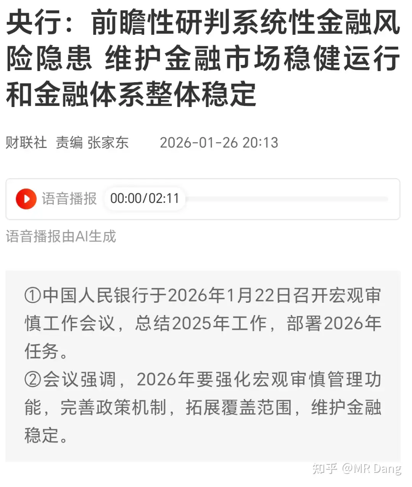
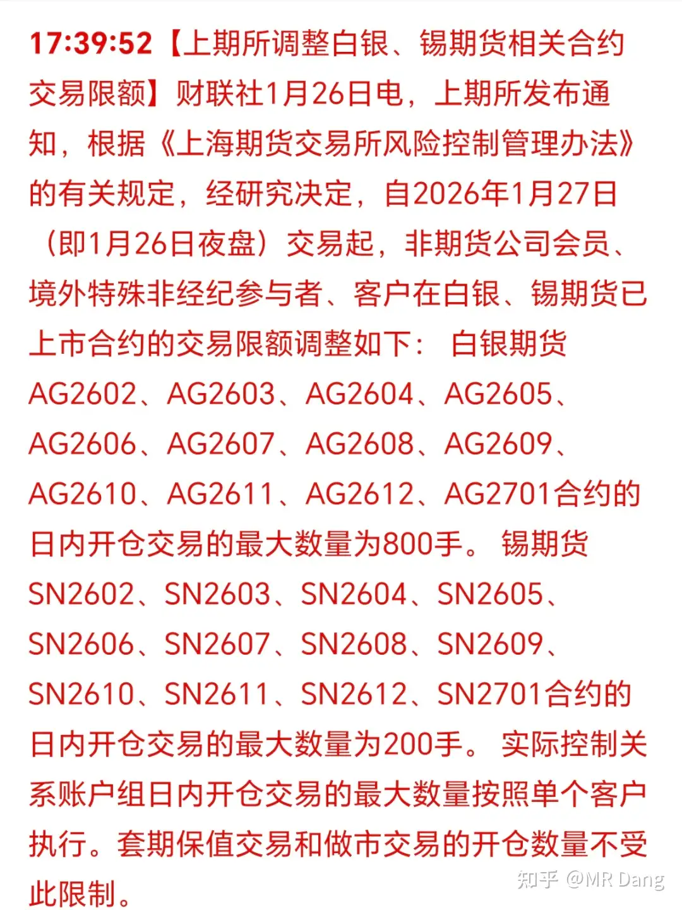
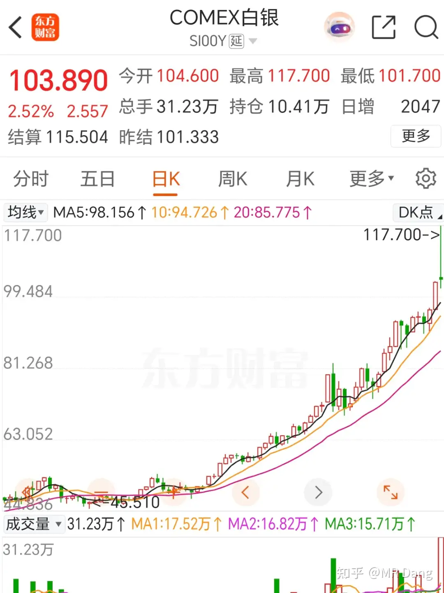
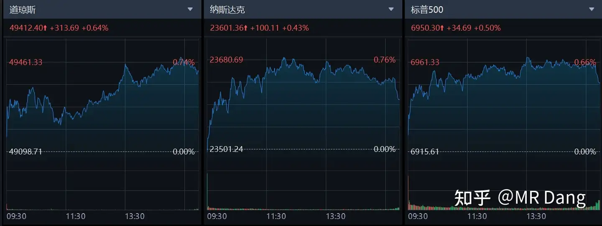
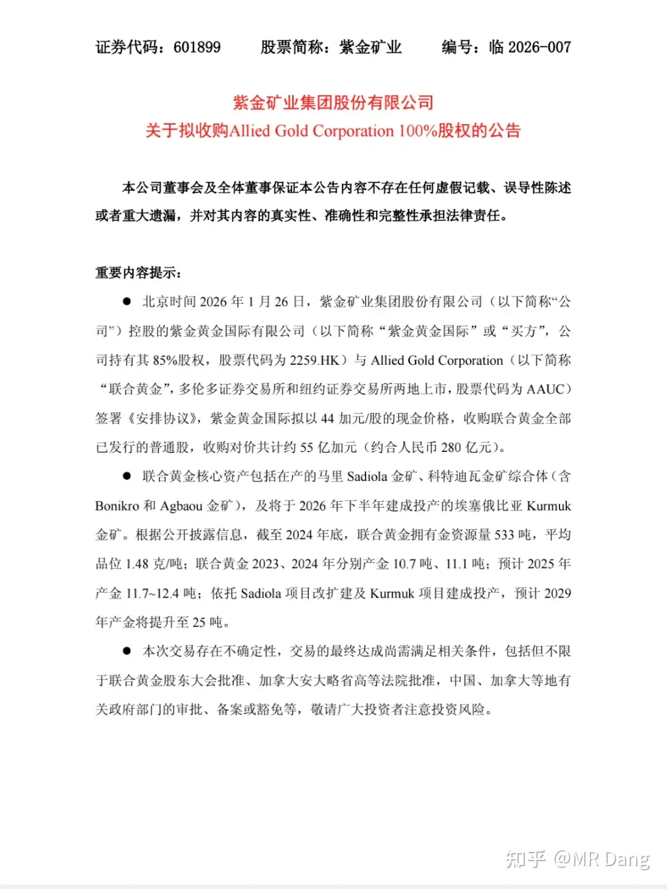

# 该怎样评价2026年1月27日A股行情？

---

**发布时间**: 2026-01-27 07:13  |  **原文链接**: https://www.zhihu.com/question/1998799915103577840/answer/1999379411405910311  |  **点赞数**: 1016 人赞同

**作者信息**: MR Dang​独立投资人，不接广不卖课

---

## 正文内容

今天头条给到散户喜闻乐见的陈小群：

我看很多自媒体传成了陈小群被查处之类的，截止目前我个人并没有找到官方的公告。

所以这个"被查"的描述不是非常准确，目前的状态是记者的调查。

记者的结论是：造神运动

这个一点都不意外，A股就这生态，过一段时间就出冒出一个一年几千倍几万倍的股神，但是这神不能玩两年，因为两年就几亿倍了，圆不下去了，玩三年就更不行了，美股➕a股不够一个人挣的。

至于为啥得一年几万倍？

因为如果在牛市，你和新股民说稳定复合年化20％是会被嘲笑的。

在一颗想一夜暴富的心面前，哪怕是彩票，速度都有些慢了。。。

还有一条热度比较高的消息是：

目前据报道特点是致死率高，但是传播性一般，好像最多就是通过飞沫传播，没有气溶胶传播的明确案例。

那其实影响就是可控的，只要传播性一般，哪怕百分百致死率更多的也只是一种威慑，实际破坏力远远比不上之前发生的事情。

这种事情好像找投资方向有点不道德，但是资本市场一般还是会有人抢跑的，按照老黄历来就是检测啊，防护之类的，老股民应该有几个耳熟能详的名字冒出来。

个人不是很建议，感觉影响有限，注意风险。

央妈：前瞻性研判系统性金融风险隐患

不止是央妈在行动，最近一些异常的成交应该也是为这个前瞻性的研判在做准备。

就像打拳一样，拳头收回来才能更好的打出去，4000点上方减少仓位可能也是为了以后在4000点下方维护金融稳定。

日央行表示没干预外汇市场：

很多人看的一头雾水的不知道咋回事，其实这个新闻有一个前置剧情是：

日元汇率触及160时反弹，市场传言日央行卖美债买日债，然后日央行急了，赶紧辟谣，就发布了前面那个公告。

上期所限仓：

限仓本来是常规操作。

但是这次限仓得力度很大，比如锡从800手降为200手，而且立即落实到位，信号很明确，防范风险。

昨天夜盘锡期货价格小幅回落：

其他大宗商品：

白银冲高回落，盘中巨震：

盘中最高摸到117，收盘价比昨天A股收盘时的银价回调不少。

现在市场内投机氛围浓厚，很多有色股又是发业绩预报，又是主动说明自己白银产量不高，依然挡不住股价的非理性上涨。

很多人其实不在乎公司有没有白银，只是在交易"白银"这一个概念。

比如华尔街著名的沙丁鱼罐头事件一样：一群交易员反复交易一盒沙丁鱼罐头，所有人都在交易中赚的盆满钵满。

直到有一天有一个手贱的交易员不小心打开了沙丁鱼罐头，发现罐头早就变质发臭了。

于是他愤怒地指责卖家没有如实告知，怎么能把变质的沙丁鱼罐头高价卖给他？

卖家则平静的表示："谁让你打开的，沙丁鱼罐头是用来交易的，不是用来吃的"。

现在的很多白银周边标的，都有点类似沙丁鱼罐头，交易的就是"白银"这一概念。

但是悲剧的是很多散户可能就是第一次接触资本市场，并没有分辨能力，还以为自己交易的就是白银，所以最后的亏损自然早已注定。

比如最近炒的这些名字里带白银的股，比如白银lof溢价，都是这种投机氛围下的产物。

黄金也是差不多的走势，冲高后回落到5000附近：

其他工业金属表现还不错，比如铜铝锌之类。

铂也是冲高后回落，振幅接近20％，又回到2500美元左右。

目前的贵金属期货环境，风险太高了，多空双方其实都不是很好交易，震动幅度大，一不留神就得爆仓。

外围表现：

都还不错，但是一些热门科技股反而回调了，比如达子，特斯拉之类的。

铜王280亿收购533吨金矿：

不愧是铜王，赚翻了，管理层依旧优秀，虽然最近尾盘有异动，但那可能是人为干预市场而造成的。

具体到这些矿，品位和资源量看起来都挺不错，缺点就是运营成本高，但是铜王的优势恰好就是降本增效。

接手以后如果按照预期的把产量从10吨提高到25吨，哪怕再直接转手卖出去估值都能涨一大截，起码赚上百亿。

铜王唯一的缺点就是现金回报低了一点，但是公司也没乱花钱，这不就捣鼓回来一些大金矿。

这笔交易对资本市场最大的定心丸就是再次确认了新的管理层依旧锐意进取，没有躺在功劳簿上睡大觉。

很多人不理解为什么要反复强调管理层。

我记得巴菲特早年间接受过一次采访，主持人问股神令人印象深刻的最失败的一次投资经历是什么？

巴菲特说他以前发现一个纺织厂在走下坡路，管理层不行，但是他们每卖一个厂，就会回购一些股票。

巴菲特一想，这有套利空间啊，就买了很多股票，等着管理层回购。

后来和管理层见面，谈好的价格是11.5美元。

过了几天巴菲特收到了正式报价，11.375美元。

股神直接绷不住了，觉得被耍了，上头了，最后不但没有把股票卖给管理层，反而自己砸了很多钱把公司收购了。

巴菲特收购纺织厂以后的第一件事就是把管理层开了，哈哈哈。

最后的事情大家应该就都知道了，这家纺织公司让股神亏大了，就成了现在的。。。

昨天我的组合表现还算不错，本来收盘看指数绿绿的，全市场中位数跌了一个多点，心理预期不高。

打开账户一看银行和资源比翼双飞，净值又创了新高。

个股没啥分析的，一两天的涨跌代表不了什么，正常波动而已。

另外挂的黄金股套利单成交了，数量不多。

昨天的黄金股总成交量占收盘时总单量的5％左右，意味着所有排队的人里大概有5％的概率抢到。

接下来就不是无风险套利了，越往上风险越大，我现在相当于已经有持仓了，也不方便给出什么建议了，以后这事在我这里就翻篇了，不提了。

还有就是之前埋伏在电影板块的，最近差不多浮盈也不少了，热度渐渐起来了，根据自己的偏好来，觉得满意了，该止盈就止盈。

越往后波动越大，很多投资者未必受的住，我就不单独提醒了，投机嘛，有的赚就很不错了，尽量在春节假期前落袋为安，不赚最后一个铜板。

今天的贵金属板块振幅不会小，很多有色的概念股，热度太高，本身质地其实一般，也就是名字直白露骨。

里面的投资者注意风险吧，提示好几次了，希望读者里没有最近才冲进去的。

黄金白银也许能再涨回去，但是不代表这些股里高位接盘的就能全身而退。

最近粉丝数涨的有点快了，得还债了，也不知道周六发出来的时候是多少粉的感言，我尽量码点有质量的文字吧，希望不辜负大家的期待。

一个喜欢保护韭菜的博主，希望大家少少踩坑，多多赚钱！！！

---

> [!comment]- 点击展开评论
> | 用户 | 时间 | 内容 |
> | :--- | :--- | :--- |
> | 李家老姑娘 | 1 小时前 | 白银有色，哈哈，我全部家人都在白银有色上班，我都给好多人说主产铅锌和铜，银只是伴生矿，没有银矿。而且效益一般前些年，我感觉半死不活好多人，前几天竞拍酒泉金矿没干过金川，董事长还辞职了，还有人骂我，哈哈，都挂山顶上就不犟了 |
> | Yuraku | 2 小时前 | 起床第一件事 刷老师的动态 |
> | &nbsp;&nbsp;&nbsp;&nbsp;渣子 | 31 分钟前 | 老哥你好，作者现在持仓有哪些啊。 |
> | 慎独 | 2 小时前 | 确实啊，从川大智胜到白银有色…其实都是名字起的好。另外贵金属和有色好像是全球定价吧，看得见得手怕是只能干预期货交易所，证监会，短期会有波动，长期看对整体趋势应该没啥大影响 |
> | &nbsp;&nbsp;&nbsp;&nbsp;MR Dang | 1 小时前 | 是的 |
> | 一条咸鱼罢了 | 7 分钟前 | 白银有色也很委屈啊，公司所在地叫白银啊 |
> | jam-詹 | 1 小时前 | 总结：今日有色该收手了同志们，管的住手啊，过好春节 |
> | Koperic | 1 小时前 | 恭喜党哥套利成功沙丁鱼罐头，是《安全边际》里的，击鼓传炸弹💣书看了快一半了，划了重点，质量太高了，做了笔记。后面会二刷三刷， |
> | 广东顺德分Dang | 1 小时前 | 市场从来不是看赚的有多快，而是看谁活得久。 |
> | &nbsp;&nbsp;&nbsp;&nbsp;MR Dang | 1 小时前 | 是的 |
> | 小 7 | 1 小时前 | 以前失眠是看小说，现在失眠是整夜看老师最近的文 |
> | 卢琪琪 | 8 分钟前 | 握手，本人同样啊！dang老师文章值得反复品读 |
> | 第七型海星 | 1 小时前 | 【里面的投资者注意风险吧，提示好几次了，希望读者里没有最近才冲进去的。】看着周五才买的有色ETF欲言又止 |
> | 郭c | 38 分钟前 | 有色 etf 没事 说的是那几个名字带白银的吧 |
> | 下辈子还做猫 | 1 小时前 | 银行配的比较多，没跑赢大盘，化学挣了些又转头加银行，体会到别人吃肉自己坐冷板凳的感觉了 |
> | lucky | 1 小时前 | 今天有色可能要挨打 |
> | violet666 | 1 小时前 | 总会轮到的，买银行不能心急，确实急也可以T一下，但T多了可能会飞掉（我的教训不少）。我大账户里银行占约4成仓位，最近市值还在新高中，因为根据党佬的分析入手的有色和磷化工最近涨不少，老早也T过，现在老实了不动了。 |
> | 下辈子还做猫 | 1 小时前 | 哈哈，我有色和bt没T回来，主要重仓银行是没时间看盘，基本都是上下午都没开盘忙到封盘，现在全靠宝丰和大森林撑着才不太难看。目前小仓的大秦铁路和中国核电这两个已经放弃挣扎了。 |

---

*本文件由自动脚本从MR Dang知乎页面提取生成*

---

**作者**: MR Dang
**链接**: https://www.zhihu.com/question/1998799915103577840/answer/1999379411405910311
**来源**: 知乎

*著作权归作者所有。商业转载请联系作者获得授权，非商业转载请注明出处。*

---

## 相关阅读

**📈 近期行情评价：**
- [[20260126-如何看待2026年1月26日A股行情？|1月26日行情]] - 大宗商品创新高，白酒洛水之誓事件
- [[20260123-怎样评价2026年1月23日A股行情？|1月23日行情]] - 近期市场走势分析
- [[20260122-如何评价2026年1月22日A股行情？|1月22日行情]] - 市场波动与板块轮动

**🥇 贵金属与有色板块：**
- [[20251125-《天阶功法卷七》中国黄金第一家——C公司投资价值分析|天阶功法卷七]] - 黄金龙头公司深度分析
- [[20251105-黄金投资突然上了枷锁，关于黄金税收对老百姓来说是好是坏呢？|黄金税收分析]] - 黄金投资政策解读
- [[20251008-黄金涨的这么疯狂，是代表了纸币飞速贬值还是已经商品化了？|黄金暴涨解读]] - 黄金价格上涨逻辑
- [[20251009-如何看待2025年10月9日a股有色板块暴动？是否还有低估值的投资机会？|有色板块暴动]] - 有色板块投资机会

**🏦 银行股投资：**
- [[20251106-《天阶功法卷六》银行股投资原理详解|天阶功法卷六]] - 银行股投资系统方法论
- [[20251106-怎么投资银行股，并获取银行股股息收入？|银行股息投资]] - 银行股股息收入策略

**⚠️ 风险控制：**
- [[20251020-投资新手避坑指南之仓位控制|仓位控制指南]] - 科学设置仓位的方法
- [[20251016-投资新手避坑指南之追热点(万粉特别奉献)|追热点避坑]] - 追热点的风险与教训
- [[20251029-新手投资者避坑指南之不要赌财报|不要赌财报]] - 财报博弈的风险

**🔙 返回：**
- [[20260117-五万粉感言|五万粉感言]] - Dang老师最新感言
