# 如何看待2026年1月28日的A股市场行情走势？

---

**发布时间**: 2026-01-28 07:50  |  **原文链接**: https://www.zhihu.com/question/1999400841145253892/answer/1999751221062414730  |  **点赞数**: 1580 人赞同

**作者信息**: MR Dang​独立投资人，不接广不卖课，无任何其他平台

---

## 正文内容

今天最大的新闻是英国访华：

时隔八年，首相再次访华。

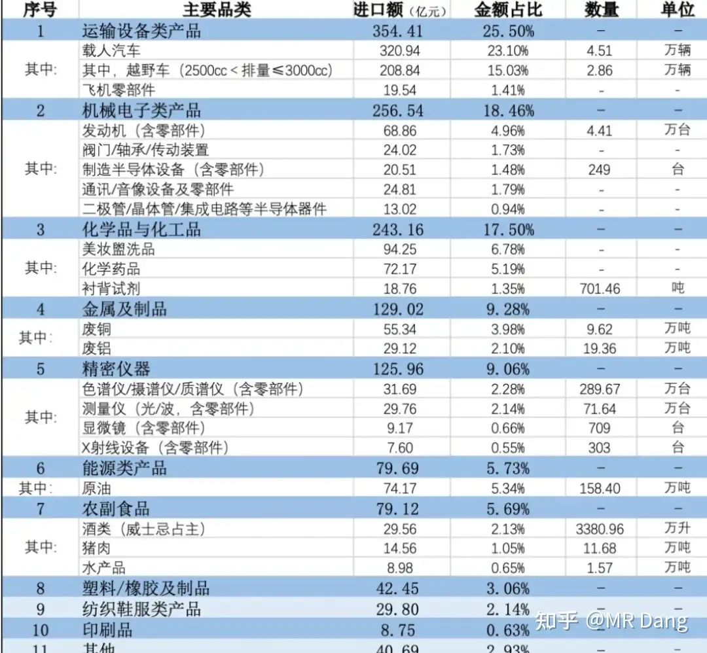

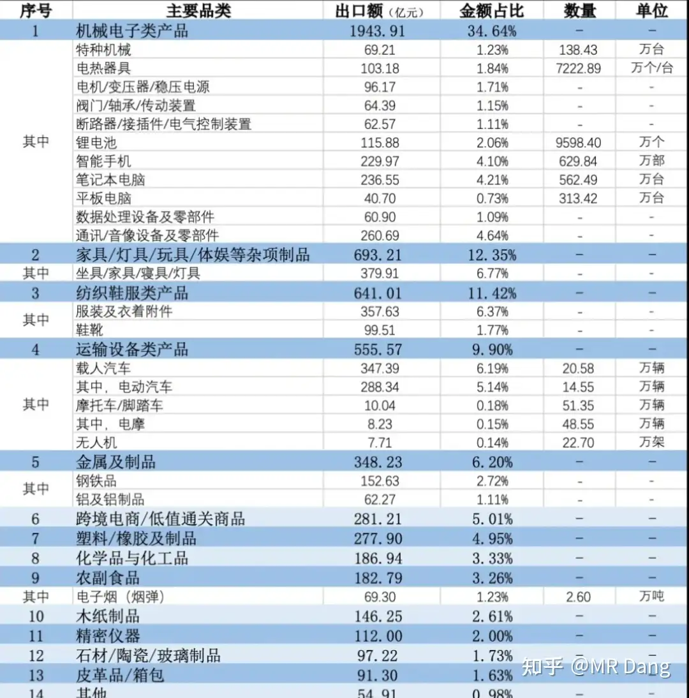

中英贸易：

英对华出口结构如上图，如果谈的好，有可能利空其中部分行业，但是其实金额都不大，所以影响我感觉很有限。

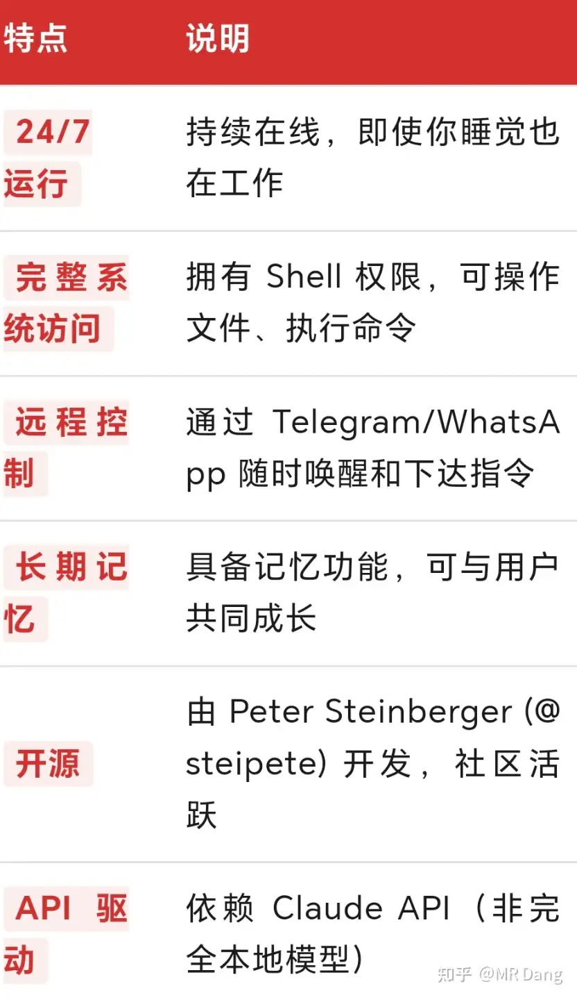

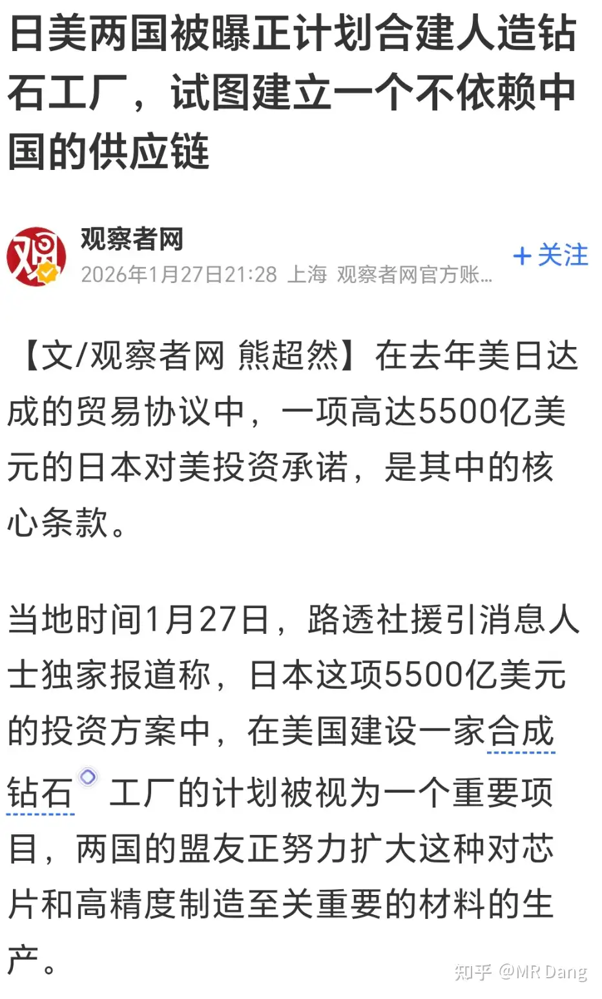

中对英出口结构如图所示，图中会有部分行业可能受益，比较明显的是一些本来在英国的品牌，又在中国复活了，然后反向再出口回英国，品牌认可度就比较高。

总的来说，日不落帝国已经是昨日黄花，其市场体量对现在的中国来说已经不太重要了。

更多的影响可能是文化或者其他方面的，其实昨天芬兰总理也来了，欧洲这些国家对懂王有点不信任，都过来找plan b了。

这两天，龙虾机器人clawbot大火，甚至带动了Mac mini的抢购。

这玩意儿虽然也是agent，但是很有特色：

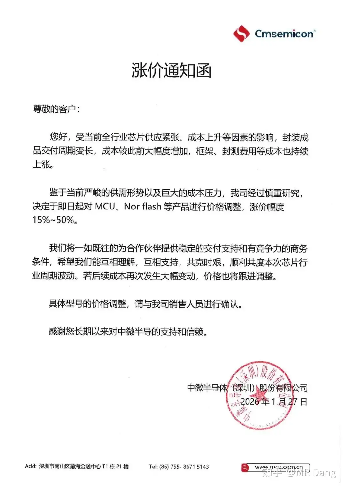

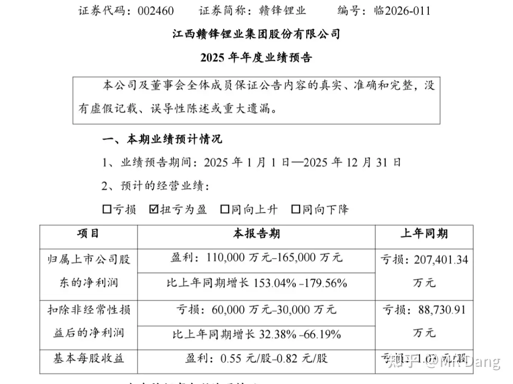

简单的说，就是主动干活，长期记忆和直接操控设备。

缺点的话，目前简单任务可以用免费额度，复杂任务非常消耗token，本地部署就还行。

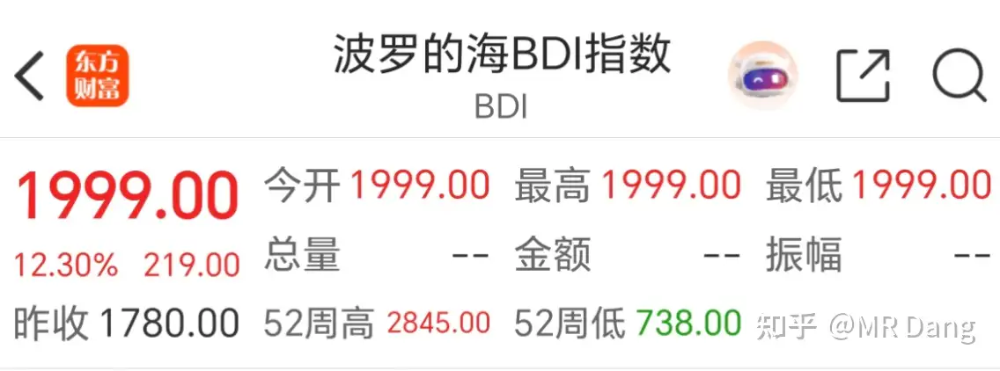

钻石散热：

西大要摆脱对东大的依赖，和日本合作搞人造钻石项目，钻石要从装饰品变成半导体的最佳散热材料。

也许利好相关板块吧。

前几天提到的业绩不错的做mcu单片机的公司涨价：

现在资本市场对这类涨价信息比较敏感，容易给出正面反馈。

某锂企业绩预报：

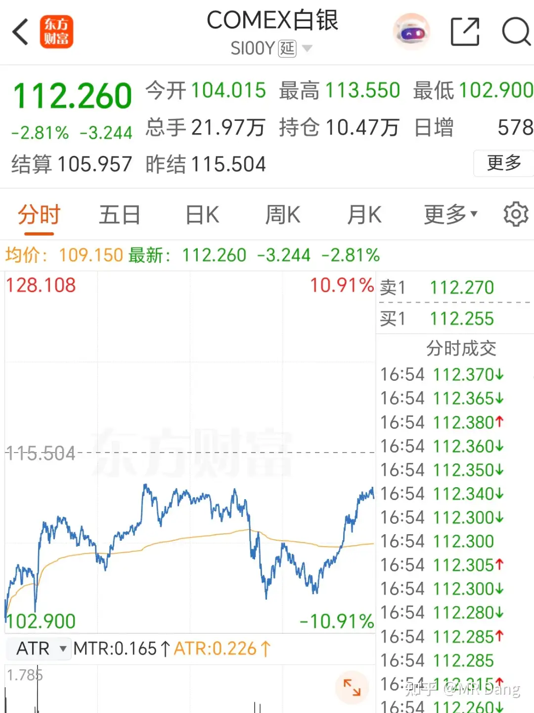

这业绩不错的，因为去年四季度其实锂价还没怎么涨，今年一季度肯定业绩更好。

有一部分业绩因为h发行的可转债指定为了特定的负债科目，公允价值变动导致发生亏损，实际盈利能力比那个数字还要好一些。

锂企的定价其实就是博弈中期的锂价，目前主流的看法还是短期抢出口推高价格，下半年随着抢出口结束和部分产能复产，会导致锂价回落。

如果按照目前的锂价推测的话，这个估值是略微低估的，问题就是能不能稳住这个价格。

其他公司业绩情况；

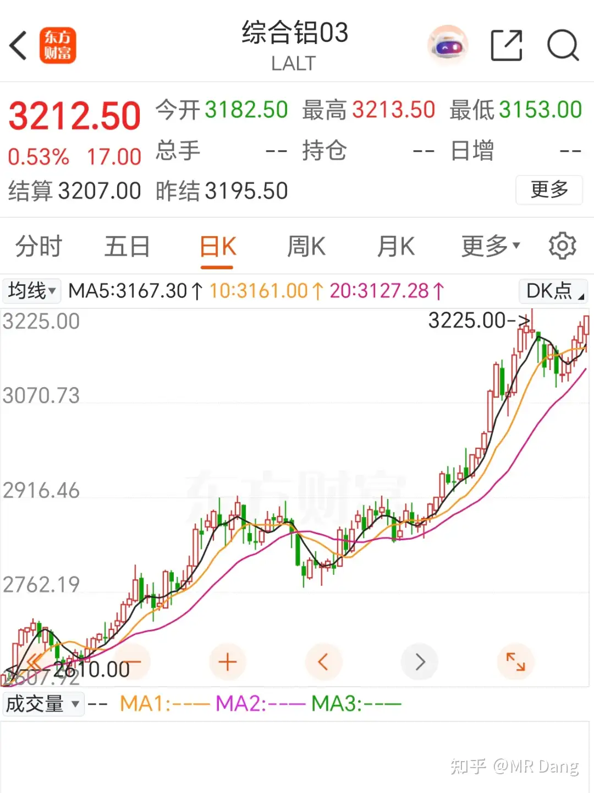

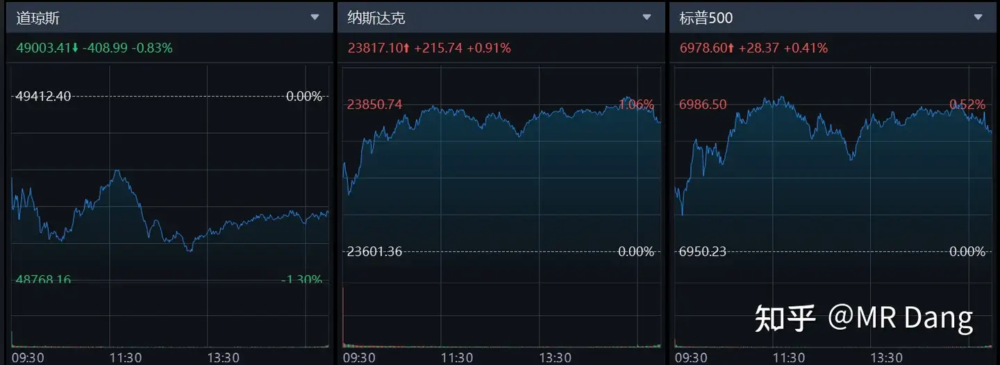

考公公司赚翻了，就业压力下第一受益人，我记得之前哪次回答问题还提过来着。

券商也都不错，至于股价嘛。。。。。不要哪壶不开提哪壶。

榜4不太到达预期，不过现在黄金情绪在上头，管你这的那的。

至于沐王，和摩王一样，亏损那必须是利好，说明研发还在加码，适用市梦率估值。

不过这两天都被东伟达的砺算抢走了风头。

商品市场：

BDI指数上涨：

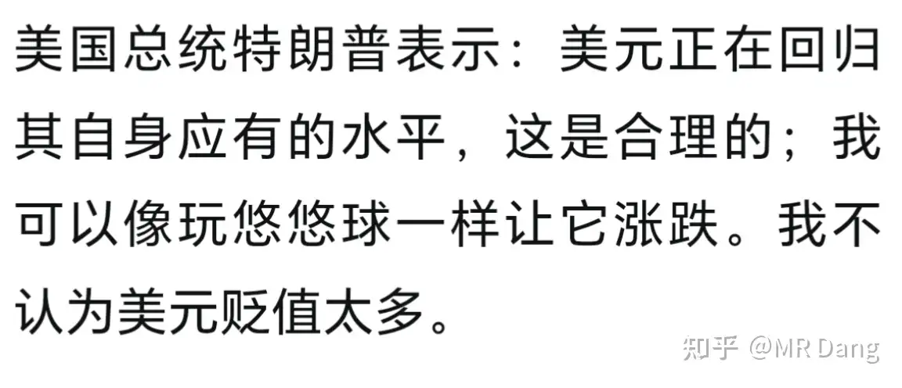

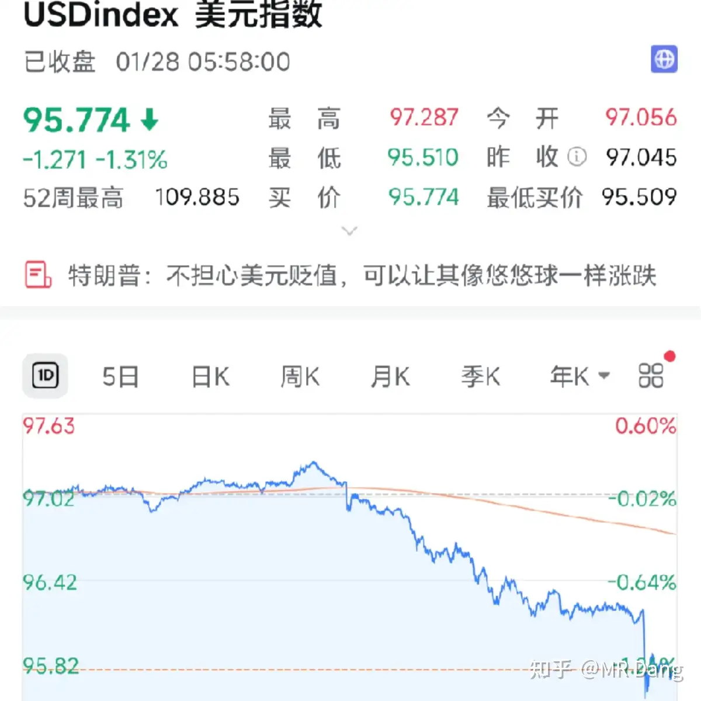

这个主要是干散货的价格指数，所以虽然利好航运，但是主要利好干散货的航运企业，比如港股有个专门经营这门生意的企业，对于众多水手来说，属于利好有限的消息。

印尼要出台HPM政策保证锡的最低价格。

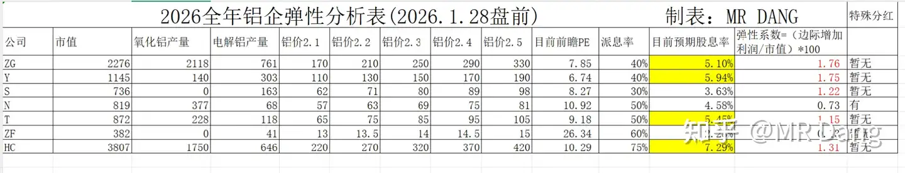

导致昨晚锡价创出历史新高后回落。

金大涨，创历史新高：

有投行把目标价调到7000以上了。铜王现在真的挺好的，产量在增加，金价在抬升，但是股价因为外力一直受到压制，真挺香的。

银在昨天收盘后收复部分失地：

铝逼近历史新高，只差临门一脚：

其他金属互有涨跌，油价涨不少，站上66美元了。

外围市场：

美元指数大跌：

懂王表示美元是悠悠球后，悠悠球应声而下：

昨天的组合净值回撤了将近一个点，资源和银行都在回调，算是比较大的回撤了，最近的节奏都是这样子，创新高回撤，创新高回撤，我已经习惯这样的节奏了。

另外昨天止盈了BT组合。

这里多说两句，我发止盈贴是为了提醒不会择时的小伙伴找到一个相对合适的止盈位置。

但是怎么说呢，就是最近止盈的位置恰好在当日算是一个还可以的位置，就会有一些非议。

还会有些读者把这些信息散布到其他平台，本来大家挨打就很难受了，这相当于把我推到风口浪尖上了。

站在我的角度来说，发止盈贴是为了照顾一些萌新，对我的好处或者收益来说，是0，止盈贴哪怕咖啡什么礼物都不开的。

但是风险的话，一定是很大的。

假设股价飞了，嘲笑我菜我都一笑置之，我本来就菜，瞎说什么大实话。

但是像昨天那种卖的还可以的情况，难免引起不明真相的群众的愤怒，还有跑过来专门注册账号留言的。

有鉴于此的话，以后止盈贴就不公开发表了，大家根据自己成本来，大概30％止盈就可以了，自己要对自己的钱负责，对自己的投资上心。

塑料王是第一篇天阶功法，最后一篇公开的止盈贴也以它结束，我觉得算是一个很完满的结局了，也算有个交代。

犹记起当时算估值时写下24的淡然一笑，就想着未来的我一定会夸当时的自己有先见之明。

现如今虽然差了一点点，但看样子也是早晚的事，给当时的自己比个耶。

依然看好塑料王的基本面，非常棒的公司。

至于止盈后的去向，我目前比较看好铝：

大逻辑很简单：

铝=电

现在国际上因为Ai的需求和天然气的价格提高，电价是持续走高的。

电价高了，铝成本高，供应就少。

需求端的话，铝代铜还有ai什么的，也是增加的。

咱们这边看似出口的是铝，其实可以看成是出口的电，把铝当成一次性电池也没啥问题。

这里不展开了，之前写低价铝的时候也有类似表述，互相补充着看就行了。

但是选股逻辑变了，那个时候，铝价低，图的是安全。

现价铝价高了，图的就是安全+弹性。

铝股是所有有色股里，业绩弹性最大的。

为什么呢？因为铝不但产量大，而且成本率高，比目前的金银铜这些的综合成本率高得多。

成本率高了，业绩弹性就高。

举个简单的例子，不考虑税费。

10块的金属，1块钱成本，金属涨价到11块，涨幅10％，毛利增加11.11％。

10块的金属，9块钱成本，金属涨价到11块，涨幅10％，毛利增加100％。

大概就是这么个原理，所以铝稍微涨一点价格，铝股的业绩都增加的惊天动地的，要是铝价像铜那样涨，都不敢想。

然后还要考虑产量，市值这些，以下是我做的功课：

标的选择的话，我就不提意见了，我自己是按照预期股息率和弹性系数综合考虑选择的。

如果按照目前的铝价，这些铝股的前瞻pe都很低，股息率也不错，还是挺香的。

有些标的在半年报之前就会发增速超过50％的业绩预告，我对这个也是有预期的。

2.4万的铝价算是非常景气的周期了，但是如果天然气继续涨价，国际电价继续涨，铝价也会水涨船高，如果均价能到2.5万甚至2.6万，那对铝股来说就是超级周期，可以无脑冲的那种。

风险就是铝价不及预期（2.4w为图中测算基础），以及资本支出超预期导致股息率下降。

如果铝价跌破2.1万，那就又变回以前的样子了。

我知道这个表是比较冲击人的三观的，因为按照表中的预测，现在的铝股都便宜的令人发指，可是如果按照现状测算，这些都是可能发生的。

借用巴菲特2001年在乔治亚大学时演讲的一句话给今天的早报画个句号。

"人生中的重大机会，一定要抓住。我们的机会有限，碰到历史性的机遇时必须果断出手，只参与一点和完全不参与，都是重大失误。"

一个喜欢保护韭菜的博主，希望大家少少踩坑，多多赚钱！！！

（重置版，希望能过审）

---

> [!comment]- 点击展开评论
> | 用户 | 时间 | 内容 |
> | :--- | :--- | :--- |
> | Temu | 3 小时前 | 是豆包干的，不是我 |
> | 瘦坨坨 | 4 小时前 | 心不安呐佬，星球再考虑考虑呀 |
> | &nbsp;&nbsp;&nbsp;&nbsp;MR Dang | 4 小时前 | 还是想尽量开源，再说吧 |
> | 拉不拉猪 | 4 小时前 | 看完这个帖子突然感觉很痛心，吃完饭砸锅，都是成年人，何必呢 |
> | bcoderlife | 4 小时前 | 支持开星球 没这么多破事 |
> | 守望人 | 4 小时前 | Dang佬，关于铝的逻辑，您看我是否理解的正确：铝的生产主要是电解铝，中国电价持续走低，国外却由于AI发展普遍缺电。因此，利好铝出口，我们的成本比他们低。 |
> | 乌获 | 3 小时前 | 我觉得买股票先搞清楚自己赚的是什么钱吧。主要是赚两份钱，一份是赚企业成长的钱，一份是赚市场预期的钱。市场预期本质来讲跟企业质量关系不大，不然也就不可能有"捡烟蒂"这个机会了对吧，市场先生经常是找不到北的。那么不管是谁在交易这个股票，不影响这个公司的经营和盈利啊，也就不影响你赚企业成长的钱（铜王的金矿能因为谁的买卖而停产吗？），交易行为只会在短期内影响一下二级市场的预期，一方面要影响这个预期需要很大很大的体量，看一下汪汪队和其辅助每次花多少钱就知道了，另一方面就算短期影响预期了，还是会回归到企业价值本身（老师之前止盈的票不还是该涨就涨吗？）。继续涨了，嫌老师让你少赚了。股价波动了，嫌老师影响你下车了。谁给你的上车机会你还记得吗？何况输赢的锅难道不在于我们自己的投资能力太弱吗？关老师什么事？ |
> | 吾心安处 | 3 小时前 | 大师兄说的对 |
> | 牛反之 | 3 小时前 | 总结：饮水思源。 |
> | 邪神酱 | 1 小时前 | 今天bf不就涨回来了，昨天喷的呢 |
> | 程青铭 | 4 小时前 | 没事党佬，已经学会你的止盈方法了，30嘛，鉴于我肯定比你慢，就设个25好了 |
> | &nbsp;&nbsp;&nbsp;&nbsp;MR Dang | 3 小时前 | 哈哈，机智 |
> | 棋魂 | 4 小时前 | 其实星球也是一种变相的保护方式，人往往不会珍惜免费得到的东西 |
> | 棋魂 | 26 分钟前 | 他没开星球 |
> | 小嗝嗝 | 3 小时前 | 弱弱的问一句星球是哪里看的，我害怕看不到Dang老师的文章。 |
> | 岁月留白 | 3 小时前 | 看到最后一篇以塑料王止盈这句话，总有种淡淡的伤感，几个月以来的文章看过来，党老师专业技术极强，没有架子，风趣幽默，虽然隔着互联网，没有见过真人，甚至没有私聊过，但是却像现实中的良师益友一样给我指引，真心的祝福老师能平平安安，大富大贵 |

---

*本文件由自动脚本从MR Dang知乎页面提取生成*

---

**作者**: MR Dang
**链接**: https://www.zhihu.com/question/1999400841145253892/answer/1999751221062414730
**来源**: 知乎

*著作权归作者所有。商业转载请联系作者获得授权，非商业转载请注明出处。*

---

## 相关阅读

**📈 近期行情评价：**
- [[20260127-该怎样评价2026年1月27日A股行情？|1月27日行情]] - 陈小群造神运动，沙丁鱼罐头故事，铜王收购金矿
- [[20260126-如何看待2026年1月26日A股行情？|1月26日行情]] - 大宗商品创新高，白酒洛水之誓事件
- [[20260122-如何评价2026年1月22日A股行情？|1月22日行情]] - 市场波动与板块轮动

**🔧 铝股与有色分析：**
- [[20251030-《天阶功法卷三》NSLY投资价值浅析|天阶功法卷三]] - 低价铝投资价值分析
- [[20251009-如何看待2025年10月9日a股有色板块暴动？是否还有低估值的投资机会？|有色板块暴动]] - 有色板块投资机会
- [[20251007-铜价暴涨，A股有哪些好的标的值得够买？|铜价暴涨分析]] - 铜相关标的分析

**⚔️ 天阶功法系列：**
- [[20251024-《天阶功法卷一》BFNY价值投资分析|天阶功法卷一]] - 塑料王价值投资分析（本文止盈标的）
- [[20251026-《天阶功法卷二》BFNY估值方法|天阶功法卷二]] - 塑料王估值方法详解
- [[20251106-《天阶功法卷六》银行股投资原理详解|天阶功法卷六]] - 银行股投资系统方法论

**⚠️ 风险控制：**
- [[20251020-投资新手避坑指南之仓位控制|仓位控制指南]] - 科学设置仓位的方法
- [[20251031-新手投资者避坑指南之测算股息率|测算股息率]] - 股息率计算方法

**🔙 返回：**
- [[20260117-五万粉感言|五万粉感言]] - Dang老师最新感言与股票别名对照表
