# 如何评价2026年1月30日A股市场行情？

---

**发布时间**: 2026-01-30 07:16  |  **原文链接**: https://www.zhihu.com/question/2000202105160499568/answer/2000467273232695651  |  **点赞数**: 1683 人赞同

**作者信息**: MR Dang​独立投资人，不接广不卖课，无任何其他平台，无小号。

---

## 正文内容

本周最后一天了，被揍了一年的白酒地产终于扬眉吐气了一回，正好看到张梗图，笑的我合不拢嘴：

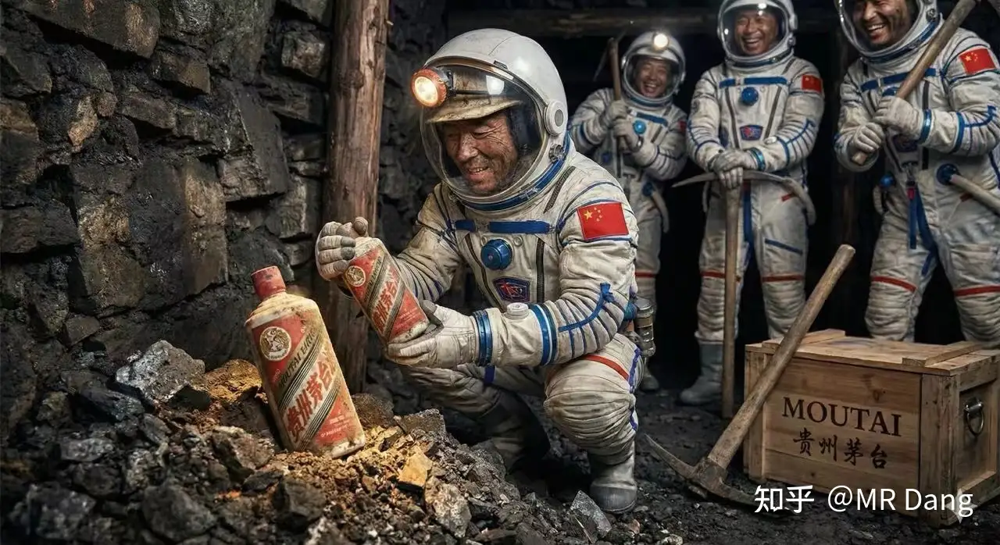

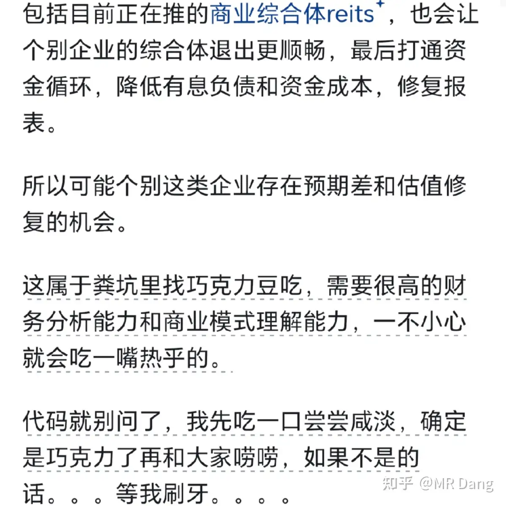

说实在的，就差了24小时，白酒和房企有什么基本面的反转么？

也没有，松绑三条红线这种事情难以扭转目前的房企资产负债表。

资本市场这种跌多了就涨，涨多了就跌的情况经常发生，不能以股价涨跌去反推基本面，这是大忌。

之前我说吃一口粪坑里的巧克力豆，吃了以后差点消化不良，没敢吱声，没想到昨天还吃了个涨停。

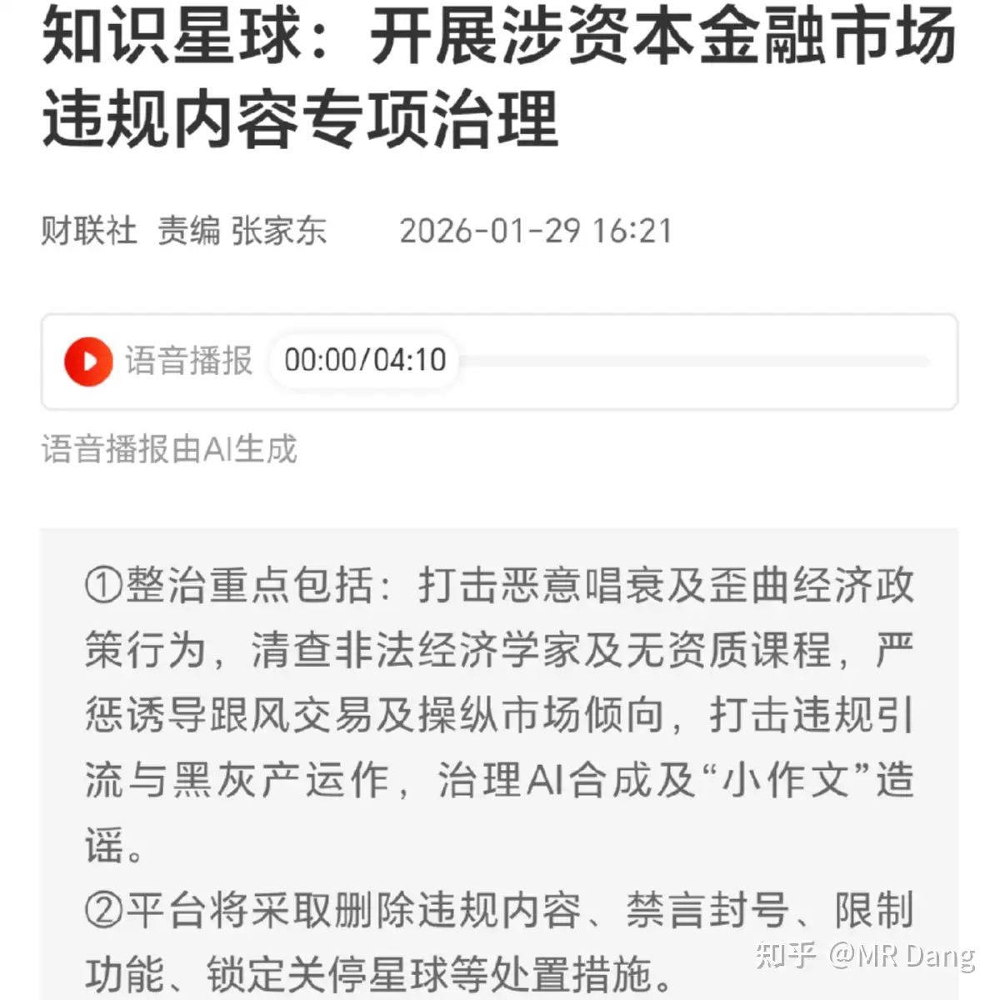

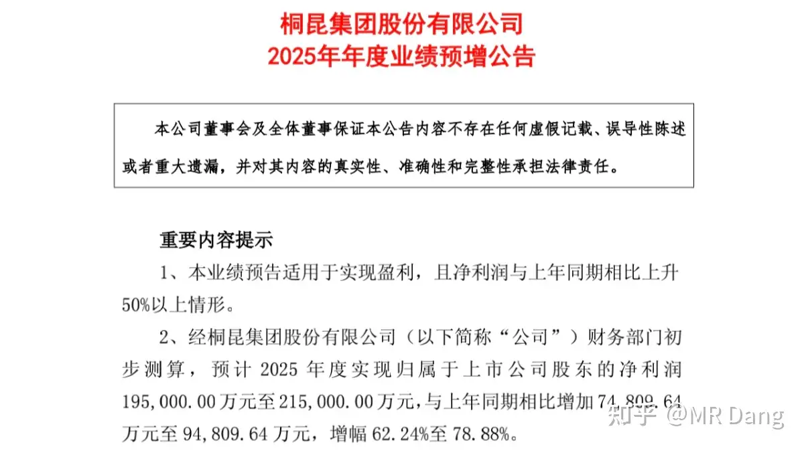

如果你非要参与，有色的钱想挣，房企的钱也想挣，既要还要。

那从思路上来说，我觉得可能一些就是做商业地产的reits，已经发出去的，或者有发出去预期的，带来的资产重估起码还是个算得上的逻辑。

投融管退打通以后，商业模式就能跑的通了，就不能按纯住开去估值，很多商业地产公司的ROI都在缓慢增加，客流量，销售额都在增加，资产只要能按照报表中的数字出表，那市场价格就会向净资产靠近。

看不懂的就不要想了，有大把的好生意，没必要掺和。

能看懂的，知道是哪几家的，按按计算器衡量下风险收益，挑一挑，选一选，里面有可能筛选出一些爆发力强的东西。

这个本身就是一种门槛，也是保护，风险很大，没有股息率兜底，不要强行上车。

白酒的话，据说是在交易飞天茅子批价上涨的逻辑，但是这个说实话，每年临近春节都会涨，算是季节性波动了。

不管怎么样，里面的投资者真的是憋了很久了，由衷的替他们感到高兴。

隔壁平台开始专项治理：

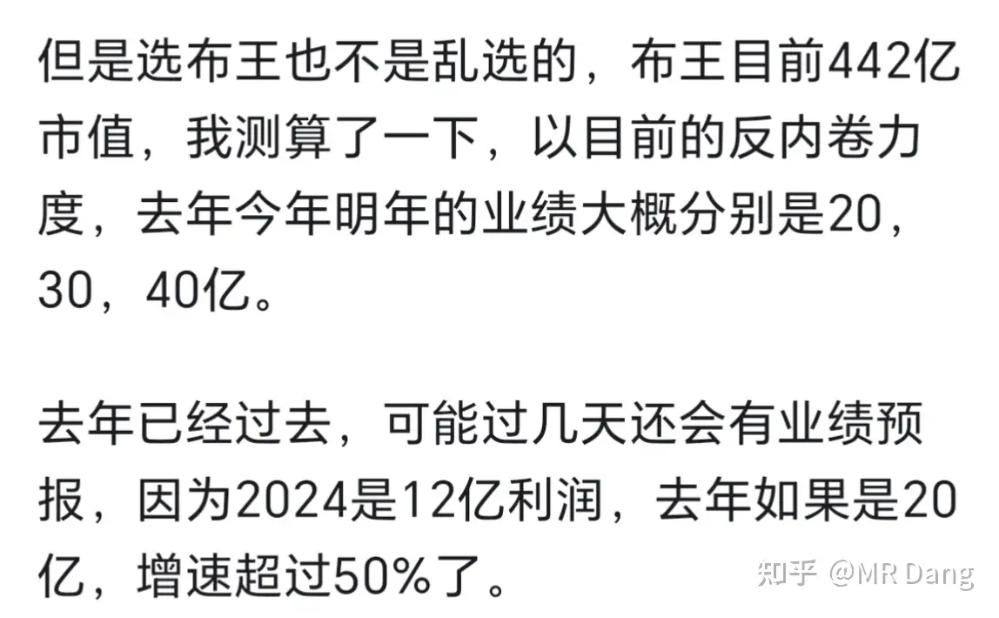

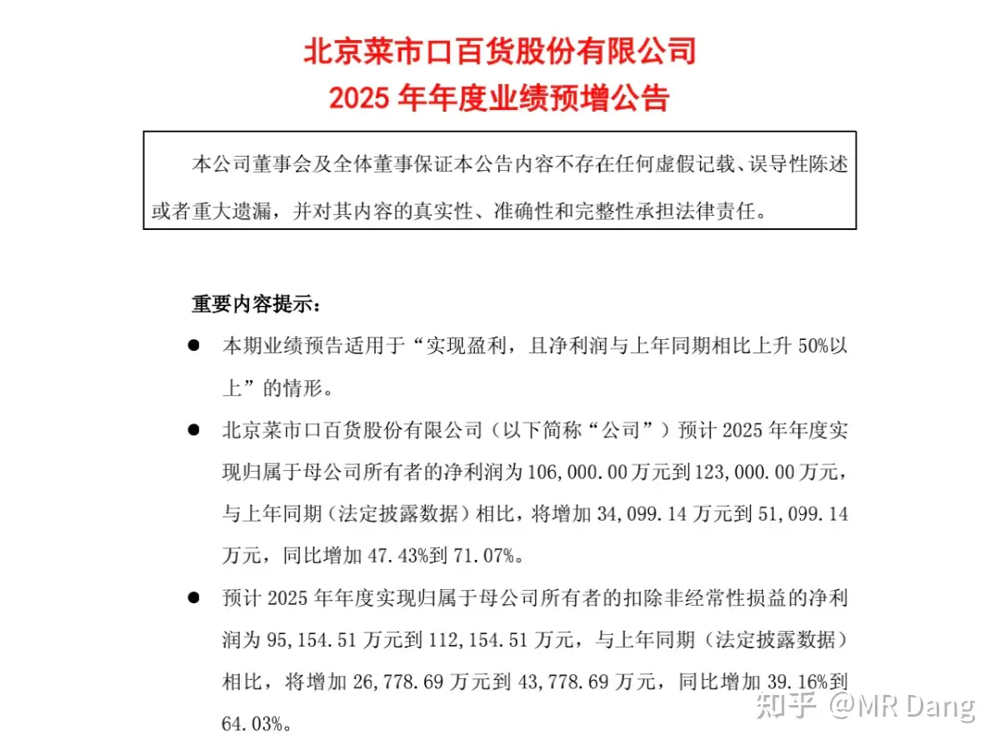

我感觉作为博主，打铁还需自身硬，不管到哪里都要行的端，坐的正。

不能因为到了一个相对封闭的圈子就放飞自我，这点我会时刻警醒。

布王发布业绩预告：

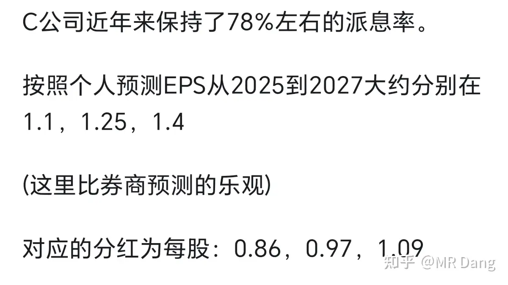

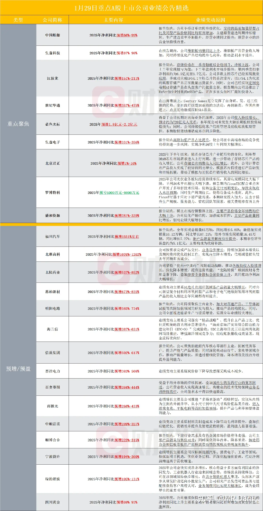

19.5亿到21.5亿，中位数20.5亿吧，符合我的预期。

我的预期在1月19的早报里有写：

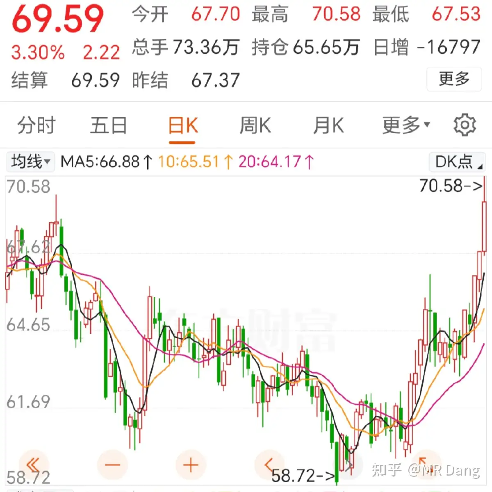

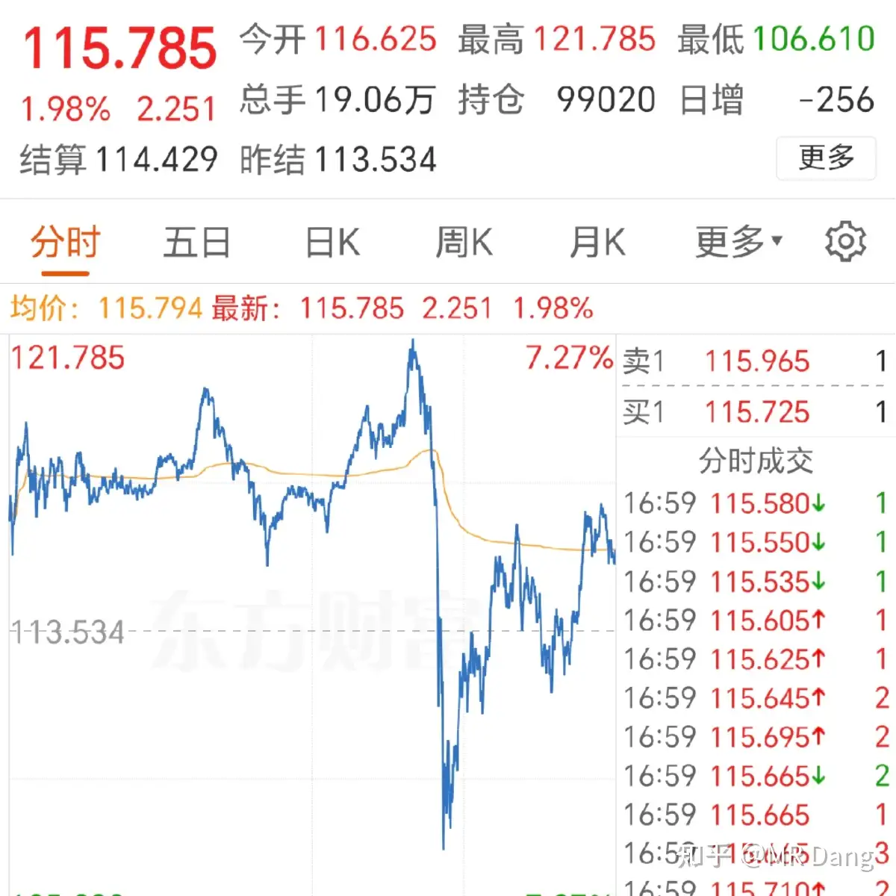

虽然目前没有仓位了，[[20251024-《天阶功法卷一》BFNY价值投资分析|布王]]依然是不可多得的好公司。

金店发布业绩预告：远超预期

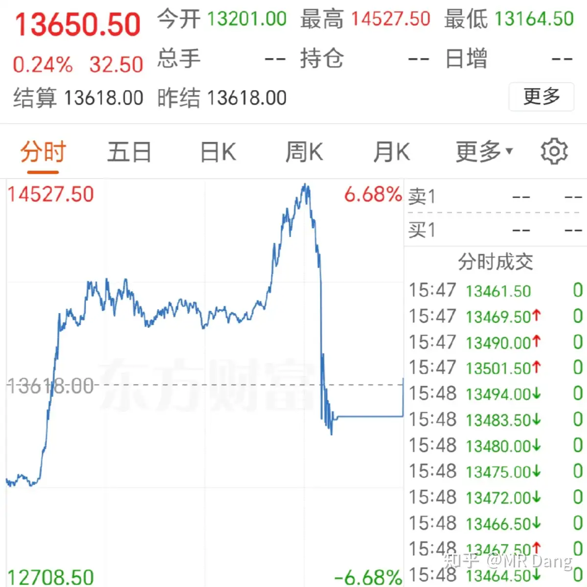

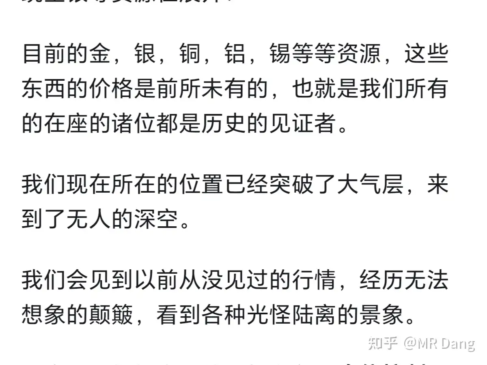

10.6亿到12.3亿，取中位数11.45亿。

则每股收益=11.45/7.78=1.47

太逆天了，这业绩炸了，远超预期。

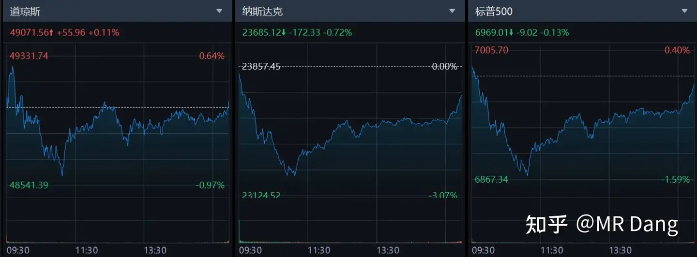

当时我已经比券商给的乐观了，25年只预期了1.1，目前的业绩直接干到预期中2027年的业绩了。

恭喜还持有的小伙伴，真是淘到宝了，目前股价涨了30％多，预期股息率还有5％以上，离谱。

有值得反思的地方，低估了大家买黄金的热情，低估了卖金条的暴利程度，应当修改盈利预测模型，及时跟踪数据。

（本人无任何仓位，仅代表个人看法）

其他公司业绩预报：

榜一的业绩有点。。怎么说呢，印证了1+1=1，合并后重工的业绩直接消失了。

榜3是模组厂商里的头牌，和我拿的那个存储一个赛道的，我觉得这业绩不如我拿的那个。

榜5是热点股，这业绩和估值我看不懂。

我比较关注的是其中一家造纸的，有行业反转的迹象，感觉可以跟踪下。

又到了喜闻乐见的大宗商品市场时刻：

布油：

因为波斯的紧张局势，石油起飞。

目前的情况就是懂王让波斯自我核阉割，提了几个条件，不然就要动手，交易员们都在做看多石油的交易，去定价这个预期。

白银巨震，比昨天下午收盘回调了三四个点：

盘中最高121，最低106，很离谱的振幅。

铜也是巨震：

铜比昨天下午收盘也是回调了两三个点，盘中一度涨了十多个点跳水了。

其他的黄金，铝，锌，锡，铂，都是差不多的走势，巨震后收盘基本都比昨天下午回调了一些。

正如我昨天说言：

这正是无法想象的颠簸，光怪陆离的景象。

核心原因就是对目前大宗商品的定价，人类没有任何经验可以借鉴，历史上从来没有出现过这种情况，必然导致分歧加剧。

外围市场：

波动不大，盘后闪迪发的财报大超预期，涨了十多个点。

懂王下周官宣美联储掌门人，终于要落地了。

我昨天其实已经做好了挨打的准备，抱头蹲在墙角上了，结果[[20251106-《天阶功法卷六》银行股投资原理详解|银行股]]单骑救主，虽然资源股跌多涨少，最后还是躲过了这顿毒打，净值又创新高了。

但是这顿打是躲不过的，也许今天新仇旧恨就一起还账了，头盔已经戴好，绷带已经就位。

昨天盘中某个标的过了整数大关，算是到了提前设定的线，这种事情大家该怎么处理就怎么处理，原则放第一位。

哦对了，[[20260111-周末荐游|铝王平替]]正式改名了，今天就启用新名字了。

可惜名字里没加上一个铝字，导致含铝量下降。

A股就这生态，看名字炒股的人还挺多，整体认知水平参差不齐的，所以有些资金就会利用这个去浑水摸鱼。

至于今天的行情，A股就是个巨大的跷跷板。

如果老登继续发力，小登难免受苦，在目前总体指数非常平稳的情况下，肯定有人得做出牺牲。

老让大家[[20251020-投资新手避坑指南之仓位控制|控制仓位]]，不是喊口号的，希望大家听进去。

万粉感言的话，我想放到周日早晨发，不管当时有多少读者，题目都叫十万粉感言，应该不会差的太多。

所以明天歇一天。

最近后台留言每天都是上千条没看的，翻到绝望，稍微翻一翻手机就卡了。

没办法预约，所以一直开着氪金通道，单子疯了一样的排队，明天集中处理下，更重要的是输出点硬核的东西出来希望可以帮到大家。

一个喜欢保护韭菜的博主，希望大家少少踩坑，多多赚钱！！！

---

> [!comment]- 点击展开评论
> | 用户 | 时间 | 内容 |
> | :--- | :--- | :--- |
> | 久下的雨 | 3 小时前 | 老师早！论取名字的重要性：宏桥控股×白银有色√ |
> | 文若 | 2 小时前 | 党老师早上好，看到你快10万粉了。为了保护你，我再次呼吁大家多点踩 |
> | 檀木 | 2 小时前 | "对目前大宗商品的定价，人类没有任何经验可以借鉴，历史上从来没有出现过这种情况，必然导致分歧加剧"。有争议才会有上涨空间，但过程会出现多次回撤，可以这么理解吗？ |
> | 睿亲王天聪汗 | 2 小时前 | 今天一晚上算是贵金属过山车，我现在算是重仓化工了，盐湖股份和化工50etf，不过盐湖股份以前的管理层能让我感到害怕。说起来名字是真重要，神火股份要是叫神铝股份 ，那也不是这个表现，盐湖要是叫中国神湖更不用说。 |
> | Nam的心智代码 | 2 小时前 | 老师，有空可以说说你的来时路吗 |
> | &nbsp;&nbsp;&nbsp;&nbsp;MR Dang | 2 小时前 | 可以 |
> | 奶片 | 2 小时前 | 哥早新的ip来了 |
> | &nbsp;&nbsp;&nbsp;&nbsp;MR Dang | 2 小时前 | 我的天，很累吧，辛苦了 |
> | Sean | 2 小时前 | 准备整个铝布组合 |
> | yang nan | 3 小时前 | 银行单骑救主哈哈，还是武侠比较帅啊 |
> | 轻度失语 | 2 小时前 | 我是银行带着dsl双双赶来救主 |
> | 奔腾的少侠 | 2 小时前 | 我也是，哈哈哈哈哈哈哈 |
> | 0614具具 | 1 小时前 | 我是红利和现金流基金救命。之前红利绿了很久了。 |
> | 一灯 | 2 小时前 | Dang大，我认真学习您的文章，去看了证券分析。挺惊讶，价值投资竟然有这么长历史，也解答我的疑惑。一句话，没有规则不成方圆。还有那么多的序。我看到一点浩然气的时候，就觉得很适合你。一点浩然气，千里快哉风。人(g)间(s)有我MR Dang,人间快哉，我们都快哉啊！ |

---

*本文件由自动脚本从MR Dang知乎页面提取生成*

---

**作者**: MR Dang
**链接**: https://www.zhihu.com/question/2000202105160499568/answer/2000467273232695651
**来源**: 知乎

*著作权归作者所有。商业转载请联系作者获得授权，非商业转载请注明出处。*

---

## 相关阅读

**📈 近期行情评价：**
- [[20260129-如何看待2026年1月29日A股行情？|1月29日行情]] - 波斯光速滑跪，金银暴涨，铝价站稳2.5万
- [[20260128-如何看待2026年1月28日的A股市场行情走势？|1月28日行情]] - 英国访华，铝股分析，塑料王止盈
- [[20260127-该怎样评价2026年1月27日A股行情？|1月27日行情]] - 陈小群造神运动，沙丁鱼罐头故事

**⚔️ 天阶功法系列：**
- [[20251024-《天阶功法卷一》BFNY价值投资分析|天阶功法卷一]] - 塑料王/布王价值投资分析
- [[20251030-《天阶功法卷三》NSLY投资价值浅析|天阶功法卷三]] - 低价铝投资价值分析
- [[20251106-《天阶功法卷六》银行股投资原理详解|天阶功法卷六]] - 银行股投资系统方法论

**🥇 贵金属与有色板块：**
- [[20251125-《天阶功法卷七》中国黄金第一家——C公司投资价值分析|天阶功法卷七]] - 黄金龙头公司深度分析
- [[20251008-黄金涨的这么疯狂，是代表了纸币飞速贬值还是已经商品化了？|黄金暴涨解读]] - 黄金价格上涨逻辑

**⚠️ 风险控制：**
- [[20251020-投资新手避坑指南之仓位控制|仓位控制指南]] - 科学设置仓位的方法
- [[20251016-投资新手避坑指南之追热点(万粉特别奉献)|追热点避坑]] - 追热点的风险与教训

**🔙 返回：**
- [[20260117-五万粉感言|五万粉感言]] - Dang老师最新感言与股票别名对照表
