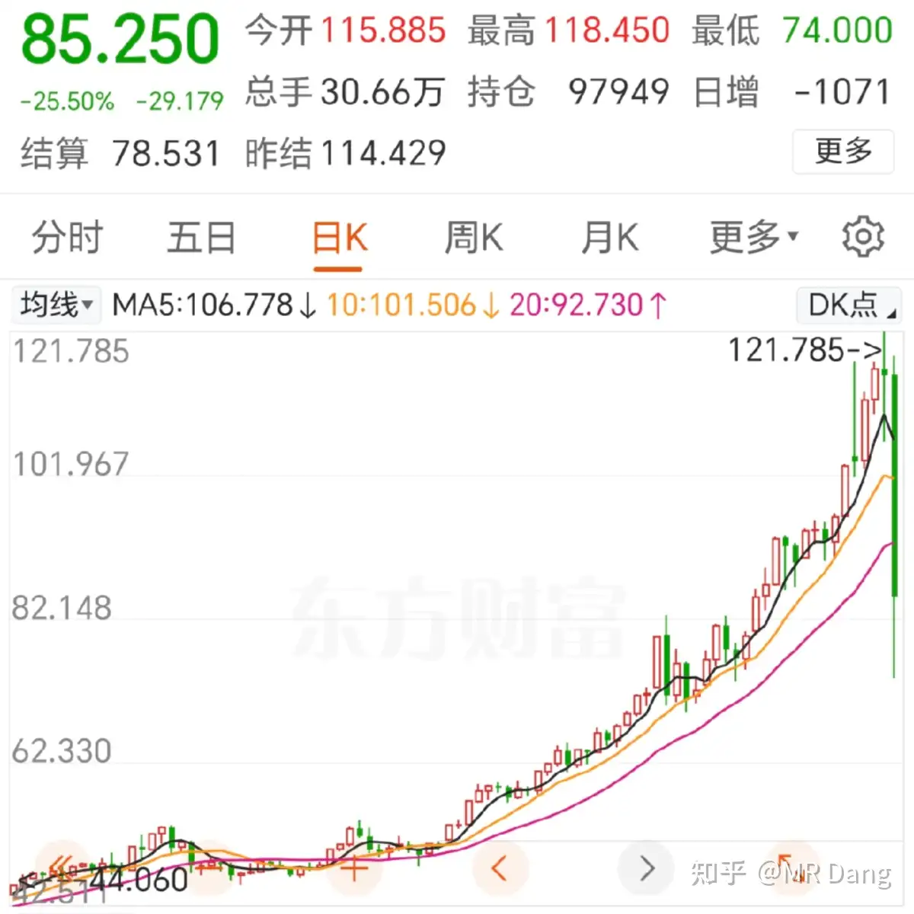
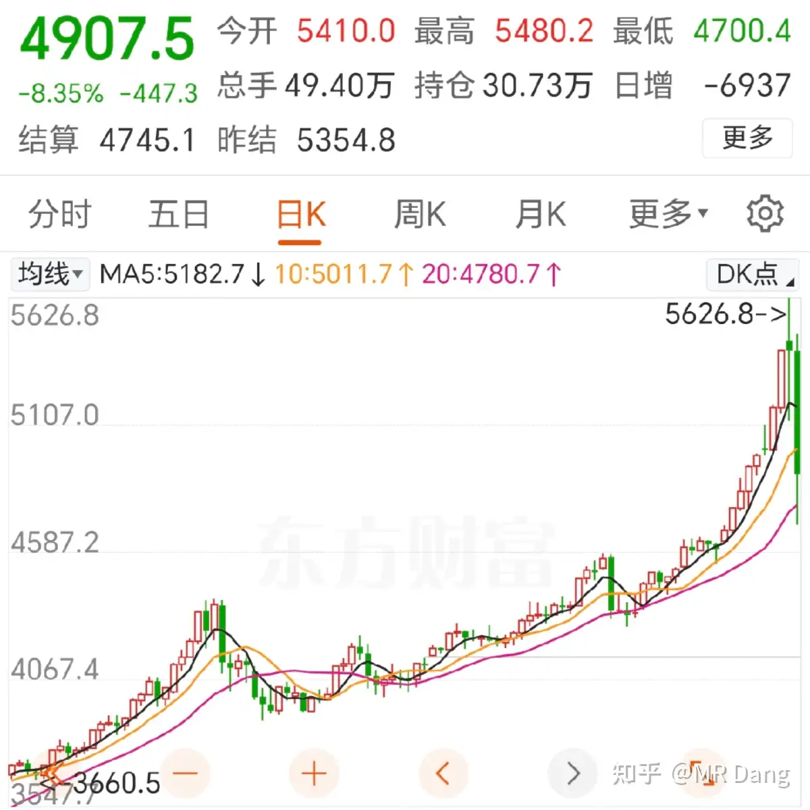
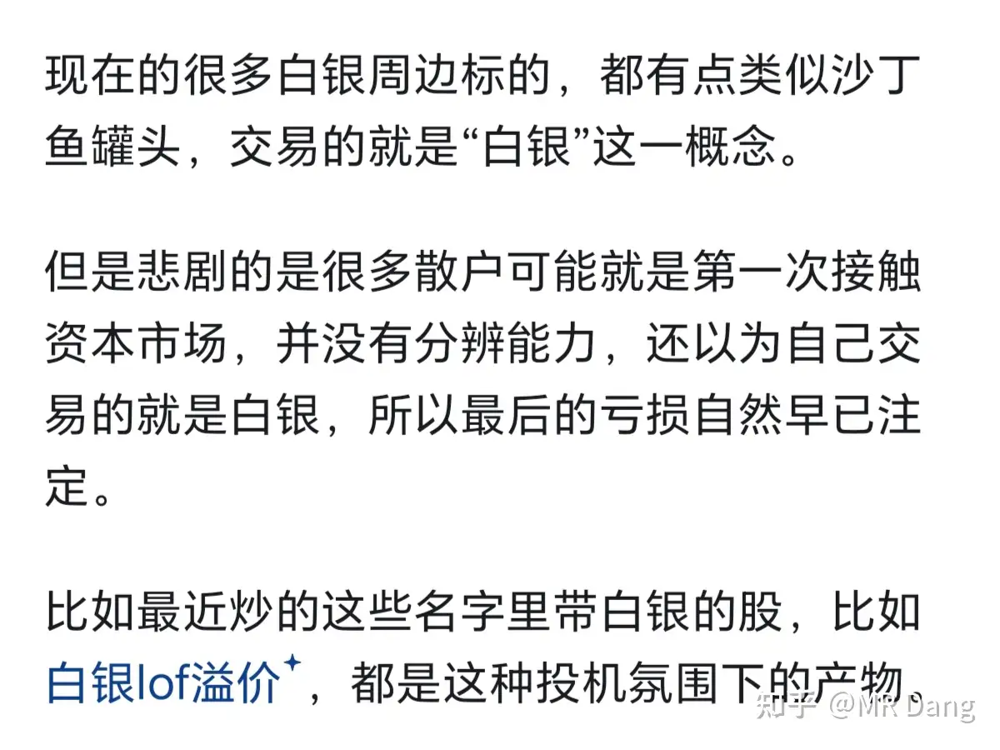
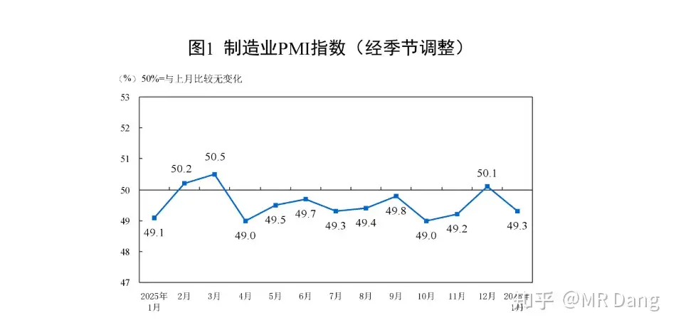
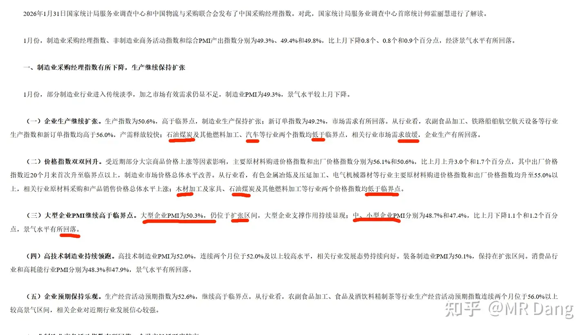
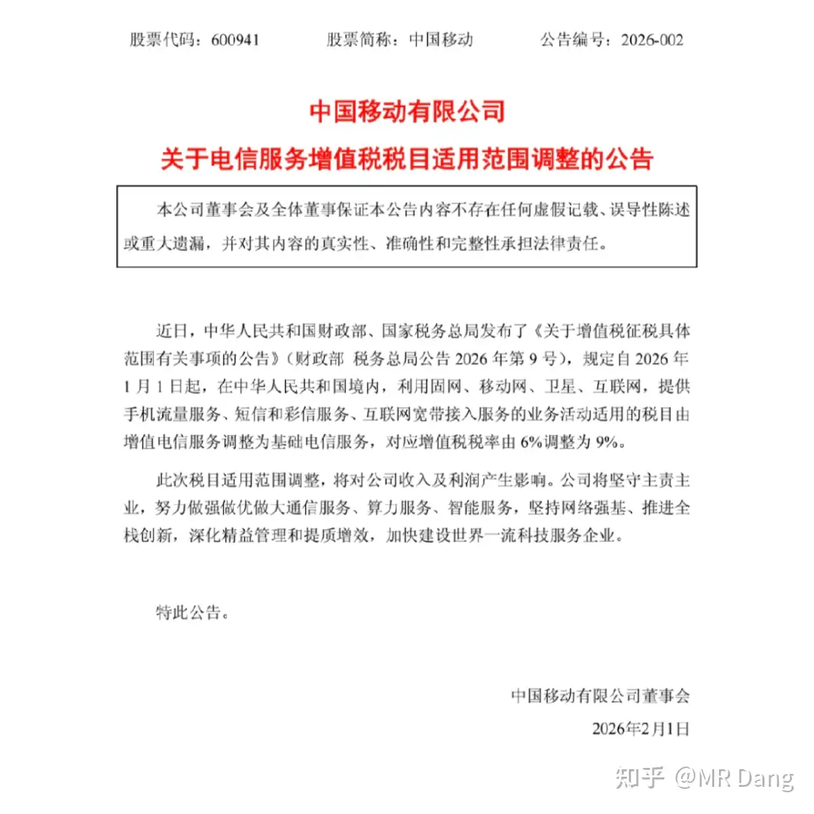
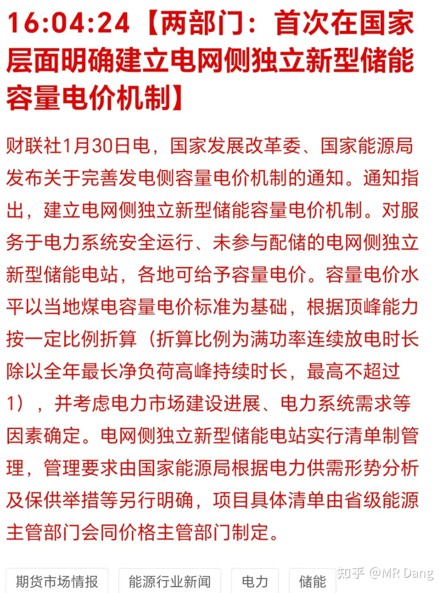

# 如何评价2026年2月2日A股行情？

---

**发布时间**: 2026-02-02 07:06  |  **原文链接**: https://www.zhihu.com/question/2000511830729171509/answer/2001551933022966587  |  **点赞数**: 1990 人赞同

**作者信息**: MR Dang​独立投资人，不接广不卖课，无任何其他平台，无小号。

---

## 正文内容

周末最大的新闻就是发生了人类有史以来最大规模的金融矿难。

白银：见证历史

黄金：回归理性

其他有色品种也有不同幅度的下跌，今天有色板块承压。

另外就是白银lof现在的溢价率极其高，按照目前的银价，达到100％，可能会有若干个跌停。

一些白银概念股，特别是那种硬蹭的，也会面临比较大的损失。

我在1月27日的早报中已经提示过相关风险了：[[20260127-该怎样评价2026年1月27日A股行情？|1月27早报]]

省流版：

很早之前我就不提白银lof套利了，为什么呢。

我发现一个事，就是尽管我本意是希望大家去套利，但是总有人会忍不住去搞投机。

可能大多数人一天也就套利一杯奶茶钱，但是只要有大聪明去投机，一赔就是半个奶茶店。

那我做鼓励大家套利这件事，很可能从期望上来讲就是负收益，所以我干脆不提了。

至于有色后面会怎么发展？

我自己做了以下宏观分析：

提前说明，我不是经济学家，只是路边摊野生唠嗑员，以下分析不作为任何投资依据，仅仅是思路分享。

首先是美联储掌门人和金银大跌的关系。

我有三个核心判断：

1，新任掌门人的潜在主张可能导致所有依托长端美元降息的泡沫资产挤出泡沫，包括权益类资产。

2，金银的大跌是一个挤出泡沫的过程，美联储掌门人的潜在主张只是一个导火索，核心是做多杠杆太高引起的共振踩踏。

3，有色金属会分化，基于降息预期的投机属性高的贵金属会在挤出泡沫后回归正常的美元脱锚定价。

而工业金属因为泡沫比较少，会在短暂波动后重新走回工业需求的主线。

简单的思考过程如下：

最重要的是不能单独看美联储掌门人的倾向，要结合懂王的战略意图来看。

懂王目前的表态有几点是确定的。

一是西大版的“脱虚向实”。

二是AI产业。

三是航母变现。

遇到的挑战对应的是：

一是资本市场来钱太容易，为了选票又需要保证资本市场的繁荣，那资金如何肯放弃躺赢的机会去苦哈哈的制造业呢？

二是Ai产业需要庞大的能源系统，黄仁勋对此有几层蛋糕的理论，最下面的一层就是能源系统，这是目前的瓶颈所在。

三是航母变现有时间窗口，而且面对来自东方的挑战。

除此之外，长期以来美债的问题也困扰着他们。

为了解决这些问题，懂王任用了沃什，除了他的雅诗兰黛身份之外，他的核心主张：

降息+缩表

在理论上是可以解决懂王的痛点的。

1.降息。

理论上可以降低实体企业的资金成本，降低企业负担，刺激消费和投资，支持就业。

说人话就是降低近端的无风险利率。

2.缩表。

这个就有说法了。

一般降息搭配扩表，这里搭配缩表相当于提高了远期的国债收益率，从而抑制资产泡沫，压低通胀。

有点左右脑互博的意思，像一个精细的外科手术，给懂王画了个大饼。

3.缩表后最直接的影响就是会减少利息支出，从而给J费增长留出空间，增加海贼王的统治力。

所以这一系列的组合拳下来可以看出：

A.西大的真实意图是Ai+工业+船队，这三个是主线任务，没有变化。

B.但是抑制通胀+资本市场+就业，这三个是选票所系，必须预期管理。

怎么预期管理？

沃什给懂王画饼，懂王给选民画饼。

C.美债是不想舍弃，但是不得不舍弃，最后要想办法软着陆的关键症结。

那么对应的就是：

1.AI+工业+船队→对应工业金属的需求

2.抑制通胀，资本市场，美债软着陆→对应贵金属的需求

从而造成的结果就是：

有色整体的分化。

1.贵金属的工业需求和投机需求剥离，投机需求越高的，短期内泡沫越大，杠杆越高，由这个导火索，造成泡沫的挤出。

但是当这个泡沫挤完后，由于美元脱锚的不可阻挡，贵金属特别是黄金，个人依然是长期看好的。

2.工业金属的需求具有很强的确定性，AI+工业+船队，都是要用到这些资源的，最终会演变成定价权，所有权，使用权的全方面的争夺。

而目前像铜铝几乎是没有什么投机杠杆的，个人判断短期内虽然也会受到情绪影响，但是长期向好依然值得期待。

工业金属最大潜在的黑天鹅就是ai叙事的失败和经济的大规模衰退，这是相当致命的。

这是基于现状个人对大宗的一个判断，另外我不太看好降息+缩表的实际落地效果，更多的可能是通过表态形成预期管理，最后实现软着陆。

第二个宏观数据是咱们这边的：

个人解读宏观数据是容易触发雷点的，所以咱们看权威解读：

其实方向已经给你了，该避开的方向也告诉你了，听不听，那需要自己判断。

制造业，就要选大的，BIG IS GOOD。

我就喜欢又大又笨的东西。

几家运营商发布公告：

最近已经跌了不少了，评论区问的非常多的品种，我个人也不是说觉得不好，就是和其他高股息品种相比，感觉没什么特别优势。

现在这个影响不可谓不小，影响五个点的增速是有的，就看能不能传导到下游了。

像这类有点垄断性质的企业股东格局要打开，现在大家庭需要活动经费，能做出一些小贡献也是应有之义。

至于下游。。。

咦？下游竟是我自己。。

另外文件是1月30公布的，但是之前走势就萎靡不振，所以难免会有人抢跑的嫌疑。

元宝最近攻势凶猛：

登顶苹果免费榜首。

最有意思的是，我有好几个比较高大上的小圈子，里面全是有名有姓的金融圈精英，上一秒还在讨论去哪里套利，张嘴闭嘴多少个小目标，下一秒就甩出一个元宝红包的链接。

太魔幻了，好几个不同的地方都是这样的。

感觉春节前后，这块儿的拉锯战会反复上演。

储能方向有新文件：

以我对这行业的的浅薄见识，我认为这是一个相当重要的文件。

基本上对储能行业是一次重塑，资本市场相对应的也有可能给出回应。

整个储能的需求，利润率，都需要重新按计算器，潜在的机会不少，对这方面有了解的投资者可以衡量下潜在的风险和收益。

另外就是配套的电力设备什么的，也是受益的方向。

现在哪怕一些基础的变压器之类的呢设备，由于供需关系的转变，订单都排到几年后了，不是价格的问题，是有没有现货的问题。

本周前瞻：

2月4，西大公布ADP就业数据。

2月5，欧洲和英国央行利率决议，市场预期不变。

2月6，非农就业数据。

2月7，央妈公布外汇，市场可能会比较关注黄金的情况。

另外财报预披露已经结束，今天一些标的可能会有大幅度波动。

对我来说，今天可能又是挨打的一天，资源类这几天波动不会小，情绪的传递可能会放大一部分投资者的恐慌情绪。

周末已经讲了好几次了，这种时候最忌讳的就是盲目的，赌气式的加仓，寄希望于通过补仓马上解套。

一个喜欢保护韭菜的博主，希望大家少少踩坑，多多赚钱！！！

---

> [!comment]- 点击展开评论
> | 用户 | 时间 | 内容 |
> | :--- | :--- | :--- |
> | 慎独 | 9 小时前 | 总结:有色金属尤其是贵金属前段时间涨得过高，而且很多人加了杠杆，碰到了黑天鹅和灰犀牛遭遇了下杀。但长期看地缘政治的不稳定性，美债的无序扩张及美元超发，ai及机器人产业的发展，加上产量相对固定，长期看有色还是向上的。铜铝工业属性更强，相对投资泡沫更少，可能先一步止跌回稳。已��入场的不要着急跑，没进场的也别着急补仓。 |
> | 豆豆 | 8 小时前 | 上周学艺不精怒踩两雷，1.恐慌性想抛售铝铜，2.怒接下落飞刀。反思结果，问题1，贵金属再跌其实铝铜的基本面没变，AI叙事主旋律不破，铜就是王中王，铜在高价，铝就是头号备胎，煤价不飙升，电解铝就有很厚的利润垫，目前来看AI无人可替，铜铝基本盘无忧，可长持。问题2，干啥都要交学费，幸有大佬，已经避免了小白到处撒币，三成有色仓位也不算太高，基本面也还不错，这个学费算是交得起。学习到的逻辑，避免情绪判断，很多人很多事太擅长搞人心态，多看少动，完善认识网络，特殊时期就算补仓也要放大网格，比如银行因为高股息打底，跌个5%补一下，甚至有种捡便宜的快感，但是热点股和趴窝股如果根据逻辑软硬选择较大跌幅再补仓或者用不补仓交作业 |
> | &nbsp;&nbsp;&nbsp;&nbsp;MR Dang | 8 小时前 | 学费没白交 |
> | 马杨杨 | 9 小时前 | 哎呦，各位大佬是真早呀，全守着呢。作为初入股市的小白，好消息是，初入股市就发现了无私的大佬，坏消息是，发现大佬之前仓位已打满，结果跟着大佬目前连个汤都没喝着 |
> | &nbsp;&nbsp;&nbsp;&nbsp;MR Dang | 9 小时前 | 慢慢来 |
> | 寂寞侯jojo | 9 小时前 | 我们是来套利的，不是来炒股的，但是总有大聪明觉得套利太慢，直接开炒，结果大部分都是一地鸡毛。 |
> | &nbsp;&nbsp;&nbsp;&nbsp;MR Dang | 9 小时前 | 所以不提就是最好的 |
> | 更深的蓝 | 8 小时前 | 老师早安。昨天一直在体会您的十万粉感言。作为一个被生活教育过的中年男人，看到"擦屁股理论"时还能会心一笑，但看到"两套运行规律量子态叠加"时深受震撼。股市是人性的赤裸体现，更是现实社会的投影，您这"两套运行规律量子态叠加"的理论，扩展开去可说的太多，对我来说就是神级一课，而您就这样无私分享出来了。我既惊叹于您透过现象看本质的能力，更感动于您的悲悯之心。向您致敬，也努力向您学习，心存悲悯，广积阴德，做个让世界更美好一点的人。 |
> | &nbsp;&nbsp;&nbsp;&nbsp;MR Dang | 8 小时前 | 谢谢 |
> | 灰烬 | 7 小时前 | 你这 |
> | 嗨喽鱼 | 7 小时前 | 美国的手纸没涨价 |
> | 烈焰寒霜煮青梅 | 9 小时前 | 党老师早，紫金矿业与南山铝业在手，今天准备老老实实挨打。嗯，一动不动的挨打。 |
> | yang nan | 8 小时前 | 有色承压？明明是我自己承压。 |
> | 天道酬勤我躺赢 | 8 小时前 | 你是懂承压的，简直是泰山压顶 |
> | 路路 | 5 小时前 | 化工也跟跌... ... |
> | 11.2千米每秒 | 2 小时前 | 我的盐湖股份呀 |
> | 小观园 | 5 小时前 | 你说防守一波，我听成了放手一搏 |

---

*本文件由自动脚本从MR Dang知乎页面提取生成*

---

**作者**: MR Dang
**链接**: https://www.zhihu.com/question/2000511830729171509/answer/2001551933022966587
**来源**: 知乎

*著作权归作者所有。商业转载请联系作者获得授权，非商业转载请注明出处。*

---

## 相关阅读

**📈 近期行情评价：**
- [[20260127-该怎样评价2026年1月27日A股行情？|1月27日行情]] - 白银风险提示
- [[20260130-如何评价2026年1月30日A股市场行情？|1月30日行情]] - 运营商公告前的市场
- [[20260131-周末扯犊子|周末扯犊子]] - 周末闲聊

**📚 新手必读系列：**
- [[20251016-投资新手避坑指南之追热点(万粉特别奉献)|追热点避坑]] - 新手最容易犯的错误
- [[20251011-下周一股市就要大跌了，作为投资者该如何应对？|大跌应对]] - 跌的时候不要随便加仓
- [[20251020-投资新手避坑指南之仓位控制|仓位控制]] - 风险控制的基本功

**⚔️ 天阶功法系列：**
- [[20251030-《天阶功法卷三》NSLY投资价值浅析|天阶功法卷三]] - 低价铝投资价值分析
- [[20251125-《天阶功法卷七》中国黄金第一家——C公司投资价值分析|天阶功法卷七]] - 黄金龙头公司深度分析

**🎉 万粉感言：**
- [[20260201-十万粉感言|十万粉感言]] - 量子态叠加理论与投资心路历程
- [[20260117-五万粉感言|五万粉感言]] - Dang老师感言与股票别名对照表
