# 如何看待2026年2月3日A股行情？

---

**发布时间**: 2026-02-03 07:09  |  **原文链接**: https://www.zhihu.com/question/2001468681742483857/answer/2001915259523453721  |  **点赞数**: 1172 人赞同

**作者信息**: MR Dang​独立投资人，不接广不卖课，无任何其他平台，无小号。

---

## 正文内容

今天把大家最关心的大宗商品放最前面，起码看这到这里的时候就不慌了：

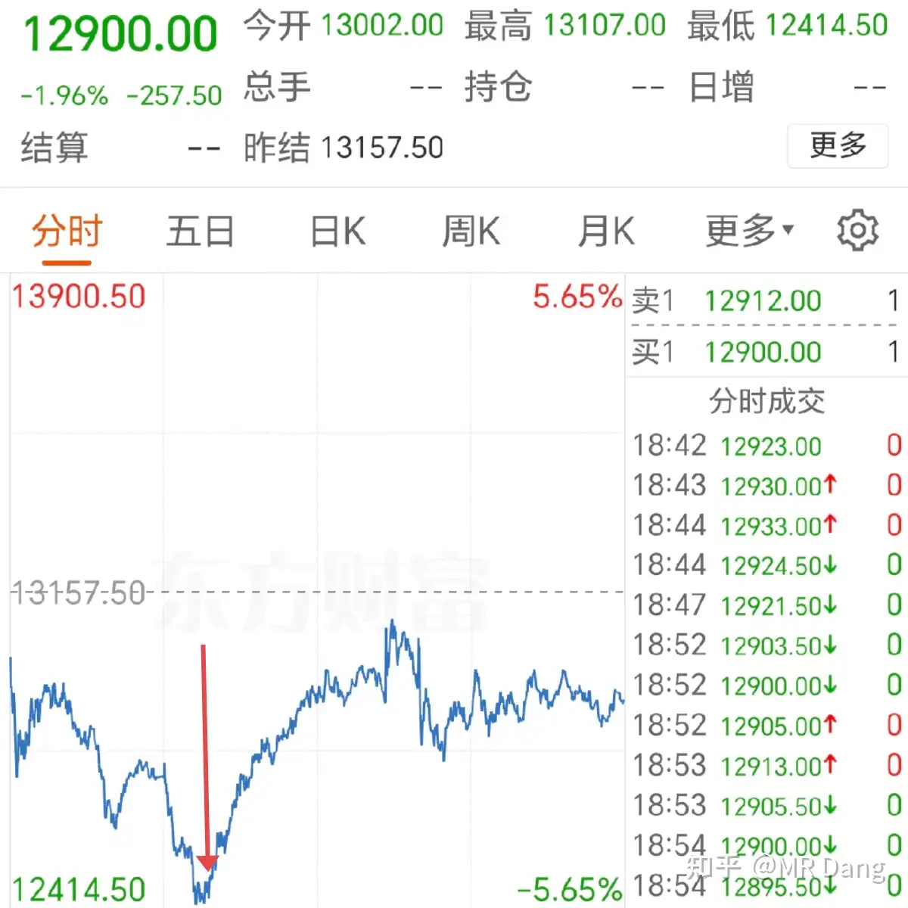

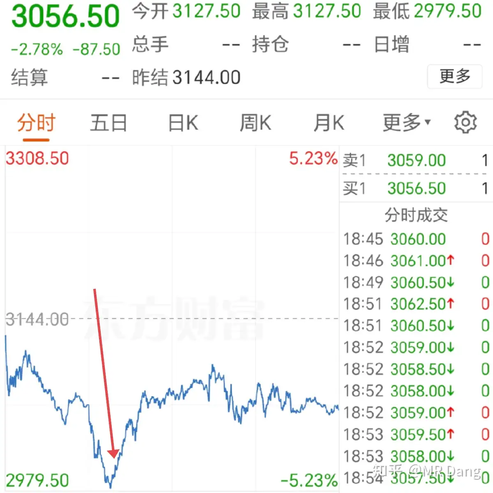

工业金属：

箭头指向的部分就是昨天下午收盘时的截止走势。

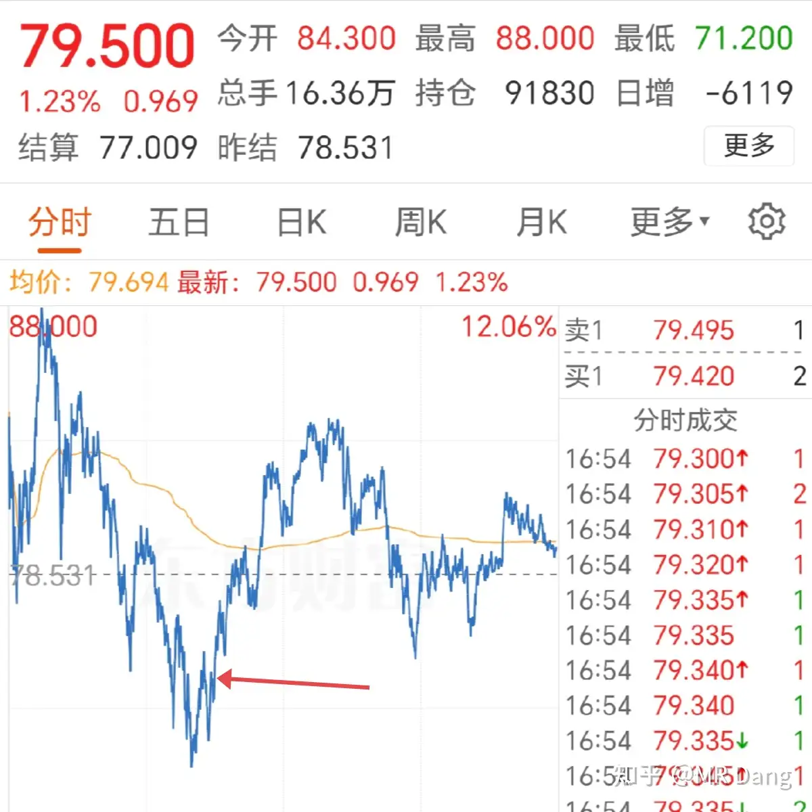

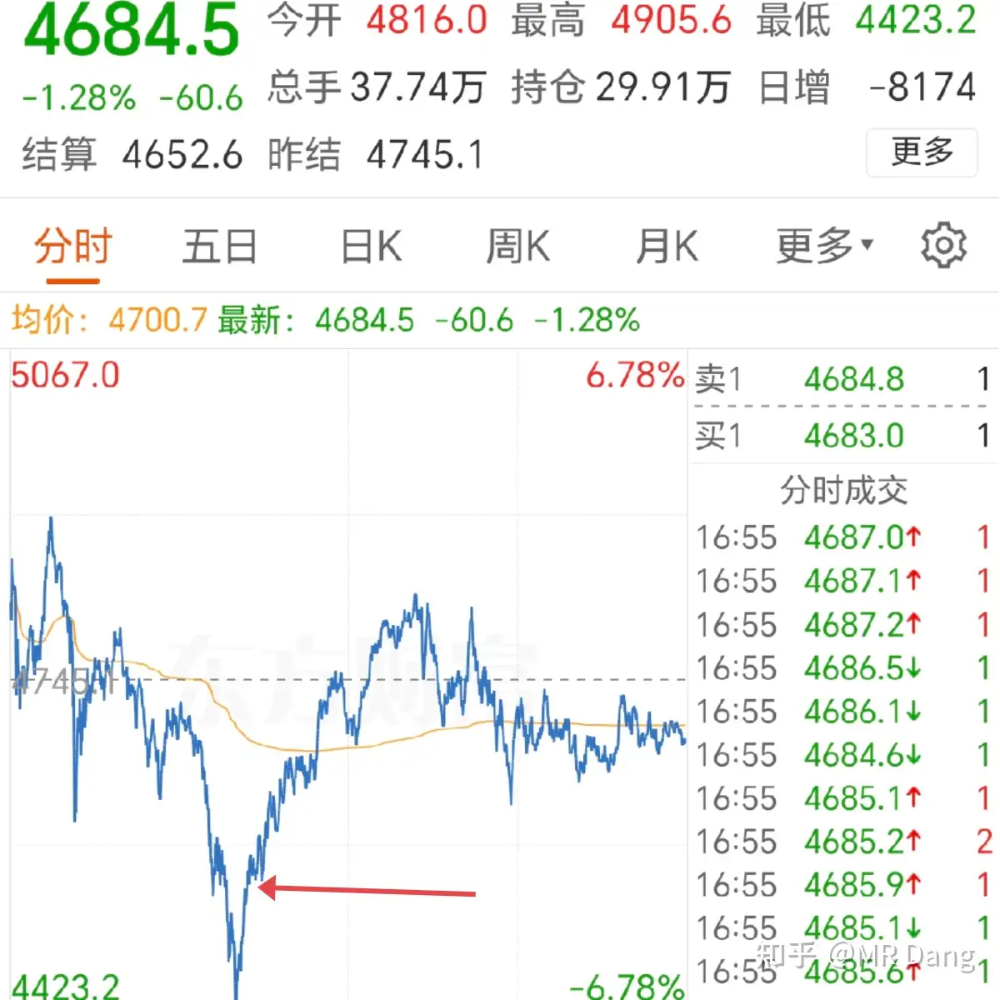

铝也是，箭头指向为昨天收盘时价格。

所以总的来说，工业金属暂时是企稳了。

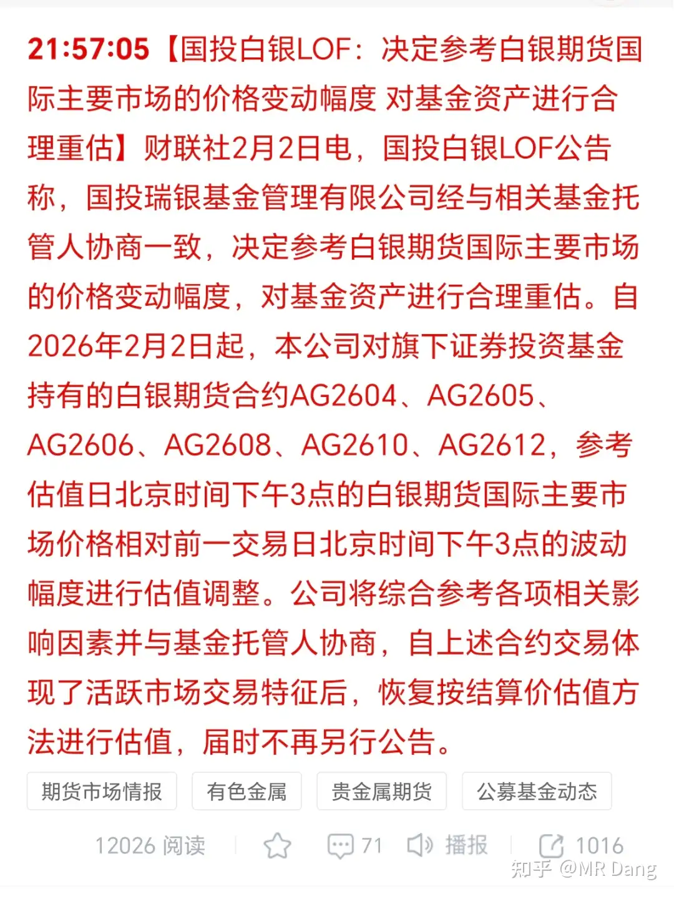

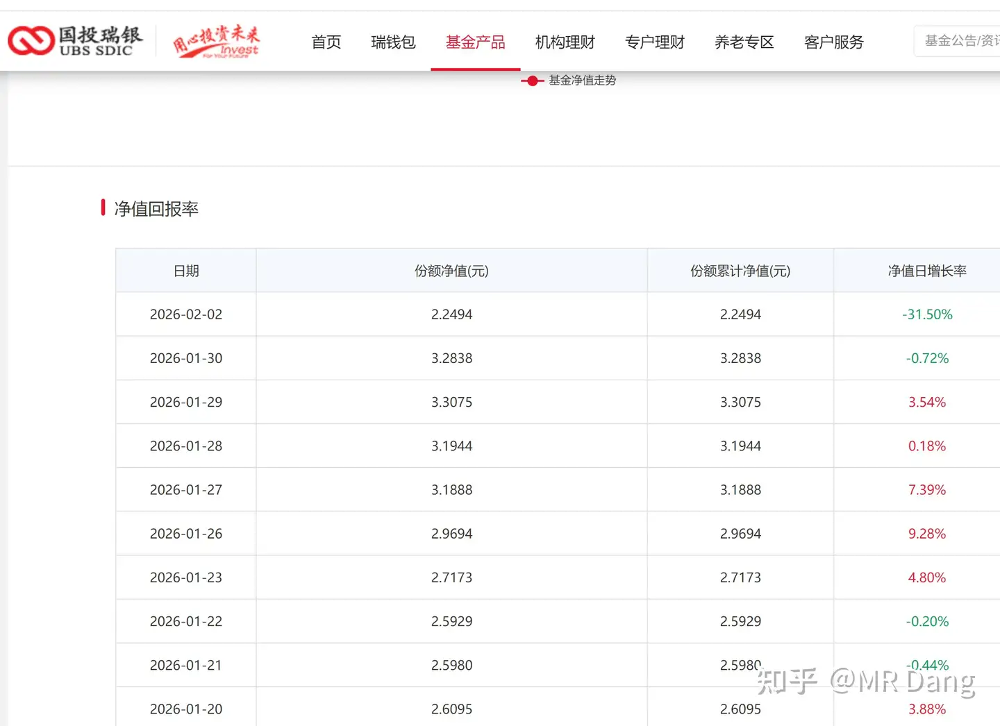

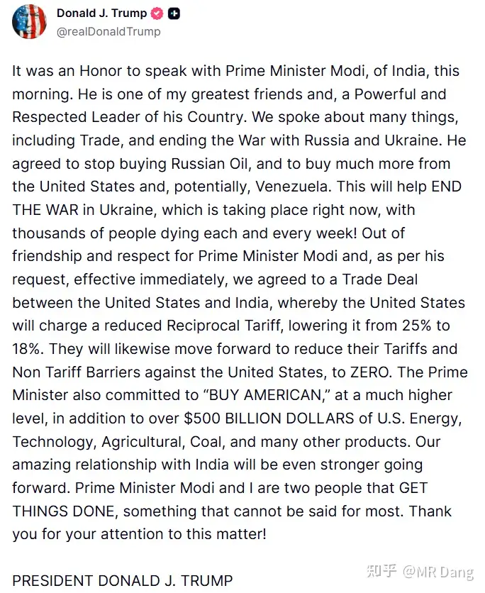

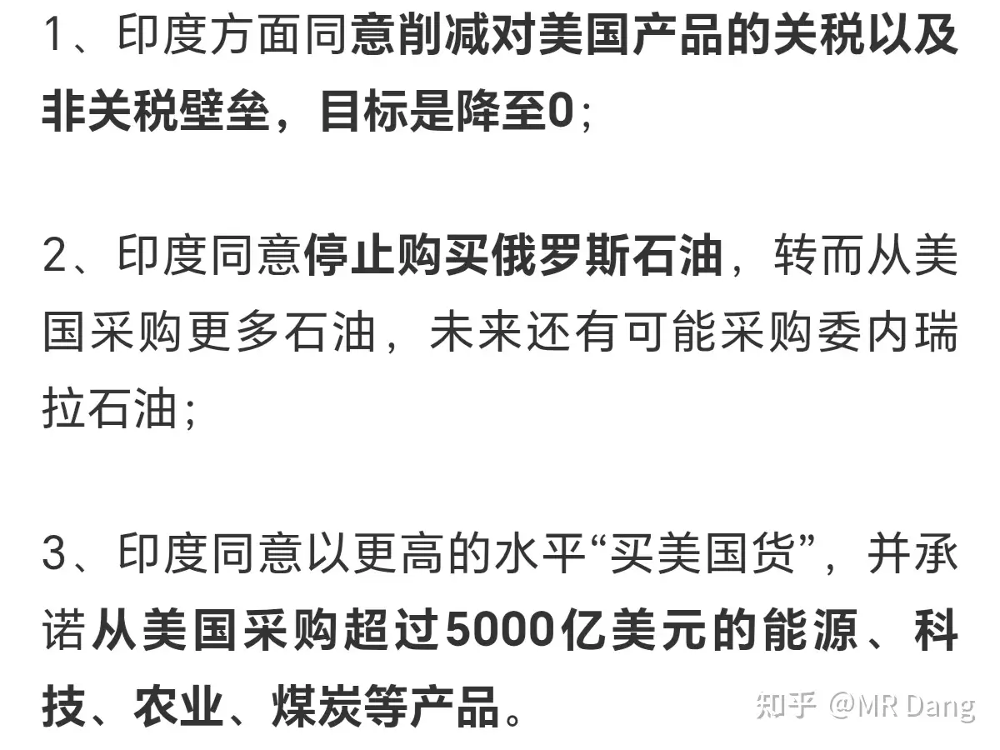

贵金属：

白银：

黄金：

基本都算企稳了。

话说黄金4500以下还是有些吸引力的，很多人一看黄金跌了就不敢定投了。

我觉得有定投习惯的，现在囤一些反而还不错，但是这个位置是不是底，也没人能打包票，考虑清楚风险和收益就行。

最近热度很高的白银lof：

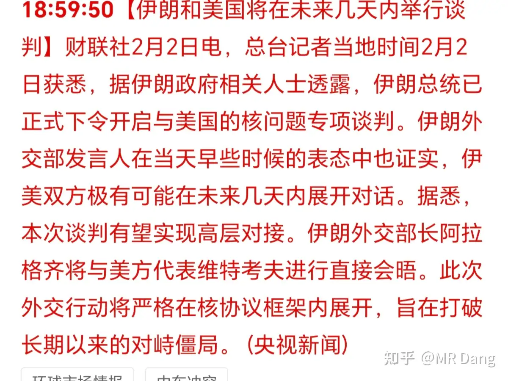

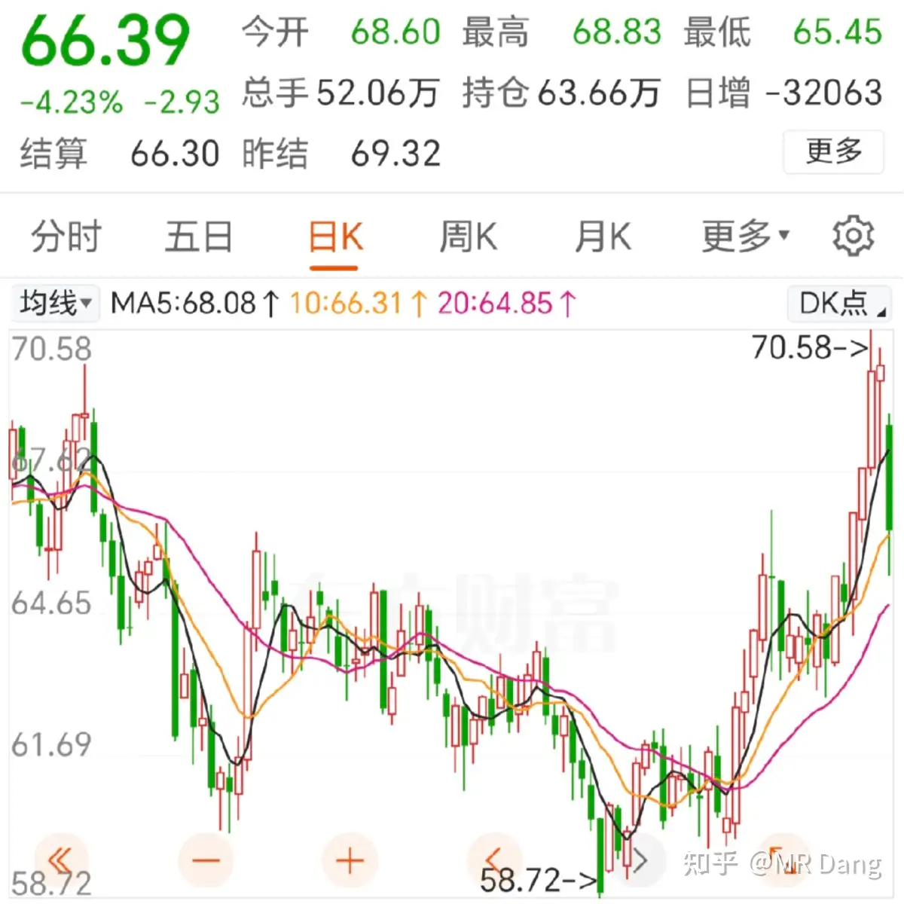

翻译一下人话就是：

之前计算净值的时候，用的是国内期货价格，但是国内期货价格有涨跌停，按在跌停板上下不来，和国际有差价，显示的净值不真实。

现在用国际银价，计算的净值就更少了，溢价率就更高了。

很多人一看跌的太快了，卖不出去，就想着赎回，赎回就不能按照跌停板价格给你算了，只能按国际银价计算。

套利的这下几杯奶茶钱没了。

投机的一觉醒来，吃了一个跌停后，净值下降30％多，溢价率又更高了。

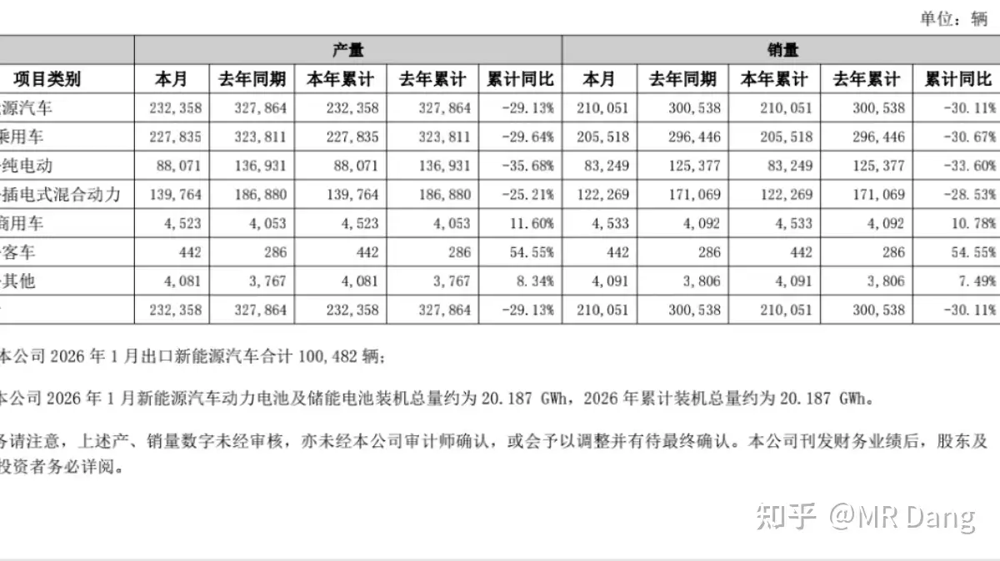

讽刺的是，很多小白没搞清楚净值的计算规则，之前一直以为公布的净值就是真实净值就冲进去了。

昨天我说溢价率100％的时候有些投资者还有点蒙圈。

要我说，用国际银价是应该的，但是规则改来改去，很难评啊。

懂王和莫迪达成新的协议：

总结就是：

停止购买大毛石油，然后买委内瑞拉石油？

我怎么感觉像忽悠呢，不太靠谱啊。

波斯谈判最新进展：

大概情况是个啥呢？

波斯那边有400多公斤的浓缩洗衣液，就差最后一步就搓成蛋蛋了。

懂王的意思是要不把这些浓缩洗衣液往海里倒一些，留着怪吓人的。

波斯不想倒，但是海贼王船就在门口，也只能先探探口风。

现在是小以子不想两边开打，因为波斯明显打不过，但是急了可能拿他撒气。

小以子之前的弹药消耗太多了，防空这块儿有点虚，不想给懂王买单。

受此影响，原油近期热度有些退散。

布油又回到了之前66美元的水平。

原油也是问的多的品种。

我个人不建议普通人直接参与两个特定品种的交易，分别是原油和天然气。

为什么呢？这两东西信息差是最大的，定价权在少数人手里。

普通人交易这两个品种面对的风险非常大。

原油有几个特点，难以储存，买了就用，供应几乎无限。

对，你没看错，原油的供应可以看成是无限的，就看价格是多少。

全世界有各种成本的钻井，包括页岩油什么的。只要油价稍微高一些，你不知道哪些本来已经因为亏本停工的钻进就开动了，供应说来就来。

油价越高，供应越多。

所以原油的的供应是动态变化最频繁的，就需要你有最准确的供求关系的信息才能做出判断，对普通人来说是天方夜谭。

某车企近日公布了产销数据：

资本市场对这个做出了消极回应。

当然我不是想说这家公司，我想说的是整个电车行业。

目前成本端涨太多，销售端量价齐跌。

电车我每过一段时间会提示一次风险，因为我发现就是有些中产吧，买了一些特定品牌的电车，就产生一定的品牌忠诚度。

不单自己买车自己用车，而且把积蓄全部买成了相关公司股票。

在我看来是很危险的一件事情。

从竞争角度来说，龙头不好主动降价，不体面。

但是这种成本不断上涨的格局说不定恰好是有规模效应的车企希望见到的。

卷王不怕考试，学渣就不好说了。

还有变压器的小作文，这个昨天盘前已经说过了，就不跟风再说了，现在股票都涨上去了，说这个没啥用了。

但是电网储能方向我强调过很多次了，可以放在心里，等它回调的时候配置一些，这个确定性还真挺强的。

昨天中午看了一次盘，那时候还是红的，到了收盘又是一顿毒打，回撤一个多点。屏幕绿绿的，资源标的全线大幅回撤，其他也是绿多红少。

幸好之前止盈的多，躲进银行，不然这波回撤就损失巨大了。

这也是为什么30%止盈的原则要贯彻下去， 这边资本市场的生态就是暴涨暴跌，不及时止盈落袋为安，就没了。

至于银行=空仓的理论，说再多次都会让人觉得是谬论，但是你实践过几次就知道它是有道理的。

假设这个时候想买了，银行股一卖，想买哪个买哪个。

所以看起来仓位是满的，真实仓位只有半仓都不到，两边一涨一跌，除银行股外的仓位就更少了。

我的这套高股息+银行压仓+30%止盈+分散的方法可能放到美股是小丑，但是在A股就挺适用的，高股息和银行是保证下限的，止盈是防止大起大落的，分散是防止黑天鹅的。

分别对应A股的三大特点，无下限，暴涨暴跌，黑天鹅多。

还有加仓的事情，我没记错的话连续说了三天不要接飞刀了，再接就有点说不过了。

不过要是万一没忍住接了，接了也就接了，不要上头，控制住仓位问题还是不大的，不要葫芦娃救爷爷。

只要标的够硬，后期还是会跟着基本面来的，情绪总有释放完的一天。

在剧烈波动中，只要不继续犯错，已经超越大多数人了。

最近的行情，除了有色股遭殃，很多其他板块其实也跌了不少。

行情不好就是这样的，吃肉的时候未必在场，挨打的时候一个不落。

因为这属于短期内的流动性坍缩。

肯定会有很多投资者同时持有几个板块的股票，一看有色跌了，把其他标的卖了去补仓。

这么做的投资者多了，就会发生踩踏。

所以也不需要去找什么基本面的原因，纯粹就是正常市场波动，也不用过分焦虑。

但是潮水褪去才知道谁在裸泳，有的股跌下来就再也回不去了，有的股跌下来恰好是给机会，因为股息率又上去了。

功课要做在前面，回调的时候才不会慌。

还有就是这种时候，如果有补仓或者减仓的计划，提前做好规划，算好仓位，甚至提前报单都可以，不要去看盘了。

越看越沮丧，越看越生气，越看越恐惧。

容易一冲动犯下大错，白生了一肚子气不说，还赔钱。

越是这种时刻越要调试心态，脑子清楚才能保证手不忙脚不乱。

一个喜欢保护韭菜的博主，希望大家少少踩坑，多多赚钱！！！

（好久没许愿了，许愿今天所有读者都能吃口肉回回血！）

---

> [!comment]- 点击展开评论
> | 用户 | 时间 | 内容 |
> | :--- | :--- | :--- |
> | 天寒梦泽 | 1 小时前 | 周五加昨天两天基本吃掉一月的利润，涨一个月，回去两天，大A不愧是绞肉机，对大佬的"高股息+银行压仓+30%止盈+分散"体会的越来越深了，人对踩过的坑才能印象深刻，不然都觉得自己比别人强，承认自己是普通人，老老实实体会大佬的经验坚决执行就完事儿了，希望今天大家回口血。 |
> | 青蛙 | 1 小时前 | 总结贵金属和工业金属企稳；原油，信息差太大，定价权在少数人手里，普通人不建议参与；电网储能等回调配置；银行=空仓。 |
> | 兔子啥都不知道 | 1 小时前 | 这么快就可以企稳吗 |
> | 浮岛 | 1 小时前 | 好像金价涨了的原因吧 |
> | 彼岸花开 | 1 小时前 | 企稳是不会再暴跌的意思吧 |
> | yao | 1 小时前 | 早上好！套都被套住了，那就耐心等他解套吧。大佬说的对，有30个点就该跑了。太贪了，综中曼之前长得飞起的时候都没跑 |
> | 潇潇夜雨 | 1 小时前 | 涨30%股息率从4掉到3以下 所以要跑？股息作为锚点 下限确定 稳定收益曲线 |
> | 六六 | 44 分钟前 | 自己学会了一个对冲组合，工资➕股市 |
> | 今晚回家吃饭 | 25 分钟前 | 那很稳定了，有进有出的 |
> | 壮哥不会飞 | 18 分钟前 | 关键是几个月的工资对冲一天的股市 |
> | 潮阳老刘 | 1 小时前 | 之前中色GF赚40个点没跑，乱补成了赚4个点。九鼎XC赚100个点没跑，结果剩60个点。犯了不畏惧市场的大忌讳，算交了学费了 |
> | 草禾里珍珠 | 1 小时前 | 已经很厉害很厉害了 |
> | 潮阳老刘 | 1 小时前 | 长久波段在大跌避免不了恐慌和幻想情绪，抵抗不了人性的弱点，外盘黄金白银大跳水的时候隔夜单就得挂上的，犯了两个大忌全在党大十万粉发的负面清单里了 |
> | 夏天 | 1 小时前 | 40个点变成4个点我理解不过来啊 |
> | 魑魅魍魉月明23 | 57 分钟前 | 加仓了，抄底 |
> | 求证后再说话 | 49 分钟前 | 那另外四个字你肯定知道"高位加仓，一把亏光" |

---

*本文件由自动脚本从MR Dang知乎页面提取生成*

---

**作者**: MR Dang
**链接**: https://www.zhihu.com/question/2001468681742483857/answer/2001915259523453721
**来源**: 知乎

*著作权归作者所有。商业转载请联系作者获得授权，非商业转载请注明出处。*

---

## 相关阅读

**📈 近期行情评价：**
- [[20260202-如何评价2026年2月2日A股行情？|2月2日行情]] - 金融矿难与有色分化分析
- [[20260131-周末扯犊子|周末扯犊子]] - 周末闲聊
- [[20260130-如何评价2026年1月30日A股市场行情？|1月30日行情]] - 运营商公告前的市场

**📚 新手必读系列：**
- [[20251016-投资新手避坑指南之追热点(万粉特别奉献)|追热点避坑]] - 新手最容易犯的错误
- [[20251011-下周一股市就要大跌了，作为投资者该如何应对？|大跌应对]] - 跌的时候不要随便加仓
- [[20251020-投资新手避坑指南之仓位控制|仓位控制]] - 风险控制的基本功
- [[20251031-新手投资者避坑指南之测算股息率|测算股息率]] - 基础功法

**⚔️ 天阶功法系列：**
- [[20251030-《天阶功法卷三》NSLY投资价值浅析|天阶功法卷三]] - 低价铝投资价值分析
- [[20251106-《天阶功法卷六》银行股投资原理详解|天阶功法卷六]] - 银行股投资系统方法论

**🎉 万粉感言：**
- [[20260201-十万粉感言|十万粉感言]] - 量子态叠加理论与高股息+银行压仓+30%止盈+分散方法论
- [[20260117-五万粉感言|五万粉感言]] - Dang老师感言与股票别名对照表
