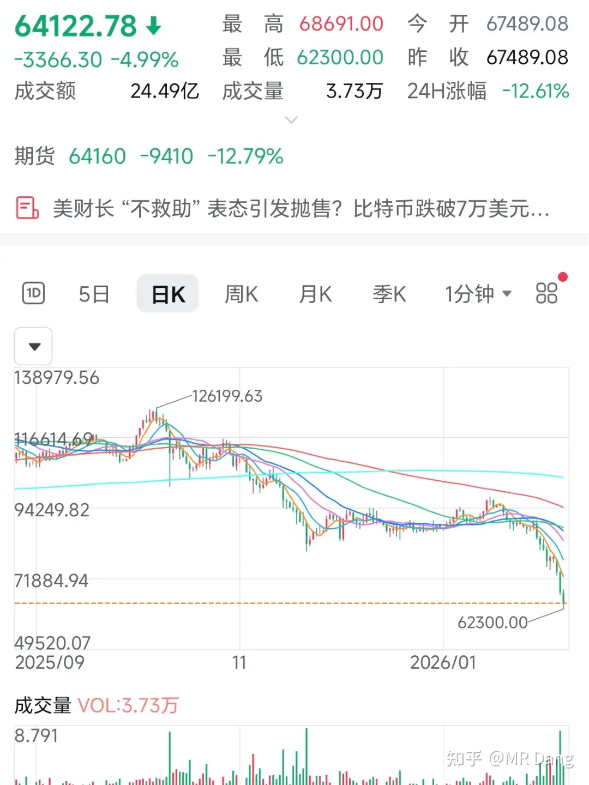
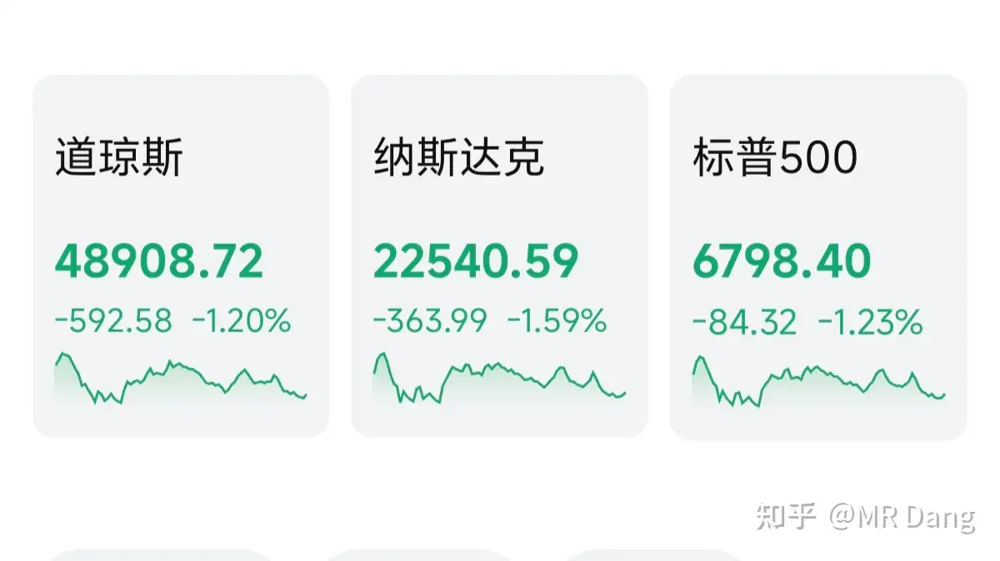
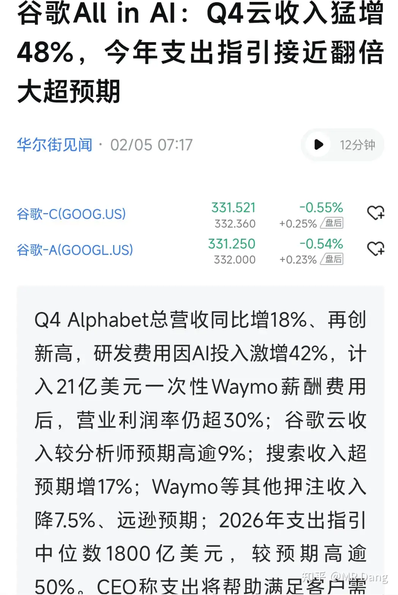
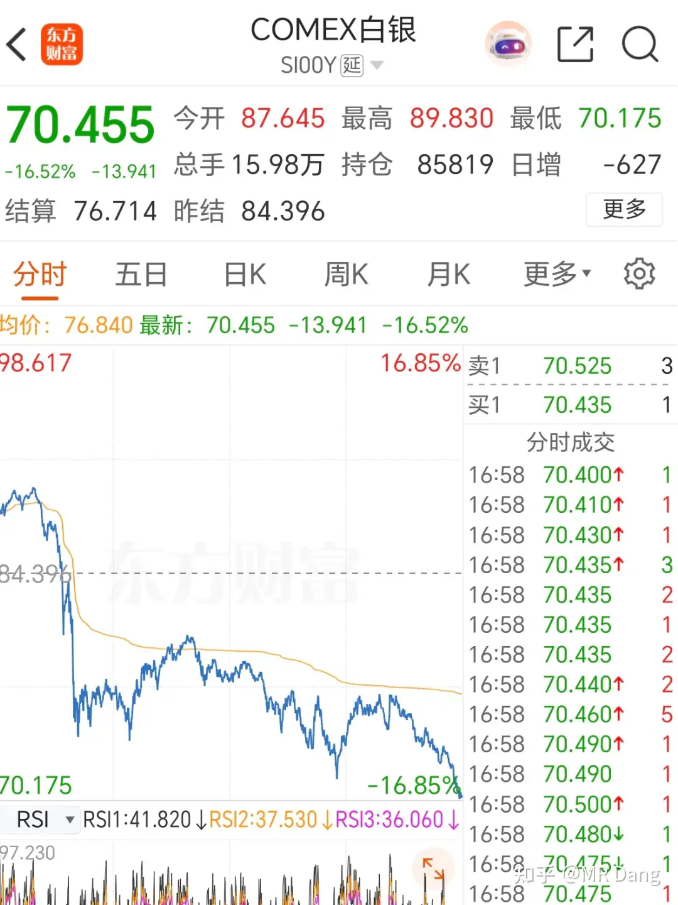
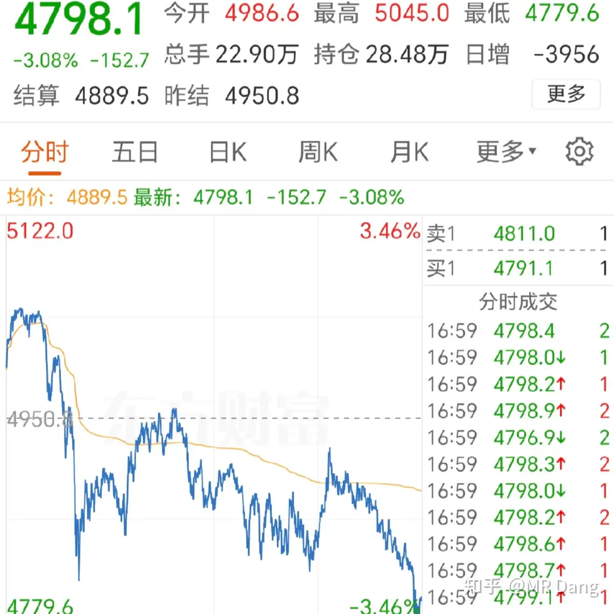
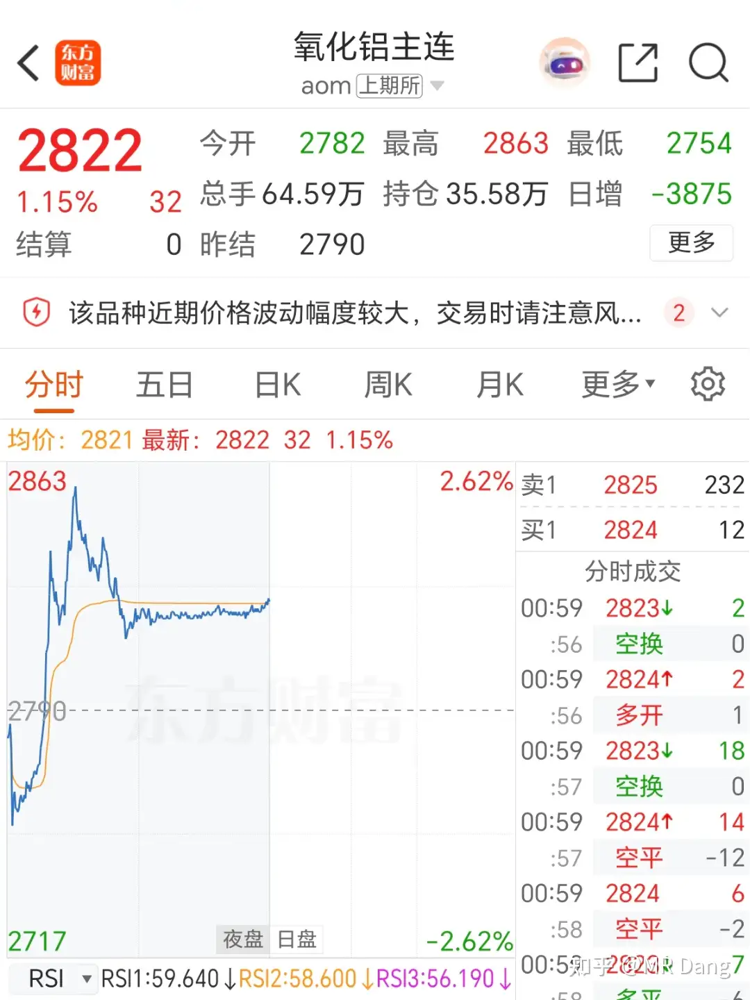
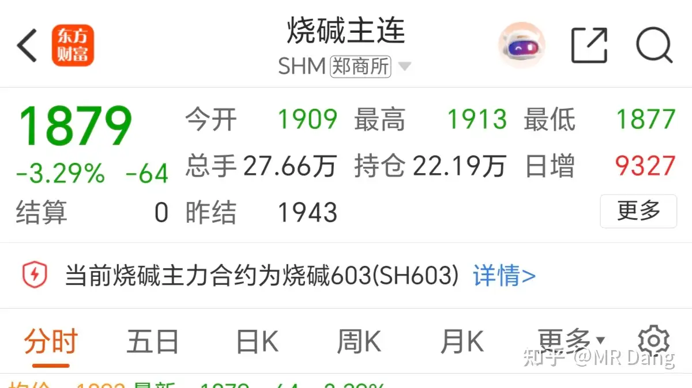
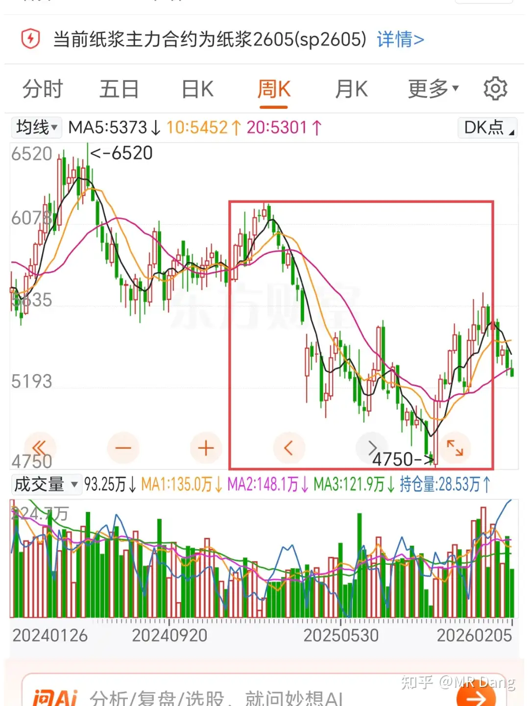

# 如何评价2026年2月6日A股行情？

---

**发布时间**: 2026-02-06 07:02  |  **原文链接**: https://www.zhihu.com/question/2002379969519708006/answer/2003000522026805189  |  **点赞数**: 1452 人赞同

**作者信息**: MR Dang​​独立投资人，不接广不卖课，无任何其他平台，无小号。

---

## 正文内容

本周最后一天了，头条给到大饼。

作为一项大宗资产，腰斩只用了四个月，稳定性这点比黄金就差远了。

饼子有自己的周期，抄底的谨慎吧，西大的态度很暧昧，明着没说，但是行动上放弃了，可能是没等到想要等的人。

至于玩合约的，自求多福，玩这种24小时连轴转的合约能睡好觉也是一种本事。

外围市场：

寒意阵阵，谷子给出了一份远超预期的财报，居然表现也不佳。

分歧在2026资本支出这里，以前风险偏好高的时候，如果听到all in ai，那资本市场就起飞。

现在风险偏好低，听到要花1800亿美元，比预期的1200亿多了600亿，第一反应是开弓没有回头箭。

Ai现在不确定性太高了，一天一个样，这么多钱砸下去，最后啥结果谁心里都没底，资本开支增加，利好的只有ai铲子股。

大宗商品：

白银：逼近70的重要点位，看样子可能顶不住，比昨天下午三点收盘跌了十来个点。

普通人不要碰白银，这玩意儿波动太大了，玩不明白的。

黄金：比昨天下午收盘回调了三个点，喜欢黄金的又可以蹲4500以下的位置了。

其他的原油和锡回调了三个点，铜一个点左右，铝回调了不到半个点。

氧化铝有异动：

小道消息某厂480万吨氧化铝产能停了320万吨。

因为生产氧化铝需要烧碱，所以烧碱期货跳水：

在金店和旅游止盈后，我一直在看合适的消费方向，补充消费的配置。

目前在看的是纸，化妆品和一个小众的蛋制品。

然后纸的话，看的差不多了，可以分享下逻辑，不是荐股，只是分享一下这个生活中最常见的东西。

纸严格的来说，有点消费板块，也有点制造业的意思，它不是完全的吃喝玩乐。

纸大体上分五类。

一类叫生活纸，就是餐巾纸之类的，这个属于刚需。

一类叫文化纸，包括铜版纸，胶版纸什么的，就是报纸，书之类的。这个就不提了，行业连滚带爬往沟里走。

一类叫包装纸，包括瓦楞纸，牛皮纸什么的，这个需求随经济周期波动。

剩下两类是特种纸和工业纸，属于细分赛道，没啥好看的。

所以其实能看的就两类，生活纸和包装纸。

纸是一个产能过剩，正在出清的行业，竞争格局有点像药店，所以也是只看头部就行了，大就是好，好就是大。

最后筛选下来，能看的企业有且只有三家。

港股有两家，分别是生活用纸和包装用纸的龙一，估值都不高。

A股有一家，算是生活纸的龙三，但是是唯一在主板上市的龙头。

这个行业目前供需两端的特点是什么呢？

从供应上来说，供大于求，不管是哪个分类，供给都是过剩的，整个行业开工率也就六七十个点。

从需求上来说，要分类讨论：

生活用纸的需求比较刚性，人均用纸✖️人数，简单粗暴。

人数的话，大家也都知道了，不提。人均用纸受卫生习惯的提升和经济发展的提升，是缓慢增加的，和发达国家还有一大段距离。

西大人均生活用纸27kg，咱们是9kg。

不利因素就是文化因素，咱们这边讲究节约，我自己平时生活中用纸也用的不是很奢侈，擦桌子上洒落的水用纸也会感觉有点浪费。

包装用纸就不一样了，经济活跃的时候，快递都多，用纸量肯定大，所以算是强周期属性。

西大人均120kg，咱们是60kg，增长空间没有生活用纸大。

成本端都差不多。

原料主要分木浆，竹浆，废纸浆，原料是成本大头，对净利润有决定性影响。

生活纸的原料以木浆为主，属于高端原料，基本靠进口，所以原料是大宗商品，成本好跟踪。

红框里的是2025年的走势，今年和去年同比成本低很多，所以一二季度可能业绩会有惊喜。

另外说个小的选纸技巧，包装袋上找百分百原木浆的字样，好一点的都是针叶浆和阔叶浆混合浆，针叶浆占比越高，纸的韧性越足。

包装纸的话，像箱子之类，里面都是废纸浆，然后用木桨挂面，成本低。

那我暂时觉得这个行业有反转的原因是这么几个：

1，对标发达国家，行业有一定增长空间。

2，惨烈出清中，头部集中后可以减少销售费用率，释放利润。

3，纸浆价格处于较低位置，今年上半年预期好。

4，若假设真有通货膨胀的经济环境，销售端量价起飞，而成本端由于是大宗进口，受国际整体cpi影响，可能会吃到cpi剪刀差和汇率的双重红利。

不利因素的话，就多了，这行业利空多的很，最主要是产能过剩，卷了好久了。

标的上，港包装纸龙一估值低，业绩好，港生活纸龙一稳，A生活纸困境反转。

至于配置思路的话，作为消费的备选可以，优先度不是很高。

因为就像药店一样，啥时候确认完全反转不好说，只是看见曙光了，和已经起飞的飞机没法比，确定性没那么强的。

昨天个人净值有点意外之喜，本来撅着屁股等着被踢呢，没想到在地里刨出一根骨头，收盘一看逼近历史新高了。

多少得给银行磕一个，另外其他表现也不错，就是资源惨兮兮。

至于具体标的方面，最近有一个问的特别多的标的，都摩拳擦掌的想试一试。

我的看法是，你去配置一个标的的时候，一定要想好你的初心是什么。

如果你说是看好锡的长期需求，受制于供应的物理限制，追求模糊的正确，那么这个位置其实就还好，属于稍微有点贵，但是没贵的很明显那种。

如果说仅仅是觉得回调幅度比较大，想去博个反弹什么的，那我没什么主意，因为鄙人不善择时。

但是按照价值投资的观点来说，投资需要一定的确定性，它现在没出业绩预告，这就属于不确定性，不知道管理层拉了一坨大的还是拉了一坨小的。

所以你即使配置，给的仓位也要是很小的那种，最多5％就行了，要控制风险。

等到时候出财报了，哪怕多掏一些钱，起码心里是有底的，而现在买就有点开盲盒的感觉。

还有就是被我卖飞的那个，问的人也多。我的建议是不要涨幅榜上找标的。

当时出业绩的时候我说过了，远超预期。那个时候有股息率打底，买不了吃亏。

现在涨的在天上飞，都出龙虎榜了，再进去就不合适了，真喜欢就蹲个便宜位置。

最后说下大环境吧，现在整体流动性是明显不足的。

饼子一家都在跌，大宗也在跌，贵金属到原油，都在跌，美股也在跌。

这种时候，就是挤出水分的时候，手里持有的资产如果水分过高，是挺危险的一件事。

不要满手的概念股，擦边球，到时候第一个挨打，跑都跑不掉。

手里的东西一定要硬，就会有持股信心，跌了心里也是有底的。

至于我的话，这种环境下也不奢求啥了，少跌为涨，少输当赢。

一个喜欢保护韭菜的博主，希望大家少少踩坑，多多赚钱！！！

(明天休息一天，后天更新）

> [!comment]- 点击展开评论
> | 用户 | 时间 | 内容 |
> | :--- | :--- | :--- |
> | 莫要再打我招便是 | 5 小时前 | 少输当赢，少跌为涨 |
> | kedbahy | 4 小时前 | 想起一句话，输剩少少当赢 |
> | 薛定谔的猫 | 3 小时前 | 淡定，再跌六天就可以休息了，坚持住，还有六天。 |
> | 不符合我的要求 | 1 小时前 | 今天涨了。 |
> | 在人间 | 4 小时前 | 现在一睁眼就得准备亏钱 |
> | &nbsp;&nbsp;&nbsp;&nbsp;MR Dang | 4 小时前 | 要相信奇迹 |
> | 维维在此 | 2 小时前 | 是中顺洁柔吗 |
> | 再减十几斤 | 2 小时前 | 党总嘴开了光，说奇迹化工今天就开涨。。。。磷王锂王这会儿居然红了 |
> | 啊前 | 1 小时前 | 我第一反应也是这个 |
> | 柯基大长腿 | 5 小时前 | 现在铜王，铝王，塑料王能否战过节前周期呢，昨天体会到了银行的"空仓"舒适，想想能不能用银行来补充上面三个，特别是铜王 |
> | &nbsp;&nbsp;&nbsp;&nbsp;MR Dang | 5 小时前 | 慢慢来 |
> | YOLO | 4 小时前 | 早，今天看到这分析，我感觉我的票危险了，铜王，锡王都是高位买的。利润已经全部吐出来了 |
> | &nbsp;&nbsp;&nbsp;&nbsp;MR Dang | 4 小时前 | 你也不擅择时 |
> | 咸粥 | 4 小时前 | 真的是全球资产都在跌，美债收益率也没拉低多少，美元指数也是前几天走强的，今天那些抽出的钱像是遁入虚空了 |
> | &nbsp;&nbsp;&nbsp;&nbsp;MR Dang | 4 小时前 | 杠杆没了 |
> | yang nan | 4 小时前 | 美债天天绿哇，九绿一红 |
> | 福尔磨牙 | 3 小时前 | 鄙人不善择时，但是鄙人擅长装死 |
> | &nbsp;&nbsp;&nbsp;&nbsp;MR Dang | 3 小时前 | 实用技能 |

---

*本文件由自动脚本从MR Dang知乎页面提取生成*

---

**作者**: MR Dang
**链接**: https://www.zhihu.com/question/2002379969519708006/answer/2003000522026805189
**来源**: 知乎

*著作权归作者所有。商业转载请联系作者获得授权，非商业转载请注明出处。*

---

## 相关阅读

**📈 近期行情评价：**
- [[20260205-如何看待2026年2月5日A股市场？|2月5日行情]] - 煤炭印尼减产传言与太空光伏解读
- [[20260204-如何评价2026年2月4日A股行情？|2月4日行情]] - 铜精矿储备解读与变压器选股思路
- [[20260203-如何看待2026年2月3日A股行情？|2月3日行情]] - AI带来的影响

**📚 新手必读系列：**
- [[20251016-投资新手避坑指南之追热点(万粉特别奉献)|追热点避坑]] - 新手最容易犯的错误
- [[20251011-下周一股市就要大跌了，作为投资者该如何应对？|大跌应对]] - 面对大跌的正确心态
- [[20251118-《韭菜保护合集卷八》仓位控制|仓位控制]] - 如何科学管理仓位
- [[20251103-《韭菜保护合集卷七》如何测算股息率|测算股息率]] - 股息率计算方法详解

**⚔️ 天阶功法系列：**
- [[20251030-《天阶功法卷三》NSLY投资价值浅析|天阶功法卷三]] - 低价铝投资价值分析
- [[20251110-《天阶功法卷六》银行股投资原理详解|天阶功法卷六]] - 银行股投资逻辑
- [[20251117-《天阶功法卷七》锡王投资价值分析|天阶功法卷七]] - 锡的供需格局分析

**🎉 万粉感言：**
- [[20260201-十万粉感言|十万粉感言]] - 量子态叠加理论与高股息+银行压仓+30%止盈+分散方法论
- [[20251016-万粉感言|五万粉感言]] - 投资心路历程分享
