# 如何看待2026年2月10日A股市场行情？

---

**发布时间**: 2026-02-10 07:06  |  **原文链接**: https://www.zhihu.com/question/2004108007689184092/answer/2004451226419496752  |  **点赞数**: 1499 人赞同

**作者信息**: MR Dang​​独立投资人，不接广不卖课，无任何其他平台，无小号。

---

## 正文内容

马年说马，第一个马，是顶流的马。

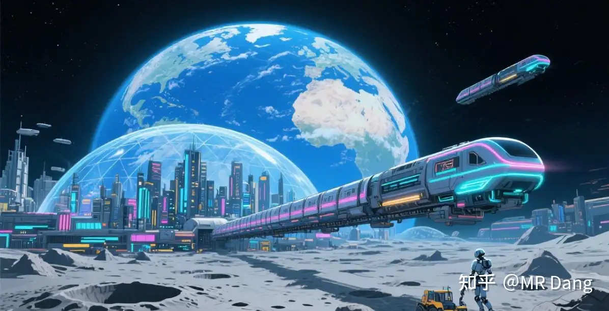

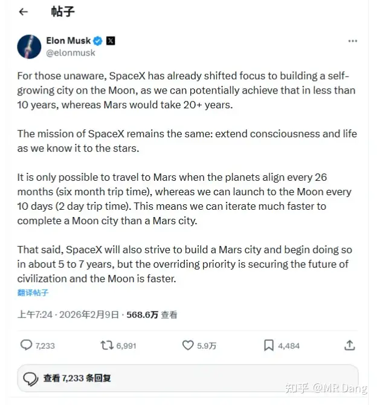

马斯克昨天说不去火星了以后，为了安抚投资人，又扔出一张大饼：

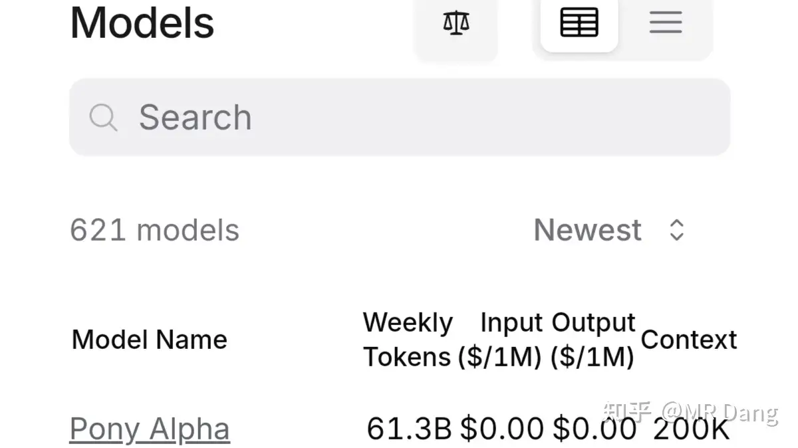

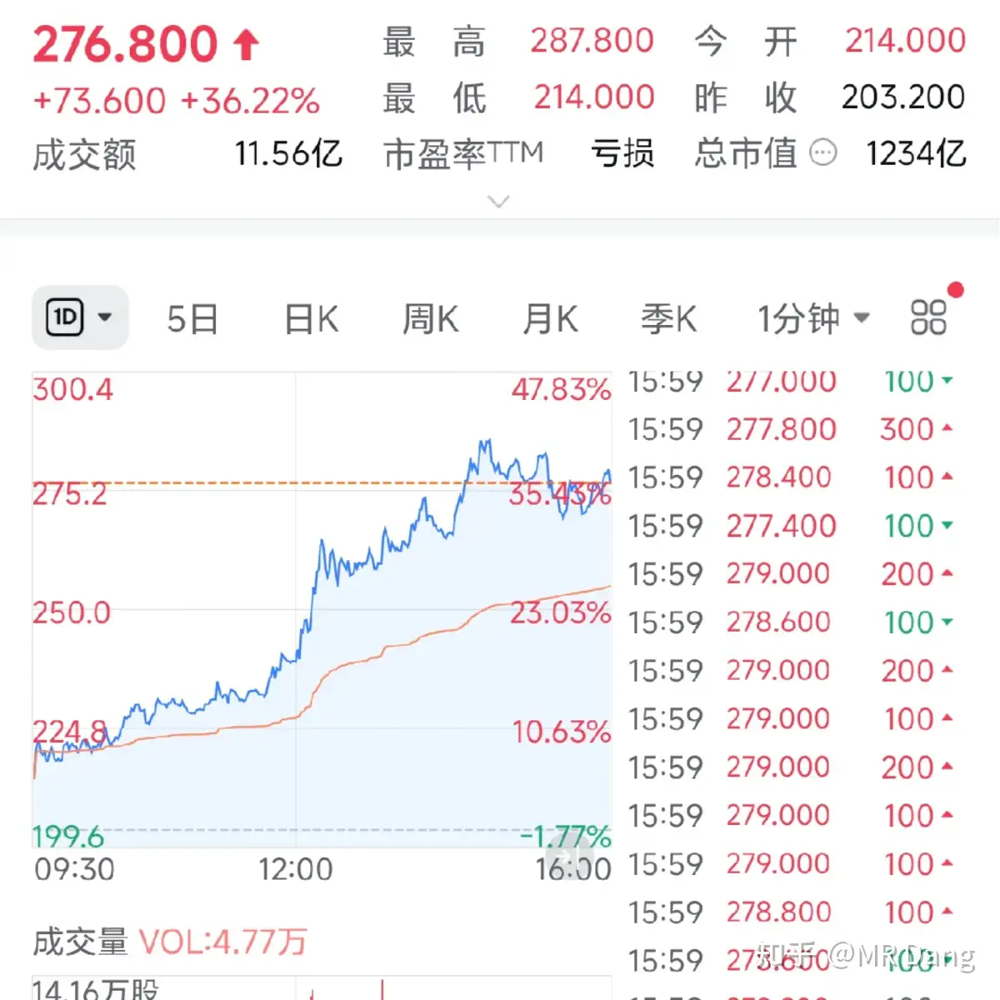

老马号称要去月球建立一个可以自我扩张的城市。

讲道理，我觉得去火星还好理解，给人类文明搞个文明备份，万一地球有啥问题了，还能保留文明火种。

去月球的话，好像没啥必要吧？地球有灭顶之灾的话，月球也难说啊，距离太近了。

不过现在这会儿正是space x上市的重要窗口期，一个对投资者胃口的大饼对提升估值很重要，1.25万亿美元的估值必须有相应的梦想作为支撑。

第二个马，是pony。

读者里很多码农，本来不应该班门弄斧，但是鉴于还有很多不了解内情的读者，所以大概说下。

OpenRouter是一个Ai平台，在这个平台上可以使用主流的六百多款Ai，相当于AI的超市。

最新上了一个叫pony alpha的Ai。

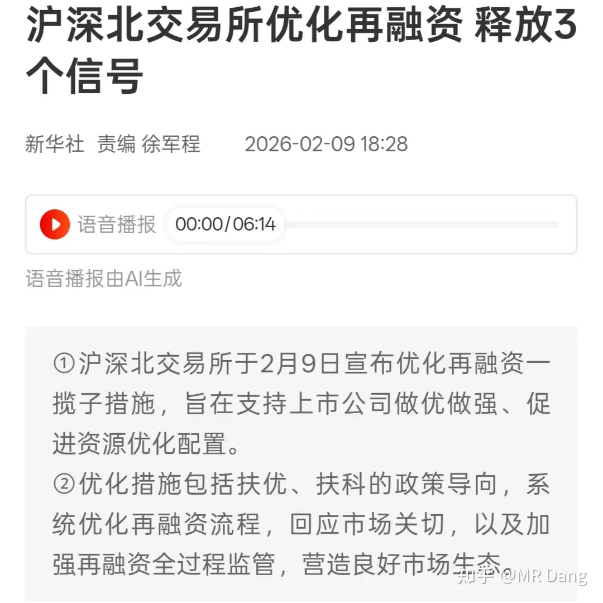

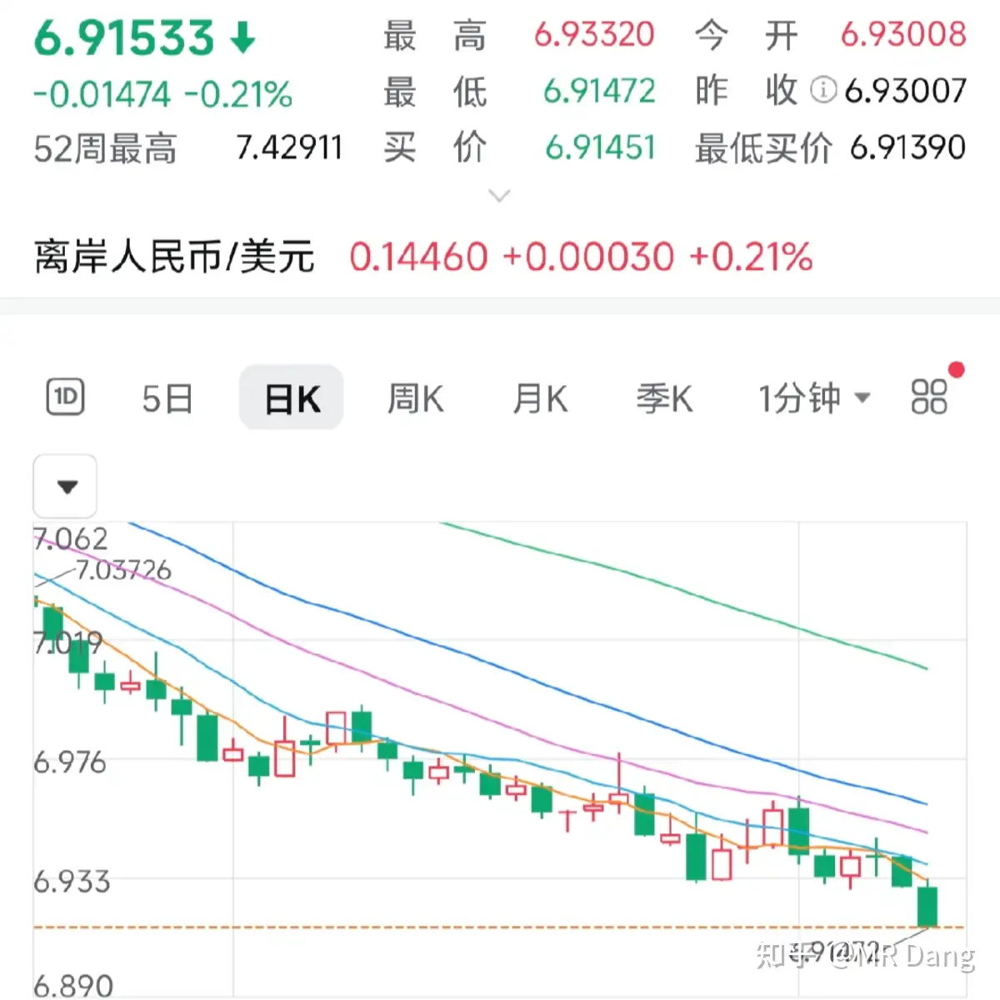

这个Ai目前的编程能力非常强悍，引起了码农圈的注意，前端的能力得到了一致好评，ui的交互流畅，审美在线，一上线就成了人气第一的当红炸子鸡。

目前还没有进一步的消息确认其归属，但是有蛛丝马迹，包括这个有深意的名字，都指向了其来自神秘东方大国的某家公司。

昨天这家公司受这个消息影响大涨三十多点：

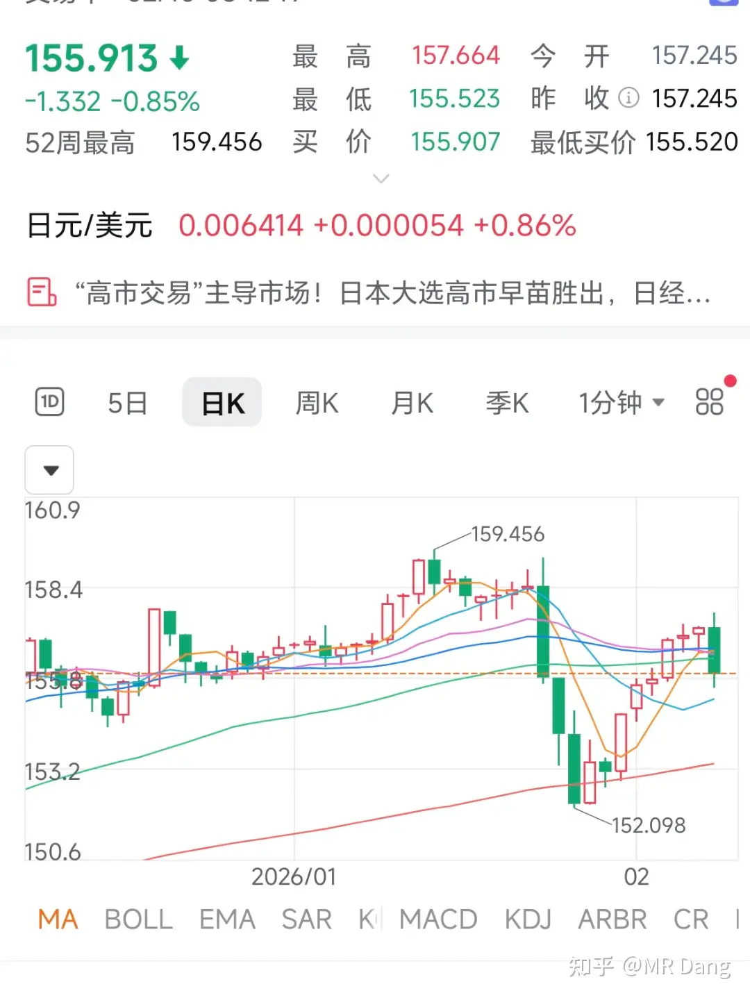

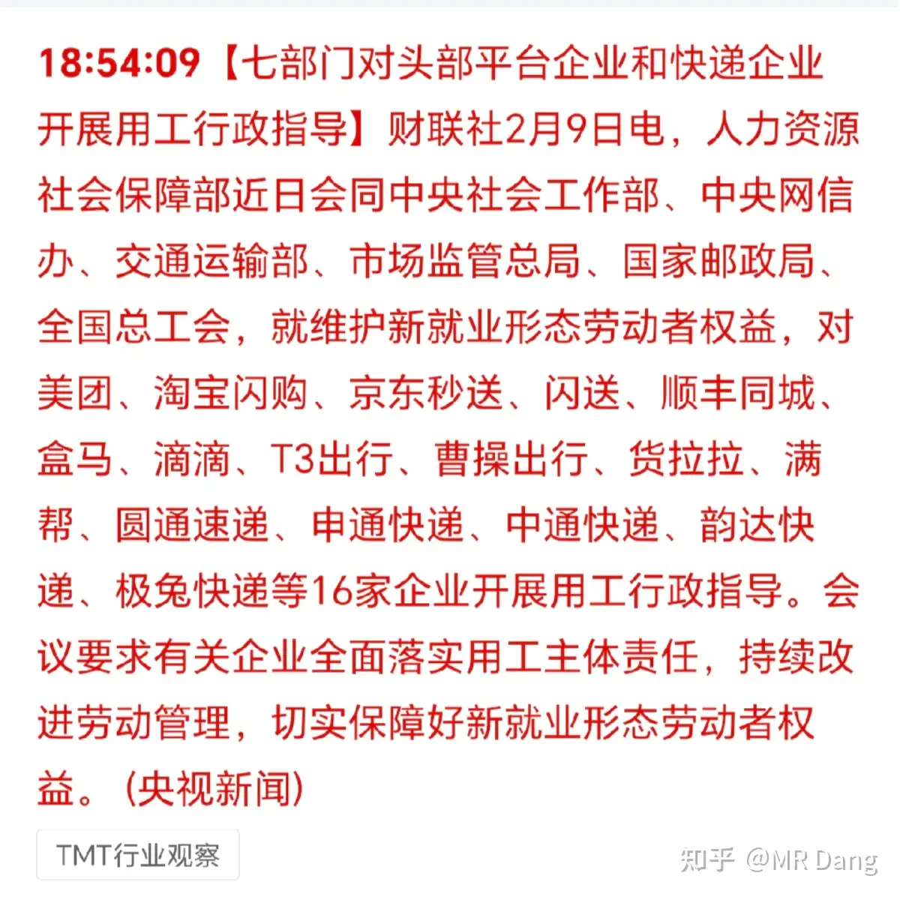

有投资者开玩笑说起这名字是暗示pony马赶紧收购。

再融资措施：

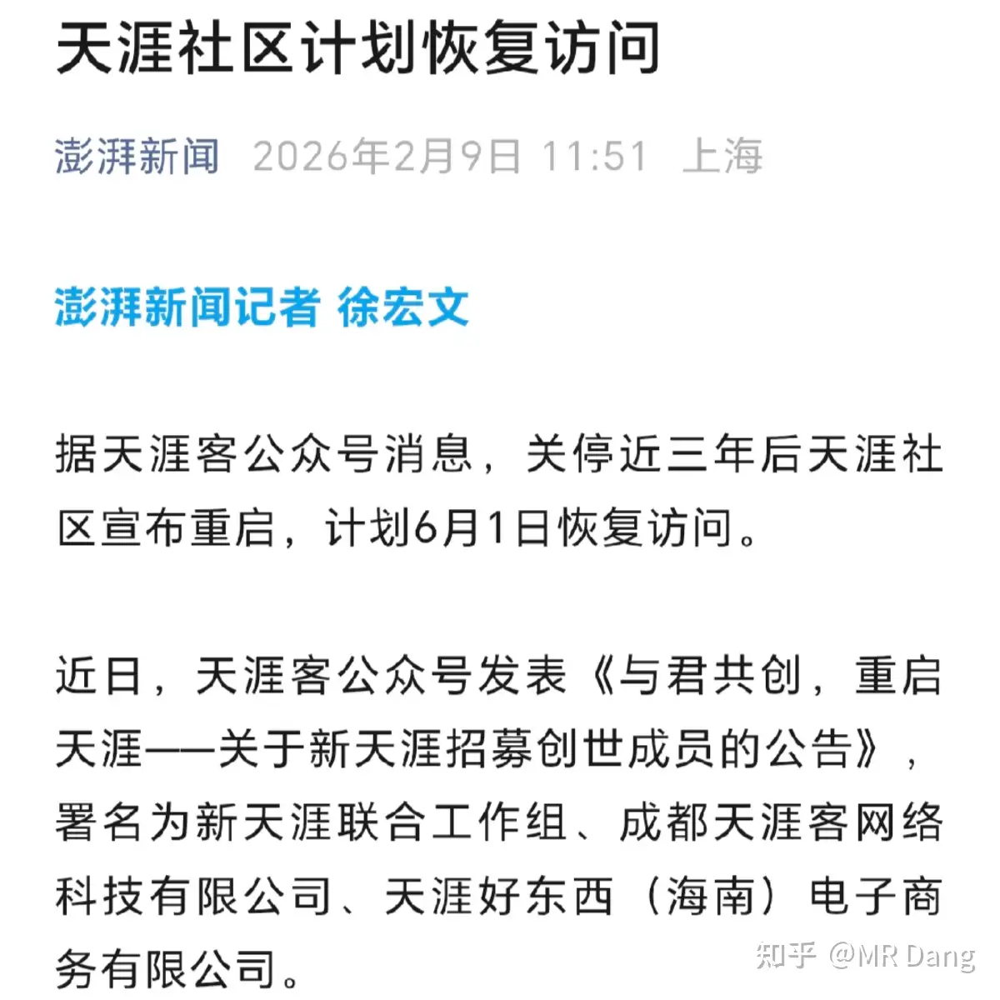

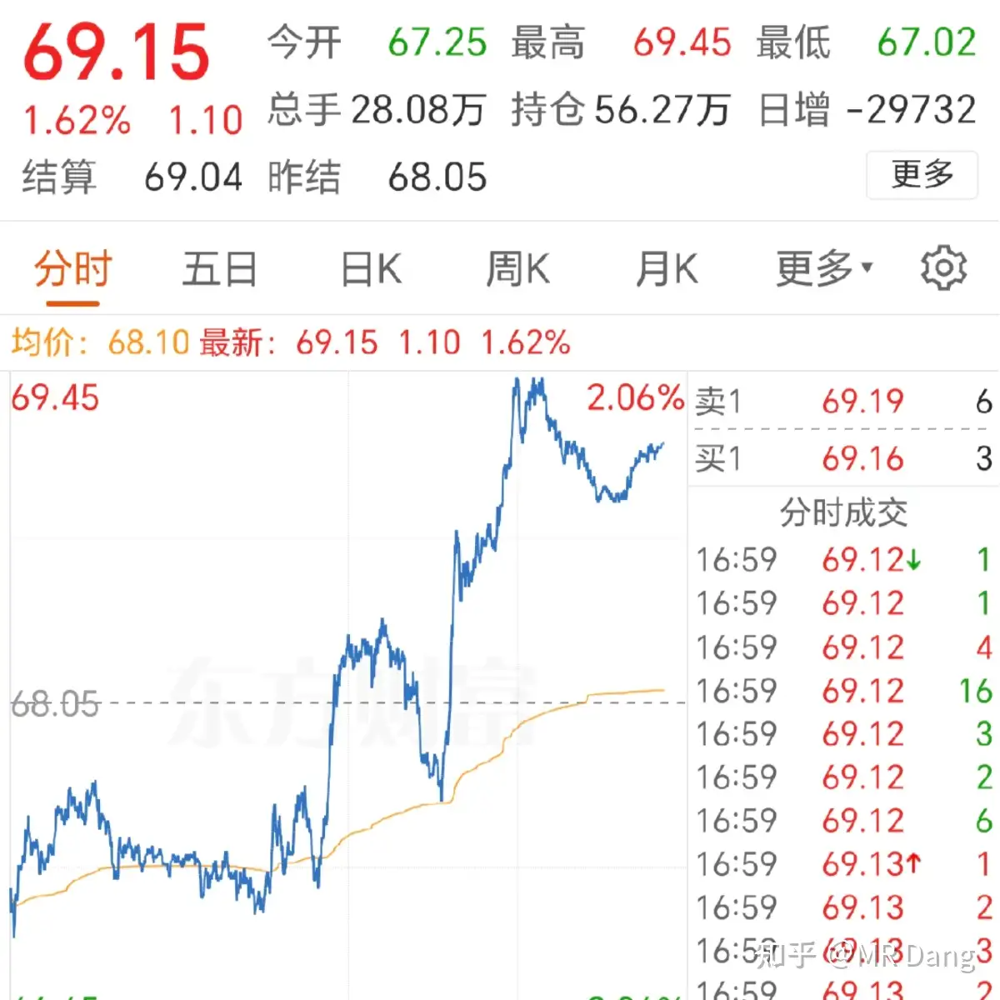

优化再融资一揽子措施，有兴趣的找全文看。

至于利好还是利空？

我觉得用排除法的话，首先把前者排除了。

凡是和市场伸手要钱相关的，基本没好消息。

对普通人影响比较普遍的汇率。

先看离岸的红色的钱：

击穿了6.92，涨势如虹。

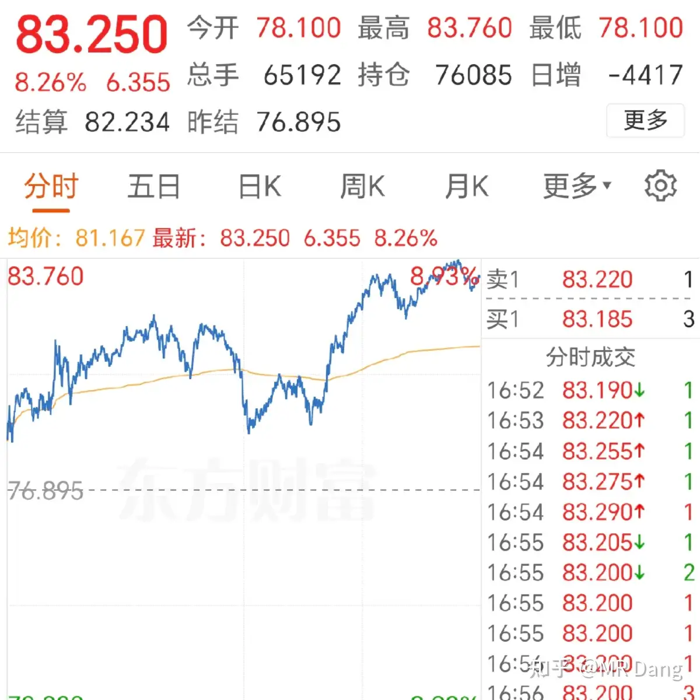

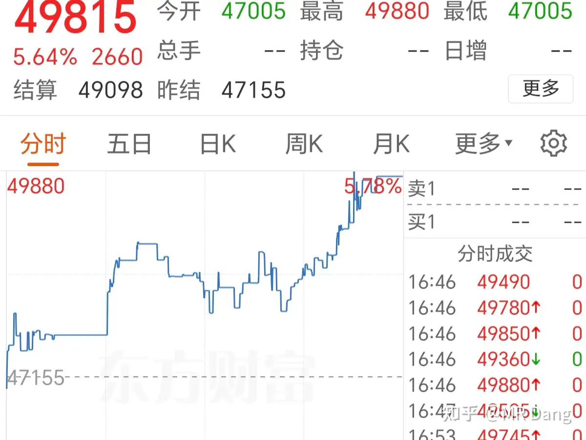

投港股的真的有点心塞，汇率贬值真的挺快的，去年最高点到现在汇率贬值了有七八个点了，这可不是一笔小钱。

其次是日元：

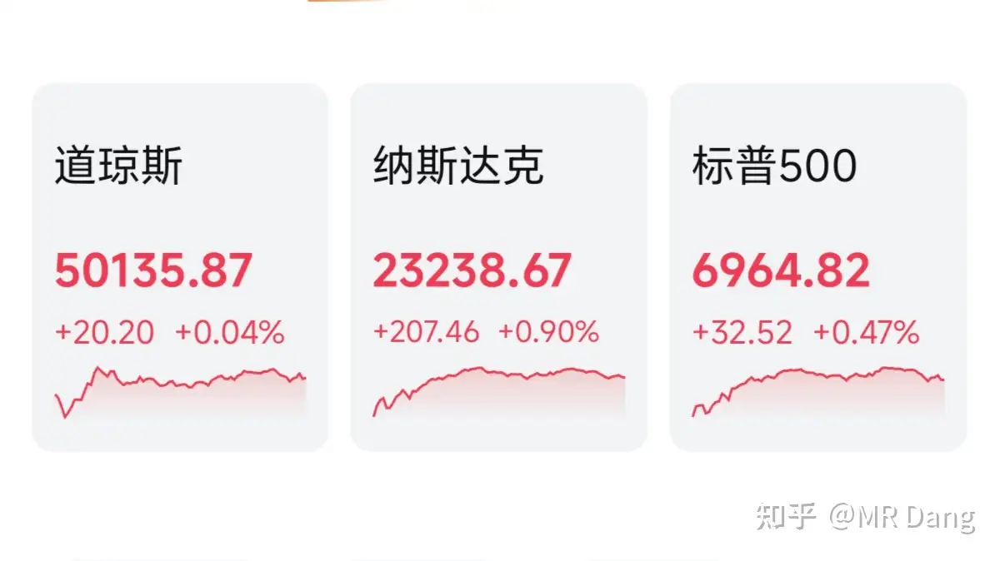

早苗过2/3席位上位后，有着女版安倍经济学的预期，日元贬值预期不断提高，最近汇率贬值趋势明显。

汇率对我们有什么指导意义呢？

第一个，汇率上涨，说明有人用外币在换人民币，换了人民币要干什么？大多数情况下还是投资权益类资产，所以对股市是有潜在支撑的。

第二个，汇率上涨，利好主要原材料从国外进口的企业，但是对出口型企业有一定压力，价格优势减少，竞争力下降。

所以我的投资方向就是瞅着进口这个方向，尽量回避出口这个方向。

还有一些其他的逻辑，之前也梳理过，比如美元债啦，飞机啦，逻辑已经开始逐步兑现，就不重复了。

就目前的汇率形式，如果不是中日之间的关系紧张，游客能把日本挤爆，我对日元的汇率印象还停留在15左右，刚才扫了一眼都22.5了，离谱。

快递外卖行业：

保障劳动者权益是应有之义，劳动者的利益应该得到切实保障。

这对企业的运营能力，成本转嫁能力都提出了更高的要求。

如果不能完全转嫁给消费者的话，可能还需要各位股东积极配合。

染料行业：

染料行业最近景气度高，由于还原物和6氯的成本大幅度提高，导致染料报价提升，特别是分散染料。

什么叫分散染料呢？染料大的分类可以分为两类，一类叫活性染料，主要用在棉花制品上。而另一类就是分散染料，主要用在化纤制品上。

你要问什么化纤制品？还记得之前说过的布王么？对，布王生产的产品加工后，加上这个分散染料，就能拿去做衣服了。

染料企业也分两种，一种是可以自主生产关键中间体的企业，有z，j，r，a四家，属于寡头垄断。

这类企业受益程度较高，因为涨价容易，降价难，给车加过油的都知道其中原理。

资本市场也给出了积极回应。

另一种是没有自主生产关键中间体能力的企业，也就是除以上四家外的其他企业，需要外购原料，因此未必能从染料涨价过程中受益。

但是现在这个时间点，以上四家涨幅不小了，再参与风险挺大了，可以考虑对其他行业的影响。

染料涨价，最直接的是利空下游的印染行业，因为染料是它们的重要成本。

间接提高终端纺织品的售价，推高cpi。

如果继续涨价，潜在的利好无水染印或者数码印花等相关替代品行业。

（ps：这里有个6氯，不要用ai去搜索，因为化工行业有个6氯苯，是一种农药，有6个氯原子。

而印染行业的6氯，指的是CLT酸，6-氯-3-氨基甲苯-4-磺酸，所谓的6氯指的是氯原子在苯环的6号位。ai会产生错觉，把两个弄混。）

天涯重生：

当然，重生是需要众筹复活卷轴的。售价1999一份，共9999名额，售完即止。

天涯属于中文互联网的早期记忆，诞生了很多神贴，但是在目前的网络环境下，感觉就算复活了也很难有所作为，时代变了。

至于炒作什么天涯概念股，还是省省吧，风险很大，现成的知乎都是破净状态，炒什么天涯。

大宗商品：

布油：谈判没进展，石油走强

白银：昨天下午收盘后涨了两个点。

锡：差不多也是收盘后涨了两个点。

其他金铜铝铂等盘后都有所表现。

马上要过节了，给持有白银相关头寸的提个醒，白银comex3月合约交割马上临近的了。

现在什么情况呢，2月份交割了2000万盎司的白银，几乎是百分百全部交割。

3月份未平仓量目前是7.6万手，核3.8亿盎司，是全球一年产量的三分之一，如果要求实物交割，这么多现货恐怕不好找，目前交易所可立即交割的白银也就1亿多盎司。

所以在交割来临前，白银价格一定是大幅度波动，空头和多头总有一个要认怂，两边都挺心虚的，一边有杠杆，一边没现货。

交割之前的博弈既分高下也决生死。

而目前距离首次交割不足三个星期，恰好这个日期卡在了春节期间。所以拿白银股的，节后回来要么进ICU，要么进KTV，接受不了波动的可以考虑下仓位。

外围市场：

还不错，风平浪静的一天。

昨天个人净值继续小幅创新高，不过没跑赢指数。

行情整体偏向ai应用什么的，比如提到的seedance2.0。这玩意儿还真不是瞎炒，确实很震撼，对短视频创作者来说生产力得到了质的提升。

以后的视频内容创作者很可能就成了新时代的马车夫，要么学开车，要么被时代淘汰。

我没这方面的布局，所以已经很满意了，没什么奢求。

具体标的上，有一个标的到了很多人的止盈线，还是那句话，根据自己的成本来，原则就是原则。

不过涨这么快倒是很出乎我的意料，其实板块也没怎么动，这种纯粹就是运气好，业绩还没到兑现的时候，就涨了这么多了。

但是真的兑现业绩的时候，股价会怎么样也不好说，资本市场变幻莫测很难把握的。

昨天上午九点的时候一看，评论数好像不多，而且很多送咖啡的也没留言，某些八点多准时出现的老面孔都没来，我就知道又被卡了。

果不其然，到了下午两三点的时候，突然蹦出来两三百条评论，都是早晨的读者。

这种事情经常有，所以大家也别往心里去。

另外评论里不要打我的名字会比较不容易被卡，毕竟。。。容易引起误会。

所以留言的时候可以称呼我小D，大D，老D都行，不容易被和谐，称呼而已，我不介意的。

至于今天的话，最近距离年关越来越近，我只希望年前大A不要给投资者添堵就行了，大A只要再坚持四天，不要暴跌就是胜利。

看在我的面子上，这事就这么愉快的决定了。

一个喜欢保护韭菜的博主，希望大家少少踩坑，多多赚钱！！！

> [!comment]- 点击展开评论
> | 用户 | 时间 | 内容 |
> | :--- | :--- | :--- |
> | 瑞布克 | 2 小时前 | D的粉丝质量越来越高，不仅能在每日早报草蛇灰线中捉虫，还有另开贴对潜藏标的进行深度分析预测，更有为学习价值投资而设计的知识库。哈哈哈哈，这可比炒Gu有趣多了！ |
> | Raven | 2 小时前 | 天涯重开啊...想起了那就话"白月光的厉害之处是本人来了也不行"，重开也不是原来的天涯了。 |
> | &nbsp;&nbsp;&nbsp;&nbsp;MR Dang | 2 小时前 | 是的 |
> | momo | 1 小时前 | 现在娱乐手段太多，天涯已经无法刺激人们粗大的神经了 |
> | 戒烟 | 1 小时前 | "白月光的厉害之处是本人来了也不行" |
> | 张不知 | 3 小时前 | 止盈说的应该是机王，已经上车生活纸和电，染料不懂 |
> | 卡夫卡卡 | 3 小时前 | 以后做视频的门槛越来越低，属于视频平权了。想要叫人看到，就必须投流，流量会越来越贵 可能10万做一个短剧，几百万投流了。 |
> | &nbsp;&nbsp;&nbsp;&nbsp;MR Dang | 3 小时前 | 是的 |
> | MrLittleCold | 3 小时前 | 我昨晚做了个梦，和老师一起吃了个饭，桌子上的两个人总共有100个小目标，老师独占99个，而我占了一个。 |
> | &nbsp;&nbsp;&nbsp;&nbsp;MR Dang | 2 小时前 | 接着睡，可能还没醒 |
> | 青竹 | 2 小时前 | 一个小目标也够了 |
> | 哼哼哈嘿 | 1 小时前 | 我能上桌吗，半个小目标就可以了 |
> | 等待和希望 | 1 小时前 | 王多鱼 |
> | 黑猫杰克 | 2 小时前 | 大佬早哇。经过月初的波动，最近对涨跌似乎已经去敏了。分析来应该是两个原因：一是之前乱买的有些动不动几天就30%上下导致现在小波动已经无感了；二是现在手头里的大多标的比较硬，有信心 |
> | &nbsp;&nbsp;&nbsp;&nbsp;MR Dang | 2 小时前 | 够硬 |
> | 知乎用户虹 | 2 小时前 | 手里有啥硬的标的 |
> | Sprite | 2 小时前 | 有色嘛 |

---

*本文件由自动脚本从MR Dang知乎页面提取生成*

---

**作者**: MR Dang
**链接**: https://www.zhihu.com/question/2004108007689184092/answer/2004451226419496752
**来源**: 知乎

*著作权归作者所有。商业转载请联系作者获得授权，非商业转载请注明出处。*

---

## 相关阅读

**📈 近期行情评价：**
- [[20260209-如何评价2026年2月9日A股行情？|2月9日行情]] - 央妈增持黄金、虚拟币定调与持股过节建议
- [[20260206-如何评价2026年2月6日A股行情？|2月6日行情]] - 纸行业深度分析与大宗商品走势
- [[20260205-如何看待2026年2月5日A股市场？|2月5日行情]] - 煤炭印尼减产传言与太空光伏解读

**📚 新手必读系列：**
- [[20260208-周末闲聊(2月8日）|消费股选股逻辑]] - 消费股6参数公式与渗透率分析框架
- [[20260207-周末唠嗑（2月7）|周末唠嗑]] - 新手拿不住股的根本原因与正派/邪修解法
- [[20251016-投资新手避坑指南之追热点(万粉特别奉献)|追热点避坑]] - 新手最容易犯的错误
- [[20251118-《韭菜保护合集卷八》仓位控制|仓位控制]] - 如何科学管理仓位

**⚔️ 天阶功法系列：**
- [[20251030-《天阶功法卷三》NSLY投资价值浅析|天阶功法卷三]] - 低价铝投资价值分析
- [[20251110-《天阶功法卷六》银行股投资原理详解|天阶功法卷六]] - 银行股投资逻辑
- [[20251117-《天阶功法卷七》锡王投资价值分析|天阶功法卷七]] - 锡的供需格局分析

**🎉 万粉感言：**
- [[20260201-十万粉感言|十万粉感言]] - 量子态叠加理论与高股息+银行压仓+30%止盈+分散方法论
- [[20260117-五万粉感言|五万粉感言]] - 投资心路历程分享
