# 如何评价2026年2月11日A股行情？

---

**发布时间**: 2026-02-11 07:11  |  **原文链接**: https://www.zhihu.com/question/2004297777413387340/answer/2004814671249686784  |  **点赞数**: 1591 人赞同

**作者信息**: MR Dang​​独立投资人，不接广不卖课，无任何其他平台，无小号。

---

## 正文内容

又是听央妈话的一天：

央妈发了四季度的货币政策报告，洋洋洒洒五六十页。

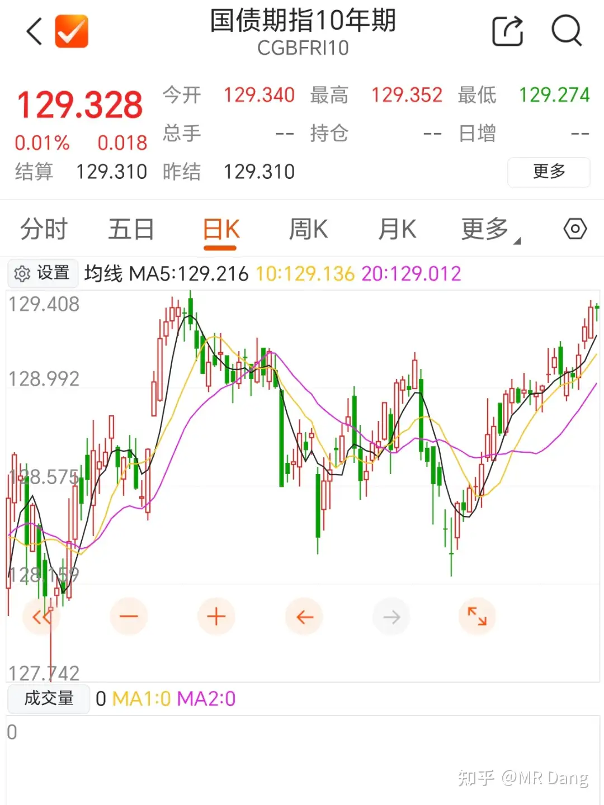

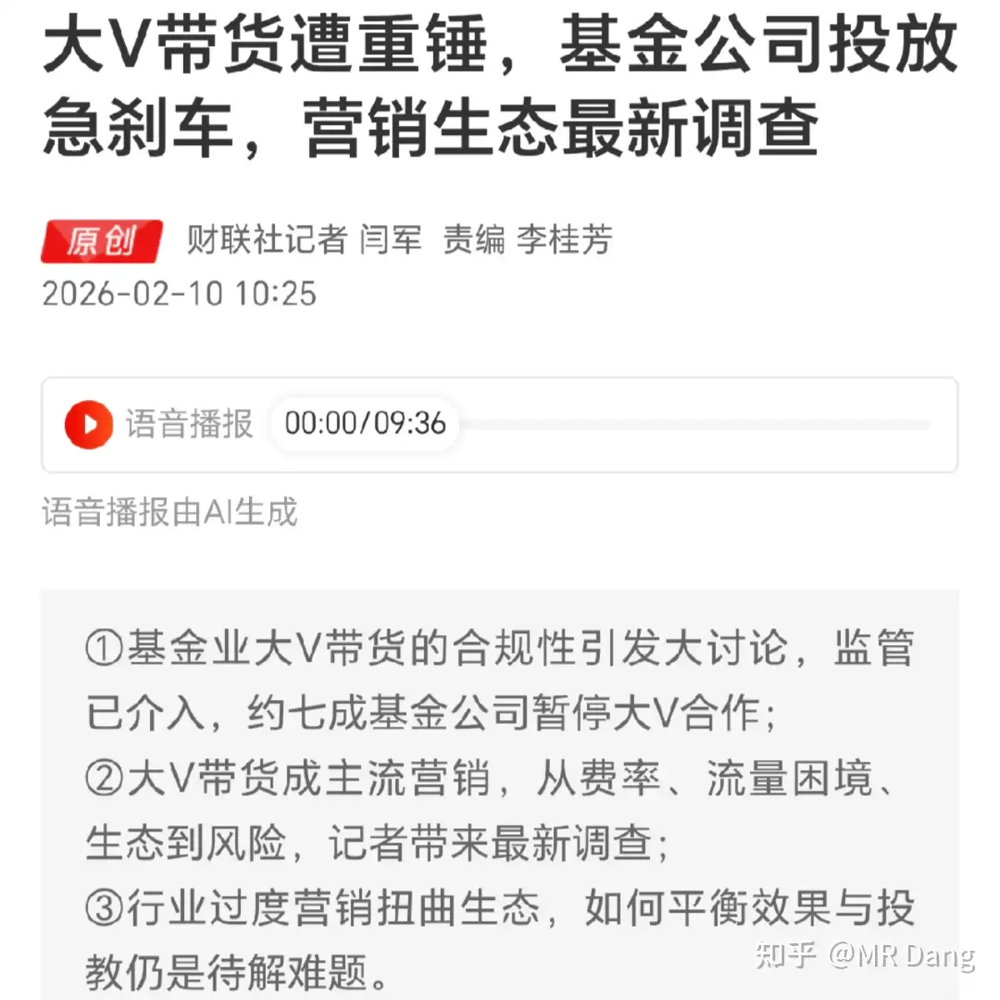

总的来说，适度宽松。

个人要理解这个适度宽松就需要搭配国债期货指数去看：

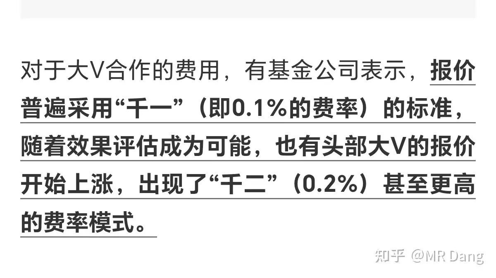

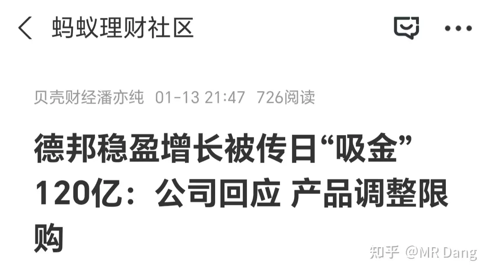

国债价格往上走=债券抢手=长端利率下行

这是银行股最舒适的区间，因为你如果比对这个走势图的话，和很多银行股走势是拟合的。

repeat，银行股＝空仓。

除了央妈，没啥大事了，先来吃个瓜吧。

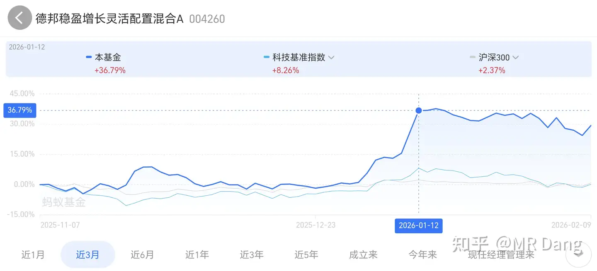

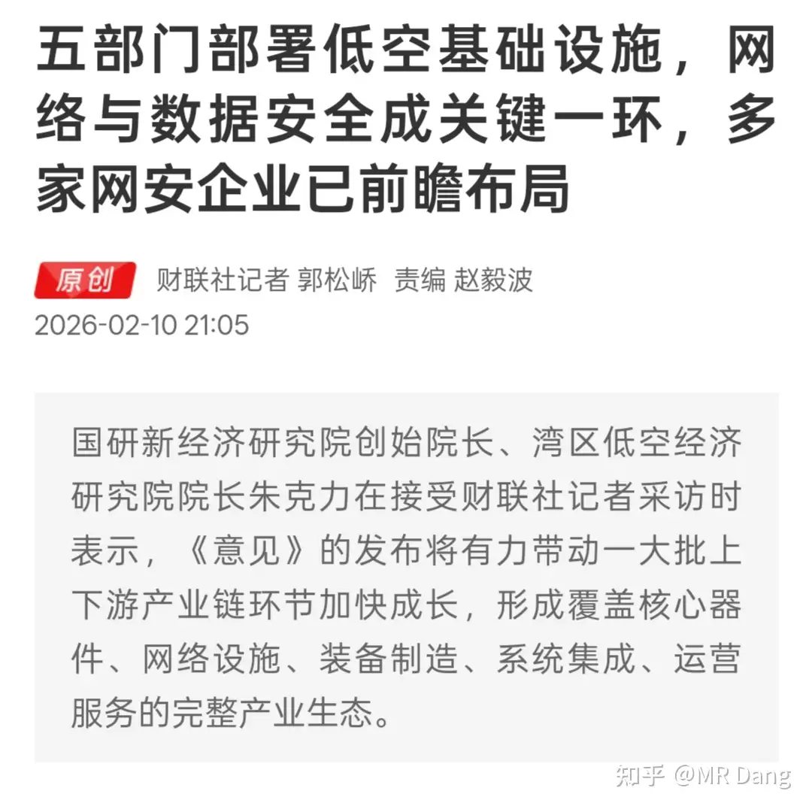

这里主要涉及的大v是小羊，我刷到过几次，观感比较差，因为他为了镜头的表现力，语言方面是很浮夸的，包括肢体动作。

也正因为情绪化，才有节目效果，收获了一众拥趸。

接着马不停蹄就开始带货了，推基金，恰烂钱。

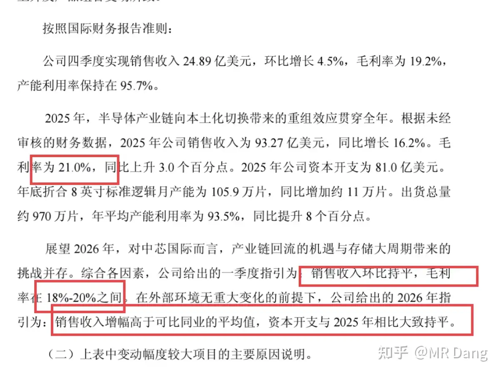

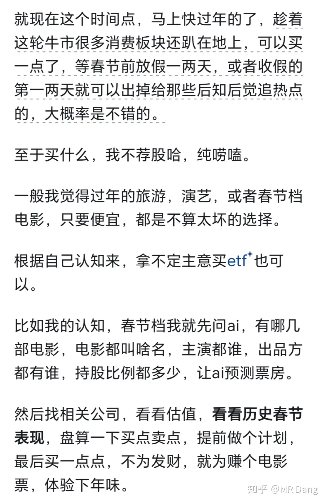

千一分成，这个抽成很夸张了，这可是基金。

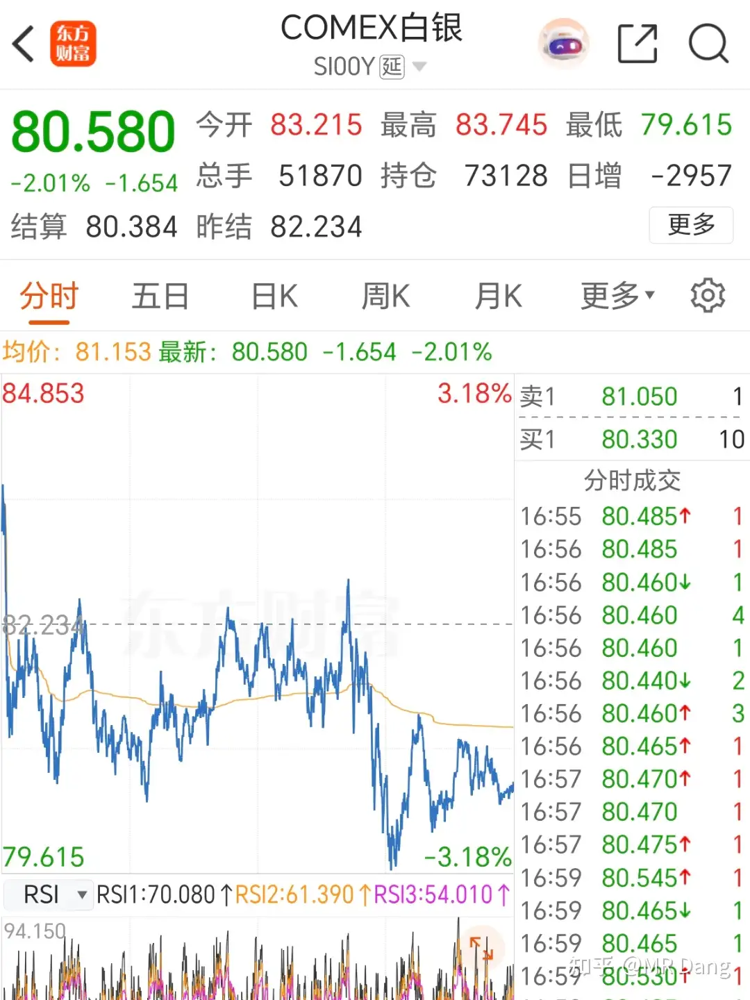

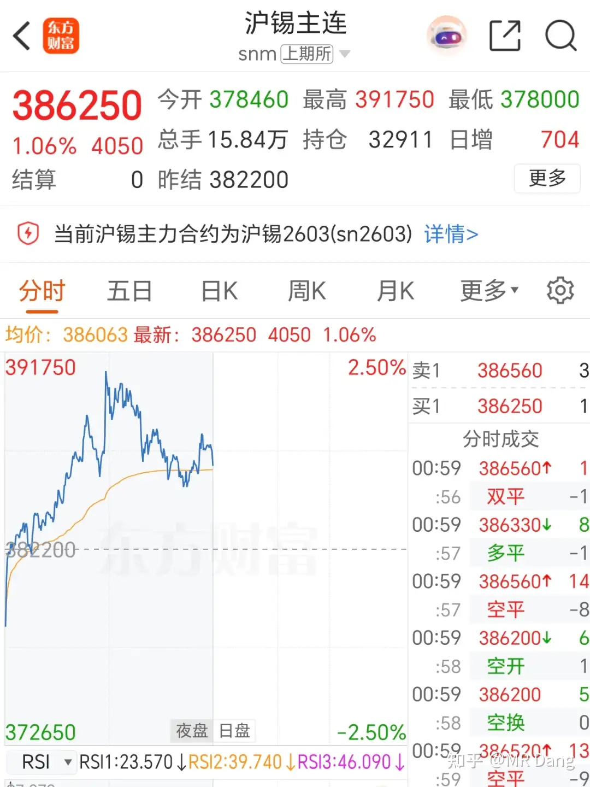

按照120亿计算，这一顿饭恰了得有八位数，不少了。

我为啥说他恰的是烂钱呢，因为这个是1月12发生的事情：

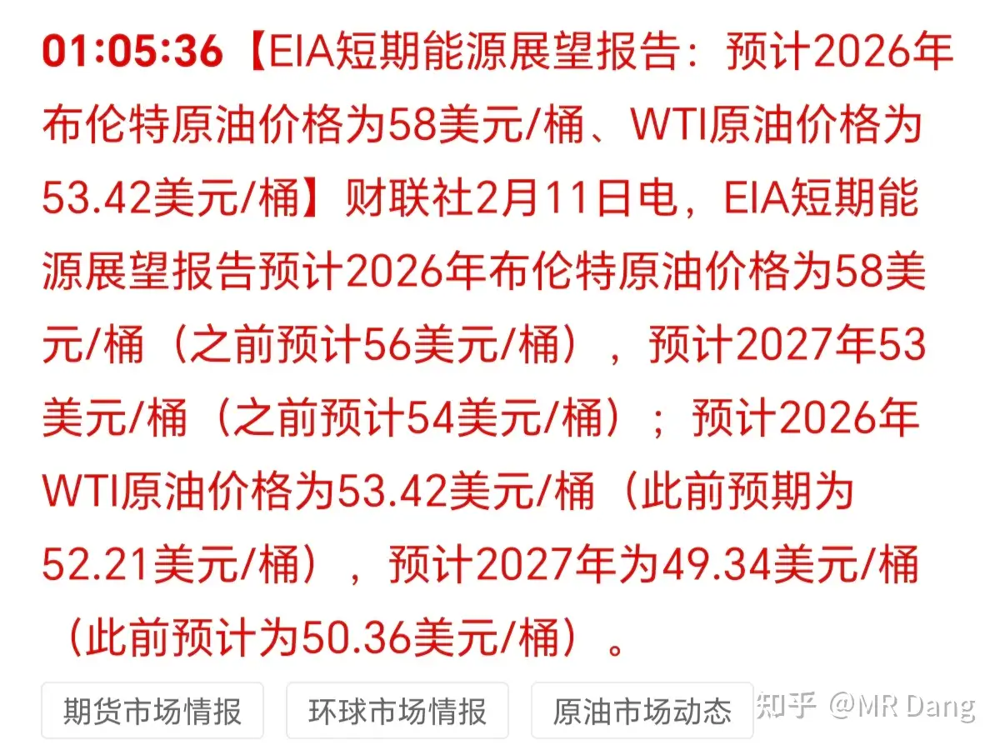

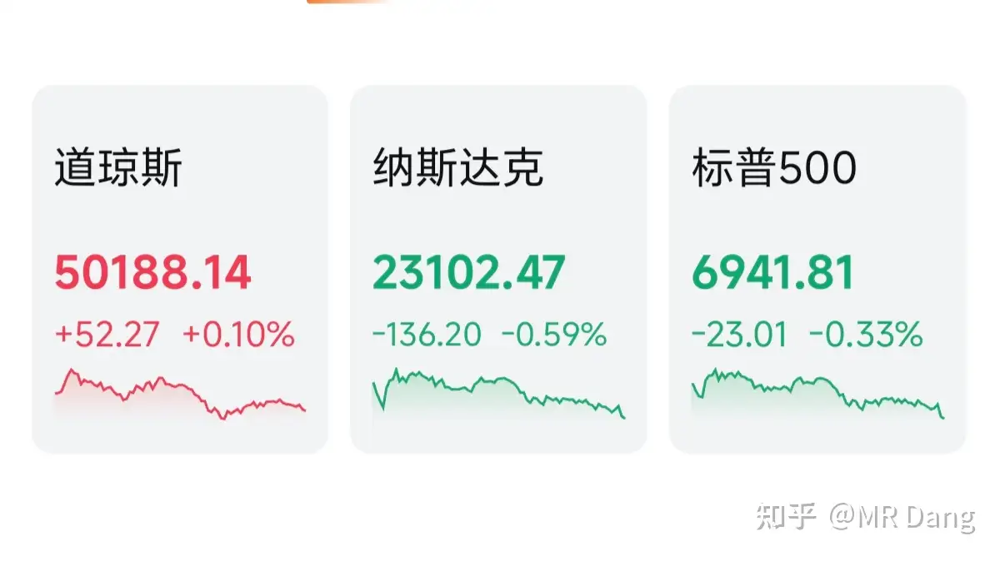

真真正正各种意义上的顶，这120亿到现在，浮亏六七个亿是有的。

就这种娱乐类型的博主，大家当成电子宠物看看就行了，跟着买实在是不明智。

当然我也算娱乐博主哈。

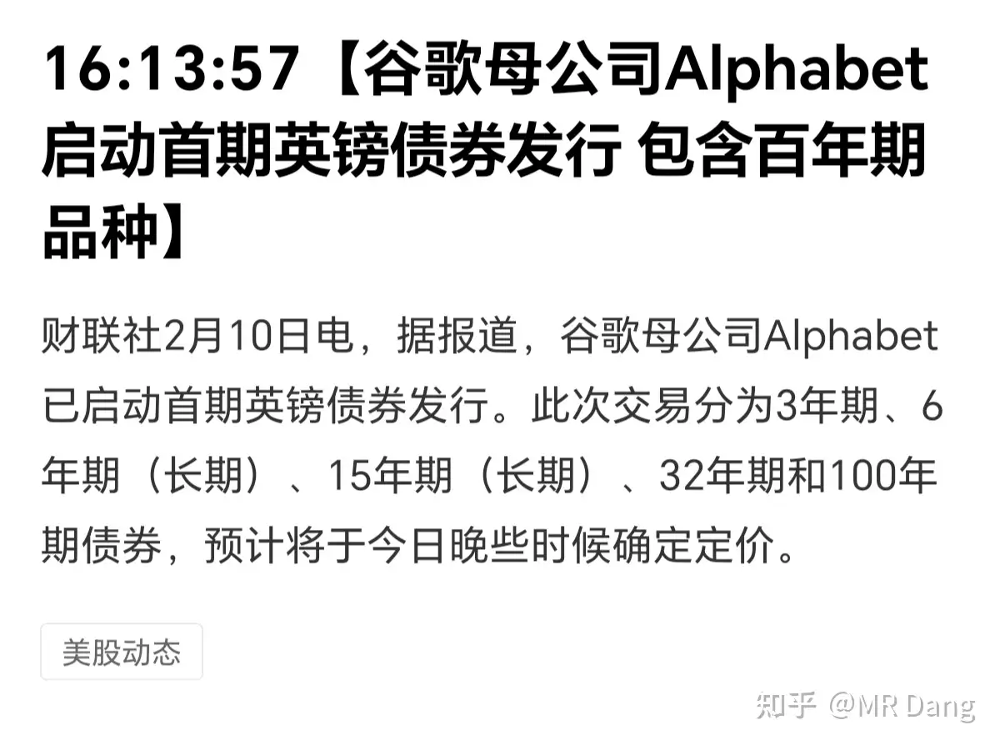

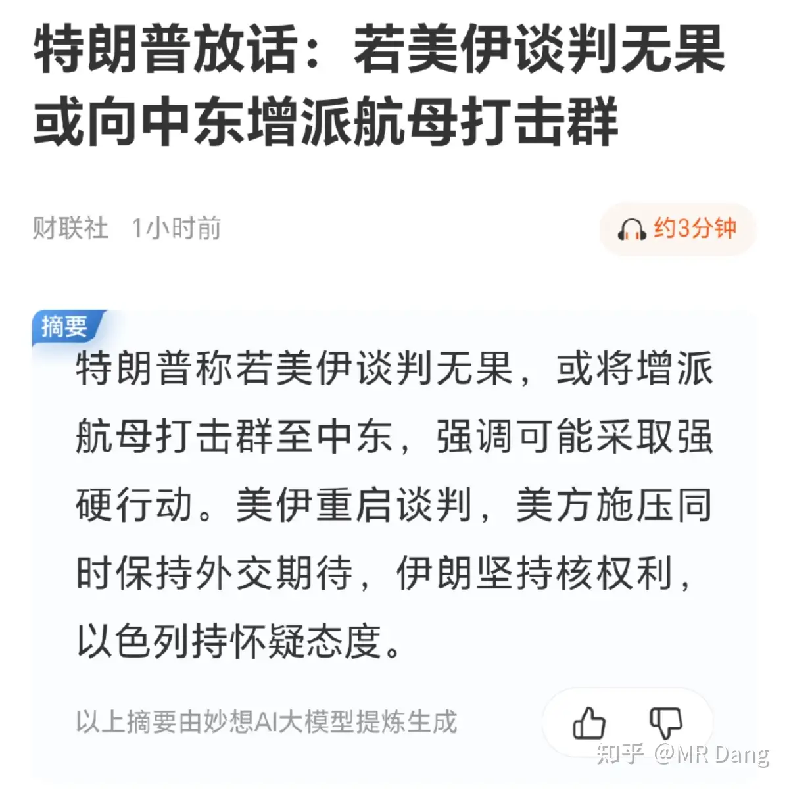

低空经济：

相关部门发了个文件，大概意思是以后大部分的低空飞行器和无人机都要安装5g模块，利好相关通信行业。

了解即可，这个行业我很少提，因为这行业有个很大的硬伤，就是安全问题。

它和商业航天不一样，商业航天频率低，远离闹市区，炸了就炸了。

低空飞行频率高，安全系数低，还有可能在闹市区，这属于商业模式天生的缺陷，无解，普通投资者不要参与。

某半导体巨头发布财报：

前面的财务数据很一般。

后面给的业绩指引更一般，毛利率要往下走，资本开支大，而且折旧增加。

目前估值很贵，真的很贵很贵。

普通投资者难以把握，明白我的意思吧，谨慎参与，要听劝。

同样是提示风险，电影板块。

这个我在一个月前，也就是1月8日的早报说过：

现在就是之前说的把筹码给那些后知后觉入场的投资者的时机了，越往后越危险。

电影板块是著名的渣男板块，勿谓言之不预也。

大火的seedance后续：

我也不是蹭热点，这事我算是第一批跟进的财经博主了，我对自己的要求就是大热点，前期可以说，等到了最热的时候要提示风险。

之前也一直这么做的，老粉都知道。

站在这个时间点，我需要提醒大家的是，基本上情绪开始蔓延了，真正利好的标的，已经被发掘了，比如手握海量ip的一些企业。

很多人买不到正宗的，就去找蹭概念的，传统的一些传媒企业也开始被鲜花簇拥。

我不建议大家去追这些标的，涨的时候涨不过龙头，跌的时候一点不含糊。

那还有没有哪家企业手握海量漫画或者小说资源，有可能因此受益而还没被挖掘呢？

有的，兄弟，有的。

远在天边，近在眼前啊。

狗血短篇小说丢进去，润色润色出来就是狗血小短剧，商业模式直接升维，赢麻了，哈哈。

（玩梗的，非投资建议）

这个概念就算翻篇了，以后不提了，不提才是最大的保护。

大宗商品：

白银：昨天收盘后回调半个点。

锡：上涨1个点

其他金铜铝铅锌原油等基本振幅都在半个点内，波动幅度明显变小，持仓量也在减少，交易清冷。

EIA，也就是美国能源信息署发布报告，对今年布油价格中枢看空到58美元，比之前上涨了两美元，明年布油价格中枢看到53美元，比之前更低。

外围市场：

又是道指领跑的一天，懂王言出法随，不愧是新股神。

谷歌母公司发行的百年期债券遭到哄抢。

谷歌的历史都没有30年，投资人真的非常看好他们，百年期债券都能抢起来，各个期限的债券一共新发了110亿美元。

懂王日常放狠话：

昨天个人净值又是向着顶峰攀爬的一天，银行资源消费都还行。

最近一直在增加，有点不习惯了，感觉不回撤一点心理还不踏实。这不是凡尔赛，这是被A股几十年拷打留下的心理阴影。

有点像在大海上划独木舟，越是风平浪静，就越担心是暴风雨来临前的征兆。

至于今天的话，感觉目前交易氛围比较寡淡，可能大家都无心交易，想着回家了。

还是那句话，只要不瀑布就是胜利。

掰着手指头，还剩三天，希望我的脸够大。

一个喜欢保护韭菜的博主，希望大家少少踩坑，多多赚钱！！！

> [!comment]- 点击展开评论
> | 用户 | 时间 | 内容 |
> | :--- | :--- | :--- |
> | 大鹏四哥 | 6 小时前 | 远在天边，近在眼前啊。原来是知乎 |
> | &nbsp;&nbsp;&nbsp;&nbsp;何云 | 6 小时前 | 大佬的意思是：知乎也能蹭这个题材？那我打算今天起加入知乎网文作者的大军，天天发水文，蹭一蹭知乎的流量，万一哪天搭上AI短裤的顺风车呢？嘿嘿 |
> | momo | 3 小时前 | 知乎是在美股上市，完全不一样的炒法，你看昨天大 A 游戏股涨疯了，港股的网易，腾讯还是跌的 |
> | 何云 | 2 小时前 | 在党总这个发个评论，也能收获这么多赞！流量真大呀。 |
> | 冰棍空调知了叫 | 6 小时前 | 佬早算是低空经济相关行业的边缘人员吧，低空的风切变目前没法及时预报预警，无人机少的时候靠飞控调整没啥影响，一旦无人机形成规模，安全隐患指数上升。一阵风吹来，一个撞一个成链式反应了 |
> | &nbsp;&nbsp;&nbsp;&nbsp;MR Dang | 6 小时前 | 是啊，看着都操心 |
> | kangjie | 6 小时前 | 真是知乎，洞察力强。自从进入股市，我品味都高了，短剧都不看了，小说也看的少了，是不是利空 |
> | momo | 6 小时前 | 重生之我是知乎股神 |
> | &nbsp;&nbsp;&nbsp;&nbsp;MR Dang | 6 小时前 | 以后刷着刷着给你来点狗血短剧 |
> | 明天会更好 | 6 小时前 | 好嘞，Dang佬，那我两个都买点底仓，然后定投。这个和银行一样保底。上次被有色基金爆锤一顿，我想了半天，以后再也不买这些题材类基金了，只买跟踪指数的基金。准备把其它杂毛基金也清了。有色股票要不是最高点进了一点YL，被套了。吕王、铜王都回来了。股票有Dang佬单位功法，一点不慌，基金反倒不托底。话说这名字叫的不太顺嘴啊，叫大D哥总感觉后脑勺凉凉的，反正以后肯定不能跟着你一起去钓鱼的，说啥也不去。 |
> | &nbsp;&nbsp;&nbsp;&nbsp;MR Dang | 6 小时前 | 哈哈哈，我有头盔 |
> | 瓜瓢山王大智 | 6 小时前 | 知乎盐选终于有新的盈利模式了 |
> | &nbsp;&nbsp;&nbsp;&nbsp;MR Dang | 6 小时前 | 希望少刷到广告 |
> | 子非鱼 | 6 小时前 | D大早，看到电影板块的提醒了，我胆子小上周就跑路了，发现错过了两个涨停，宁愿少赚不敢多亏 |
> | 喵喵 | 2 小时前 | 感谢D大，今天把塑料王卖掉啦，买的不多就两手感恩 |
> | 夏天 | 31 分钟前 | 你可真是择时高手 |
> | 二大爷 | 3 小时前 | 在很多人眼里小羊不是"娱乐博主"，这是阿里旗下蚂蚁财富的头牌，太多人跟买他的操作了。这也暴露了一个中国散户普遍的问题：思维懒惰，认知能力非常有限，对市场毫无了解。只想跟着大佬买一支股票、基金就大赚。在很多只讲分析不荐股的财经博主评论区都能看见大量的直接问买哪支股的。 |

---

*本文件由自动脚本从MR Dang知乎页面提取生成*

---

**作者**: MR Dang
**链接**: https://www.zhihu.com/question/2004297777413387340/answer/2004814671249686784
**来源**: 知乎

*著作权归作者所有。商业转载请联系作者获得授权，非商业转载请注明出处。*

---

## 相关阅读

**📈 近期行情评价：**
- [[20260210-如何看待2026年2月10日A股市场行情？|2月10日行情]] - SpaceX月球城市、再融资利空、染料涨价、白银交割风险
- [[20260209-如何评价2026年2月9日A股行情？|2月9日行情]] - 春节前最后一周行情分析
- [[20260206-如何评价2026年2月6日A股行情？|2月6日行情]] - 节前交易氛围与市场走势

**📚 新手必读系列：**
- [[20251016投资新手避坑指南之追热点(万粉特别奉献)|投资新手避坑指南]] - 追热点的常见误区与应对策略
- [[20251013什么是投资思维？普通散户该如何培养？|投资思维培养]] - 散户如何建立正确的投资思维
- [[20250929如何看待寒武纪股票的未来前景？|寒武纪前景分析]] - 热门科技股的理性分析
- [[20251011下周一股市就要大跌了，作为投资者该如何应对？|应对大跌指南]] - 面对市场恐慌的正确姿态

**⚔️ 天阶功法系列：**
- [[20251024《天阶功法卷一》BFNY价值投资分析|天阶功法卷一]] - BFNY价值投资分析框架
- [[20251026《天阶功法卷二》BFNY估值方法|天阶功法卷二]] - BFNY估值方法详解
- [[《天阶功法卷五》DSL投资价值分析|天阶功法卷五]] - DSL投资价值深度分析

**🎉 万粉感言：**
- [[20260201-十万粉感言|十万粉感言]] - 十万粉里程碑感悟
- [[20251016万粉感言|万粉感言]] - 一路走来的心路历程
