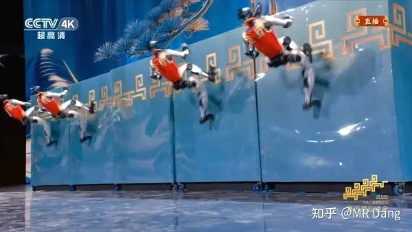
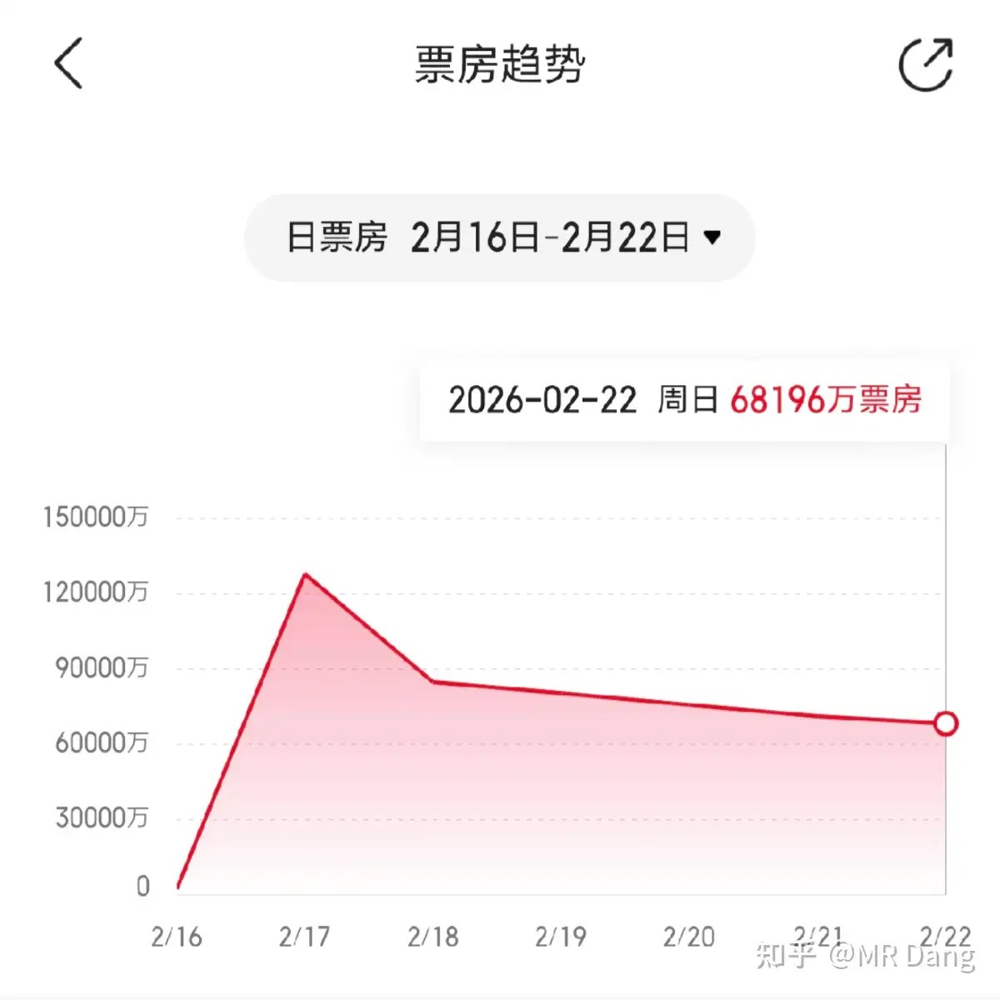
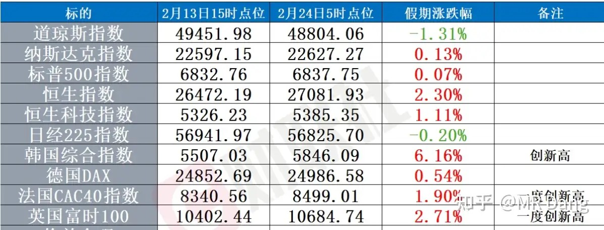
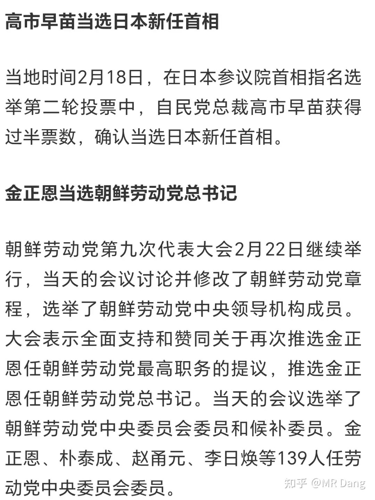
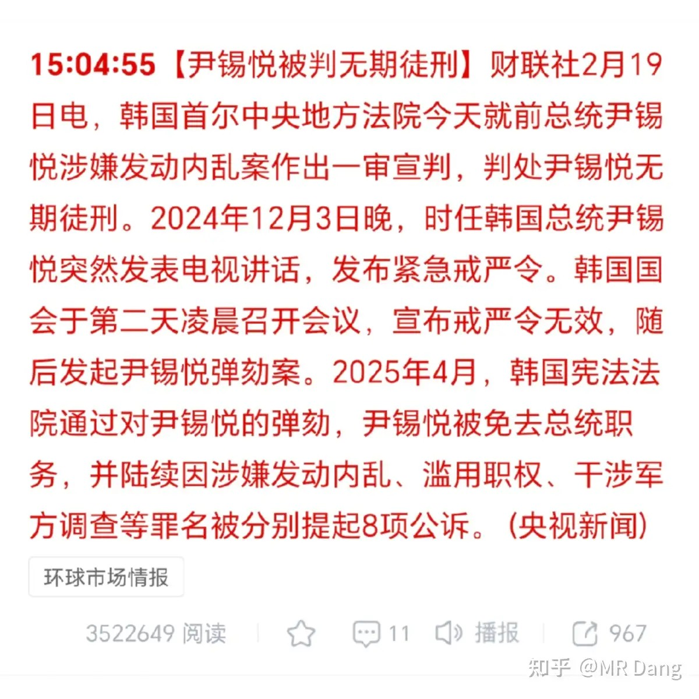
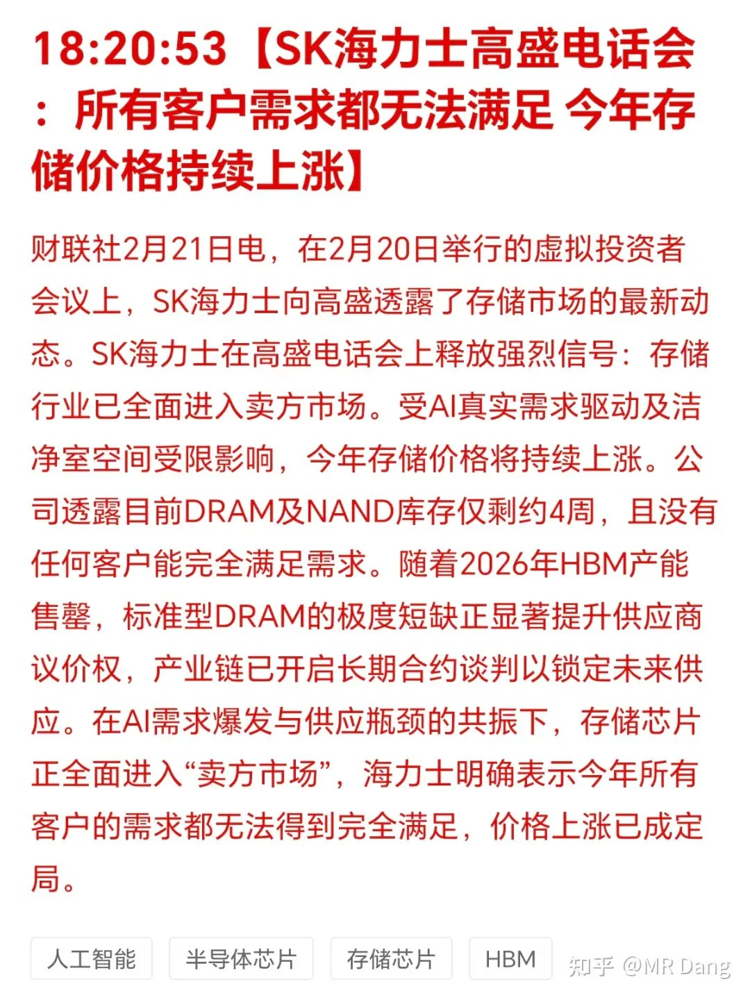

# 如何看待2026年2月24日A股市场行情？

---

**发布时间**: 2026-02-24 07:02  |  **原文链接**: https://www.zhihu.com/question/2005242173394806156/answer/2009523496582149637  |  **点赞数**: 1286 人赞同

**作者信息**: MR Dang​​独立投资人，不接广不卖课，无任何其他平台，无小号。

---

## 正文内容

农历马年第一个交易日，希望大家马到功成，老规矩，假期发生的所有重要事情过一遍。

---

**国内：**

春节期间关注度最高的有两件事，机器人和电影。直接说结论，机器人超预期，电影不及预期。

机器人超预期，不是指技术迭代速度超预期……这里的超预期指的是曝光度和传播速度，借由春晚的舞台，机器人走到了聚光灯下，又传播到国外发酵，然后又通过各种切片传播回来。

春节假期期间的几家港股机器人公司股票都有不同幅度上涨。我个人的话，感觉节前已经布局相关板块的应该能收到小红包，但是节后再去追逐还是要谨慎，买的高了也是容易被套的。

电影不及预期，没有特别超预期的片子，总体票房也在萎缩。

不要抱有侥幸心理，预期只会更差，现在还持有相关仓位的，一定一定注意风险。

白酒消费分化明显，头部老大散批价1650，老二大概790，基本稳住价格，但中端品牌次高端被挤压严重。

原油短期情绪博弈，长期供给宽松，不建议普通投资者直接参与原油交易。黄金长期向上，央行持续买入。

---

有色报告 / 外围情况：

---

日朝韩：

尹锡悦无期。

---

存储继续涨价：DRAM和NAND库存仅4周，厂商要求加钱。

---

**本周前瞻：**

1. 一年期LPR发布（前值3.0%）
2. 懂王发布国情咨文
3. 达子（英伟达）财报，要求财报+前瞻双好才能续命
4. 欧佩克月度会议
5. 股神（巴菲特）发布财报
6. 指数调整2月27日正式生效
7. 德国来访

---

个人看法：A50股指期货显示今天高开几率较大，但高开未必高走。方向上无大变化，资源类标的适合长期持有。不建议现在交易春节相关标的（如春节档电影）。

一个喜欢保护韭菜的博主，希望大家少少踩坑，多多赚钱！！！

> [!comment]- 点击展开评论
> | 用户 | 时间 | 地区 | 内容 |
> | :--- | :--- | :--- | :--- |
> | 喜欢喵吧 | 3小时前 | 广西 | 预计今天的评论数放量上涨，情绪都回来了 |
> | 鲍师傅的足球记忆 | 2小时前 | 福建 | 早上好，总结一下，消费、电影不及预期，恒生春节期间表现还行，有色金属、存储利好，原油不建议追高 |
> | 张行 | 3小时前 | 海南 | 过年好啊 老师 |
> | 烟花不一样 | 3小时前 | 河南 | 昨晚都梦见老师写的关键内容都打了码了 |
> | 小庄sail | 57分钟前 | 云南 | 大D哥概念股今天吃大肉，磷王起飞了 |
> | 带着乔乔看世界 | 1小时前 | 浙江 | 刚公布，维持3%不变。 |
> | ttbbl | 2小时前 | 安徽 | 党哥，开工大吉，新年快乐 |
> | gucel | 2小时前 | 重庆 | 老师早，想问红利低波指数，股息率4.3%，年化10%多，回撤十几，准备年线附近定投，怎么看？ |
> | momo关注我的人 | 22分钟前 | 江苏 | 恒科这是要抄家啊 |
> | MR.保护伞 | 3小时前 | 山东 | 大d哥早 |

---

*本文件由自动脚本从MR Dang知乎页面提取生成*

---

**作者**: MR Dang
**链接**: https://www.zhihu.com/question/2005242173394806156/answer/2009523496582149637
**来源**: 知乎

*著作权归作者所有。商业转载请联系作者获得授权，非商业转载请注明出处。*

---

## 相关阅读

**📈 每日行情评价系列：**
- [[20260213-对2026年2月13日A股市场行情，大家有什么预测和看法？|2月13日行情]] - 节前最后一个交易日行情分析
- [[20260212-对2026年2月12日A股市场行情，大家有什么看法？|2月12日行情]] - 节前倒数第二个交易日行情
- [[20260130-如何评价2026年1月30日A股市场行情？|1月30日行情]] - 1月最后一个交易日复盘

**🎊 春节系列：**
- [[20260221-迎财神|迎财神]] - 初五迎财神的传统文化与投资环境思考
- [[20260220-非专业影评3|非专业影评3]] - 《镖人》电影版深度解析与春节档票房分析
- [[20260219-非专业影评2|非专业影评2]] - 国师新作观影体验与主旋律商业片的拧巴
- [[20260218-非专业影评|非专业影评]] - 春节档电影市场分析与《熊出没》票房解读
- [[20260217-拜年啦|拜年啦]] - 春晚观后感与白银LOF赔付方案解读
- [[20260216-丙午除夕致股海诸君贺岁|除夕贺岁]] - 丙午除夕致股海诸君的贺岁辞

**💰 宏观与资源类投资：**
- [[20251110-《天阶功法卷六》银行股投资原理详解|天阶功法卷六]] - 银行股投资逻辑
- [[20251104-《天阶功法卷五》DSL投资价值分析|天阶功法卷五]] - 磷化工投资价值分析

**🎉 万粉感言系列：**
- [[20260201-十万粉感言|十万粉感言]] - 量子态叠加理论与高股息方法论
- [[20260117-五万粉感言|五万粉感言]] - 投资心路历程分享
