# 如何评价2026年2月25日A股行情？

---

**发布时间**: 2026-02-25 07:00  |  **原文链接**: https://www.zhihu.com/question/2009573512965289623/answer/2009885430045242968  |  **点赞数**: 1680 人赞同

**作者信息**: MR Dang​​独立投资人，不接广不卖课，无任何其他平台，无小号。

---

## 正文内容

今天头条给老马吧，毕竟是地球目前流量第二的男人。

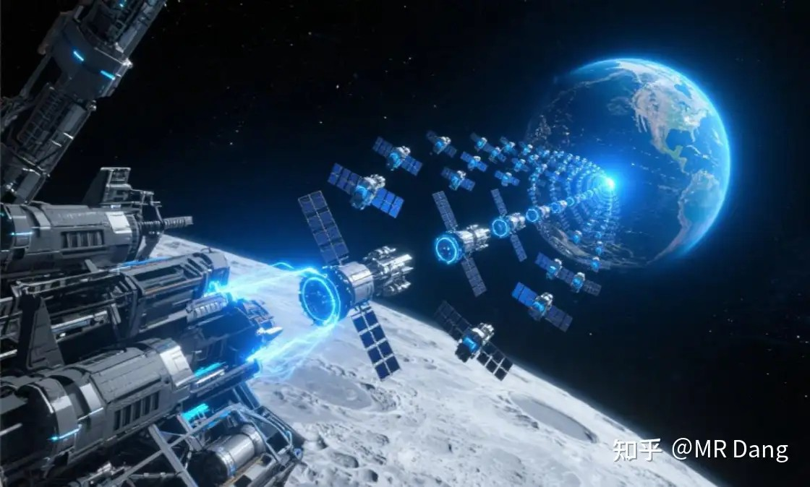

老马说要从月亮建立基地发射大量卫星到地球。

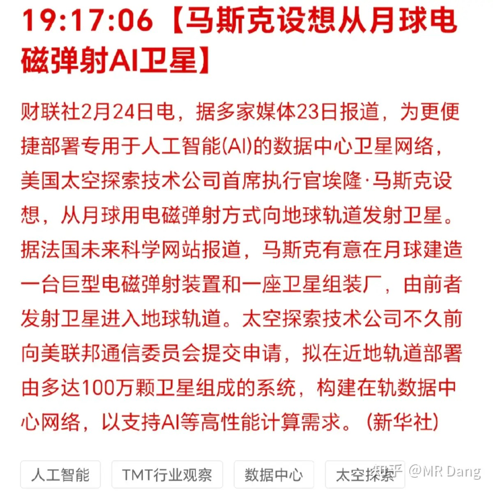

老马的思路是说月球引力低，所以在月球上建个城市，就地取材制造ai服务器，利用引力低的优势源源不断的向地球发射。

我凭感觉这事做不了。

倒不是技术瓶颈的问题，老马说他要发射的是卫星，那万一发射的不是卫星，而是别的什么东西，这对任何人都是巨大的威胁。

---

央妈投了6000亿麻辣粉：

本周3000亿到期，相当于净投放3000亿流动性，来自央妈的爱，暖暖的，很贴心。

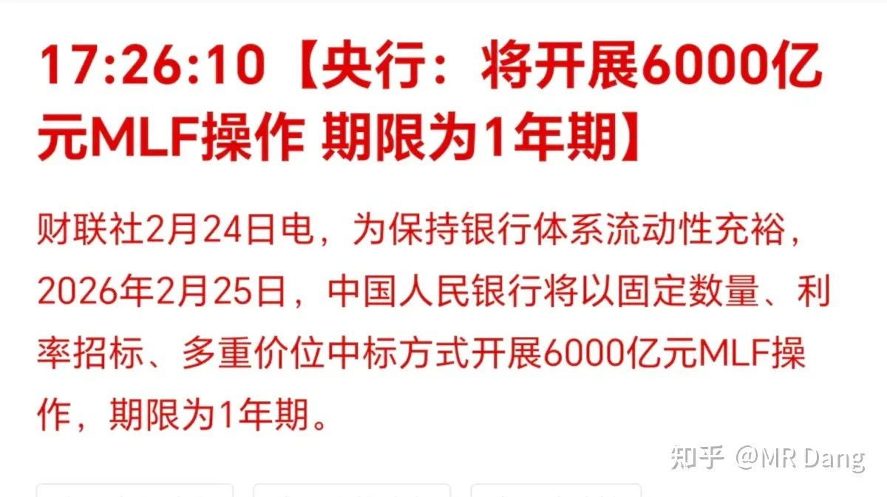

---

某港股电影公司发布业绩超预期：

经常看电影的对它应该挺熟。这几天因为票房不好，整个电影板块都在崩，它股价跌了不少。昨天发布了业绩预告，业绩中位数5.65亿。目前估值60多亿人民币，算下来也就是12pe左右，估值不贵。

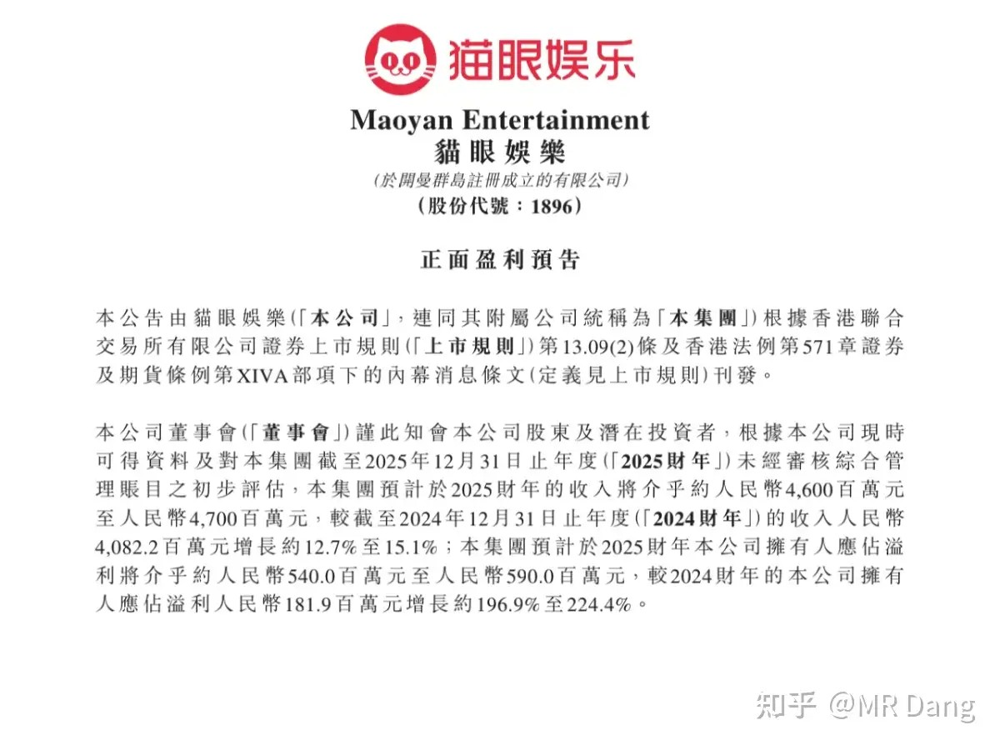

至于业绩超预期的原因：以前的坏账给要回来了，神奇。

非荐股，我没有相关头寸，因为爱看电影，提一嘴。

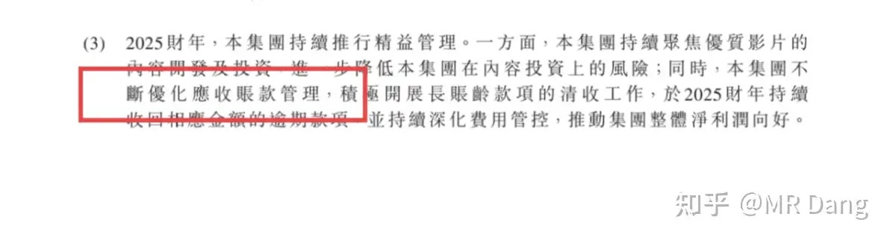

---

说到港股，有一个事我得提个醒：

**一个大风险 + 一个小机会**

每年的港股通名单都会在三月份和九月份进行调整，纳入的叫"入通"，调出的叫"退通"。

别看只是一个港股通，不亚于上市和退市的区别，对股价会有非常非常重大的影响。

以上是三月即将"退通"的一份**可能**的名单（注意仔细甄别，以正式公告为准）

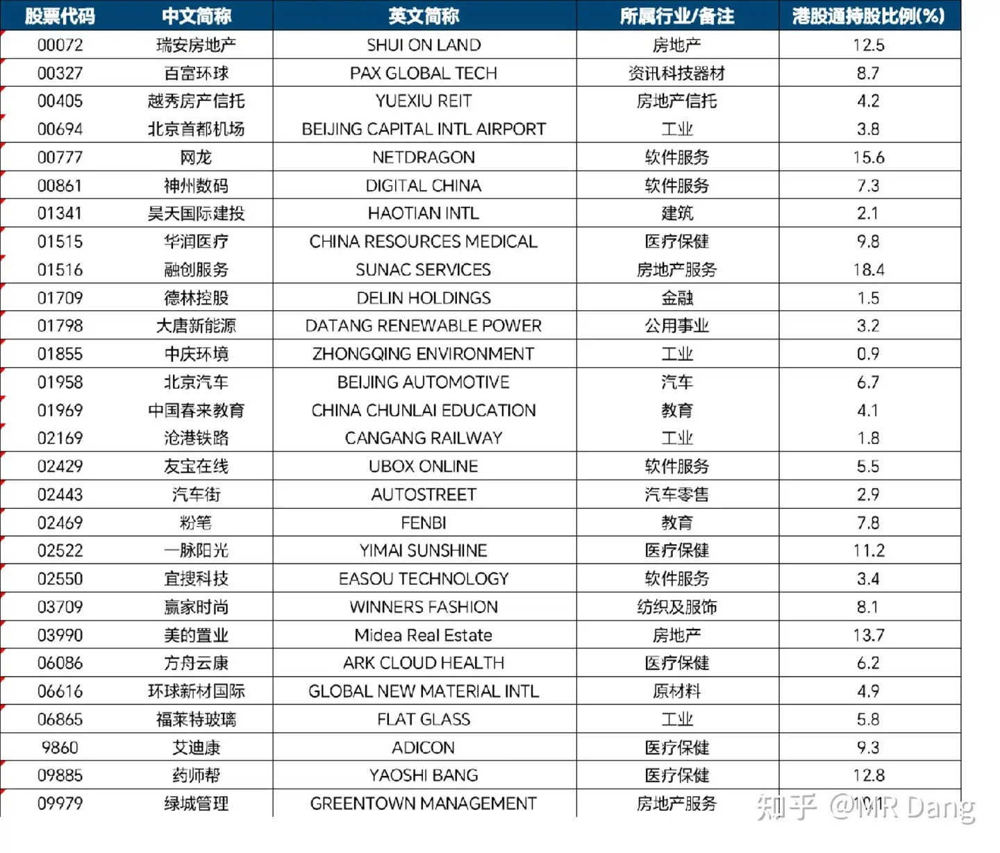

如果持有相关标的的，一定一定注意相关风险，特别是港股通持股比例高的。

**不要有任何侥幸心理，教训会是十分惨痛的。**

**不要有任何侥幸心理，教训会是十分惨痛的。**

**不要有任何侥幸心理，教训会是十分惨痛的。**

说了三遍了，勿谓言之不预也。

上次措辞这么严肃的是节前电影板块的风险提示，上上次是名字里有白银的股票的风险提示。

以前我统计过，退通前一个月平均跌幅在5%到10%之间，退通后一年平均跌幅在35%左右，整体跌幅40%左右，而下跌概率九成以上。

当然大的风险里也会有小机会，就是里面会有一些沧海遗珠，本身质地还可以的标的。退通以后，如果价格持续阴跌，比如跌到现价的50%或者30%甚至20%，那可以找机会配置一些吃股息，最低有10%以上的股息率就值得考虑了。

---

今天的重要时事不多，把昨天的尾巴补充一些。

研究有色，除了统计局，有两个信源是一定一定要研究的，分别是 **WBMS**（世界金属统计局）和 **USGS**（美国地质调查局）。

这两个各有侧重：

- **W** 的数据颗粒度是月度更新+年度报告，数据侧重有色，数据内容主要是产销量、进出口、库存、缺口/过剩。发布形式以付费订阅为主，面向机构，是所有有色分析师必看的内容。
- **U** 的数据颗粒度是年度调查+专题报告，数据侧重除了有色，还有其他能源和非金属，数据内容侧重储量。发布形式完全免费，是这个领域最权威的机构。

通过数据内容的区别可以得知，W的数据偏向市场化、短期影响，而U的数据影响更长期，适合基础研究。

今天要讲的就是W在2026.2.18发布的2025年度报告，提取其中数据如果再加上U的数据，整理后就得到了：

两边数据有一个关键的桥接过程：**原生矿金属采量 × 综合回收率 = 原生矿金属产量**

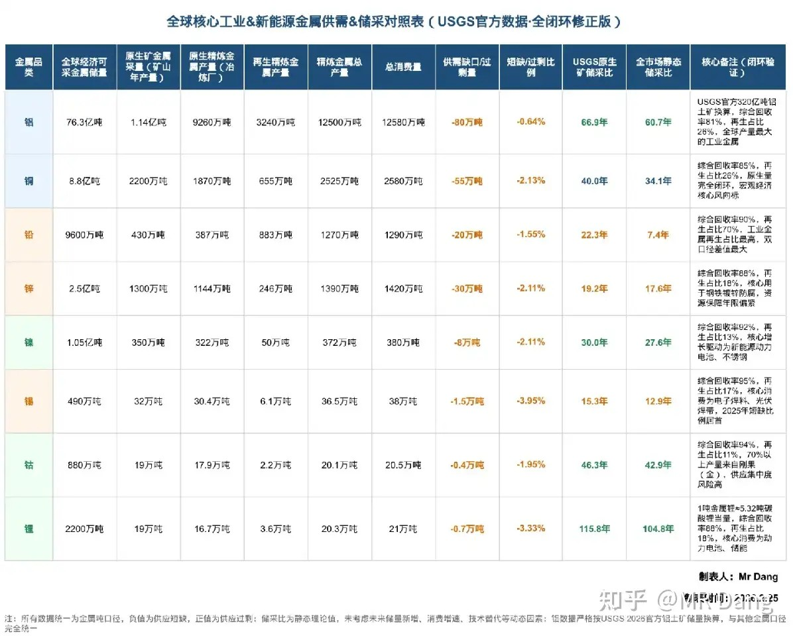

这个表很重要，看得懂其中的逻辑的话，对投资有色很有帮助。其中铝是例外，因为铝的限制瓶颈在电在政策，而不是铝土矿。

结论：锡的长期储采比逻辑最硬，铝的确定性高（供应刚性，需求旺盛），铜的需求和铝具有一定的替代性，但供应弹性更大，铜铝的价格会在一定的铜铝比范围内波动。

---

**大宗商品：**

锡：夜盘上涨两个点

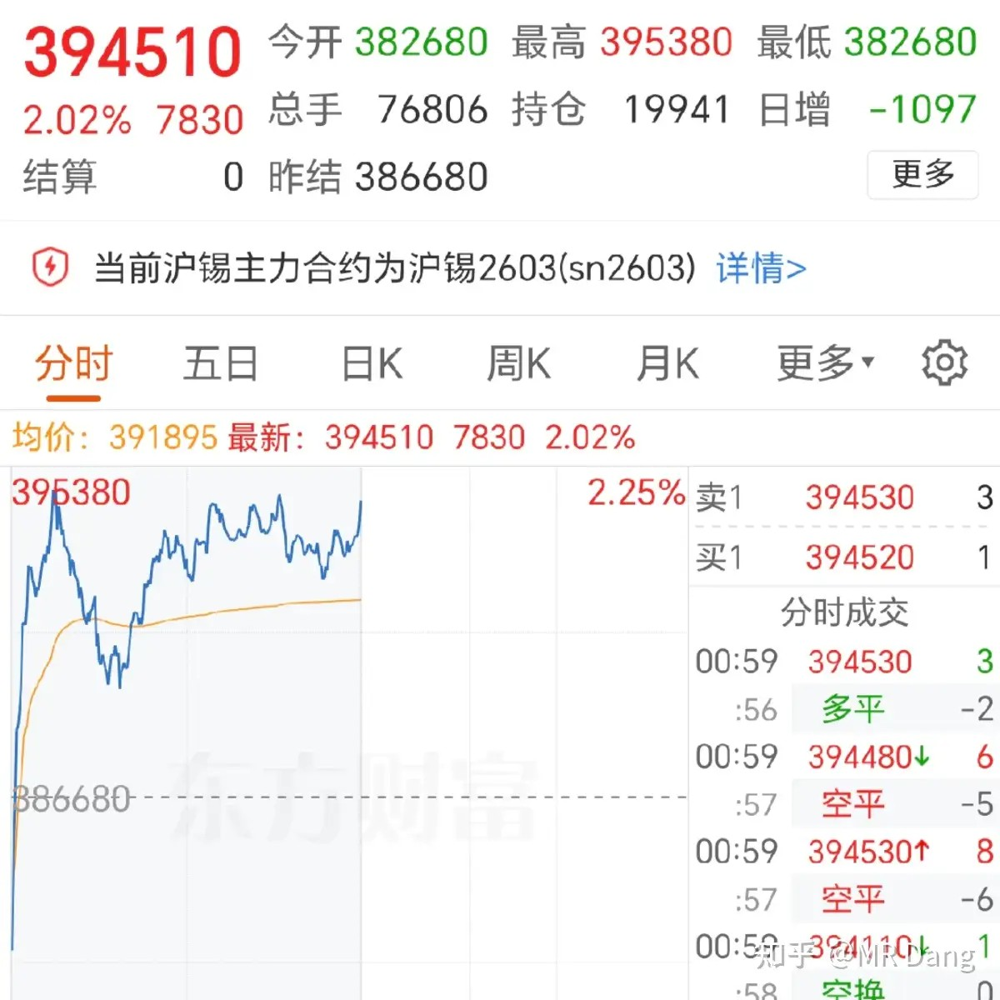

棉花：创近期新高

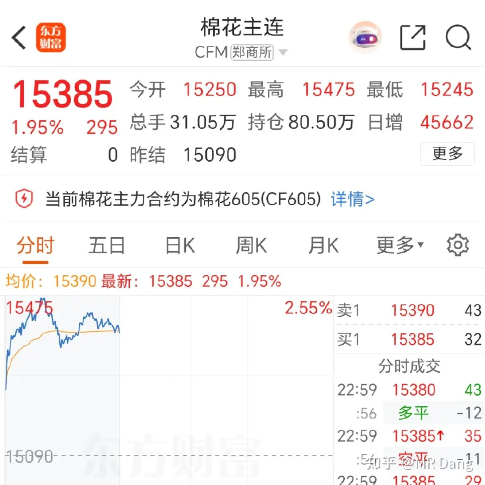

棉花分为皮棉和籽棉，籽棉是田间地头收回来的初级棉花，大约亩产360公斤左右，皮棉是加工后用于期货交割标准的棉花，大约亩产150公斤左右。棉花期货报价每手为5吨，大约对应30多亩地左右的产出。未来两年的供需缺口可能加大，所以近期走势比较强。

棉花在历史上是弹性非常大的品种，受天气影响很大，如果主产区发生干旱或者洪涝，期货价格会大幅暴涨。主产区口诀：**中印美巴巴**（中国、印度、美国、巴西、巴基斯坦），这里面只要有两个国家气候异常，棉花价格就会起飞。同时棉花和化纤互为替代品，一旦原油价格上涨带动化纤涨价，也会刺激棉花价格上涨。

铜：收盘后上涨1个点左右

铂：收盘后上涨1个点左右

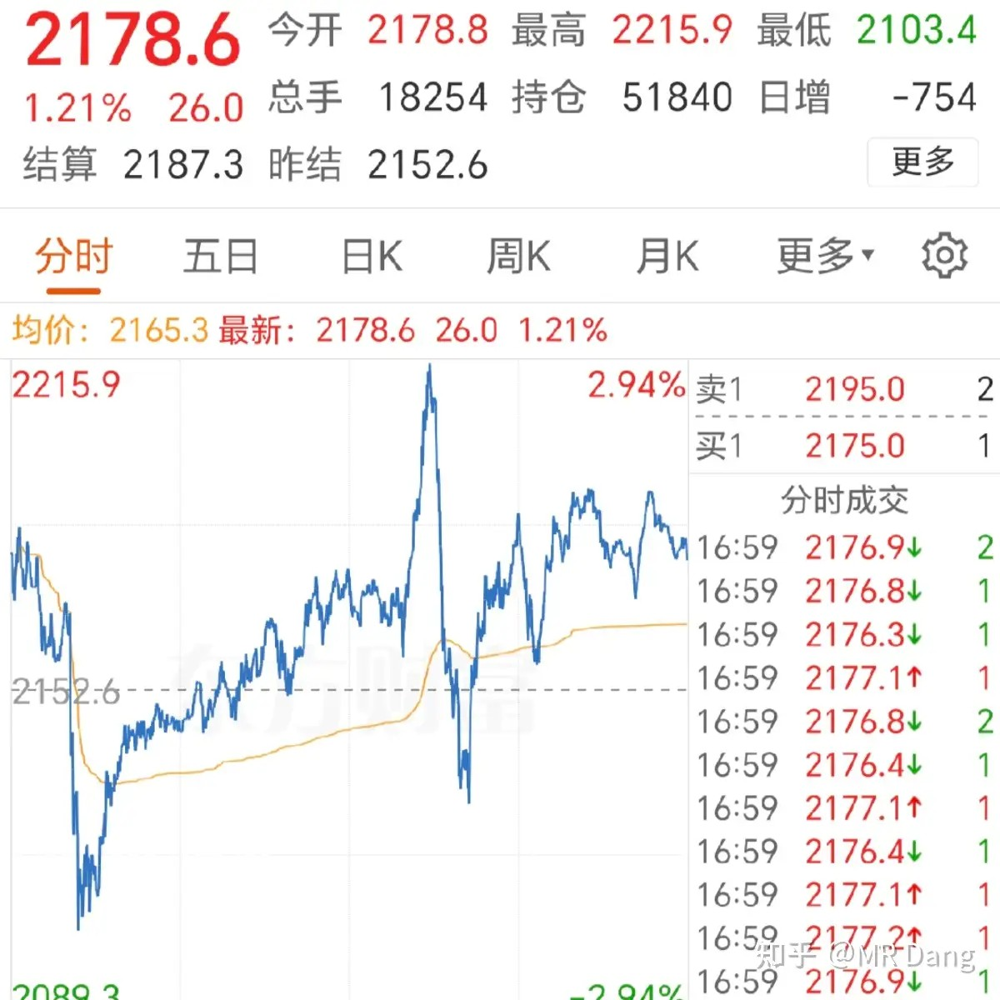

其他白银黄金原油在收盘后回调一个点左右，铝铅锌等品种变化不大。

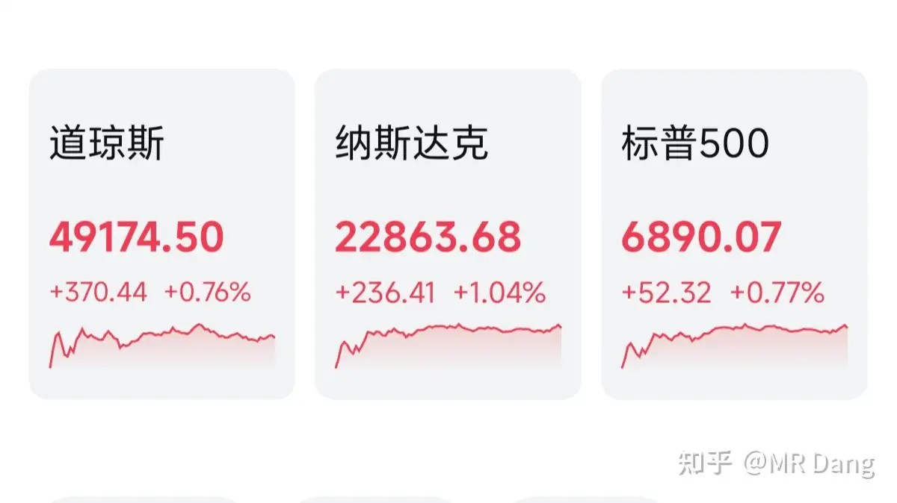

---

**外围市场：**

中概股表现不错，今天的恒科家人们应该不会被暴打了吧。

昨天我的个人净值在新年第一天又大幅刷新历史新高，算是很不错的开门红。银行没拉后腿，资源股除了一个比较特立独行的，涨幅都很不错，消费表现也不错。

事后也没什么好复盘的，这种都属于随机波动，强行解释属于拿着锤子找钉子，一天的涨跌说明不了什么基本面问题的。

比如磷，磷矿的紧缺是客观事实，而且这件事实已经至少在几个月以前就得到确认。但是直到懂王表态、西大管制，这件事情才得到资本的重视。

作为投资者，我们能做的就是确认磷矿紧缺这件事以后，在一个合适的估值价位去配置它。但是懂王什么时候盖章确认，这个是无法预料到的，属于意外事件，我们在做出投资决策时不会纳入考虑的。

同样的逻辑也适用于锡，锡的中期紧缺是显而易见的。但是什么时候由谁把这件事摆在台面上当成一件重要的事情去办，也是无法预料的。

所以作为投资者能做的就是在估值便宜的时候配置一点仓位，去等这个逻辑兑现。

一个喜欢保护韭菜的博主，希望大家少少踩坑，多多赚钱！！！

> [!comment]- 点击展开评论
> | 用户 | 时间 | 地区 | 内容 |
> | :--- | :--- | :--- | :--- |
> | 钱包鼓鼓 | 3小时前 | 福建 | 总结当日市场：马斯克月球基地、央行6000亿MLF、港股通名单风险、商品涨跌 |
> | 归去来兮 | 3小时前 | 浙江 | 巴芒答投资者问，与"模糊的正确"理念契合 |
> | Expanda | 3小时前 | 北京 | 应该关注一下入通名单 |
> | 树树树 | 3小时前 | 河南 | 有人抄你文章，名字头像都模仿你 |
> | 见路不走 | 1小时前 | 陕西 | 一个人手上全是正确答案太离谱了 |
> | 222 | 3小时前 | 江苏 | 昨天不一样的有色应该是HQKG，怎么还绿了？ |
> | 111111 | 3小时前 | 安徽 | 大佬带动了一批人变勤奋了 |
> | Billionaire | 2小时前 | 河南 | 粉色多了，发的东西越来越鸡肋了 |
> | 超人M | 2小时前 | 陕西 | 财神爷，早上好 |
> | 掘金哇咔咔 | 3小时前 | 四川 | 新书搞个粉丝签售会，顺道西安打卡 |

---

*本文件由自动脚本从MR Dang知乎页面提取生成*

---

**作者**: MR Dang
**链接**: https://www.zhihu.com/question/2009573512965289623/answer/2009885430045242968
**来源**: 知乎

*著作权归作者所有。商业转载请联系作者获得授权，非商业转载请注明出处。*

---

## 相关阅读

**📈 每日行情评价系列：**
- [[20260224-如何看待2026年2月24日A股市场行情？|2月24日行情]] - 马年第一个交易日，机器人超预期，电影不及预期
- [[20260213-对2026年2月13日A股市场行情，大家有什么预测和看法？|2月13日行情]] - 节前最后一个交易日行情分析
- [[20260212-对2026年2月12日A股市场行情，大家有什么看法？|2月12日行情]] - 节前倒数第二个交易日行情

**🎊 春节系列：**
- [[20260221-迎财神|迎财神]] - 初五迎财神的传统文化与投资环境思考
- [[20260220-非专业影评3|非专业影评3]] - 《镖人》电影版深度解析与春节档票房分析
- [[20260218-非专业影评|非专业影评]] - 春节档电影市场分析与《熊出没》票房解读

**⚔️ 有色金属投资系列：**
- [[20251104-《天阶功法卷五》DSL投资价值分析|天阶功法卷五]] - 磷化工投资价值分析
- [[20251102-《天阶功法卷四》磷化工投资价值分析|天阶功法卷四]] - 磷化工行业深度研究
- [[20251030-《天阶功法卷三》NSLY投资价值浅析|天阶功法卷三]] - 低价铝投资价值分析

**💰 投资方法论：**
- [[20260201-十万粉感言|十万粉感言]] - 量子态叠加理论与高股息方法论
- [[20251022-《地阶功法卷一》投资者必须斩杀的三个妄念|地阶功法卷一]] - 投资者必须斩杀的三个妄念
- [[20251011-下周一股市就要大跌了，作为投资者该如何应对？|大跌应对]] - 面对大跌的正确心态
