# 如何看待2026年2月26日A股市场行情？

---

**发布时间**: 2026-02-26 07:00  |  **原文链接**: https://www.zhihu.com/question/2009656248992278426/answer/2010248224825447336  |  **点赞数**: 2434 人赞同

**作者信息**: MR Dang​​独立投资人，不接广不卖课，无任何其他平台，无小号。

---

## 正文内容

今天的头条给到懂王，哦，不对，是赢王：

过于抽象以至于不知从何说起，一天的快乐从此开始。

本来看国情咨文想找找投资机会的，看着看着差点被赢学洗脑，太欢乐了，哈哈。

中间没啥干货，不过赢王说了如果中期选举出问题，股市会崩盘，把自己的选票和股票捆绑在一起了。

第二条应该算真正意义上的头条：

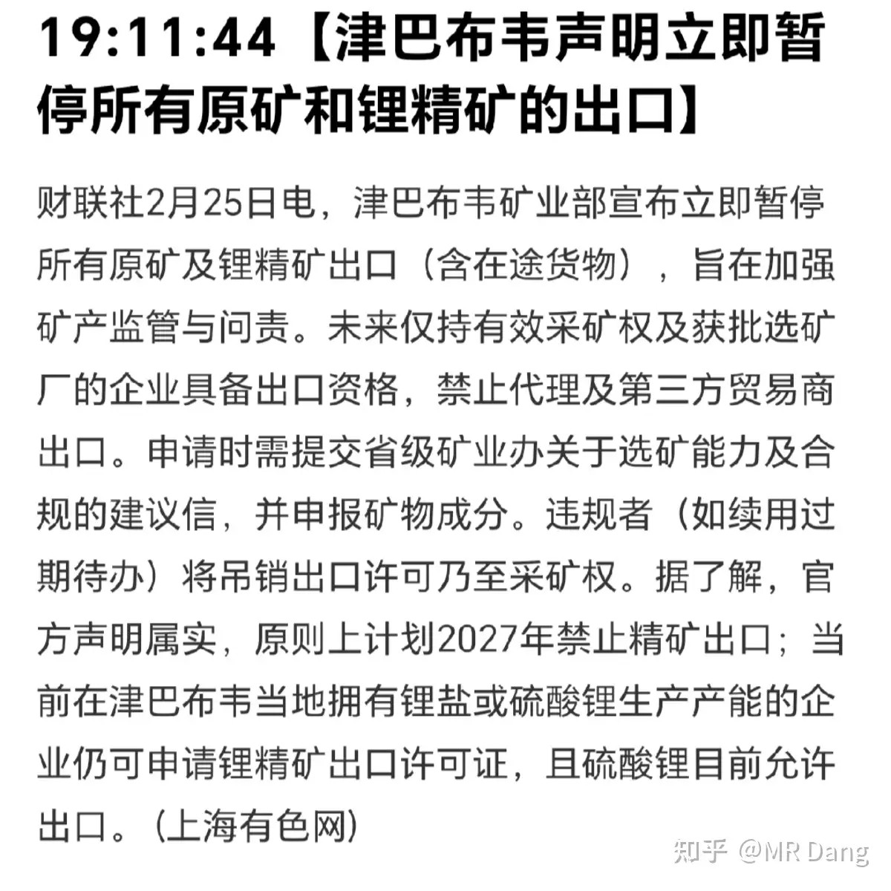

锂的话，粗略的按照6％品位锂辉矿10吨折合1吨碳酸锂，以下为了方便比较，统一按照碳酸锂当量LCE口径分析。

几句简单的概括：

津巴布韦是全球第三的锂矿出口国，出口量大约12万吨LCE。

东大承接了其中99％以上的出口量。

东大每年消耗128万吨左右LCE，大约48万吨自产，80万吨进口。

从津巴布韦进口的锂矿占全年需求的9％以上。

需要注意的是，目前不是说停止出口，而是暂停出口。

但是这个时间点很巧妙，现在正是抢出口的时候，需求端比较强劲，如果供应端来这么一下子，很可能造成结构性的供需失衡，造成价格的脉冲式剧烈波动。

持有相关标的投资者也不要太激动，有些企业如果在当地有业务的，也是会受到影响的。

昨晚的美股相关企业高开低走：

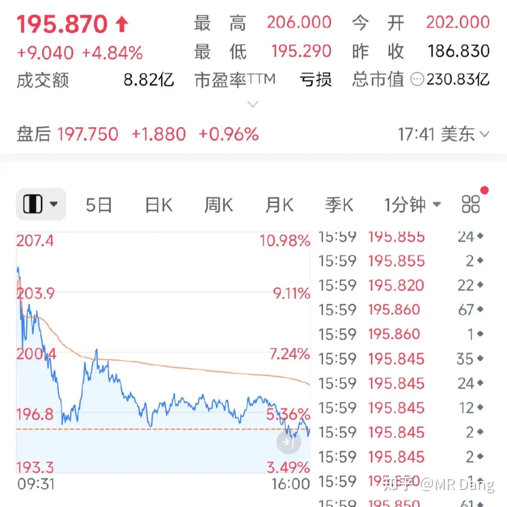

另外没有拿纯锂的也不用着急，其实铜王以前画过的大饼里，锂增速应该是最快的：

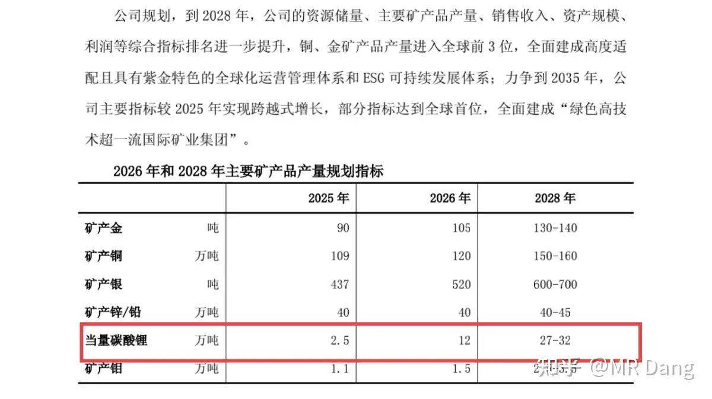

三年翻十倍，也不错了。

有人可能好奇津巴布韦为啥这么干？

其实就是换了个部长，为了自己的成绩，倒逼所有企业搞硫酸锂，硫酸锂污染低，成本低，优点比较多。

阅读理解题一道，试着阅读下面的新闻：

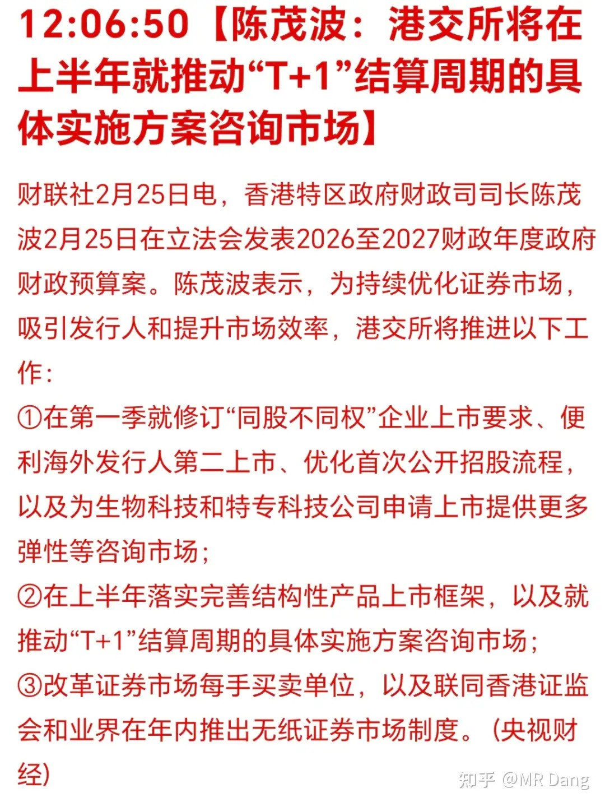

读完以后，是什么感觉？

如果第一反应是港股以后的交易要从T+0变成T+1了，那说明信息获取的能力是有很大问题的。

因为这种理解表示你的焦点一直聚焦于“T+1”，而没有关注“结算”这个关键词。

港股目前交易是T+0，结算是T+2。

新闻的意思是结算从T+2变成了T+1，也就是卖出股票以后取钱的速度加快了一个交易日。

没在香港交易市场交易过的可能不知道香港市场有多抽象：

台风来了就要挂风球，挂了8号风球就有可能停止交易，一停就是半天起步。

从1947年开始一直到2024年的70多年间都是如此。

为什么呢？

因为台风会吹的电话线一摇一晃的，影响交易。

而T+2的结算制度也是如此，诞生于1992年，拥有30多年的光辉历史。

之所以不跟进T+1，说的好听点是国际金融中心为了地球另一边的投资者方便安排时间，其实就是改造成本太大，技术落后，没人掏钱。

上海：

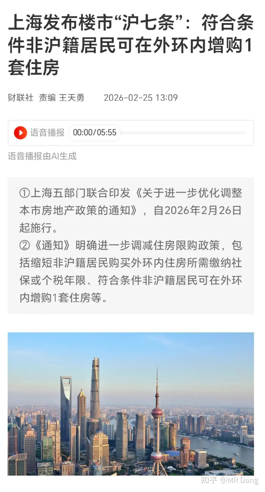

我看到一个评论挺粗俗的，大概意思是现在这个行业的各种松绑手段，就像一个扭扭捏捏的脱衣舞女郎，下面的看客都走光了，还在考虑自己动作幅度大了会不会走光。

某医药企业研发了一款药可以把儿童的鸡鸡变大。

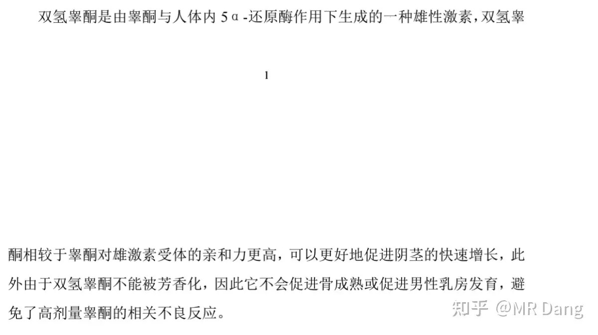

受此影响，股价大涨。

我知道有些读者的朋友比较好奇，这个儿童的范围是多少，216个月的儿童是否能用？

其实我对这个不感兴趣，我不需要。

但还是帮大家的朋友查了下，直接说结论，不行的哈，它的作用大概是病态的变成正常大小，但是已经正常的不可以继续变大。

所以咯。。。市场需求应该不会太大的，可能几十个亿？

不过也说不准有死马当活马医的，比如某些读者的朋友偷偷买了给自己抹。。。。。

大宗商品：

锡：盘后涨了两个点左右

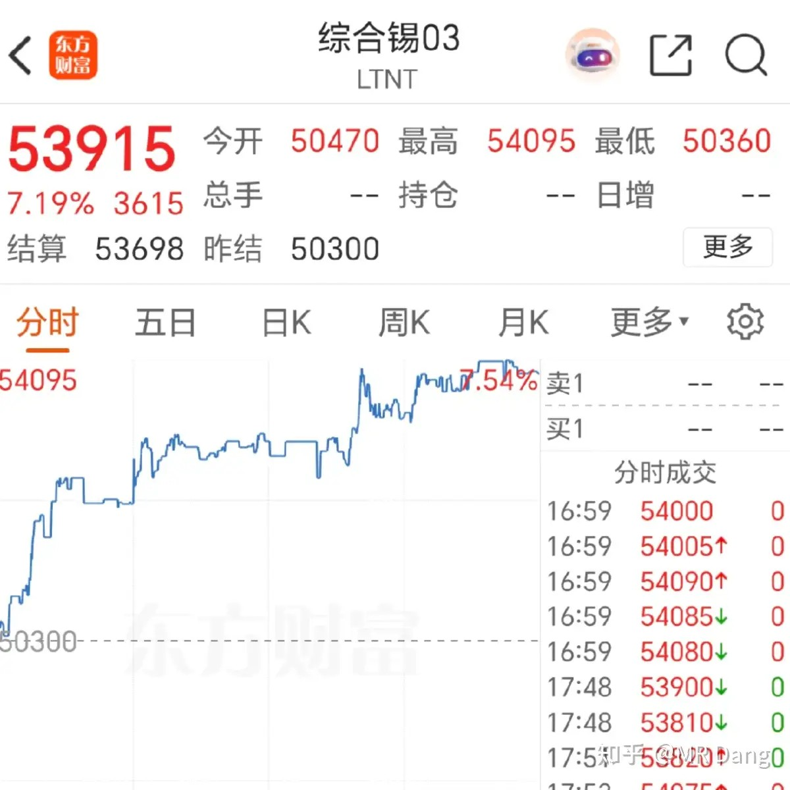

黄金，锌，镍盘后回调半个点，白银回调一个点，原油基本没动。

原油这边有个新闻，opec+考虑增长，沙特也磨刀霍霍，马力全开准备接手可能的市场空缺。

铜涨了0.20％，铝涨了一个点，马上重返2.4万。

总的来说，有色波动不大。

另外昨晚芝商所拔了一会儿网线，回来以后黄金白银开始回调：

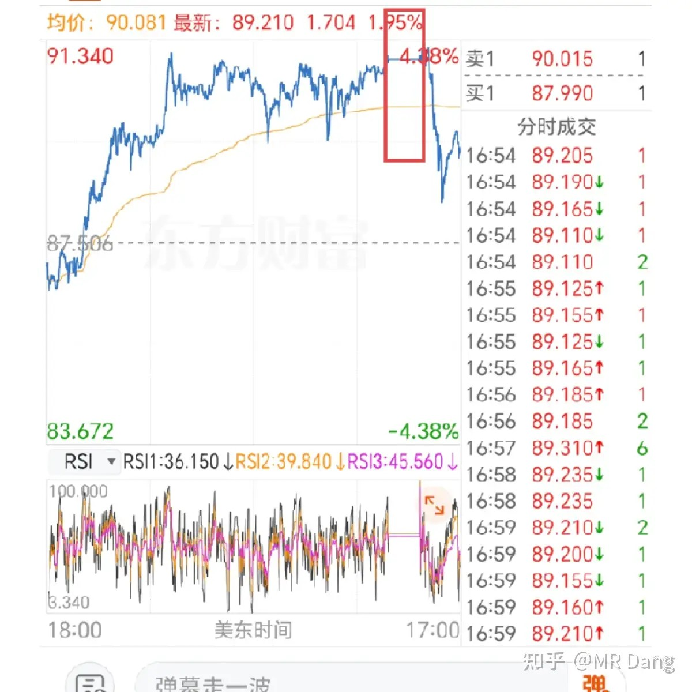

图里框出来的直线就是拔网线的时候：

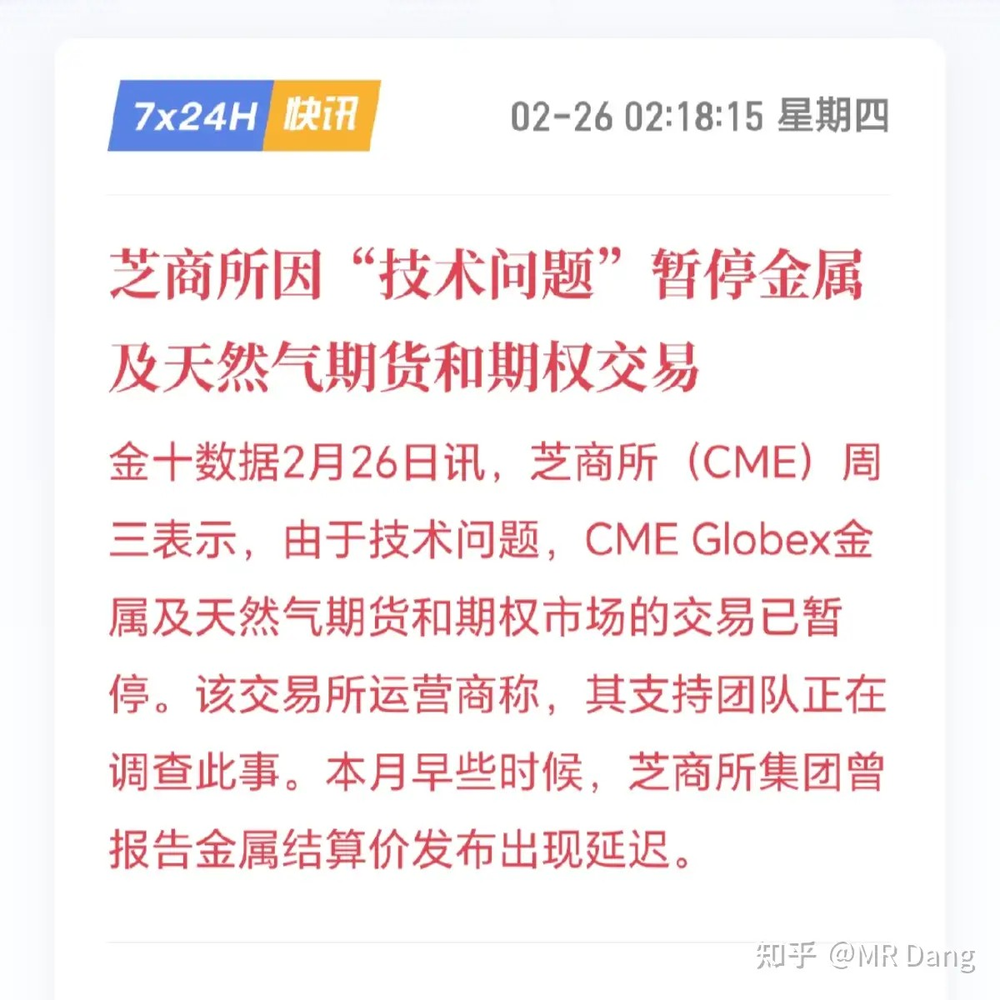

一般来说，阴谋论的说法就是有重要会员要爆仓了会拔网线进行交易回滚进行保护，也就是某些委托不算数了，重来。

棉花：又涨了接近1个点

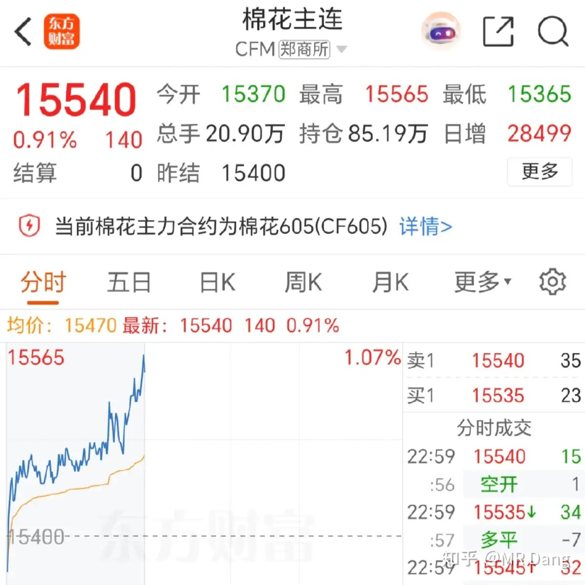

我为什么老盯着棉花，因为棉花毛利率低，有些种植企业的毛利率也就3％到5％，净利率1％都没有，涨1个点业绩就翻一倍，涨10个点就翻10倍。

今年东大这边有政策限制种植面积，可能产量下滑，西大主产区德州持续干旱，产量下滑三五个点是有的。

总体供应一定是偏紧的，本身又在商品大周期，容易被炒作。

外围市场：

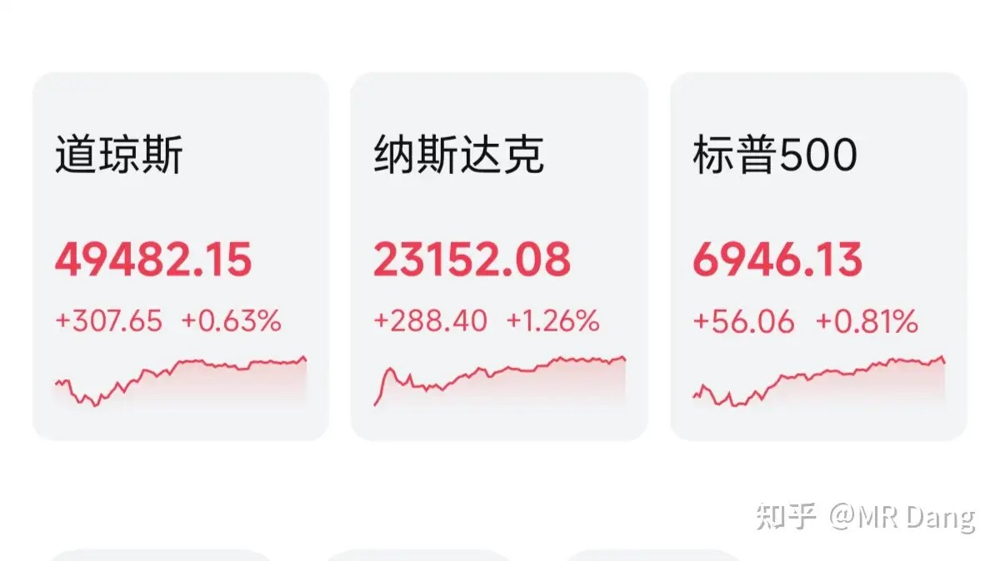

达子发布的业绩符合业绩，发布的前瞻小超预期，两份数据总体不错，算是给AI又续命了。

昨天个人净值又创新高，银行拖了点后腿，不过资源太过争气，消费也很不错，电网储能也可以，最后还是红了一些。比较意外吧，马年前两个交易日形势一片大好。

我看昨天的评论区也是一片喜气洋洋，很多投资者过来报喜，还刷了很多礼物，在此一并感谢。

也有问要不要操作一下的，这个按照自己的成本来就行了，执行原则即可，所谓原则就是不要有个人主观判断，简单机械执行。

很多投资者老是纠结图形，封板，开板什么的。要我说看盘都是多余的，不要想太复杂，到位置了提前挂个单就行了，该上班上班，该睡觉睡觉，不要让k线图把生活绑架了。

还有就是世界杯提前埋伏的问题。这个还真可以有，世界杯的话，四个方向，草坪，体育彩票，啤酒，周边纪念品。

这些里面啤酒的股息率高一些，弹性小一些，适合稳健一点的投资者。其他三个方向的基本面没那么稳，但是弹性大一些。

啤酒偏向投资，其他三个偏向投机，可以根据自己风险承受能力选择。

啤酒就四个，啤王，百年啤，南啤，北啤。

啤王体量大，估值低，但是在港股。

百年啤稳，弹性底。

南啤分红可以，弹性高，更加符合我的审美，缺点是全国化受阻，依赖大乌苏等单品。

北啤目前估值比较高，安全边际不够。

其他方向的可以问ai，因为就那几个。

世界杯题材和电影不一样，择时难度更大！！

电影一般是提前一两个月布局，然后春节前几个交易日跑路。

世界杯一般打的提前量更大，至少提前三四个月布局，在开幕前一个月就要跑了，不要等到开球的哨声响起，那就 too late了。

今年是6月11日前后在阿兹特克体育场开幕，那大概就是现在这会儿布局，最晚最晚到5月上旬就要考虑跑路了，跑晚了腿都能给你打断。

以上不构成投资建议，毕竟还是那句话，鄙人不善择时。

对普通投资者来说，要么打定主意不参与，要么就趁早，五一假期以后再后知后觉的去参与，大概率没好果子吃。

这中间又会有不少新读者，说不得五一假期回来我又得提示相关风险了。

一个喜欢保护韭菜的博主，希望大家少少踩坑，多多赚钱！！！

一个喜欢保护韭菜的博主，希望大家少少踩坑，多多赚钱！！！

> [!comment]- 点击展开评论
> | 用户 | 时间 | 地区 | 内容 |
> | :--- | :--- | :--- | :--- |
> | 待补充 | - | - | 评论内容待从HTML中提取 |

---

*本文件由自动脚本从MR Dang知乎页面提取生成*

---

**作者**: MR Dang
**链接**: {url}
**来源**: 知乎

*著作权归作者所有。商业转载请联系作者获得授权，非商业转载请注明出处。*

---

## 相关阅读

**📈 每日行情评价系列：**
- [[20260225-如何评价2026年2月25日A股行情？|2月25日行情]] - 老马月球基地、港股通退通风险、有色金属储采比
- [[20260224-如何看待2026年2月24日A股市场行情？|2月24日行情]] - 马年第一个交易日，机器人超预期
- [[20260213-对2026年2月13日A股市场行情，大家有什么预测和看法？|2月13日行情]] - 节前最后一个交易日

**🎊 春节系列：**
- [[20260221-迎财神|迎财神]] - 初五迎财神的传统文化与投资环境思考
- [[20260217-拜年啦|拜年啦]] - 春晚观后感与白银LOF赔付方案解读

**⚔️ 有色金属投资系列：**
- [[20251104-《天阶功法卷五》DSL投资价值分析|天阶功法卷五]] - 磷化工投资价值分析
- [[20251030-《天阶功法卷三》NSLY投资价值浅析|天阶功法卷三]] - 低价铝投资价值分析

**💰 投资方法论：**
- [[20260201-十万粉感言|十万粉感言]] - 量子态叠加理论与高股息方法论
- [[20251022-《地阶功法卷一》投资者必须斩杀的三个妄念|地阶功法卷一]] - 投资者必须斩杀的三个妄念
