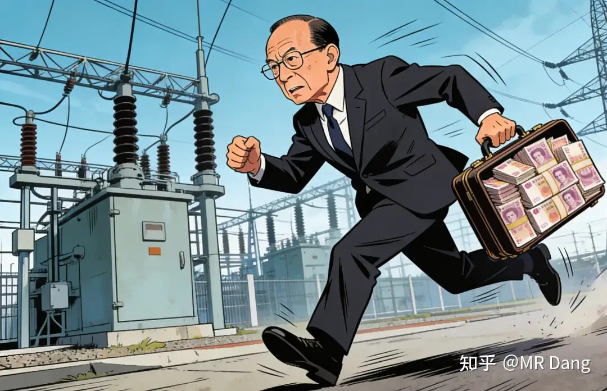
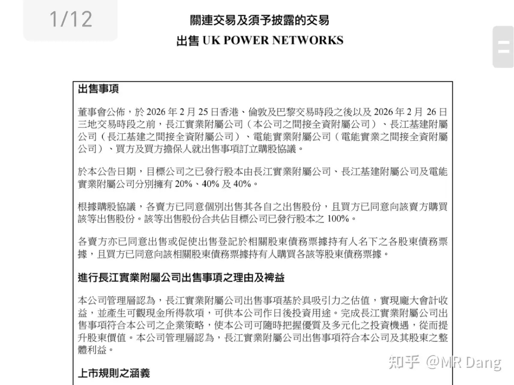
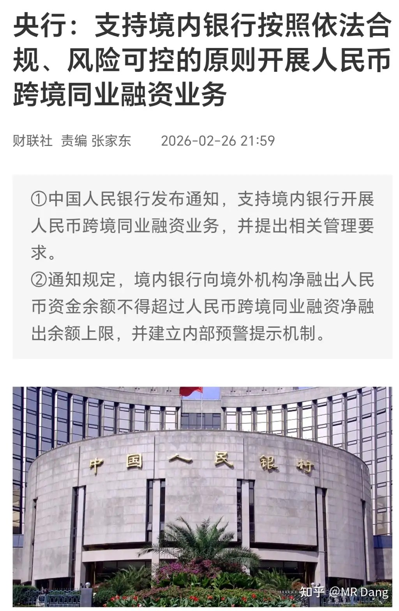
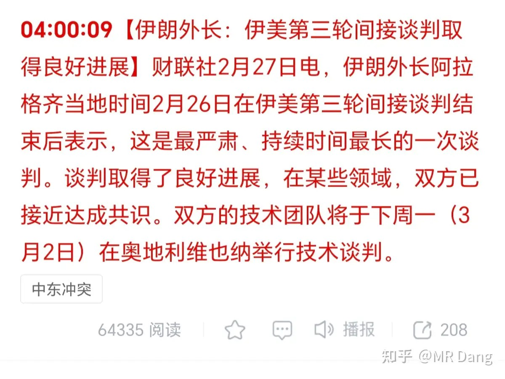
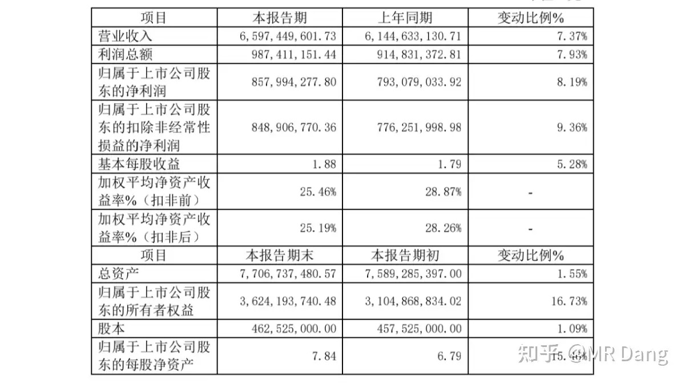
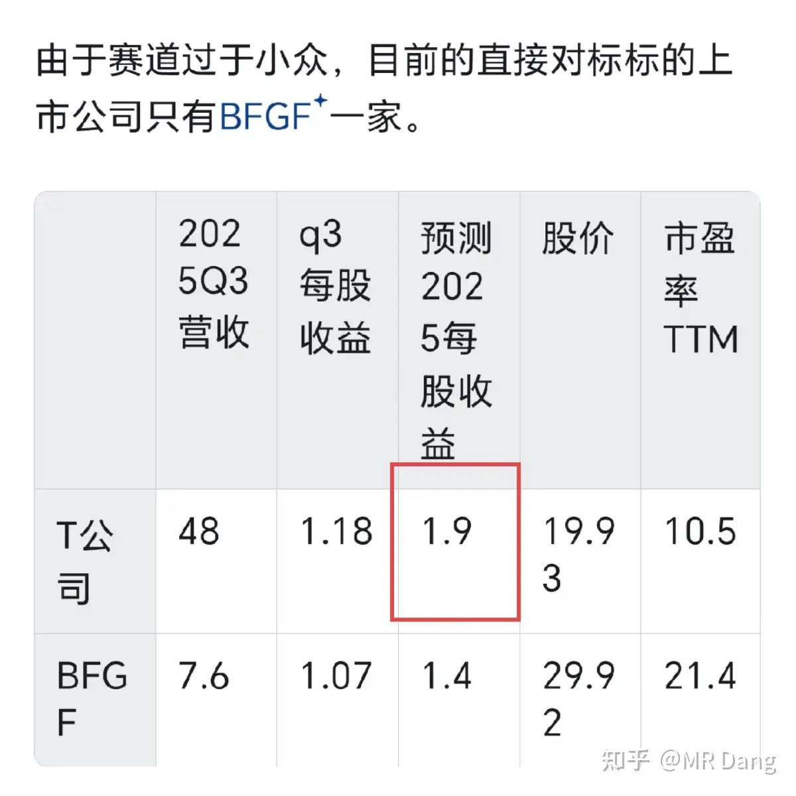
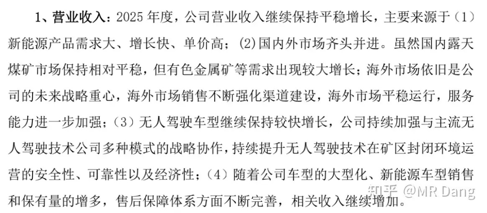
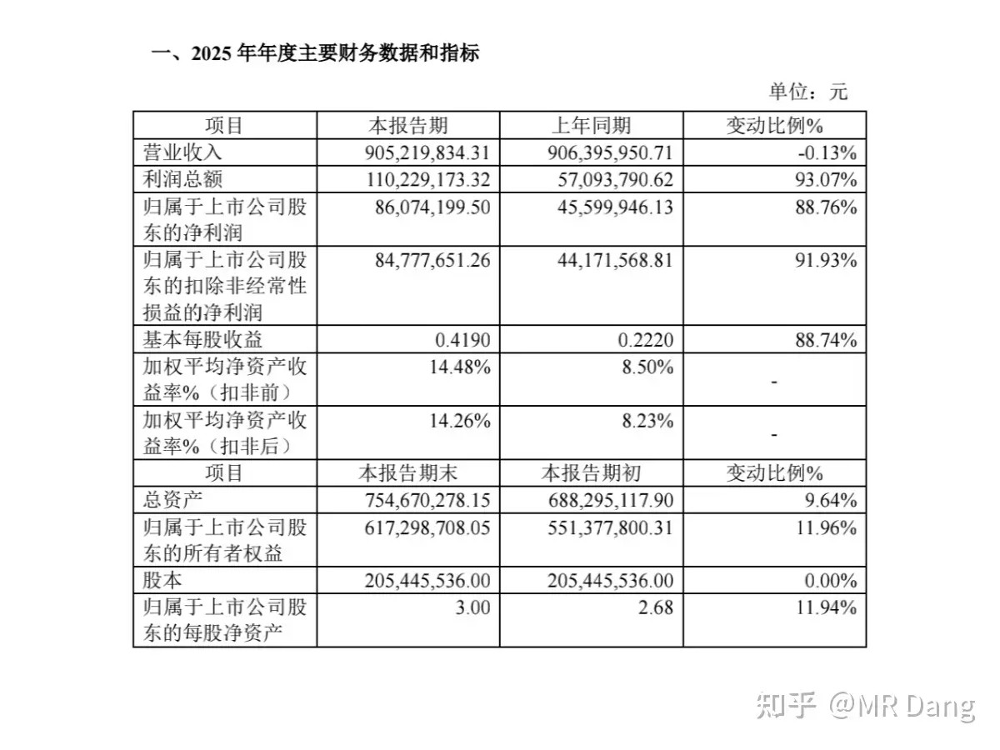
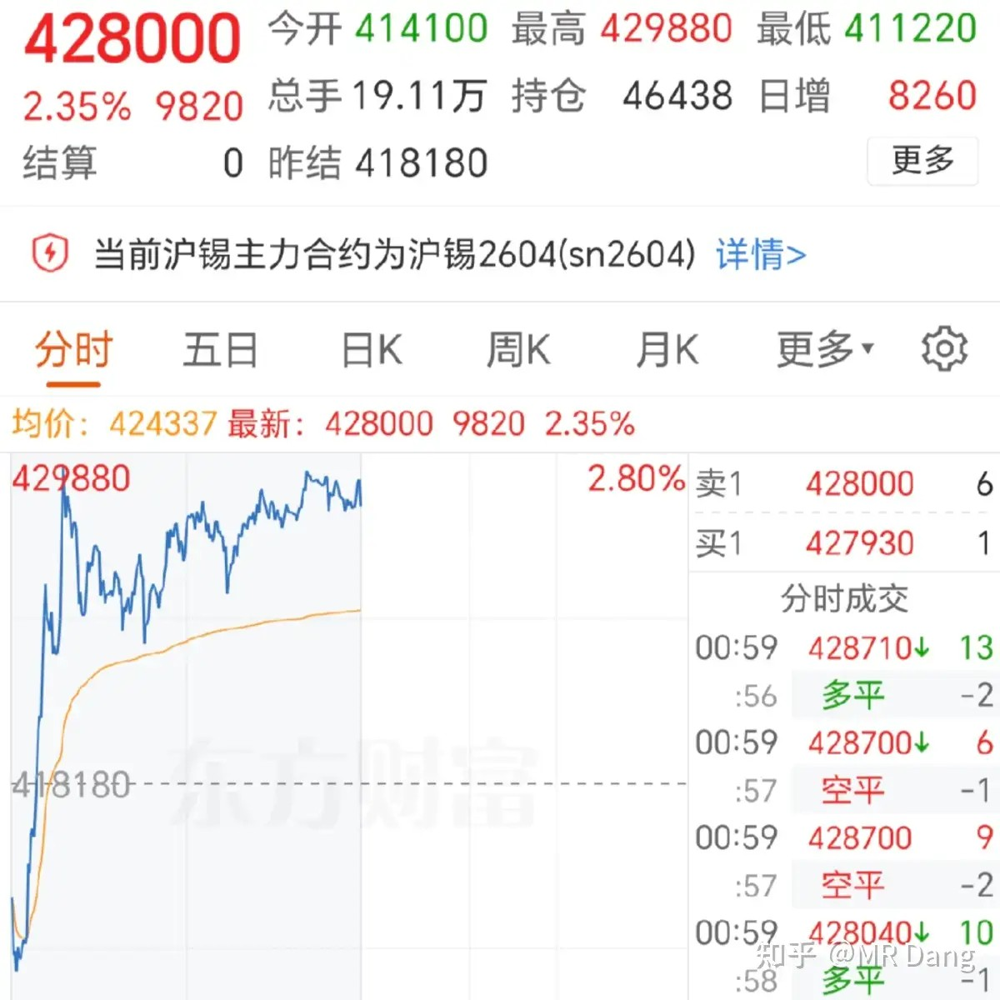
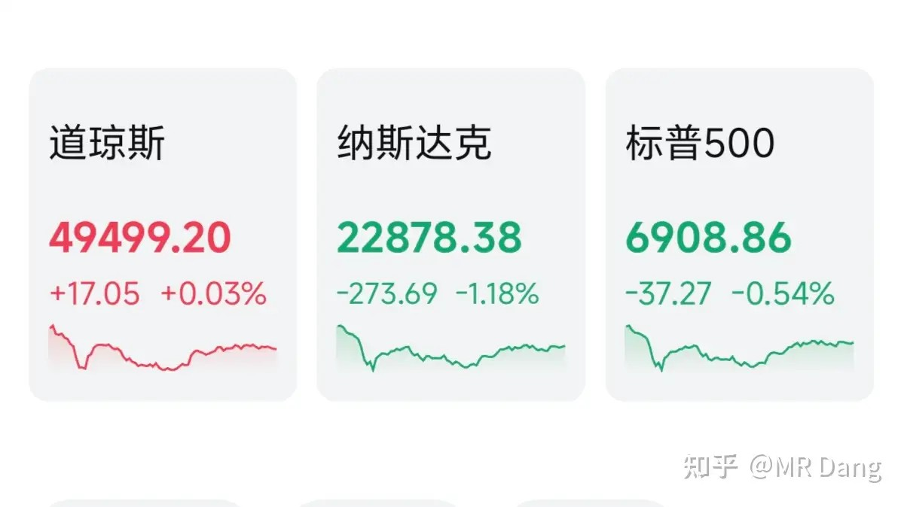

# 如何评价2026年2月27日A股行情？

---

**发布时间**: 2026-02-27 07:00  |  **原文链接**: https://www.zhihu.com/question/2010281912225264421/answer/2010610423871862556  |  **点赞数**: 1694 人赞同

**作者信息**: MR Dang​​独立投资人，不接广不卖课，无任何其他平台，无小号。

---

## 正文内容

李超人从UK跑路了。

他把之前抄底的UK电网资产出售了。

这笔投资2010年57亿英镑估值抄底，今年卖了168亿估值，中间分红一共44亿，年化复合收益率大约6.5％左右。

抛开立场不谈，李超人无愧超人之名，投资眼光还是毒辣的。

至于为啥要卖，是不是人要回来了？

这个可能性不大，更多的还是巴拿马的做法刺疼了他敏感的神经。

现在电网这么重要，他可能怕如果不体面的卖掉，到时候说不定又被抢了。

央妈：

讲了个啥呢？

以前境外的机构要人民币，从境内银行出去的时候，没有统一的通道，有走账户融资的，有走债券回购的。

银行做起来繁琐，监管盯着也费劲，程序多，成本高。

现在不是要推人民币国际化么？那是不是要先把人民币发出去？

这么大的量，走这些小的通道，效率低，不利于推行。

所以就搞了个更先进的批发渠道，以后都走这个通道。

对银行是好事，效率提高。

对监管也是好事，集中监管。

对人民币国际化也是好事，量大管饱。

一举三得。

不过如果看不懂也没关系，博主有个偷懒的方法：

凡是赋予一项权利的事情，比如这里用词是“支持”开展业务，你别管那个权利有没有用，业务能不能挣钱，有就好过没有，那就是利好。

反过来，凡是承担一项义务的事情，别管那个义务难办不难办，都是利空。

但是对银行的体量来说，这种业务对利润的影响几乎可以忽略，类似一杯水倒进大海里。

谈判最新进展：

还是那句话，谈判的时候没带我，所以我给你们的也是复述从墙根听来的十八手消息。

现在的进展据说波斯是要搞铀和核的分离，铀是铀，核是核。核是不会搞的，但是铀也是不会销毁的。

两边的诉求目前没有交集，中间还存变数。

某个小车车出了业绩快报：

基本每股收益1.88，比我预期少了两分钱，偏差率1％，算是基本符合预期。

这个之前在邪修系列预测过。

接下来就看分红怎么样了，7毛以上就很稳了，8毛就是超预期，4％股息率还要什么自行车，目前也就11pe，贵倒是不贵。

经营方面，几乎和之前写的逻辑一模一样，各种渗透率提升+受益有色景气周期。

某鸡蛋加工企业发布业绩快报：

之前的预告是8000——9200，中位数8600。

实际8607，相当严谨了，符合预期。

营收没有增加，净利润大幅度增加，因为鸡蛋便宜了，鸡蛋是原料，所以鸡蛋越便宜挣得越多。

这公司的商业模式挺简单，以后可以赚个“蛋差”：

国外养鸡技术落后，鸡瘟多，蛋价贵。

国内卷，蛋价便宜。

所以最好是把国内的鸡蛋出口到国外赚差价。

但是鸡蛋容易坏，运输成本高，而且市场不好对接。

不过巧了，这公司大股东是丹麦的，在欧洲应该有点熟人。

所以加工成蛋液去出口，相当于出口鸡蛋。

有点类似于电解铝，赚的是“电差”，这个赚的是“蛋差”。

但缺点就是出口的生意怕人民币升值。

那如果搭配一个受益于人民币升值的行业，比如造纸之类的。

就相当于赚的企业优秀生意模式的钱，把汇率波动风险规避了。

不构成投资建议，仅仅是一种思路分享。

类似于布油，紫菜那种思路。

目前只是预期有这么个出海逻辑，是未来的可能的增长点，现阶段主要依靠的还是和肯德基好利来之类的合作，市场在国内。

大宗商品：

锡：少数几个上涨的大宗商品，相对于昨天收盘价涨了大概三个点。

其他白银，铂金，镍，棉花之类的相对收盘价下跌一个点左右。

黄金原油几乎原地没动。

铜铝铅锌之类下跌了半个点左右。

外围市场：

科技股走弱，市场对达子要求挺高，财报和指引都符合预期的情况下跌了五个点，带领科技股回调。

中概互联下跌2.4％，又是测试恒科恒互家人们承受力的一天。

昨天个人净值几乎原地不动，但好歹是红了，很满意很满意。

今天是本周最后一天，已经涨了一星期了，收了好大一个红包，只要不全部收回去就是胜利。

有件事情有点心塞，昨天路过两个论坛，鬼使神差的点进去，然后就看到了有喊什么博主推荐之类的，唉，一言难尽。

悄悄的干活啊，我只是想埋伏一下，也没什么具体的建议，这扯着嗓子喊生怕别人不知道，好几次这种事了，锦衣夜行啊兄弟们。

还有啤酒那里有争议，有说白天不喝啤酒的，有说上届世界杯的。

都是挺有道理的观点，所以我也不能说有把握什么的，只是概率稍微大那么一点点，投资的事情谁能说好呢？

不过上届是冬季世界杯，这届是夏季世界杯，啤酒这东西还是有季节性的，冬天往往不好。

即使不考虑世界杯因素，以纯消费视角来看，10％增速，4.5％股息率，20pe估值也还行了。

还有最近恒科的家人们日子过得有点苦。

其实我对恒科一直没正面看法，小半年前都开始提示风险了，不要和黄马甲坐一桌，那不是好生意，得罪太多人了，犯了众怒，容易被雷劈。

每次说的时候，评论区都是求安慰求抱抱，然后擦干眼泪弱弱地问要不要继续拿着。

这种问题我也回答不了，股市的涨跌谁能说好呢，我只知道预期不是特别好，汇率还在贬值，买的是一个标的，体验的是双倍毒打。

今天是指数调仓正式生效的第一个交易日，不需要太过上心，没异动最好。

但是假设万一有异动，特别是集合竞价的时候，大幅度偏离本身的位置，可以考虑拿出一小部分仓位进行调整。

当然啥啊都不做，只看戏也是不会犯错的选择。

一个喜欢保护韭菜的博主，希望大家少少踩坑，多多赚钱！！！

一个喜欢保护韭菜的博主，希望大家少少踩坑，多多赚钱！！！

> [!comment]- 点击展开评论
> | 用户 | 时间 | 地区 | 内容 |
> | :--- | :--- | :--- | :--- |
> | 待补充 | - | - | 评论内容待从HTML中提取 |

---

*本文件由自动脚本从MR Dang知乎页面提取生成*

---

**作者**: MR Dang
**链接**: {url}
**来源**: 知乎

*著作权归作者所有。商业转载请联系作者获得授权，非商业转载请注明出处。*

---

## 相关阅读

**📈 每日行情评价系列：**
- [[20260226-如何看待2026年2月26日A股市场行情？|2月26日行情]] - 懂王国情咨文、达子财报、指数调仓
- [[20260225-如何评价2026年2月25日A股行情？|2月25日行情]] - 老马月球基地、港股通退通风险、有色金属储采比
- [[20260224-如何看待2026年2月24日A股市场行情？|2月24日行情]] - 马年第一个交易日，机器人超预期

**🎊 春节系列：**
- [[20260221-迎财神|迎财神]] - 初五迎财神的传统文化与投资环境思考
- [[20260217-拜年啦|拜年啦]] - 春晚观后感与白银LOF赔付方案解读

**⚔️ 有色金属投资系列：**
- [[20251104-《天阶功法卷五》DSL投资价值分析|天阶功法卷五]] - 磷化工投资价值分析
- [[20251030-《天阶功法卷三》NSLY投资价值浅析|天阶功法卷三]] - 低价铝投资价值分析

**💰 投资方法论：**
- [[20260201-十万粉感言|十万粉感言]] - 量子态叠加理论与高股息方法论
- [[20251022-《地阶功法卷一》投资者必须斩杀的三个妄念|地阶功法卷一]] - 投资者必须斩杀的三个妄念
