# 如何评价2026年4月27日A股行情？

---

**发布时间**: 2026-04-27 07:27  |  **原文链接**: https://www.zhihu.com/question/2029968580050145864/answer/2031997936813466971  |  **点赞数**: 479 人赞同

**作者信息**: MR Dang​​​知势榜经济与管理领域影响力榜答主

---

## 正文内容

头条给到DeepseekV4：

V4相对其他版本来说，最大的区别就是全面适配了昇腾950，做到了真正的全面国产。

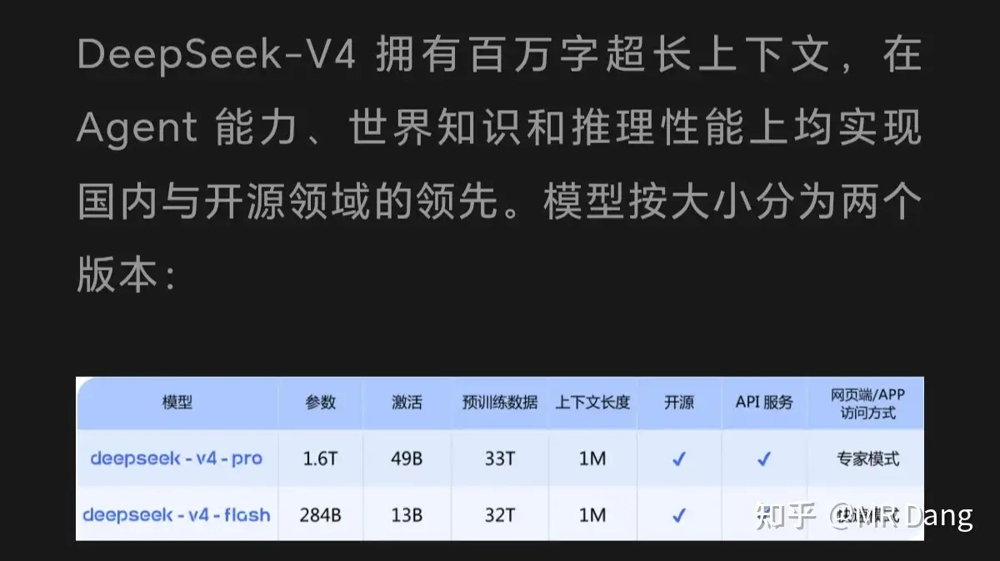

版本上分为两个，上下文都支持1M，相当于百万汉字的长度。

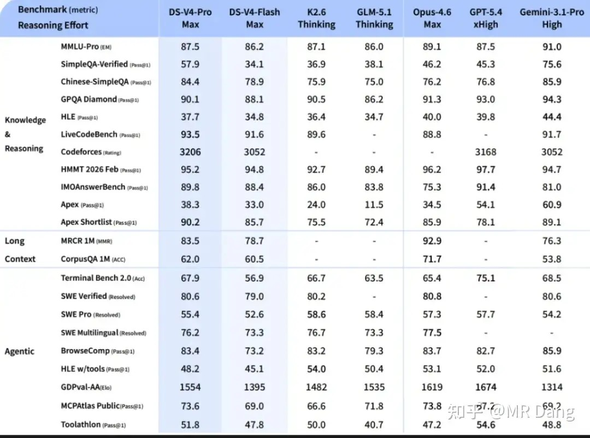

性能上距离opus 4.6还有差距，属于第一梯队，但不是最顶尖的。

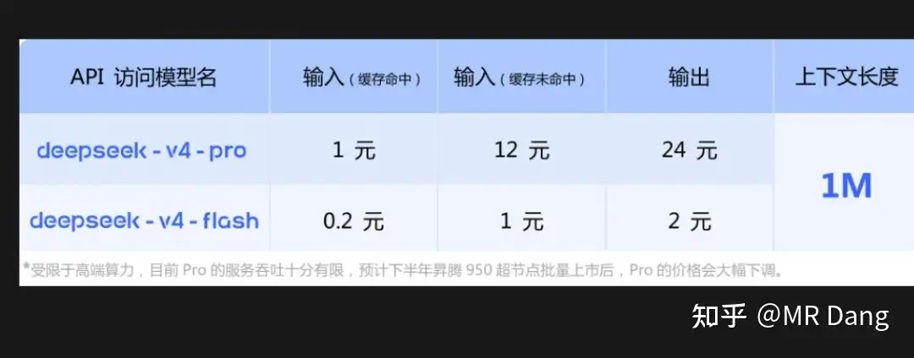

价格上性价比很高，flash版本大概是国外同等价格的3％左右，pro版随着昇腾950的铺开，价格会大幅度降低。

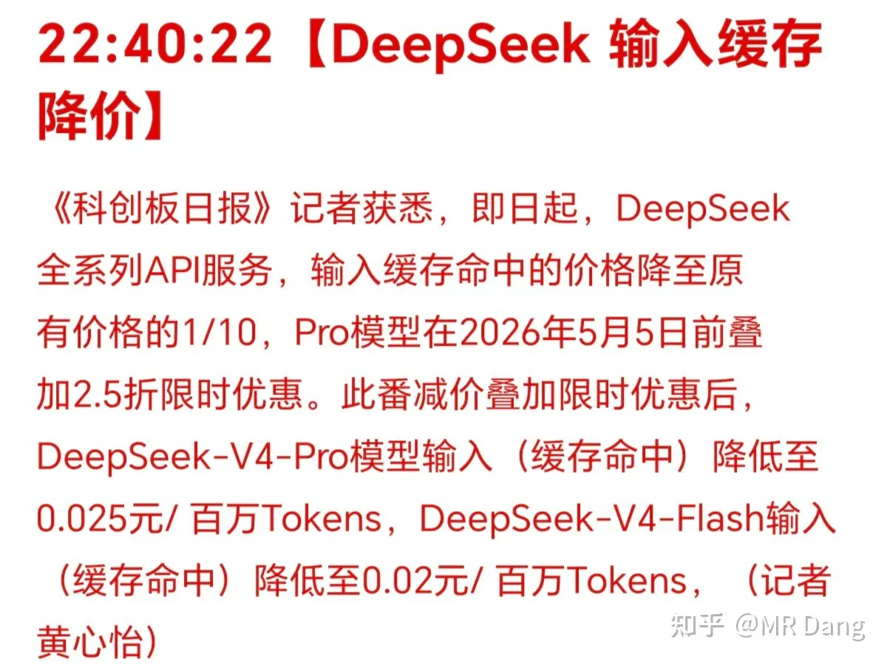

昨天在上面本来就很便宜的基础上，价格又狠狠地再砍了一刀。

伊朗局势：懂王称取消谈判

本来是打算派女婿去的，后来又取消了。

懂王直接宣布胜利：

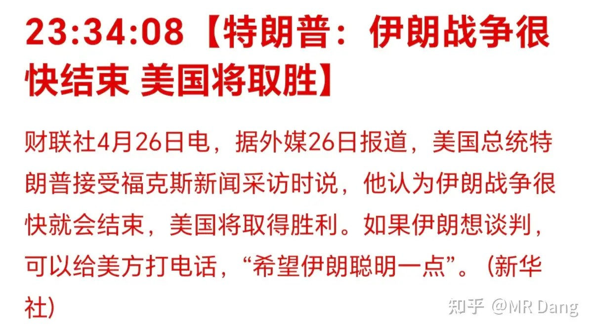

白房子传出鞭炮声：

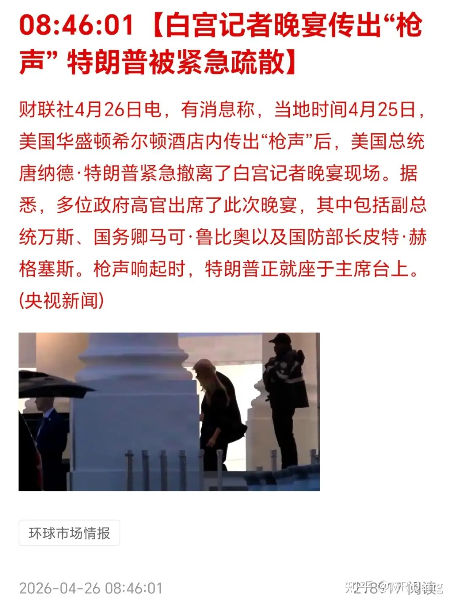

刺客特写：

这次发生的地方距离懂王多少还有点距离，危险性比之前打耳朵小多了。

有意思的是安保人员先把万斯给保护起来带走了，万斯走的很果断，懂王腿脚不便暂时留在了现场，后面才被护送出去，这一行为遭到了媒体大量的转发，引发了激烈的讨论。

套套涨价：

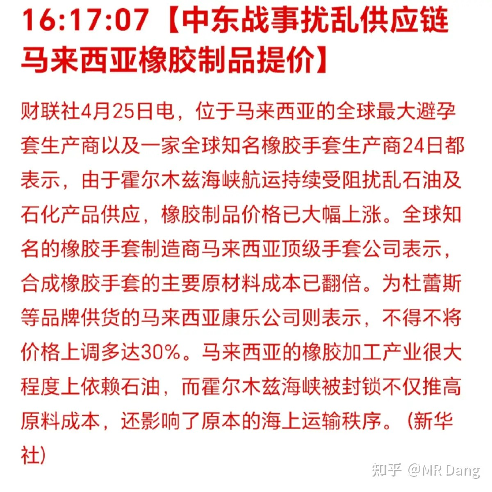

其实是马来的橡胶制品开始涨价，其中当然也包括套套。

额。。。有需求的可以囤一点。。。

交易规则变化：

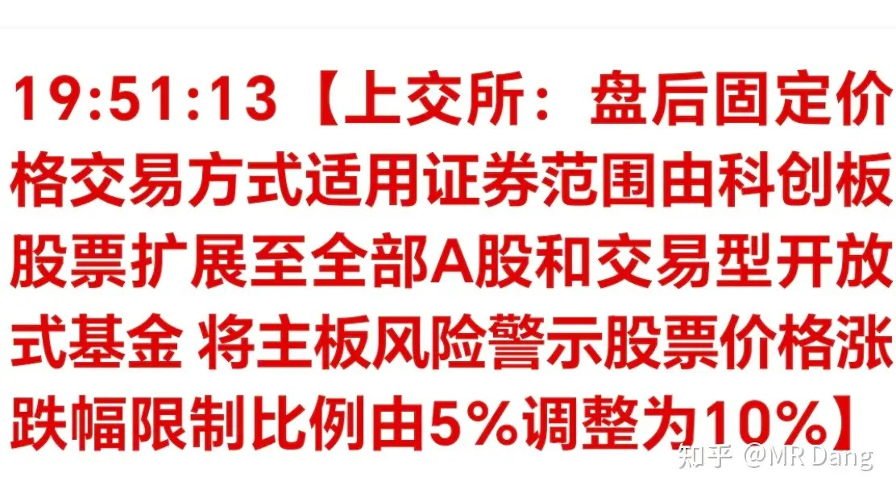

这个以前提过，盘后固定交易时间增加了半小时，st股票由5％调整为10％。

7月6日正式执行。

保险业：预定利率研究值环比上调4BP

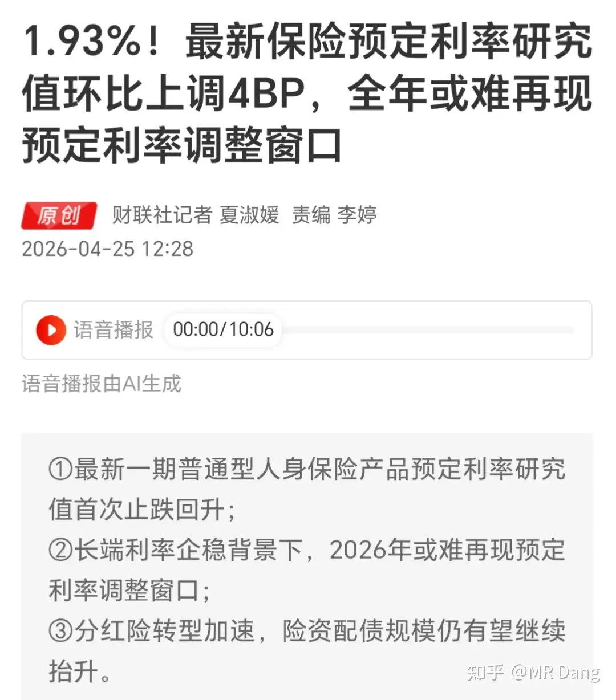

这个和其他行业关系不大，主要是对保险公司有影响，之前有些保险炒停售，就是有预定研究利率研究值下行的话术。

也有好的方面，产品会保持一定的吸引力，可能会增加保费收入。

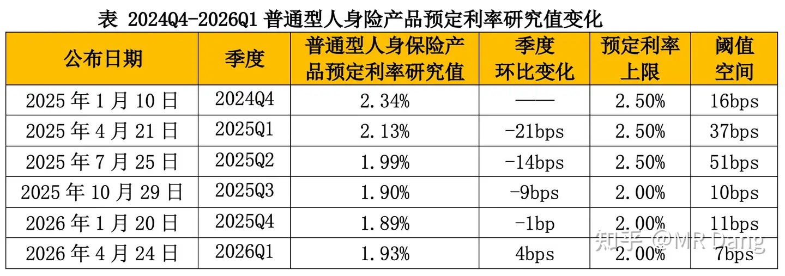

表里是最近两年的变动情况，从数据来看可能今年一季度投险的比较吃亏。

超聚变ipo：

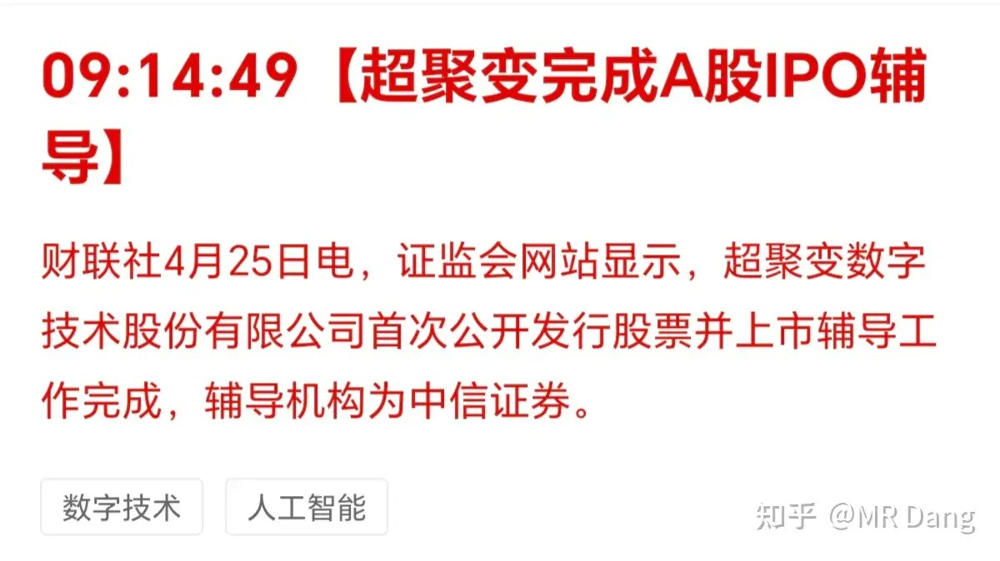

这是家明星企业，本身之前是菊花厂的x86服务器部门，现在主营是算力。

所以，背景，业务方面都是硬的不能再硬的那种，估值最起码都是千亿打底，是非常纯正且稀缺的算力股。

如果上市以后在两千亿估值以内，我个人会非常认真的考虑是否配置。

周末权威部门发布了关于加强新就业群体服务管理的意见，着重提到了互联网平台企业和快递企业。对相关行业的从业人员是大利好，福利待遇会更好，权益保障也更多。

相关企业的成本支出这块儿可能会有变化。

某高科技企业发布了一季报：

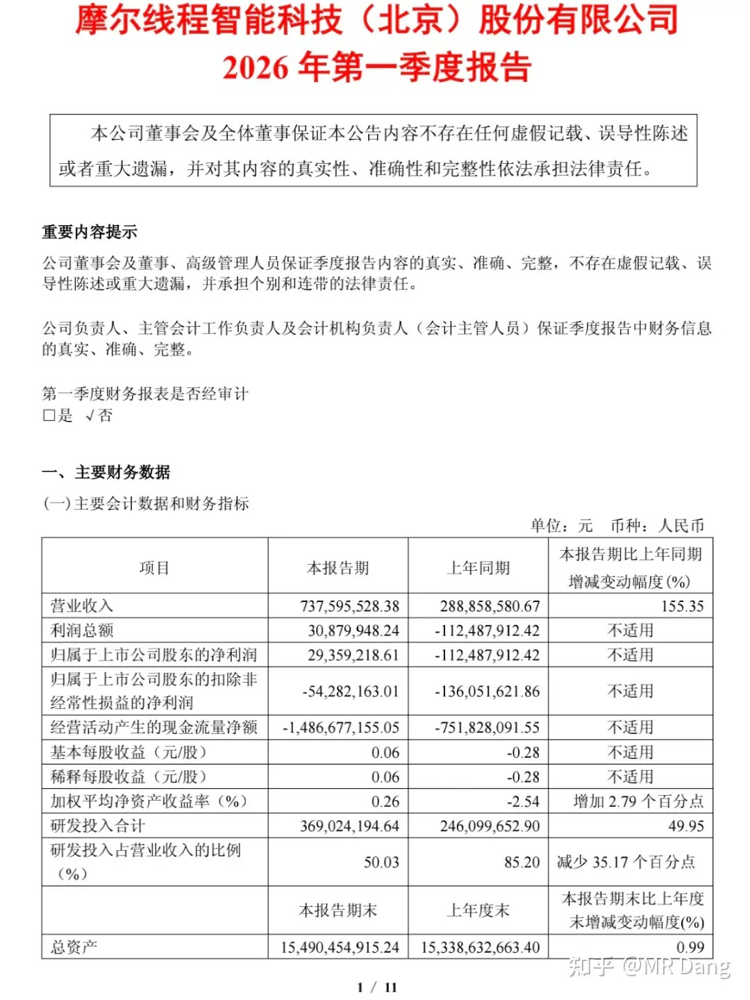

按照传统的估值理论，是解释不了现在的估值水平的，需要发展新的理论去完善这一领域。

某铝企发布了一季报：

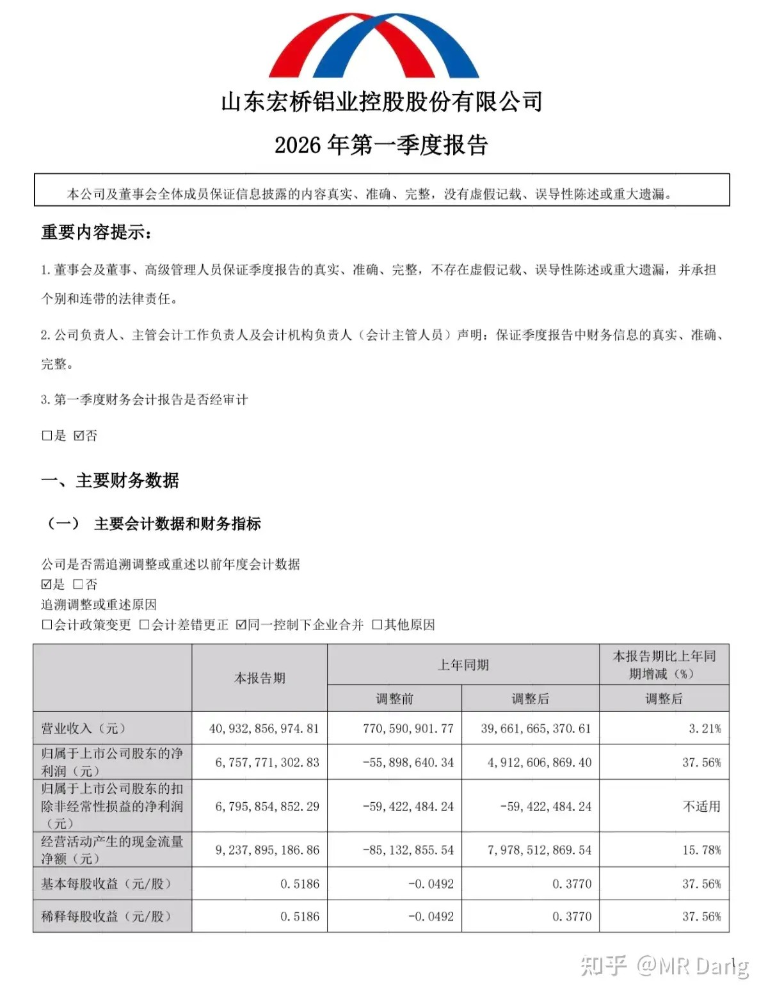

这个实话实说比我预期的少了10％左右，之前想着一季度可能会比去年增长50％左右，大概有个七八十亿，现在一季报是67.5亿。

原因的话，一个是氧化铝售价降低，拖累向外出售的那部分的业绩，另一个就是本身库存的氧化铝计提了三个亿的资产减值损失。

至于套保的话，不是主要矛盾，几百亿的生意，套保亏个几千万无伤大雅。

另外还有可能包括部分原料价格上涨的原因，但是没出详细的财报，所以看不太清。

投资要讲事实求是，数据和测算的对不上就是对不上，要及时找到原因，然后修正数据，争取下次算的更准一些。

从技术角度上来看一季报让人有点束手无策的点就在于没有披露两个最重要的数据——氧化铝和电解铝的销量。

因为产能肯定是要拉满的，如果一季报披露了销量，那就能知道一季度这个营收增长的问题到底是售价不及预期还是所谓的淡旺季问题或者是氧化铝的问题，而不是对着数字苦思冥想。

售价不及预期的话，那说明管理出问题了。

氧化铝是肯定有影响的，就看影响的比例了。

淡旺季的话，那就一切正常，静待花开。

也有可能是这三者叠加，但是没出具体数据，目前量化不了。

二级市场波动很难把握，涨跌更难以预测。

但是基本面是可以追踪并测算的，算的不准就是菜，没什么好辩解的。

我一直讲只应对，不预测，那这种情况下我的应对方案就是把它当做一支第一次看到的标的去重新判断。

目前的行业情况是供给端刚性，需求端看经济发展水平，所以铝价和GDP是强相关的关系。

企业情况是13PE，目前预期大概5%到6%股息。

我个人可以接受这个估值。

但有些投资者觉得这是周期行业，以后要走下坡路，或者现在是周期顶部怎么样的。

那就按照自己判断来，知行合一是最重要的投资品质。

部分其他企业业绩情况：

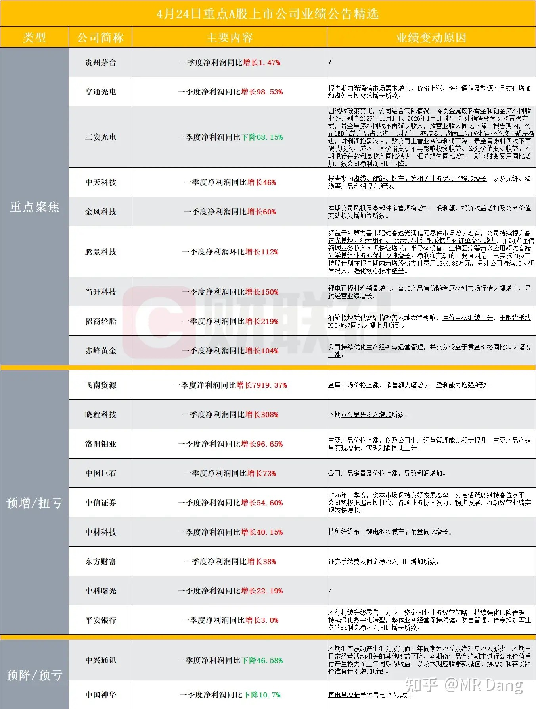

表格里有几个明星企业，比如茅子一季度又重回增长，砍了很多经销商，直营比例上升，一些权力寻租的空间就小了。

两家券商业绩也行，这个板块真的是绝了，以前的共识是有牛市就赶紧在券商里埋伏，弹性大。现在好了，券商里全是伏兵，业绩是真的好，但是表现就很一般。

某煤炭龙头净利润连续降低，这是第四个年头了，但是二级市场表现非常强，股价一直在涨，目前市盈率创几年新高。

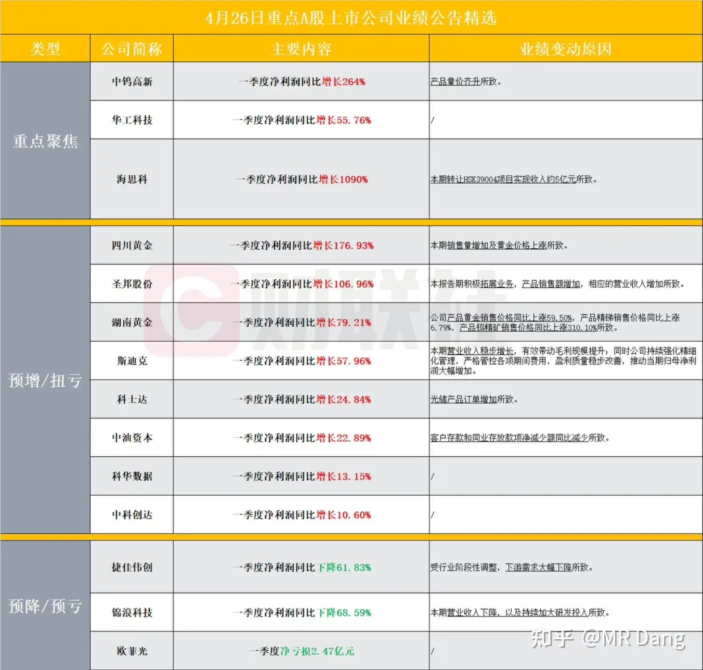

周末又有几家企业发布了业绩预告，有两家黄金企业的业绩非常有意思，按照一季报算下来，刚好都差不多是19pe估值，看来市场对有色的定价还是挺准的。

大宗商品：

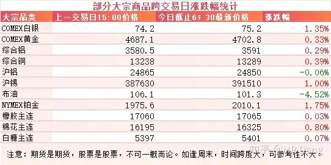

原油在交易日后回调，其他基本处于正常波动范围内，有色涨幅不大。

布油下跌是换合约引起的，同合约目前上涨2%。

农产品表现较好。

外围市场：

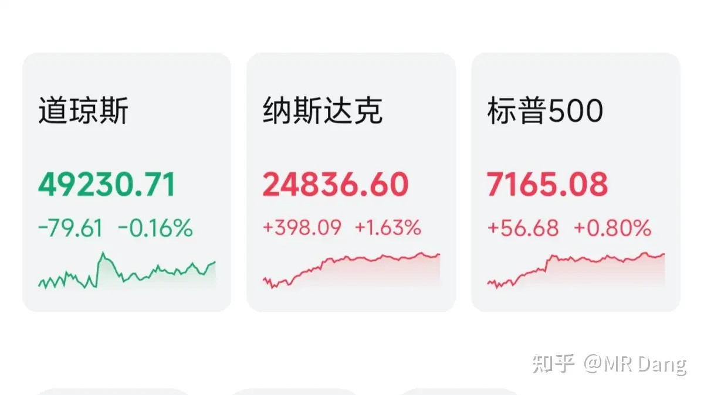

美上周五三大股指涨跌不一，纳指走强，科技股领涨，闪迪，美光，英伟达，英特尔，AMD等创新高。

上个交易日个人组合净值微红，银行绿小半个，资源红一个半，消费红一个半，电网绿一个半，虽然没赚到什么钱，不过能跑赢指数也不错了。

最近科技股的声浪很大，美股科技股走的很强，这让很多本来不关心科技股的投资者也蠢蠢欲动。

我个人觉得现在部分标的估值确实太高了，我是接受不了的，所以这种机会就主动放弃了，把高估值的科技标的让给更需要的投资者，君子不夺人所爱。

一个喜欢保护韭菜的博主，希望大家少少踩坑，多多赚钱！！！

> [!comment]- 点击展开评论
>
> | 用户 | 时间 | 内容 |
> | :--- | :--- | :--- |
> | 钱包鼓鼓 |  | 每日打卡第42天DeepseekV4全面适配昇腾950实现全国产化，价格仅为国外同类3%，算力成本持续下降利好昇腾产业链。马来西亚橡胶制品涨价，保险业预定利率研究值上调4BP，摩尔估值太高看不懂。ST涨跌幅7月6日起从5%改为10%，盘后交易增加半小时，短线波动加大注意风险。超聚变（原华为x86服务器部门）即将IPO，主营算力，2000亿以内估值会认真考虑配置。红桥一季报67.5亿低于预期10%，13PE加5-6%股息仍可接受，但需等详细数据再判断。高估值科技主动放弃，美股科技虽强但部分标的估值已过高，守住能力圈不追。 |
> | &nbsp;&nbsp;&nbsp;&nbsp;一白先生 |  | 哈哈细节“红”桥 |
> | &nbsp;&nbsp;&nbsp;&nbsp;上善若水行远自弥 |  | 你的红桥快跌停了 |
> | 风轩云冕 |  | 绿桥竞价跌停，汪的一声哭出来 |
> | 大牛猫 |  | 买了同板块最烂的绿桥 |
> | 大苏 |  | 看着宏桥难受。逻辑硬不硬不等于预期好，只看逻辑不看技术面，感觉就是一厢情愿。 |
> | 天天向上 |  | 绿桥愿赌服输，财报不及预期就不持有了，换板块其它的吧 |
> | cyclechan |  | 有券商分析，氧化铝亏了4个亿，加上减值，就符合之前的预期了。宏A比宏H的氧化铝成本高，因为铝土矿和电力都在宏H里 |
> | 巴西总督 |  | 哟嚯，绿桥跌停 |
> | &nbsp;&nbsp;&nbsp;&nbsp;冰冰 |  | 我去，别吓我！ |
> | 机械之道 |  | 尾盘再关注一下，如果绿桥继续向下突破，那就再补一车然后躺平等死了。有色在4100点居然跌到能把仓位快打满真的太夸张了。 |
> | &nbsp;&nbsp;&nbsp;&nbsp;solo |  | 有色五六月份估计够呛 |
> | &nbsp;&nbsp;&nbsp;&nbsp;蓝护 |  | 五一之前无论涨跌都要跑吗 |
> | &nbsp;&nbsp;&nbsp;&nbsp;zq2412 |  | 半仓有色，最近体验太差了 |
> | &nbsp;&nbsp;&nbsp;&nbsp;爱后余生 |  | 没必要全跑，反弹得减仓。 |
> | 如来熊掌 |  | ，今天稳住心态，静待花开。 |
> | 从伊而终 |  | 不是吧，我出了趟差回来，红桥能绿成这样 |

---

*本文件从MR Dang知乎页面转载*

---

**作者**: MR Dang
**链接**: https://www.zhihu.com/question/2029968580050145864/answer/2031997936813466971
**来源**: 知乎

*著作权归作者所有。商业转载请联系作者获得授权，非商业转载请注明出处。*

## 相关阅读

**每日行情评价系列：**
- [[20260424-如何评价2026年4月24日A股行情？|4月24日行情]] - 普华永道赔偿、审计制度和一季报密集披露。
- [[20260423-对于2026年4月23日A股市场行情，大家有什么预测和看法？|4月23日行情]] - 碳达峰、算力能效和工业耦合方向的政策线索。
- [[20260422-对于2026年4月22日A股市场行情，大家有什么预测和看法？|4月22日行情]] - 利率表态、通胀框架和市场敏感点的拆解。
- [[20260421-如何评价2026年4月21日A股行情？|4月21日行情]] - 厄尔尼诺、用电数据与一季报波动。
- [[20260420-这么看待4月20日的A股行情？|4月20日行情]] - 周末局势过山车、机器人半马与 Deepseek 融资。
- [[20260417-如何评价2026年4月17日A股行情？|4月17日行情]] - GDP、地产止跌与伊朗谈判拉扯。
- [[20260416-如何评价2026年4月16日A股行情？|4月16日行情]] - 反内卷政策、商业航天与宁王财报。

**AI、算力与市场规则：**
- [[20260409-如何看待 2026 年 4月 9日 A 股市场行情？|4月9日行情]] - AI视频模型、热点扩散和市场情绪的早期线索。
- [[20260423-对于2026年4月23日A股市场行情，大家有什么预测和看法？|算力能效]] - 单位算力能效、液冷材料和绿电直连方向可以对照阅读。
- [[20251024-怎么全面的分析一支股票？|系统分析框架]] - 把行业、公司、财报和市场位置放在一起看。
- [[20251026-如何对企业进行估值？|估值入门]] - 主题再热，最终也要回到价格和预期。

**财报与资源股：**
- [[20260422-紫金矿业一季报实现净利润 200.79 亿元，同比大幅增长 97.50%，如何解读「矿茅」的Q1财报|紫金财报]] - 资源股的利润、现金流和边际变量拆解。
- [[20260404-如何分步骤快速看懂上市公司年报？|看懂年报]] - 快速抓住财报重点，适合一季报密集期复用。
- [[20251009-如何看待2025年10月9日a股有色板块暴动？是否还有低估值的投资机会？|有色板块暴动]] - 对照有色板块的行情扩散与估值切换。
