# 如何评价2026年4月28日A股行情？

---

**发布时间**: 2026-04-28 07:20  |  **原文链接**: https://www.zhihu.com/question/2032029458316702766/answer/2032358527969276085  |  **点赞数**: 514 人赞同

**作者信息**: MR Dang​​​知势榜经济与管理领域影响力榜答主

---

## 正文内容

国家统计局公布了前三个月的工业增加值：

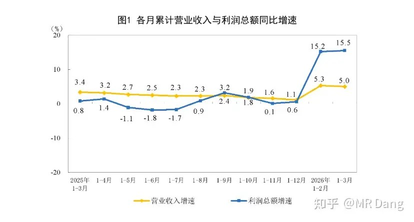

仅看数据十分亮眼。

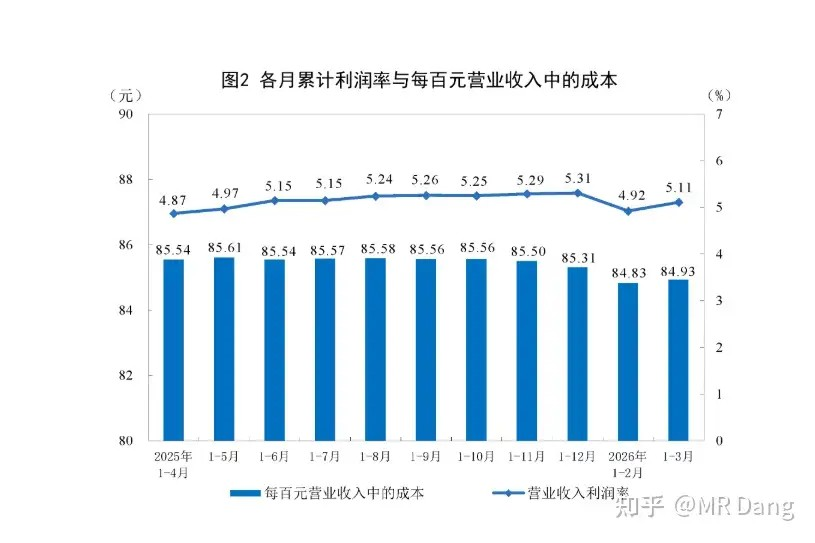

营收利润率也在提高。

分行业看的话：

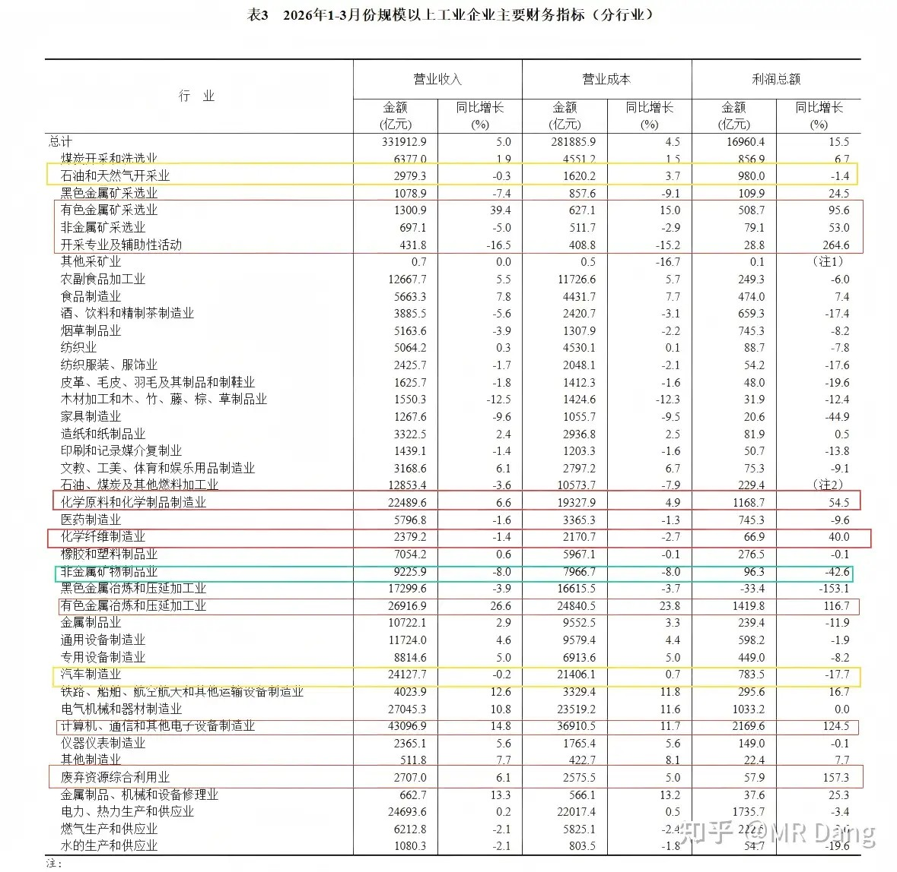

多个行业有比较高的增速 ，我把50%以上增速的行业圈起来了，用的是红色圈。

主要是有色，电子设备制造，废弃资源综合利用等行业。

这些行业业绩都已经发布，整体不错，目前资本市场已经PRICE IN，博弈的是预期了。

还有黄色圈起来的行业，是前三个月数据明显好于前两个月数据的行业，也就是环比改善，他们是石油开采和汽车制造。

还有一个化学纤维制造业，这个行业前两个月是负的2.2，然后前三个月就变成同比增加40%了，说明三月份赚了很多。

根据国家统计局《国民经济行业分类》（GB/T4754-2017），化学纤维制造业分为三个中类，10个小类。

三个中类分别为：纤维素纤维原料及纤维制造，合成纤维制造以及生物基材料制造。

这其中规模最大的合成纤维制造，共有6个小类，分别是聚酰胺，聚酯，聚丙烯腈，聚乙烯醇，聚丙烯，聚氨酯。

以前在说化纤行业时提到的POY，DTY，FDY之类的，就属于聚酯类。

穆迪上调对东大的评级，获得有关部门点赞：

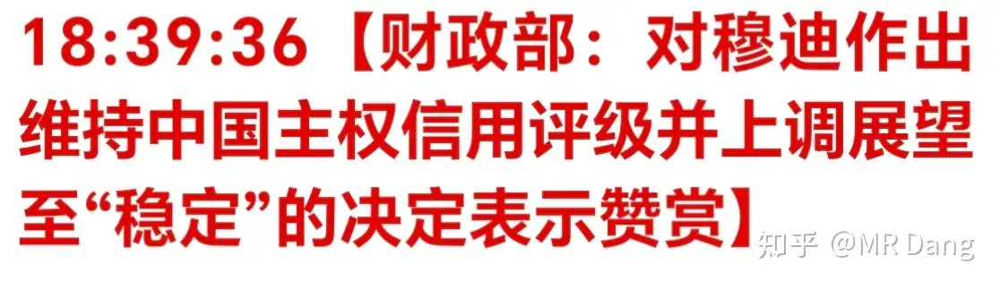

评级的相关知识可以普及下，评级分为两部分，一部分是当前评级，另一部分是未来展望。

就像股价一样，一部分是当前价格，另一部分是预测未来走势。

穆迪这次是提高了东大的展望，相当于提高了对未来的预期。

那为什么我们会回应一个公司的评级呢？

因为这家公司很刚，影响很大。身在西大境内，给西大从最高级下调了评级，最后很多员工都被裁了。

上调评级会有利于发行债券，降低融资利率，是利好。

某小金属企业发布了2026一季报：

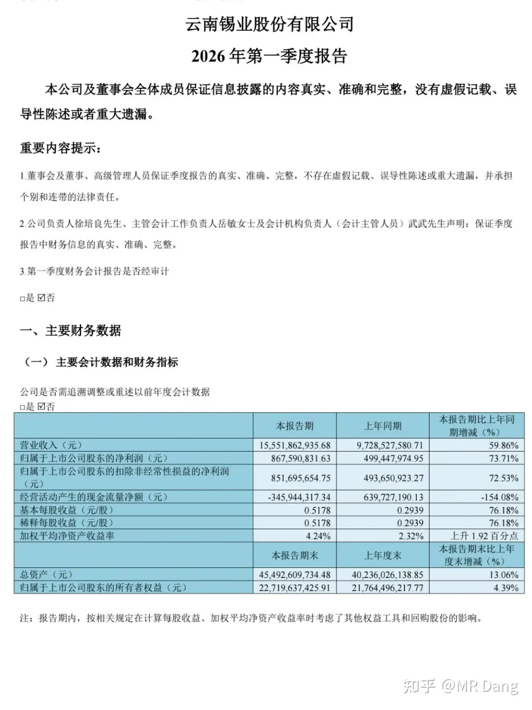

营收增长60％，归母净利润8.5亿，同比增长74％。

消失的净利润终于又冒出来了，讲道理，符合预期。。。

但代价是什么呢？

嗯。。。大股东减持1.4％。。。。

主要是公开平台需要注意文明用语，不然我在这里一般是有评价的。

某生活纸企业：

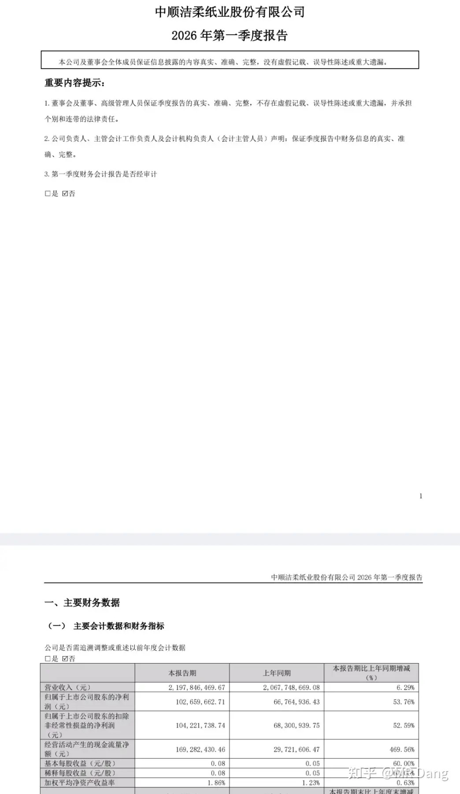

纸企现在是弱复苏，之前年报已经有迹象，一季报进一步确认，业绩不错。

某储能龙头：

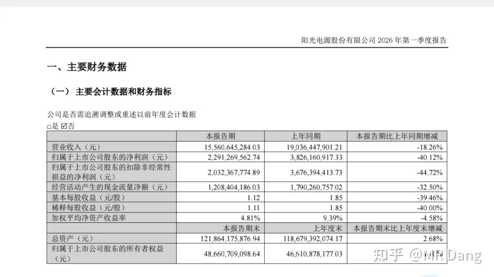

上次年报炸了一回了，一季报再来一回，看看市场会不会选择继续原谅了。

无人问津的角落，某蓝色酒企发布了财报：

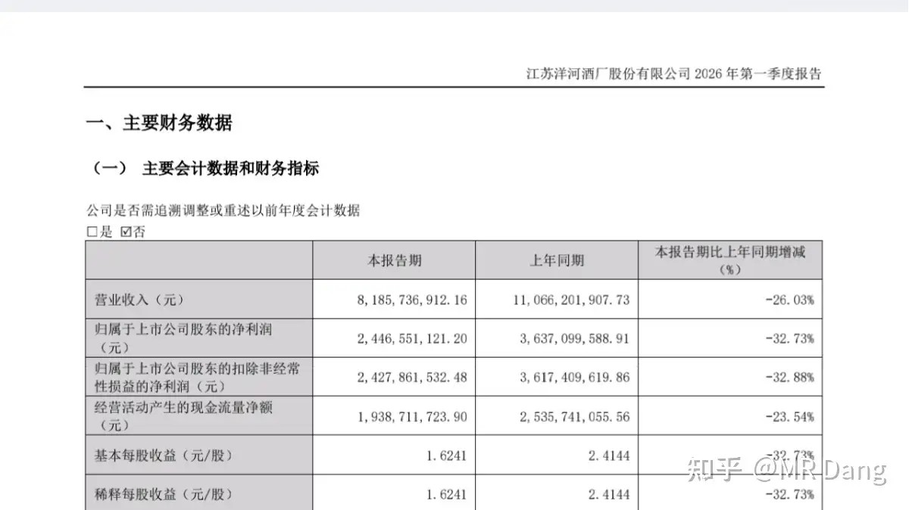

时代的眼泪，中端酒企现在太煎熬了，地狱模式。

其他发布业绩的企业统计：

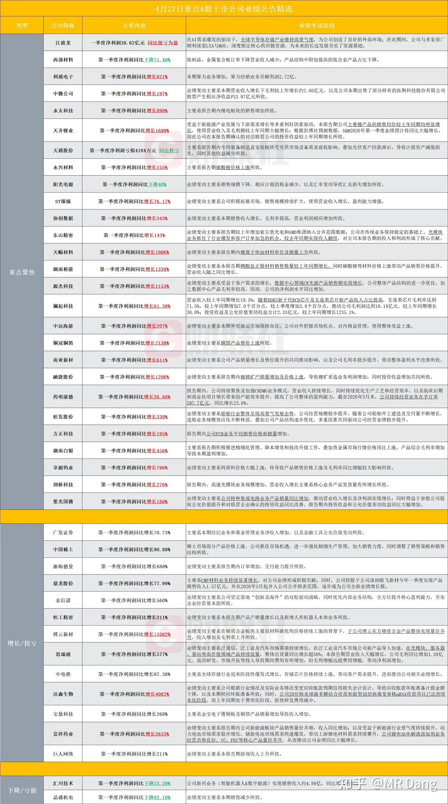

密密麻麻很多家企业，总体来看，锂电业绩很好，然后某个明星创新药企业绩不错，券商业绩也挺好。

高科技企业当然业绩也不错，但是估值贵，我个人不喜欢估值贵的东西，这不是公司的问题，是我的问题。

大宗商品：

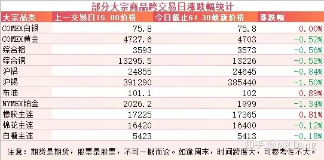

外围市场：

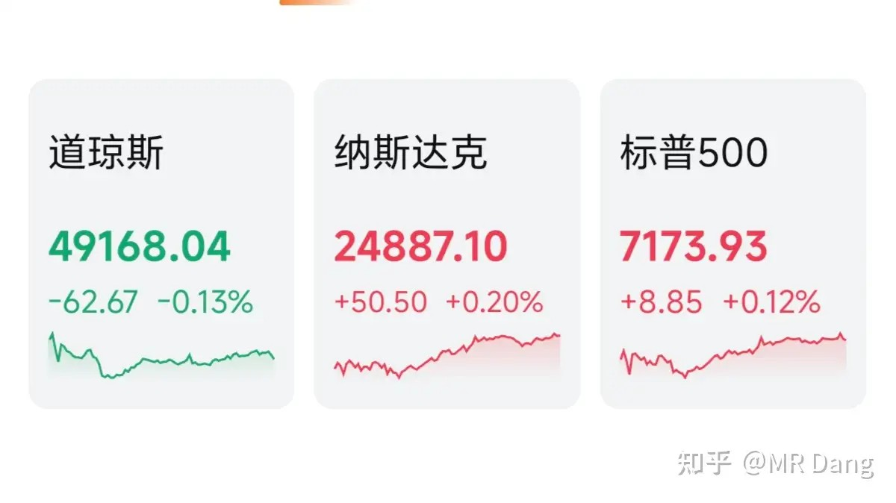

美三大股指涨跌不一，纳指领涨。存储板块走强，闪迪美光再创新高。

昨天个人组合净值回撤一个多点，一碗宽面塞嘴里，不吃都不行。银行绿一个多，资源绿三个，消费红一个半，电网绿半个。要不是前期回调的消费稍有好转，回撤的还要多。

盘后被硬控了5分钟没缓过来，直到点开心爱的app。

怎么说呢，很多人觉得职业投资者可能适应了波动，早就习惯了，面对市场会古井无波，淡然处之。

但实际上，再专业的投资者，首先是个人，人就会有情绪，该难受也会难受，该沮丧也会沮丧，该得意也会得意。

但是职业投资者哪方面会比普通投资者好一些呢，我觉得有两点。

第一点是不会因为情绪影响操作。

我之前复盘过因为冲动做的决策，比如看见涨的好就买进去，或者因为心烦意乱就一键清仓。

后视镜来看，基本上8成以上都是错误的。

投资不能上头，一上头操作就下头。

这一点我的应对办法就是转移注意力，玩游戏，刷视频，不要把自己长时间的陷入负面情绪，过一段时间格式化一下自己的心境，保持良好的睡眠质量，不内耗自己。

第二点是不会因为情绪影响生活。

职业投资的压力实在太大了，全家的经济来源系于一人之肩。稍有不慎，资本市场受了委屈就容易把情绪传染给家里人，所以就需要克制情绪波动，避免把家庭氛围搞的太紧张。

这一点我的应对办法就是严格区分工作和生活，不与家里人讨论任何和资本市场相关的事情，也不许他们询问。

工作是工作，生活是生活。

就算在资本市场被打的鼻青脸肿，转过身来依然是:“今天学校里发生了什么有趣的事情说来听听？”

人成长的过程就是控制情绪的过程，小孩的情绪比较强烈，中老年人情绪就比较平和，这中间的过程就是成长。

投资者也是一样的，新手投资者只有在认知和心态两方面都取得进步，才能进阶到职业投资的领域，这中间控制情绪就是必修课。

一个喜欢保护韭菜的博主，希望大家少少踩坑，多多赚钱！！！

> [!comment]- 点击展开评论
>
> | 用户 | 时间 | 内容 |
> | :--- | :--- | :--- |
> | 钱包鼓鼓 | 12 小时前 | 每日打卡第43天前三月工业增加值亮眼，有色和化纤增速超50%，但市场价格已经反应了，现在博弈的是预期而非现实。穆迪上调中国评级展望，利好发债和融资成本，短期情绪面偏多。锡业 业绩爆发但大股东减持1.4%，洁柔纸弱复苏一季报进一步确认，业绩不错。储能龙头 阳光 连续两季炸雷，洋河等中端白酒仍在地狱模式。锂电和创新药业绩不错，高科技股业绩好但估值贵别追。不要让情绪影响操作和影响生活。仓位决定心态，心态决定收益。 |
> | &nbsp;&nbsp;&nbsp;&nbsp;广智救我 | 9 小时前 | 最后一条要铭记于心，如果仓位可以影响到心情了，那就减仓 |
> | 烛龙 | 11 小时前 | NSLY季报不讲一下？ |
> | 宝木书 | 11 小时前 | 主要是公开平台需要注意文明用语，不然我在这里一般是有评价的。就是就是 |
> | 干饭闪电狼 | 11 小时前 | 看了南铝的突然觉得宏桥也不是多差劲 |
> | 今夜无眠 | 12 小时前 | 人成长的过程就是控制情绪的过程，小孩的情绪比较强烈，中老年人情绪就比较平和，这中间的过程就是成长。 |
> | 跑调却靠谱 | 11 小时前 | 南山吕后续行情如何 |
> | 林乔 | 10 小时前 | 南山铝业为何今日大跌 |
> | 厉飞雨 | 11 小时前 | 老师，你给我们打完气后，我也给你打打气。跟着老师学了这么久，明白了投资不是一个跟市场比的过程，是跟自己比的过程。不脑子一热就梭哈，也不因为错过机会就后悔，市场总有更多的机会。心态也不会因为几天或者几个标的波动而影响生活了。最近因为在忙着辞职和项目收尾的事情，老师发的好多功法我都只能点个赞，还没学习。 |
> | &nbsp;&nbsp;&nbsp;&nbsp;MR Dang | 11 小时前 | 下家找好了吗 |
> | &nbsp;&nbsp;&nbsp;&nbsp;厉飞雨 | 10 小时前 | 已经找好了，可以中间休息下来补补之前的课了。 |
> | 渡劫失败了 | 9 小时前 | 锡这个减持是不是意味着8月22减持结束以前都没什么希望了？ |
> | &nbsp;&nbsp;&nbsp;&nbsp;园小小 | 7 小时前 | 30左右可以逐步建仓，25可以打满 |
> | &nbsp;&nbsp;&nbsp;&nbsp;漫漫 | 8 小时前 | 应该不是，应该会有拉升 |
> | 愚人杰AI生活 | 12 小时前 | 钱是钱，我是我，尽量不让亏了的钱再带走快乐的我，虽然昨天没亏 |
> | &nbsp;&nbsp;&nbsp;&nbsp;掘金工作者 | 12 小时前 | 早晨，乡党 |

---

*本文件从MR Dang知乎页面转载*

---

**作者**: MR Dang
**链接**: https://www.zhihu.com/question/2032029458316702766/answer/2032358527969276085
**来源**: 知乎

*著作权归作者所有。商业转载请联系作者获得授权，非商业转载请注明出处。*

## 相关阅读

**每日行情评价系列：**
- [[20260427-如何评价2026年4月27日A股行情？|4月27日行情]] - DeepseekV4、昇腾适配、交易规则变化和有色波动。
- [[20260424-如何评价2026年4月24日A股行情？|4月24日行情]] - 审计赔偿、铝企一季报和财报风险控制。
- [[20260423-对于2026年4月23日A股市场行情，大家有什么预测和看法？|4月23日行情]] - 碳达峰、算力能效和工业耦合方向的政策线索。
- [[20260422-对于2026年4月22日A股市场行情，大家有什么预测和看法？|4月22日行情]] - 利率表态、通胀框架和市场敏感点的拆解。
- [[20260421-如何评价2026年4月21日A股行情？|4月21日行情]] - 厄尔尼诺、用电数据与一季报波动。
- [[20260420-这么看待4月20日的A股行情？|4月20日行情]] - 周末局势过山车、机器人半马与 Deepseek 融资。
- [[20260417-如何评价2026年4月17日A股行情？|4月17日行情]] - GDP、地产止跌与伊朗谈判拉扯。

**工业数据与产业线索：**
- [[20260422-紫金矿业一季报实现净利润 200.79 亿元，同比大幅增长 97.50%，如何解读「矿茅」的Q1财报|紫金财报]] - 对照有色行业的业绩兑现、现金流和边际变量。
- [[20251009-如何看待2025年10月9日a股有色板块暴动？是否还有低估值的投资机会？|有色板块暴动]] - 从板块层面理解有色行情和估值切换。
- [[20260404-如何分步骤快速看懂上市公司年报？|看懂年报]] - 年报和季报的阅读路径与重点抓取。
- [[20260401-读懂财报，看清基本面|读懂财报]] - 用基本面框架理解行业增速、利润率和估值预期。
- [[20260102-如何看待盐湖股份2025年业绩预报？以此为例，我们该如何分析上市公司公告？|公告解读范例]] - 用公告口径练习抓关键数字和风险提示。

**投资心态与风险控制：**
- [[20251029-新手投资者避坑指南之不要赌财报|不要赌财报]] - 业绩披露期尤其适合回看，避免把财报当短线押注。
- [[20251024-怎么全面的分析一支股票？|系统分析框架]] - 把行业、公司、财报和市场位置放在一起看。
- [[20251103-高学历的人炒股，痛苦的根源是什么？|认知误区]] - 情绪影响操作时，先回到决策框架本身。
