# 如何评价2026年4月29日A股行情？

---

**发布时间**: 2026-04-29 07:24  |  **原文链接**: https://www.zhihu.com/question/2032029526776082640/answer/2032721857003132490  |  **点赞数**: 488 人赞同

**作者信息**: MR Dang​​​知势榜经济与管理领域影响力榜答主

---

## 正文内容

头条给到关税:

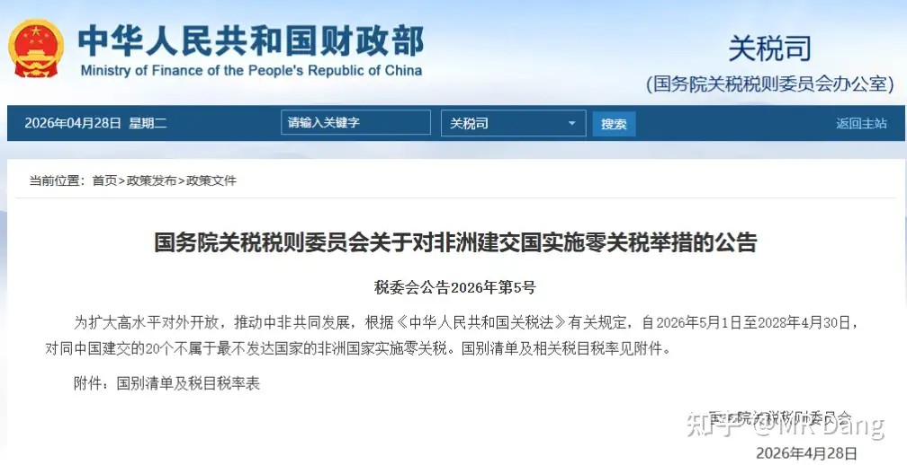

东大对全部53个非洲国家100％零关税。

最直接的利好是从非洲进口原材料多的企业，比如有色矿，农产品，硫磺，木材，纸浆之类的，进口的成本更低了。

比如尼日利亚，安哥拉的进口原油成本降低。

还有刚果金的铜精矿，阴极铜，几内亚的铝土矿，成本都会降下来。

农产品的话，咖啡，芝麻，棉花之类的，也会降低成本。

其次就是利好对非洲出口企业，比如某专注非洲市场的手机企业，比如某些在非洲做工程基建的企业。

有的投资者纳闷了，这不是说的进口么，怎么到博主嘴里成了出口？

其实这里有两层逻辑。

第一层逻辑是国际贸易的潜规则，你对我零关税，那投桃报李我对你也零关税，这很合理吧。

所以是有这方面的预期在里面的，咱们开了这个口子，就会有更多的地区投桃报李，从而利好出口。

第二层逻辑是非洲国家出口零关税后出口更多的商品，兜里有钱了就要消费，就要搞基建，就会增加需求，从而利好出口。

但是，像这种利好对企业来说都是潜在的，长期的，不能指着这消息去投机，会吃亏的。

对商品价格的影响倒是立竿见影，因为眼瞅着成本低了，供应增加了，各类期货都会先跌为敬。

OpenAi回应鬼故事：

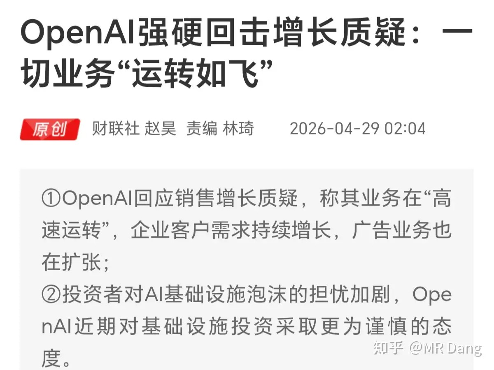

在昨晚美股盘前有消息指出OpenA i增长不及预期，主要是月活用户和营收两方面都拉胯。

现在美股科技股是左脚踩右脚上天的，互相下订单，互相讲故事。

预期打的挺高的，只要有一个环节跟不上，就容易引发连锁反应。

阿联酋退出欧佩克：

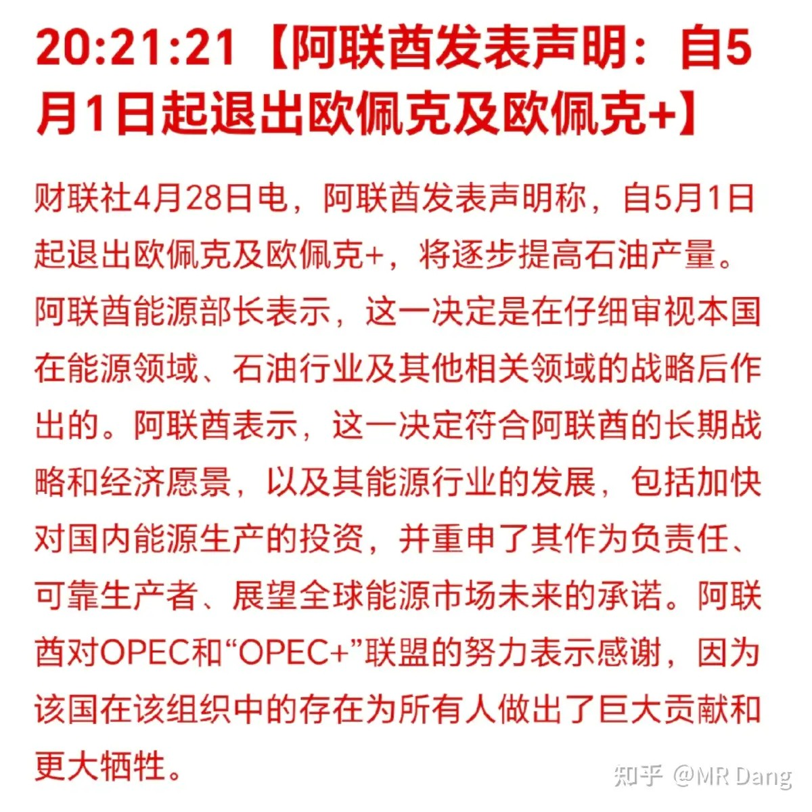

很重要的一个消息，阿联酋是重要产油国，欧佩克属于产油国之间的反内卷，现在看着油价这么高，阿联酋实在是蠢蠢欲动，想大干一场，提高产量。

影响的话，增加原油供应，有利于平抑油价，压低通胀，对投资者来说是好事。

但是远水解不了近渴，目前原油的缺口依然在。

某聚酯纤维企业发布2026一季报：

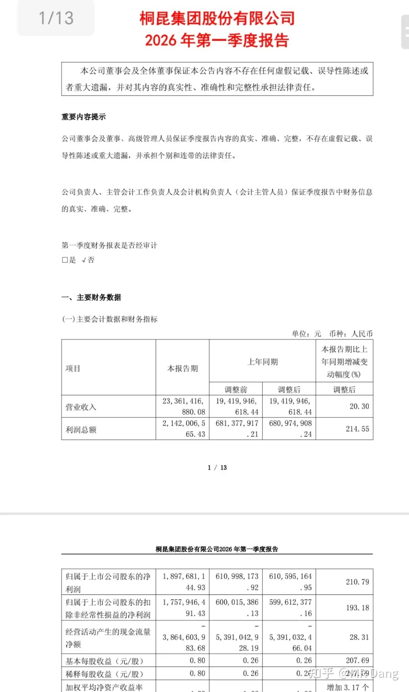

作为非知名书籍《价值投资功法》一书里的案例级企业，这个业绩表现真没让作者丢面啊，与有荣焉。

二级市场表现不好说，业绩好反而下跌的情况数不胜数。

但这个业绩真的没黑点，一个季度干了接近去年一年的利润，如果简单的线性按计算器，目前估值是个位数，7pe不到。

昨天看统计局数字的时候我就敏锐的察觉到了三月份化学纤维制造业的业绩超预期，而这个行业其实没几家企业，所以不难猜到。

A股最好的价投银行发布了一季报：

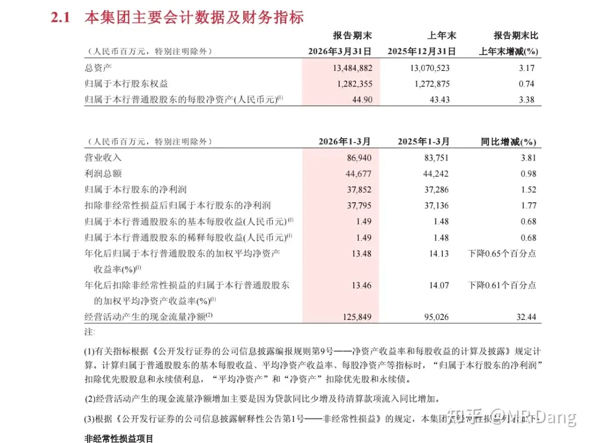

营收增长3.8％，归母净利润增长1.52％。

嗯。。。

嗯。。

不愧是好银行。

当然也不是说就不能挑出刺来，比如拨备又下降了一点点，不良又多了一点点，净利差同环比下降了一点点，净息差也同环比下降了一点点。

但这些不重要，作为A股最优秀的银行，当然是选择原谅她啦。

某飞机租赁公司发布了2026一季报：

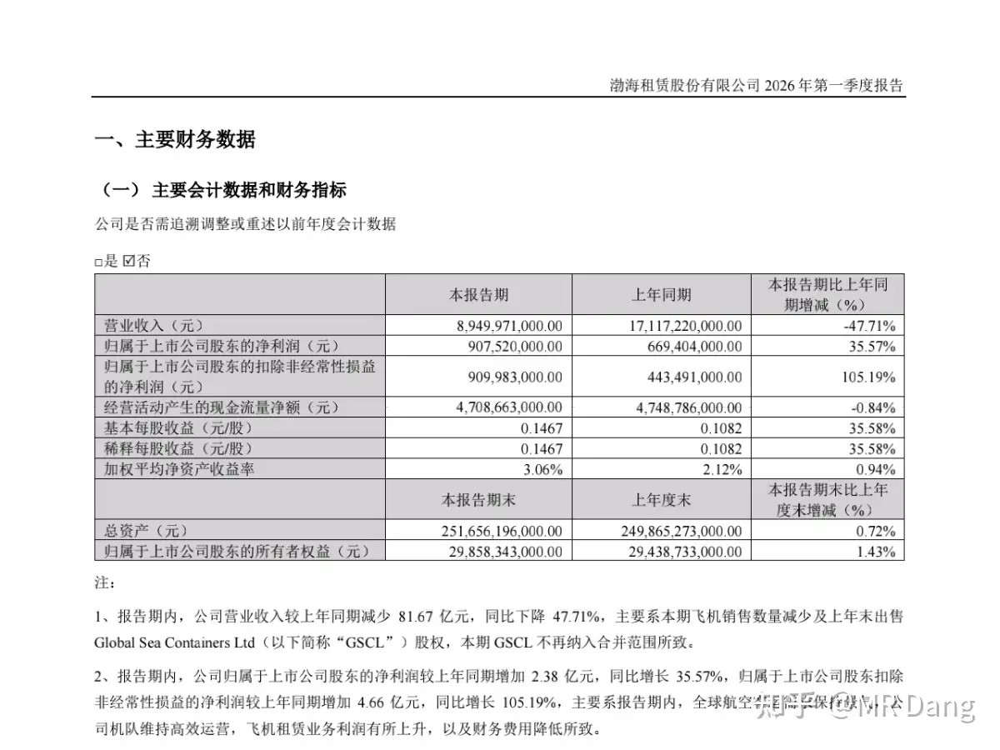

营收降低47％，这是因为把以前的集装箱租赁业务砍了，另外卖的飞机少了。

归母净利润增长35％，扣非增长105％，闪电五连鞭逻辑正在兑现。

更重要的是马上就要从一个铁公鸡变成具有股东回报的公司，这中间是有预期差的。

总体小超预期，不过我个人觉得这家公司最大的看点在半年报，因为去年是半年报拉了坨大的，今年只要正常经营，半年报就会很好看。

某空调企业发布了一季报：

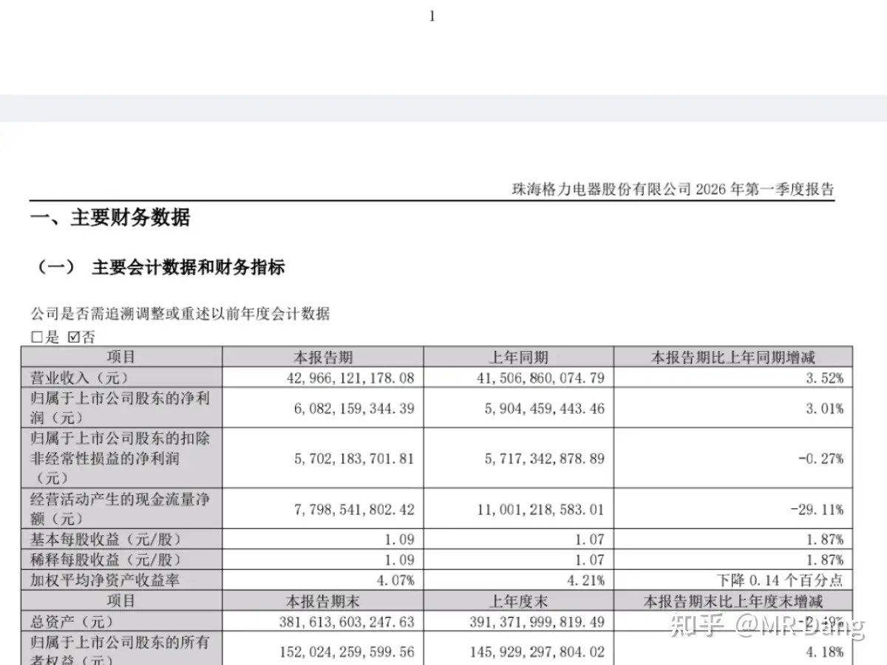

超预期，一季度补贴退补的情况下还能交出这样的答卷不容易，成本端还一直在提升。

作为一个超高股息标的，这样的表现是完全没问题的。

作为对比，同为吃股息的其他白酒类烟蒂股业绩表现就差的多了，没有企稳的态势。酒老二的财报还推迟了，也不知道在盘算什么。

另一家顶级制造业：

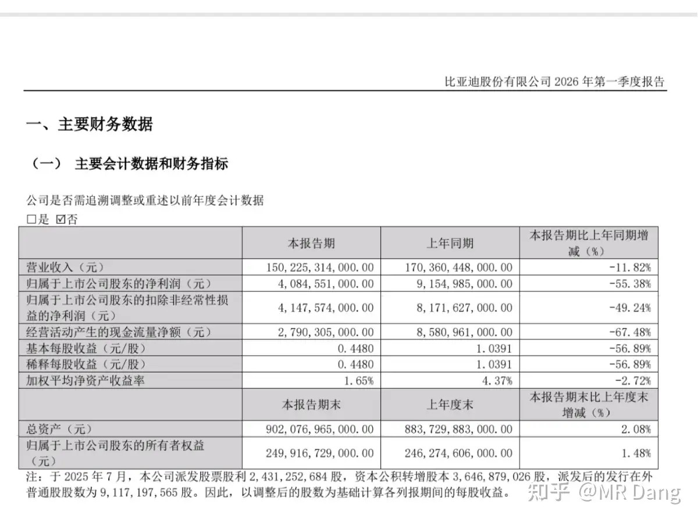

比较让人沮丧的是电车的内卷还没到最惨的时候，价格还在往下走，供应还在增加，需求的话，内需比较萎靡，全靠出口了，只不过这两不是一个数量级的。

我一直在回避这个行业，包括回避恒科也是有这方面的考虑。

某珠宝首饰企业发布了2025年报和2026一季报：

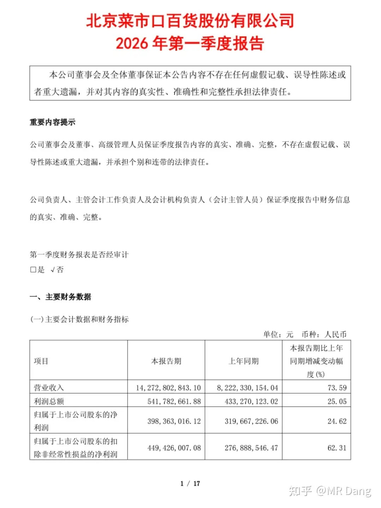

炸裂的年报就不说了，已经提前预告过了。

一季报也相当不俗，营收增长74％，归母净利润增长近25％，行业之光。

就是有一点不好，派息率降低了，每股派息0.78，算下来股息率只有3.3％，预期股息率也就4％左右。

除了派息，其他哪哪都没毛病，不知道资本市场会给出什么样的反应。

大宗商品：

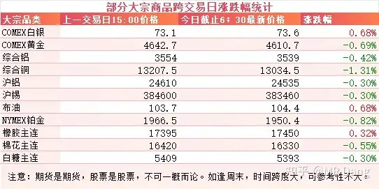

原油在昨日盘后有小幅上涨，有色略微分化，白银稍微强一些，其他走弱，但是幅度都不大。

白银强也不是本身有多强，而是昨天白天跌的稍微多了点，盘后有点反弹。

农产品里橡胶继续走强。

外围市场：

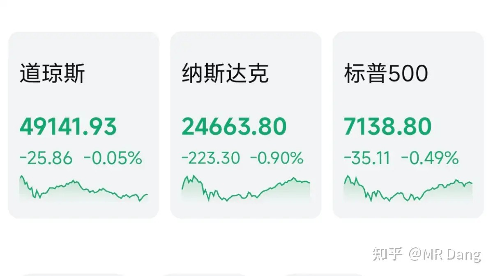

美三大股指回调，纳指领跌，科技股走弱。

美10年期国债收益率走强：

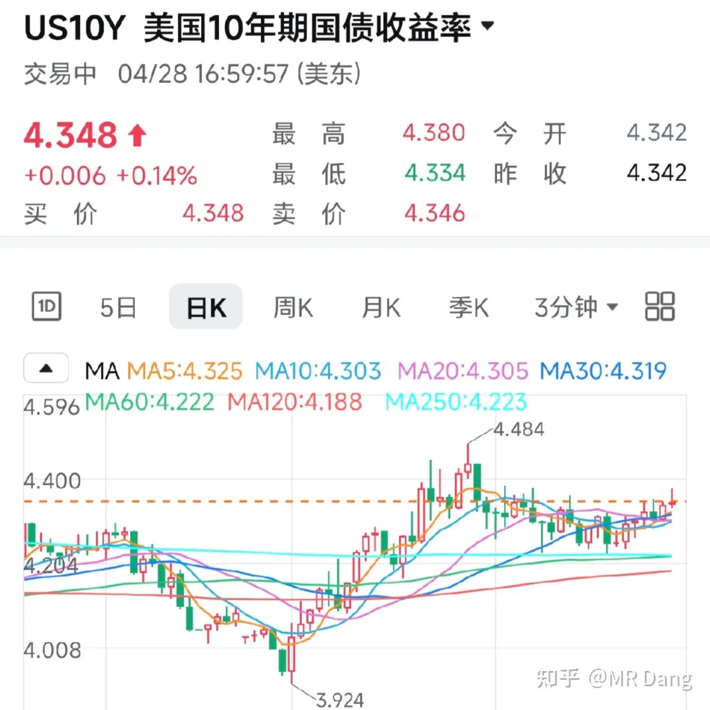

这个数据走强意味着预期通胀压力提高，需要更高的名义回报，4.3是重要关口。

昨天个人净值回血半个点，银行红一个半，资源绿一个半，消费红两个，电网绿一个半，跑赢指数不容易。

今天发布业绩的公司很多，具体到个股上肯定喜忧参半，各有各的情况。

但是总体情绪不佳，有点承压，少亏当赢的一天吧。

一个喜欢保护韭菜的博主，希望大家少少踩坑，多多赚钱！！！

> [!comment]- 点击展开评论
>
> | 用户 | 时间 | 内容 |
> | :--- | :--- | :--- |
> | 钱包鼓鼓 | 16 小时前 | 每日打卡第44天东大对非洲53国零关税，长期利好有色矿和出口企业，但短期别追消息面，期货先跌为敬OpenAI增长不及预期，美股科技股左脚踩右脚的叙事有破裂风险，注意AI链回调阿联酋退出欧佩克，油价压力来了，算短期利好，供应增加，压低通胀聚酯纤维企业桐昆一季报炸裂，一个季度赚接近去年全年利润，估值不到7PE。招商营收增长3.8%，净利润增长1.52%，拨备降了，不良多了，净利差和净息差都在降。渤海小超预期，格力超预期。菜百年报炸裂，一季报营收增长74％，归母净利润增长近25％，但派息率降低了。电车内卷还没到最惨的时候，价格还在降供应还在增，明确回避电车和恒科。 |
> | 我是一颗桃子吖 | 14 小时前 | 虽然感觉我送的这些对d哥没啥卵用，但是表达一下支持 |
> | &nbsp;&nbsp;&nbsp;&nbsp;MR Dang | 14 小时前 | 太有用了，感动哭了 |
> | &nbsp;&nbsp;&nbsp;&nbsp;我是一颗桃子吖 | 14 小时前 | 鹅鹅鹅鹅，鹅叫.jpg |
> | &nbsp;&nbsp;&nbsp;&nbsp;橙橙 | 13 小时前 | 笑死我了 |
> | op666 | 15 小时前 | 大部分铜、铝矿原本就是0关税了，这是个陷阱，大家不要傻乎乎开盘冲进去了 |
> | &nbsp;&nbsp;&nbsp;&nbsp;MR Dang | 15 小时前 | 这不能投机的 |
> | 我是一颗桃子吖 | 14 小时前 | 谢谢d哥，我又吃到了，唉，情场失意赌场得意 |
> | 我是一颗桃子吖 | 10 小时前 | 送出一个礼物～ |
> | saintluffy | 14 小时前 | 财报季太可怕了，红利股都有跌停的 |
> | &nbsp;&nbsp;&nbsp;&nbsp;超会放弃 | 9 小时前 | 根本搞不懂，有的叫不达预期，有的超预期的，利好兑现出货，有的业绩差的市场选择原谅她，各有各的情况 |
> | 小清新 | 15 小时前 | 其实不太懂，为啥提都不提一下 hq，失误可以，分析下数据也不行么 |
> | &nbsp;&nbsp;&nbsp;&nbsp;MR Dang | 14 小时前 | ？？前几天不是第一时间提了么？ |
> | &nbsp;&nbsp;&nbsp;&nbsp;资本主义必将消亡 | 14 小时前 | 已经分析过了呀 没变化的话不需要每天都讲吧... |
> | 渡劫失败了 | 10 小时前 | 菜市口为啥直接跌停了？ |
> | 在下狐诌子 | 14 小时前 | 不对劲啊这绿桥太不对劲了，连南山都能拉红他还硬按在水下，还有雷吗 |
> | 开心的张同学 | 3 小时前 | 股市从不缺聪明人，缺的是守得住寂寞的长期主义者。真正的价值不在日线的涨跌里，而在你对一家好公司未来数年价值的判断中。用时间换空间，用耐心换确定性，慢即快，少即多。 |

---

*本文件从MR Dang知乎页面转载*

---

**作者**: MR Dang
**链接**: https://www.zhihu.com/question/2032029526776082640/answer/2032721857003132490
**来源**: 知乎

*著作权归作者所有。商业转载请联系作者获得授权，非商业转载请注明出处。*

## 相关阅读

**每日行情评价系列：**
- [[20260428-如何评价2026年4月28日A股行情？|4月28日行情]] - 工业增加值、化纤修复、有色和电子设备制造业绩线索。
- [[20260427-如何评价2026年4月27日A股行情？|4月27日行情]] - DeepseekV4、昇腾适配、交易规则变化和有色波动。
- [[20260424-如何评价2026年4月24日A股行情？|4月24日行情]] - 审计赔偿、铝企一季报和财报风险控制。
- [[20260423-对于2026年4月23日A股市场行情，大家有什么预测和看法？|4月23日行情]] - 碳达峰、算力能效和工业耦合方向的政策线索。
- [[20260422-对于2026年4月22日A股市场行情，大家有什么预测和看法？|4月22日行情]] - 利率表态、通胀框架和市场敏感点的拆解。
- [[20260421-如何评价2026年4月21日A股行情？|4月21日行情]] - 厄尔尼诺、用电数据与一季报波动。
- [[20260420-这么看待4月20日的A股行情？|4月20日行情]] - 周末局势过山车、机器人半马与 Deepseek 融资。

**贸易、原材料与有色线索：**
- [[20260422-紫金矿业一季报实现净利润 200.79 亿元，同比大幅增长 97.50%，如何解读「矿茅」的Q1财报|紫金财报]] - 对照非洲原材料、有色矿和资源股利润兑现。
- [[20251009-如何看待2025年10月9日a股有色板块暴动？是否还有低估值的投资机会？|有色板块暴动]] - 从板块层面理解有色行情、商品价格和估值切换。
- [[20260428-如何评价2026年4月28日A股行情？|化纤与工业数据]] - 化学纤维制造业三月修复，可以和这篇聚酯纤维一季报连起来看。
- [[20251024-怎么全面的分析一支股票？|系统分析框架]] - 把行业、公司、财报和市场位置放在一起看。

**财报季与风险控制：**
- [[20260404-如何分步骤快速看懂上市公司年报？|看懂年报]] - 年报和季报的阅读路径与重点抓取。
- [[20260401-读懂财报，看清基本面|读懂财报]] - 用基本面框架理解利润、现金流和估值预期。
- [[20260102-如何看待盐湖股份2025年业绩预报？以此为例，我们该如何分析上市公司公告？|公告解读范例]] - 用公告口径练习抓关键数字和风险提示。
- [[20251029-新手投资者避坑指南之不要赌财报|不要赌财报]] - 业绩披露期尤其适合回看，避免把财报当短线押注。
